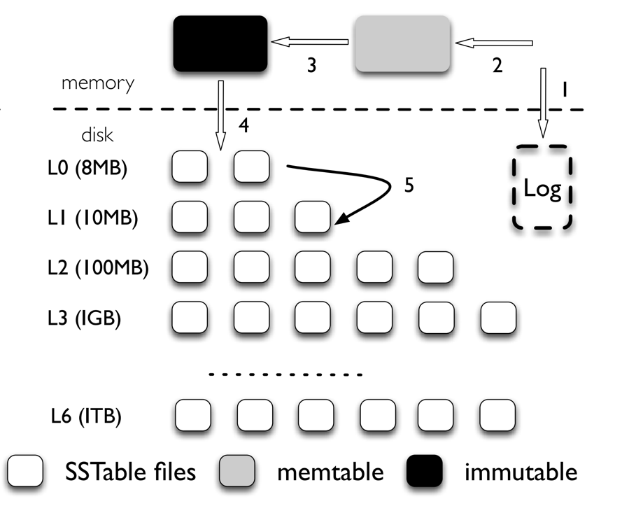

## Introduction

[LevelDB](https://github.com/google/leveldb) 是 Google 开发的一个快速键值存储库，提供从字符串键到字符串值的有序映射。
LevelDB 是一个基于 [LSMtrees](/docs/CS/Algorithms/tree/LSM.md) 的广泛使用的键值存储，其灵感来源于 [BigTable](/docs/CS/Distributed/Bigtable.md)。
LevelDB 支持范围查询、快照以及其他在现代应用程序中有用的特性。

## Architecture

LevelDB 的整体架构如图 1 所示。

<div style="text-align: center;">



</div>

<p style="text-align: center;">
Fig.1. LevelDB architecture.
<br>
对于 LevelDB，插入一个键值对需要经过多个步骤：(1) 日志文件；(2) memtable；(3) 不可变 memtable；(4) L0 中的 SSTable；(5) 压缩到更深的层级。
</p>

LevelDB 的主要数据结构包括一个磁盘日志文件、两个内存中的有序跳表（memtable 和不可变 memtable），以及七个级别（L0 到 L6）的磁盘 Sorted String Table（SSTable）文件。
LevelDB 初始时将插入的键值对存储在日志文件和内存中的 memtable 中。
一旦 memtable 满了，LevelDB 会切换到新的 memtable 和日志文件来处理后续的用户插入。
在后台，之前的 memtable 被转换为不可变 memtable，然后压缩线程将其刷新到磁盘，在级别 0（L0）生成一个新的 SSTable 文件（通常约为 2 MB）；之前的日志文件被丢弃。
每个级别的所有文件大小都有限制，并随级别编号以十倍因子增加。
例如，L1 所有文件的大小限制为 10 MB，而 L2 的限制为 100 MB。
为了维持大小限制，一旦级别 Li 的总大小超过其限制，压缩线程将从 Li 中选择一个文件，与 Li+1 中所有重叠的文件进行合并排序，并生成新的 Li+1 SSTable 文件。
压缩线程持续工作，直到所有级别都在其大小限制之内。
此外，在压缩过程中，LevelDB 确保特定级别中除 L0 外的所有文件在其键范围内不重叠；L0 中的文件键可以相互重叠，因为它们是从 memtable 直接刷新的。

为了执行查找操作，LevelDB 首先搜索 memtable，然后是不可变 memtable，最后按顺序搜索 L0 到 L6 的文件。
定位随机键所需的文件搜索次数受最大级别数的限制，因为除 L0 外，单个级别内的文件键不重叠。
由于 L0 中的文件可能包含重叠的键，一次查找可能会搜索 L0 中的多个文件。
为了避免较大的查找延迟，如果 L0 中的文件数大于 8，LevelDB 会减慢前台写入流量，以等待压缩线程将一些文件从 L0 压缩到 L1。

## Data Types

键和值是任意字节数组。键在键值存储内根据用户指定的比较器函数进行排序。

### Slice

```c
class LEVELDB_EXPORT Slice {
 public:
  // Create an empty slice.
  Slice() : data_(""), size_(0) {}

  // Create a slice that refers to d[0,n-1].
  Slice(const char* d, size_t n) : data_(d), size_(n) {}

  // Create a slice that refers to the contents of "s"
  Slice(const std::string& s) : data_(s.data()), size_(s.size()) {}

  // Create a slice that refers to s[0,strlen(s)-1]
  Slice(const char* s) : data_(s), size_(strlen(s)) {}

  // Intentionally copyable.
  Slice(const Slice&) = default;
  Slice& operator=(const Slice&) = default;

  // Return a pointer to the beginning of the referenced data
  const char* data() const { return data_; }

  // Return the length (in bytes) of the referenced data
  size_t size() const { return size_; }

  // Return true iff the length of the referenced data is zero
  bool empty() const { return size_ == 0; }

  // Return the ith byte in the referenced data.
  // REQUIRES: n < size()
  char operator[](size_t n) const {
    assert(n < size());
    return data_[n];
  }

  // Change this slice to refer to an empty array
  void clear() {
    data_ = "";
    size_ = 0;
  }

  // Drop the first "n" bytes from this slice.
  void remove_prefix(size_t n) {
    assert(n <= size());
    data_ += n;
    size_ -= n;
  }

  // Return a string that contains the copy of the referenced data.
  std::string ToString() const { return std::string(data_, size_); }

  // Three-way comparison.  Returns value:
  //   <  0 iff "*this" <  "b",
  //   == 0 iff "*this" == "b",
  //   >  0 iff "*this" >  "b"
  int compare(const Slice& b) const;

  // Return true iff "x" is a prefix of "*this"
  bool starts_with(const Slice& x) const {
    return ((size_ >= x.size_) && (memcmp(data_, x.data_, x.size_) == 0));
  }

 private:
  const char* data_;
  size_t size_;
};
```

Code

```c
  enum Code {
    kOk = 0,
    kNotFound = 1,
    kCorruption = 2,
    kNotSupported = 3,
    kInvalidArgument = 4,
    kIOError = 5
  };
```

### Comparator

Comparator 对象提供了在用作 sstable 或数据库中键的切片之间的全序关系。
Comparator 实现必须是线程安全的，因为 leveldb 可能会从多个线程并发调用其方法。

```c
class LEVELDB_EXPORT Comparator {
 public:
  virtual ~Comparator();

  // Three-way comparison.  Returns value:
  //   < 0 iff "a" < "b",
  //   == 0 iff "a" == "b",
  //   > 0 iff "a" > "b"
  virtual int Compare(const Slice& a, const Slice& b) const = 0;

  // The name of the comparator.  Used to check for comparator
  // mismatches (i.e., a DB created with one comparator is
  // accessed using a different comparator.
  //
  // The client of this package should switch to a new name whenever
  // the comparator implementation changes in a way that will cause
  // the relative ordering of any two keys to change.
  //
  // Names starting with "leveldb." are reserved and should not be used
  // by any clients of this package.
  virtual const char* Name() const = 0;

  // Advanced functions: these are used to reduce the space requirements
  // for internal data structures like index blocks.

  // If *start < limit, changes *start to a short string in [start,limit).
  // Simple comparator implementations may return with *start unchanged,
  // i.e., an implementation of this method that does nothing is correct.
  virtual void FindShortestSeparator(std::string* start,
                                     const Slice& limit) const = 0;

  // Changes *key to a short string >= *key.
  // Simple comparator implementations may return with *key unchanged,
  // i.e., an implementation of this method that does nothing is correct.
  virtual void FindShortSuccessor(std::string* key) const = 0;
};
```

### Iterator

```c

class LEVELDB_EXPORT Iterator {
 public:
  Iterator();

  Iterator(const Iterator&) = delete;
  Iterator& operator=(const Iterator&) = delete;

  virtual ~Iterator();

  // An iterator is either positioned at a key/value pair, or
  // not valid.  This method returns true iff the iterator is valid.
  virtual bool Valid() const = 0;

  // Position at the first key in the source.  The iterator is Valid()
  // after this call iff the source is not empty.
  virtual void SeekToFirst() = 0;

  // Position at the last key in the source.  The iterator is
  // Valid() after this call iff the source is not empty.
  virtual void SeekToLast() = 0;

  // Position at the first key in the source that is at or past target.
  // The iterator is Valid() after this call iff the source contains
  // an entry that comes at or past target.
  virtual void Seek(const Slice& target) = 0;

  // Moves to the next entry in the source.  After this call, Valid() is
  // true iff the iterator was not positioned at the last entry in the source.
  // REQUIRES: Valid()
  virtual void Next() = 0;

  // Moves to the previous entry in the source.  After this call, Valid() is
  // true iff the iterator was not positioned at the first entry in source.
  // REQUIRES: Valid()
  virtual void Prev() = 0;

  // Return the key for the current entry.  The underlying storage for
  // the returned slice is valid only until the next modification of
  // the iterator.
  // REQUIRES: Valid()
  virtual Slice key() const = 0;

  // Return the value for the current entry.  The underlying storage for
  // the returned slice is valid only until the next modification of
  // the iterator.
  // REQUIRES: Valid()
  virtual Slice value() const = 0;

  // If an error has occurred, return it.  Else return an ok status.
  virtual Status status() const = 0;

  // Clients are allowed to register function/arg1/arg2 triples that
  // will be invoked when this iterator is destroyed.
  //
  // Note that unlike all of the preceding methods, this method is
  // not abstract and therefore clients should not override it.
  using CleanupFunction = void (*)(void* arg1, void* arg2);
  void RegisterCleanup(CleanupFunction function, void* arg1, void* arg2);

 private:
  // Cleanup functions are stored in a single-linked list.
  // The list's head node is inlined in the iterator.
  struct CleanupNode {
    // True if the node is not used. Only head nodes might be unused.
    bool IsEmpty() const { return function == nullptr; }
    // Invokes the cleanup function.
    void Run() {
      assert(function != nullptr);
      (*function)(arg1, arg2);
    }

    // The head node is used if the function pointer is not null.
    CleanupFunction function;
    void* arg1;
    void* arg2;
    CleanupNode* next;
  };
  CleanupNode cleanup_head_;
};
```

### Status

你可能已经注意到上面的 `leveldb::Status` 类型。
leveldb 中大多数可能遇到错误的函数都返回此类型的值。
你可以检查结果是否正常，并打印相关的错误消息：

```c++
leveldb::Status s = ...;
if (!s.ok()) cerr << s.ToString() << endl;
```

## Operations

### Open

leveldb 数据库有一个名称，对应于文件系统目录。
数据库的所有内容都存储在此目录中。
以下示例展示了如何打开一个数据库，并在必要时创建它：

```c++
#include <cassert>
#include "leveldb/db.h"

leveldb::DB* db;
leveldb::Options options;
options.create_if_missing = true;
leveldb::Status status = leveldb::DB::Open(options, "/tmp/testdb", &db);
assert(status.ok());
...
```

```cpp
// db_impl.cc
Status DB::Open(const Options& options, const std::string& dbname, DB** dbptr) {
  *dbptr = nullptr;

  DBImpl* impl = new DBImpl(options, dbname);
  impl->mutex_.Lock();
  VersionEdit edit;
  // Recover handles create_if_missing, error_if_exists
  bool save_manifest = false;
  Status s = impl->Recover(&edit, &save_manifest);
  if (s.ok() && impl->mem_ == nullptr) {
    // Create new log and a corresponding memtable.
    uint64_t new_log_number = impl->versions_->NewFileNumber();
    WritableFile* lfile;
    s = options.env->NewWritableFile(LogFileName(dbname, new_log_number),
                                     &lfile);
    if (s.ok()) {
      edit.SetLogNumber(new_log_number);
      impl->logfile_ = lfile;
      impl->logfile_number_ = new_log_number;
      impl->log_ = new log::Writer(lfile);
      impl->mem_ = new MemTable(impl->internal_comparator_);
      impl->mem_->Ref();
    }
  }
  if (s.ok() && save_manifest) {
    edit.SetPrevLogNumber(0);  // No older logs needed after recovery.
    edit.SetLogNumber(impl->logfile_number_);
    s = impl->versions_->LogAndApply(&edit, &impl->mutex_);
  }
  if (s.ok()) {
    impl->RemoveObsoleteFiles();
    impl->MaybeScheduleCompaction();
  }
  impl->mutex_.Unlock();
  if (s.ok()) {
    assert(impl->mem_ != nullptr);
    *dbptr = impl;
  } else {
    delete impl;
  }
  return s;
}
```

### Get

```cpp

Status DBImpl::Get(const ReadOptions& options, const Slice& key,
                   std::string* value) {
  Status s;
  MutexLock l(&mutex_);
  SequenceNumber snapshot;
  if (options.snapshot != nullptr) {
    snapshot =
        static_cast<const SnapshotImpl*>(options.snapshot)->sequence_number();
  } else {
    snapshot = versions_->LastSequence();
  }

  MemTable* mem = mem_;
  MemTable* imm = imm_;
  Version* current = versions_->current();
  mem->Ref();
  if (imm != nullptr) imm->Ref();
  current->Ref();

  bool have_stat_update = false;
  Version::GetStats stats;

  // Unlock while reading from files and memtables
  {
    mutex_.Unlock();
    // First look in the memtable, then in the immutable memtable (if any).
    LookupKey lkey(key, snapshot);
    if (mem->Get(lkey, value, &s)) {
      // Done
    } else if (imm != nullptr && imm->Get(lkey, value, &s)) {
      // Done
    } else {
      s = current->Get(options, lkey, value, &stats);
      have_stat_update = true;
    }
    mutex_.Lock();
  }

  if (have_stat_update && current->UpdateStats(stats)) {
    MaybeScheduleCompaction();
  }
  mem->Unref();
  if (imm != nullptr) imm->Unref();
  current->Unref();
  return s;
}
```

> [!Note]
>
> Ref() Unref()

### Put

```cpp
Status DB::Put(const WriteOptions& opt, const Slice& key, const Slice& value) {
  WriteBatch batch;
  batch.Put(key, value);
  return Write(opt, &batch);
}

void WriteBatch::Put(const Slice& key, const Slice& value) {
  WriteBatchInternal::SetCount(this, WriteBatchInternal::Count(this) + 1);
  rep_.push_back(static_cast<char>(kTypeValue));
  PutLengthPrefixedSlice(&rep_, key);
  PutLengthPrefixedSlice(&rep_, value);
}

void PutLengthPrefixedSlice(std::string* dst, const Slice& value) {
  PutVarint32(dst, value.size());
  dst->append(value.data(), value.size());
}


```

#### write

```cpp
Status DBImpl::Write(const WriteOptions& options, WriteBatch* updates) {
  Writer w(&mutex_);
  w.batch = updates;
  w.sync = options.sync;
  w.done = false;

  MutexLock l(&mutex_);
  writers_.push_back(&w);
  while (!w.done && &w != writers_.front()) {
    w.cv.Wait();
  }
  if (w.done) {
    return w.status;
  }

  // May temporarily unlock and wait.
  Status status = MakeRoomForWrite(updates == nullptr);
  uint64_t last_sequence = versions_->LastSequence();
  Writer* last_writer = &w;
  if (status.ok() && updates != nullptr) {  // nullptr batch is for compactions
    WriteBatch* write_batch = BuildBatchGroup(&last_writer);
    WriteBatchInternal::SetSequence(write_batch, last_sequence + 1);
    last_sequence += WriteBatchInternal::Count(write_batch);

    // Add to log and apply to memtable.  We can release the lock
    // during this phase since &w is currently responsible for logging
    // and protects against concurrent loggers and concurrent writes
    // into mem_.
    {
      mutex_.Unlock();
      status = log_->AddRecord(WriteBatchInternal::Contents(write_batch));
      bool sync_error = false;
      if (status.ok() && options.sync) {
        status = logfile_->Sync();
        if (!status.ok()) {
          sync_error = true;
        }
      }
      if (status.ok()) {
        status = WriteBatchInternal::InsertInto(write_batch, mem_);
      }
      mutex_.Lock();
      if (sync_error) {
        // The state of the log file is indeterminate: the log record we
        // just added may or may not show up when the DB is re-opened.
        // So we force the DB into a mode where all future writes fail.
        RecordBackgroundError(status);
      }
    }
    if (write_batch == tmp_batch_) tmp_batch_->Clear();

    versions_->SetLastSequence(last_sequence);
  }

  while (true) {
    Writer* ready = writers_.front();
    writers_.pop_front();
    if (ready != &w) {
      ready->status = status;
      ready->done = true;
      ready->cv.Signal();
    }
    if (ready == last_writer) break;
  }

  // Notify new head of write queue
  if (!writers_.empty()) {
    writers_.front()->cv.Signal();
  }

  return status;
}
```

### Delete

```c
Status DB::Delete(const WriteOptions& opt, const Slice& key) {
  WriteBatch batch;
  batch.Delete(key);
  return Write(opt, &batch);
}

void WriteBatch::Delete(const Slice& key) {
  WriteBatchInternal::SetCount(this, WriteBatchInternal::Count(this) + 1);
  rep_.push_back(static_cast<char>(kTypeDeletion));
  PutLengthPrefixedSlice(&rep_, key);
}

void PutLengthPrefixedSlice(std::string* dst, const Slice& value) {
  PutVarint32(dst, value.size());
  dst->append(value.data(), value.size());
}

basic_string&
append(const _CharT* __s, size_type __n) {
  __glibcxx_requires_string_len(__s, __n);
  _M_check_length(size_type(0), __n, "basic_string::append");
  return _M_append(__s, __n);
}
```

### File

RandomAccessFile

SequentialFile

WritableFile

## Cache

数据库的内容存储在文件系统中的一组文件中，每个文件存储一系列压缩块。
如果 options.block_cache 非 NULL，则用于缓存常用的未压缩块内容。

```c++
#include "leveldb/cache.h"

leveldb::Options options;
options.block_cache = leveldb::NewLRUCache(100 * 1048576);  // 100MB cache
leveldb::DB* db;
leveldb::DB::Open(options, name, &db);
... use the db ...
delete db
delete options.block_cache;
```

注意，缓存保存的是未压缩数据，因此应根据应用程序级别的数据大小进行调整，无需考虑压缩带来的缩减。
（压缩块的缓存留给操作系统缓冲缓存或客户端提供的任何自定义 Env 实现。）

当执行批量读取时，应用程序可能希望禁用缓存，以便批量读取处理的数据不会置换掉大部分缓存内容。
可以通过每个迭代器的选项来实现：

```c++
leveldb::ReadOptions options;
options.fill_cache = false;
leveldb::Iterator* it = db->NewIterator(options);
for (it->SeekToFirst(); it->Valid(); it->Next()) {
  ...
}
delete it;
```

## Compress

Snappy

## Write-Ahead Log

addRecord

readRecord

recoverLogFile

## MemTable

### add MemTable

```cpp

void MemTable::Add(SequenceNumber s, ValueType type, const Slice& key,
                   const Slice& value) {
  // Format of an entry is concatenation of:
  //  key_size     : varint32 of internal_key.size()
  //  key bytes    : char[internal_key.size()]
  //  tag          : uint64((sequence << 8) | type)
  //  value_size   : varint32 of value.size()
  //  value bytes  : char[value.size()]
  size_t key_size = key.size();
  size_t val_size = value.size();
  size_t internal_key_size = key_size + 8;
  const size_t encoded_len = VarintLength(internal_key_size) +
                             internal_key_size + VarintLength(val_size) +
                             val_size;
  char* buf = arena_.Allocate(encoded_len);
  char* p = EncodeVarint32(buf, internal_key_size);
  std::memcpy(p, key.data(), key_size);
  p += key_size;
  EncodeFixed64(p, (s << 8) | type);
  p += 8;
  p = EncodeVarint32(p, val_size);
  std::memcpy(p, value.data(), val_size);
  assert(p + val_size == buf + encoded_len);
  table_.Insert(buf);
}
```

### get MemTable

```c
bool MemTable::Get(const LookupKey& key, std::string* value, Status* s) {
  Slice memkey = key.memtable_key();
  Table::Iterator iter(&table_);
  iter.Seek(memkey.data());
  if (iter.Valid()) {
    // entry format is:
    //    klength  varint32
    //    userkey  char[klength]
    //    tag      uint64
    //    vlength  varint32
    //    value    char[vlength]
    // Check that it belongs to same user key.  We do not check the
    // sequence number since the Seek() call above should have skipped
    // all entries with overly large sequence numbers.
    const char* entry = iter.key();
    uint32_t key_length;
    const char* key_ptr = GetVarint32Ptr(entry, entry + 5, &key_length);
    if (comparator_.comparator.user_comparator()->Compare(
            Slice(key_ptr, key_length - 8), key.user_key()) == 0) {
      // Correct user key
      const uint64_t tag = DecodeFixed64(key_ptr + key_length - 8);
      switch (static_cast<ValueType>(tag & 0xff)) {
        case kTypeValue: {
          Slice v = GetLengthPrefixedSlice(key_ptr + key_length);
          value->assign(v.data(), v.size());
          return true;
        }
        case kTypeDeletion:
          *s = Status::NotFound(Slice());
          return true;
      }
    }
  }
  return false;
}
```

### SkipList

MaxHeight = 12

Random() % 4 = 0

| Height | Probability         |
| -------- | --------------------- |
| 1      | $3/4$               |
| 2      | $3/4 * 1/4$         |
| 3      | $3/4 * (1/4)^(4-2)$ |
| n      | $3/4 * (1/4)^(n-2)$ |

```cpp
enum { kMaxHeight = 12 };


template <typename Key, class Comparator>
int SkipList<Key, Comparator>::RandomHeight() {
  // Increase height with probability 1 in kBranching
  static const unsigned int kBranching = 4;
  int height = 1;
  while (height < kMaxHeight && rnd_.OneIn(kBranching)) {
    height++;
  }
  return height;
}
```

### Seek

## SSTable

### WriteLevel0Table

BlockBuilder

### TableBuilder

Build Table

```cpp

Status BuildTable(const std::string& dbname, Env* env, const Options& options,
                  TableCache* table_cache, Iterator* iter, FileMetaData* meta) {
  Status s;
  meta->file_size = 0;
  iter->SeekToFirst();

  std::string fname = TableFileName(dbname, meta->number);
  if (iter->Valid()) {
    WritableFile* file;
    s = env->NewWritableFile(fname, &file);
    if (!s.ok()) {
      return s;
    }

    TableBuilder* builder = new TableBuilder(options, file);
    meta->smallest.DecodeFrom(iter->key());
    Slice key;
    for (; iter->Valid(); iter->Next()) {
      key = iter->key();
      builder->Add(key, iter->value());
    }
    if (!key.empty()) {
      meta->largest.DecodeFrom(key);
    }

    // Finish and check for builder errors
    s = builder->Finish();
    if (s.ok()) {
      meta->file_size = builder->FileSize();
      assert(meta->file_size > 0);
    }
    delete builder;

    // Finish and check for file errors
    if (s.ok()) {
      s = file->Sync();
    }
    if (s.ok()) {
      s = file->Close();
    }
    delete file;
    file = nullptr;

    if (s.ok()) {
      // Verify that the table is usable
      Iterator* it = table_cache->NewIterator(ReadOptions(), meta->number,
                                              meta->file_size);
      s = it->status();
      delete it;
    }
  }

  // Check for input iterator errors
  if (!iter->status().ok()) {
    s = iter->status();
  }

  if (s.ok() && meta->file_size > 0) {
    // Keep it
  } else {
    env->RemoveFile(fname);
  }
  return s;
}
```

### FilterPolicy

BloomFilter

## Compression

BackgroundCompaction

DoCompaction

## Links

- [DataBases](/docs/CS/DB/DB.md?id=LevelDB)
- [RocksDB](/docs/CS/DB/RocksDB/RocksDB.md)

## References

1. []
