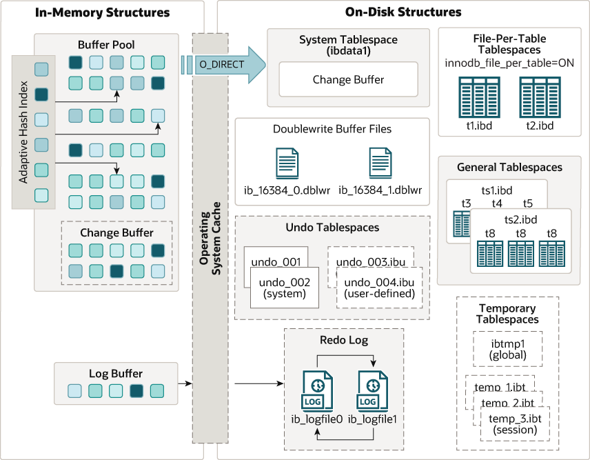

## Introduction

`InnoDB` is a general-purpose storage engine that balances high reliability and high performance.
In MySQL 8.0, `InnoDB` is the default MySQL storage engine.
Unless you have configured a different default storage engine, issuing a `CREATE TABLE` statement without an `ENGINE` clause creates an `InnoDB` table.

### Key Advantages of InnoDB

- Its DML operations follow the ACID model, with transactions featuring commit, rollback, and crash-recovery capabilities to protect user data.
- Row-level locking and Oracle-style consistent reads increase multi-user concurrency and performance.
- `InnoDB` tables arrange your data on disk to optimize queries based on primary keys.
  Each `InnoDB` table has a primary key index called the clustered index that organizes the data to minimize I/O for primary key lookups.
- To maintain data integrity, `InnoDB` supports `FOREIGN KEY` constraints. With foreign keys, inserts, updates, and deletes are checked to ensure they do not result in inconsistencies across related tables.

**InnoDB Storage Engine Features**


|                                                                                           Feature | Support                                                                                                                 |
| ------------------------------------------------------------------------------------------------: | :---------------------------------------------------------------------------------------------------------------------- |
|                                                                                **B-tree indexes** | Yes                                                                                                                     |
| **Backup/point-in-time recovery** (Implemented in the server, rather than in the storage engine.) | Yes                                                                                                                     |
|                                                                      **Cluster database support** | No                                                                                                                      |
|                                                                             **Clustered indexes** | Yes                                                                                                                     |
|                                                                               **Compressed data** | Yes                                                                                                                     |
|                                                                                   **Data caches** | Yes                                                                                                                     |
|                                                                                **Encrypted data** | Yes (Implemented in the server via encryption functions; In MySQL 5.7 and later, data-at-rest encryption is supported.) |
|                                                                           **Foreign key support** | Yes                                                                                                                     |
|                                                                      **Full-text search indexes** | Yes (Support for FULLTEXT indexes is available in MySQL 5.6 and later.)                                                 |
|                                                                  **Geospatial data type support** | Yes                                                                                                                     |
|                                                                   **Geospatial indexing support** | Yes (Support for geospatial indexing is available in MySQL 5.7 and later.)                                              |
|                                                                                  **Hash indexes** | No (InnoDB utilizes hash indexes internally for its Adaptive Hash Index feature.)                                       |
|                                                                                  **Index caches** | Yes                                                                                                                     |
|                                                                           **Locking granularity** | Row                                                                                                                     |
|                                                                                          **MVCC** | Yes                                                                                                                     |
|           **Replication support** (Implemented in the server, rather than in the storage engine.) | Yes                                                                                                                     |
|                                                                                **Storage limits** | 64TB                                                                                                                    |
|                                                                                **T-tree indexes** | No                                                                                                                      |
|                                                                                  **Transactions** | Yes                                                                                                                     |
|                                                         **Update statistics for data dictionary** | Yes                                                                                                                     |

[InnoDB Locking and Transaction Model](/docs/CS/DB/MySQL/Transaction.md)

```sql
mysql>SHOW VARIABLES LIKE 'innodb_version'; --8.0.33
mysql>SHOW ENGINE INNODB STATUS;
```

## Architecture

The following diagram shows in-memory and on-disk structures that comprise the `InnoDB` storage engine architecture.

<div style="text-align: center;">



</div>

<p style="text-align: center;">
Fig.1. InnoDB Architecture.
</p>

By default, InnoDB stores its data in a series of datafiles that are collectively known as a tablespace.
A tablespace is essentially a black box that InnoDB manages all by itself.

InnoDB uses MVCC to achieve high concurrency, and it implements all four SQL standard isolation levels.
It defaults to the REPEATABLE READ isolation level, and it has a next-key locking strategy that prevents phantom reads in this isolation level:
rather than locking only the rows you’ve touched in a query, InnoDB locks gaps in the index structure as well, preventing phantoms from being inserted.

InnoDB tables are built on a clustered index, which we will cover in detail in Chap‐ ter 8 when we discuss schema design.
InnoDB’s index structures are very different from those of most other MySQL storage engines.
As a result, it provides very fast primary key lookups.
However, secondary indexes (indexes that aren’t the primary key) contain the primary key columns, so if your primary key is large, other indexes will also be large.
You should strive for a small primary key if you’ll have many indexes on a table.

InnoDB has a variety of internal optimizations.
These include predictive read-ahead for prefetching data from disk, an adaptive hash index that automatically builds hash indexes in memory for very fast lookups, and an insert buffer to speed inserts.

### [InnoDB In-Memory Structures](/docs/CS/DB/MySQL/memory.md)

### InnoDB On-Disk Structures

- [Tables](https://dev.mysql.com/doc/refman/8.0/en/innodb-tables.html)
- [Tablespaces](/docs/CS/DB/MySQL/tablespace.md)
- [Indexes](/docs/CS/DB/MySQL/Index.md)
- [Redo Log](/docs/CS/DB/MySQL/redolog.md)
- [Undo Log](/docs/CS/DB/MySQL/undolog.md)
- [Doublewrite Buffer](/docs/CS/DB/MySQL/Double-Buffer.md)

innodb shutdown handler
innodb purge coordinator
innodb purge worker * 3

max_delayed_threads 20
thread_stack 299008

thread_pool_idle_timeout 60
thread_pool_max_threads 65536
innodb_purge_threads 4
innodb_write_io_threads 4
innodb_read_io_threads 4
innodb_undo_logs 128

innodb_adaptive_hash_index_parts 8
innodb_adaptive_hash_index ON

innodb_old_blocks_pct 37  — 3/8
innodb_old_blocks_time	1000

## Thread Model

### Master Thread

```
// using SHOW ENGINE INNODB STATUS;
srv_master_thread loops: 177 srv_active, 0 srv_shutdown, 2772864 srv_idle
srv_master_thread log flush and writes: 2773038
```

```cpp
// srv0srv.cc
/** The master thread controlling the server. */
void srv_master_thread() {

  srv_slot_t *slot;

  THD *thd = create_thd(false, true, true, 0);

  ut_ad(!srv_read_only_mode);

  srv_main_thread_process_no = os_proc_get_number();
  srv_main_thread_id = std::this_thread::get_id();

  slot = srv_reserve_slot(SRV_MASTER);
  ut_a(slot == srv_sys->sys_threads);

  srv_master_main_loop(slot);

  srv_master_pre_dd_shutdown_loop();

  os_event_set(srv_threads.m_master_ready_for_dd_shutdown);

  /* This is just for test scenarios. */
  srv_thread_delay_cleanup_if_needed(true);

  while (srv_shutdown_state.load() < SRV_SHUTDOWN_MASTER_STOP) {
    srv_master_wait(slot);
  }

  srv_master_shutdown_loop();

  srv_main_thread_op_info = “exiting”;
  destroy_thd(thd);
}
```

#### main loop

```cpp

/** Executes the main loop of the master thread.
@param[in]   slot     slot reserved as SRV_MASTER */
static void srv_master_main_loop(srv_slot_t *slot) {
  if (srv_force_recovery >= SRV_FORCE_NO_BACKGROUND) {
    /* When innodb_force_recovery is at least SRV_FORCE_NO_BACKGROUND,
    we avoid performing active/idle master’s tasks. However, we still
    need to ensure that:
      srv_shutdown_state >= SRV_SHUTDOWN_PRE_DD_AND_SYSTEM_TRANSACTIONS,
    after we exited srv_master_main_loop(). Keep waiting until that
    is satisfied and then exit. */
    while (srv_shutdown_state.load() <
           SRV_SHUTDOWN_PRE_DD_AND_SYSTEM_TRANSACTIONS) {
      srv_master_wait(slot);
    }
    return;
  }

  ulint old_activity_count = srv_get_activity_count();

  while (srv_shutdown_state.load() <
         SRV_SHUTDOWN_PRE_DD_AND_SYSTEM_TRANSACTIONS) {
    srv_master_sleep();

    MONITOR_INC(MONITOR_MASTER_THREAD_SLEEP);

    /* Just in case - if there is not much free space in redo,
    try to avoid asking for troubles because of extra work
    performed in such background thread. */
    srv_main_thread_op_info = “checking free log space”;
    log_free_check();

    if (srv_check_activity(old_activity_count)) {
      old_activity_count = srv_get_activity_count();
      srv_master_do_active_tasks();
    } else {
      srv_master_do_idle_tasks();
    }

    /* Let clone wait when redo/undo log encryption is set. If clone is already
    in progress we skip the check and come back later. */
    if (!clone_mark_wait()) {
      continue;
    }

    /* Allow any blocking clone to progress. */
    clone_mark_free();

    /* Purge any deleted tablespace pages. */
    fil_purge();
  }
}
```

#### srv_master_do_idle_tasks

per 10 seconds

- flush log buffer
- merge max 5 change buffer
- flush max 100 buffer pool pages(might)
- purge unused undo log

#### srv_master_do_active_tasks

per second

- flush log buffer
- merge change buffer(might)
- flush max 100 buffer pool pages(might)
- jump into background loop

```cpp

/** Perform the tasks that the master thread is supposed to do when the
 server is active. There are two types of tasks. The first category is
 of such tasks which are performed at each inovcation of this function.
 We assume that this function is called roughly every second when the
 server is active. The second category is of such tasks which are
 performed at some interval e.g.: purge, dict_LRU cleanup etc. */
static void srv_master_do_active_tasks(void) {
  const auto cur_time = ut_time_monotonic();
  auto counter_time = ut_time_monotonic_us();

  /* First do the tasks that we are suppose to do at each
  invocation of this function. */

  ++srv_main_active_loops;

  MONITOR_INC(MONITOR_MASTER_ACTIVE_LOOPS);

  /* ALTER TABLE in MySQL requires on Unix that the table handler
  can drop tables lazily after there no longer are SELECT
  queries to them. */
  srv_main_thread_op_info = “doing background drop tables”;
  row_drop_tables_for_mysql_in_background();
  MONITOR_INC_TIME_IN_MICRO_SECS(MONITOR_SRV_BACKGROUND_DROP_TABLE_MICROSECOND,
                                 counter_time);

  ut_d(srv_master_do_disabled_loop());

  if (srv_shutdown_state.load() >=
      SRV_SHUTDOWN_PRE_DD_AND_SYSTEM_TRANSACTIONS) {
    return;
  }

  /* Do an ibuf merge */
  srv_main_thread_op_info = “doing insert buffer merge”;
  counter_time = ut_time_monotonic_us();
  ibuf_merge_in_background(false);
  MONITOR_INC_TIME_IN_MICRO_SECS(MONITOR_SRV_IBUF_MERGE_MICROSECOND,
                                 counter_time);

  /* Flush logs if needed */
  log_buffer_sync_in_background();

  /* Now see if various tasks that are performed at defined
  intervals need to be performed. */

  if (srv_shutdown_state.load() >=
      SRV_SHUTDOWN_PRE_DD_AND_SYSTEM_TRANSACTIONS) {
    return;
  }

  srv_update_cpu_usage();

  if (trx_sys->rseg_history_len.load() > 0) {
    srv_wake_purge_thread_if_not_active();
  }

  if (cur_time % SRV_MASTER_DICT_LRU_INTERVAL == 0) {
    srv_main_thread_op_info = “enforcing dict cache limit”;
    ulint n_evicted = srv_master_evict_from_table_cache(50);
    if (n_evicted != 0) {
      MONITOR_INC_VALUE(MONITOR_SRV_DICT_LRU_EVICT_COUNT, n_evicted);
    }
    MONITOR_INC_TIME_IN_MICRO_SECS(MONITOR_SRV_DICT_LRU_MICROSECOND,
                                   counter_time);
  }
}
```

### IO Thread

```sql
mysql>SHOW VARIABLES LIKE 'innodb_%_io_threads';
-- innodb_read_io_threads	4
-- innodb_write_io_threads	4

mysql>SHOW ENGINE INNODB STATUS;
-- --------
-- FILE I/O
-- --------
-- I/O thread 0 state: waiting for i/o request ((null))
-- I/O thread 1 state: waiting for i/o request (insert buffer thread)
-- I/O thread 2 state: waiting for i/o request (read thread)
-- I/O thread 3 state: waiting for i/o request (read thread)
-- I/O thread 4 state: waiting for i/o request (read thread)
-- I/O thread 5 state: waiting for i/o request (read thread)
-- I/O thread 6 state: waiting for i/o request (write thread)
-- I/O thread 7 state: waiting for i/o request (write thread)
-- I/O thread 8 state: waiting for i/o request (write thread)
```

### Purge Thread

```sql
mysql>SHOW VARIABLES LIKE 'innodb_purge_threads';
-- innodb_purge_threads	4
innodb_purge_batch_size	300
innodb_purge_rseg_truncate_frequency	128
```

```cpp

void fil_purge() { fil_system->purge(); }

/** Clean up the shards. */
void purge() {
  for (auto shard : m_shards) {
    shard->purge();
  }
}


/** Purge entries from m_deleted_spaces that are no longer referenced by a
buffer pool page. This is no longer required to be done during checkpoint -
this is done here for historical reasons - it has to be done periodically
somewhere. */
void purge() {
  /* Avoid cleaning up old undo files while this is on. */
  DBUG_EXECUTE_IF(“ib_undo_trunc_checkpoint_off”, return;);

  mutex_acquire();
  for (auto it = m_deleted_spaces.begin(); it != m_deleted_spaces.end();) {
    auto space = it->second;

    if (space->has_no_references()) {
      ut_a(space->files.front().n_pending == 0);

      space_free_low(space);

      it = m_deleted_spaces.erase(it);
    } else {
      ++it;
    }
  }

  mutex_release();
}  
  
  
/** Free a tablespace object on which fil_space_detach() was invoked.
There must not be any pending I/O’s or flushes on the files.
@param[in,out]	space		tablespace */
void Fil_shard::space_free_low(fil_space_t *&space) {
#ifndef UNIV_HOTBACKUP
  {
    /* Temporary and undo tablespaces IDs are assigned from a large but
    fixed size pool of reserved IDs. Therefore we must ensure that a
    fil_space_t instance can’t be dropped until all the pages that point
    to it are also purged from the buffer pool. */

    ut_a(srv_shutdown_state.load() == SRV_SHUTDOWN_LAST_PHASE ||
         space->has_no_references());
  }
#endif /* !UNIV_HOTBACKUP */

  for (auto &file : space->files) {
    ut_d(space->size -= file.size);

    os_event_destroy(file.sync_event);

    ut_free(file.name);
  }

  call_destructor(&space->files);

  ut_ad(space->size == 0);

  rw_lock_free(&space->latch);
  ut_free(space->name);
  ut_free(space);

  space = nullptr;
}
  
```

## Storage

### Disk I/O

InnoDB uses asynchronous disk I/O where possible, by creating a number of threads to handle I/O operations, while permitting other database operations to proceed while the I/O is still in progress. 
On Linux and Windows platforms, InnoDB uses the available OS and library functions to perform “native” asynchronous I/O. 
On other platforms, InnoDB still uses I/O threads, but the threads may actually wait for I/O requests to complete; this technique is known as “simulated” asynchronous I/O.


### File Space Management

Pages, Extents, Segments, and Tablespaces

Each tablespace consists of database pages. Every tablespace in a MySQL instance has the same page size. 
By default, all tablespaces have a page size of 16KB; you can reduce the page size to 8KB or 4KB by specifying the innodb_page_size option when you create the MySQL instance. 
You can also increase the page size to 32KB or 64KB. For more information, refer to the innodb_page_size documentation.

The pages are grouped into extents of size 1MB for pages up to 16KB in size (64 consecutive 16KB pages, or 128 8KB pages, or 256 4KB pages). 
For a page size of 32KB, extent size is 2MB. 
For page size of 64KB, extent size is 4MB. 
The “files” inside a tablespace are called segments in InnoDB. 
(These segments are different from the rollback segment, which actually contains many tablespace segments.)

When a segment grows inside the tablespace, InnoDB allocates the first 32 pages to it one at a time. 
After that, InnoDB starts to allocate whole extents to the segment. InnoDB can add up to 4 extents at a time to a large segment to ensure good sequentiality of data.

Two segments are allocated for each index in InnoDB. One is for nonleaf nodes of the B-tree, the other is for the leaf nodes. 
Keeping the leaf nodes contiguous on disk enables better sequential I/O operations, because these leaf nodes contain the actual table data.

Some pages in the tablespace contain bitmaps of other pages, and therefore a few extents in an InnoDB tablespace cannot be allocated to segments as a whole, but only as individual pages.

When you ask for available free space in the tablespace by issuing a SHOW TABLE STATUS statement, InnoDB reports the extents that are definitely free in the tablespace.
InnoDB always reserves some extents for cleanup and other internal purposes; these reserved extents are not included in the free space.

When you delete data from a table, contracts the corresponding B-tree indexes. 
Whether the freed space becomes available for other users depends on whether the pattern of deletes frees individual pages or extents to the tablespace.
Dropping a table or deleting all rows from it is guaranteed to release the space to other users, but remember that deleted rows are physically removed only by the purge operation, 
which happens automatically some time after they are no longer needed for transaction rollbacks or consistent reads.


## Links

- [MySQL Server](/docs/CS/DB/MySQL/MySQL.md)

## References

1. [Introduction to InnoDB](https://dev.mysql.com/doc/refman/8.0/en/innodb-introduction.html)
