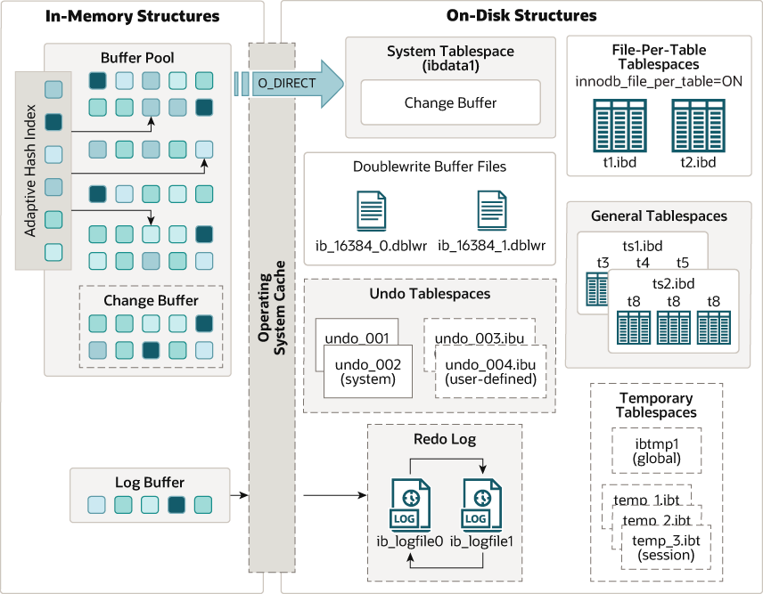

## 简介

`InnoDB` 是一个通用存储引擎，兼具高可靠性和高性能。
在 MySQL 8.0 中，`InnoDB` 是默认的 MySQL 存储引擎。
除非你配置了不同的默认存储引擎，否则在不指定 `ENGINE` 子句的情况下执行 `CREATE TABLE` 语句将创建 `InnoDB` 表。

### InnoDB 的主要优势

- 其 DML 操作遵循 ACID 模型，具有事务提交、回滚和崩溃恢复能力以保护用户数据。
- 行级锁和 Oracle 风格的一致性读提高了多用户并发性和性能。
- `InnoDB` 表在磁盘上组织数据，以优化基于主键的查询。
  每个 `InnoDB` 表都有一个称为聚簇索引的主键索引，该索引组织数据以最小化主键查找的 I/O。
- 为维护数据完整性，`InnoDB` 支持 `FOREIGN KEY` 约束。
  通过外键，插入、更新和删除操作都会被检查，以确保不会导致相关表之间的不一致。

**InnoDB 存储引擎特性**

| 特性 | 支持 |
|------|------|
| **B-tree 索引** | 是 |
| **备份/时间点恢复**（在服务器层实现，而非存储引擎层） | 是 |
| **集群数据库支持** | 否 |
| **聚簇索引** | 是 |
| **数据压缩** | 是 |
| **数据缓存** | 是 |
| **加密数据** | 是（通过加密函数在服务器层实现；MySQL 5.7 及更高版本支持静态数据加密） |
| **外键支持** | 是 |
| **全文搜索索引** | 是（MySQL 5.6 及更高版本支持 FULLTEXT 索引） |
| **地理空间数据类型支持** | 是 |
| **地理空间索引支持** | 是（MySQL 5.7 及更高版本支持地理空间索引） |
| **哈希索引** | 否（InnoDB 在其自适应哈希索引特性内部使用哈希索引） |
| **索引缓存** | 是 |
| **锁粒度** | 行 |
| **MVCC** | 是 |
| **复制支持**（在服务器层实现，而非存储引擎层） | 是 |
| **存储限制** | 64TB |
| **T-tree 索引** | 否 |
| **事务** | 是 |
| **更新数据字典统计信息** | 是 |

[InnoDB 锁和事务模型](/docs/CS/DB/MySQL/Transaction.md)

```sql
mysql>SHOW VARIABLES LIKE 'innodb_version'; --8.0.33
mysql>SHOW ENGINE INNODB STATUS;
```

## 架构

下图展示了构成 `InnoDB` 存储引擎架构的内存和磁盘结构。

<div style="text-align: center;">



</div>

<p style="text-align: center;">
Fig.1. InnoDB 架构图。
</p>

默认情况下，InnoDB 将其数据存储在一系列数据文件中，这些文件统称为表空间。
表空间本质上是一个由 InnoDB 自己管理的黑盒。

InnoDB 使用 MVCC 实现高并发，并实现了全部四个 SQL 标准隔离级别。
它默认使用 REPEATABLE READ 隔离级别，并采用 next-key 锁策略防止该隔离级别下的幻读：
InnoDB 不仅锁定查询中涉及的行，还锁定索引结构中的间隙，阻止幻影行插入。

InnoDB 表基于聚簇索引构建。
InnoDB 的索引结构与大多数其他 MySQL 存储引擎非常不同。
因此，它提供非常快的主键查找。
然而，辅助索引（非主键索引）包含主键列，因此如果你的主键很大，其他索引也会很大。
如果表上有多个索引，应尽量使用较小的主键。

InnoDB 有多种内部优化。
包括用于从磁盘预取数据的预测性预读、自动在内存中构建哈希索引以实现极快查找的自适应哈希索引，以及用于加速插入的插入缓冲区。

### InnoDB 内存结构

请参考 [InnoDB 内存结构](/docs/CS/DB/MySQL/memory.md)。

### InnoDB 磁盘结构

- [表空间](/docs/CS/DB/MySQL/tablespace.md)
- [索引](/docs/CS/DB/MySQL/Index.md)
- [重做日志](/docs/CS/DB/MySQL/redolog.md)
- [Undo 日志](/docs/CS/DB/MySQL/undolog.md)
- [双写缓冲区](/docs/CS/DB/MySQL/Double-Buffer.md)

## 线程模型

### Master 线程

```
// 使用 SHOW ENGINE INNODB STATUS;
srv_master_thread loops: 177 srv_active, 0 srv_shutdown, 2772864 srv_idle
srv_master_thread log flush and writes: 2773038
```

```cpp
// srv0srv.cc
/** 控制服务器的 master 线程。 */
void srv_master_thread() {

  srv_slot_t *slot;

  THD *thd = create_thd(false, true, true, 0);

  ut_ad(!srv_read_only_mode);

  srv_main_thread_process_no = os_proc_get_number();
  srv_main_thread_id = std::this_thread::get_id();

  slot = srv_reserve_slot(SRV_MASTER);
  ut_a(slot == srv_sys->sys_threads);

  srv_master_main_loop(slot);

  srv_master_pre_dd_shutdown_loop();

  os_event_set(srv_threads.m_master_ready_for_dd_shutdown);

  /* 仅用于测试场景。 */
  srv_thread_delay_cleanup_if_needed(true);

  while (srv_shutdown_state.load() < SRV_SHUTDOWN_MASTER_STOP) {
    srv_master_wait(slot);
  }

  srv_master_shutdown_loop();

  srv_main_thread_op_info = "exiting";
  destroy_thd(thd);
}
```

#### 主循环

```cpp

/** 执行 master 线程的主循环。
@param[in]   slot     保留为 SRV_MASTER 的槽位 */
static void srv_master_main_loop(srv_slot_t *slot) {
  if (srv_force_recovery >= SRV_FORCE_NO_BACKGROUND) {
    /* 当 innodb_force_recovery 至少为 SRV_FORCE_NO_BACKGROUND 时，
    我们避免执行 active/idle master 的任务。但仍需确保：
      srv_shutdown_state >= SRV_SHUTDOWN_PRE_DD_AND_SYSTEM_TRANSACTIONS，
    在退出 srv_master_main_loop() 之后。持续等待直到满足条件，
    然后退出。 */
    while (srv_shutdown_state.load() <
           SRV_SHUTDOWN_PRE_DD_AND_SYSTEM_TRANSACTIONS) {
      srv_master_wait(slot);
    }
    return;
  }

  ulint old_activity_count = srv_get_activity_count();

  while (srv_shutdown_state.load() <
         SRV_SHUTDOWN_PRE_DD_AND_SYSTEM_TRANSACTIONS) {
    srv_master_sleep();

    MONITOR_INC(MONITOR_MASTER_THREAD_SLEEP);

    /* 以防万一 - 如果重做日志空间不足，
    尽量避免在此类后台线程中执行额外工作引发问题。 */
    srv_main_thread_op_info = "checking free log space";
    log_free_check();

    if (srv_check_activity(old_activity_count)) {
      old_activity_count = srv_get_activity_count();
      srv_master_do_active_tasks();
    } else {
      srv_master_do_idle_tasks();
    }

    /* 当设置 redo/undo 日志加密时让克隆等待。如果克隆
    已在执行中，则跳过检查，稍后返回。 */
    if (!clone_mark_wait()) {
      continue;
    }

    /* 允许阻塞的克隆继续执行。 */
    clone_mark_free();

    /* 清理已删除的表空间页面。 */
    fil_purge();
  }
}
```

#### idle 任务

每 10 秒执行一次：

- 刷新日志缓冲区
- 合并最多 5 个 change buffer
- 刷出最多 100 个缓冲池脏页（可能）
- 清理未使用的 undo log

#### active 任务

每秒执行一次：

- 刷新日志缓冲区
- 合并 change buffer（可能）
- 刷出最多 100 个缓冲池脏页（可能）
- 进入后台循环

```cpp

/** 执行服务器活跃时 master 线程应执行的任务。
有两类任务。第一类是在每次调用此函数时都要执行的任务。
我们假设服务器活跃时此函数大约每秒调用一次。
第二类是每隔一定间隔执行的任务，例如：purge、dict_LRU 清理等。 */
static void srv_master_do_active_tasks(void) {
  const auto cur_time = ut_time_monotonic();
  auto counter_time = ut_time_monotonic_us();

  /* 首先执行每次调用此函数都应执行的任务。 */

  ++srv_main_active_loops;

  MONITOR_INC(MONITOR_MASTER_ACTIVE_LOOPS);

  /* MySQL 中的 ALTER TABLE 要求表处理器能够
  在没有 SELECT 查询引用表时延迟删除表。 */
  srv_main_thread_op_info = "doing background drop tables";
  row_drop_tables_for_mysql_in_background();
  MONITOR_INC_TIME_IN_MICRO_SECS(MONITOR_SRV_BACKGROUND_DROP_TABLE_MICROSECOND,
                                 counter_time);

  ut_d(srv_master_do_disabled_loop());

  if (srv_shutdown_state.load() >=
      SRV_SHUTDOWN_PRE_DD_AND_SYSTEM_TRANSACTIONS) {
    return;
  }

  /* 执行 ibuf 合并 */
  srv_main_thread_op_info = "doing insert buffer merge";
  counter_time = ut_time_monotonic_us();
  ibuf_merge_in_background(false);
  MONITOR_INC_TIME_IN_MICRO_SECS(MONITOR_SRV_IBUF_MERGE_MICROSECOND,
                                 counter_time);

  /* 如有需要刷新日志 */
  log_buffer_sync_in_background();

  /* 检查是否需要执行按定义间隔执行的任务。 */

  if (srv_shutdown_state.load() >=
      SRV_SHUTDOWN_PRE_DD_AND_SYSTEM_TRANSACTIONS) {
    return;
  }

  srv_update_cpu_usage();

  if (trx_sys->rseg_history_len.load() > 0) {
    srv_wake_purge_thread_if_not_active();
  }

  if (cur_time % SRV_MASTER_DICT_LRU_INTERVAL == 0) {
    srv_main_thread_op_info = "enforcing dict cache limit";
    ulint n_evicted = srv_master_evict_from_table_cache(50);
    if (n_evicted != 0) {
      MONITOR_INC_VALUE(MONITOR_SRV_DICT_LRU_EVICT_COUNT, n_evicted);
    }
    MONITOR_INC_TIME_IN_MICRO_SECS(MONITOR_SRV_DICT_LRU_MICROSECOND,
                                   counter_time);
  }
}
```

### IO 线程

```sql
mysql>SHOW VARIABLES LIKE 'innodb_%_io_threads';
-- innodb_read_io_threads	4
-- innodb_write_io_threads	4

mysql>SHOW ENGINE INNODB STATUS;
-- --------
-- FILE I/O
-- --------
-- I/O thread 0 state: waiting for i/o request ((null))
-- I/O thread 1 state: waiting for i/o request (insert buffer thread)
-- I/O thread 2 state: waiting for i/o request (read thread)
-- I/O thread 3 state: waiting for i/o request (read thread)
-- I/O thread 4 state: waiting for i/o request (read thread)
-- I/O thread 5 state: waiting for i/o request (read thread)
-- I/O thread 6 state: waiting for i/o request (write thread)
-- I/O thread 7 state: waiting for i/o request (write thread)
-- I/O thread 8 state: waiting for i/o request (write thread)
```

### Purge 线程

```sql
mysql>SHOW VARIABLES LIKE 'innodb_purge_threads';
-- innodb_purge_threads	4
innodb_purge_batch_size	300
innodb_purge_rseg_truncate_frequency	128
```

```cpp

void fil_purge() { fil_system->purge(); }

/** 清理分片。 */
void purge() {
  for (auto shard : m_shards) {
    shard->purge();
  }
}


/** 清理 m_deleted_spaces 中不再被缓冲池页面引用的条目。
这不再需要在检查点时完成 -
出于历史原因在这里完成 - 它需要周期性地在某处完成。 */
void purge() {
  /* 在此开启时避免清理旧的 undo 文件。 */
  DBUG_EXECUTE_IF("ib_undo_trunc_checkpoint_off", return;);

  mutex_acquire();
  for (auto it = m_deleted_spaces.begin(); it != m_deleted_spaces.end();) {
    auto space = it->second;

    if (space->has_no_references()) {
      ut_a(space->files.front().n_pending == 0);

      space_free_low(space);

      it = m_deleted_spaces.erase(it);
    } else {
      ++it;
    }
  }

  mutex_release();
}  


/** 释放一个已调用 fil_space_detach() 的表空间对象。
上面不能有待处理的 I/O 或刷新。
@param[in,out]	space		表空间 */
void Fil_shard::space_free_low(fil_space_t *&space) {
#ifndef UNIV_HOTBACKUP
  {
    /* 临时和 undo 表空间 ID 从一个大的但
    固定大小的保留 ID 池中分配。因此我们必须确保
    在从缓冲池中清除所有引用该 fil_space_t 的页面之前，
    不能丢弃该实例。 */

    ut_a(srv_shutdown_state.load() == SRV_SHUTDOWN_LAST_PHASE ||
         space->has_no_references());
  }
#endif /* !UNIV_HOTBACKUP */

  for (auto &file : space->files) {
    ut_d(space->size -= file.size);

    os_event_destroy(file.sync_event);

    ut_free(file.name);
  }

  call_destructor(&space->files);

  ut_ad(space->size == 0);

  rw_lock_free(&space->latch);
  ut_free(space->name);
  ut_free(space);

  space = nullptr;
}
  
```

## 存储

### 磁盘 I/O

InnoDB 尽可能使用异步磁盘 I/O，通过创建多个线程处理 I/O 操作，同时在 I/O 进行期间允许其他数据库操作继续执行。
在 Linux 和 Windows 平台上，InnoDB 使用可用的操作系统和库函数执行"原生"异步 I/O。
在其他平台上，InnoDB 仍使用 I/O 线程，但这些线程可能实际等待 I/O 请求完成；这种技术称为"模拟"异步 I/O。

### 文件空间管理

使用 `innodb_data_file_path` 配置选项在配置文件中定义的数据文件构成 InnoDB 系统表空间。
这些文件在逻辑上串联起来形成系统表空间，不涉及条带化。
你无法定义表在系统表空间中的分配位置。
在新创建的系统表空间中，InnoDB 从第一个数据文件开始分配空间。

为避免将所有表和索引存放在系统表空间内带来的问题，
可以启用 `innodb_file_per_table` 配置选项（默认启用），将每个新创建的表存储在单独的表空间文件中（扩展名为 .ibd）。
对于这样存储的表，磁盘文件内的碎片更少，当表被截断时，
空间会返回给操作系统，而不是被 InnoDB 保留在系统表空间中。

每个表一个文件的表空间包含单个 InnoDB 表的数据和索引，存储在文件系统的单个数据文件中。

你也可以将表存储在通用表空间中。
通用表空间是使用 `CREATE TABLESPACE` 语法创建的共享表空间。
它们可以在 MySQL 数据目录之外创建，能够容纳多个表，并支持所有行格式的表。

## InnoDB 限制

涵盖了 `InnoDB` 表、索引、表空间以及其他方面的限制。

- 一个表最多可包含 1017 列，包括虚拟生成列。
- 一个表最多可包含 64 个[辅助索引](/docs/CS/DB/MySQL/Index.md)。
- 对于使用 `DYNAMIC` 或 `COMPRESSED` 行格式的 `InnoDB` 表，索引键前缀长度限制为 3072 字节。
  对于使用 `REDUNDANT` 或 `COMPACT` 行格式的 `InnoDB` 表，索引键前缀长度限制为 767 字节。
  例如，假设 `utf8mb4` 字符集和每个字符最多 4 字节，你可能在 `TEXT` 或 `VARCHAR` 列上超过 191 个字符的列前缀索引时遇到此限制。
  尝试使用超过限制的索引键前缀长度将返回错误。
  如果在创建 MySQL 实例时通过指定 `innodb_page_size` 选项将 `InnoDB` 页面大小减少到 8KB 或 4KB，则索引键的最大长度会基于 16KB 页面大小的 3072 字节限制按比例降低。
  即，当页面大小为 8KB 时最大索引键长度为 1536 字节，当页面大小为 4KB 时为 768 字节。
  适用于索引键前缀的限制也适用于完整列索引键。
- 多列索引最多允许 16 列。超过此限制将返回错误。
- 对于 4KB、8KB、16KB 和 32KB 页面大小，最大行大小（不包括任何离页存储的变长列）略小于页面的一半。
- 尽管 `InnoDB` 内部支持大于 65,535 字节的行大小，但 MySQL 本身对所有列的组合大小施加了 65,535 字节的行大小限制。
- 最大表或表空间大小受服务器文件系统的影响，文件系统施加的最大文件大小可能小于 `InnoDB` 定义的内部 64 TiB 大小限制。
  例如，Linux 上的 _ext4_ 文件系统的最大文件大小为 16 TiB，因此最大表或表空间大小变为 16 TiB 而非 64 TiB。
  另一个例子是 _FAT32_ 文件系统，其最大文件大小为 4 GB。
  如果需要更大的系统表空间，请使用多个较小的数据文件而不是一个大数据文件进行配置，或者将表数据分布在每个表一个文件的数据文件和通用表空间数据文件中。
- `InnoDB` 日志文件的最大总大小为 512 GB。
- 最小表空间大小略大于 10 MB。最大表空间大小取决于 `InnoDB` 页面大小。
- 表空间文件的路径（包括文件名）不能超过 Windows 上的 `MAX_PATH` 限制。

## 链接

- [MySQL Server](/docs/CS/DB/MySQL/MySQL.md)

## 参考

1. [Introduction to InnoDB](https://dev.mysql.com/doc/refman/8.0/en/innodb-introduction.html)
