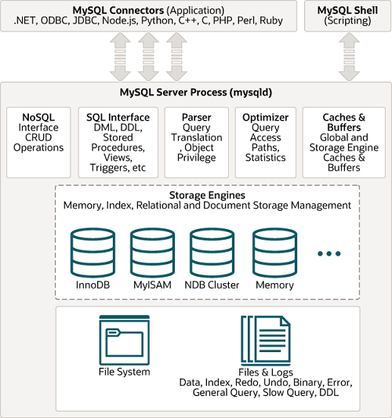

## Introduction

[MySQL Server](https://www.mysql.com/), the world's most popular open source database, and MySQL Cluster, a real-time, open source transactional database.

**Installing MySQL**

<!-- tabs:start -->

##### **Normal**

[Installing and Upgrading MySQL](https://dev.mysql.com/doc/refman/8.0/en/installing.html)

##### **Docker**

```shell
docker pull mysql:5.7
docker image ls
docker run --name test-mysql -e MYSQL_ROOT_PASSWORD=123456 -p 3306:3306 -d mysql:5.7

```

##### **K8s**

<!-- tabs:end -->


**Build from source**

<!-- tabs:start -->

Download source file and  unzip


##### **Ubuntu**

```shell
sudo apt install gcc build-essential cmake bison libncurses5-dev libssl-dev pkg-config

# cd source code root

cmake -DDOWNLOAD_BOOST=1 -DWITH_BOOST=./extra/boost -DCMAKE_BUILD_TYPE=Debug -DWITH_DEBUG=1

sudo make && make install
```

##### **MacOS**

```shell
brew install cmake gcc bison
# cd source code root
cmake -DDOWNLOAD_BOOST=1 -DWITH_BOOST=./boost -DCMAKE_BUILD_TYPE=Debug -DWITH_DEBUG=1 -DBISON_EXECUTABLE=/opt/homebrew/opt/bison/bin/bison

sudo make && make install
```


Init

```shell
./bin/mysqld --initialize-insecure --datadir=./data

# run
./bin/mysqld --datadir=./data
```


<!-- tabs:end -->

Use gdb/lldb to debug

## Architecture

The MySQL pluggable storage engine architecture enables a database professional to select a specialized storage engine for a particular application need while being completely shielded from the need to manage any specific application coding requirements.
The MySQL server architecture isolates the application programmer and DBA from all of the low-level implementation details at the storage level, providing a consistent and easy application model and API.
Thus, although there are different capabilities across different storage engines, the application is shielded from these differences.

The MySQL pluggable storage engine architecture is shown in figure.

<div style="text-align: center;">



</div>

<p style="text-align: center;">
Fig.1. MySQL Architecture with Pluggable Storage Engines.
</p>

### Server Process

- Caches
- Parser
- Optimizer
- SQL Interface

wait_timeout 8h

mysql_reset_connection

each thread per connection -> cache thread pool

### Storage Engine

Storage engines are MySQL components that handle the SQL operations for different table types. [InnoDB](/docs/CS/DB/MySQL/InnoDB.md) is the default and most general-purpose storage engine.

```sql
SELECT VERSION(); -- 5.7.42

SHOW ENGINES;
```


| Engine             | Support | Comment                                                        | Transactions | XA  | Savepoints |
| ------------------ | ------- | -------------------------------------------------------------- | ------------ | --- | ---------- |
| InnoDB             | DEFAULT | Supports transactions, row-level locking, and foreign keys     | YES          | YES | YES        |
| MRG_MYISAM         | YES     | Collection of identical MyISAM tables                          | NO           | NO  | NO         |
| MEMORY             | YES     | Hash based, stored in memory, useful for temporary tables      | NO           | NO  | NO         |
| BLACKHOLE          | YES     | /dev/null storage engine (anything you write to it disappears) | NO           | NO  | NO         |
| MyISAM             | YES     | MyISAM storage engine                                          | NO           | NO  | NO         |
| CSV                | YES     | CSV storage engine                                             | NO           | NO  | NO         |
| ARCHIVE            | YES     | Archive storage engine                                         | NO           | NO  | NO         |
| PERFORMANCE_SCHEMA | YES     | Performance Schema                                             | NO           | NO  | NO         |
| FEDERATED          | NO      | Federated MySQL storage engine                                 |              |     |            |

**MyISAM vs InnoDB**


| Feature                      | MyISAM Support | InnoDB Support                                                                    |
| ---------------------------- | -------------- | --------------------------------------------------------------------------------- |
| **B-tree indexes**           | Yes            | Yes                                                                               |
| **Cluster database support** | No             | Yes                                                                               |
| **Clustered indexes**        | No             | Yes                                                                               |
| **Data caches**              | No             | Yes                                                                               |
| **Foreign key support**      | No             | Yes                                                                               |
| **Full-text search indexes** | Yes            | Yes                                                                               |
| **Hash indexes**             | No             | No (InnoDB utilizes hash indexes internally for its Adaptive Hash Index feature.) |
| **Index caches**             | Yes            | Yes                                                                               |
| **Locking granularity**      | Table          | Row                                                                               |
| **MVCC**                     | No             | Yes                                                                               |
| **Storage limits**           | 256TB          | 64TB                                                                              |
| **Transactions**             | No             | Yes                                                                               |

[Alternative Storage Engines](/docs/CS/DB/MySQL/Engine.md)

### schema

Default schemas:

- mysql
- sys
- information_schema
- performance_schema

Each database has its own directory except information_schema.

### Files

### [File](/docs/CS/DB/MySQL/file.md)

redo log prepare -> binlog write -> redo log commit

## Character Sets, Collations, Unicode

MySQL includes character set support that enables you to store data using a variety of character sets and perform comparisons according to a variety of collations.
The default MySQL server character set and collation are `latin1` and `latin1_swedish_ci`, but you can specify character sets at the server, database, table, column, and string literal levels.

```sql
mysql>SHOW VARIABLES LIKE '%CHARACTER%';
```


| Variable_name            | Value                        |
| ------------------------ | ---------------------------- |
| character_set_client     | utf8mb4                      |
| character_set_connection | utf8mb4                      |
| character_set_database   | utf8mb4                      |
| character_set_filesystem | binary                       |
| character_set_results    | utf8mb4                      |
| character_set_server     | latin1                       |
| character_set_system     | utf8                         |
| character_sets_dir       | /usr/share/mariadb/charsets/ |


```sql
SHOW TABLE STATUS LIKE 'TABLE_NAME';
```
- Rows(approximate)
- Data Length(Cluster)


## Partitioning

In MySQL 8.0, partitioning support is provided by the InnoDB and NDB storage engines.

## Master-Slave

MySQL is designed for accepting writes on one node at any given time.
This has advantages in managing consistency but leads to trade-offs when you need the data written in multiple servers or multiple locations.
MySQL offers a native way to dis‐ tribute writes that one node takes to additional nodes. This is referred to as replication.
In MySQL, the source node has a thread per replica that is logged in as a replication client that wakes up when a write occurs, sending new data.

### replication

master write to binary log
slaves get binary log events by I/O threads and write to relay log
slaves SQL threads replay SQL from relay log

Notes:

- same OS version
- same DB version
- same data
- same server id

## [Optimization](/docs/CS/DB/MySQL/Optimization.md)

### Performance Schema

Performance Schema provides low-level metrics on operations running inside MySQL server.
To explain how Performance Schema works, there are two concepts I need to introduce early.

- The first is an instrument. An instrument refers to any portion of the MySQL code that we want to capture information about.
  For example, if we want to collect information about metadata locks, we would need to enable the wait/lock/meta data/sql/mdl instrument.
- The second concept is a consumer, which is simply a table that stores the information about what code was instrumented.
  If we instrument queries, the consumer will record information like the total number of executions, how many times no index was used, the time spent, and so forth.
  The consumer is what most people closely associate with Performance Schema.

Performance Schema stores data in tables that use the PERFORMANCE_SCHEMA engine. This engine stores data in memory.
Some of the performance_schema tables are autosized by default; others have a fixed number of rows. You can adjust these options by changing startup variables.

Since version 5.7, Performance Schema is enabled by default with most of the instru‐ ments disabled. Only global, thread, statements, and transaction instrumentation is enabled. Since version 8.0, metadata lock and memory instrumentation are addition‐ ally enabled by default.

The mysql, information_schema, and performance_schema databases are not instru‐ mented. All other objects, threads, and actors are instrumented.

Most of the instances, handles, and setup tables are autosized. For the _history tables, the last 10 events per thread are stored. For the _history_long tables, the lat‐ est 10,000 events per thread are stored. The maximum stored SQL text length is 1,024 bytes. The maximum SQL digest length is also 1,024 bytes. Everything that is larger is right-trimmed.

### What Limits MySQL’s Performance?

Many different hardware components can affect MySQL’s performance, but the most frequent bottleneck we see is CPU exhaustion. CPU saturation can happen when MySQL tries to execute too many queries in parallel or when a smaller number of queries runs for too long on the CPU.

Broadly speaking, you have two goals for your server:

- *Low latency (fast response time)*<br>
  To achieve this, you need fast CPUs because each query will use only a single CPU.
- *High throughput*<br>
  If you can run many queries at the same time, you might benefit from multiple CPUs to service the queries.

If your workload doesn’t utilize all of your CPUs, MySQL can still use the extra CPUs for background tasks such as purging InnoDB buffers, network operations, and so on.
However, these jobs are usually minor compared to executing queries.

I/O saturation can still happen but much less frequently than CPU exhaustion. This is largely because of the transition to using solid-state drives (SSDs).
Historically, the performance penalty of no longer working in memory and going to the hard disk drive (HDD) was extreme. SSDs are generally 10 to 20 times faster than SSH.
Nowadays, if queries need to hit disk, you’re still going to see decent performance from them.

Memory exhaustion can still happen but usually only when you try to allocate too much memory to MySQL.

The main reason to have a lot of memory isn’t so you can hold a lot of data in mem‐ ory: it’s ultimately so you can avoid disk I/O, which is orders of magnitude slower than accessing data in memory.
The trick is to balance the memory and disk size, speed, cost, and other qualities so you get good performance for your workload.

If you have enough memory, you can insulate the disk from read requests completely. If all your data fits in memory, every read will be a cache hit once the server’s caches are warmed up.
There will still be logical reads from memory but no physical reads from disk. Writes are a different matter, though.
A write can be performed in mem‐ ory just as a read can, but sooner or later it has to be written to the disk so it’s perma‐ nent.
In other words, a cache can delay writes, but caching cannot eliminate writes as it can for reads.

In fact, in addition to allowing writes to be delayed, caching can permit them to be grouped together in two important ways:

- *Many writes, one flush*<br>
  A single piece of data can be changed many times in memory without all of the new values being written to disk.
  When the data is eventually flushed to disk, all the modifications that happened since the last physical write are permanent.
  For example, many statements could update an in-memory counter. If the counter is incremented one hundred times and then written to disk, one hundred modifica‐ tions have been grouped into one write.
- *I/O merging*<br>
  Many different pieces of data can be modified in memory, and the modifications can be collected together, so the physical writes can be performed as a single disk operation.

## Links

- [DataBases](/docs/CS/DB/DB.md?id=MySQL)


## References

1. [MySQL Source Code Documentation](https://dev.mysql.com/doc/dev/mysql-server/latest/)
2. [MySQL源码编译和调试指南(Ubuntu 22.04.4 LTS) by GrokDB](https://grokdb.io/post/first-post/)
3. [Mac系统下源码编译安装MySQL 5.7.17的教程](http://www.80vps.com/new1114.htm)
4. [Mac上编译MySQL源码与安装](https://max2d.com/archives/983)
