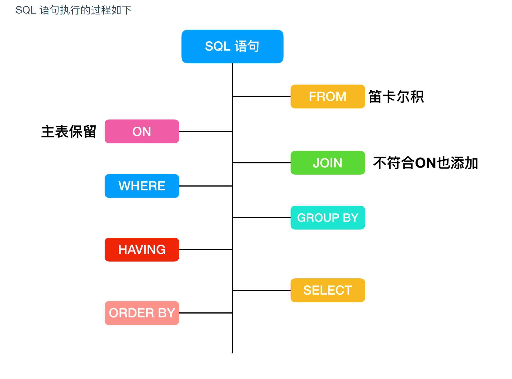

## Introduction

[MySQL Server](https://www.mysql.com/), the world's most popular open source database, and MySQL Cluster, a real-time, open source transactional database.

## Install

```shell
cat /etc/sysconfig/selinux

```

### upgrade


## databases
information_schema
- tables
- processlist
- global_status
- global_variables
- partitions
innodb
- innodb_trx
- innodb_locks
- innodb_lock_waits


innodb shutdown handler
innodb purge coordinator
innodb purge worker * 3

max_delayed_threads 20
thread_stack 299008

thread_pool_idle_timeout 60
thread_pool_max_threads 65536
innodb_purge_threads 4
innodb_write_io_threads 4
innodb_read_io_threads 4
innodb_undo_logs 128


innodb_adaptive_hash_index_parts 8
innodb_adaptive_hash_index ON

## Files
- config
  - my.cnf
- data


## Transaction

**Implement on engine layer, and only innodb support transaction.**

- Atomicity
- Consistency
- Isolation
- Durability


Isolation Problem

- Dirty read
- Non-repeatable read
- Phantom read


Isolation level

- Read uncommitted
- Read committed default in Oracle SQL server, only see committed data from other transactions
- Repetable read **default level in MySQL**, and use MVCC avoid Phantom read
- Serializable




Table

笛卡尔积

Forever table

temp table

- union union all
- Temptable algorithm
- distinct and order by


virtual table

2

### Server


- 连接器 身份认证 权限管理 连接不断 即使修改了权限 此连接不受影响
- 查询缓存 8.0后移除 缓存select语句及结果集 因在频繁更新情况下经常失效
- 分析器 无命中缓存进入 词法分析 提出关键字段 语法分析 检验语句是否正确
- 优化器 内部实现 执行计划 选择索引 
- 执行器 检验有权限后调用引擎接口 返回执行结果
- 日志模块 binlog公有 redolog只InnoDB有


## Character Sets, Collations, Unicode

MySQL includes character set support that enables you to store data using a variety of character sets and perform comparisons according to a variety of collations. The default MySQL server character set and collation are `latin1` and `latin1_swedish_ci`, but you can specify character sets at the server, database, table, column, and string literal levels.

## Storage Engine

Storage engines are MySQL components that handle the SQL operations for different table types. [`InnoDB`](https://dev.mysql.com/doc/refman/5.7/en/innodb-storage-engine.html) is the default and most general-purpose storage engine.

### [The InnoDB Storage Engine](/docs/CS/DB/MySQL/InnoDB.md)

### [Alternative Storage Engines](/docs/CS/DB/MySQL/Engine.md)


### MVCC


### 锁机制：
  三级封锁协议
     

 - 写与写互斥 防止数据覆盖
 - 读不允许写 防止脏读
 - 读不允许写 防止不可重复读

  两段锁协议

 - 加锁与解锁分成两个阶段

 意向锁都是表级锁 相互兼容
### 数据库优化
限制查询 少用*
读写分离 主库写 从库查
垂直分区 数据表列拆分 拆成多表 对事务要求更复杂
    MySQL分区表 物理上为多文件 逻辑上为一个表 跨分区查询效率低 建议采用物理分表
水平分区 分库 事务逻辑复杂

#### 数据库字段设计规范

- 字符串转换成数字类型存储 IP地址 inet_aton inet_ntoa 
- 非负数数据（如自增ID）优先无符号整型
- 避免使用TEXT BLOB 大数据 内存临时表不支持 只能磁盘临时表 只能前缀索引 
- 避免使用ENUM 操作复杂
- 尽可能所有列都为非空 索引NULL列需要额外空间 比较计算也要特殊处理
- 存储时间不用字符串 占用更大空间 无法直接比较
- 财务金额使用decimal

  #### 索引设计规范
- 限制每张表上的索引数量,建议单张表索引不超过 5 个
- 禁止给表中的每一列都建立单独的索引
- 每个 Innodb 表必须有个主键
- 频繁的查询优先考虑使用覆盖索引 避免 Innodb 表进行索引的二次查询  随机 IO 变成顺序 IO 
- 尽量避免使用外键约束
- 避免使用子查询，可以把子查询优化为 join 操作
- 避免使用 JOIN 关联太多的表
- 减少同数据库的交互次数
- 对应同一列进行 or 判断时，使用 in 代替 or
- WHERE 从句中禁止对列进行函数转换和计算


### InnoDB memcached Plugin

## Master-Slave
### replication

master write to binary log
slaves get binary log events by I/O threads and write to relay log
slaves SQL threads replay SQL from relay log


Notes:
- same OS version
- same DB version
- same data
- same server id


## log

### binary log

log_bin
log_bin_basename
log_bin_compress
log_bin_compress_min_len 256
log_bin_index
log_bin_trust_function_creators
sql_log_bin


binlog_annotate_row_events	ON
binlog_cache_size	32768 32KB
binlog_checksum	CRC32
binlog_commit_wait_count	0
binlog_commit_wait_usec	100000
binlog_direct_non_transactional_updates	OFF
binlog_file_cache_size	16384
binlog_format	MIXED
binlog_optimize_thread_scheduling	ON
binlog_row_image	FULL
binlog_stmt_cache_size	32768
encrypt_binlog	OFF
gtid_binlog_pos
gtid_binlog_state
innodb_locks_unsafe_for_binlog	OFF
max_binlog_cache_size	18446744073709547520
max_binlog_size	1073741824 1G
max_binlog_stmt_cache_size	18446744073709547520
read_binlog_speed_limit	0
sync_binlog	0
wsrep_forced_binlog_format	NONE

### slow log

log_slow_admin_statements	ON
log_slow_disabled_statements	sp
log_slow_filter	admin,filesort,filesort_on_disk,filesort_priority_queue,full_join,full_scan,query_cache,query_cache_miss,tmp_table,tmp_table_on_disk
log_slow_rate_limit	1
log_slow_slave_statements	ON
log_slow_verbosity
slow_launch_time	2
slow_query_log	OFF
slow_query_log_file	demo-slow.log


### general log
log_output	FILE

##

show status

explain 

show profiles
show profile
    show profile source for

## Optimization

[Optimization](/docs/CS/DB/MySQL/Optimization.md) involves configuring, tuning, and measuring performance, at several levels. Depending on your job role (developer, DBA, or a combination of both), you might optimize at the level of individual SQL statements, entire applications, a single database server, or multiple networked database servers. Sometimes you can be proactive and plan in advance for performance, while other times you might troubleshoot a configuration or code issue after a problem occurs. Optimizing CPU and memory usage can also improve scalability, allowing the database to handle more load without slowing down.
