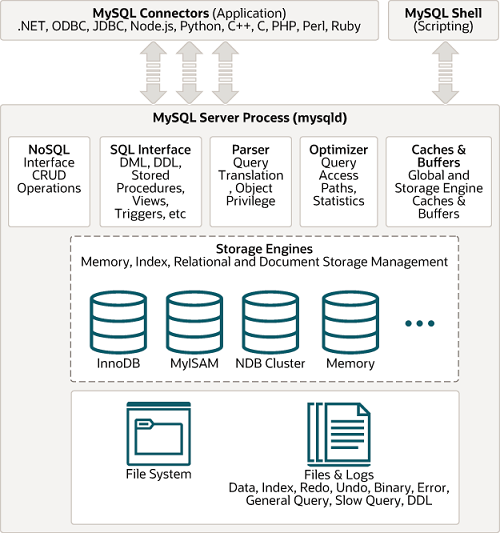

## Introduction

[MySQL Server](https://www.mysql.com/), the world's most popular open source database, and MySQL Cluster, a real-time, open source **transactional** database.

读下面任何一节之前先校准版本坐标：本页与子树多数笔记写于 5.7 / 8.0 时代，而 **MySQL 8.0 已于 2026-04-30 停止支持**、5.7 更早已 EOL。当前在维的两条 LTS 是 `8.4.x` 与 `9.7.x`，且 9.7 之后 MySQL 改用**日历版本号 `YY.M.P`**（首个是 `26.7.0`）。哪些结论已过期、哪些符号已消失、旧写法在 9.7 是否仍可用，统一记在 [Version_Migration](/docs/CS/DB/MySQL/Version_Migration.md)，该篇同时充当整个子树的勘误表。

本页承担两件事：Server 层的**总体架构**，以及子树 22 篇笔记的**阅读路径**。具体机制一律下沉到专题页，本页不重复展开。

## Installation

MySQL 启动配置文件读取顺序是 `/etc/my.cnf` → `/etc/mysql/my.cnf` → `/usr/local/mysql/etc/my.cnf` → `~/.my.cnf`，以最后读取的参数文件为准；Windows 下配置文件后缀名可能是 `ini`。Linux 下数据库路径默认 `/usr/local/mysql/data`。

[Installing and Upgrading MySQL](https://dev.mysql.com/doc/refman/9.7/en/installing.html)

<!-- tabs:start -->

##### **Docker**

```shell
# 以 9.7 LTS 为例；镜像标签跟随版本线
docker pull mysql:9.7
docker run --name test-mysql -e MYSQL_ROOT_PASSWORD=123456 -p 3306:3306 -d mysql:9.7
```

##### **K8s**

<!-- tabs:end -->

### Authentication Plugin by Version Line

这是子树里最容易踩空的一处，因为 `mysql_native_password` 的命运**按版本线完全不同**：

| 版本线 | `mysql_native_password` | 默认认证插件 |
| :--- | :--- | :--- |
| 5.7 | 可用，且是默认 | `mysql_native_password` |
| 8.0 | 可用但已弃用 | `caching_sha2_password` |
| 8.4 | **需显式加载插件**，未加载会报 `mysql_native_password is not loaded` | `caching_sha2_password` |
| **9.0+** | **已从服务端代码移除**，上述报错与变通方案均不适用 | `caching_sha2_password` 等 |

所以旧笔记里那段「改 my.ini 打开插件 + `ALTER USER ... IDENTIFIED WITH mysql_native_password`」的变通，**只适用于 8.4 及更早**。在 9.x 上客户端若仍要求该插件，正确做法是换用 `caching_sha2_password` 或调整客户端认证方式，而不是去加载一个已不存在的插件。

8.4 及更早的变通记录保留如下，按版本线取用：

```ini
[mysqld]
mysql_native_password=ON
```

```sql
ALTER USER 'your_username'@'your_hostname' IDENTIFIED WITH mysql_native_password BY 'your_password';
FLUSH PRIVILEGES;
```

### Build from Source

```shell
# 取源码后解压，进入源码根目录
```

##### **Ubuntu**

```shell
sudo apt install gcc build-essential cmake bison libncurses5-dev libssl-dev pkg-config

cmake -DDOWNLOAD_BOOST=1 -DWITH_BOOST=./extra/boost -DCMAKE_BUILD_TYPE=Debug -DWITH_DEBUG=1

sudo make && make install
```

##### **MacOS**

```shell
brew install cmake gcc bison

cmake -DDOWNLOAD_BOOST=1 -DWITH_BOOST=./boost -DCMAKE_BUILD_TYPE=Debug -DWITH_DEBUG=1 -DBISON_EXECUTABLE=/opt/homebrew/opt/bison/bin/bison

sudo make && make install
```

Init

```shell
./bin/mysqld --initialize-insecure --datadir=./data

# run
./bin/mysqld --datadir=./data
```

### Debug

```shell
# 查看 mysqld 启动时的缺省选项
mysqld --print-defaults

# 查看 mysqld 启动配置文件的优先级
mysqld --verbose --help | grep -A 1 "Default options"
```

Use gdb/lldb to debug.

## Architecture

MySQL 被设计成一个**单进程多线程**架构的数据库，与 SQL Server 比较类似，但与 Oracle 多进程架构不同。

大体分为 Server 层和存储引擎层两部分。Server 层包括连接器、查询缓存、分析器、优化器、执行器等，涵盖大多数核心服务功能与全部内置函数，所有跨存储引擎的功能都在这一层实现（存储过程、触发器、视图等）；存储引擎层负责数据的存储和提取，架构模式是插件式的，InnoDB 从 5.5.5 起成为默认引擎。

可插拔存储引擎架构让应用与存储层实现细节隔离：不同引擎功能有别，但应用程序可以免受这些差异影响。

<div style="text-align: center;">



</div>

<p style="text-align: center;">
Fig.1. MySQL Architecture with Pluggable Storage Engines.
</p>

### Server Process

- Caches
- Parser
- Optimizer
- SQL Interface

连接器一旦建立连接就要做权限验证，之后该连接上的权限变更不会被感知，除非重新连接——这与后面查询缓存被整体移除是同一类设计取舍。客户端长时间无动作会被自动断开，由 `wait_timeout` 控制，默认 8 小时；断开后再发请求会收到 `Lost connection to MySQL server during query`。

全部使用长连接时，MySQL 占用内存可能涨得特别快：执行过程临时使用的内存管理在连接对象里，只有连接断开才释放，累积下来可能被系统 OOM 杀掉，现象就是 MySQL 异常重启。两种解法：

1. 定期断开长连接，或判断执行过一个大占用内存的查询后主动断开再重连。
2. MySQL 5.7 及更新版本可在每次执行较大操作后调 `mysql_reset_connection` 重新初始化连接资源——不必重连和重新鉴权，但会把连接恢复到刚创建时的状态。

一条 SQL 进来后如何穿过解析、优化、执行三个阶段，以及各阶段的代价模型，见 [SQL](/docs/CS/DB/MySQL/SQL.md) 与 [Optimizer](/docs/CS/DB/MySQL/Optimizer.md)。

### Storage Engine

Storage engines are MySQL components that handle the SQL operations for different table types. [InnoDB](/docs/CS/DB/MySQL/InnoDB.md) is the default and most general-purpose storage engine.

```sql
SELECT VERSION();

SHOW ENGINES;
```

下面这张 `SHOW ENGINES` 输出取自 **MySQL 5.7**，保留是为了说明「插件式引擎」这件事本身，不代表 9.7 的引擎集合；9.7.2 源码 `storage/` 下实际有 13 个引擎目录，差异记在 [Version_Migration](/docs/CS/DB/MySQL/Version_Migration.md)。

| Engine | Support | Comment | Transactions | XA | Savepoints |
| :--- | :--- | :--- | :--- | :--- | :--- |
| InnoDB | DEFAULT | Supports transactions, row-level locking, and foreign keys | YES | YES | YES |
| MRG_MYISAM | YES | Collection of identical MyISAM tables | NO | NO | NO |
| MEMORY | YES | Hash based, stored in memory, useful for temporary tables | NO | NO | NO |
| BLACKHOLE | YES | /dev/null storage engine (anything you write to it disappears) | NO | NO | NO |
| MyISAM | YES | MyISAM storage engine | NO | NO | NO |
| CSV | YES | CSV storage engine | NO | NO | NO |
| ARCHIVE | YES | Archive storage engine | NO | NO | NO |
| PERFORMANCE_SCHEMA | YES | Performance Schema | NO | NO | NO |
| FEDERATED | NO | Federated MySQL storage engine | | | |

各引擎的取舍与选型路径见 [Storage Engines](/docs/CS/DB/MySQL/plugin.md)，InnoDB 自身的结构与线程模型见 [InnoDB](/docs/CS/DB/MySQL/InnoDB.md)。

### Schema

Default schemas:

- mysql
- sys
- information_schema
- performance_schema

Each database has its own directory except information_schema.

### Files

Server 侧的配置文件、日志文件、表文件与 InnoDB 文件族清单见 [File](/docs/CS/DB/MySQL/file.md)，表空间与段/区的物理组织见 [Tablespace](/docs/CS/DB/MySQL/tablespace.md)。

这里只留一个贯穿全子树的关键结论：redo log 与 binlog 都可以表示事务的提交状态，**两阶段提交**（redo log prepare → binlog write → redo log commit）就是让这两个状态保持逻辑一致。展开在 [Redo Log](/docs/CS/DB/MySQL/redolog.md) 与 [Binlog](/docs/CS/DB/MySQL/binlog.md)。

## Character Sets and Collations

MySQL 的字符集支持让你用多种字符集存储数据、按多种排序规则比较。

⚠️ **服务端默认值按版本线变化**：5.5/5.6 是 `latin1` / `latin1_swedish_ci`，**8.0 起默认已是 `utf8mb4`**，排序规则走 `utf8mb4_0900_ai_ci`（源码 `sql/mysqld.cc` 中 `my_charset_utf8mb4_0900_ai_ci`；`default_character_set_name` 由 CMake 的 `MYSQL_DEFAULT_CHARSET_NAME` 注入）。引用旧资料时注意这条。

```sql
mysql> SHOW VARIABLES LIKE '%CHARACTER%';
```

| Variable_name | Value |
| :--- | :--- |
| character_set_client | utf8mb4 |
| character_set_connection | utf8mb4 |
| character_set_database | utf8mb4 |
| character_set_filesystem | binary |
| character_set_results | utf8mb4 |
| character_set_server | utf8mb4 |
| character_set_system | utf8 |
| character_sets_dir | /usr/local/mysql/share/charsets/ |

字段类型的选择（`CHAR`/`VARCHAR`/整数宽度/日期时间）见 [Data Types](/docs/CS/DB/MySQL/Type.md)；落到团队层面的命名与建表约束见 [Database Standards](/docs/CS/DB/MySQL/Database_Standards.md)。

## Partitioning

In MySQL 8.0, partitioning support is provided by the InnoDB and NDB storage engines.

## Replication

MySQL is designed for accepting writes on one node at any given time. This has advantages in managing consistency but leads to trade-offs when you need the data written in multiple servers or multiple locations.

术语在 9.7 已从 master/slave 全面迁到 source/replica（`SHOW REPLICA STATUS`、`Seconds_Behind_Source`、`CHANGE REPLICATION SOURCE TO`），旧写法以弃用别名形式保留。复制流程、并行回放与主从延迟的成因见 [Replication](/docs/CS/DB/MySQL/replica.md)。

## How to Read This Subtree

架构看到这儿，剩下的按「一条数据的路径」展开，不必从本页跳读细节。

**数据放在哪。** 引擎决定一切行为差异，所以先读 [Storage Engines](/docs/CS/DB/MySQL/plugin.md) 建立插件式架构的全貌，再进 [InnoDB](/docs/CS/DB/MySQL/InnoDB.md) 看默认引擎的线程模型与磁盘结构。落到磁盘的具体形态由 [Tablespace](/docs/CS/DB/MySQL/tablespace.md) 与 [File](/docs/CS/DB/MySQL/file.md) 承担。

**怎么找得到。** InnoDB 的一切检索都走 B+Tree，[B-Tree](/docs/CS/DB/MySQL/B-Tree.md) 讲这棵树本身的形态与并发控制，[Index](/docs/CS/DB/MySQL/Index.md) 讲在它之上如何建索引、聚簇与二级索引的关系、回表与覆盖索引。这两篇是后续所有性能结论的地基。

**改坏了怎么回去。** 事务的 ACID 承诺如何在实现上兑现，是 [Transaction](/docs/CS/DB/MySQL/Transaction.md) 的主题；它与并发之间的冲突由 [Locks](/docs/CS/DB/MySQL/lock.md) 处理——锁的类型、CATS 调度与死锁检测都在那篇，注意 9.7 的调度与检测已重写，旧叙述只在历史脉络里成立。并发读者不互相阻塞靠的是 [MVCC](/docs/CS/DB/MySQL/Mvcc.md)：ReadView 决定一个版本对谁可见；其旧版本数据存放在 [Undo Log](/docs/CS/DB/MySQL/undolog.md)，回收由 purge 驱动。提交本身怎么落盘，[Transaction Flow](/docs/CS/DB/MySQL/Transaction_Flow.md) 走的是 prepare 与 commit 两阶段的源码路径。

**崩了怎么恢复。** 三条日志各管一段：[Redo Log](/docs/CS/DB/MySQL/redolog.md) 保证崩溃一致性，[Binlog](/docs/CS/DB/MySQL/binlog.md) 面向归档与复制，[Server Logs](/docs/CS/DB/MySQL/serverlog.md) 是排障入口。页级部分写这一风险则由 [Double Buffer](/docs/CS/DB/MySQL/Double-Buffer.md) 兜住——它是 flush 链路上容易被忽略的一环。

**慢在哪里。** 内存侧先看 [Memory](/docs/CS/DB/MySQL/memory.md)：buffer pool 的 LRU 与 flush、change buffer、自适应哈希索引，这三者是 InnoDB 用内存换磁盘 I/O 的全部手段。SQL 侧的执行计划与代价见 [SQL](/docs/CS/DB/MySQL/SQL.md) 与 [Optimizer](/docs/CS/DB/MySQL/Optimizer.md)，可操作的手段集中在 [Optimization](/docs/CS/DB/MySQL/Optimization.md)。

**工程落地。** 参数与运维经验见 [Configurations](/docs/CS/DB/MySQL/Experiences.md)，命名与建表约定见 [Database Standards](/docs/CS/DB/MySQL/Database_Standards.md)。任何一条结论怀疑它过时，回 [Version_Migration](/docs/CS/DB/MySQL/Version_Migration.md) 对照。

## Links

- [DataBases](/docs/CS/DB/DB.md?id=mysql)
- [Version Migration](/docs/CS/DB/MySQL/Version_Migration.md)
- [InnoDB](/docs/CS/DB/MySQL/InnoDB.md)
- [Storage Engines](/docs/CS/DB/MySQL/plugin.md)
- [Index](/docs/CS/DB/MySQL/Index.md)
- [Transaction](/docs/CS/DB/MySQL/Transaction.md)
- [Mvcc](/docs/CS/DB/MySQL/Mvcc.md)

## References

1. [MySQL Source Code Documentation](https://dev.mysql.com/doc/dev/mysql-server/latest/)
2. [MySQL 9.7 Reference Manual](https://dev.mysql.com/doc/refman/9.7/en/)
3. [MySQL Releases: Innovation and LTS](https://dev.mysql.com/doc/refman/26.7/en/mysql-releases.html)
4. [MySQL 源码编译和调试指南(Ubuntu 22.04.4 LTS) by GrokDB](https://grokdb.io/post/first-post/)
5. [Mac上编译MySQL源码与安装](https://max2d.com/archives/983)
