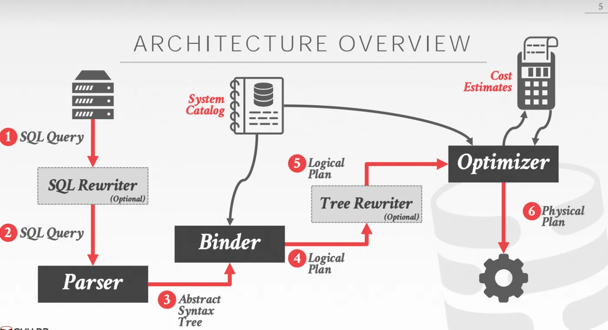

## Introduction


<div style="text-align: center;">



</div>

<p style="text-align: center;">
Fig.1. Optimizer
</p>

接下来，我们来说一下什么是表的Access Path。
创建一个简单的表，其中id是主键，并且我们在col1建立有二级索引：
```sql
CREATE TABLE t1 (
id INT PRIMARY KEY,
col1 INT,
col2 INT,
KEY index_col1 (col1)
) ENGINE = InnoDB;
```

对于一条最简单的单表查询语句：
```sql
SELECT * FROM t1 where t1.col1 < 5;
```
它从逻辑上来说很简单，就是想要找到t1.col1小于5的所有记录。然而，如何从表中获取数据呢？至少可以有以下方案：
1. 查主键索引，全表遍历一遍，然后过滤出t1.col1 < 5的记录。
2. 查col1上建立的二级索引，找到t1.col1 < 5的记录对应的主键，然后根据得到的主键再去主键索引上查找完整记录。
   可以发现，这两种方式都能达到逻辑上一致的效果，但它们访问了哪些数据，访问方式确实完全不同的。
3. 

我们称对每个表获取数据的实际执行方式为是这个表的Access Path。当改变一个表的Access Path，就改变了这个算子实际的物理执行计划，也就是说，逻辑上获得同一份数据的查询但在物理执行上却会有很多区别，效率也有很大区别，
这也就是Logical Plan和Physcal Plan。我们改变表的Access Path，就是改变了它的Physcal Plan


从一个表中读数据都有多种Access Path，那么就要问：这些Access Path孰优孰劣呢？
我们来看两种情况：

表中只有一万条记录，且这些记录都满足t1.col1 < 5。
• 使用第一种Access Path，需要在主键索引上全表扫描一遍即可。
• 使用第二种Access Path，需要在二级索引上全表扫描一遍，并且每个记录都需要从主键索引上回一遍表。
显然第一种更优。

表中有一万条记录，且只有其中一条记录满足t1.col1 < 5。
• 使用第一种Access Path，需要在主键索引上全表扫描一遍即可。
• 使用第二种Access Path，需要在二级索引上扫描，但只会得到一条记录，对这条记录再从主键索引查找完整记录即可。
显然第二种更优。

从这个例子可以发现，实际哪种Access Path更优是与数据强相关的。并不是说我在WHERE子句中指明了一条与二级索引相关的谓词（Predicate）就必须选择二级索引。
从以上分析，我们可以有一些发现：
1. Access Path是与存储引擎相关的。因为我们使用的是InnoDB引擎，而InnoDB是索引组织表，因此才会存在走二级索引需要回表。
2. 同一个Logical Plan对应的不同Access Path，谁更优秀在不知道数据分布下，是无法直接判断的。这也证明代价估计器存在的必要性。


### Cost

Cost Estimator中另一个重要的概念就是Cost，我们首先需要定义什么是Cost，才能进行估计。在MySQL中，所谓的Cost其实就是对一个物理查询计划的执行过程中，所消耗的CPU和IO的Cost估计。CPU Cost评估了执行物理计划所需要消耗的CPU周期数，而IO Cost评估了执行物理计划时，从存储引擎读取数据时需要做的IO次数。
现在我们定义了Cost，但在计算Cost之前，还必须明确一点，那就是Cost该如何比较。我们都知道CPU和IO其实是两种不同的资源，那么假设执行计划A的CPU Cost低，但IO Cost高，而执行计划B的CPU Cost高，但IO Cost低，这种情况我们应该如何抉择？
MySQL的处理方式很简单，虽然两种Cost的物理意义不同，而且也没办法把他们转换成一个可以比较的物理量，那么，就给他们赋予不同的权重，让他们加权求和成为最终的Cost，而这个权重，就开放给用户，让用户可以自己修改。显然，这个权重是应该十分依赖硬件的，假如数据库宿主机的IO资源紧张，但CPU核数多，那么就应该加大IO资源的权重，降低CPU资源的权重。
在MySQL中，可以通过查询mysql.server_cost和mysql.engine_cose两张表来查看Cost计算过程中的常数。

```sql
select * from mysql.server_cost;

select * from mysql.engine_cost;
```


在MySQL中，有关代价估计的代码主要集中在两个函数中：bool JOIN::estimate_rowcount()和bool Optimize_table_order::choose_table_order()中。
bool JOIN::estimate_rowcount()会对每个表估计每种Access Path输出的行数以及对应的cost

在这个函数中，只会考虑当这个表作为第一个读到的表时可行的Access Path。
bool Optimize_table_order::choose_table_order()是通过某种搜索算法计算不同JOIN ORDER下，每个表的最佳Access Path和对应的cost。在这个函数中，表可以通过JOIN condition来拓展出新的Access Path。

Estimate the number of matched rows for each joined table.
Set up range scan for tables that have proper predicates. 
Eliminate tables that have filter conditions that are always false based on analysis performed in resolver phase or analysis of range scan predicates.


```c
bool JOIN::estimate_rowcount() {
  Opt_trace_context *const trace = &thd->opt_trace;
  const Opt_trace_object trace_wrapper(trace);
  const Opt_trace_array trace_records(trace, "rows_estimation");

  JOIN_TAB *const tab_end = join_tab + tables;
  for (JOIN_TAB *tab = join_tab; tab < tab_end; tab++) {
    Opt_trace_object trace_table(trace);
    trace_table.add_utf8_table(tab->table_ref);
    if (tab->type() == JT_SYSTEM || tab->type() == JT_CONST) {
      trace_table.add("rows", 1)
          .add("cost", 1)
          .add_alnum("table_type",
                     (tab->type() == JT_SYSTEM) ? "system" : "const")
          .add("empty", tab->table()->has_null_row());

      // Only one matching row and one block to read
      tab->set_records(tab->found_records = 1);
      tab->worst_seeks = tab->table()->file->worst_seek_times(1.0);
      tab->read_time = tab->worst_seeks;
      continue;
    }
    // Approximate number of found rows and cost to read them
    tab->set_records(tab->found_records = tab->table()->file->stats.records);
    const Cost_estimate table_scan_time = tab->table()->file->table_scan_cost();
    tab->read_time = table_scan_time.total_cost();

    tab->worst_seeks =
        find_worst_seeks(tab->table(), tab->found_records, tab->read_time);

    /*
      Add to tab->const_keys the indexes for which all group fields or
      all select distinct fields participate in one index.
      Add to tab->skip_scan_keys indexes which can be used for skip
      scan access if no aggregates are present.
    */
    add_loose_index_scan_and_skip_scan_keys(this, tab);

    // Perform range analysis if the table has keys that can be used.
    Table_ref *const tl = tab->table_ref;
    Item *condition = nullptr;
    /*
      For an inner table of an outer join, the join condition is either
      attached to the actual table, or to the embedding join nest.
      For tables that are inner-joined or semi-joined, the join condition
      is taken from the WHERE condition.
    */
    if (tl->is_inner_table_of_outer_join()) {
      for (Table_ref *t = tl; t != nullptr; t = t->embedding) {
        if (t->join_cond() != nullptr) {
          condition = t->join_cond();
          break;
        }
      }
      assert(condition != nullptr);
    } else {
      condition = where_cond;
    }
    bool always_false_cond = false, range_analysis_done = false;
    if (!tab->const_keys.is_clear_all() ||
        !tab->skip_scan_keys.is_clear_all()) {
      /*
        This call fills tab->range_scan() with the best range access method
        possible for this table, and only if it's better than table scan.
        It also fills tab->needed_reg.
      */
      const ha_rows records =
          get_quick_record_count(thd, tab, row_limit, condition);

      if (records == 0 && thd->is_error()) return true;
      if (records == 0 && tab->table()->reginfo.impossible_range)
        always_false_cond = true;
      if (records != HA_POS_ERROR) {
        tab->found_records = records;
        tab->read_time =
            tab->range_scan() != nullptr ? tab->range_scan()->cost() : 0.0;
      }
      range_analysis_done = true;
    } else if (tab->join_cond() != nullptr && tab->join_cond()->const_item() &&
               tab->join_cond()->val_int() == 0) {
      always_false_cond = true;
    }

    /*
      Check for "always false" and mark table as "const".
      Exclude outer-joined tables unless the table is the single outer-joined
      table in the query block (this also eliminates tables inside
      outer-joined derived tables).
      Exclude semi-joined and anti-joined tables (only those tables that are
      functionally dependent can be marked "const", and subsequently pulled
      out of their semi-join nests).
    */
    if (always_false_cond &&
        (!tl->is_inner_table_of_outer_join() || tl->embedding == nullptr) &&
        (!(tl->embedding != nullptr && tl->embedding->is_sj_or_aj_nest()))) {
      /*
        Always false WHERE condition or (outer) join condition.
        In case of outer join, mark that one empty NULL row is matched.
        In case of WHERE, don't set found_const_table_map to get the
        caller to abort with a zero row result.
      */
      mark_const_table(tab, nullptr);
      tab->set_type(JT_CONST);  // Override setting made in mark_const_table()
      if (tab->join_cond() != nullptr) {
        // Generate an empty row
        trace_table.add("returning_empty_null_row", true)
            .add_alnum("cause", "always_false_outer_join_condition");
        found_const_table_map |= tl->map();
        tab->table()->set_null_row();  // All fields are NULL
      } else {
        trace_table.add("rows", 0).add_alnum("cause",
                                             "impossible_where_condition");
      }
    } else if (!range_analysis_done) {
      Opt_trace_object(trace, "table_scan")
          .add("rows", tab->found_records)
          .add("cost", tab->read_time);
    }
  }
  return false;
}
```

进行全表扫描无法保证所有的记录都是符合过滤条件的，因此还需要对每条记录都评估是否满足过滤条件，这部分的cost也需要计算。scan_time就描述了这项cost，计算公式也非常简单：row_evaluate_cost * records，行数 * 每条记录evaluate的cost，进行evaluate主要是消耗CPU资源，因此scan_time会记录到CPU cost中。
全表扫描会带来IO Cost

文件页数 * 读取每个page的cost = 聚簇索引页数 * 读取每个page的cost = 聚簇索引页数 * （内存中page的比例 * memory_block_read_cost + on-disk的page的比例 * io_block_read_cost）

This function returns a Cost_estimate object. 
The function should be implemented in a way that allows the compiler to use "return value optimization" to avoid creating the temporary object for the return value and use of the copy constructor.
```c
Cost_estimate handler::table_scan_cost() {
  const double io_cost = scan_time() * table->cost_model()->page_read_cost(1.0);
  Cost_estimate cost;
  cost.add_io(io_cost);
  return cost;
}
```

> 为了让优化器不倾向于全表扫，MySQL给全表扫的Cost添加了2.1的固定修正值


Index Scan

当某个二级索引包含的列包括了查询想要的所有列时，可以通过扫描二级索引来减少IO Cost。这里所说的覆盖索引仅指全表扫描时检索二级索引代替检索主键索引。
```

```
先获得最短的索引，然后计算做index_scan的cost


## Summary

用一个表格总结MySQL优化器所有单表Access Path的代价估计：


| Access Path                  | row count                                               | IO Cost                                                | CPU Cost                                      |
| ---------------------------- | ------------------------------------------------------- | ------------------------------------------------------ | --------------------------------------------- |
| system/const                 | 1                                                       | 1                                                      |                                               |
| Table Scan                   | stats.records                                           | 聚簇索引页数 * 读每个索引页的cost + IO cost修正值(1.1) | evaluate的CPU Cost+CPU cost修正值(1.0)        |
| Covering Index               | stats.records                                           | 索引页数 * 读每个索引页的cost                          | evaluate的cpu cost                            |
| Group Range                  | 用于GROUP BY语句的key的Cardinality                      | skip scan的IO Cost                                     | evaluate的CPU Cost + 搜索B+树产生的的CPU Cost |
| Skip Scan                    | 直方图得到的selectivity/缺省selectivity * stats.records | skip scan的IO Cost                                     | evaluate的CPU Cost + 搜索B+树产生的CPU Cost   |
| Index Range Scan（不需回表） | 使用统计信息或者Index Dive方式来估计                    | 需要读取索引页数 * 读每个索引页的cost                  | evaluate的CPU Cost                            |
| Index Range Scan（需要回表） | 使用统计信息或者Index Dive方式来估计                    | (rows + ranges) * 读每个聚簇索引页的cost               | evaluate的CPU Cost                            |
| Roworder Intersect           | 多次index range scan获得行数的最大值                    | 略                                                     | 略                                            |
| Index Merge Union            | 多次index range scan获得行数的和                        | 略                                                     | 略                                            |


## Links


## References

