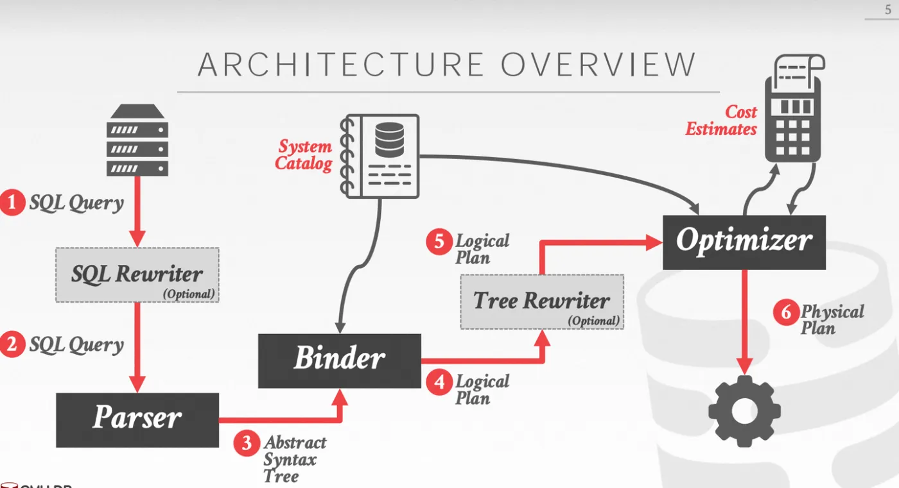

## Introduction

MySQL 优化器是**代价驱动**的：它不靠规则打分选索引，而是把每种可行的取数据方式折算成 CPU 与 IO 的代价，
再挑总和最小的那个。所以看懂执行计划的前提，是先看懂它的代价单位、Access Path 集合与统计信息来源。
本篇按「成本常数 → Access Path → 代价计算 → 单表代价总表」的顺序展开；
语句在 server 层的整体流转见 SQL，索引结构与回表成本见 Index 与 B-Tree。

| 项 | 值 |
| :--- | :--- |
| 正文默认版本 | MySQL 9.7.x LTS（最新 9.7.3，2026-08-18） |
| 源码核实基线 | tag `mysql-9.7.2` |
| 次要兼容目标 | 8.4.x LTS |
| 已停止支持 | 8.0（EOL 2026-04-30）、5.7（EOL 2023-10） |
| 核实日期 | 2026-10-07 |

本篇的成本常数取自 `mysql.server_cost` / `mysql.engine_cost` 的出厂默认值，
跨版本改动记录在 [Version_Migration](/docs/CS/DB/MySQL/Version_Migration.md)；下面的源码摘录与 9.7.2 对照过函数签名，
但代价模型本身自 8.0 以来没有大改。

<div style="text-align: center;">



</div>

<p style="text-align: center;">
Fig.1. Optimizer
</p>

## Cost Model

一次查询的成本被折算成两类：

- **I/O 成本**：查询记录时要先把数据页加载进内存，这个加载过程的开销就是 I/O 成本。
  读取一个页（Page，默认 16 KB）的成本默认 **1.0**（`io_block_read_cost`）。
- **CPU 成本**：读取记录、判断它是否满足条件、对结果集排序等操作的开销。
  读取并比较一行的成本默认 **0.2**（`row_evaluate_cost`）。

两类成本量纲不同，优化器给它们各自加权后求和得到最终 Cost；权重就是上面这些常数，
用户可按硬件特征调整——磁盘紧张而 CPU 核多，就抬高 I/O 权重、压低 CPU 权重。

## Optimizer Steps

1. 根据搜索条件，分析出可能使用的索引
2. 计算全表扫描的成本（在聚簇索引上完整遍历一遍，再按条件比对）
3. 计算使用不同索引执行查询的成本
4. 对比各种执行方案的成本，选出成本最低者

### Table Scan Cost

估算全表扫描需要先知道两件事：聚簇索引占了多少页、表里有多少行。

```sql
SHOW TABLE STATUS LIKE 'tableName';
```

返回值里相关的是 `Rows`（估算行数）与 `Data_length`（InnoDB 下即聚簇索引占用空间，
等于聚簇索引页数乘以每页大小）。

- I/O 成本 = 聚簇索引页数 * 每页成本 + 微调值
- CPU 成本 = 表总记录数 * 每行 evaluate 成本 + 微调值


## Access Path

一个表的 Access Path 就是「实际用什么方式从这张表里取数据」。
先创建一个简单的表，id 是主键，并在 col1 上建有二级索引：

```sql
CREATE TABLE t1 (
id INT PRIMARY KEY,
col1 INT,
col2 INT,
KEY index_col1 (col1)
) ENGINE = InnoDB;
```

对于一条最简单的单表查询语句：
```sql
SELECT * FROM t1 where t1.col1 < 5;
```
逻辑上它只是要找到 t1.col1 小于 5 的所有记录，但「怎么取到这些行」至少有两个方案：
1. 查主键索引，全表遍历一遍，然后过滤出 t1.col1 < 5的记录。
2. 查 col1上建立的二级索引，找到 t1.col1 < 5的记录对应的主键，然后根据得到的主键再去主键索引上查找完整记录。
   两种方式在逻辑上等价，访问的数据却完全不同。

改变一个表的 Access Path，就改变了这个算子的物理执行计划：同一份逻辑结果，物理执行方式与效率可以差很多。
这就是 Logical Plan 与 Physical Plan 的分界——优化器改的从来不是逻辑语义，而是 Physical Plan。


从一个表中读数据都有多种 Access Path，那么就要问：这些 Access Path 孰优孰劣呢？
我们来看两种情况：

表中只有一万条记录，且这些记录都满足 t1.col1 < 5。
• 使用第一种 Access Path，需要在主键索引上全表扫描一遍即可。
• 使用第二种 Access Path，需要在二级索引上全表扫描一遍，并且每个记录都需要从主键索引上回一遍表。
显然第一种更优。

表中有一万条记录，且只有其中一条记录满足 t1.col1 < 5。
• 使用第一种 Access Path，需要在主键索引上全表扫描一遍即可。
• 使用第二种 Access Path，需要在二级索引上扫描，但只会得到一条记录，对这条记录再从主键索引查找完整记录即可。
显然第二种更优。

从这个例子可以发现，实际哪种 Access Path 更优是与数据强相关的。并不是说我在 WHERE 子句中指明了一条与二级索引相关的谓词（Predicate）就必须选择二级索引。
从以上分析，我们可以有一些发现：
1. Access Path 是与存储引擎相关的。因为我们使用的是 InnoDB 引擎，而 InnoDB 是索引组织表，因此才会存在走二级索引需要回表。
2. 同一个 Logical Plan 对应的不同 Access Path，谁更优秀在不知道数据分布下，是无法直接判断的。这也证明代价估计器存在的必要性。


### What Cost Measures

Cost Estimator 中另一个重要的概念就是 Cost，我们首先需要定义什么是 Cost，才能进行估计。在 MySQL 中，所谓的 Cost 其实就是对一个物理查询计划的执行过程中，所消耗的 CPU 和 IO 的 Cost 估计。CPU Cost 评估了执行物理计划所需要消耗的 CPU 周期数，而 IO Cost 评估了执行物理计划时，从存储引擎读取数据时需要做的 IO 次数。
现在我们定义了 Cost，但在计算 Cost 之前，还必须明确一点，那就是 Cost 该如何比较。我们都知道 CPU 和 IO 其实是两种不同的资源，那么假设执行计划 A 的 CPU Cost 低，但 IO Cost 高，而执行计划 B 的 CPU Cost 高，但 IO Cost 低，这种情况我们应该如何抉择？
MySQL 的处理方式很简单，虽然两种 Cost 的物理意义不同，而且也没办法把他们转换成一个可以比较的物理量，那么，就给他们赋予不同的权重，让他们加权求和成为最终的 Cost，而这个权重，就开放给用户，让用户可以自己修改。显然，这个权重是应该十分依赖硬件的，假如数据库宿主机的 IO 资源紧张，但 CPU 核数多，那么就应该加大 IO 资源的权重，降低 CPU 资源的权重。
在 MySQL 中，可以通过查询 `mysql.server_cost` 与 `mysql.engine_cost` 两张表查看代价计算用到的常数：
前者是 server 层的 CPU 常数，后者是引擎层的 I/O 常数，改之前先备份，改完要 `FLUSH OPTIMIZER_COSTS` 才对新连接生效。

```sql
select * from mysql.server_cost;

select * from mysql.engine_cost;
```

### Row Estimation

代价估计的代码主要落在两个函数里：`JOIN::estimate_rowcount()` 与 `Optimize_table_order::choose_table_order()`。

前者对每个表估算各种 Access Path 会输出多少行、对应多少 cost，
且只考虑「这张表作为第一个被读取的表」时可行的 Access Path。

`Optimize_table_order::choose_table_order()` 则是用某种搜索算法，计算不同 JOIN ORDER 下每个表的最佳 Access Path 与对应 cost；
在这里，表还能借助 JOIN condition 拓展出新的 Access Path。它下面的注释正是该函数的职责清单：
```c
Estimate the number of matched rows for each joined table.
Set up range scan for tables that have proper predicates.
Eliminate tables that have filter conditions that are always false based on
analysis performed in resolver phase or analysis of range scan predicates.
```


```c
bool JOIN::estimate_rowcount() {
  Opt_trace_context *const trace = &thd->opt_trace;
  const Opt_trace_object trace_wrapper(trace);
  const Opt_trace_array trace_records(trace, "rows_estimation");

  JOIN_TAB *const tab_end = join_tab + tables;
  for (JOIN_TAB *tab = join_tab; tab < tab_end; tab++) {
    Opt_trace_object trace_table(trace);
    trace_table.add_utf8_table(tab->table_ref);
    if (tab->type() == JT_SYSTEM || tab->type() == JT_CONST) {
      trace_table.add("rows", 1)
          .add("cost", 1)
          .add_alnum("table_type",
                     (tab->type() == JT_SYSTEM) ? "system" : "const")
          .add("empty", tab->table()->has_null_row());

      // Only one matching row and one block to read
      tab->set_records(tab->found_records = 1);
      tab->worst_seeks = tab->table()->file->worst_seek_times(1.0);
      tab->read_time = tab->worst_seeks;
      continue;
    }
    // Approximate number of found rows and cost to read them
    tab->set_records(tab->found_records = tab->table()->file->stats.records);
    const Cost_estimate table_scan_time = tab->table()->file->table_scan_cost();
    tab->read_time = table_scan_time.total_cost();

    tab->worst_seeks =
        find_worst_seeks(tab->table(), tab->found_records, tab->read_time);

    /*
      Add to tab->const_keys the indexes for which all group fields or
      all select distinct fields participate in one index.
      Add to tab->skip_scan_keys indexes which can be used for skip
      scan access if no aggregates are present.
    */
    add_loose_index_scan_and_skip_scan_keys(this, tab);

    // Perform range analysis if the table has keys that can be used.
    Table_ref *const tl = tab->table_ref;
    Item *condition = nullptr;
    /*
      For an inner table of an outer join, the join condition is either
      attached to the actual table, or to the embedding join nest.
      For tables that are inner-joined or semi-joined, the join condition
      is taken from the WHERE condition.
    */
    if (tl->is_inner_table_of_outer_join()) {
      for (Table_ref *t = tl; t != nullptr; t = t->embedding) {
        if (t->join_cond() != nullptr) {
          condition = t->join_cond();
          break;
        }
      }
      assert(condition != nullptr);
    } else {
      condition = where_cond;
    }
    bool always_false_cond = false, range_analysis_done = false;
    if (!tab->const_keys.is_clear_all() ||
        !tab->skip_scan_keys.is_clear_all()) {
      /*
        This call fills tab->range_scan() with the best range access method
        possible for this table, and only if it's better than table scan.
        It also fills tab->needed_reg.
      */
      const ha_rows records =
          get_quick_record_count(thd, tab, row_limit, condition);

      if (records == 0 && thd->is_error()) return true;
      if (records == 0 && tab->table()->reginfo.impossible_range)
        always_false_cond = true;
      if (records != HA_POS_ERROR) {
        tab->found_records = records;
        tab->read_time =
            tab->range_scan() != nullptr ? tab->range_scan()->cost() : 0.0;
      }
      range_analysis_done = true;
    } else if (tab->join_cond() != nullptr && tab->join_cond()->const_item() &&
               tab->join_cond()->val_int() == 0) {
      always_false_cond = true;
    }

    /*
      Check for "always false" and mark table as "const".
      Exclude outer-joined tables unless the table is the single outer-joined
      table in the query block (this also eliminates tables inside
      outer-joined derived tables).
      Exclude semi-joined and anti-joined tables (only those tables that are
      functionally dependent can be marked "const", and subsequently pulled
      out of their semi-join nests).
    */
    if (always_false_cond &&
        (!tl->is_inner_table_of_outer_join() || tl->embedding == nullptr) &&
        (!(tl->embedding != nullptr && tl->embedding->is_sj_or_aj_nest()))) {
      /*
        Always false WHERE condition or (outer) join condition.
        In case of outer join, mark that one empty NULL row is matched.
        In case of WHERE, don't set found_const_table_map to get the
        caller to abort with a zero row result.
      */
      mark_const_table(tab, nullptr);
      tab->set_type(JT_CONST);  // Override setting made in mark_const_table()
      if (tab->join_cond() != nullptr) {
        // Generate an empty row
        trace_table.add("returning_empty_null_row", true)
            .add_alnum("cause", "always_false_outer_join_condition");
        found_const_table_map |= tl->map();
        tab->table()->set_null_row();  // All fields are NULL
      } else {
        trace_table.add("rows", 0).add_alnum("cause",
                                             "impossible_where_condition");
      }
    } else if (!range_analysis_done) {
      Opt_trace_object(trace, "table_scan")
          .add("rows", tab->found_records)
          .add("cost", tab->read_time);
    }
  }
  return false;
}
```

全表扫描不能保证每条记录都满足过滤条件，所以还要为「逐条判定」付一次钱。`scan_time` 描述的就是这项成本：
`row_evaluate_cost * records`，即行数乘以单条 evaluate 的成本。判定主要消耗 CPU，
因此 `scan_time` 记进 CPU cost。

I/O 侧则按页计算：聚簇索引页数 * 每页读取成本，而每页读取成本再按「页在内存里的比例」拆开——

```text
io_cost = 聚簇索引页数 * ( 内存页比例 * memory_block_read_cost + 磁盘页比例 * io_block_read_cost )
```

也就是说，同一张表在冷启动与热态下的估算成本并不相同，`page_read_cost(1.0)` 取的就是这个混合单价。
下面的实现里可以看到它只累加 IO 部分，CPU 部分由调用方按 `scan_time` 另算。
```c
Cost_estimate handler::table_scan_cost() {
  const double io_cost = scan_time() * table->cost_model()->page_read_cost(1.0);
  Cost_estimate cost;
  cost.add_io(io_cost);
  return cost;
}
```

> [!NOTE]
>
> 为了让优化器不偏向全表扫描，MySQL 给全表扫描的总成本额外加了 2.1 的固定修正值：
> I/O 侧 1.1、CPU 侧 1.0。这也是下面总表里 Table Scan 一行带着两个修正值的原因。

### Index Scan

当某个二级索引包含的列包括了查询想要的所有列时，可以通过扫描二级索引来减少 IO Cost。这里所说的覆盖索引仅指全表扫描时检索二级索引代替检索主键索引。

先获得最短的索引，然后计算做 index_scan 的 cost：覆盖索引扫描的 I/O 成本按**这棵二级索引的页数**计算，
而不是聚簇索引页数——这正是它能压低 Cost 的唯一原因。一旦查询列没有全部被索引覆盖，
代价模型就得为回表额外付「按主键随机读聚簇索引页」的钱，也就是总表里
`(rows + ranges) * 读每个聚簇索引页的 cost` 那一项。

## Summary

用一个表格总结 MySQL 优化器所有单表 Access Path 的代价估计：


| Access Path                  | row count                                               | IO Cost                                                | CPU Cost                                      |
| ---------------------------- | ------------------------------------------------------- | ------------------------------------------------------ | --------------------------------------------- |
| system/const                 | 1                                                       | 1                                                      |                                               |
| Table Scan                   | stats.records                                           | 聚簇索引页数 * 读每个索引页的 cost + IO cost 修正值(1.1) | evaluate 的 CPU Cost+CPU cost 修正值(1.0)        |
| Covering Index               | stats.records                                           | 索引页数 * 读每个索引页的 cost                          | evaluate 的 cpu cost                            |
| Group Range                  | 用于 GROUP BY 语句的 key 的 Cardinality                      | skip scan 的 IO Cost                                     | evaluate 的 CPU Cost + 搜索 B+树产生的的 CPU Cost |
| Skip Scan                    | 直方图得到的 selectivity/缺省 selectivity * stats.records | skip scan 的 IO Cost                                     | evaluate 的 CPU Cost + 搜索 B+树产生的 CPU Cost   |
| Index Range Scan（不需回表） | 使用统计信息或者 Index Dive 方式来估计                    | 需要读取索引页数 * 读每个索引页的 cost                  | evaluate 的 CPU Cost                            |
| Index Range Scan（需要回表） | 使用统计信息或者 Index Dive 方式来估计                    | (rows + ranges) * 读每个聚簇索引页的 cost               | evaluate 的 CPU Cost                            |
| Roworder Intersect           | 多次 index range scan 获得行数的最大值                    | 略                                                     | 略                                            |
| Index Merge Union            | 多次 index range scan 获得行数的和                        | 略                                                     | 略                                            |

统计信息失真时这张表算出来的就是错的：`stats.records` 来自采样，范围条件靠 index dive 或直方图估计选择率。
所以同一个计划在不同数据分布、不同冷热状态下都可能翻转——这正是 `EXPLAIN` 只给估算、
要靠 `EXPLAIN ANALYZE` 拿实际行数的原因（写法与代价见 Optimization 与 Index）。


## Links

- [SQL Execution](/docs/CS/DB/MySQL/SQL.md)
- [Indexes](/docs/CS/DB/MySQL/Index.md)
- [InnoDB Storage Engine](/docs/CS/DB/MySQL/InnoDB.md)
- [B-Tree](/docs/CS/DB/MySQL/B-Tree.md)
- [Query Optimization](/docs/CS/DB/MySQL/Optimization.md)

## References

- [MySQL Cost Model Constants](https://dev.mysql.com/doc/refman/9.7/en/cost-model.html)
- [Optimizer Statistics](https://dev.mysql.com/doc/refman/9.7/en/optimizer-statistics.html)
- [Index Statistics](https://dev.mysql.com/doc/refman/9.7/en/index-statistics.html)
- [EXPLAIN Output Format](https://dev.mysql.com/doc/refman/9.7/en/explain-output.html)
- [Optimizer Tracing](https://dev.mysql.com/doc/refman/9.7/en/optimizer-tracing.html)
