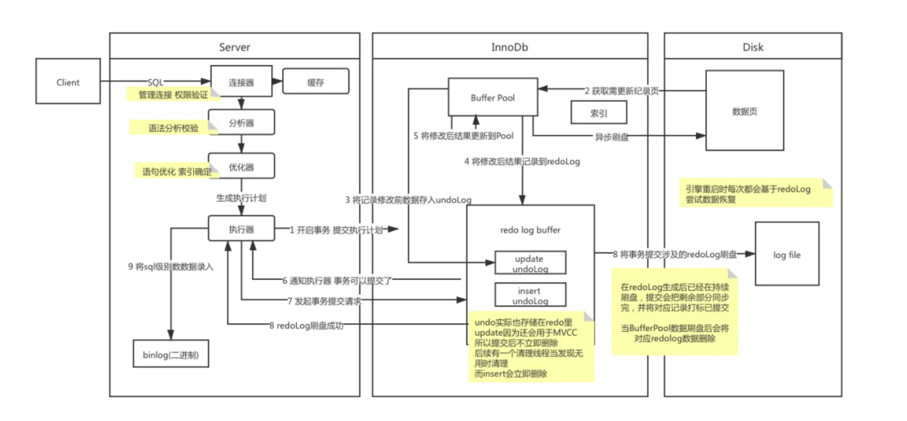

## Introduction

To implement a large-scale, busy, or highly reliable database application, to port substantial code from a different database system,
or to tune MySQL performance, it is important to understand `InnoDB` locking and the `InnoDB` transaction model.

## InnoDB and the ACID Model

The `InnoDB` transaction model aims combine the best properties of a multi-versioning database with traditional two-phase locking.
`InnoDB` performs locking at the row level and runs queries as [nonlocking consistent reads](/docs/CS/DB/MySQL/Transaction.md?id=consistent-read) by default, in the style of Oracle.
The lock information in `InnoDB` is stored space-efficiently so that lock escalation is not needed.
Typically, several users are permitted to lock every row in `InnoDB` tables, or any random subset of the rows, without causing `InnoDB` memory exhaustion.


 和ACID事务关系

- 通过Undo Log实现原子性
- 隔离性是Lock和MVCC
- 隔离性是Redo log

在sql记录执行流程



### Transaction Isolation Levels

#### READ UNCOMMITTED

Transactions running at the `READ UNCOMMITTED` level **do not issue shared locks to prevent other transactions from modifying data read by the current transaction**.
`READ UNCOMMITTED` transactions are also not blocked by exclusive locks that would prevent the current transaction from reading rows that have been modified but not committed by other transactions.
**This option has the same effect as setting NOLOCK on all tables in all SELECT statements in a transaction.**

#### READ COMMITTED

Each consistent read, even within the same transaction, sets and reads its own **fresh snapshot.**

**Because gap locking is disabled, `phantom row` problems may occur, as other sessions can insert new rows into the gaps**.

Only row-based binary logging is supported with the `READ COMMITTED` isolation level. If you use `READ COMMITTED` with `binlog_format=MIXED`, the server automatically uses row-based logging.

Using `READ COMMITTED` has additional effects:

- For `UPDATE` or `DELETE` statements, `InnoDB` holds locks only for rows that it updates or deletes.
  Record locks for nonmatching rows are released after MySQL has evaluated the `WHERE` condition.
  This greatly reduces the probability of deadlocks, but they can still happen.
- For `UPDATE` statements, if a row is already locked, `InnoDB` performs a “semi-consistent” read,
  returning the latest committed version to MySQL so that MySQL can determine whether the row matches the `WHERE` condition of the `UPDATE`.
  If the row matches (must be updated), MySQL reads the row again and this time `InnoDB` either locks it or waits for a lock on it.

#### REPEATABLE READ

This is the default isolation level for InnoDB.
Consistent reads within the same transaction **read the snapshot established by the first read**(any SELECT or UPDATE/INSERT/DELETE).
This means that if you issue several plain (nonlocking) SELECT statements within the same transaction, these SELECT statements are consistent also with respect to each other.

For locking reads (SELECT with FOR UPDATE or LOCK IN SHARE MODE), UPDATE, and DELETE statements, locking depends on whether the statement uses a unique index with a unique search condition or a range-type search condition.

- For a unique index with a unique search condition, InnoDB locks only the index record found, not the gap before it.
- For other search conditions, InnoDB locks the index range scanned, using gap locks or next-key locks to block insertions by other sessions into the gaps covered by the range.

> [!TIP]
>
> It is best practice to not mix storage engines in your application. Failed transactions can lead to inconsistent results as some parts can roll back and others cannot.


## Transaction

事务是怎样开启的
```
/*  1 */ BEGIN
/*  2 */ BEGIN WORK
/*  3 */ START TRANSACTION
/*  4 */ START TRANSACTION READ WRITE
/*  5 */ START TRANSACTION READ ONLY
/*  6 */ START TRANSACTION WITH CONSISTENT SNAPSHOT
/*  7 */ START TRANSACTION WITH CONSISTENT SNAPSHOT, READ WRITE

```

语句 1 ~ 8 中：
语句 1 ~ 4：用于开始一个新的读写事务。
语句 5：用于开始一个新的只读事务。
这两类语句都不需立即创建一致性读视图，事务的启动将延迟至实际需要时。
语句 6 ~ 7：用于开始一个新的读写事务。
语句 8：用于开始一个新的只读事务。
这两类语句都会先启动事务，随后立即创建一致性读视图

常用于开始一个事务的语句，大概非 BEGIN 莫属了
BEGIN 语句主要做两件事：
辞旧：提交老事务。
迎新：准备新事务。

BEGIN 语句会判断当前连接中是否有可能存在未提交事务，判断逻辑为：当前连接的线程是否被打上了 OPTION_NOT_AUTOCOMMIT 或 OPTION_BEGIN 标志位

```c++
inline bool in_multi_stmt_transaction_mode() const {
    return variables.option_bits & (OPTION_NOT_AUTOCOMMIT | OPTION_BEGIN);
  }
```

只要 variables.option_bits 包含其中一个标志位，就说明当前连接中可能存在未提交事务。
BEGIN 语句想要开始一个新事务，就必须先执行一次提交操作，把可能未提交的事务给提交了
然后给当前连接的线程打上 OPTION_BEGIN 标志 并不会马上启动一个新的事务


InnoDB 读写表中数据的操作都在事务中执行，开始一个事务的方式有两种：
手动：通过 BEGIN、START TRANSACTION 语句以及它们的扩展形式开始一个事务。
自动：直接执行一条 SQL 语句，InnoDB 会自动开始一个事务，SQL 语句执行完成之后，又会自动提交这个事务
这两种方式开始的事务，都用来执行用户 SQL 语句，属于用户事务。
InnoDB 有时候也需要自己执行一些 SQL 语句，为了和用户 SQL 做区分，我们把这些 SQL 称为内部 SQL。
内部 SQL 也需要在事务中执行，执行这些 SQL 的事务就是内部事务。
InnoDB 有几种场景会使用内部事务，以下是其中主要的三种：
如果上次关闭 MySQL 时有未提交，或者正在提交但未提交完成的事务，启动过程中，InnoDB 会把这些事务恢复为内部事务，然后提交或者回滚。
后台线程执行一些操作时，需要在内部事务中执行内部 SQL。
以 ib_dict_stats 线程为例，它计算各表、索引的统计信息之后，会使用内部事务执行内部 SQL，更新 mysql.innodb_table_stats、mysql.innodb_index_stats 表中的统计信息。
为了实现原子操作，DDL 语句执行过程中，InnoDB 会使用内部事务执行内部 SQL，插入一些数据到 mysql.innodb_ddl_log 表中。


由于要存放事务 ID、事务状态、Undo 日志编号、事务所属的用户线程等信息，每个事务都有一个与之对应的对象，我们称之为事务对象
每个事务对象都要占用内存，如果每启动一个事务都要为事务对象分配内存，释放事务时又要释放内存，会降低数据库性能

```c++
struct Pool {
  typedef Type value_type;

  // FIXME: Add an assertion to check alignment and offset is
  // as we expect it. Also, sizeof(void*) can be 8, can we improve on this.
  struct Element {
    Pool *m_pool;
    value_type m_type;
  };

 private:
  /** Pointer to the last element */
  Element *m_end;

  /** Pointer to the first element */
  Element *m_start;

  /** Size of the block in bytes */
  size_t m_size;

  /** Upper limit of used space */
  Element *m_last;

  /** Priority queue ordered on the pointer addresses. */
  pqueue_t m_pqueue;

  /** Lock strategy to use */
  LockStrategy m_lock_strategy;
};
```

为了避免频繁分配、释放内存对数据库性能产生影响，InnoDB 引入了事务池（Pool），用于管理事务。
MySQL在启动过程中会创建事务池管理器 负责事务池的管理

```c++
/** Create the trx_t pool */
void trx_pool_init() {
  trx_pools = ut::new_withkey<trx_pools_t>(UT_NEW_THIS_FILE_PSI_KEY,
                                           MAX_TRX_BLOCK_SIZE);

  ut_a(trx_pools != nullptr);
}
```


```c++
/** The trx_t pool manager */
static trx_pools_t *trx_pools;

/** Size of on trx_t pool in bytes. */
static const ulint MAX_TRX_BLOCK_SIZE = 1024 * 1024 * 4;
```
每个事务池能用来存放事务对象的内存是4M
创建事务池的过程中，InnoDB 会分配一块 4M 的内存用于存放事务对象。
每个事务对象的大小为 992 字节，4M 内存能够存放 4194304 / 992 = 4228 个事务对象


事务池有一个队列，用于存放已经初始化的事务对象 称为事务队列
InnoDB 初始化事务池的过程中，不会初始化全部的 4228 块小内存，只会初始化最前面的 16 块小内存，得到 16 个事务对象并放入事务队列

```c++
Pool(size_t size) : m_end(), m_start(), m_size(size), m_last() {
    ut_a(size >= sizeof(Element));

    m_lock_strategy.create();

    ut_a(m_start == nullptr);

    m_start = reinterpret_cast<Element *>(
        ut::zalloc_withkey(UT_NEW_THIS_FILE_PSI_KEY, m_size));

    m_last = m_start;

    m_end = &m_start[m_size / sizeof(*m_start)];

    /* Note: Initialise only a small subset, even though we have
    allocated all the memory. This is required only because PFS
    (MTR) results change if we instantiate too many mutexes up
    front. */

    init(std::min(size_t(16), size_t(m_end - m_start)));

    ut_ad(m_pqueue.size() <= size_t(m_last - m_start));
  }
```
MySQL 运行过程中，如果这 16 个事务对象都正在被使用，InnoDB 需要一个新的事务对象时，会一次性初始化剩余的 4212 个事务对象并放入事务池的事务队列

```c++
Type *get() {
    Element *elem;

    m_lock_strategy.enter();

    if (!m_pqueue.empty()) {
      elem = m_pqueue.top();
      m_pqueue.pop();

    } else if (m_last < m_end) {
      /* Initialise the remaining elements. */
      init(m_end - m_last);

      ut_ad(!m_pqueue.empty());

      elem = m_pqueue.top();
      m_pqueue.pop();
    } else {
      elem = nullptr;
    }

    m_lock_strategy.exit();

    return (elem != nullptr ? &elem->m_type : nullptr);
  }
```

给事务分配对象时，会按照这个顺序：
先从事务池的事务队列中分配一个对象。
如果事务队列中没有可用的事务对象，就初始化事务池的剩余小块内存，从得到的事务对象中分配一个对象。
如果所有事务池都没有剩余未初始化的小块内存，就创建一个新的事务池，并从中分配一个事务对象

分配一个事务对象，得到的是一个出厂设置的对象，这个对象的各属性值都已经是初始状态了。
分配事务对象之后，InnoDB 还会对事务对象的几个属性再做一次初始化工作，把这几个属性再一次设置为初始值，其实就是对这些属性做了重复的赋值操作。
这些属性中，有必要提一下的是事务状态（trx->state）。出厂设置的事务对象，事务状态是 TRX_STATE_NOT_STARTED，表示事务还没有开始


除了给几个属性重复赋值，还会改变另外两个属性的值：
trx->in_innodb：给这个属性值加上 TRX_FORCE_ROLLBACK_DISABLE 标志，防止这个事务被其它线程触发回滚操作。事务后续执行过程中，这个标志可能会被清除，我们就不展开介绍了。
trx->lock.autoinc_locks：分配一块内存空间，用于存放 autoinc 锁结构。事务执行过程中需要为 auto_increment 字段生成自增值时使用


我们查询 information_schema.innodb_trx 表，能看到当前正在执行的事务有哪些，这些事务来源于两个链表。
为用户事务分配一个事务对象之后，还有一件非常重要的事，就是把事务对象放入其中一个链表的最前面，代码是这样的：
```c++
UT_LIST_ADD_FIRST(trx_sys->mysql_trx_list, trx);
```
从上面的代码可以看到，这个链表就是 trx_sys->mysql_trx_list，它只会记录用户事务。
至于内部事务，并不会放入 trx_sys->mysql_trx_list 链表。等到真正启动事务时，事务对象会被放入另一个链表


### 启动事务

启动事务最重要的事情之一，就是修改事务状态到 `TRX_STATE_ACTIVE`


```c++
trx->state.store(TRX_STATE_ACTIVE, std::memory_order_relaxed)
```
事务启动于执行第一条 SQL 语句时，如果第一条 SQL 语句是 select、update、delete，InnoDB 会以读事务的身份启动新事务

```c++
/** Starts a transaction. */
static void trx_start_low(
    trx_t *trx,      /*!< in: transaction */
    bool read_write) /*!< in: true if read-write transaction */
{
  ut_ad(!trx->in_rollback);
  ut_ad(!trx->is_recovered);
  ut_ad(trx->start_line != 0);
  ut_ad(trx->start_file != nullptr);
  ut_ad(trx->roll_limit == 0);
  ut_ad(!trx->lock.in_rollback);
  ut_ad(trx->error_state == DB_SUCCESS);
  ut_ad(trx->rsegs.m_redo.rseg == nullptr);
  ut_ad(trx->rsegs.m_noredo.rseg == nullptr);
  ut_ad(trx_state_eq(trx, TRX_STATE_NOT_STARTED));
  ut_ad(UT_LIST_GET_LEN(trx->lock.trx_locks) == 0);
  ut_ad(!(trx->in_innodb & TRX_FORCE_ROLLBACK));
  ut_ad(trx_can_be_handled_by_current_thread_or_is_hp_victim(trx));

  ++trx->version;

  /* Check whether it is an AUTOCOMMIT SELECT */
  trx->auto_commit = (trx->api_trx && trx->api_auto_commit) ||
                     thd_trx_is_auto_commit(trx->mysql_thd);

  trx->read_only = (trx->api_trx && !trx->read_write) ||
                   (!trx->internal && thd_trx_is_read_only(trx->mysql_thd)) ||
                   srv_read_only_mode;

  if (!trx->auto_commit) {
    ++trx->will_lock;
  } else if (trx->will_lock == 0) {
    trx->read_only = true;
  }
  trx->persists_gtid = false;

#ifdef UNIV_DEBUG
  /* If the transaction is DD attachable trx, it should be AC-NL-RO
  (AutoCommit-NonLocking-ReadOnly) trx */
  if (trx->is_dd_trx) {
    ut_ad(trx->read_only);
    ut_ad(trx->auto_commit);
    ut_ad(trx->isolation_level == TRX_ISO_READ_UNCOMMITTED ||
          trx->isolation_level == TRX_ISO_READ_COMMITTED);
  }
#endif /* UNIV_DEBUG */

  /* Note, that trx->start_time is set without std::memory_order_release,
  and it is possible that trx->state below is set neither within critical
  section protected by trx_sys->mutex nor, with std::memory_order_release.
  That is possible for read-only transactions in code further below.
  This can result in an incorrect message printed to error log inside the
  buf_pool_resize thread about transaction lasting too long. The decision
  was to keep this issue for read-only transactions as it was, because
  providing a fix which would guarantee that state of printed information
  about such transactions is always consistent, would take much more work.
  TODO: check performance gain from this micro-optimization on ARM. */

  if (trx->mysql_thd != nullptr) {
    trx->start_time.store(thd_start_time(trx->mysql_thd),
                          std::memory_order_relaxed);
    if (!trx->ddl_operation) {
      trx->ddl_operation = thd_is_dd_update_stmt(trx->mysql_thd);
    }
  } else {
    trx->start_time.store(std::chrono::system_clock::from_time_t(time(nullptr)),
                          std::memory_order_relaxed);
  }

  /* The initial value for trx->no: TRX_ID_MAX is used in
  read_view_open_now: */

  trx->no = TRX_ID_MAX;

  ut_a(ib_vector_is_empty(trx->lock.autoinc_locks));

  /* This value will only be read by a thread inspecting lock sys queue after
  the thread which enqueues this trx releases the queue's latch. */
  trx->lock.schedule_weight.store(0, std::memory_order_relaxed);

  /* If this transaction came from trx_allocate_for_mysql(),
  trx->in_mysql_trx_list would hold. In that case, the trx->state
  change must be protected by the trx_sys->mutex, so that
  lock_print_info_all_transactions() will have a consistent view. */

  ut_ad(!trx->in_rw_trx_list);

  /* We tend to over assert and that complicates the code somewhat.
  e.g., the transaction state can be set earlier but we are forced to
  set it under the protection of the trx_sys_t::mutex because some
  trx list assertions are triggered unnecessarily. */

  /* By default all transactions are in the read-only list unless they
  are non-locking auto-commit read only transactions or background
  (internal) transactions. Note: Transactions marked explicitly as
  read only can write to temporary tables, we put those on the RO
  list too. */

  if (!trx->read_only &&
      (trx->mysql_thd == nullptr || read_write || trx->ddl_operation)) {
    trx_assign_rseg_durable(trx);

    /* Temporary rseg is assigned only if the transaction
    updates a temporary table */
    DEBUG_SYNC_C("trx_sys_before_assign_id");

    trx_sys_mutex_enter();

    trx->id = trx_sys_allocate_trx_id();

    trx_sys->rw_trx_ids.push_back(trx->id);

    ut_ad(trx->rsegs.m_redo.rseg != nullptr || srv_read_only_mode ||
          srv_force_recovery >= SRV_FORCE_NO_TRX_UNDO);

    trx_add_to_rw_trx_list(trx);

    trx->state.store(TRX_STATE_ACTIVE, std::memory_order_relaxed);

    ut_ad(trx_sys_validate_trx_list());

    trx_sys_mutex_exit();

    trx_sys_rw_trx_add(trx);

  } else {
    trx->id = 0;

    if (!trx_is_autocommit_non_locking(trx)) {
      /* If this is a read-only transaction that is writing
      to a temporary table then it needs a transaction id
      to write to the temporary table. */

      if (read_write) {
        trx_sys_mutex_enter();

        ut_ad(!srv_read_only_mode);

        trx->state.store(TRX_STATE_ACTIVE, std::memory_order_relaxed);

        trx->id = trx_sys_allocate_trx_id();

        trx_sys->rw_trx_ids.push_back(trx->id);

        trx_sys_mutex_exit();

        trx_sys_rw_trx_add(trx);

      } else {
        trx->state.store(TRX_STATE_ACTIVE, std::memory_order_relaxed);
      }
    } else {
      ut_ad(!read_write);
      trx->state.store(TRX_STATE_ACTIVE, std::memory_order_relaxed);
    }
  }

  ut_a(trx->error_state == DB_SUCCESS);

  MONITOR_INC(MONITOR_TRX_ACTIVE);
}
```

只读事务是读事务的一个特例，从字面上看，它是不能改变（插入、修改、删除）表中数据的。
然而，这个只读并不是绝对的，只读事务不能改变系统表、用户普通表的数据，但是可以改变用户临时表的数据。
作为读事务的特例，只读事务也要遵守读事务的规则，事务 ID 应该为 0。
只读事务操作系统表、用户普通表，只能读取表中数据，事务 ID 为 0（即不分配事务 ID）没问题。
只读事务操作用户临时表，可以改变表中数据，而用户临时表也支持事务 ACID 特性中的 3 个（ACI），这就需要分配事务 ID 了。
如果只读事务执行的第一条 SQL 语句就是插入记录到用户临时表的 insert，事务启动过程中会分配事务 ID


如果事务执行的第一条 SQL 语句是 insert，这个事务就会以读写事务的身份启动。
读写事务的启动过程，主要会做这几件事：
- 为用户普通表分配回滚段，用于写 Undo 日志。
- 分配事务 ID。
- 把事务对象加入 trx_sys->rw_trx_list 链表。这个链表记录了所有读写事务。


```c++
UT_LIST_ADD_FIRST(trx_sys->rw_trx_list, trx);

static inline void trx_add_to_rw_trx_list(trx_t *trx) {
  ut_ad(srv_is_being_started || trx_sys_mutex_own());
  ut_ad(!trx->in_rw_trx_list);
  UT_LIST_ADD_FIRST(trx_sys->rw_trx_list, trx);
  ut_d(trx->in_rw_trx_list = true);
}
```

用户事务以什么身份启动，取决于执行的第一条 SQL 是什么。
和用户事务不一样，InnoDB 启动内部事务都是为了改变表中数据，所以，内部事务都是读写事务。
作为读写事务，所有内部事务都会加入到 trx_sys->rw_trx_list 链表中

在 update 或 delete 语句执行过程中，读事务就会变成读写事务。
发生变化的具体时间点，又取决于这两类 SQL 语句更新或删除记录的第一个表是什么类型。
如果第一个表是用户普通表，InnoDB 从表中读取一条记录之前，会给表加意向排他锁（IX）。
加意向排他锁时，如果以下三个条件成立，InnoDB 就会把这个事务变成读写事务：
事务还没有为用户普通表分配回滚段。
事务 ID 为 0，说明这个事务现在还是读事务。
事务的只读标识 trx->read_only = false，说明这个事务可以变成读写事务


读事务变成读写事务，InnoDB 主要做 3 件事：
分配事务 ID。
为用户普通表分配回滚段。
把事务对象加入 trx_sys->rw_trx_list 链表。

如果第一个表是用户临时表，因为它的可见范围只限于创建这个表的数据库连接之内，其它数据库连接中执行的事务都看不到这个表，更不能改变表中的数据，所以，update、delete 语句改变用户临时表中的数据，不需要加意向排他锁。
读事务变成读写事务的操作会延迟到 server 层触发 InnoDB 更新或删除记录之后，InnoDB 执行更新或删除操作之前。
在这个时间节点，如果以下三个条件成立，InnoDB 就会把这个事务变成读写事务：
事务已经启动了。
事务 ID 为 0，说明这个事务现在还是读事务。
事务的只读标识 trx->read_only = false，说明这个事务可以变成读写事务。
有一点需要说明，改变用户临时表的数据触发读事务变成读写事务，不会分配用户临时表回滚段，需要等到为某个用户临时表第一次写 Undo 日志时才分配

在 select 语句执行过程中，读事务不会变成读写事务；这条 SQL 语句执行完之后、事务提交之前，第一次执行 insert、update、delete 语句时，读事务才会变成读写事务。
一个读事务变成读写事务的操作，只会发生一次，发生变化的具体时间点，取决于最先碰到哪种 SQL 语句。
如果最先碰到 insert 语句，server 层准备好要插入的记录的每个字段之后，会触发 InnoDB 执行插入操作。
执行插入操作之前，如果以下三个条件成立，InnoDB 就会把这个事务变成读写事务：
事务已经启动了。
事务 ID 为 0，说明这个事务现在还是读事务。
事务的只读标识 trx->read_only = false，说明这个事务可以变成读写事务

只读事务不能改变（插入、更新、删除）系统表、用户普通表的数据，但是能改变用户临时表的数据。
改变用户临时表的数据，同样需要为事务分配事务 ID，为用户临时表分配回滚段。根据只读事务执行的第一条 SQL 语句不同，这两个操作发生的时间点也可以分为两类
在 update 或 delete 语句执行过程中，server 层触发 InnoDB 更新或删除记录之后，InnoDB 执行更新或删除操作之前，如果以下三个条件成立，InnoDB 就为这个事务分配事务 ID、为用户临时表分配回滚段:
事务已经启动了。
事务 ID 为 0。
事务是个只读事务（trx->read_only = true）


```c++

```

```c++

```


## Locking

InnoDB uses a two-phase locking protocol.
It can acquire locks at any time during a transaction, but it does not release them until a COMMIT or ROLLBACK.
It releases all the locks at the same time.
The locking mechanisms described earlier are all implicit.
InnoDB handles locks automatically, according to your isolation level.

> TODO:
>
> [MySQL · 源码分析 · MySQL deadlock cause by lock inherit](http://mysql.taobao.org/monthly/2024/03/02/)

### Locking Types

```sql
mysql> select * from information_schema.innodb_locks;
mysql> select * from information_schema.innodb_lock_waits;
mysql> select * from information_schema.innodb_trx;
```

row-level locking only be implemented at server level.

#### Shared and Exclusive Locks

`InnoDB` implements standard **row-level locking** where there are two types of locks, shared (`S`) locks and exclusive (`X`) locks.

- A shared (`S`) lock permits the transaction that holds the lock to read a row.
- An exclusive (`X`) lock permits the transaction that holds the lock to update or delete a row.

If transaction `T1` holds a shared (`S`) lock on row `r`, then requests from some distinct transaction `T2` for a lock on row `r` are handled as follows:

- A request by `T2` for an `S` lock can be granted immediately. As a result, both `T1` and `T2` hold an `S` lock on `r`.
- A request by `T2` for an `X` lock cannot be granted immediately.

If a transaction `T1` holds an exclusive (`X`) lock on row `r`, a request from some distinct transaction `T2` for a lock of either type on `r` cannot be granted immediately.
Instead, transaction `T2` has to wait for transaction `T1` to release its lock on row `r`.

#### Intention Locks

`InnoDB` supports *multiple granularity locking* which permits coexistence of row locks and table locks.
For example, a statement such as `LOCK TABLES ... WRITE` takes an exclusive lock (an `X` lock) on the specified table.
To make locking at multiple granularity levels practical, `InnoDB` uses intention locks.
Intention locks are **table-level** locks that indicate which type of lock (shared or exclusive) a transaction requires later for a row in a table.
There are two types of intention locks:

- An intention shared lock (`IS`) indicates that a transaction intends to set a *shared* lock on individual rows in a table.
- An intention exclusive lock (`IX`) indicates that a transaction intends to set an exclusive lock on individual rows in a table.

For example, `SELECT ... FOR SHARE` sets an `IS` lock, and `SELECT ... FOR UPDATE` sets an `IX` lock.

The intention locking protocol is as follows:

- Before a transaction can acquire a shared lock on a row in a table, it must first acquire an `IS` lock or stronger on the table.
- Before a transaction can acquire an exclusive lock on a row in a table, it must first acquire an `IX` lock on the table.

Table-level lock type compatibility is summarized in the following matrix.


|      | `X`      | `IX`       | `S`        | `IS`       |
| :--- | :------- | :--------- | :--------- | :--------- |
| `X`  | Conflict | Conflict   | Conflict   | Conflict   |
| `IX` | Conflict | Compatible | Conflict   | Compatible |
| `S`  | Conflict | Conflict   | Compatible | Compatible |
| `IS` | Conflict | Compatible | Compatible | Compatible |

#### Record Locks

A record lock is a lock on an index record.
For example, `SELECT c1 FROM t WHERE c1 = 10 FOR UPDATE;` prevents any other transaction from inserting, updating, or deleting rows where the value of `t.c1` is `10`.

**Record locks always lock index records**, even if a table is defined with no indexes.
For such cases, `InnoDB` creates a hidden clustered index and uses this index for record locking.

#### Gap Locks

**A gap lock is a lock on a gap between index records, or a lock on the gap before the first or after the last index record.**
For example, `SELECT c1 FROM t WHERE c1 BETWEEN 10 and 20 FOR UPDATE;` prevents other transactions from inserting a value of `15` into column `t.c1`,
whether or not there was already any such value in the column, because the gaps between all existing values in the range are locked.

**A gap might span a single index value, multiple index values, or even be empty.**

Gap locks are part of the tradeoff between performance and concurrency, and are used in some transaction isolation levels and not others.

*Gap locking is not needed for statements that lock rows using a unique index to search for a unique row.*
(This does not include the case that the search condition includes only some columns of a multiple-column unique index; in that case, gap locking does occur.)

If `id` is not indexed or has a nonunique index, the statement does lock the preceding gap.

It is also worth noting here that conflicting locks can be held on a gap by different transactions.
For example, transaction A can hold a shared gap lock (gap S-lock) on a gap while transaction B holds an exclusive gap lock (gap X-lock) on the same gap.
The reason conflicting gap locks are allowed is that if a record is purged from an index, the gap locks held on the record by different transactions must be merged.

Gap locks in `InnoDB` are “purely inhibitive”, which means that their only purpose is to prevent other transactions from inserting to the gap.
Gap locks can co-exist. A gap lock taken by one transaction does not prevent another transaction from taking a gap lock on the same gap.
**There is no difference between shared and exclusive gap locks. They do not conflict with each other, and they perform the same function.**

Gap locking can be disabled explicitly. This occurs if you change the transaction isolation level to `READ COMMITTED`.
In this case, gap locking is disabled for searches and index scans and is used only for foreign-key constraint checking and duplicate-key checking.

There are also other effects of using the `READ COMMITTED` isolation level.
*Record locks for nonmatching rows are released after MySQL has evaluated the `WHERE` condition. For `UPDATE` statements, `InnoDB` does a “semi-consistent” read,
such that it returns the latest committed version to MySQL so that MySQL can determine whether the row matches the `WHERE` condition of the `UPDATE`.*

#### Next-Key Locks

**A next-key lock is a combination of a record lock on the index record and a gap lock on the gap before the index record.**

`InnoDB` performs row-level locking in such a way that when it searches or scans a table index, it sets shared or exclusive locks on the index records it encounters.
Thus, **the row-level locks are actually index-record locks**.
*A next-key lock on an index record also affects the “gap” before that index record.*
That is, a next-key lock is an index-record lock plus a gap lock on the gap preceding the index record.
If one session has a shared or exclusive lock on record `R` in an index, another session cannot insert a new index record in the gap immediately before `R` in the index order.

For the last interval, the next-key lock locks the gap above the largest value in the index and the “supremum” pseudo-record having a value higher than any value actually in the index.
The supremum is not a real index record, so, in effect, this next-key lock locks only the gap following the largest index value.

> [!NOTE]
>
> By default, `InnoDB` operates in `REPEATABLE READ` transaction isolation level.
> In this case, **`InnoDB` uses next-key locks for searches and index scans, which prevents `phantom rows`**.

#### Insert Intention Locks

**An insert intention lock is a type of gap lock set by `INSERT` operations prior to row insertion**.
This lock signals the intent to insert in such a way that multiple transactions inserting into the same index gap need not wait for each other if they are not inserting at the same position within the gap.
Suppose that there are index records with values of 4 and 7.
Separate transactions that attempt to insert values of 5 and 6, respectively, each lock the gap between 4 and 7 with insert intention locks prior to obtaining the exclusive lock on the inserted row,
but do not block each other because the rows are nonconflicting.

#### AUTO-INC Locks

An `AUTO-INC` lock is a special table-level lock taken by transactions inserting into tables with `AUTO_INCREMENT` columns.
In the simplest case, if one transaction is inserting values into the table, any other transactions must wait to do their own inserts into that table,
so that rows inserted by the first transaction receive consecutive primary key values.

The `innodb_autoinc_lock_mode` variable controls the algorithm used for auto-increment locking.
It allows you to choose how to trade off between predictable sequences of auto-increment values and maximum concurrency for insert operations.


```sql
SHOW VARIABLES LIKE 'innodb_autoinc_lock_mode'; -- 2
```

We cannot create yet another interval as we already contain one. 
This situation can happen. 
Assume innodb_autoinc_lock_mode>=1 and 
CREATE TABLE T(A INT AUTO_INCREMENT PRIMARY KEY) ENGINE=INNODB;

INSERT INTO T VALUES (NULL),(NULL),(1025),(NULL);
      
Then InnoDB will reserve [1,4] (because of 4 rows) then [1026,1026]. 
Only the first interval is important for statement-based binary logging as it tells the starting point. 
So we ignore the second interval:


Update & Delete 加锁

ClusterIndex

命中 都是X锁

未命中 只有RR加GAP锁

Second Unique Index
命中 二级索引和聚簇索引都是X锁

未命中 只有RR在二级索引加GAP锁

二级非唯一索引

命中 RC对两个索引加X锁 RR对二级索引加X和GAP锁 对Cluster索引加X锁

未命中 只有RR在二级索引加GAP锁


INSERT语句加锁

- 为了防止幻读，如果记录之间加有GAP锁，此时不能INSERT。
- 如果INSERT的记录和已有记录造成唯一键冲突，此时不能INSERT。


### Source Code

```cpp

/** Lock modes and types */
/** @{ */
#define LOCK_MODE_MASK                          \
  0xFUL /*!< mask used to extract mode from the \
        type_mode field in a lock */
/** Lock types */
#define LOCK_TABLE 16 /*!< table lock */
#define LOCK_REC 32   /*!< record lock */
#define LOCK_TYPE_MASK                                \
  0xF0UL /*!< mask used to extract lock type from the \
         type_mode field in a lock */
#if LOCK_MODE_MASK & LOCK_TYPE_MASK
#error "LOCK_MODE_MASK & LOCK_TYPE_MASK"
#endif

#define LOCK_WAIT                          \
  256 /*!< Waiting lock flag; when set, it \
      means that the lock has not yet been \
      granted, it is just waiting for its  \
      turn in the wait queue */
/* Precise modes */
#define LOCK_ORDINARY                     \
  0 /*!< this flag denotes an ordinary    \
    next-key lock in contrast to LOCK_GAP \
    or LOCK_REC_NOT_GAP */
#define LOCK_GAP                                     \
  512 /*!< when this bit is set, it means that the   \
      lock holds only on the gap before the record;  \
      for instance, an x-lock on the gap does not    \
      give permission to modify the record on which  \
      the bit is set; locks of this type are created \
      when records are removed from the index chain  \
      of records */
#define LOCK_REC_NOT_GAP                            \
  1024 /*!< this bit means that the lock is only on \
       the index record and does NOT block inserts  \
       to the gap before the index record; this is  \
       used in the case when we retrieve a record   \
       with a unique key, and is also used in       \
       locking plain SELECTs (not part of UPDATE    \
       or DELETE) when the user has set the READ    \
       COMMITTED isolation level */
#define LOCK_INSERT_INTENTION                                             \
  2048                       /*!< this bit is set when we place a waiting \
                          gap type record lock request in order to let    \
                          an insert of an index record to wait until      \
                          there are no conflicting locks by other         \
                          transactions on the gap; note that this flag    \
                          remains set when the waiting lock is granted,   \
                          or if the lock is inherited to a neighboring    \
                          record */
#define LOCK_PREDICATE 8192  /*!< Predicate lock */
#define LOCK_PRDT_PAGE 16384 /*!< Page lock */
```

### Deadlocks

A deadlock is a situation where different transactions are unable to proceed because each holds a lock that the other needs.
Because both transactions are waiting for a resource to become available, neither ever release the locks it holds.

#### Minimize and Handle Deadlocks

You can cope with deadlocks and reduce the likelihood of their occurrence with the following techniques:

- At any time, issue `SHOW ENGINE INNODB STATUS` to determine the cause of the most recent deadlock. That can help you to tune your application to avoid deadlocks.
- `SHOW FULL PROCESSLIST`
- table `INNODB_TRX`, `INNODB_LOCKS`, `INNODB_LOCK_WAITS` in information_schema
- If frequent deadlock warnings cause concern, collect more extensive debugging information by enabling the `innodb_print_all_deadlocks` variable.
  Information about each deadlock, not just the latest one, is recorded in the MySQL [error log]().
  Disable this option when you are finished debugging.
- Always be prepared to re-issue a transaction if it fails due to deadlock. Deadlocks are not dangerous. Just try again.
- Keep transactions small and short in duration to make them less prone to collision.
- Commit transactions immediately after making a set of related changes to make them less prone to collision. In particular, do not leave an interactive **mysql** session open for a long time with an uncommitted transaction.
- If you use *locking reads* (`SELECT ... FOR UPDATE` or `SELECT ... FOR SHARE`), try using a lower isolation level such as `READ COMMITTED`.
- When modifying multiple tables within a transaction, or different sets of rows in the same table, do those operations in a consistent order each time.
  Then transactions form well-defined queues and do not deadlock.
  For example, organize database operations into functions within your application, or call stored routines, rather than coding multiple similar sequences of `INSERT`, `UPDATE`, and `DELETE` statements in different places.
- Add well-chosen indexes to your tables so that your queries scan fewer index records and set fewer locks. Use `EXPLAIN SELECT` to determine which indexes the MySQL server regards as the most appropriate for your queries.
- Use less locking. If you can afford to permit a `SELECT` to return data from an old snapshot, do not add a `FOR UPDATE` or `FOR SHARE` clause to it.
  Using the `READ COMMITTED` isolation level is good here, because each consistent read within the same transaction reads from its own fresh snapshot.
- If nothing else helps, serialize your transactions with table-level locks. The correct way to use `LOCK TABLES` with transactional tables,
  such as `InnoDB` tables, is to begin a transaction with `SET autocommit = 0` (not `START TRANSACTION`) followed by `LOCK TABLES`,
  and to not call `UNLOCK TABLES` until you commit the transaction explicitly. For example, if you need to write to table `t1` and read from table `t2`, you can do this:

  Table-level locks prevent concurrent updates to the table, avoiding deadlocks at the expense of less responsiveness for a busy system.
- Another way to serialize transactions is to create an auxiliary “semaphore” table that contains just a single row.
  Have each transaction update that row before accessing other tables. In that way, all transactions happen in a serial fashion.
  Note that the `InnoDB` instant deadlock detection algorithm also works in this case, because the serializing lock is a row-level lock.
  With MySQL table-level locks, the timeout method must be used to resolve deadlocks.

#### Deadlock Detection

A mechanism that automatically detects when a **deadlock** occurs, and automatically **rolls back** one of the **transactions** involved (the **victim**).
Deadlock detection can be disabled using the `innodb_deadlock_detect` configuration option.

#### examples

see [mysql-deadlocks - github](https://github.com/aneasystone/mysql-deadlocks)

## MVCC

In Concurrency Control theory, there are two ways you can deal with conflicts:

- You can avoid them, by employing a pessimistic locking mechanism (e.g. Read/Write locks, Two-Phase Locking)
- You can allow conflicts to occur, but you need to detect them using an optimistic locking mechanism (e.g. logical clock, MVCC)

Because MVCC (Multi-Version Concurrency Control) is such a prevalent Concurrency Control technique (not only in relational database systems, in this article, I’m going to explain how it works.

When the [ACID transaction properties](/docs/CS/SE/Transaction.md?id=ACID) were first defined, Serializability was assumed. And to provide a Strict Serializable transaction outcome, the [2PL (Two-Phase Locking)](https://vladmihalcea.com/2pl-two-phase-locking/) mechanism was employed. When using 2PL, every read requires a shared lock acquisition, while a write operation requires taking an exclusive lock.

- a shared lock blocks Writers, but it allows other Readers to acquire the same shared lock
- an exclusive lock blocks both Readers and Writers concurring for the same lock

However, locking incurs contention, and contention affects scalability. The [Amdhal’s Law](https://en.wikipedia.org/wiki/Amdahl's_law) or the [Universal Scalability Law](http://www.perfdynamics.com/Manifesto/USLscalability.html) demonstrate how contention can affect response Time speedup.

For this reason, database researchers have come up with a different Concurrency Control model which tries to reduce locking to a bare minimum so that:

- Readers don’t block Writers
- Writers don’t block Readers

The only use case that can still generate contention is when two concurrent transactions try to modify the same record since, once modified, a row is always locked until the transaction that modified this record either commits or rolls back.

In order to specify the aforementioned Reader/Writer non-locking behavior, the Concurrency Control mechanism must operate on multiple versions of the same record, hence this mechanism is called Multi-Version Concurrency Control (MVCC).

While 2PL is pretty much standard, there’s no standard MVCC implementation, each database taking a slightly different approach. In this article, we are going to use PostgreSQL since its MVCC implementation is the easiest one to visualize.

While Oracle and MySQL use the [undo log](/docs/CS/DB/MySQL/undolog.md) to capture uncommitted changes so that rows can be reconstructed to their previously committed version, PostgreSQL stores all row versions in the table data structure.

### InnoDB Multi-Versioning

InnoDB implements MVCC by assigning a transaction ID for each transaction that starts.
That ID is assigned the first time the transaction reads any data.
When a record is modified within that transaction, an undo record that explains how to revert that change is written to the undo log,
and the rollback pointer of the transaction is pointed at that undo log record.
This is how the transaction can find the way to roll back if needed.

When a different session reads a cluster key index record, InnoDB compares the record’s transaction ID versus the read view of that session.
If the record in its current state should not be visible (the transaction that altered it has not yet committed),
the undo log record is followed and applied until the session reaches a transaction ID that is eligible to be visible.
This process can loop all the way to an undo record that deletes this row entirely, signaling to the read view that this row does not exist.

Records in a transaction are deleted by setting a “deleted” bit in the “info flags” of the record.
This is also tracked in the undo log as a “remove delete mark.”

It is also worth noting that all undo log writes are also redo logged because the undo log writes are part of the server crash recovery process and are transactional.
The size of these redo and undo logs also plays a large part in how transactions at high concurrency perform.

The result of all this extra record keeping is that most read queries never acquire locks.
They simply read data as fast as they can, making sure to select only rows that meet the criteria.
The drawbacks are that the storage engine has to store more data with each row, do more work when examining rows, and handle some additional housekeeping operations.

MVCC works only with the REPEATABLE READ and READ COMMITTED isolation levels.
READ UNCOMMITTED isn’t MVCC compatible because queries don’t read the row version that’s appropriate for their transaction version; they read the newest version, no matter what.
SERIALIZABLE isn’t MVCC compatible because reads lock every row they return.

`InnoDB` is a multi-version storage engine.
It keeps information about old versions of changed rows to support transactional features such as concurrency and rollback.
**This information is stored in undo tablespaces in a data structure called a rollback segment.**
`InnoDB` uses the information in the rollback segment to perform the undo operations needed in a transaction rollback.
It also uses the information to build earlier versions of a row for a consistent read.

Internally, `InnoDB` adds three fields to each row stored in the database:

- A 6-byte `DB_TRX_ID` field indicates the transaction identifier for the last transaction that inserted or updated the row.
  Also, a deletion is treated internally as an update where a special bit in the row is set to mark it as deleted.
- A 7-byte `DB_ROLL_PTR` field called the roll pointer. The roll pointer points to an **undo log** record written to the rollback segment.
  If the row was updated, the undo log record contains the information necessary to rebuild the content of the row before it was updated.
- A 6-byte `DB_ROW_ID` field contains a row ID that increases monotonically as new rows are inserted.
  If `InnoDB` generates a clustered index automatically, the index contains row ID values. Otherwise, the `DB_ROW_ID` column does not appear in any index.

Undo logs in the rollback segment are divided into insert and update undo logs.
Insert undo logs are needed only in transaction rollback and can be discarded as soon as the transaction commits.
Update undo logs are used also in consistent reads, but they can be discarded only after there is no transaction present for
which `InnoDB` has assigned a snapshot that in a consistent read could require the information in the update undo log to build an earlier version of a database row.

It is recommend that you commit transactions regularly, including transactions that issue only consistent reads. Otherwise,
`InnoDB` cannot discard data from the update undo logs, and the rollback segment may grow too big, filling up the undo tablespace in which it resides.

The physical size of an undo log record in the rollback segment is typically smaller than the corresponding inserted or updated row.
You can use this information to calculate the space needed for your rollback segment.

In the `InnoDB` multi-versioning scheme, a row is not physically removed from the database immediately when you delete it with an SQL statement.
`InnoDB` only physically removes the corresponding row and its index records when it discards the update undo log record written for the deletion.
This removal operation is called a purge, and it is quite fast, usually taking the same order of time as the SQL statement that did the deletion.

If you insert and delete rows in smallish batches at about the same rate in the table,
the purge thread can start to lag behind and the table can grow bigger and bigger because of all the “dead” rows, making everything disk-bound and very slow.
In such cases, throttle new row operations, and allocate more resources to the purge thread by tuning the `innodb_max_purge_lag` system variable.

### Multi-Versioning and Secondary Indexes

`InnoDB` multiversion concurrency control (MVCC) treats secondary indexes differently than clustered indexes.
Records in a clustered index are updated in-place, and their hidden system columns point undo log entries from which earlier versions of records can be reconstructed.
Unlike clustered index records, secondary index records do not contain hidden system columns nor are they updated in-place.

When a secondary index column is updated, old secondary index records are delete-marked, new records are inserted, and delete-marked records are eventually purged.
**When a secondary index record is delete-marked or the secondary index page is updated by a newer transaction, `InnoDB` looks up the database record in the clustered index.**
In the clustered index, the record's `DB_TRX_ID` is checked, and the correct version of the record is retrieved from the undo log if the record was modified after the reading transaction was initiated.

- If a secondary index record is marked for deletion or the secondary index page is updated by a newer transaction, the [covering index](/docs/CS/DB/MySQL/Transaction.md?id=covering_index) technique is not used.
  Instead of returning values from the index structure, `InnoDB` looks up the record in the clustered index.
- If the [index condition pushdown (ICP)](/docs/CS/DB/MySQL/Optimization.md?id=Index_Condition_Pushdown_Optimization) optimization is enabled, and parts of the `WHERE` condition can be evaluated using only fields from the index,
  the MySQL server still pushes this part of the `WHERE` condition down to the storage engine where it is evaluated using the index.
  - If no matching records are found, the clustered index lookup is avoided.
  - If matching records are found, even among delete-marked records, `InnoDB` looks up the record in the clustered index.

### Locking Reads

A `SELECT` statement that also performs a **locking** operation on an `InnoDB` table. Either `SELECT ... FOR UPDATE` or `SELECT ... LOCK IN SHARE MODE`. It has the potential to produce a **deadlock**, depending on the **isolation level** of the transaction. The opposite of a **non-locking read**. Not allowed for global tables in a **read-only transaction**.

`SELECT ... FOR SHARE` replaces `SELECT ... LOCK IN SHARE MODE` in MySQL 8.0.1, but `LOCK IN SHARE MODE` remains available for backward compatibility.

### Consistent Reads

A `consistent read` means that `InnoDB` uses multi-versioning to present to a query a snapshot of the database at a point in time. The query sees the changes made by transactions that committed before that point in time, and no changes made by later or uncommitted transactions. The exception to this rule is that the query sees the changes made by earlier statements within the same transaction. This exception causes the following anomaly:
If you update some rows in a table, a `SELECT` sees the latest version of the updated rows, but it might also see older versions of any rows. If other sessions simultaneously update the same table, the anomaly means that you might see the table in a state that never existed in the database.

- If the transaction isolation level is `REPEATABLE READ` (the default level), all consistent reads within the same transaction read the snapshot established by the first such read in that transaction. You can get a fresher snapshot for your queries by committing the current transaction and after that issuing new queries.
- With `READ COMMITTED` isolation level, each consistent read within a transaction sets and reads its own fresh snapshot.

Consistent read is the default mode in which `InnoDB` processes `SELECT` statements in `READ COMMITTED` and `REPEATABLE READ` isolation levels. A consistent read does not set any locks on the tables it accesses, and therefore other sessions are free to modify those tables at the same time a consistent read is being performed on the table.

Suppose that you are running in the default `REPEATABLE READ` isolation level. When you issue a consistent read (that is, an ordinary `SELECT` statement), `InnoDB` gives your transaction a timepoint according to which your query sees the database. **If another transaction deletes a row and commits after your timepoint was assigned, you do not see the row as having been deleted. Inserts and updates are treated similarly.**

**The snapshot of the database state applies to `SELECT` statements within a transaction, not necessarily to `DML` statements`**.

If you insert or modify some rows and then commit that transaction, a `DELETE`or `UPDATE`statement issued from another concurrent `REPEATABLE READ` transaction **could affect those just-committed rows, even though the session could not query them**. If a transaction does update or delete rows committed by a different transaction, those changes do become visible to the current transaction.


RR 为何不能解决 Photom Read?

在其它事务中新增的record, 若本次事务中有其它事务更新, 则会重新生成快照读 形成幻读


## Transaction flow


When the transaction is first started:
1. A transaction ID (TRX_ID) is assigned and may be written to the highest transaction ID field in the TRX_SYS page. A record of the TRX_SYS page modification is redo logged if the field
2. A read view is created based on the assigned TRX_ID.


Record modification
Each time the UPDATE modifies a record:

Undo log space is allocated.
Previous values from record are copied to undo log.
Record of undo log modifications are written to redo log.
Page is modified in buffer pool; rollback pointer is pointed to previous version written in undo log.
Record of page modifications are written to redo log.
Page is marked as “dirty” (needs to be flushed to disk). Therefore the answer is yes.
Transaction commit
When the transaction is committed (implicitly or explicitly):

Undo log page state is set to “purge” (meaning it can be cleaned up when it’s no longer needed).
Record of undo log modifications are written to redo log.
Redo log buffer is flushed to disk (depending on the setting of innodb_flush_log_at_trx_commit).


System Columns

1. DATA_ROW_ID
2. DATA_TRX_ID
3. DATA_ROLL_PTR

```c
// dict0dict.cc
/** Adds system columns to a table object. */
void dict_table_add_system_columns(dict_table_t *table, mem_heap_t *heap) {
  ut_ad(table);
  ut_ad(table->n_def == (table->n_cols - table->get_n_sys_cols()));
  ut_ad(table->magic_n == DICT_TABLE_MAGIC_N);
  ut_ad(!table->cached);

  /* NOTE: the system columns MUST be added in the following order
  (so that they can be indexed by the numerical value of DATA_ROW_ID,
  etc.) and as the last columns of the table memory object.
  The clustered index will not always physically contain all system
  columns.
  Intrinsic table don't need DB_ROLL_PTR as UNDO logging is turned off
  for these tables. */

  dict_mem_table_add_col(table, heap, "DB_ROW_ID", DATA_SYS,
                         DATA_ROW_ID | DATA_NOT_NULL, DATA_ROW_ID_LEN, false);

  dict_mem_table_add_col(table, heap, "DB_TRX_ID", DATA_SYS,
                         DATA_TRX_ID | DATA_NOT_NULL, DATA_TRX_ID_LEN, false);

  if (!table->is_intrinsic()) {
    dict_mem_table_add_col(table, heap, "DB_ROLL_PTR", DATA_SYS,
                           DATA_ROLL_PTR | DATA_NOT_NULL, DATA_ROLL_PTR_LEN,
                           false);

    /* This check reminds that if a new system column is added to
    the program, it should be dealt with here */
  }
}
```

trx_sys_t:

1. MVCC
2. trx_id
3. [Rsegs](/docs/CS/DB/MySQL/Transaction.md?id=Rollback_Segment)

```c
// trx0sys.h
/** The transaction system central memory data structure. */
struct trx_sys_t {  
	TrxSysMutex mutex;
  
  MVCC *mvcc; /** Multi version concurrency control manager */
 
  /** Minimum trx->id of active RW transactions (minimum in the rw_trx_ids).
  Protected by the trx_sys_t::mutex but might be read without the mutex. */
  std::atomic<trx_id_t> min_active_trx_id;
  
  std::atomic<trx_id_t> rw_max_trx_id; /** Max trx id of read-write transactions which exist or existed. */
  
 /** Array of Read write transaction IDs for MVCC snapshot. A ReadView would
  take a snapshot of these transactions whose changes are not visible to it.
  We should remove transactions from the list before committing in memory and
  releasing locks to ensure right order of removal and consistent snapshot. */
  trx_ids_t rw_trx_ids;
  
  Rsegs rsegs; /** Vector of pointers to rollback segments. */
  
  Rsegs tmp_rsegs; /** Vector of pointers to rollback segments within the temp tablespace; */
  
  /** A list of undo tablespace IDs found in the TRX_SYS page.
  This cannot be part of the trx_sys_t object because it is initialized before
  that object is created. */
  extern Space_Ids *trx_sys_undo_spaces; 
  // ...
 };
```

MVCC read view

```c
// read0read.h
/** The MVCC read view manager */
class MVCC {
 
  public:
  void view_open(ReadView *&view, trx_t *trx);

  void view_close(ReadView *&view, bool own_mutex);

  void view_release(ReadView *&view);

  void clone_oldest_view(ReadView *view);

  static bool is_view_active(ReadView *view) {
    ut_a(view != reinterpret_cast<ReadView *>(0x1));
    return (view != nullptr && !(intptr_t(view) & 0x1));
  }
  
 private:
  typedef UT_LIST_BASE_NODE_T(ReadView, m_view_list) view_list_t;

  /** Free views ready for reuse. */
  view_list_t m_free;

  /** Active and closed views, the closed views will have the
  creator trx id set to TRX_ID_MAX */
  view_list_t m_views;
}
```

```c
// read0types.h
/** Read view lists the trx ids of those transactions for which a consistent
read should not see the modifications to the database. */
class ReadView {

 private:
  /** The read should not see any transaction with trx id >= this
  value. In other words, this is the "high water mark". */
  trx_id_t m_low_limit_id;

  /** The read should see all trx ids which are strictly
  smaller (<) than this value.  In other words, this is the
  low water mark". */
  trx_id_t m_up_limit_id;

  /** trx id of creating transaction, set to TRX_ID_MAX for free
  views. */
  trx_id_t m_creator_trx_id;

  /** Set of RW transactions that was active when this snapshot
  was taken */
  ids_t m_ids;

  /** The view does not need to see the undo logs for transactions
  whose transaction number is strictly smaller (<) than this value:
  they can be removed in purge if not needed by other views */
  trx_id_t m_low_limit_no;

#ifdef UNIV_DEBUG
  /** The low limit number up to which read views don't need to access
  undo log records for MVCC. This could be higher than m_low_limit_no
  if purge is blocked for GTID persistence. Currently used for debug
  variable INNODB_PURGE_VIEW_TRX_ID_AGE. */
  trx_id_t m_view_low_limit_no;
#endif /* UNIV_DEBUG */

  /** AC-NL-RO transaction view that has been "closed". */
  bool m_closed;
}
```

#### ReadView

`mysqldump` use `START TRANSACTION WITH CONSISTENT SNAPSHOT` get a read view

row_search_mvcc -> lock_clust_rec_cons_read_sees

call changes_visible

```c

/** Checks that a record is seen in a consistent read.
 @return true if sees, or false if an earlier version of the record
 should be retrieved */
bool lock_clust_rec_cons_read_sees(
    const rec_t *rec,     /*!< in: user record which should be read or
                          passed over by a read cursor */
    dict_index_t *index,  /*!< in: clustered index */
    const ulint *offsets, /*!< in: rec_get_offsets(rec, index) */
    ReadView *view)       /*!< in: consistent read view */
{
  ut_ad(index->is_clustered());
  ut_ad(page_rec_is_user_rec(rec));
  ut_ad(rec_offs_validate(rec, index, offsets));

  /* Temp-tables are not shared across connections and multiple
  transactions from different connections cannot simultaneously
  operate on same temp-table and so read of temp-table is
  always consistent read. */
  if (srv_read_only_mode || index->table->is_temporary()) {
    ut_ad(view == nullptr || index->table->is_temporary());
    return (true);
  }

  /* NOTE that we call this function while holding the search
  system latch. */

  trx_id_t trx_id = row_get_rec_trx_id(rec, index, offsets);

  return (view->changes_visible(trx_id, index->table->name));
}
```

row_search_mvcc -> trx_assign_read_view -> MVCC::view_open -> ReadView::prepare

```cpp

/**
Opens a read view where exactly the transactions serialized before this
point in time are seen in the view.
@param id		Creator transaction id */

void ReadView::prepare(trx_id_t id) {
  ut_ad(trx_sys_mutex_own());

  m_creator_trx_id = id;

  m_low_limit_no = trx_get_serialisation_min_trx_no();

  m_low_limit_id = trx_sys_get_next_trx_id_or_no();

  ut_a(m_low_limit_no <= m_low_limit_id);

  if (!trx_sys->rw_trx_ids.empty()) {
    copy_trx_ids(trx_sys->rw_trx_ids);
  } else {
    m_ids.clear();
  }

  /* The first active transaction has the smallest id. */
  m_up_limit_id = !m_ids.empty() ? m_ids.front() : m_low_limit_id;

  ut_a(m_up_limit_id <= m_low_limit_id);

  ut_d(m_view_low_limit_no = m_low_limit_no);
  m_closed = false;
}
```

changes_visible

```c

  /** Check whether the changes by id are visible.
  @param[in]	id	transaction id to check against the view
  @param[in]	name	table name
  @return whether the view sees the modifications of id. */
  bool changes_visible(trx_id_t id, const table_name_t &name) const
      MY_ATTRIBUTE((warn_unused_result)) {
    ut_ad(id > 0);

    if (id < m_up_limit_id || id == m_creator_trx_id) {
      return (true);
    }

    check_trx_id_sanity(id, name);

    if (id >= m_low_limit_id) {
      return (false);

    } else if (m_ids.empty()) {
      return (true);
    }

    const ids_t::value_type *p = m_ids.data();

    return (!std::binary_search(p, p + m_ids.size(), id));
  }
```

```c

/** Updates a record when the update causes no size changes in its fields.  */
dberr_t btr_cur_update_in_place(ulint flags, btr_cur_t *cursor, ulint *offsets,
                                const upd_t *update, ulint cmpl_info,
                                que_thr_t *thr, trx_id_t trx_id, mtr_t *mtr) {
 
  rec = btr_cur_get_rec(cursor);
  
  // ...
  /* The insert buffer tree should never be updated in place. */
  // ...
  
  /* Check that enough space is available on the compressed page. */
 // ...

  /* Do lock checking and undo logging */
  err = btr_cur_upd_lock_and_undo(flags, cursor, offsets, update, cmpl_info,
                                  thr, mtr, &roll_ptr);

  if (!(flags & BTR_KEEP_SYS_FLAG) && !index->table->is_intrinsic()) {
    // update trx_id, roll_ptr
    row_upd_rec_sys_fields(rec, nullptr, index, offsets, thr_get_trx(thr),
                           roll_ptr);
  }

  // ...
  row_upd_rec_in_place(rec, index, offsets, update, page_zip);

 // ...
  
  // write redo log
  btr_cur_update_in_place_log(flags, rec, index, update, trx_id, roll_ptr, mtr);

  return (err);
}
```

#### prepare

1. set insert_undo & update_undo
2. redo log

```c
// trx0trx.cc
/** Prepares a transaction for given rollback segment.
 @return lsn_t: lsn assigned for commit of scheduled rollback segment */
static lsn_t trx_prepare_low(

    // ...
  
    /* Change the undo log segment states from TRX_UNDO_ACTIVE to
    TRX_UNDO_PREPARED: these modifications to the file data
    structure define the transaction as prepared in the file-based
    world, at the serialization point of lsn. */

    rseg->latch();

    if (undo_ptr->insert_undo != nullptr) {
      /* It is not necessary to obtain trx->undo_mutex here
      because only a single OS thread is allowed to do the
      transaction prepare for this transaction. */
      trx_undo_set_state_at_prepare(trx, undo_ptr->insert_undo, false, &mtr);
    }

    if (undo_ptr->update_undo != nullptr) {
      if (!noredo_logging) {
        trx_undo_gtid_set(trx, undo_ptr->update_undo, true);
      }
      trx_undo_set_state_at_prepare(trx, undo_ptr->update_undo, false, &mtr);
    }

    rseg->unlatch();
  
  
    /*--------------*/
    /* This mtr commit makes the transaction prepared in
    file-based world. */
    mtr_commit(&mtr);
    /*--------------*/

    if (!noredo_logging) {
      const lsn_t lsn = mtr.commit_lsn();
      ut_ad(lsn > 0 || !mtr_t::s_logging.is_enabled());
      return lsn;
    }
}  
```

#### commit

If transaction involves insert then [truncate undo logs](/docs/CS/DB/MySQL/undolog.md?id=Truncate).

If transaction involves update then add rollback segments
to purge queue.

Update the latest MySQL binlog name and offset information
in trx sys header only if MySQL binary logging is on and clone
is has ensured commit order at final stage.

```c

/** Commits a transaction and a mini-transaction.
@param[in,out] trx Transaction
@param[in,out] mtr Mini-transaction (will be committed), or null if trx made no
modifications */
void trx_commit_low(trx_t *trx, mtr_t *mtr) {
    assert_trx_nonlocking_or_in_list(trx)
  
  
  
  bool serialised;

    serialised = trx_write_serialisation_history(trx, mtr);
  

}


/** Assign the transaction its history serialisation number and write the
 update UNDO log record to the assigned rollback segment.
 @return true if a serialisation log was written */
static bool trx_write_serialisation_history(
    trx_t *trx, /*!< in/out: transaction */
    mtr_t *mtr) /*!< in/out: mini-transaction */
{
  
  // ...
  
  
  /* If transaction involves insert then truncate undo logs. */
  if (trx->rsegs.m_redo.insert_undo != nullptr) {
    trx_undo_set_state_at_finish(trx->rsegs.m_redo.insert_undo, mtr);
  }

  if (trx->rsegs.m_noredo.insert_undo != nullptr) {
    trx_undo_set_state_at_finish(trx->rsegs.m_noredo.insert_undo, &temp_mtr);
  }

  bool serialised = false;
  
  
  /* If transaction involves update then add rollback segments
  to purge queue. */

   /* Will set trx->no and will add rseg to purge queue. */
    serialised = trx_serialisation_number_get(trx, redo_rseg_undo_ptr,
                                              temp_rseg_undo_ptr)
  

  /* Update the latest MySQL binlog name and offset information
  in trx sys header only if MySQL binary logging is on and clone
  is has ensured commit order at final stage. */
  if (Clone_handler::need_commit_order()) {
    trx_sys_update_mysql_binlog_offset(trx, mtr);
  }

}


/** Set the transaction serialisation number.
 @return true if the transaction number was added to the serialisation_list. */
static bool trx_serialisation_number_get(
    trx_t *trx,                         /*!< in/out: transaction */
    trx_undo_ptr_t *redo_rseg_undo_ptr, /*!< in/out: Set trx
                                        serialisation number in
                                        referred undo rseg. */
    trx_undo_ptr_t *temp_rseg_undo_ptr) /*!< in/out: Set trx
                                        serialisation number in
                                        referred undo rseg. */
{
  bool added_trx_no;
  trx_rseg_t *redo_rseg = nullptr;
  trx_rseg_t *temp_rseg = nullptr;

  // ...

  /* If the rollack segment is not empty then the
  new trx_t::no can't be less than any trx_t::no
  already in the rollback segment. User threads only
  produce events when a rollback segment is empty. */
  if ((redo_rseg != nullptr && redo_rseg->last_page_no == FIL_NULL) ||
      (temp_rseg != nullptr && temp_rseg->last_page_no == FIL_NULL)) {
    TrxUndoRsegs elem;

    if (redo_rseg != nullptr && redo_rseg->last_page_no == FIL_NULL) {
      elem.insert(redo_rseg);
    }

    if (temp_rseg != nullptr && temp_rseg->last_page_no == FIL_NULL) {
      elem.insert(temp_rseg);
    }

    // ...

    purge_sys->purge_queue->push(std::move(elem));

    mutex_exit(&purge_sys->pq_mutex);

  } else {
    added_trx_no = trx_add_to_serialisation_list(trx);
  }

  return (added_trx_no);
}

```

## Distributed Transaction

XA : isolation level must be `SERIALIZABLE`

- RM
- TM


## Tuning

大事务示例
- 一次性地操作大量数据，比如用delete语句删除太多数据、update语句更新太多数据
- 大表DDL。ALTER TABLE table_name ADD COLUMN scene INT DEFAULT 0 语句，会对所有现存的行记录进行扫描，并为每一行记录添加这个新列，并设置该列的默认值

大事务的危害
- 大事务执行期间，一直持有锁，其他事务无法访问这些资源，可能会导致阻塞、延迟甚至数据库死锁，影响系统可用性
- 大事务，可能需要很长时间才能完成并释放数据库连接等系统资源，可能导致服务器负载升高，极端情况下可能导致MySQL服务器宕机
- 大事务执行较慢，从库根据binlog重放时间可能较久，主从延迟
- 大事务涉及多个步骤，难以管理，一个步骤出错都会影响事务的最终结果；并且大事务回滚时间长，可能导致系统负载增加、可用性降低、数据不一致等问题

如何优化大事务
- 如果业务允许，拆分为多个小事务
- 优化事务中的慢查询
- 避免在事务中 进行RPC远程调用
- 将Spring声明式事务改为编程式事务，控制事务的粒度
- 避免大批量操作，控制好锁的粒度与持有时间


## Links

- [InnoDB Storage Engine](/docs/CS/DB/MySQL/InnoDB.md)
- [Transaction](/docs/CS/SE/Transaction.md)

## References

1. [How does a relational database work](https://vladmihalcea.com/how-does-a-relational-database-work/)
2. [Detailed explanation of MySQL mvcc mechanism](https://developpaper.com/detailed-explanation-of-mysql-mvcc-mechanism/)
3. [解决死锁之路 - 学习事务与隔离级别](https://www.aneasystone.com/archives/2017/10/solving-dead-locks-one.html)
