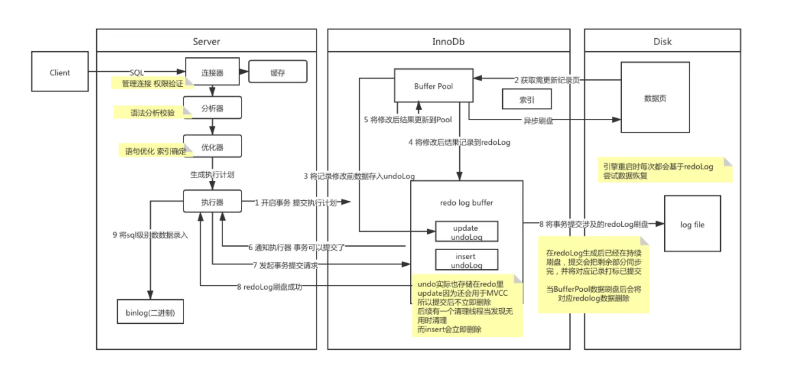

## 简介

要实现大规模、繁忙或高可靠性的数据库应用程序，从不同数据库系统移植大量代码，
或调优 MySQL 性能，理解 `InnoDB` 锁机制和 `InnoDB` 事务模型非常重要。

## InnoDB 和 ACID 模型

`InnoDB` 事务模型旨在将多版本数据库的最佳特性与传统两阶段锁相结合。
`InnoDB` 在行级别执行锁定，默认情况下以 Oracle 风格运行查询作为[非锁定一致性读](/docs/CS/DB/MySQL/Transaction.md?id=consistent-read)。
`InnoDB` 中的锁信息以空间高效的方式存储，因此无需锁升级。
通常，允许多个用户锁定 `InnoDB` 表中的每一行或任何随机子集，而不会导致 `InnoDB` 内存耗尽。

和 ACID 事务关系：

- 原子性、一致性和持久性依靠 redo log 和 Undo Log
- 隔离性依靠 Lock 和 MVCC

SQL 记录执行流程：



### 事务隔离级别

#### READ UNCOMMITTED

在 `READ UNCOMMITTED` 级别运行的事务**不发出共享锁来阻止其他事务修改当前事务读取的数据**。
`READ UNCOMMITTED` 事务也不会被排他锁阻塞，这些排他锁会阻止当前事务读取已被其他事务修改但未提交的行。
**此选项的效果等同于在事务的所有 SELECT 语句中在所有表上设置 NOLOCK。**

#### READ COMMITTED

每次一致性读，即使在同一事务内，也会设置并读取自己的**新快照。**

**由于禁用了间隙锁，可能会出现`幻读`问题，因为其他会话可以向间隙中插入新行**。

`READ COMMITTED` 隔离级别仅支持基于行的二进制日志记录。
如果在使用 `READ COMMITTED` 时设置了 `binlog_format=MIXED`，服务器会自动使用基于行的日志记录。

使用 `READ COMMITTED` 还有其他效果：

- 对于 `UPDATE` 或 `DELETE` 语句，`InnoDB` 仅持有其更新或删除的行的锁。
  MySQL 评估完 `WHERE` 条件后，会释放不匹配行的记录锁。
  这大大降低了死锁的概率，但死锁仍可能发生。
- 对于 `UPDATE` 语句，如果某行已被锁定，`InnoDB` 执行"半一致性读"，
  将最新的已提交版本返回给 MySQL，以便 MySQL 判断该行是否匹配 `UPDATE` 的 `WHERE` 条件。
  如果该行匹配（需要更新），MySQL 再次读取该行，此时 `InnoDB` 要么锁定它，要么等待其上的锁。

#### REPEATABLE READ

这是 InnoDB 的默认隔离级别。
同一事务内的一致性读**读取首次读取建立的快照**（任何 SELECT 或 UPDATE/INSERT/DELETE）。
这意味着如果在同一事务内发出多个普通（非锁定）SELECT 语句，这些 SELECT 语句彼此之间也是一致的。

对于锁定读（带 FOR UPDATE 或 LOCK IN SHARE MODE 的 SELECT）、UPDATE 和 DELETE 语句，锁定取决于语句是使用具有唯一搜索条件的唯一索引还是范围型搜索条件。

- 对于具有唯一搜索条件的唯一索引，InnoDB 仅锁定找到的索引记录，而不锁定其前面的间隙。
- 对于其他搜索条件，InnoDB 锁定扫描的索引范围，使用间隙锁或 next-key 锁阻塞其他会话向该范围覆盖的间隙插入数据。

> [!TIP]
>
> 最佳实践是不在应用程序中混用存储引擎。
> 失败的事务可能导致不一致的结果，因为某些部分可以回滚而其他部分不能。

## 事务

```sql
/*  1 */ BEGIN
/*  2 */ BEGIN WORK
/*  3 */ START TRANSACTION
/*  4 */ START TRANSACTION READ WRITE
/*  5 */ START TRANSACTION READ ONLY
/*  6 */ START TRANSACTION WITH CONSISTENT SNAPSHOT
/*  7 */ START TRANSACTION WITH CONSISTENT SNAPSHOT, READ WRITE
```

语句 1 ~ 4：用于开始一个新的读写事务。
语句 5：用于开始一个新的只读事务。
这两类语句都不需立即创建一致性读视图，事务的启动将延迟至实际需要时。
语句 6 ~ 7：用于开始一个新的读写事务。
语句 8：用于开始一个新的只读事务。
这两类语句都会先启动事务，随后立即创建一致性读视图。

常用于开始一个事务的语句，大概非 BEGIN 莫属了。
BEGIN 语句主要做两件事：
辞旧：提交老事务。
迎新：准备新事务。

BEGIN 语句会判断当前连接中是否有可能存在未提交事务，判断逻辑为：当前连接的线程是否被打上了 OPTION_NOT_AUTOCOMMIT 或 OPTION_BEGIN 标志位。

```c++
inline bool in_multi_stmt_transaction_mode() const {
    return variables.option_bits & (OPTION_NOT_AUTOCOMMIT | OPTION_BEGIN);
  }
```

只要 variables.option_bits 包含其中一个标志位，就说明当前连接中可能存在未提交事务。
BEGIN 语句想要开始一个新事务，就必须先执行一次提交操作，把可能未提交的事务给提交了。
然后给当前连接的线程打上 OPTION_BEGIN 标志，并不会马上启动一个新的事务。

InnoDB 读写表中数据的操作都在事务中执行，开始一个事务的方式有两种：
手动：通过 BEGIN、START TRANSACTION 语句以及它们的扩展形式开始一个事务。
自动：直接执行一条 SQL 语句，InnoDB 会自动开始一个事务，SQL 语句执行完成之后，又会自动提交这个事务。
这两种方式开始的事务，都用来执行用户 SQL 语句，属于用户事务。
InnoDB 有时候也需要自己执行一些 SQL 语句，为了和用户 SQL 做区分，我们把这些 SQL 称为内部 SQL。
内部 SQL 也需要在事务中执行，执行这些 SQL 的事务就是内部事务。
InnoDB 有几种场景会使用内部事务，以下是其中主要的三种：
如果上次关闭 MySQL 时有未提交，或者正在提交但未提交完成的事务，启动过程中，InnoDB 会把这些事务恢复为内部事务，然后提交或者回滚。
后台线程执行一些操作时，需要在内部事务中执行内部 SQL。
以 ib_dict_stats 线程为例，它计算各表、索引的统计信息之后，会使用内部事务执行内部 SQL，更新 mysql.innodb_table_stats、mysql.innodb_index_stats 表中的统计信息。
为了实现原子操作，DDL 语句执行过程中，InnoDB 会使用内部事务执行内部 SQL，插入一些数据到 mysql.innodb_ddl_log 表中。

由于要存放事务 ID、事务状态、Undo 日志编号、事务所属的用户线程等信息，每个事务都有一个与之对应的对象，我们称之为事务对象。
每个事务对象都要占用内存，如果每启动一个事务都要为事务对象分配内存，释放事务时又要释放内存，会降低数据库性能。

```c++
struct Pool {
  typedef Type value_type;

  struct Element {
    Pool *m_pool;
    value_type m_type;
  };

 private:
  /** 指向最后一个元素的指针 */
  Element *m_end;
  /** 指向第一个元素的指针 */
  Element *m_start;
  /** 块大小（字节） */
  size_t m_size;
  /** 已用空间的上限 */
  Element *m_last;
  /** 按指针地址排序的优先级队列 */
  pqueue_t m_pqueue;
  /** 使用的锁策略 */
  LockStrategy m_lock_strategy;
};
```

为了避免频繁分配、释放内存对数据库性能产生影响，InnoDB 引入了事务池（Pool），用于管理事务。
MySQL 在启动过程中会创建事务池管理器，负责事务池的管理。

```c++
/** 创建 trx_t 池 */
void trx_pool_init() {
  trx_pools = ut::new_withkey<trx_pools_t>(UT_NEW_THIS_FILE_PSI_KEY,
                                           MAX_TRX_BLOCK_SIZE);
  ut_a(trx_pools != nullptr);
}
```

```c++
/** trx_t 池管理器 */
static trx_pools_t *trx_pools;
/** 每个 trx_t 池的大小（字节） */
static const ulint MAX_TRX_BLOCK_SIZE = 1024 * 1024 * 4;
```

每个事务池能用来存放事务对象的内存是 4M。
创建事务池的过程中，InnoDB 会分配一块 4M 的内存用于存放事务对象。
每个事务对象的大小为 992 字节，4M 内存能够存放 4194304 / 992 = 4228 个事务对象。

事务池有一个队列，用于存放已经初始化的事务对象，称为事务队列。
InnoDB 初始化事务池的过程中，不会初始化全部的 4228 块小内存，只会初始化最前面的 16 块小内存，得到 16 个事务对象并放入事务队列。

```c++
Pool(size_t size) : m_end(), m_start(), m_size(size), m_last() {
    ut_a(size >= sizeof(Element));
    m_lock_strategy.create();
    ut_a(m_start == nullptr);
    m_start = reinterpret_cast<Element *>(
        ut::zalloc_withkey(UT_NEW_THIS_FILE_PSI_KEY, m_size));
    m_last = m_start;
    m_end = &m_start[m_size / sizeof(*m_start)];
    /* 注意：只初始化一小部分，即使我们已经分配了所有内存。
    这是必需的，因为如果我们在前端实例化太多互斥锁，
    PFS (MTR) 的结果会发生变化。 */
    init(std::min(size_t(16), size_t(m_end - m_start)));
    ut_ad(m_pqueue.size() <= size_t(m_last - m_start));
  }
```

MySQL 运行过程中，如果这 16 个事务对象都正在被使用，InnoDB 需要一个新的事务对象时，会一次性初始化剩余的 4212 个事务对象并放入事务池的事务队列。

```c++
Type *get() {
    Element *elem;
    m_lock_strategy.enter();
    if (!m_pqueue.empty()) {
      elem = m_pqueue.top();
      m_pqueue.pop();
    } else if (m_last < m_end) {
      /* 初始化剩余的元素 */
      init(m_end - m_last);
      ut_ad(!m_pqueue.empty());
      elem = m_pqueue.top();
      m_pqueue.pop();
    } else {
      elem = nullptr;
    }
    m_lock_strategy.exit();
    return (elem != nullptr ? &elem->m_type : nullptr);
  }
```

给事务分配对象时，会按照这个顺序：
先从事务池的事务队列中分配一个对象。
如果事务队列中没有可用的事务对象，就初始化事务池的剩余小块内存，从得到的事务对象中分配一个对象。
如果所有事务池都没有剩余未初始化的小块内存，就创建一个新的事务池，并从中分配一个事务对象。

分配一个事务对象，得到的是一个出厂设置的对象，这个对象的各属性值都已经是初始状态了。
分配事务对象之后，InnoDB 还会对事务对象的几个属性再做一次初始化工作，把这几个属性再一次设置为初始值，其实就是对这些属性做了重复的赋值操作。
这些属性中，有必要提一下的是事务状态（trx->state）。出厂设置的事务对象，事务状态是 TRX_STATE_NOT_STARTED，表示事务还没有开始。

除了给几个属性重复赋值，还会改变另外两个属性的值：
trx->in_innodb：给这个属性值加上 TRX_FORCE_ROLLBACK_DISABLE 标志，防止这个事务被其它线程触发回滚操作。事务后续执行过程中，这个标志可能会被清除。
trx->lock.autoinc_locks：分配一块内存空间，用于存放 autoinc 锁结构。事务执行过程中需要为 auto_increment 字段生成自增值时使用。

我们查询 information_schema.innodb_trx 表，能看到当前正在执行的事务有哪些，这些事务来源于两个链表。
为用户事务分配一个事务对象之后，还有一件非常重要的事，就是把事务对象放入其中一个链表的最前面：

```c++
UT_LIST_ADD_FIRST(trx_sys->mysql_trx_list, trx);
```

从上面的代码可以看到，这个链表就是 trx_sys->mysql_trx_list，它只会记录用户事务。
至于内部事务，并不会放入 trx_sys->mysql_trx_list 链表。等到真正启动事务时，事务对象会被放入另一个链表。

### 启动事务

启动事务最重要的事情之一，就是修改事务状态到 `TRX_STATE_ACTIVE`。

```c++
trx->state.store(TRX_STATE_ACTIVE, std::memory_order_relaxed)
```

事务启动于执行第一条 SQL 语句时。如果第一条 SQL 语句是 select、update、delete，InnoDB 会以读事务的身份启动新事务。

```c++
/** 启动一个事务。 */
static void trx_start_low(
    trx_t *trx,      /*!< in: 事务 */
    bool read_write) /*!< in: 如果是读写事务则为 true */
{
  ut_ad(!trx->in_rollback);
  ut_ad(!trx->is_recovered);
  ut_ad(trx->start_line != 0);
  ut_ad(trx->start_file != nullptr);
  ut_ad(trx->roll_limit == 0);
  ut_ad(!trx->lock.in_rollback);
  ut_ad(trx->error_state == DB_SUCCESS);
  ut_ad(trx->rsegs.m_redo.rseg == nullptr);
  ut_ad(trx->rsegs.m_noredo.rseg == nullptr);
  ut_ad(trx_state_eq(trx, TRX_STATE_NOT_STARTED));
  ut_ad(UT_LIST_GET_LEN(trx->lock.trx_locks) == 0);
  ut_ad(!(trx->in_innodb & TRX_FORCE_ROLLBACK));
  ut_ad(trx_can_be_handled_by_current_thread_or_is_hp_victim(trx));

  ++trx->version;

  /* 检查是否为 AUTOCOMMIT SELECT */
  trx->auto_commit = (trx->api_trx && trx->api_auto_commit) ||
                     thd_trx_is_auto_commit(trx->mysql_thd);

  trx->read_only = (trx->api_trx && !trx->read_write) ||
                   (!trx->internal && thd_trx_is_read_only(trx->mysql_thd)) ||
                   srv_read_only_mode;

  if (!trx->auto_commit) {
    ++trx->will_lock;
  } else if (trx->will_lock == 0) {
    trx->read_only = true;
  }
  trx->persists_gtid = false;

#ifdef UNIV_DEBUG
  /* 如果事务是 DD attachable trx，它应该是 AC-NL-RO
  (AutoCommit-NonLocking-ReadOnly) trx */
  if (trx->is_dd_trx) {
    ut_ad(trx->read_only);
    ut_ad(trx->auto_commit);
    ut_ad(trx->isolation_level == TRX_ISO_READ_UNCOMMITTED ||
          trx->isolation_level == TRX_ISO_READ_COMMITTED);
  }
#endif /* UNIV_DEBUG */

  /* 注意，trx->start_time 设置时未使用 std::memory_order_release，
  并且下面的 trx->state 既未在临界区内设置（由 trx_sys->mutex 保护），
  也未使用 std::memory_order_release。
  这对于下面代码中的只读事务是可能的。
  这可能导致 buf_pool_resize 线程内关于事务持续时间过长的错误消息。
  决定为只读事务保留此问题，因为提供修复方案以确保此类事务的状态信息
  始终一致需要更多工作。
  TODO: 检查此微优化在 ARM 上的性能提升。 */

  if (trx->mysql_thd != nullptr) {
    trx->start_time.store(thd_start_time(trx->mysql_thd),
                          std::memory_order_relaxed);
    if (!trx->ddl_operation) {
      trx->ddl_operation = thd_is_dd_update_stmt(trx->mysql_thd);
    }
  } else {
    trx->start_time.store(std::chrono::system_clock::from_time_t(time(nullptr)),
                          std::memory_order_relaxed);
  }

  /* trx->no 的初始值：TRX_ID_MAX 用于
  read_view_open_now: */

  trx->no = TRX_ID_MAX;

  ut_a(ib_vector_is_empty(trx->lock.autoinc_locks));

  /* 此值仅由检查锁系统队列的线程读取，
  在将此 trx 入队的线程释放队列的 latch 之后。 */
  trx->lock.schedule_weight.store(0, std::memory_order_relaxed);

  /* 如果此事务来自 trx_allocate_for_mysql()，
  trx->in_mysql_trx_list 将持有。在这种情况下，trx->state
  的更改必须受 trx_sys->mutex 保护，以便
  lock_print_info_all_transactions() 有一致的视图。 */

  ut_ad(!trx->in_rw_trx_list);

  /* 我们倾向于过度断言，这使代码有些复杂。
  例如，事务状态可以更早设置，但由于某些
  trx 列表断言被不必要的触发，我们被迫在
  trx_sys_t::mutex 保护下设置它。 */

  /* 默认情况下，所有事务都在只读列表中，除非它们是
  非锁定自动提交只读事务或后台（内部）事务。
  注意：显式标记为只读的事务可以写入临时表，
  我们也将其放在 RO 列表中。 */

  if (!trx->read_only &&
      (trx->mysql_thd == nullptr || read_write || trx->ddl_operation)) {
    trx_assign_rseg_durable(trx);

    /* 仅当事务更新临时表时才分配临时 rseg */
    DEBUG_SYNC_C("trx_sys_before_assign_id");

    trx_sys_mutex_enter();

    trx->id = trx_sys_allocate_trx_id();

    trx_sys->rw_trx_ids.push_back(trx->id);

    ut_ad(trx->rsegs.m_redo.rseg != nullptr || srv_read_only_mode ||
          srv_force_recovery >= SRV_FORCE_NO_TRX_UNDO);

    trx_add_to_rw_trx_list(trx);

    trx->state.store(TRX_STATE_ACTIVE, std::memory_order_relaxed);

    ut_ad(trx_sys_validate_trx_list());

    trx_sys_mutex_exit();

    trx_sys_rw_trx_add(trx);

  } else {
    trx->id = 0;

    if (!trx_is_autocommit_non_locking(trx)) {
      /* 如果这是一个向临时表写入数据的只读事务，
      则需要事务 ID 才能写入临时表。 */

      if (read_write) {
        trx_sys_mutex_enter();

        ut_ad(!srv_read_only_mode);

        trx->state.store(TRX_STATE_ACTIVE, std::memory_order_relaxed);

        trx->id = trx_sys_allocate_trx_id();

        trx_sys->rw_trx_ids.push_back(trx->id);

        trx_sys_mutex_exit();

        trx_sys_rw_trx_add(trx);

      } else {
        trx->state.store(TRX_STATE_ACTIVE, std::memory_order_relaxed);
      }
    } else {
      ut_ad(!read_write);
      trx->state.store(TRX_STATE_ACTIVE, std::memory_order_relaxed);
    }
  }

  ut_a(trx->error_state == DB_SUCCESS);

  MONITOR_INC(MONITOR_TRX_ACTIVE);
}
```

只读事务是读事务的一个特例，从字面上看，它是不能改变（插入、修改、删除）表中数据的。
然而，这个只读并不是绝对的，只读事务不能改变系统表、用户普通表的数据，但是可以改变用户临时表的数据。
作为读事务的特例，只读事务也要遵守读事务的规则，事务 ID 应该为 0。
只读事务操作系统表、用户普通表，只能读取表中数据，事务 ID 为 0（即不分配事务 ID）没问题。
只读事务操作用户临时表，可以改变表中数据，而用户临时表也支持事务 ACID 特性中的 3 个（ACI），这就需要分配事务 ID 了。
如果只读事务执行的第一条 SQL 语句就是插入记录到用户临时表的 insert，事务启动过程中会分配事务 ID。

如果事务执行的第一条 SQL 语句是 insert，这个事务就会以读写事务的身份启动。
读写事务的启动过程，主要会做这几件事：
- 为用户普通表分配回滚段，用于写 Undo 日志。
- 分配事务 ID。
- 把事务对象加入 trx_sys->rw_trx_list 链表。这个链表记录了所有读写事务。

```c++
UT_LIST_ADD_FIRST(trx_sys->rw_trx_list, trx);

static inline void trx_add_to_rw_trx_list(trx_t *trx) {
  ut_ad(srv_is_being_started || trx_sys_mutex_own());
  ut_ad(!trx->in_rw_trx_list);
  UT_LIST_ADD_FIRST(trx_sys->rw_trx_list, trx);
  ut_d(trx->in_rw_trx_list = true);
}
```

用户事务以什么身份启动，取决于执行的第一条 SQL 是什么。
和用户事务不一样，InnoDB 启动内部事务都是为了改变表中数据，所以，内部事务都是读写事务。
作为读写事务，所有内部事务都会加入到 trx_sys->rw_trx_list 链表中。

在 update 或 delete 语句执行过程中，读事务就会变成读写事务。
发生变化的具体时间点，又取决于这两类 SQL 语句更新或删除记录的第一个表是什么类型。
如果第一个表是用户普通表，InnoDB 从表中读取一条记录之前，会给表加意向排他锁（IX）。
加意向排他锁时，如果以下三个条件成立，InnoDB 就会把这个事务变成读写事务：
事务还没有为用户普通表分配回滚段。
事务 ID 为 0，说明这个事务现在还是读事务。
事务的只读标识 trx->read_only = false，说明这个事务可以变成读写事务。

读事务变成读写事务，InnoDB 主要做 3 件事：
分配事务 ID。
为用户普通表分配回滚段。
把事务对象加入 trx_sys->rw_trx_list 链表。

如果第一个表是用户临时表，因为它的可见范围只限于创建这个表的数据库连接之内，其它数据库连接中执行的事务都看不到这个表，更不能改变表中的数据，所以，update、delete 语句改变用户临时表中的数据，不需要加意向排他锁。
读事务变成读写事务的操作会延迟到 server 层触发 InnoDB 更新或删除记录之后，InnoDB 执行更新或删除操作之前。
在这个时间节点，如果以下三个条件成立，InnoDB 就会把这个事务变成读写事务：
事务已经启动了。
事务 ID 为 0，说明这个事务现在还是读事务。
事务的只读标识 trx->read_only = false，说明这个事务可以变成读写事务。
有一点需要说明，改变用户临时表的数据触发读事务变成读写事务，不会分配用户临时表回滚段，需要等到为某个用户临时表第一次写 Undo 日志时才分配。

在 select 语句执行过程中，读事务不会变成读写事务；这条 SQL 语句执行完之后、事务提交之前，第一次执行 insert、update、delete 语句时，读事务才会变成读写事务。
一个读事务变成读写事务的操作，只会发生一次，发生变化的具体时间点，取决于最先碰到哪种 SQL 语句。
如果最先碰到 insert 语句，server 层准备好要插入的记录的每个字段之后，会触发 InnoDB 执行插入操作。
执行插入操作之前，如果以下三个条件成立，InnoDB 就会把这个事务变成读写事务：
事务已经启动了。
事务 ID 为 0，说明这个事务现在还是读事务。
事务的只读标识 trx->read_only = false，说明这个事务可以变成读写事务。

只读事务不能改变（插入、更新、删除）系统表、用户普通表的数据，但是能改变用户临时表的数据。
改变用户临时表的数据，同样需要为事务分配事务 ID，为用户临时表分配回滚段。根据只读事务执行的第一条 SQL 语句不同，这两个操作发生的时间点也可以分为两类：
在 update 或 delete 语句执行过程中，server 层触发 InnoDB 更新或删除记录之后，InnoDB 执行更新或删除操作之前，如果以下三个条件成立，InnoDB 就为这个事务分配事务 ID、为用户临时表分配回滚段:
事务已经启动了。
事务 ID 为 0。
事务是个只读事务（trx->read_only = true）。

## 锁

InnoDB 使用两阶段锁定协议。
它在事务期间的任何时候都可以获取锁，但在 COMMIT 或 ROLLBACK 之前不会释放锁。
它同时释放所有锁。
前面描述的锁机制都是隐式的。
InnoDB 根据隔离级别自动处理锁。

> TODO:
>
> [MySQL · 源码分析 · MySQL deadlock cause by lock inherit](http://mysql.taobao.org/monthly/2024/03/02/)

### 锁类型

```sql
mysql> select * from information_schema.innodb_locks;
mysql> select * from information_schema.innodb_lock_waits;
mysql> select * from information_schema.innodb_trx;
```

行级锁仅在服务器层实现。

#### 共享锁和排他锁

`InnoDB` 实现标准的**行级锁**，有两种类型的锁：共享（`S`）锁和排他（`X`）锁。

- 共享（`S`）锁允许持有锁的事务读取一行。
- 排他（`X`）锁允许持有锁的事务更新或删除一行。

如果事务 `T1` 在行 `r` 上持有共享（`S`）锁，则来自不同事务 `T2` 对行 `r` 的锁请求处理如下：

- `T2` 对 `S` 锁的请求可以立即授予。因此，`T1` 和 `T2` 都在 `r` 上持有 `S` 锁。
- `T2` 对 `X` 锁的请求不能立即授予。

如果事务 `T1` 在行 `r` 上持有排他（`X`）锁，则来自不同事务 `T2` 对 `r` 的任何类型锁请求都不能立即授予。
相反，事务 `T2` 必须等待事务 `T1` 释放其在行 `r` 上的锁。

#### 意向锁

`InnoDB` 支持*多粒度锁定*，允许行锁和表锁共存。
例如，`LOCK TABLES ... WRITE` 语句在指定表上获取排他锁（`X` 锁）。
为使多粒度锁定可行，`InnoDB` 使用意向锁。
意向锁是**表级**锁，指示事务稍后需要对表中某行获取哪种类型的锁（共享或排他）。
有两种类型的意向锁：

- 意向共享锁（`IS`）表示事务打算在表中的各个行上设置*共享*锁。
- 意向排他锁（`IX`）表示事务打算在表中的各个行上设置排他锁。

例如，`SELECT ... FOR SHARE` 设置 `IS` 锁，`SELECT ... FOR UPDATE` 设置 `IX` 锁。

意向锁协议如下：

- 在事务可以获取表中某行的共享锁之前，它必须首先获取表的 `IS` 锁或更强的锁。
- 在事务可以获取表中某行的排他锁之前，它必须首先获取表的 `IX` 锁。

表级锁类型兼容性总结如下表：

|      | `X`      | `IX`       | `S`        | `IS`       |
| :--- | :------- | :--------- | :--------- | :--------- |
| `X`  | 冲突 | 冲突   | 冲突   | 冲突   |
| `IX` | 冲突 | 兼容 | 冲突   | 兼容 |
| `S`  | 冲突 | 冲突   | 兼容 | 兼容 |
| `IS` | 冲突 | 兼容 | 兼容 | 兼容 |

#### 记录锁

记录锁是索引记录上的锁。
例如，`SELECT c1 FROM t WHERE c1 = 10 FOR UPDATE;` 阻止任何其他事务插入、更新或删除 `t.c1` 值为 `10` 的行。

**记录锁始终锁定索引记录**，即使表没有定义索引。
对于这种情况，`InnoDB` 创建一个隐藏的聚簇索引并使用该索引进行记录锁定。

#### 间隙锁

**间隙锁是索引记录之间间隙上的锁，或者是第一个索引记录之前或最后一个索引记录之后间隙上的锁。**
例如，`SELECT c1 FROM t WHERE c1 BETWEEN 10 and 20 FOR UPDATE;` 阻止其他事务向列 `t.c1` 插入值 `15`，
无论该列中是否已存在任何此类值，因为范围内的所有现有值之间的间隙都被锁定。

**间隙可以跨越单个索引值、多个索引值，甚至可以是空的。**

间隙锁是性能和并发性之间的权衡，在某些事务隔离级别中使用，而在其他级别中不使用。

*对于使用唯一索引搜索唯一行的语句，不需要间隙锁。*
（这不包括搜索条件仅包含多列唯一索引的部分列的情况；这种情况下确实会发生间隙锁。）

如果 `id` 没有索引或具有非唯一索引，则该语句会锁定前面的间隙。

还值得注意的是，不同事务可以在同一间隙上持有冲突的锁。
例如，事务 A 可以在一个间隙上持有共享间隙锁（gap S-lock），而事务 B 在同一间隙上持有排他间隙锁（gap X-lock）。
允许冲突的间隙锁的原因是，如果从索引中清理了一条记录，不同事务在该记录上持有的间隙锁必须合并。

`InnoDB` 中的间隙锁是"纯粹抑制性的"，意味着其唯一目的是阻止其他事务向间隙插入数据。
间隙锁可以共存。一个事务获取的间隙锁不会阻止另一个事务在同一间隙上获取间隙锁。
**共享和排他间隙锁之间没有区别。它们彼此不冲突，并且执行相同的功能。**

间隙锁可以显式禁用。如果将事务隔离级别更改为 `READ COMMITTED`，则会禁用间隙锁。
在这种情况下，间隙锁在搜索和索引扫描中被禁用，仅用于外键约束检查和重复键检查。

使用 `READ COMMITTED` 隔离级别还有其他效果。
*不匹配行的记录锁在 MySQL 评估完 `WHERE` 条件后释放。对于 `UPDATE` 语句，`InnoDB` 执行"半一致性读"，
将最新的已提交版本返回给 MySQL，以便 MySQL 判断该行是否匹配 `UPDATE` 的 `WHERE` 条件。*

#### Next-Key 锁

**Next-Key 锁是索引记录上的记录锁和索引记录之前间隙上的间隙锁的组合。**

`InnoDB` 执行行级锁定的方式是，当它搜索或扫描表索引时，会在遇到的索引记录上设置共享或排他锁。
因此，**行级锁实际上是索引记录锁**。
*索引记录上的 next-key 锁也会影响该索引记录之前的"间隙"。*
也就是说，next-key 锁是一个索引记录锁加上该索引记录之前间隙上的间隙锁。
如果一个会话在索引中的记录 `R` 上持有共享或排他锁，则另一个会话不能按索引顺序在 `R` 之前的间隙中插入新的索引记录。

对于最后一个区间，next-key 锁锁定索引中最大值之上的间隙以及值高于索引中任何实际值的"supremum"伪记录。
Supremum 不是真正的索引记录，因此实际上，此 next-key 锁仅锁定最大索引值之后的间隙。

> [!NOTE]
>
> 默认情况下，`InnoDB` 在 `REPEATABLE READ` 事务隔离级别下运行。
> 在这种情况下，**`InnoDB` 使用 next-key 锁进行搜索和索引扫描，这可以防止`幻读`**。

#### 插入意向锁

**插入意向锁是 `INSERT` 操作在行插入之前设置的一种间隙锁**。
此锁表示插入意图，使得多个插入到同一索引间隙的事务如果不在间隙内的同一位置插入，则无需相互等待。
假设有索引记录值为 4 和 7。
尝试分别插入值 5 和 6 的不同事务，在获取插入行的排他锁之前，各自使用插入意向锁锁定 4 和 7 之间的间隙，
但不会互相阻塞，因为这些行不冲突。

#### 自增锁

`AUTO-INC` 锁是事务在向具有 `AUTO_INCREMENT` 列的表插入数据时获取的特殊表级锁。
在最简单的情况下，如果一个事务正在向表中插入值，任何其他事务必须等待才能向该表执行自己的插入操作，
以便第一个事务插入的行获得连续的主键值。

`innodb_autoinc_lock_mode` 变量控制用于自增锁定的算法。
它允许你在可预测的自增值顺序和插入操作的最大并发性之间进行权衡。

```sql
SHOW VARIABLES LIKE 'innodb_autoinc_lock_mode'; -- 2
```

Update & Delete 加锁：

ClusterIndex
- 命中：都是 X 锁
- 未命中：只有 RR 加 GAP 锁

Second Unique Index
- 命中：二级索引和聚簇索引都是 X 锁
- 未命中：只有 RR 在二级索引加 GAP 锁

二级非唯一索引
- 命中：RC 对两个索引加 X 锁；RR 对二级索引加 X 和 GAP 锁，对 Cluster 索引加 X 锁
- 未命中：只有 RR 在二级索引加 GAP 锁

INSERT 语句加锁：

- 为了防止幻读，如果记录之间加有 GAP 锁，此时不能 INSERT。
- 如果 INSERT 的记录和已有记录造成唯一键冲突，此时不能 INSERT。

### 源代码

```cpp
/** 锁模式和类型 */
/** @{ */
#define LOCK_MODE_MASK                          \
  0xFUL /*!< 用于从锁的 type_mode 字段提取模式的掩码 */
/** 锁类型 */
#define LOCK_TABLE 16 /*!< 表锁 */
#define LOCK_REC 32   /*!< 记录锁 */
#define LOCK_TYPE_MASK                                \
  0xF0UL /*!< 用于从锁的 type_mode 字段提取锁类型的掩码 */
#if LOCK_MODE_MASK & LOCK_TYPE_MASK
#error "LOCK_MODE_MASK & LOCK_TYPE_MASK"
#endif

#define LOCK_WAIT                          \
  256 /*!< 等待锁标志；设置时表示锁尚未授予，\
      仅在等待队列中等待轮到自己 */
/* 精确模式 */
#define LOCK_ORDINARY                     \
  0 /*!< 此标志表示普通的 next-key 锁，\
    相对于 LOCK_GAP 或 LOCK_REC_NOT_GAP */
#define LOCK_GAP                                     \
  512 /*!< 设置此位时，表示锁仅持有在记录之前的间隙上；\
      例如，间隙上的 x-lock 不授予修改设置此位的记录的权限；\
      当记录从索引记录链中移除时会创建此类锁 */
#define LOCK_REC_NOT_GAP                            \
  1024 /*!< 此位表示锁仅在索引记录上，不阻塞向索引记录之前的间隙插入；\
       用于使用唯一键检索记录时，也用于锁定普通 SELECT（非 UPDATE 或 DELETE \
       的一部分）且用户已设置 READ COMMITTED 隔离级别时 */
#define LOCK_INSERT_INTENTION                                             \
  2048                       /*!< 当放置等待间隙类型记录锁请求以让索引记录的插入\
                          等待其他事务在间隙上没有冲突锁时设置此位；\
                          注意，当等待锁被授予或锁被继承到相邻记录时，\
                          此标志保持设置 */
#define LOCK_PREDICATE 8192  /*!< 谓词锁 */
#define LOCK_PRDT_PAGE 16384 /*!< 页面锁 */
```

### 死锁

死锁是指不同事务无法继续执行的情况，因为每个事务都持有另一个事务需要的锁。
由于两个事务都在等待资源变为可用，因此两者都不会释放其持有的锁。

#### 最小化和处理死锁

可以通过以下技术应对死锁并降低其发生概率：

- 随时执行 `SHOW ENGINE INNODB STATUS` 以确定最近一次死锁的原因。这有助于调整应用程序以避免死锁。
- `SHOW FULL PROCESSLIST`
- 查看 information_schema 中的 `INNODB_TRX`、`INNODB_LOCKS`、`INNODB_LOCK_WAITS` 表。
- 如果频繁的死锁警告引起关注，可通过启用 `innodb_print_all_deadlocks` 变量收集更广泛的调试信息。
  每个死锁（不仅是最新的一个）的信息都会记录到 MySQL [错误日志]()中。
  调试完成后禁用此选项。
- 始终准备好从事务因死锁而失败时重新发起事务。死锁并不危险，只需重试即可。
- 保持事务短小精悍，使其不易发生冲突。
- 完成一组相关更改后立即提交事务，使其不易发生冲突。特别是，不要让交互式 **mysql** 会话长时间处于未提交事务状态。
- 如果使用*锁定读*（`SELECT ... FOR UPDATE` 或 `SELECT ... FOR SHARE`），尝试使用较低的隔离级别，如 `READ COMMITTED`。
- 在事务中修改多个表或同一表中不同的行集时，每次都按一致的顺序执行这些操作。
  这样事务会形成定义良好的队列，不会发生死锁。
  例如，将数据库操作组织到应用程序内的函数中，或调用存储过程，而不是在不同位置编写多个相似的 `INSERT`、`UPDATE` 和 `DELETE` 语句序列。
- 为表添加精心选择的索引，使查询扫描更少的索引记录并设置更少的锁。使用 `EXPLAIN SELECT` 确定 MySQL 服务器认为哪些索引最适合你的查询。
- 减少锁定。如果允许 `SELECT` 从旧快照返回数据，则不要添加 `FOR UPDATE` 或 `FOR SHARE` 子句。
  使用 `READ COMMITTED` 隔离级别在这里很有用，因为同一事务内的每次一致性读都读取自己的新快照。
- 如果其他方法都无效，使用表级锁序列化事务。对事务性表（如 `InnoDB` 表）正确使用 `LOCK TABLES` 的方法是使用 `SET autocommit = 0`（不是 `START TRANSACTION`）开始事务，然后执行 `LOCK TABLES`，
  并在显式提交事务之前不调用 `UNLOCK TABLES`。例如，如果需要写入表 `t1` 并从表 `t2` 读取，可以这样做：

  表级锁阻止对表的并发更新，以降低系统响应能力的代价避免死锁。
- 另一种序列化事务的方法是创建一个仅包含一行的辅助"信号量"表。
  让每个事务在访问其他表之前先更新该行。这样，所有事务都以串行方式发生。
  注意，在这种情况下 `InnoDB` 的即时死锁检测算法也有效，因为序列化锁是行级锁。
  使用 MySQL 表级锁时，必须使用超时方法来解决死锁。

#### 死锁检测

一种自动检测**死锁**何时发生，并自动**回滚**涉及的某个**事务**（称为**牺牲者**）的机制。
可以使用 `innodb_deadlock_detect` 配置选项禁用死锁检测。

#### 示例

参见 [mysql-deadlocks - github](https://github.com/aneasystone/mysql-deadlocks)

## MVCC

在并发控制理论中，有两种处理冲突的方式：

- 可以避免冲突，使用悲观锁定机制（例如读/写锁、两阶段锁定）。
- 可以允许冲突发生，但需要使用乐观锁定机制检测冲突（例如逻辑时钟、MVCC）。

由于 MVCC（多版本并发控制）是一种非常流行的并发控制技术（不仅在关系数据库系统中），本文将解释其工作原理。

当 [ACID 事务属性](/docs/CS/SE/Transaction.md?id=ACID) 首次被定义时，默认要求可串行化。为提供严格的可串行化事务结果，采用了 [2PL（两阶段锁定）](https://vladmihalcea.com/2pl-two-phase-locking/) 机制。使用 2PL 时，每次读取都需要获取共享锁，而写操作需要获取排他锁。

- 共享锁阻塞写入者，但允许其他读取者获取相同的共享锁。
- 排他锁同时阻塞竞争同一锁的读取者和写入者。

然而，锁定会导致争用，而争用会影响可扩展性。[Amdahl 定律](https://en.wikipedia.org/wiki/Amdahl's_law) 或 [通用可扩展性定律](http://www.perfdynamics.com/Manifesto/USLscalability.html) 展示了争用如何影响响应时间加速。

因此，数据库研究人员提出了一种不同的并发控制模型，试图将锁定降至最低，使得：

- 读取者不阻塞写入者。
- 写入者不阻塞读取者。

唯一仍可能产生争用的场景是两个并发事务尝试修改同一条记录，因为一旦修改，行将一直锁定到修改该事务提交或回滚为止。

为实现上述读取者/写入者非锁定行为，并发控制机制必须操作同一记录的多个版本，因此这种机制称为多版本并发控制（MVCC）。

虽然 2PL 相当标准化，但 MVCC 没有标准实现，每个数据库采用略有不同的方法。本文将使用 PostgreSQL，因为它的 MVCC 实现最容易可视化。

Oracle 和 MySQL 使用 [undo log](/docs/CS/DB/MySQL/undolog.md) 捕获未提交的更改，以便将行重建到其先前已提交的版本，而 PostgreSQL 将所有行版本存储在表数据结构中。

### InnoDB 多版本

InnoDB 通过为每个启动的事务分配事务 ID 来实现 MVCC。
该 ID 在事务首次读取任何数据时分配。
当在该事务中修改记录时，会向 undo log 写入一条解释如何撤销该更改的 undo 记录，
并将事务的回滚指针指向该 undo log 记录。
这样事务就能在需要时找到回滚路径。

当不同会话读取聚簇键索引记录时，InnoDB 会比较记录的事务 ID 与该会话的 ReadView。
如果记录在当前状态下不应可见（修改它的事务尚未提交），
则跟踪并应用 undo log 记录，直到会话到达一个可见的事务 ID。
此过程可能会一直循环到将整行删除的 undo 记录，向 ReadView 指示该行不存在。

事务中的记录通过设置记录"info flags"中的"deleted"位来删除。
这也在 undo log 中作为"删除删除标记"进行跟踪。

还值得注意的是，所有 undo log 写入也会记录到 redo log，因为 undo log 写入是服务器崩溃恢复过程的一部分，并且是事务性的。
这些 redo 和 undo log 的大小也在高并发事务性能中起着重要作用。

所有这些额外记录的结果是，大多数读取查询从不获取锁。
它们只以最快速度读取数据，确保只选择符合条件的行。
缺点是存储引擎必须在每行中存储更多数据，检查行时做更多工作，并处理一些额外的维护操作。

MVCC 仅与 REPEATABLE READ 和 READ COMMITTED 隔离级别配合使用。
READ UNCOMMITTED 不与 MVCC 兼容，因为查询不读取适合其事务版本的版本；它们始终读取最新版本。
SERIALIZABLE 不与 MVCC 兼容，因为读取会锁定它们返回的每一行。

`InnoDB` 是一个多版本存储引擎。
它保留已修改行的旧版本信息，以支持并发和回滚等事务特性。
**此信息存储在 undo 表空间中的 rollback segment 数据结构中。**
`InnoDB` 使用 rollback segment 中的信息执行事务回滚所需的 undo 操作。
它还使用该信息为一致性读构建行的早期版本。

在内部，`InnoDB` 为存储在数据库中的每一行添加三个字段：

- 6 字节的 `DB_TRX_ID` 字段标识最后插入或更新该行的事务的事务标识符。
  此外，删除在内部被视为一种更新，其中行中的特殊位被设置为标记为已删除。
- 7 字节的 `DB_ROLL_PTR` 字段称为回滚指针。回滚指针指向写入 rollback segment 的 **undo log** 记录。
  如果该行已更新，则 undo log 记录包含重建该行更新前内容所需的信息。
- 6 字节的 `DB_ROW_ID` 字段包含随着新行的插入而单调递增的行 ID。
  如果 `InnoDB` 自动生成聚簇索引，则该索引包含行 ID 值。否则，`DB_ROW_ID` 列不会出现在任何索引中。

Rollback segment 中的 undo log 分为 insert undo log 和 update undo log。
Insert undo log 仅在事务回滚时需要，事务提交后即可丢弃。
Update undo log 也用于一致性读，但只有在不再存在任何事务时才能丢弃，
这些事务的 `InnoDB` 已分配快照，而该快照在一致性读中可能需要 update undo log 中的信息来构建数据库行的早期版本。

建议定期提交事务，包括仅发出一致性读的事务。否则，
`InnoDB` 无法丢弃 update undo log 中的数据，rollback segment 可能变得过大，填满其所在的 undo 表空间。

Rollback segment 中 undo log 记录的物理大小通常小于对应的已插入或已更新行。
可以使用此信息计算 rollback segment 所需的空间。

在 `InnoDB` 多版本方案中，当使用 SQL 语句删除行时，该行并非立即从数据库中物理删除。
`InnoDB` 仅在丢弃为该删除写入的 update undo log 记录时，才物理删除相应的行及其索引记录。
此删除操作称为清理（purge），速度相当快，通常与执行删除的 SQL 语句所需时间相同。

如果在表中以大致相同的速率以小批量插入和删除行，
清理线程可能会开始滞后，表可能因"死"行而变得越来越大，导致一切受磁盘限制且非常缓慢。
在这种情况下，应限制新行操作，并通过调整 `innodb_max_purge_lag` 系统变量为清理线程分配更多资源。

### 多版本和辅助索引

`InnoDB` 多版本并发控制（MVCC）对辅助索引的处理与聚簇索引不同。
聚簇索引中的记录在原位更新，其隐藏的系统列指向 undo log 条目，从中可以重建记录的早期版本。
与聚簇索引记录不同，辅助索引记录不包含隐藏的系统列，也不在原位更新。

当辅助索引列被更新时，旧辅助索引记录被标记为删除，插入新记录，标记为删除的记录最终被清理。
**当辅助索引记录被标记为删除或辅助索引页被新事务更新时，`InnoDB` 在聚簇索引中查找数据库记录。**
在聚簇索引中，检查记录的 `DB_TRX_ID`，如果记录在读取事务启动后已被修改，则从 undo log 中检索正确的记录版本。

- 如果辅助索引记录被标记为删除或辅助索引页被新事务更新，则不使用[覆盖索引](/docs/CS/DB/MySQL/Transaction.md?id=covering_index)技术。
  `InnoDB` 不在索引结构中返回值，而是在聚簇索引中查找记录。
- 如果启用了[索引条件下推（ICP）](/docs/CS/DB/MySQL/Optimization.md?id=Index_Condition_Pushdown_Optimization)优化，并且 `WHERE` 条件的部分内容可以仅使用索引字段进行评估，
  MySQL 服务器仍会将这部分 `WHERE` 条件下推到存储引擎，使用索引进行评估。
  - 如果未找到匹配记录，则避免聚簇索引查找。
  - 如果找到匹配记录，即使是在标记为删除的记录中，`InnoDB` 也会在聚簇索引中查找记录。

### 锁定读

对 `InnoDB` 表执行**锁定**操作的 `SELECT` 语句。可以是 `SELECT ... FOR UPDATE` 或 `SELECT ... LOCK IN SHARE MODE`。根据事务的**隔离级别**，可能产生**死锁**。与**非锁定读**相对。在**只读事务**中不允许用于全局表。

`SELECT ... FOR SHARE` 在 MySQL 8.0.1 中取代了 `SELECT ... LOCK IN SHARE MODE`，但 `LOCK IN SHARE MODE` 仍保留以向后兼容。

### 一致性读

**一致性读**意味着 `InnoDB` 使用多版本技术向查询提供数据库在某个时间点的快照。查询可以看到在该时间点之前已提交事务所做的更改，而看不到之后或未提交事务所做的更改。此规则的例外是，查询可以看到同一事务中先前语句所做的更改。此异常会导致以下现象：
如果更新了表中的某些行，`SELECT` 可以看到已更新行的最新版本，但也可能看到任何行的旧版本。如果其他会话同时更新同一张表，该异常意味着可能看到数据库中从未存在过的表状态。

- 如果事务隔离级别是 `REPEATABLE READ`（默认级别），同一事务内的所有一致性读都读取该事务中首次此类读取建立的快照。可以通过提交当前事务然后发出新查询来获取更新的快照。
- 对于 `READ COMMITTED` 隔离级别，事务内的每次一致性读都设置并读取自己的新快照。

一致性读是 `InnoDB` 在 `READ COMMITTED` 和 `REPEATABLE READ` 隔离级别下处理 `SELECT` 语句的默认模式。一致性读不对其访问的表设置任何锁，因此其他会话可以在对表执行一致性读的同时自由修改这些表。

假设你在默认的 `REPEATABLE READ` 隔离级别下运行。当发出一致性读（即普通的 `SELECT` 语句）时，`InnoDB` 为事务提供一个时间点，查询根据该时间点查看数据库。**如果另一个事务删除了一行并在你的时间点分配后提交，你看不到该行已被删除。插入和更新同理。**

**数据库状态的快照适用于事务内的 `SELECT` 语句，不一定适用于 `DML` 语句**。

如果插入或修改了一些行然后提交了该事务，另一个并发的 `REPEATABLE READ` 事务发出的 `DELETE` 或 `UPDATE` 语句**可能会影响这些刚提交的行，即使该会话无法查询到它们**。如果一个事务更新或删除了由不同事务提交的行，这些更改确实对当前事务可见。

RR 为何不能解决幻读？

在其它事务中新增的 record，若本次事务中有其它事务更新，则会重新生成快照读，形成幻读。

## 事务流程

首次启动事务时：
1. 分配事务 ID (TRX_ID)，可能写入 TRX_SYS 页面中的最高事务 ID 字段。如果字段发生变化，TRX_SYS 页面修改记录会写入 redo log。
2. 基于分配的事务 ID 创建 ReadView。

记录修改：
每次 UPDATE 修改记录时：

- 分配 undo log 空间。
- 将记录中的先前值复制到 undo log。
- undo log 修改记录写入 redo log。
- 在缓冲池中修改页面；回滚指针指向 undo log 中写入的先前版本。
- 页面修改记录写入 redo log。
- 页面标记为"脏"（需要刷入磁盘）。

事务提交：
当事务提交时（隐式或显式）：

- Undo log 页面状态设置为"purge"（表示不再需要时可以清理）。
- Undo log 修改记录写入 redo log。
- Redo log 缓冲区刷入磁盘（取决于 innodb_flush_log_at_trx_commit 的设置）。

系统列：

1. DATA_ROW_ID
2. DATA_TRX_ID
3. DATA_ROLL_PTR

```c
// dict0dict.cc
/** 向表对象添加系统列。 */
void dict_table_add_system_columns(dict_table_t *table, mem_heap_t *heap) {
  ut_ad(table);
  ut_ad(table->n_def == (table->n_cols - table->get_n_sys_cols()));
  ut_ad(table->magic_n == DICT_TABLE_MAGIC_N);
  ut_ad(!table->cached);

  /* 注意：系统列必须按以下顺序添加
  （以便可以通过 DATA_ROW_ID 等的数值来索引）
  并作为表内存对象的最后一列。
  聚簇索引不会始终物理包含所有系统列。
  内部表不需要 DB_ROLL_PTR，因为这些表关闭了 UNDO 日志记录。 */

  dict_mem_table_add_col(table, heap, "DB_ROW_ID", DATA_SYS,
                         DATA_ROW_ID | DATA_NOT_NULL, DATA_ROW_ID_LEN, false);

  dict_mem_table_add_col(table, heap, "DB_TRX_ID", DATA_SYS,
                         DATA_TRX_ID | DATA_NOT_NULL, DATA_TRX_ID_LEN, false);

  if (!table->is_intrinsic()) {
    dict_mem_table_add_col(table, heap, "DB_ROLL_PTR", DATA_SYS,
                           DATA_ROLL_PTR | DATA_NOT_NULL, DATA_ROLL_PTR_LEN,
                           false);

    /* 此检查提醒，如果向程序添加了新的系统列，
    应在此处处理 */
  }
}
```

trx_sys_t:

1. MVCC
2. trx_id
3. [Rsegs](/docs/CS/DB/MySQL/Transaction.md?id=Rollback_Segment)

```c
// trx0sys.h
/** 事务系统中心内存数据结构。 */
struct trx_sys_t {  
	TrxSysMutex mutex;
  
  MVCC *mvcc; /** 多版本并发控制管理器 */
 
  /** 活跃 RW 事务的最小 trx->id（rw_trx_ids 中的最小值）。
  受 trx_sys_t::mutex 保护，但可能在没有互斥锁的情况下读取。 */
  std::atomic<trx_id_t> min_active_trx_id;
  
  std::atomic<trx_id_t> rw_max_trx_id; /** 存在或曾经存在过的读写事务的最大 trx id。 */
  
 /** 用于 MVCC 快照的读写事务 ID 数组。ReadView 会
  对这些事务的快照进行处理，其更改对 ReadView 不可见。
  我们应在内存提交和释放锁之前从列表中移除事务，
  以确保正确的移除顺序和一致性的快照。 */
  trx_ids_t rw_trx_ids;
  
  Rsegs rsegs; /** 指向 rollback segment 的指针向量。 */
  
  Rsegs tmp_rsegs; /** 指向临时表空间中 rollback segment 的指针向量； */
  
  /** 在 TRX_SYS 页面中发现的 undo 表空间 ID 列表。
  这不能是 trx_sys_t 对象的一部分，因为它在该对象
  创建之前就已初始化。 */
  extern Space_Ids *trx_sys_undo_spaces; 
  // ...
 };
```

MVCC ReadView：

```c
// read0read.h
/** MVCC ReadView 管理器 */
class MVCC {
 
  public:
  void view_open(ReadView *&view, trx_t *trx);

  void view_close(ReadView *&view, bool own_mutex);

  void view_release(ReadView *&view);

  void clone_oldest_view(ReadView *view);

  static bool is_view_active(ReadView *view) {
    ut_a(view != reinterpret_cast<ReadView *>(0x1));
    return (view != nullptr && !(intptr_t(view) & 0x1));
  }
  
 private:
  typedef UT_LIST_BASE_NODE_T(ReadView, m_view_list) view_list_t;

  /** 可供重用的空闲视图。 */
  view_list_t m_free;

  /** 活跃和已关闭的视图，关闭的视图的
  创建者事务 ID 设置为 TRX_ID_MAX */
  view_list_t m_views;
}
```

```c
// read0types.h
/** ReadView 列出那些一致性读不应看到其数据库修改的事务的事务 ID。 */
class ReadView {

 private:
  /** 读不应看到任何事务 ID >= 此值的事务。
  换句话说，这是"高水位线"。 */
  trx_id_t m_low_limit_id;

  /** 读应看到所有严格小于 (<) 此值的事务 ID。
  换句话说，这是"低水位线"。 */
  trx_id_t m_up_limit_id;

  /** 创建事务的事务 ID，对空闲视图设置为 TRX_ID_MAX */
  trx_id_t m_creator_trx_id;

  /** 拍摄此快照时活跃的 RW 事务集合 */
  ids_t m_ids;

  /** 视图不需要查看事务编号严格小于 (<) 此值的 undo 日志：
  如果其他视图不需要，可以在清理时移除 */
  trx_id_t m_low_limit_no;

#ifdef UNIV_DEBUG
  /** 不超过此低限制的 ReadView 不需要访问
  undo log 记录进行 MVCC。如果清理因 GTID 持久化而阻塞，
  此值可能高于 m_low_limit_no。当前用于调试
  变量 INNODB_PURGE_VIEW_TRX_ID_AGE。 */
  trx_id_t m_view_low_limit_no;
#endif /* UNIV_DEBUG */

  /** 已"关闭"的 AC-NL-RO 事务视图。 */
  bool m_closed;
}
```

#### ReadView

`mysqldump` 使用 `START TRANSACTION WITH CONSISTENT SNAPSHOT` 获取 ReadView。

row_search_mvcc -> lock_clust_rec_cons_read_sees

调用 changes_visible：

```c
/** 检查记录在一致性读中是否可见。
 @return 如果可见返回 true，否则应该检索记录的早期版本 */
bool lock_clust_rec_cons_read_sees(
    const rec_t *rec,     /*!< in: 应读取或跳过的用户记录 */
    dict_index_t *index,  /*!< in: 聚簇索引 */
    const ulint *offsets, /*!< in: rec_get_offsets(rec, index) */
    ReadView *view)       /*!< in: 一致性读视图 */
{
  ut_ad(index->is_clustered());
  ut_ad(page_rec_is_user_rec(rec));
  ut_ad(rec_offs_validate(rec, index, offsets));

  /* 临时表不跨连接共享，不同连接的事务
  不能同时操作同一临时表，因此临时表的读取
  始终是一致性读。 */
  if (srv_read_only_mode || index->table->is_temporary()) {
    ut_ad(view == nullptr || index->table->is_temporary());
    return (true);
  }

  /* 注意，我们在持有搜索系统 latch 时调用此函数。 */

  trx_id_t trx_id = row_get_rec_trx_id(rec, index, offsets);

  return (view->changes_visible(trx_id, index->table->name));
}
```

row_search_mvcc -> trx_assign_read_view -> MVCC::view_open -> ReadView::prepare

```cpp
/**
打开一个 ReadView，其中在此时间点之前序列化的事务在视图中可见。
@param id		创建者事务 ID */
void ReadView::prepare(trx_id_t id) {
  ut_ad(trx_sys_mutex_own());

  m_creator_trx_id = id;

  m_low_limit_no = trx_get_serialisation_min_trx_no();

  m_low_limit_id = trx_sys_get_next_trx_id_or_no();

  ut_a(m_low_limit_no <= m_low_limit_id);

  if (!trx_sys->rw_trx_ids.empty()) {
    copy_trx_ids(trx_sys->rw_trx_ids);
  } else {
    m_ids.clear();
  }

  /* 第一个活跃事务具有最小 ID。 */
  m_up_limit_id = !m_ids.empty() ? m_ids.front() : m_low_limit_id;

  ut_a(m_up_limit_id <= m_low_limit_id);

  ut_d(m_view_low_limit_no = m_low_limit_no);
  m_closed = false;
}
```

changes_visible:

```c
  /** 检查 id 的更改是否可见。
  @param[in]	id	要检查的事务 ID
  @param[in]	name	表名
  @return 视图是否看到 id 的修改 */
  bool changes_visible(trx_id_t id, const table_name_t &name) const
      MY_ATTRIBUTE((warn_unused_result)) {
    ut_ad(id > 0);

    if (id < m_up_limit_id || id == m_creator_trx_id) {
      return (true);
    }

    check_trx_id_sanity(id, name);

    if (id >= m_low_limit_id) {
      return (false);

    } else if (m_ids.empty()) {
      return (true);
    }

    const ids_t::value_type *p = m_ids.data();

    return (!std::binary_search(p, p + m_ids.size(), id));
  }
```

```c
/** 当更新不引起字段大小变化时原位更新记录。 */
dberr_t btr_cur_update_in_place(ulint flags, btr_cur_t *cursor, ulint *offsets,
                                const upd_t *update, ulint cmpl_info,
                                que_thr_t *thr, trx_id_t trx_id, mtr_t *mtr) {
 
  rec = btr_cur_get_rec(cursor);
  
  // ...
  /* 插入缓冲区树永远不应原位更新。 */
  // ...
  
  /* 检查压缩页面上是否有足够的空间。 */
 // ...

  /* 执行锁检查和 undo 日志记录 */
  err = btr_cur_upd_lock_and_undo(flags, cursor, offsets, update, cmpl_info,
                                  thr, mtr, &roll_ptr);

  if (!(flags & BTR_KEEP_SYS_FLAG) && !index->table->is_intrinsic()) {
    // 更新 trx_id, roll_ptr
    row_upd_rec_sys_fields(rec, nullptr, index, offsets, thr_get_trx(thr),
                           roll_ptr);
  }

  // ...
  row_upd_rec_in_place(rec, index, offsets, update, page_zip);

 // ...
  
  // 写 redo log
  btr_cur_update_in_place_log(flags, rec, index, update, trx_id, roll_ptr, mtr);

  return (err);
}
```

#### prepare

1. 设置 insert_undo 和 update_undo
2. redo log

```c
// trx0trx.cc
/** 为给定回滚段准备事务。
 @return lsn_t: 为调度回滚段提交分配的 LSN */
static lsn_t trx_prepare_low(
    // ...
  
    /* 将 undo log 段状态从 TRX_UNDO_ACTIVE 改为
    TRX_UNDO_PREPARED：这些对文件数据结构的修改
    在 LSN 的序列化点上定义了文件层面的事务为已准备。 */

    rseg->latch();

    if (undo_ptr->insert_undo != nullptr) {
      /* 无需在此获取 trx->undo_mutex，
      因为此事务的 prepare 只允许单个 OS 线程执行。 */
      trx_undo_set_state_at_prepare(trx, undo_ptr->insert_undo, false, &mtr);
    }

    if (undo_ptr->update_undo != nullptr) {
      if (!noredo_logging) {
        trx_undo_gtid_set(trx, undo_ptr->update_undo, true);
      }
      trx_undo_set_state_at_prepare(trx, undo_ptr->update_undo, false, &mtr);
    }

    rseg->unlatch();
  
    /*--------------*/
    /* 此 mtr 提交使事务在文件层面变为已准备。 */
    mtr_commit(&mtr);
    /*--------------*/

    if (!noredo_logging) {
      const lsn_t lsn = mtr.commit_lsn();
      ut_ad(lsn > 0 || !mtr_t::s_logging.is_enabled());
      return lsn;
    }
}  
```

#### commit

如果事务涉及 insert，则 [截断 undo logs](/docs/CS/DB/MySQL/undolog.md?id=Truncate)。

如果事务涉及 update，则将 rollback segments 添加到清理队列。

仅在 MySQL 二进制日志记录开启且克隆在最终阶段确保了提交顺序时，更新 trx sys header 中的最新 MySQL binlog 名称和偏移量信息。

```c
/** 提交事务和 mini-transaction。
@param[in,out] trx 事务
@param[in,out] mtr Mini-transaction（将被提交），如果 trx 未做任何修改则为 null */
void trx_commit_low(trx_t *trx, mtr_t *mtr) {
    assert_trx_nonlocking_or_in_list(trx)
  
  bool serialised;

    serialised = trx_write_serialisation_history(trx, mtr);
}

/** 为事务分配其历史序列化编号，并将
 update UNDO log 记录写入分配的回滚段。
 @return 如果写入序列化日志则返回 true */
static bool trx_write_serialisation_history(
    trx_t *trx, /*!< in/out: 事务 */
    mtr_t *mtr) /*!< in/out: mini-transaction */
{
  
  // ...
  
  /* 如果事务涉及 insert 则截断 undo logs */
  if (trx->rsegs.m_redo.insert_undo != nullptr) {
    trx_undo_set_state_at_finish(trx->rsegs.m_redo.insert_undo, mtr);
  }

  if (trx->rsegs.m_noredo.insert_undo != nullptr) {
    trx_undo_set_state_at_finish(trx->rsegs.m_noredo.insert_undo, &temp_mtr);
  }

  bool serialised = false;
  
  /* 如果事务涉及 update，则将 rollback segments 添加到清理队列 */

   /* 将设置 trx->no 并将 rseg 添加到清理队列 */
    serialised = trx_serialisation_number_get(trx, redo_rseg_undo_ptr,
                                              temp_rseg_undo_ptr)
 
  /* 仅在 MySQL 二进制日志记录开启且克隆在最终阶段确保了提交顺序时，
  更新 trx sys header 中的最新 MySQL binlog 名称和偏移量信息 */
  if (Clone_handler::need_commit_order()) {
    trx_sys_update_mysql_binlog_offset(trx, mtr);
  }
}

/** 设置事务序列化编号。
 @return 如果事务编号已添加到 serialisation_list 则返回 true */
static bool trx_serialisation_number_get(
    trx_t *trx,                         /*!< in/out: 事务 */
    trx_undo_ptr_t *redo_rseg_undo_ptr, /*!< in/out: 在引用的 undo rseg 中设置事务序列化编号 */
    trx_undo_ptr_t *temp_rseg_undo_ptr) /*!< in/out: 在引用的 undo rseg 中设置事务序列化编号 */
{
  bool added_trx_no;
  trx_rseg_t *redo_rseg = nullptr;
  trx_rseg_t *temp_rseg = nullptr;

  // ...

  /* 如果回滚段非空，则新的 trx_t::no 不能小于
  回滚段中已存在的任何 trx_t::no。用户线程仅在
  回滚段为空时产生事件。 */
  if ((redo_rseg != nullptr && redo_rseg->last_page_no == FIL_NULL) ||
      (temp_rseg != nullptr && temp_rseg->last_page_no == FIL_NULL)) {
    TrxUndoRsegs elem;

    if (redo_rseg != nullptr && redo_rseg->last_page_no == FIL_NULL) {
      elem.insert(redo_rseg);
    }

    if (temp_rseg != nullptr && temp_rseg->last_page_no == FIL_NULL) {
      elem.insert(temp_rseg);
    }

    // ...

    purge_sys->purge_queue->push(std::move(elem));

    mutex_exit(&purge_sys->pq_mutex);

  } else {
    added_trx_no = trx_add_to_serialisation_list(trx);
  }

  return (added_trx_no);
}
```

## 分布式事务

XA：隔离级别必须为 `SERIALIZABLE`

- RM
- TM

## 调优

大事务示例：
- 一次性地操作大量数据，比如用 delete 语句删除太多数据、update 语句更新太多数据。
- 大表 DDL。ALTER TABLE table_name ADD COLUMN scene INT DEFAULT 0 语句，会对所有现存的行记录进行扫描，并为每一行记录添加这个新列，并设置该列的默认值。

大事务的危害：
- 大事务执行期间，一直持有锁，其他事务无法访问这些资源，可能会导致阻塞、延迟甚至数据库死锁，影响系统可用性。
- 大事务可能需要很长时间才能完成并释放数据库连接等系统资源，可能导致服务器负载升高，极端情况下可能导致 MySQL 服务器宕机。
- 大事务执行较慢，从库根据 binlog 重放时间可能较久，主从延迟。
- 大事务涉及多个步骤，难以管理，一个步骤出错都会影响事务的最终结果；并且大事务回滚时间长，可能导致系统负载增加、可用性降低、数据不一致等问题。

如何优化大事务：
- 如果业务允许，拆分为多个小事务。
- 优化事务中的慢查询。
- 避免在事务中进行 RPC 远程调用。
- 将 Spring 声明式事务改为编程式事务，控制事务的粒度。
- 避免大批量操作，控制好锁的粒度与持有时间。

## 链接

- [InnoDB 存储引擎](/docs/CS/DB/MySQL/InnoDB.md)
- [事务](/docs/CS/SE/Transaction.md)

## 参考

1. [How does a relational database work](https://vladmihalcea.com/how-does-a-relational-database-work/)
2. [Detailed explanation of MySQL mvcc mechanism](https://developpaper.com/detailed-explanation-of-mysql-mvcc-mechanism/)
3. [解决死锁之路 - 学习事务与隔离级别](https://www.aneasystone.com/archives/2017/10/solving-dead-locks-one.html)
