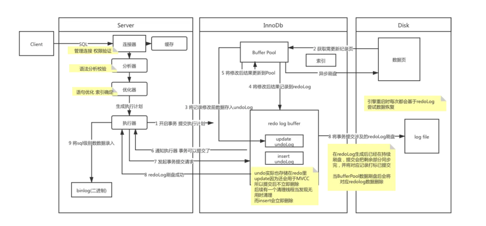

## Introduction

To implement a large-scale, busy, or highly reliable database application, to port substantial code from a different database system,
or to tune MySQL performance, it is important to understand `InnoDB` locking and the `InnoDB` transaction model.

本页只管**事务语义**：ACID 四项承诺各自的实现落点、四种隔离级别的真实差别、如何开启与控制事务边界。
原先挤在同一篇里的三块已各自成页，因为它们回答的是不同问题：

- 并发读写如何互不阻塞、版本可见性如何判定 → [MVCC](/docs/CS/DB/MySQL/Mvcc.md)
- 锁的类型、调度与死锁检测 → [Locks](/docs/CS/DB/MySQL/lock.md)
- 提交在源码里如何穿过 prepare 与 commit 两阶段 → [Transaction Flow](/docs/CS/DB/MySQL/Transaction_Flow.md)


| 项 | 值 |
| :--- | :--- |
| 正文默认版本 | MySQL 9.7.x LTS（最新 9.7.3，2026-08-18） |
| 源码核实基线 | tag `mysql-9.7.2` |
| 次要兼容目标 | 8.4.x LTS |
| 已停止支持 | 8.0（EOL 2026-04-30）、5.7（EOL 2023-10） |
| 核实日期 | 2026-10-07 |


## InnoDB and the ACID Model

The `InnoDB` transaction model aims combine the best properties of a multi-versioning database with traditional two-phase locking.
`InnoDB` performs locking at the row level and runs queries as [nonlocking consistent reads](/docs/CS/DB/MySQL/Mvcc.md?id=consistent-reads) by default, in the style of Oracle.
The lock information in `InnoDB` is stored space-efficiently so that lock escalation is not needed.
Typically, several users are permitted to lock every row in `InnoDB` tables, or any random subset of the rows, without causing `InnoDB` memory exhaustion.


 和ACID事务关系

- 原子性、一致性和持久性是redo log 和 Undo Log
- 隔离性是Lock 和 MVCC

在sql记录执行流程



### Transaction Isolation Levels

#### READ UNCOMMITTED

Transactions running at the `READ UNCOMMITTED` level **do not issue shared locks to prevent other transactions from modifying data read by the current transaction**.
`READ UNCOMMITTED` transactions are also not blocked by exclusive locks that would prevent the current transaction from reading rows that have been modified but not committed by other transactions.
**This option has the same effect as setting NOLOCK on all tables in all SELECT statements in a transaction.**

#### READ COMMITTED

Each consistent read, even within the same transaction, sets and reads its own **fresh snapshot.**

**Because gap locking is disabled, `phantom row` problems may occur, as other sessions can insert new rows into the gaps**.

Only row-based binary logging is supported with the `READ COMMITTED` isolation level. If you use `READ COMMITTED` with `binlog_format=MIXED`, the server automatically uses row-based logging.

Using `READ COMMITTED` has additional effects:

- For `UPDATE` or `DELETE` statements, `InnoDB` holds locks only for rows that it updates or deletes.
  Record locks for nonmatching rows are released after MySQL has evaluated the `WHERE` condition.
  This greatly reduces the probability of deadlocks, but they can still happen.
- For `UPDATE` statements, if a row is already locked, `InnoDB` performs a “semi-consistent” read,
  returning the latest committed version to MySQL so that MySQL can determine whether the row matches the `WHERE` condition of the `UPDATE`.
  If the row matches (must be updated), MySQL reads the row again and this time `InnoDB` either locks it or waits for a lock on it.

#### REPEATABLE READ

This is the default isolation level for InnoDB.
Consistent reads within the same transaction **read the snapshot established by the first read**(any SELECT or UPDATE/INSERT/DELETE).
This means that if you issue several plain (nonlocking) SELECT statements within the same transaction, these SELECT statements are consistent also with respect to each other.

For locking reads (SELECT with FOR UPDATE or LOCK IN SHARE MODE), UPDATE, and DELETE statements, locking depends on whether the statement uses a unique index with a unique search condition or a range-type search condition.

- For a unique index with a unique search condition, InnoDB locks only the index record found, not the gap before it.
- For other search conditions, InnoDB locks the index range scanned, using gap locks or next-key locks to block insertions by other sessions into the gaps covered by the range.

> [!TIP]
>
> It is best practice to not mix storage engines in your application. Failed transactions can lead to inconsistent results as some parts can roll back and others cannot.


## Transaction

事务是怎样开启的
```sql
/*  1 */ BEGIN
/*  2 */ BEGIN WORK
/*  3 */ START TRANSACTION
/*  4 */ START TRANSACTION READ WRITE
/*  5 */ START TRANSACTION READ ONLY
/*  6 */ START TRANSACTION WITH CONSISTENT SNAPSHOT
/*  7 */ START TRANSACTION WITH CONSISTENT SNAPSHOT, READ WRITE

```

语句 1 ~ 8 中：
语句 1 ~ 4：用于开始一个新的读写事务。
语句 5：用于开始一个新的只读事务。
这两类语句都不需立即创建一致性读视图，事务的启动将延迟至实际需要时。
语句 6 ~ 7：用于开始一个新的读写事务。
语句 8：用于开始一个新的只读事务。
这两类语句都会先启动事务，随后立即创建一致性读视图

常用于开始一个事务的语句，大概非 BEGIN 莫属了
BEGIN 语句主要做两件事：
辞旧：提交老事务。
迎新：准备新事务。

BEGIN 语句会判断当前连接中是否有可能存在未提交事务，判断逻辑为：当前连接的线程是否被打上了 OPTION_NOT_AUTOCOMMIT 或 OPTION_BEGIN 标志位

```c++
inline bool in_multi_stmt_transaction_mode() const {
    return variables.option_bits & (OPTION_NOT_AUTOCOMMIT | OPTION_BEGIN);
  }
```

只要 variables.option_bits 包含其中一个标志位，就说明当前连接中可能存在未提交事务。
BEGIN 语句想要开始一个新事务，就必须先执行一次提交操作，把可能未提交的事务给提交了
然后给当前连接的线程打上 OPTION_BEGIN 标志 并不会马上启动一个新的事务


InnoDB 读写表中数据的操作都在事务中执行，开始一个事务的方式有两种：
手动：通过 BEGIN、START TRANSACTION 语句以及它们的扩展形式开始一个事务。
自动：直接执行一条 SQL 语句，InnoDB 会自动开始一个事务，SQL 语句执行完成之后，又会自动提交这个事务
这两种方式开始的事务，都用来执行用户 SQL 语句，属于用户事务。
InnoDB 有时候也需要自己执行一些 SQL 语句，为了和用户 SQL 做区分，我们把这些 SQL 称为内部 SQL。
内部 SQL 也需要在事务中执行，执行这些 SQL 的事务就是内部事务。
InnoDB 有几种场景会使用内部事务，以下是其中主要的三种：
如果上次关闭 MySQL 时有未提交，或者正在提交但未提交完成的事务，启动过程中，InnoDB 会把这些事务恢复为内部事务，然后提交或者回滚。
后台线程执行一些操作时，需要在内部事务中执行内部 SQL。
以 ib_dict_stats 线程为例，它计算各表、索引的统计信息之后，会使用内部事务执行内部 SQL，更新 mysql.innodb_table_stats、mysql.innodb_index_stats 表中的统计信息。
为了实现原子操作，DDL 语句执行过程中，InnoDB 会使用内部事务执行内部 SQL，插入一些数据到 mysql.innodb_ddl_log 表中。


由于要存放事务 ID、事务状态、Undo 日志编号、事务所属的用户线程等信息，每个事务都有一个与之对应的对象，我们称之为事务对象
每个事务对象都要占用内存，如果每启动一个事务都要为事务对象分配内存，释放事务时又要释放内存，会降低数据库性能

```c++
struct Pool {
  typedef Type value_type;

  // FIXME: Add an assertion to check alignment and offset is
  // as we expect it. Also, sizeof(void*) can be 8, can we improve on this.
  struct Element {
    Pool *m_pool;
    value_type m_type;
  };

 private:
  /** Pointer to the last element */
  Element *m_end;

  /** Pointer to the first element */
  Element *m_start;

  /** Size of the block in bytes */
  size_t m_size;

  /** Upper limit of used space */
  Element *m_last;

  /** Priority queue ordered on the pointer addresses. */
  pqueue_t m_pqueue;

  /** Lock strategy to use */
  LockStrategy m_lock_strategy;
};
```

为了避免频繁分配、释放内存对数据库性能产生影响，InnoDB 引入了事务池（Pool），用于管理事务。
MySQL在启动过程中会创建事务池管理器 负责事务池的管理

```c++
/** Create the trx_t pool */
void trx_pool_init() {
  trx_pools = ut::new_withkey<trx_pools_t>(UT_NEW_THIS_FILE_PSI_KEY,
                                           MAX_TRX_BLOCK_SIZE);

  ut_a(trx_pools != nullptr);
}
```


```c++
/** The trx_t pool manager */
static trx_pools_t *trx_pools;

/** Size of on trx_t pool in bytes. */
static const ulint MAX_TRX_BLOCK_SIZE = 1024 * 1024 * 4;
```
每个事务池能用来存放事务对象的内存是4M
创建事务池的过程中，InnoDB 会分配一块 4M 的内存用于存放事务对象。
每个事务对象的大小为 992 字节，4M 内存能够存放 4194304 / 992 = 4228 个事务对象


事务池有一个队列，用于存放已经初始化的事务对象 称为事务队列
InnoDB 初始化事务池的过程中，不会初始化全部的 4228 块小内存，只会初始化最前面的 16 块小内存，得到 16 个事务对象并放入事务队列

```c++
Pool(size_t size) : m_end(), m_start(), m_size(size), m_last() {
    ut_a(size >= sizeof(Element));

    m_lock_strategy.create();

    ut_a(m_start == nullptr);

    m_start = reinterpret_cast<Element *>(
        ut::zalloc_withkey(UT_NEW_THIS_FILE_PSI_KEY, m_size));

    m_last = m_start;

    m_end = &m_start[m_size / sizeof(*m_start)];

    /* Note: Initialise only a small subset, even though we have
    allocated all the memory. This is required only because PFS
    (MTR) results change if we instantiate too many mutexes up
    front. */

    init(std::min(size_t(16), size_t(m_end - m_start)));

    ut_ad(m_pqueue.size() <= size_t(m_last - m_start));
  }
```
MySQL 运行过程中，如果这 16 个事务对象都正在被使用，InnoDB 需要一个新的事务对象时，会一次性初始化剩余的 4212 个事务对象并放入事务池的事务队列

```c++
Type *get() {
    Element *elem;

    m_lock_strategy.enter();

    if (!m_pqueue.empty()) {
      elem = m_pqueue.top();
      m_pqueue.pop();

    } else if (m_last < m_end) {
      /* Initialise the remaining elements. */
      init(m_end - m_last);

      ut_ad(!m_pqueue.empty());

      elem = m_pqueue.top();
      m_pqueue.pop();
    } else {
      elem = nullptr;
    }

    m_lock_strategy.exit();

    return (elem != nullptr ? &elem->m_type : nullptr);
  }
```

给事务分配对象时，会按照这个顺序：
先从事务池的事务队列中分配一个对象。
如果事务队列中没有可用的事务对象，就初始化事务池的剩余小块内存，从得到的事务对象中分配一个对象。
如果所有事务池都没有剩余未初始化的小块内存，就创建一个新的事务池，并从中分配一个事务对象

分配一个事务对象，得到的是一个出厂设置的对象，这个对象的各属性值都已经是初始状态了。
分配事务对象之后，InnoDB 还会对事务对象的几个属性再做一次初始化工作，把这几个属性再一次设置为初始值，其实就是对这些属性做了重复的赋值操作。
这些属性中，有必要提一下的是事务状态（trx->state）。出厂设置的事务对象，事务状态是 TRX_STATE_NOT_STARTED，表示事务还没有开始


除了给几个属性重复赋值，还会改变另外两个属性的值：
trx->in_innodb：给这个属性值加上 TRX_FORCE_ROLLBACK_DISABLE 标志，防止这个事务被其它线程触发回滚操作。事务后续执行过程中，这个标志可能会被清除，我们就不展开介绍了。
trx->lock.autoinc_locks：分配一块内存空间，用于存放 autoinc 锁结构。事务执行过程中需要为 auto_increment 字段生成自增值时使用


我们查询 information_schema.innodb_trx 表，能看到当前正在执行的事务有哪些，这些事务来源于两个链表。
为用户事务分配一个事务对象之后，还有一件非常重要的事，就是把事务对象放入其中一个链表的最前面，代码是这样的：
```c++
UT_LIST_ADD_FIRST(trx_sys->mysql_trx_list, trx);
```
从上面的代码可以看到，这个链表就是 trx_sys->mysql_trx_list，它只会记录用户事务。
至于内部事务，并不会放入 trx_sys->mysql_trx_list 链表。等到真正启动事务时，事务对象会被放入另一个链表


### Starting a Transaction

启动事务最重要的事情之一，就是修改事务状态到 `TRX_STATE_ACTIVE`


```c++
trx->state.store(TRX_STATE_ACTIVE, std::memory_order_relaxed)
```
事务启动于执行第一条 SQL 语句时，如果第一条 SQL 语句是 select、update、delete，InnoDB 会以读事务的身份启动新事务

```c++
/** Starts a transaction. */
static void trx_start_low(
    trx_t *trx,      /*!< in: transaction */
    bool read_write) /*!< in: true if read-write transaction */
{
  ut_ad(!trx->in_rollback);
  ut_ad(!trx->is_recovered);
  ut_ad(trx->start_line != 0);
  ut_ad(trx->start_file != nullptr);
  ut_ad(trx->roll_limit == 0);
  ut_ad(!trx->lock.in_rollback);
  ut_ad(trx->error_state == DB_SUCCESS);
  ut_ad(trx->rsegs.m_redo.rseg == nullptr);
  ut_ad(trx->rsegs.m_noredo.rseg == nullptr);
  ut_ad(trx_state_eq(trx, TRX_STATE_NOT_STARTED));
  ut_ad(UT_LIST_GET_LEN(trx->lock.trx_locks) == 0);
  ut_ad(!(trx->in_innodb & TRX_FORCE_ROLLBACK));
  ut_ad(trx_can_be_handled_by_current_thread_or_is_hp_victim(trx));

  ++trx->version;

  /* Check whether it is an AUTOCOMMIT SELECT */
  trx->auto_commit = (trx->api_trx && trx->api_auto_commit) ||
                     thd_trx_is_auto_commit(trx->mysql_thd);

  trx->read_only = (trx->api_trx && !trx->read_write) ||
                   (!trx->internal && thd_trx_is_read_only(trx->mysql_thd)) ||
                   srv_read_only_mode;

  if (!trx->auto_commit) {
    ++trx->will_lock;
  } else if (trx->will_lock == 0) {
    trx->read_only = true;
  }
  trx->persists_gtid = false;

#ifdef UNIV_DEBUG
  /* If the transaction is DD attachable trx, it should be AC-NL-RO
  (AutoCommit-NonLocking-ReadOnly) trx */
  if (trx->is_dd_trx) {
    ut_ad(trx->read_only);
    ut_ad(trx->auto_commit);
    ut_ad(trx->isolation_level == TRX_ISO_READ_UNCOMMITTED ||
          trx->isolation_level == TRX_ISO_READ_COMMITTED);
  }
#endif /* UNIV_DEBUG */

  /* Note, that trx->start_time is set without std::memory_order_release,
  and it is possible that trx->state below is set neither within critical
  section protected by trx_sys->mutex nor, with std::memory_order_release.
  That is possible for read-only transactions in code further below.
  This can result in an incorrect message printed to error log inside the
  buf_pool_resize thread about transaction lasting too long. The decision
  was to keep this issue for read-only transactions as it was, because
  providing a fix which would guarantee that state of printed information
  about such transactions is always consistent, would take much more work.
  TODO: check performance gain from this micro-optimization on ARM. */

  if (trx->mysql_thd != nullptr) {
    trx->start_time.store(thd_start_time(trx->mysql_thd),
                          std::memory_order_relaxed);
    if (!trx->ddl_operation) {
      trx->ddl_operation = thd_is_dd_update_stmt(trx->mysql_thd);
    }
  } else {
    trx->start_time.store(std::chrono::system_clock::from_time_t(time(nullptr)),
                          std::memory_order_relaxed);
  }

  /* The initial value for trx->no: TRX_ID_MAX is used in
  read_view_open_now: */

  trx->no = TRX_ID_MAX;

  ut_a(ib_vector_is_empty(trx->lock.autoinc_locks));

  /* This value will only be read by a thread inspecting lock sys queue after
  the thread which enqueues this trx releases the queue's latch. */
  trx->lock.schedule_weight.store(0, std::memory_order_relaxed);

  /* If this transaction came from trx_allocate_for_mysql(),
  trx->in_mysql_trx_list would hold. In that case, the trx->state
  change must be protected by the trx_sys->mutex, so that
  lock_print_info_all_transactions() will have a consistent view. */

  ut_ad(!trx->in_rw_trx_list);

  /* We tend to over assert and that complicates the code somewhat.
  e.g., the transaction state can be set earlier but we are forced to
  set it under the protection of the trx_sys_t::mutex because some
  trx list assertions are triggered unnecessarily. */

  /* By default all transactions are in the read-only list unless they
  are non-locking auto-commit read only transactions or background
  (internal) transactions. Note: Transactions marked explicitly as
  read only can write to temporary tables, we put those on the RO
  list too. */

  if (!trx->read_only &&
      (trx->mysql_thd == nullptr || read_write || trx->ddl_operation)) {
    trx_assign_rseg_durable(trx);

    /* Temporary rseg is assigned only if the transaction
    updates a temporary table */
    DEBUG_SYNC_C("trx_sys_before_assign_id");

    trx_sys_mutex_enter();

    trx->id = trx_sys_allocate_trx_id();

    trx_sys->rw_trx_ids.push_back(trx->id);

    ut_ad(trx->rsegs.m_redo.rseg != nullptr || srv_read_only_mode ||
          srv_force_recovery >= SRV_FORCE_NO_TRX_UNDO);

    trx_add_to_rw_trx_list(trx);

    trx->state.store(TRX_STATE_ACTIVE, std::memory_order_relaxed);

    ut_ad(trx_sys_validate_trx_list());

    trx_sys_mutex_exit();

    trx_sys_rw_trx_add(trx);

  } else {
    trx->id = 0;

    if (!trx_is_autocommit_non_locking(trx)) {
      /* If this is a read-only transaction that is writing
      to a temporary table then it needs a transaction id
      to write to the temporary table. */

      if (read_write) {
        trx_sys_mutex_enter();

        ut_ad(!srv_read_only_mode);

        trx->state.store(TRX_STATE_ACTIVE, std::memory_order_relaxed);

        trx->id = trx_sys_allocate_trx_id();

        trx_sys->rw_trx_ids.push_back(trx->id);

        trx_sys_mutex_exit();

        trx_sys_rw_trx_add(trx);

      } else {
        trx->state.store(TRX_STATE_ACTIVE, std::memory_order_relaxed);
      }
    } else {
      ut_ad(!read_write);
      trx->state.store(TRX_STATE_ACTIVE, std::memory_order_relaxed);
    }
  }

  ut_a(trx->error_state == DB_SUCCESS);

  MONITOR_INC(MONITOR_TRX_ACTIVE);
}
```

只读事务是读事务的一个特例，从字面上看，它是不能改变（插入、修改、删除）表中数据的。
然而，这个只读并不是绝对的，只读事务不能改变系统表、用户普通表的数据，但是可以改变用户临时表的数据。
作为读事务的特例，只读事务也要遵守读事务的规则，事务 ID 应该为 0。
只读事务操作系统表、用户普通表，只能读取表中数据，事务 ID 为 0（即不分配事务 ID）没问题。
只读事务操作用户临时表，可以改变表中数据，而用户临时表也支持事务 ACID 特性中的 3 个（ACI），这就需要分配事务 ID 了。
如果只读事务执行的第一条 SQL 语句就是插入记录到用户临时表的 insert，事务启动过程中会分配事务 ID


如果事务执行的第一条 SQL 语句是 insert，这个事务就会以读写事务的身份启动。
读写事务的启动过程，主要会做这几件事：
- 为用户普通表分配回滚段，用于写 Undo 日志。
- 分配事务 ID。
- 把事务对象加入 trx_sys->rw_trx_list 链表。这个链表记录了所有读写事务。


```c++
UT_LIST_ADD_FIRST(trx_sys->rw_trx_list, trx);

static inline void trx_add_to_rw_trx_list(trx_t *trx) {
  ut_ad(srv_is_being_started || trx_sys_mutex_own());
  ut_ad(!trx->in_rw_trx_list);
  UT_LIST_ADD_FIRST(trx_sys->rw_trx_list, trx);
  ut_d(trx->in_rw_trx_list = true);
}
```

用户事务以什么身份启动，取决于执行的第一条 SQL 是什么。
和用户事务不一样，InnoDB 启动内部事务都是为了改变表中数据，所以，内部事务都是读写事务。
作为读写事务，所有内部事务都会加入到 trx_sys->rw_trx_list 链表中

在 update 或 delete 语句执行过程中，读事务就会变成读写事务。
发生变化的具体时间点，又取决于这两类 SQL 语句更新或删除记录的第一个表是什么类型。
如果第一个表是用户普通表，InnoDB 从表中读取一条记录之前，会给表加意向排他锁（IX）。
加意向排他锁时，如果以下三个条件成立，InnoDB 就会把这个事务变成读写事务：
事务还没有为用户普通表分配回滚段。
事务 ID 为 0，说明这个事务现在还是读事务。
事务的只读标识 trx->read_only = false，说明这个事务可以变成读写事务


读事务变成读写事务，InnoDB 主要做 3 件事：
分配事务 ID。
为用户普通表分配回滚段。
把事务对象加入 trx_sys->rw_trx_list 链表。

如果第一个表是用户临时表，因为它的可见范围只限于创建这个表的数据库连接之内，其它数据库连接中执行的事务都看不到这个表，更不能改变表中的数据，所以，update、delete 语句改变用户临时表中的数据，不需要加意向排他锁。
读事务变成读写事务的操作会延迟到 server 层触发 InnoDB 更新或删除记录之后，InnoDB 执行更新或删除操作之前。
在这个时间节点，如果以下三个条件成立，InnoDB 就会把这个事务变成读写事务：
事务已经启动了。
事务 ID 为 0，说明这个事务现在还是读事务。
事务的只读标识 trx->read_only = false，说明这个事务可以变成读写事务。
有一点需要说明，改变用户临时表的数据触发读事务变成读写事务，不会分配用户临时表回滚段，需要等到为某个用户临时表第一次写 Undo 日志时才分配

在 select 语句执行过程中，读事务不会变成读写事务；这条 SQL 语句执行完之后、事务提交之前，第一次执行 insert、update、delete 语句时，读事务才会变成读写事务。
一个读事务变成读写事务的操作，只会发生一次，发生变化的具体时间点，取决于最先碰到哪种 SQL 语句。
如果最先碰到 insert 语句，server 层准备好要插入的记录的每个字段之后，会触发 InnoDB 执行插入操作。
执行插入操作之前，如果以下三个条件成立，InnoDB 就会把这个事务变成读写事务：
事务已经启动了。
事务 ID 为 0，说明这个事务现在还是读事务。
事务的只读标识 trx->read_only = false，说明这个事务可以变成读写事务

只读事务不能改变（插入、更新、删除）系统表、用户普通表的数据，但是能改变用户临时表的数据。
改变用户临时表的数据，同样需要为事务分配事务 ID，为用户临时表分配回滚段。根据只读事务执行的第一条 SQL 语句不同，这两个操作发生的时间点也可以分为两类
在 update 或 delete 语句执行过程中，server 层触发 InnoDB 更新或删除记录之后，InnoDB 执行更新或删除操作之前，如果以下三个条件成立，InnoDB 就为这个事务分配事务 ID、为用户临时表分配回滚段:
事务已经启动了。
事务 ID 为 0。
事务是个只读事务（trx->read_only = true）


```c++

```

```c++

```


## Distributed Transaction

XA : isolation level must be `SERIALIZABLE`

- RM
- TM


## Tuning

大事务示例
- 一次性地操作大量数据，比如用delete语句删除太多数据、update语句更新太多数据
- 大表DDL。ALTER TABLE table_name ADD COLUMN scene INT DEFAULT 0 语句，会对所有现存的行记录进行扫描，并为每一行记录添加这个新列，并设置该列的默认值

大事务的危害
- 大事务执行期间，一直持有锁，其他事务无法访问这些资源，可能会导致阻塞、延迟甚至数据库死锁，影响系统可用性
- 大事务，可能需要很长时间才能完成并释放数据库连接等系统资源，可能导致服务器负载升高，极端情况下可能导致MySQL服务器宕机
- 大事务执行较慢，从库根据binlog重放时间可能较久，主从延迟
- 大事务涉及多个步骤，难以管理，一个步骤出错都会影响事务的最终结果；并且大事务回滚时间长，可能导致系统负载增加、可用性降低、数据不一致等问题

如何优化大事务
- 如果业务允许，拆分为多个小事务
- 优化事务中的慢查询
- 避免在事务中 进行RPC远程调用
- 将Spring声明式事务改为编程式事务，控制事务的粒度
- 避免大批量操作，控制好锁的粒度与持有时间


## Links

- [Mvcc](/docs/CS/DB/MySQL/Mvcc.md)
- [Locks](/docs/CS/DB/MySQL/lock.md)
- [Transaction Flow](/docs/CS/DB/MySQL/Transaction_Flow.md)
- [Undo Log](/docs/CS/DB/MySQL/undolog.md)
- [InnoDB](/docs/CS/DB/MySQL/InnoDB.md)
- [Version Migration](/docs/CS/DB/MySQL/Version_Migration.md)
- [Transaction (SE)](/docs/CS/SE/Transaction.md)

## References

1. [How does a relational database work](https://vladmihalcea.com/how-does-a-relational-database-work/)
2. [Detailed explanation of MySQL mvcc mechanism](https://developpaper.com/detailed-explanation-of-mysql-mvcc-mechanism/)
3. [解决死锁之路 - 学习事务与隔离级别](https://www.aneasystone.com/archives/2017/10/solving-dead-locks-one.html)
4. [MySQL Reference Manual: InnoDB Locking](https://dev.mysql.com/doc/refman/9.7/en/innodb-locking.html)
