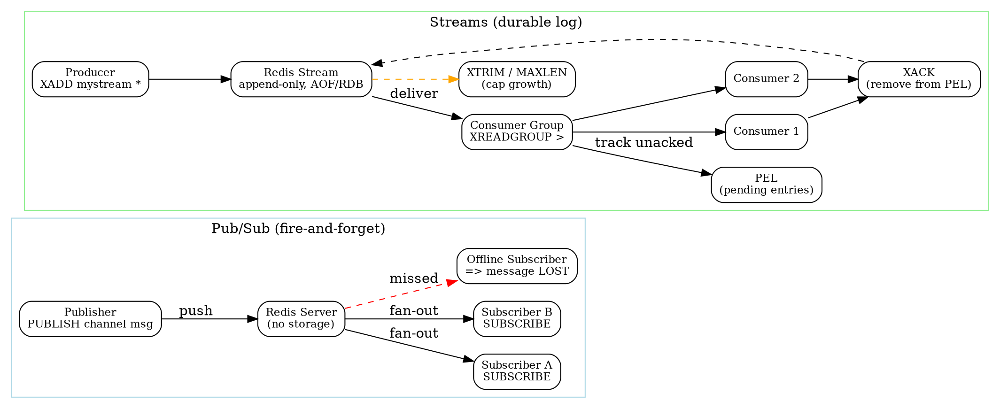

## Introduction

Redis 本质上是一个通用的内存数据存储（in-memory datastore），提供字符串、哈希、列表、集合、有序集合、流（Streams）等数据结构。社区长期以来把它"客串"成消息队列（MQ）使用：早期依赖 List 的 `LPUSH`/`BRPOP` 实现一个简单的阻塞队列，后来官方先后提供了两种更专门的消息模型——**Pub/Sub**（发布订阅）与 **Streams**（流）。二者解决的是不同层次的消息需求。

Pub/Sub 与 Streams 的核心区别在于"消息是否被存储"：Pub/Sub 是纯推送、即发即弃（fire-and-forget），服务器不保存消息；Streams 则是追加式（append-only）的持久化日志，支持消费者组、ACK 与重投。这与专门的消息中间件（Kafka、RabbitMQ）有明显差异：Kafka 是分布式、分区、可水平扩展的提交日志；RabbitMQ 是带交换器/队列、支持复杂路由与 ACK 的 AMQP broker。Redis 作为 MQ 胜在"零额外组件、延迟极低、与缓存/存储共用一个实例"，但牺牲了开箱即用的高可用复制语义、跨节点分区与默认持久化强度。

> 版本说明（已联网核实）：截至 2026-10-06，Redis Open Source 当前稳定版为 **8.4.x**（`8.4.0` 于 **2025-11-18** GA，来源 redis.io 8.4 发版说明与 endoflife.date）。7.4 系列仍处支持期，但 8.4 为最新主干稳定版。下文命令以 Redis 8.x 为准。

## Pub/Sub Pattern

Pub/Sub 实现经典的发布/订阅范式。核心命令：

- `SUBSCRIBE channel [channel ...]`：客户端订阅一个或多个频道，进入订阅态后只应执行少量受限命令（`PING`/`SUBSCRIBE`/`UNSUBSCRIBE`/`PSUBSCRIBE` 等），RESP3 下可发任意命令。
- `PUBLISH channel message`：向频道推送消息，返回收到消息的订阅者数量。
- `PSUBSCRIBE pattern` / `PUNSUBSCRIBE`：按 glob 模式（如 `news.*`）订阅，匹配消息以 `pmessage` 形式送达。

关键特性（已查官方文档确认）：

- **即发即弃、不持久化**：消息由服务器即时推送给当时在线的订阅者后即丢弃，**不写入任何存储**。Redis 明确声明 Pub/Sub 为 **at-most-once** 投递语义——消息发出后没有机会再次发送。
- **离线即丢失**：订阅者在消息发布期间断线或尚未连接，将**永远收不到该消息**。
- **无消费者组、无 ACK**：Pub/Sub 不支持消费位点、确认、重投，也不感知"谁处理了消息"。
- **与 key space 无关**：Pub/Sub 不区分逻辑数据库（db 编号），需要隔离时只能靠频道命名前缀（如 `prod:`、`test:`）。
- **Sharded Pub/Sub（Redis 7.0+）**：`SSUBSCRIBE`/`SPUBLISH` 将分片频道按槽位哈希，消息仅在所属分片内传播，可在集群中水平扩展。

Pub/Sub 命令细节与场景示例（含 Keyspace Notifications 定时任务用法）见 [PubSub](/docs/CS/DB/Redis/PubSub.md)。适用场景：实时通知、聊天室、行情广播、配置热更新等"丢失一两条也不要紧、只需在线推送"的场景。

## Streams Pattern

Streams 是 Redis 5.0 引入的追加式数据结构，更适合做"严肃"的队列/事件流。核心机制：

- `XADD mystream * field value ...`：向流追加一条条目（entry），服务器自动生成单调递增 ID（`<毫秒时间>-<序列号>`），复杂度 O(1)。`*` 表示自动生成 ID。
- `XREAD [COUNT n] [BLOCK ms] STREAMS mystream <id>`：读取大于指定 ID 的条目；`BLOCK` 提供**阻塞读取**（无新消息时挂起直到超时或有消息），类似 List 的 `BLPOP` 但支持多消费者扇出。
- **消费者组**：`XGROUP CREATE` 创建组（可加 `MKSTREAM` 原子建流与组）；`XREADGROUP GROUP grp consumer STREAMS mystream >` 读取**尚未投递给任何消费者**的新消息；特殊 ID `>` 表示新消息，具体 ID 则可重读该组的待处理历史。
- `XACK mystream grp id`：消费者处理成功后确认，消息从 PEL 中移除（O(1)）。
- `XPENDING mystream grp`：查看**待处理条目列表（PEL, Pending Entries List）**——组内已被读取但未 `XACK` 的消息，可获取空闲时间（idle time）与投递次数（delivery count）。
- `XCLAIM` / `XAUTOCLAIM`：将失败消费者的待处理消息认领给其它消费者，实现故障转移。
- `XTRIM` / `MAXLEN`：限制流长度以**控制内存**（`XADD ... MAXLEN ~ 1000` 近似修剪更省 CPU）。

## Delivery Semantics

- **Pub/Sub**：**at-most-once（至多一次）**，即发即弃；订阅者未能处理（报错、断网）则消息永久丢失。官方文档原文即作此断言。
- **Streams**：**at-least-once（至少一次）**。消息在被 `XACK` 前始终留在 PEL 中，消费者崩溃可通过 `XCLAIM`/`XAUTOCLAIM` 重新投递，因此同一条消息**可能**被处理多次（投递计数器会递增）。
- **exactly-once（精确一次）**：Redis **没有内置**的端到端精确一次语义。要通过 Streams 达到"不重不漏"，需要业务侧配合幂等处理（如用消息 ID 做去重表）。

## Consumption Model

Streams 的消费者组在概念上**类似 Kafka 的 consumer group**：一个流被"分区"给组内多个消费者，每个消费者只看到自己被分配到的消息子集，从而实现负载均衡与横向扩展。但关键区别在"节点规模"：

- **单节点为主**：Redis Streams 的消费者组是**单节点（single-node）**概念；分区（partition）的负载均衡发生在"组内多个消费者"之间，而非 Kafka 那种跨 broker 的多分区并行。
- **Redis Cluster 限制**：在集群模式下，涉及多 key 的命令要求所有 key 落在同一 hash 槽（slot）。因此 `XREAD` 同时读多个流、或跨流操作，需自行保证 key 同槽（常用 `{hashtag}` 强制同槽）。消费者组本身绑定在单个流（单键）上，不受多节点分摊。这一限制为"已知架构限制，未逐条查源码核实"，使用时需留意。
- 无 Kafka 式的分区再均衡（rebalance）、副本故障转移由 Redis 主从/Sentinel/Cluster 自身负责，而非 Streams 协议层。

## Persistence

Streams 的消息是否真正"持久"，**完全取决于 Redis 的持久化配置**，而非 Streams 自身保证：

- **RDB**：周期性快照，可能丢失最后一次快照后的消息。
- **AOF（append-only file）**：可配置 `appendfsync always/everysec/no`，`everysec` 最多丢约 1 秒数据，更贴近"持久队列"。
- 若纯内存、不开启任何持久化或 `maxmemory` 触发逐出，Streams 同样会丢失数据。因此把 Redis 当可靠队列用时，必须显式配置 AOF（`appendonly yes`）并评估 `no-appendfsync-on-rewrite` 等策略。

## vs Kafka

| 维度 | Redis Streams | Kafka |
|---|---|---|
| 部署规模 | 单节点/主从，Cluster 下受多 key 槽位限制 | 原生分布式，多 broker 多分区 |
| 分区与再均衡 | 组内消费者分摊，无跨节点分区再均衡 | 多分区 + 消费者组再均衡，水平扩展强 |
| 持久化 | 依赖 AOF/RDB 配置 | 默认持久化到磁盘、可按 retention 保留 |
| 吞吐/伸缩 | 极高吞吐但受单节点上限 | 为海量日志流设计，可 PB 级 |
| 运维复杂度 | 几乎为零（复用已有 Redis） | 需独立集群、Zookeeper/KRaft 等 |

结论：Streams 比 Kafka **更简单、更轻、延迟更低**，但**可扩展性与默认持久强度更弱**。轻量任务队列、事件缓冲、把原先"用 List 做队列"的 `LPUSH`/`BRPOP` 临时方案替换为带 ACK 的 Streams，是 Redis 更适合的甜区。

## Use Cases

- **轻量级任务队列**：用 Streams + 消费者组替代 `LPUSH`/`BRPOP`，获得 PEL、重投与可观测性。
- **事件缓冲 / 削峰**：把突发的写事件先 `XADD` 进流，后端消费者按速处理。
- **实时通知广播**：用 Pub/Sub 做在线推送（行情、聊天、配置热更）。
- **替换 ad-hoc List 队列**：相比 `LPUSH`+`BRPOP`，Streams 能避免 worker 崩溃丢消息、能查待处理、能限速修剪。
- **简单的 CQRS/事件溯源原型**：Streams 的 ID 有序、可重放（`XRANGE`），适合做本地原型而非生产级事件存储。

## Pitfalls

- **Pub/Sub 消息丢失**：即发即弃、无持久化、离线即丢；需要可靠性请改用 Streams。
- **Stream 无限制增长**：不配置 `MAXLEN`/`XTRIM`，追加日志会无限吃内存；应设上限或定期修剪（Redis 8.2+ 支持 consumer-group-aware trimming）。
- **持久化依赖配置**：Streams 不是"天然持久"，必须开启 AOF（且合理 `appendfsync`），否则重启/逐出即丢。
- **不是专用 broker**：Redis 主打内存与低延迟，缺少 Kafka 的分区再均衡、跨节点副本语义、长期留存与重建能力；高可靠、大体量场景应评估专用 MQ。
- **消费者组边界情况**：消费者崩溃需靠 `XCLAIM`/`XAUTOCLAIM` 回收 PEL；`delivery count` 过高提示消息反复失败（poison message），需业务侧死信处理。
- **集群多 key 限制**：跨流 `XREAD`、跨槽操作受 Redis Cluster 槽位约束，需用 `{hashtag}` 或单键设计规避。
- **at-least-once 重复**：必须做幂等，否则重投会导致重复处理（如重复扣款）。

## Links

- [Redis](/docs/CS/DB/Redis/Redis.md)
- [PubSub](/docs/CS/DB/Redis/PubSub.md)
- [MQ 总纲](/docs/CS/MQ/MQ.md)
- [Kafka](/docs/CS/MQ/Kafka/Kafka.md)
- [CS 总纲](/docs/CS/CS.md)

## References

1. Redis Pub/Sub 官方文档：https://redis.io/docs/latest/develop/interact/pubsub/
2. Redis Streams 官方文档：https://redis.io/docs/latest/develop/data-types/streams/
3. Redis 8.4 发版说明（GA 2025-11-18）：https://redis.io/docs/staging/DOC-6012/operate/oss_and_stack/stack-with-enterprise/release-notes/redisce/redisos-8.4-release-notes/
4. XADD 命令参考：https://redis.io/docs/latest/commands/xadd/
5. XREADGROUP 命令参考：https://redis.io/docs/latest/commands/xreadgroup/
6. Redis 版本生命周期（endoflife.date）：https://endoflife.date/redis
