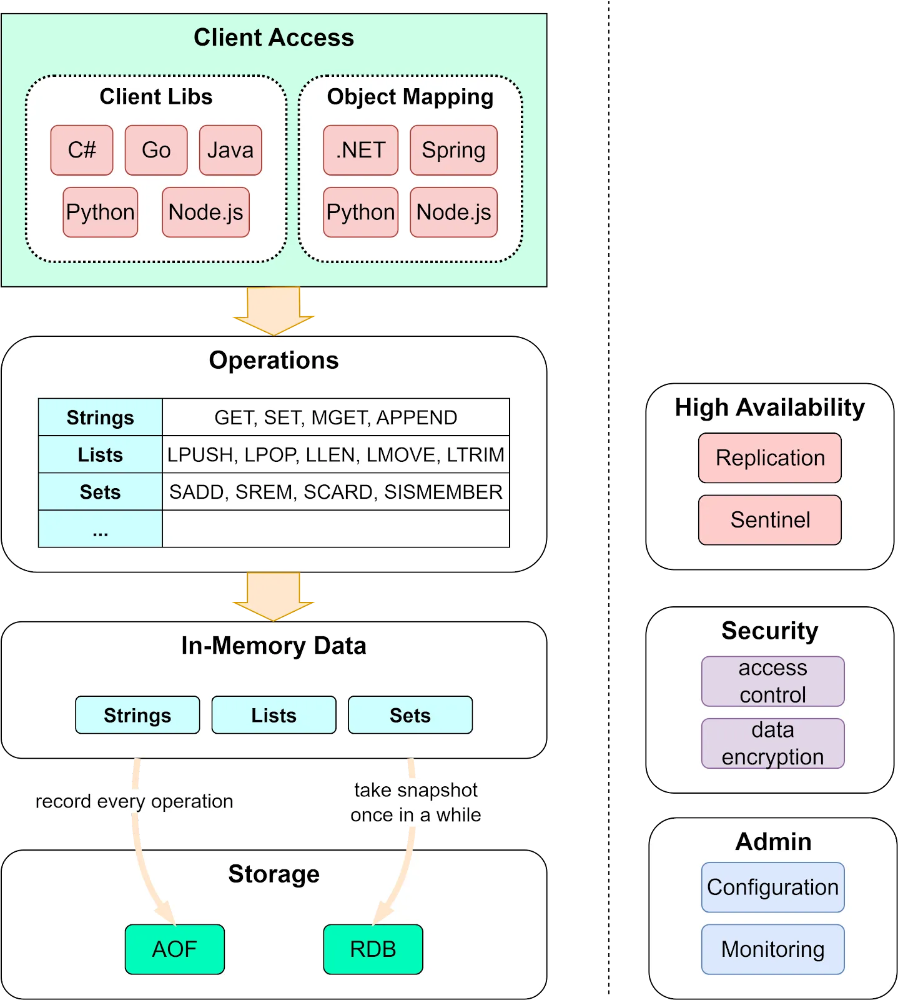

## Introduction

[Redis](https://redis.io) is often referred to as a *data structures* server.
What this means is that Redis provides access to mutable data structures via a set of commands, which are sent using a *server-client* model with [TCP sockets](/docs/CS/CN/TCP/TCP.md) and a simple protocol.
So different processes can query and modify the same data structures in a shared way.

Redis has **built-in replication, Lua scripting, LRU eviction, [transactions](/docs/CS/DB/Redis/Transaction.md), and different levels of on-disk persistence,** and provides **high availability via Redis Sentinel** and **automatic partitioning with Redis Cluster**.

>  [!TIP]
>
> The Linux Foundation announced its intent to form [Valkey](/docs/CS/DB/Valkey.md), an open source alternative to the Redis in-memory, NoSQL data store. 

### Why Redis so fast

完全基于内存实现 持久化机制都是使用子进程处理 不影响

高效的数据结构

整个 Redis 就是一个全局哈希表，他的时间复杂度是$O(1)$，而且为了防止哈希冲突导致链表过长，Redis 会执行 rehash 操作，扩充哈希桶数量，减少哈希冲突
并且防止一次性 重新映射数据过大导致线程阻塞，采用渐进式 rehash。巧妙的将一次性拷贝分摊到多次请求过程后总，避免阻塞。

同时根据实际存储的数据类型选择不同编码

#### Thread Model

Redis 使用单线程模型进行设计 保证了每个操作的原子性，也减少了线程的上下文切换和竞争 同时能带来更好的可维护性，方便开发和调试

> It’s not very frequent that CPU becomes your bottleneck with Redis, as usually Redis is either memory or network bound. 
> For instance, using pipelining Redis running on an average Linux system can deliver even 1 million requests per second, so if your application mainly uses O(N) or O(log(N)) commands, it is hardly going to use too much CPU.

如果这种吞吐量不能满足我们的需求，更推荐的做法是使用分片的方式将不同的请求交给不同的 Redis 服务器来处理，而不是在同一个 Redis 服务中引入大量的多线程操作

Redis 4.0后开始使用多线程 新版的 Redis 服务在执行一些命令时就会使用主处理线程之外的其他线程，例如 UNLINK、FLUSHALL ASYNC、FLUSHDB ASYNC 等非阻塞的删除操作

> However with Redis 4.0 we started to make Redis more threaded. 
> For now this is limited to deleting objects in the background, and to blocking commands implemented via Redis modules. 
> For the next releases, the plan is to make Redis more and more threaded.

#### IO

[I/O多路复用模块](/docs/CS/DB/Redis/ae.md)封装了底层的 select、epoll、avport 以及 kqueue 这些I/O多路复用函数，为上层提供了相同的接口


主从复制 哨兵集群 Cluster分片集群


负载均衡


- [db](/docs/CS/DB/Redis/redisDb.md)


## Build

##### **Mac**

```shell
make MALLOC=jemalloc CFLAGS="-g -O0" 
```
Some build issues:
| Issue                                               | Fix                                                     | References                                                   |
| --------------------------------------------------- | ------------------------------------------------------- | ------------------------------------------------------------ |
| error: variable has incomplete type 'struct stat64' | add `#define MAC_OS_X_VERSION_10_6` into `src/config.h` | [Build Issue in arm](https://github.com/redis/redis/issues/12585) |      


## Architecture


<div style="text-align: center;">



</div>

<p style="text-align: center;">
Fig.1. Architecture
</p>


## Persistence

[Persistence](/docs/CS/DB/Redis/persist.md) refers to the writing of data to durable storage, such as a solid-state disk (SSD).
The most important thing to understand is the different trade-offs between the RDB and AOF persistence.


## [Lifecycle](/docs/CS/DB/Redis/Lifecycle.md)

Server and Client

## Event

[IO Event](/docs/CS/DB/Redis/ae.md)

Time_Event

ServerCron:

- evict key
- RDB and AOF
- master-slave sync
- cluster keepalive
- close dead connection
- statistic memory and other server info

## Log

### Slowlog

The Redis Slow Log is a system to log queries that exceeded a specified execution time. 
The execution time does not include the I/O operations like talking with the client, sending the reply and so forth, but just the time needed to actually execute the command
(this is the only stage of command execution where the thread is blocked and can not serve other requests in the meantime).

You can configure the slow log with two parameters: one tells Redis what is the execution time, in microseconds, to exceed in order for the command to get logged, and the other parameter is the length of the slow log.
When a new command is logged the oldest one is removed from the queue of logged commands.

slowlog len can set to 1000

```
The following time is expressed in microseconds, so 1000000 is equivalent
to one second. Note that a negative number disables the slow log, while
a value of zero forces the logging of every command.

slowlog-log-slower-than 10000

# There is no limit to this length. Just be aware that it will consume memory.
# You can reclaim memory used by the slow log with SLOWLOG RESET.
slowlog-max-len 128
```

slowlog get

slowlog len

extension:

latency monitor

```shell
# use it at slave
./redis-cli --bigkeys -i 0.1
```

## Cluster

单机Redis瓶颈
- QPS
- 容量
- 单点故障


### Master-Slave

主从复制
- Redis读大于写 类似MySQL 副本提供读


主从一致性


```
(error) READONLY You can't write against a read only replica.
```


disadvantage:

load balance and recovery


```log
# replica log
Connecting to MASTER 127.0.0.1:7000
MASTER <-> REPLICA sync started
Non blocking connect for SYNC fired the event.
Master replied to PING, replication can continue...
Partial resynchronization not possible (no cached master)
Full resync from master: 21a84515a95124a3326bd63d9ecf94e52e44c129:0
MASTER <-> REPLICA sync: receiving streamed RDB from master with EOF to disk
MASTER <-> REPLICA sync: Flushing old data
MASTER <-> REPLICA sync: Loading DB in memory
Loading RDB produced by version 7.2.5
RDB age 0 seconds
RDB memory usage when created 0.52 Mb
Done loading RDB, keys loaded: 0, keys expired: 0.
MASTER <-> REPLICA sync: Finished with success
```

```log
# master log
Replica 127.0.0.1:7001 asks for synchronization
Full resync requested by replica 127.0.0.1:7001
Replication backlog created, my new replication IDs are '21a84515a95124a3326bd63d9ecf94e52e44c129' and '0000000000000000000000000000000000000000'
Delay next BGSAVE for diskless SYNC
Starting BGSAVE for SYNC with target: replicas sockets
Background RDB transfer started by pid 16752
Fork CoW for RDB: current 4 MB, peak 4 MB, average 4 MB
Diskless rdb transfer, done reading from pipe, 1 replicas still up.
Background RDB transfer terminated with success
Streamed RDB transfer with replica 127.0.0.1:7001 succeeded (socket). Waiting for REPLCONF ACK from replica to enable streaming
Synchronization with replica 127.0.0.1:7001 succeeded
```


### Redis Sentinel

monitor

- choose new master from slaves when master down
- notify slaves to replicaof and notify clients to create connections with new master

### Redis Cluster
分片算法

range 连续数据 业务相关

hash


## [Distributed Lock](/docs/CS/DB/Redis/Lock.md)

## Performance

monitor

### Block

using wrong API or struct Slow get n : get n slow Sqls > 10ms

CPU overflow

Persistence:

- fork
- AOF flush to disk
- enable THP

CPU race

swap

- make sure have enough memory
- Prefer not use swap

Network

connection refused

timeout

network soft interrupt

## memory

Used_memor_rss

- Used_memory
- memory chip

## command

### info

- Server
- Clients
  - rejected_connections
- Memory
  - human  memory jemalloc apply
  - rss_human  memory in top command
  - peak_human
  - lua_human
- Persistence
- Stats
  - ops_per_sec
  - sync_partial_err
- Replication
  - backlog
- CPU
- Modules
- Errorstats
- Cluster
- Keyspace

monitor get request cmds of current time

maxmemory-policy

- noeviction default refuse write(exclude del) request
- volatile-lru
- volatile-ttl
- volatile-random
- alleys-lru
- alleys-random
- volatile-lfu
- allkeys-lfu

LRU

keys contain a 24bits of timestamp

random get keys and del the oldest one util the memory is enough

unlink use a async thread to del big value

flushdb and flushall can add params to be async

LFU

## TLS

## THP

Transparent Huge Pages（THP）
copy-on-write期间复制内存页从4KB变成2MB
fork子进程的速度变慢
高并发下开启容易造成内存溢出，建议关闭

## Tools

- redis-server
- redis-sentinel
- redis-cli
- redis-check-rdb
- redis-check-aof
- redis-benchmark


## 缓存一致性

本地缓存和Redis缓存一致性

常见是Redis和本地缓存都监听canal事件 同步数据库变更


### Client side caching


Redis6 客户端缓存机制 监听key

通常，客户端缓存的两个主要优点是：

1. 数据以非常小的延迟提供。
2. 数据库系统接收的查询较少，因此可以使用较少数量的节点为同一数据集提供服务。


The tracking table is constituted by a radix tree of keys, each pointing to a radix tree of client IDs, used to track the clients that may have certain keys in their local, client side, cache.

 When a client enables tracking with "CLIENT TRACKING on", each key served to the client is remembered in the table mapping the keys to the client IDs.

 Later, when a key is modified, all the clients that may have local copy of such key will receive an invalidation message.

 Clients will normally take frequently requested objects in memory, removing them when invalidation messages are received. 

```redis
CLIENT TRACKING ON|OFF [REDIRECT client-id] [PREFIX prefix] [BCAST] [OPTIN] [OPTOUT] [NOLOOP]
```


Redis 客户端缓存支持称为*跟踪*，有两种模式：

- 在默认模式下，服务器会记住给定客户端访问的密钥，并在修改相同的密钥时发送失效消息。这会消耗服务器端的内存，但仅针对客户端内存中可能具有的密钥集发送失效消息。 服务端在给客户端发送过一次 invalidate 消息后，如果 key 再被修改，此时，服务端就不会再次给客户端发送 invalidate 消息。

  **只有下次客户端再次执行只读命令被 track，才会进行下一次消息通知** 。

- 在*广播*模式下，服务器不会尝试记住给定客户端访问了哪些密钥，因此此模式在服务器端根本不消耗内存。服务端会给客户端广播所有 key 的失效情况，如果 key 被频繁修改，服务端会发送大量的失效广播消息，这就会消耗大量的网络带宽资源。

  所以，在实际应用中，我们设置让客户端注册只跟踪指定前缀的 key，当注册跟踪的 key 前缀匹配被修改，服务端就会把失效消息广播给所有关注这个 key前缀的客户端


默认模式

 Redis 服务端使用 TrackingTable 存储普通模式的客户端数据，它的数据类型是基数树(radix tree)

Redis 用它存储**键的指针**和**客户端 ID** 的映射关系。因为键对象的指针就是内存地址，也就是长整型数据。客户端缓存的相关操作就是对该数据的增删改查： 

- 当开启 track 功能的客户端获取某一个键值时，Redis 会调用 `enableTracking` 方法使用基数树记录下该 key 和 clientId 的映射关系。 
- 当某一个 key 被修改或删除时，Redis 会调用 `trackingInvalidateKey` 方法根据 key 从 TrackingTable 中查找所有对应的客户端ID，然后调用 `sendTrackingMessage` 方法发送失效消息给这些客户端(会检查 CLIENT_TRACKING 相关标志位是否开启和是否开启了 NOLOOP)。
- 发送完失效消息后，根据**键的指针值**将映射关系从 TrackingTable中删除。 
- 客户端关闭 track 功能后，因为删除需要进行大量操作，所以 Redis 使用懒删除方式，只是将该客户端的 CLIENT_TRACKING 相关标志位删除掉


*广播*模式

广播模式与普通模式类似，Redis 同样使用 `PrefixTable` 存储广播模式下的客户端数据，它存储**前缀字符串指针和(需要通知的key和客户端ID)**的映射关系。它和广播模式最大的区别就是真正发送失效消息的时机不同：

- 当客户端开启广播模式时，会在 `PrefixTable`的前缀对应的客户端列表中加入该客户端ID。 
-  当某一个 key 被修改或删除时，Redis 会调用 `trackingInvalidateKey` 方法，`trackingInvalidateKey` 方法中如果发现 `PrefixTable` 不为空，则调用 `trackingRememberKeyToBroadcast` 依次遍历所有前缀，如果key 符合前缀规则，则记录到 `PrefixTable` 对应的位置。 
-  在 Redis 的事件处理周期函数 beforeSleep 函数里会调用 `trackingBroadcastInvalidationMessages` 函数来真正发送消息。


```c

void trackingInvalidateKey(client *c, robj *keyobj, int bcast) {
    if (TrackingTable == NULL) return;

    unsigned char *key = (unsigned char*)keyobj->ptr;
    size_t keylen = sdslen(keyobj->ptr);

    if (bcast && raxSize(PrefixTable) > 0)
        trackingRememberKeyToBroadcast(c,(char *)key,keylen);

    void *result;
    if (!raxFind(TrackingTable,key,keylen,&result)) return;
    rax *ids = result;

    raxIterator ri;
    raxStart(&ri,ids);
    raxSeek(&ri,"^",NULL,0);
    while(raxNext(&ri)) {
        uint64_t id;
        memcpy(&id,ri.key,sizeof(id));
        client *target = lookupClientByID(id);
        /* Note that if the client is in BCAST mode, we don't want to
         * send invalidation messages that were pending in the case
         * previously the client was not in BCAST mode. This can happen if
         * TRACKING is enabled normally, and then the client switches to
         * BCAST mode. */
        if (target == NULL ||
            !(target->flags & CLIENT_TRACKING)||
            target->flags & CLIENT_TRACKING_BCAST)
        {
            continue;
        }

        /* If the client enabled the NOLOOP mode, don't send notifications
         * about keys changed by the client itself. */
        if (target->flags & CLIENT_TRACKING_NOLOOP &&
            target == server.current_client)
        {
            continue;
        }

        /* If target is current client and it's executing a command, we need schedule key invalidation.
         * As the invalidation messages may be interleaved with command
         * response and should after command response. */
        if (target == server.current_client && (server.current_client->flags & CLIENT_EXECUTING_COMMAND)) {
            incrRefCount(keyobj);
            listAddNodeTail(server.tracking_pending_keys, keyobj);
        } else {
            sendTrackingMessage(target,(char *)keyobj->ptr,sdslen(keyobj->ptr),0);
        }
    }
    raxStop(&ri);

    /* Free the tracking table: we'll create the radix tree and populate it
     * again if more keys will be modified in this caching slot. */
    TrackingTableTotalItems -= raxSize(ids);
    raxFree(ids);
    raxRemove(TrackingTable,(unsigned char*)key,keylen,NULL);
}
```


转发模式

对于使用 RESP 2 协议的客户端来说，实现客户端缓存则需要另一种模式：重定向模式（redirect）

RESP 2 无法直接 PUSH 失效消息，所以 需要另一个支持 RESP 3 协议的客户端 告诉 Server 将失效消息通过 Pus/Sub 通知给 RESP 2 客户端。

在重定向模式下，想要获得失效消息通知的客户端，就需要执行订阅命令 SUBSCRIBE，专门订阅用于发送失效消息的频道 `_redis_:invalidate`。

同时，再使用另外一个客户端，执行 CLIENT TRACKING 命令，设置服务端将失效消息转发给使用 RESP 2 协议的客户端。


客户端可能希望运行有关次数的内部统计信息 给定的缓存密钥实际上是在请求中提供的，以便在 未来什么好缓存。通常：

- 我们不希望缓存许多不断更改的键。
- 我们不想缓存许多很少请求的密钥。
- 我们希望缓存经常请求的密钥，并以合理的速率进行更改

## Tuning

key 的命名规范，只有命名规范，才能提供可读性强、可维护性好的 key，方便日常管理 

把业务名作为前缀，然后用冒号或者下划线分隔，再加上具体的业务数据名 为避免key过长(key也是SDS 长度增加时元数据也会占用更多空间) 可以对前缀进行缩写

BigKey

bigkey 通常有两种情况。

- 情况一：键值对的值大小本身就很大，例如 value 为 1MB 的 String 类型数据。为了避免 String 类型的 bigkey，在业务层，我们要尽量把 String 类型的数据大小控制在 10KB 以下。如果业务层的 String 类型数据确实很大，我们还可以通过数据压缩来减小数据大小
- 情况二：键值对的值是集合类型，集合元素个数非常多，例如包含 100 万个元素的 Hash 集合类型数据。为了避免集合类型的 bigkey，我给你的设计规范建议是，**尽量把集合类型的元素个数控制在 1 万以下**如果集合类型的元素的确很多，我们可以将一个大集合拆分成多个小集合来保存

对带宽压力大 进而影响之后的处理

对于JIT技术在存储引擎中而言，“EVAL is evil”，尽量避免使用lua耗费内存和计算资源

**不同的序列化方法，在序列化速度和数据序列化后的占用内存空间这两个方面，效果是不一样的**。比如说，protostuff 和 kryo 这两种序列化方法，就要比 Java 内置的序列化方法（java-build-in-serializer）效率更高 

XML 和 JSON 格式的数据占用的内存空间比较大。为了避免数据占用过大的内存空间，建议使用压缩工具（例如 snappy 或 gzip），把数据压缩后再写入 Redis

什么时候不能用整数对象共享池呢？主要有两种情况。

第一种情况是，**如果 Redis 中设置了 maxmemory，而且启用了 LRU 策略（allkeys-lru 或 volatile-lru 策略），那么，整数对象共享池就无法使用了**。这是因为，LRU 策略需要统计每个键值对的使用时间，如果不同的键值对都共享使用一个整数对象，LRU 策略就无法进行统计了。

第二种情况是，如果集合类型数据采用 ziplist 编码，而集合元素是整数，这个时候，也不能使用共享池。因为 ziplist 使用了紧凑型内存结构，判断整数对象的共享情况效率低。


**同的业务数据放到不同的 Redis 实例中**。这样一来，既可以避免单实例的内存使用量过大，也可以避免不同业务的操作相互干扰

Redis 单实例的内存大小都不要太大，根据我自己的经验值，建议你设置在 2~6GB 。这样一来，无论是 RDB 快照，还是主从集群进行数据同步，都能很快完成，不会阻塞正常请求的处理。


Pubsub的典型场景
Pubsub适合悲观锁和简单信号，不适合稳定的更新，因为可能会丢消息。在1对N的消息转发通道中，服务瓶颈。还有模
糊通知方面，算力瓶颈。在channel和client比较多的情况下，造成CPU打满、服务夯住。

Transaction
Transaction是一种伪事物，没有回滚条件；集群版需要所有key使用hashtag保证，代码比较复杂，hashtag也可能导
致算力和存储倾斜；Lua中封装了multi-exec，但更耗费CPU，比如编译、加载时，经常出现问题。


Pipeline
Pipeline用的比较多，如下面的示意图，实际上是把多个请求封装在一个请求中，合并在一个请求里发送，服务端一次
性返回，能够有效减少IO，提高执行效率。需要注意的是，用户需要聚合小的命令，避免在pipeline里做大range。注意
Pipeline中的批量任务不是原子执行的（从来不是），所以要处理Pipeline其中部分命令失败的场景。

危险命令禁用

### slowlog

```properties
# 10ms
slowlog-log-slower-than=10000
# 128
slowlog-max-len=128
```
慢查询日志删除使用FIFO

```c
void slowlogPushEntryIfNeeded(client *c, robj **argv, int argc, long long duration) {
    if (server.slowlog_log_slower_than < 0 || server.slowlog_max_len == 0) return; /* Slowlog disabled */
    if (duration >= server.slowlog_log_slower_than)
        listAddNodeHead(server.slowlog,
                        slowlogCreateEntry(c,argv,argc,duration));

    /* Remove old entries if needed. */
    while (listLength(server.slowlog) > server.slowlog_max_len)
        listDelNode(server.slowlog,listLast(server.slowlog));
}
```

slowlog get


## Links

- [DataBases](/docs/CS/DB/DB.md?id=Redis)

## References

1. [Redis 面试全攻略、面试题大集合](https://mp.weixin.qq.com/s/6NobACeeKCcUy98Ikanryg)
2. [Redis源码分析(一) - 硬核课堂](https://hardcore.feishu.cn/docs/doccnp9v7IljXiJ5FpNT1ipLhlR#)
3. [Distributed locks with Redis](https://redis.io/topics/distlock)
4. [Garnet](https://github.com/microsoft/garnet)
5. [java - Redis 6.0 新特性篇：深度剖析客户端缓存（Client side caching）原理与性能 - Redis - SegmentFault 思否](https://segmentfault.com/a/1190000040926742)

