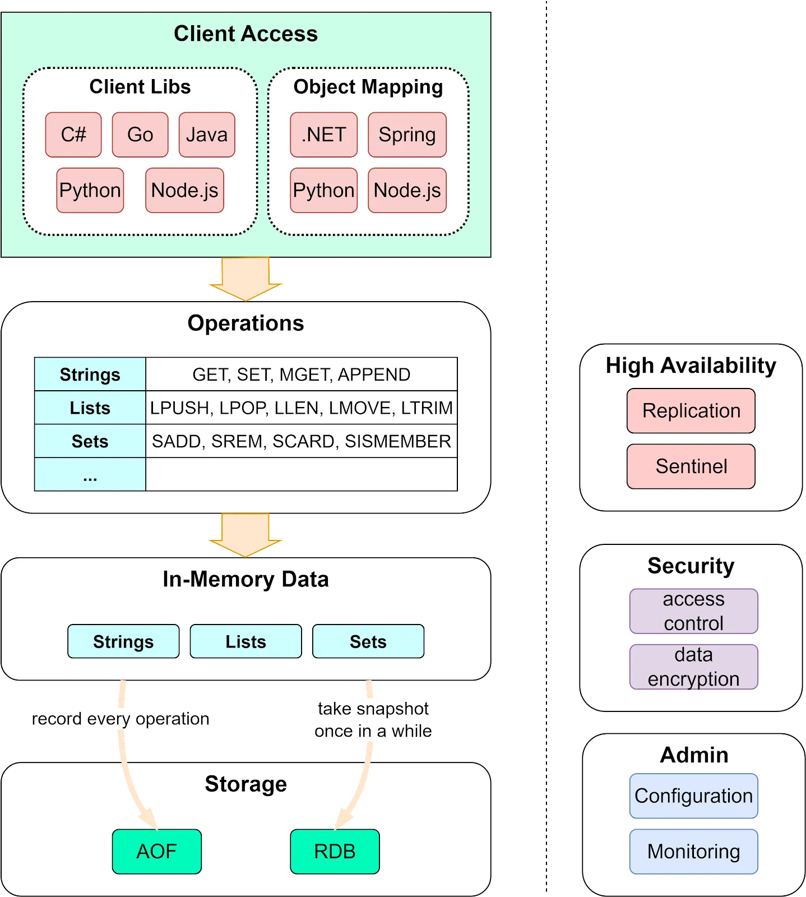

## 简介

[Redis](https://redis.io)（远程字典服务器）通常被称为*数据结构*服务器。
这意味着 Redis 通过一组使用*服务器-客户端*模型通过 [TCP sockets](/docs/CS/CN/TCP/TCP.md) 和简单协议发送的命令提供对可变数据结构的访问。
因此不同进程可以以共享方式查询和修改相同的数据结构。

Redis 具有**内置复制、Lua 脚本、LRU 淘汰、[事务](/docs/CS/DB/Redis/Transaction.md)以及不同级别的磁盘持久化**，并通过 **Redis Sentinel 提供高可用性**，通过 **Redis Cluster 提供自动分区**。

> [!TIP]
>
> Linux 基金会宣布计划成立 [Valkey](/docs/CS/DB/Valkey.md)，作为 Redis 内存 NoSQL 数据存储的开源替代方案。

## 特性

Redis 可以用来做什么：

- 缓存
- 排行榜
- 无须可靠要求的消息队列
- 分布式锁
- 计数器

## 配置

### 构建

修改配置文件中的 daemon 为 yes。

禁用 gcc 编译优化，将 makefile 文件中 OPTIMIZATION?=-O2 改为 -O0。

##### **Mac**

```shell
make MALLOC=jemalloc CFLAGS="-g -O0" 
```

一些构建问题：

| 问题 | 修复 | 参考 |
| --- | --- | --- |
| error: variable has incomplete type 'struct stat64' | 在 `src/config.h` 中添加 `#define MAC_OS_X_VERSION_10_6` | [Build Issue in arm](https://github.com/redis/redis/issues/12585) |

### 源代码

Redis 源码目录：

| 目录 | 子目录 | 描述 |
| --- | --- | --- |
| deps | jemalloc | |
| | linenoise | readline 功能的替代代码 |
| | hiredis | 客户端 |
| | Lua | |
| | hdr_histogram | 生成每个命令的延迟跟踪直方图 |
| src | commands | |
| | modules | |
| test | | |
| utils | | |

Redis 实现的测试代码可以分成四部分，分别是单元测试（对应 unit 子目录）、Redis Cluster 功能测试（对应 cluster 子目录）、哨兵功能测试（对应 sentinel 子目录）、主从复制功能测试（对应 integration 子目录）。
这些子目录中的测试代码使用了 Tcl 语言（通用的脚本语言）进行编写，主要目的就是方便进行测试。
除了有针对特定功能模块的测试代码外，还有一些代码是用来支撑测试功能的，这些代码在 assets、helpers、modules、support 四个目录中。

除了 deps、src、tests、utils 四个子目录以外，Redis 源码总目录下其实还包含了两个重要的配置文件，一个是 Redis 实例的配置文件 redis.conf，另一个是哨兵的配置文件 sentinel.conf。

客户端在 Redis 的运行过程中也会被广泛使用，比如实例返回读取的数据、主从复制时在主从库间传输数据、Redis Cluster 的切片实例通信等，都会用到客户端。
Redis 将客户端的创建、消息回复等功能，实现在了 networking.c 文件中。

### 基准测试

Redis-benchmark 是官方自带的 Redis 性能测试工具，可以有效测试 Redis 服务的性能。

## 架构

Redis 整体架构如下图：

<div style="text-align: center;">



</div>

<p style="text-align: center;">
Fig.1. Architecture
</p>

主要模块：

- 应用层：client
- 网络层：基于 I/O 多路复用封装了一个简单的基于事件驱动的网络通信库 [ae](/docs/CS/DB/Redis/ae.md)
  它封装了底层的 select、epoll、avport 以及 kqueue 这些 I/O 多路复用函数，为上层提供了相同的接口。
- 命令执行层：负责执行客户端的各种命令。
- 内存层：提供各种数据结构保存数据。
- 持久化层：提供 RDB 和 AOF 持久化策略。
- 高可用层：提供 Replication、Sentinel 和 Cluster 实现高可用。
- 统计和监控：提供一些监控工具和性能分析工具，例如内存监控、基准测试、内存碎片、Bigkey 统计、慢指令查询。

Redis 将启动的这些服务抽象成一个全局的结构体 [redisServer](/docs/CS/DB/Redis/server.md?id=server)。
它包含了存储结构 [redisDb](/docs/CS/DB/Redis/redisDb.md)、命令列表、网络监听、客户端缓存等信息。

[Redis 启动流程](/docs/CS/DB/Redis/start.md)

[Redis 命令执行流程](/docs/CS/DB/Redis/start.md?id=do)

图源 [redis 异步网络通信流程 - 单线程](https://www.processon.com/view/5eab75227d9c0869dab46472)


### Redis 为什么这么快

完全基于内存实现，持久化机制都是使用子进程处理，不影响。

高效的数据结构。

整个 Redis 就是一个全局哈希表，其时间复杂度是 $O(1)$，而且为了防止哈希冲突导致链表过长，Redis 会执行 rehash 操作，扩充哈希桶数量，减少哈希冲突。
并且防止一次性重新映射数据过大导致线程阻塞，采用渐进式 rehash。巧妙地将一次性拷贝分摊到多次请求过程中，避免阻塞。

同时根据实际存储的数据类型选择不同编码。

[Redis 并发模型](/docs/CS/DB/Redis/Concurrency.md)

主从复制、哨兵集群、Cluster 分片集群。

负载均衡。

- [db](/docs/CS/DB/Redis/redisDb.md)

## 持久化

[持久化](/docs/CS/DB/Redis/persist.md)指将数据写入持久化存储，如固态硬盘（SSD）。
最重要的是理解 RDB 和 AOF 持久化之间的不同权衡。

## 事件

Time_Event

ServerCron：

- evict key
- RDB and AOF
- master-slave sync
- cluster keepalive
- close dead connection
- statistic memory and other server info

## 日志

### 慢查询

Redis 慢日志是一个记录超过指定执行时间的查询的系统。
执行时间不包括与客户端通信、发送回复等 I/O 操作，只包括实际执行命令所需的时间（这是命令执行中线程被阻塞且无法同时处理其他请求的唯一阶段）。

可以通过两个参数配置慢日志：一个是告诉 Redis 执行时间（以微秒为单位）超过多少的记录命令，另一个是慢日志的长度。
当记录新命令时，队列中最旧的命令将被移除。

slowlog len 可以设置为 1000。

```
以下时间以微秒表示，因此 1000000 相当于一秒。
注意，负数禁用慢日志，而值为零则强制记录每个命令。

slowlog-log-slower-than 10000

对此长度没有限制。请注意它会消耗内存。
您可以使用 SLOWLOG RESET 回收慢日志使用的内存。
slowlog-max-len 128
```

slowlog get

slowlog len

扩展：

latency monitor

```shell
# 在从库使用
./redis-cli --bigkeys -i 0.1
```

## 集群

虽然 Redis 一般是作为内存数据库来使用的，但是它也提供了可靠性保证，这主要体现在 Redis 可以对数据做持久化保存，并且它还实现了主从复制机制，从而可以提供故障恢复的功能。
这部分的代码实现比较集中，主要包括以下两个部分。

- 数据持久化实现
  Redis 的数据持久化实现有两种方式：内存快照 RDB 和 AOF 日志，分别实现在了 rdb.h/rdb.c 和 aof.c 中。
  注意，在使用 RDB 或 AOF 对数据库进行恢复时，RDB 和 AOF 文件可能会因为 Redis 实例所在服务器宕机，而未能完整保存，进而会影响到数据库恢复。因此针对这一问题，Redis 还实现了对这两类文件的检查功能，对应的代码文件分别是 redis-check-rdb.c 和 redis-check-aof.c。
- 主从复制功能实现
  Redis 把主从复制功能实现在了 replication.c 文件中。另外你还需要知道的是，Redis 的主从集群在进行恢复时，主要是依赖于哨兵机制，而这部分功能则直接实现在了 sentinel.c 文件中。
  其次，与 Redis 实现高可靠性保证的功能类似，Redis 高可扩展性保证的功能，是通过 Redis Cluster 来实现的，这部分代码也非常集中，就是在 cluster.h/cluster.c 代码文件中。
  所以这样，我们在学习 Redis Cluster 的设计与实现时，就会非常方便，不用在不同的文件之间来回跳转了。

单机 Redis 瓶颈：

- QPS
- 容量
- 单点故障

### 主从复制

主从复制。

- Redis 读大于写，类似 MySQL 副本提供读。

主从一致性。

```
(error) READONLY You can't write against a read only replica.
```

劣势：

负载均衡和恢复。

```log
# replica log
Connecting to MASTER 127.0.0.1:7000
MASTER <-> REPLICA sync started
Non blocking connect for SYNC fired the event.
Master replied to PING, replication can continue...
Partial resynchronization not possible (no cached master)
Full resync from master: 21a84515a95124a3326bd63d9ecf94e52e44c129:0
MASTER <-> REPLICA sync: receiving streamed RDB from master with EOF to disk
MASTER <-> REPLICA sync: Flushing old data
MASTER <-> REPLICA sync: Loading DB in memory
Loading RDB produced by version 7.2.5
RDB age 0 seconds
RDB memory usage when created 0.52 Mb
Done loading RDB, keys loaded: 0, keys expired: 0.
MASTER <-> REPLICA sync: Finished with success
```

```log
# master log
Replica 127.0.0.1:7001 asks for synchronization
Full resync requested by replica 127.0.0.1:7001
Replication backlog created, my new replication IDs are '21a84515a95124a3326bd63d9ecf94e52e44c129' and '0000000000000000000000000000000000000000'
Delay next BGSAVE for diskless SYNC
Starting BGSAVE for SYNC with target: replicas sockets
Background RDB transfer started by pid 16752
Fork CoW for RDB: current 4 MB, peak 4 MB, average 4 MB
Diskless rdb transfer, done reading from pipe, 1 replicas still up.
Background RDB transfer terminated with success
Streamed RDB transfer with replica 127.0.0.1:7001 succeeded (socket). Waiting for REPLCONF ACK from replica to enable streaming
Synchronization with replica 127.0.0.1:7001 succeeded
```

### Redis Sentinel

监控。

- 主库宕机时从从库中选择新主库
- 通知从库执行 replicaof，并通知客户端与新主库建立连接

### Redis Cluster

分片算法：

- range：连续数据，业务相关。
- hash

[分布式锁](/docs/CS/DB/Redis/Lock.md)

## 性能

监控。

### 阻塞

使用错误的 API 或结构慢。Slow get n：get n 慢查询 > 10ms。

CPU 溢出。

持久化：

- fork
- AOF flush to disk
- enable THP

CPU 竞争。

swap：

- 确保有足够内存。
- 最好不要使用 swap。

网络：

connection refused

timeout

network soft interrupt

## 内存

Redis 是内存数据库，所以，高效使用内存对 Redis 的实现来说非常重要。
而实际上，Redis 主要是通过两大方面的技术来提升内存使用效率的，
分别是[数据结构的优化设计与使用](/docs/CS/DB/Redis/struct/struct.md)，以及[内存友好的数据使用方式](/docs/CS/DB/Redis/memory.md)。

Used_memor_rss：

- Used_memory
- memory chip

## 命令

### info

- Server
- Clients（rejected_connections）
- Memory（human memory jemalloc apply, rss_human memory in top command, peak_human, lua_human）
- Persistence
- Stats（ops_per_sec, sync_partial_err）
- Replication（backlog）
- CPU
- Modules
- Errorstats
- Cluster
- Keyspace

monitor 获取当前时间的请求命令。

maxmemory-policy：

- noeviction：默认，拒绝写（不包括 del）请求。
- volatile-lru
- volatile-ttl
- volatile-random
- alleys-lru
- alleys-random
- volatile-lfu
- allkeys-lfu

LRU：

keys 包含 24 位的时间戳。

随机获取 keys 并删除最旧的，直到内存足够。

unlink 使用异步线程删除大 value。

flushdb 和 flushall 可以添加参数以异步方式执行。

LFU

## TLS

## THP

Transparent Huge Pages（THP）
copy-on-write 期间复制内存页从 4KB 变成 2MB。
fork 子进程的速度变慢。
高并发下开启容易造成内存溢出，建议关闭。

## 工具

- redis-server
- redis-sentinel
- redis-cli
- redis-check-rdb
- redis-check-aof
- redis-benchmark

## 缓存一致性

本地缓存和 Redis 缓存一致性。

常见是 Redis 和本地缓存都监听 canal 事件，同步数据库变更。

### 客户端缓存

Redis 6 客户端缓存机制，监听 key。

通常，客户端缓存的两个主要优点是：

1. 数据以非常小的延迟提供。
2. 数据库系统接收的查询较少，因此可以使用较少数量的节点为同一数据集提供服务。

跟踪表由一个键的基数树组成，每个键指向一个客户端 ID 的基数树，用于跟踪其本地客户端缓存中可能包含某些键的客户端。

当客户端启用 "CLIENT TRACKING on" 时，提供给客户端的每个键都会记录在将键映射到客户端 ID 的表中。

之后，当某个键被修改时，所有可能本地保存该键副本的客户端都会收到一条失效消息。

客户端通常会将经常请求的对象保存在内存中，在收到失效消息时将其删除。

```redis
CLIENT TRACKING ON|OFF [REDIRECT client-id] [PREFIX prefix] [BCAST] [OPTIN] [OPTOUT] [NOLOOP]
```

Redis 客户端缓存支持称为*跟踪*，有两种模式：

- 在默认模式下，服务器会记住给定客户端访问的密钥，并在修改相同的密钥时发送失效消息。这会消耗服务器端的内存，但仅针对客户端内存中可能具有的密钥集发送失效消息。服务端在给客户端发送过一次 invalidate 消息后，如果 key 再被修改，此时，服务端就不会再次给客户端发送 invalidate 消息。
  **只有下次客户端再次执行只读命令被 track，才会进行下一次消息通知**。
- 在*广播*模式下，服务器不会尝试记住给定客户端访问了哪些密钥，因此此模式在服务器端根本不消耗内存。服务端会给客户端广播所有 key 的失效情况，如果 key 被频繁修改，服务端会发送大量的失效广播消息，这就会消耗大量的网络带宽资源。
  所以，在实际应用中，我们设置让客户端注册只跟踪指定前缀的 key，当注册跟踪的 key 前缀匹配被修改，服务端就会把失效消息广播给所有关注这个 key 前缀的客户端。

默认模式：

Redis 服务端使用 TrackingTable 存储普通模式的客户端数据，它的数据类型是基数树（radix tree）。

Redis 用它存储**键的指针**和**客户端 ID** 的映射关系。因为键对象的指针就是内存地址，也就是长整型数据。客户端缓存的相关操作就是对该数据的增删改查：

- 当开启 track 功能的客户端获取某一个键值时，Redis 会调用 `enableTracking` 方法使用基数树记录下该 key 和 clientId 的映射关系。
- 当某一个 key 被修改或删除时，Redis 会调用 `trackingInvalidateKey` 方法根据 key 从 TrackingTable 中查找所有对应的客户端 ID，然后调用 `sendTrackingMessage` 方法发送失效消息给这些客户端（会检查 CLIENT_TRACKING 相关标志位是否开启和是否开启了 NOLOOP）。
- 发送完失效消息后，根据**键的指针值**将映射关系从 TrackingTable 中删除。
- 客户端关闭 track 功能后，因为删除需要进行大量操作，所以 Redis 使用懒删除方式，只是将该客户端的 CLIENT_TRACKING 相关标志位删除掉。

*广播*模式：

广播模式与普通模式类似，Redis 同样使用 `PrefixTable` 存储广播模式下的客户端数据，它存储**前缀字符串指针和（需要通知的 key 和客户端 ID）**的映射关系。它和广播模式最大的区别就是真正发送失效消息的时机不同：

- 当客户端开启广播模式时，会在 `PrefixTable` 的前缀对应的客户端列表中加入该客户端 ID。
- 当某一个 key 被修改或删除时，Redis 会调用 `trackingInvalidateKey` 方法，`trackingInvalidateKey` 方法中如果发现 `PrefixTable` 不为空，则调用 `trackingRememberKeyToBroadcast` 依次遍历所有前缀，如果 key 符合前缀规则，则记录到 `PrefixTable` 对应的位置。
- 在 Redis 的事件处理周期函数 beforeSleep 函数里会调用 `trackingBroadcastInvalidationMessages` 函数来真正发送消息。

```c
void trackingInvalidateKey(client *c, robj *keyobj, int bcast) {
    // ... 实现逻辑 ...
}
```

转发模式：

对于使用 RESP 2 协议的客户端来说，实现客户端缓存则需要另一种模式：重定向模式（redirect）。

RESP 2 无法直接 PUSH 失效消息，所以需要另一个支持 RESP 3 协议的客户端告诉 Server 将失效消息通过 Pub/Sub 通知给 RESP 2 客户端。

在重定向模式下，想要获得失效消息通知的客户端，就需要执行订阅命令 SUBSCRIBE，专门订阅用于发送失效消息的频道 `_redis_:invalidate`。

同时，再使用另外一个客户端，执行 CLIENT TRACKING 命令，设置服务端将失效消息转发给使用 RESP 2 协议的客户端。

客户端可能希望运行有关次数的内部统计信息，给定的缓存密钥实际上是在请求中提供的，以便在将来决定缓存什么。通常：

- 我们不希望缓存许多不断更改的键。
- 我们不想缓存许多很少请求的密钥。
- 我们希望缓存经常请求且以合理速率更改的密钥。

## 调优

同样是使用 Redis，但是不同公司的"玩法"却不太一样，比如说，有做缓存的，有做数据库的，也有用做分布式锁的。不过，他们遇见的"坑"，总体来说集中在四个方面：

- CPU 使用上的"坑"，例如数据结构的复杂度、跨 CPU 核的访问。
- 内存使用上的"坑"，例如主从同步和 AOF 的内存竞争。
- 存储持久化上的"坑"，例如在 SSD 上做快照的性能抖动。
- 网络通信上的"坑"，例如多实例时的异常网络丢包。

Redis 对 CPU 的要求并不高，反而是对内存和磁盘的要求很高，因为 Redis 大部分时候都在做读写操作，使用更多的内存和更快的磁盘，对 Redis 性能的提高非常有帮助。

为了保证数据的可靠性，Redis 需要在磁盘上读写 AOF 和 RDB，但在高并发场景里，这就会直接带来两个新问题：一个是写 AOF 和 RDB 会造成 Redis 性能抖动，另一个是 Redis 集群数据同步和实例恢复时，读 RDB 比较慢，限制了同步和恢复速度。

我们将使用以下手段，来提升 Redis 的运行速度：

1. 缩短键值对的存储长度。
2. 使用 lazy free（延迟删除）特性。
3. 设置键值的过期时间。
4. 禁用耗时长的查询命令。
5. 使用 slowlog 优化耗时命令。
6. 使用 Pipeline 批量操作数据。
7. 避免大量数据同时失效。
8. 客户端使用优化。
9. 限制 Redis 内存大小。
10. 使用物理机而非虚拟机安装 Redis 服务。
11. 检查数据持久化策略。
12. 使用分布式架构来增加读写速度。

key 的命名规范，只有命名规范，才能提供可读性强、可维护性好的 key，方便日常管理。

把业务名作为前缀，然后用冒号或者下划线分隔，再加上具体的业务数据名。为避免 key 过长（key 也是 SDS，长度增加时元数据也会占用更多空间），可以对前缀进行缩写。

BigKey：

bigkey 通常有两种情况：

- 情况一：键值对的值大小本身就很大，例如 value 为 1MB 的 String 类型数据。为了避免 String 类型的 bigkey，在业务层，我们要尽量把 String 类型的数据大小控制在 10KB 以下。如果业务层的 String 类型数据确实很大，我们还可以通过数据压缩来减小数据大小。
- 情况二：键值对的值是集合类型，集合元素个数非常多，例如包含 100 万个元素的 Hash 集合类型数据。为了避免集合类型的 bigkey，设计规范建议是，**尽量把集合类型的元素个数控制在 1 万以下**。如果集合类型的元素的确很多，我们可以将一个大集合拆分成多个小集合来保存。

对带宽压力大，进而影响之后的处理。

对于 JIT 技术在存储引擎中而言，"EVAL is evil"，尽量避免使用 lua 耗费内存和计算资源。

**不同的序列化方法，在序列化速度和数据序列化后的占用内存空间这两个方面，效果是不一样的**。比如说，protostuff 和 kryo 这两种序列化方法，就要比 Java 内置的序列化方法（java-build-in-serializer）效率更高。

XML 和 JSON 格式的数据占用的内存空间比较大。为了避免数据占用过大的内存空间，建议使用压缩工具（例如 snappy 或 gzip），把数据压缩后再写入 Redis。

什么时候不能用整数对象共享池呢？主要有两种情况：

第一种情况是，**如果 Redis 中设置了 maxmemory，而且启用了 LRU 策略（allkeys-lru 或 volatile-lru 策略），那么，整数对象共享池就无法使用了**。这是因为，LRU 策略需要统计每个键值对的使用时间，如果不同的键值对都共享使用一个整数对象，LRU 策略就无法进行统计了。

第二种情况是，如果集合类型数据采用 ziplist 编码，而集合元素是整数，这个时候，也不能使用共享池。因为 ziplist 使用了紧凑型内存结构，判断整数对象的共享情况效率低。

**不同的业务数据放到不同的 Redis 实例中**。这样一来，既可以避免单实例的内存使用量过大，也可以避免不同业务的操作相互干扰。

Redis 单实例的内存大小都不要太大，根据我自己的经验值，建议设置在 2~6GB。这样一来，无论是 RDB 快照，还是主从集群进行数据同步，都能很快完成，不会阻塞正常请求的处理。

Pubsub 的典型场景：Pubsub 适合悲观锁和简单信号，不适合稳定的更新，因为可能会丢消息。在 1 对 N 的消息转发通道中，服务瓶颈。还有模糊通知方面，算力瓶颈。在 channel 和 client 比较多的情况下，造成 CPU 打满、服务夯住。

Transaction：Transaction 是一种伪事务，没有回滚条件；集群版需要所有 key 使用 hashtag 保证，代码比较复杂，hashtag 也可能导致算力和存储倾斜；Lua 中封装了 multi-exec，但更耗费 CPU，比如编译、加载时，经常出现问题。

Pipeline：Pipeline 用的比较多，实际上是把多个请求封装在一个请求中，合并在一个请求里发送，服务端一次性返回，能够有效减少 IO，提高执行效率。需要注意的是，用户需要聚合小的命令，避免在 pipeline 里做大 range。注意 Pipeline 中的批量任务不是原子执行的（从来不是），所以要处理 Pipeline 其中部分命令失败的场景。

危险命令禁用。

管道技术本质上是客户端提供的功能，而非 Redis 服务器端的功能。
使用管道技术可以解决多个命令执行时的网络等待，它是把多个命令整合到一起发送给服务器端处理之后统一返回给客户端，这样就免去了每条命令执行后都要等待的情况，从而有效地提高了程序的执行效率。
管道技术虽然有它的优势，但在使用时还需注意以下几个细节：

- 发送的命令数量不会被限制，但输入缓存区也就是命令的最大存储体积为 1GB，当发送的命令超过此限制时，命令不会被执行，并且会被 Redis 服务器端断开此链接。
- 如果管道的数据过多可能会导致客户端的等待时间过长，导致网络阻塞。
- 部分客户端自己本身也有缓存区大小的设置，如果管道命令没有执行或者是执行不完整，可以排查此情况或减少管道内的命令重新尝试执行。

### 慢查询

```properties
# 10ms
slowlog-log-slower-than=10000
# 128
slowlog-max-len=128
```

慢查询日志删除使用 FIFO。

```c
void slowlogPushEntryIfNeeded(client *c, robj **argv, int argc, long long duration) {
    if (server.slowlog_log_slower_than < 0 || server.slowlog_max_len == 0) return; /* Slowlog disabled */
    if (duration >= server.slowlog_log_slower_than)
        listAddNodeHead(server.slowlog,
                        slowlogCreateEntry(c,argv,argc,duration));

    /* Remove old entries if needed. */
    while (listLength(server.slowlog) > server.slowlog_max_len)
        listDelNode(server.slowlog,listLast(server.slowlog));
}
```

slowlog get

### 命令

常用运维命令，用于线上事故保留现场。

```shell
INFO MEMORY
MEMORY USAGE
CLIENT LIST
```

## 链接

- [数据库](/docs/CS/DB/DB.md?id=Redis)
- [Pika](/docs/CS/DB/Pika.md)

## 参考

1. [Redis中文网](https://redis.com.cn/)
2. [Redis 面试全攻略、面试题大集合](https://mp.weixin.qq.com/s/6NobACeeKCcUy98Ikanryg)
3. [Redis源码分析(一) - 硬核课堂](https://hardcore.feishu.cn/docs/doccnp9v7IljXiJ5FpNT1ipLhlR#)
4. [Distributed locks with Redis](https://redis.io/topics/distlock)
5. [Garnet](https://github.com/microsoft/garnet)
6. [java - Redis 6.0 新特性篇：深度剖析客户端缓存（Client side caching）原理与性能 - Redis - SegmentFault 思否](https://segmentfault.com/a/1190000040926742)
