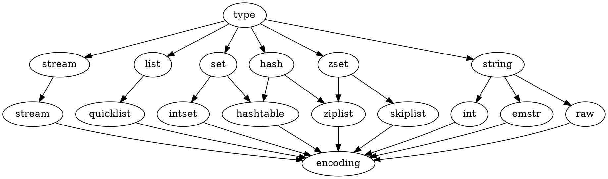
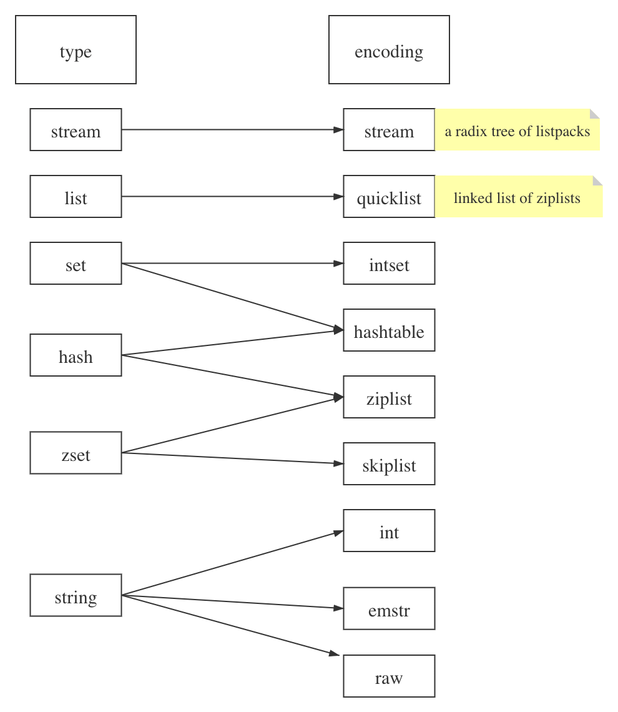

## Introduction

The simplest way to understand how a program works is to understand the data structures it uses.

All the server configuration and in general all the shared state is defined in a global structure called [server](/docs/CS/DB/Redis/server.md), of type `struct redisServer`.

Another important Redis data structure is the one defining a [client](/docs/CS/DB/Redis/server.md?id=Client).
The structure has many fields, here we'll just show the main ones:

```c
struct client {
    int fd;
    sds querybuf;
    int argc;
    robj **argv;
    redisDb *db;
    int flags;
    list *reply;
    // ... many other fields ...
    char buf[PROTO_REPLY_CHUNK_BYTES];
}
```

As you can see in the client structure above, arguments in a command are described as `robj` structures.
The following is the full `robj` structure, which defines a [Redis object](/docs/CS/DB/Redis/redisDb.md?id=redisObject):

```c
typedef struct redisObject {
    unsigned type:4;
    unsigned encoding:4;
    unsigned lru:LRU_BITS; /* lru time (relative to server.lruclock) */
    int refcount;
    void *ptr;
} robj;
```

- Basically this structure can represent all the basic Redis data types like strings, lists, sets, sorted sets and so forth.
- The interesting thing is that it has a `type` field, so that it is possible to know what type a given object has, and a `refcount`, so that the same object can be referenced in multiple places without allocating it multiple times.
- Finally the `ptr` field points to the actual representation of the object, which might vary even for the same type, depending on the `encoding` used.

Redis objects are used extensively in the Redis internals, however in order to avoid the overhead of indirect accesses, recently in many places we just use plain dynamic strings not wrapped inside a Redis object.

## Data Types

While in traditional key-value stores you associate string keys to string values, in Redis the value is not limited to a simple string, but can also hold more complex data structures.
The following is the list of all the data structures supported by Redis, which will be covered separately in this tutorial:

* Binary-safe strings.
* Lists: collections of string elements sorted according to the order of insertion.
  They are basically linked lists .
* Sets: collections of unique, unsorted string elements.
* Sorted sets, similar to Sets but where every string element is associated to a floating number value, called** ** *score* .
  The elements are always taken sorted by their score, so unlike Sets it is possible to retrieve a range of elements (for example you may ask: give me the top 10, or the bottom 10).
* Hashes, which are maps composed of fields associated with values. Both the field and the value are strings.
  This is very similar to Ruby or Python hashes.
* Bit arrays (or simply bitmaps): it is possible, using special commands, to handle String values like an array of bits:
  you can set and clear individual bits, count all the bits set to 1, find the first set or unset bit, and so forth.
* HyperLogLogs: this is a probabilistic data structure which is used in order to estimate the cardinality of a set.
  Don't be scared, it is simpler than it seems... See later in the HyperLogLog section of this tutorial.
* Streams: append-only collections of map-like entries that provide an abstract log data type.
  They are covered in depth in the** **[Introduction to Redis Streams](https://redis.io/topics/streams-intro).





object

- [Stream](/docs/CS/DB/Redis/Stream.md)
- [geo](/docs/CS/DB/Redis/geo.md)

```c
// server.h
/* A redis object, that is a type able to hold a string / list / set */

/* The actual Redis Object */
#define OBJ_STRING 0    /* String object. */
#define OBJ_LIST 1      /* List object. */
#define OBJ_SET 2       /* Set object. */
#define OBJ_ZSET 3      /* Sorted set object. */
#define OBJ_HASH 4      /* Hash object. */

/* The "module" object type is a special one that signals that the object
 * is one directly managed by a Redis module. In this case the value points
 * to a moduleValue struct, which contains the object value (which is only
 * handled by the module itself) and the RedisModuleType struct which lists
 * function pointers in order to serialize, deserialize, AOF-rewrite and
 * free the object.
 *
 * Inside the RDB file, module types are encoded as OBJ_MODULE followed
 * by a 64 bit module type ID, which has a 54 bits module-specific signature
 * in order to dispatch the loading to the right module, plus a 10 bits
 * encoding version. */
#define OBJ_MODULE 5    /* Module object. */
#define OBJ_STREAM 6    /* Stream object. */
```

struct

- [int embstr raw](/docs/CS/DB/Redis/SDS.md?id=type)
- [hashtable](/docs/CS/DB/Redis/hash.md)
- [ziplist](/docs/CS/DB/Redis/zset.md?id=ziplist)
- [intset](/docs/CS/DB/Redis/set.md?id=intset)
- [skiplist](/docs/CS/DB/Redis/zset.md?id=skiplist)
- [ziplist](/docs/CS/DB/Redis/list.md?id=quciklist)
- [Stream](/docs/CS/DB/Redis/Stream.md?id=rax)

```c
/* Objects encoding. Some kind of objects like Strings and Hashes can be
 * internally represented in multiple ways. The 'encoding' field of the object
 * is set to one of this fields for this object. */
#define OBJ_ENCODING_RAW 0     /* Raw representation */
#define OBJ_ENCODING_INT 1     /* Encoded as integer */
#define OBJ_ENCODING_HT 2      /* Encoded as hash table */
#define OBJ_ENCODING_ZIPMAP 3  /* Encoded as zipmap */
#define OBJ_ENCODING_ZIPLIST 5 /* Encoded as ziplist */
#define OBJ_ENCODING_INTSET 6  /* Encoded as intset */
#define OBJ_ENCODING_SKIPLIST 7  /* Encoded as skiplist */
#define OBJ_ENCODING_EMBSTR 8  /* Embedded sds string encoding */
#define OBJ_ENCODING_QUICKLIST 9 /* Encoded as linked list of ziplists */
#define OBJ_ENCODING_STREAM 10 /* Encoded as a radix tree of listpacks */
```

### Keys

Redis keys are binary safe, this means that you can use any binary sequence as a key, from a string like "foo" to the content of a JPEG file.
The empty string is also a valid key.

A few other rules about keys:

- **Very long keys are not a good idea**.
  For instance a key of 1024 bytes is a bad idea not only memory-wise, but also because the lookup of the key in the dataset may require several costly key-comparisons.
  Even when the task at hand is to match the existence of a large value, hashing it (for example with SHA1) is a better idea, especially from the perspective of memory and bandwidth.
- **Very short keys are often not a good idea**.
  There is little point in writing "u1000flw" as a key if you can instead write "`user:1000:followers`".
  The latter is more readable and the added space is minor compared to the space used by the key object itself and the value object.
  While short keys will obviously consume a bit less memory, your job is to find the right balance.
- **Try to stick with a schema.**
  For instance "object-type:id" is a good idea, as in "user:1000".
  Dots or dashes are often used for multi-word fields, as in "`comment:1234:reply.to`" or "`comment:1234:reply-to`".
- The maximum allowed key size is **512 MB**.

```shell
# client
127.0.0.1:6379> set 111.111 hello

# server
gdb redis-server
(gdb) r
(gdb) b dictGenHashFunction

(gdb) c
(gdb) p (char*) key
$4 = 0x7ffff1a1b0d3 "111.111"
(gdb) p len
$5 = 7
```

#### Key expiration

Key expiration lets you set a timeout for a key, also known as a "time to live", or "TTL". When the time to live elapses, the key is automatically destroyed.

A few important notes about key expiration:

* They can be set both using seconds or milliseconds precision.
* However the expire time resolution is always 1 millisecond.
* Information about expires are replicated and persisted on disk, the time virtually passes when your Redis server remains stopped (this means that Redis saves the date at which a key will expire).

### Strings

The Redis [String](/docs/CS/DB/Redis/SDS.md) type is the simplest type of value you can associate with a Redis key. It is the only data type in Memcached, so it is also very natural for newcomers to use it in Redis.

Since Redis keys are strings, when we use the string type as a value too, we are mapping a string to another string.

Values can be strings (including binary data) of every kind, for instance you can store a jpeg image inside a value.
A value can't be bigger than 512 MB.

The `INCR` command parses the string value as an integer, increments it by one, and finally sets the obtained value as the new value.
**INCR is atomic.**
That even multiple clients issuing INCR against the same key will never enter into a race condition.

### Lists

Redis [lists](/docs/CS/DB/Redis/list.md) are implemented via Linked Lists. This means that even if you have millions of elements inside a list, the operation of adding a new element in the head or in the tail of the list is performed  *in constant time* .

Redis Lists are implemented with linked lists because for a database system it is crucial to be able to add elements to a very long list in a very fast way.

Another strong advantage, as you'll see in a moment, is that Redis Lists can be taken at constant length in constant time.

When fast access to the middle of a large collection of elements is important, there is a different data structure that can be used, called sorted sets.

Lists are useful for a number of tasks, two very representative use cases are the following:

* Remember the latest updates posted by users into a social network.
* Communication between processes, using a consumer-producer pattern where the producer pushes items into a list, and a consumer (usually a  *worker* ) consumes those items and executed actions. Redis has special list commands to make this use case both more reliable and efficient.

To describe a common use case step by step, imagine your home page shows the latest photos published in a photo sharing social network and you want to speedup access.

* Every time a user posts a new photo, we add its ID into a list with `LPUSH`.
* When users visit the home page, we use `LRANGE 0 9` in order to get the latest 10 posted items.

#### Capped lists

In many use cases we just want to use lists to store the  *latest items* , whatever they are: social network updates, logs, or anything else.

Redis allows us to use lists as a capped collection, only remembering the latest N items and discarding all the oldest items using the `LTRIM` command.

The `LTRIM` command is similar to `LRANGE`, but **instead of displaying the specified range of elements** it sets this range as the new list value. All the elements outside the given range are removed.

> [!Note]
>
> While `LRANGE` is technically an O(N) command, accessing small ranges towards the head or the tail of the list is a constant time operation.

#### Blocking Queue

Redis implements commands called `BRPOP` and `BLPOP`which are versions of `RPOP` and `LPOP` able to block if the list is empty: 
they'll return to the caller only when a new element is added to the list, or when a user-specified timeout is reached.

Note that you can use 0 as timeout to wait for elements forever, and you can also specify multiple lists and not just one, in order to wait on multiple lists at the same time, and get notified when the first list receives an element.

A few things to note about `BRPOP`:

1. Clients are served in an ordered way: the first client that blocked waiting for a list, is served first when an element is pushed by some other client, and so forth.
2. The return value is different compared to `RPOP`: it is a two-element array since it also includes the name of the key, because `BRPOP` and `BLPOP`are able to block waiting for elements from multiple lists.
3. If the timeout is reached, NULL is returned.

### Hashes

Redis [hashes](/docs/CS/DB/Redis/hash.md) look exactly how one might expect a "hash" to look, with field-value pairs.

While hashes are handy to represent  *objects* , actually the number of fields you can put inside a hash has no practical limits (other than available memory), so you can use hashes in many different ways inside your application.

It is worth noting that small hashes (i.e., a few elements with small values) are encoded in special way in memory that make them very memory efficient.

### Sets

Redis [Sets](/docs/CS/DB/Redis/set.md) are unordered collections of strings. The `SADD` command adds new elements to a set.
It's also possible to do a number of other operations against sets like testing if a given element already exists, performing the intersection, union or difference between multiple sets, and so forth.

Sets are good for expressing relations between objects. For instance we can easily use sets in order to implement tags.

### Sorted sets

[Sorted sets](/docs/CS/DB/Redis/zset.md) are a data type which is similar to a mix between a Set and a Hash. Like sets, sorted sets are composed of unique, non-repeating string elements, so in some sense a sorted set is a set as well.

However while elements inside sets are not ordered, every element in a sorted set is associated with a floating point value, called *the score* (this is why the type is also similar to a hash, since every element is mapped to a value).

Moreover, elements in a sorted sets are *taken in order* (so they are not ordered on request, order is a peculiarity of the data structure used to represent sorted sets).
They are ordered according to the following rule:

* If B and A are two elements with a different score, then A > B if A.score is > B.score.
* If B and A have exactly the same score, then A > B if the A string is lexicographically greater than the B string.
  B and A strings can't be equal since sorted sets only have unique elements.

Sorted sets are implemented via a dual-ported data structure containing both a skip list and a hash table, so every time we add an element Redis performs an $O(log(N))$ operation.

Sorted sets are suitable when there are tons of updates.
Because of this characteristic a common use case is leader boards.

### Bitmaps

[Bitmaps](/docs/CS/DB/Redis/bitmap.md) are not an actual data type, but a set of bit-oriented operations defined on the String type.
Since strings are binary safe blobs and their maximum length is 512 MB, they are suitable to set up to 2^32 different bits.

Bit operations are divided into two groups: constant-time single bit operations, like setting a bit to 1 or 0, or getting its value, and operations on groups of bits, for example counting the number of set bits in a given range of bits (e.g., population counting).

One of the biggest advantages of bitmaps is that they often provide extreme space savings when storing information. For example in a system where different users are represented by incremental user IDs, it is possible to remember a single bit information (for example, knowing whether a user wants to receive a newsletter) of 4 billion of users using just 512 MB of memory.

Common use cases for bitmaps are:

* Real time analytics of all kinds.
* Storing space efficient but high performance boolean information associated with object IDs.

For example imagine you want to know the longest streak of daily visits of your web site users. 
You start counting days starting from zero, that is the day you made your web site public, and set a bit with `SETBIT` every time the user visits the web site. 
As a bit index you simply take the current unix time, subtract the initial offset, and divide by the number of seconds in a day (normally, 3600*24).

This way for each user you have a small string containing the visit information for each day. 
With `BITCOUNT` it is possible to easily get the number of days a given user visited the web site, while with a few `BITPOS` calls, or simply fetching and analyzing the bitmap client-side, it is possible to easily compute the longest streak.

Bitmaps are trivial to split into multiple keys, for example for the sake of sharding the data set and because in general it is better to avoid working with huge keys. 
To split a bitmap across different keys instead of setting all the bits into a key, a trivial strategy is just to store M bits per key and obtain the key name with `bit-number/M` and the Nth bit to address inside the key with `bit-number MOD M`.

### HyperLogLogs

A [HyperLogLog](/docs/CS/DB/Redis/HyperLogLog.md) is a probabilistic data structure used in order to count unique things (technically this is referred to estimating the cardinality of a set). 
Usually counting unique items requires using an amount of memory proportional to the number of items you want to count, because you need to remember the elements you have already seen in the past in order to avoid counting them multiple times. 
However there is a set of algorithms that trade memory for precision: you end with an estimated measure with a standard error, which in the case of the Redis implementation is less than 1%. 
The magic of this algorithm is that you no longer need to use an amount of memory proportional to the number of items counted, and instead can use a constant amount of memory! 12k bytes in the worst case, or a lot less if your HyperLogLog (We'll just call them HLL from now) has seen very few elements.

An example of use case for this data structure is counting unique queries performed by users in a search form every day.

### tips

- use SCAN rather than KEYS（block）to get all keys
- use UNLINK rather than DEL when delete big data
- check if EXISTS before RENAME

## Data Features

### Shared Objects

see [createSharedObjects](/docs/CS/DB/Redis/start.md?id=createSharedObjects)

### Automatic creation and removal of keys

This is not specific to lists, it applies to all the Redis data types composed of multiple elements -- Streams, Sets, Sorted Sets and Hashes.

Basically we can summarize the behavior with three rules:

1. When we add an element to an aggregate data type, if the target key does not exist, an empty aggregate data type is created before adding the element.
2. When we remove elements from an aggregate data type, if the value remains empty, the key is automatically destroyed. The Stream data type is the only exception to this rule.
3. Calling a read-only command such as `LLEN` (which returns the length of the list), or a write command removing elements, with an empty key,
   always produces the same result as if the key is holding an empty aggregate type of the type the command expects to find.

### expiration keys

### sort

Sometimes we may need to get a sorted copy of a Redis list or set in some order, or sort elements in a Redis sorted set by an order other than scores.
Redis provides a convenient command called SORT for this purpose.

### pipeline

Like batch

### Transaction

support isolation and consistency, and support durability when use AOF and appendfsync is always

It's important to note that **even when a command fails, all the other commands in the queue are processed** – Redis will *not* stop the processing of commands.

#### Why Redis does not support roll backs?

- Redis commands can fail only if called with a wrong syntax (and the problem is not detectable during the command queueing), or against keys holding the wrong data type:
  this means that in practical terms a failing command is the result of a **programming errors**, and a kind of error that is very likely to be detected during development, and not in production.
- Redis is internally simplified and faster because it does not need the ability to roll back.

**In general the roll back does not save you from programming errors**.

#### Optimistic locking using check-and-set

[WATCH](https://redis.io/commands/watch) is used to provide a check-and-set (CAS) behavior to Redis transactions.

`WATCH`ed keys are monitored in order to detect changes against them. If at least one watched key is modified before the [EXEC](https://redis.io/commands/exec) command, the whole transaction aborts, and [EXEC](https://redis.io/commands/exec) returns a [Null reply](https://redis.io/topics/protocol#nil-reply) to notify that the transaction failed.

We just have to repeat the operation hoping this time we'll not get a new race. This form of locking is called *optimistic locking* and is a very powerful form of locking.

A [Redis script](/docs/CS/DB/Redis/struct.md?id=lua-scripts) is transactional by definition, so everything you can do with a Redis transaction, you can also do with a script, and usually the script will be both simpler and faster.

### PubSub

[Publish-Subscribe (PubSub)](/docs/CS/DB/Redis/PubSub.md) is a classic messaging pattern which has a long history, as far back as 1987 according to Wikipedia.

### Lua scripts

[Lua](/docs/CS/DB/Redis/Lua.md), a lightweight script language, has been introduced into Redis since version 2.6.

### Using the correct data types

### Using the correct Redis APIs

## Links

- [Redis](/docs/CS/DB/Redis/Redis.md?id=struct)

## References
