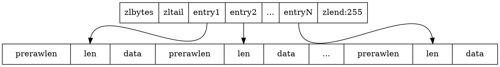

## Introduction

The ziplist is a specially encoded dually linked list that is designed to be very memory efficient.
It stores both strings and integer values, where **integers are encoded as actual integers instead of a series of characters**.
It allows push and pop operations on either side of the list in O(1) time.
However, because every operation requires a reallocation of the memory used by the ziplist, the actual complexity is related to the amount of memory used by the ziplist.

Search $O(N)$

The general layout of the ziplist is as follows:

```
 <zlbytes> <zltail> <zllen> <entry> <entry> ... <entry> <zlend>
```





[hash](/docs/CS/DB/Redis/struct/hash.mdhash.md) and [zset](/docs/CS/DB/Redis/struct/zset.mdzset.md) default use ziplist.

[list use quicklist( based on ziplist)](/docs/CS/DB/Redis/struct/list.mdlist.md?id=quicklist).

Hashes are encoded using a memory efficient data structure when they have a small number of entries, and the biggest entry does not exceed a given threshold.
These thresholds can be configured using the following directives.

```
# redis.conf
hash-max-ziplist-entries 512
hash-max-ziplist-value 64
```

```c
// object.c
robj *createZiplistObject(void) {
    unsigned char *zl = ziplistNew();
    robj *o = createObject(OBJ_LIST,zl);
    o->encoding = OBJ_ENCODING_ZIPLIST;
    return o;
}
```

The size of a ziplist header: two 32 bit integers for the total bytes count and last item offset. One 16 bit integer for the number of items field.

**11bytes** except entries


| Field   | Description                                                                         | 
|---------|-------------------------------------------------------------------------------------| 
| zlbytes | uint32_t,                                                                           | 
| zltail  | uint32_t,                                                                           | 
| zllen   | uint16_t, when len > 2^16 - 2, value=2^16 - 1, we should iterator to get actual len | 
| entry   |                                                                                     | 
| zlend   | uint8_t, value=255                                                                  | 


#### ziplistNew

ziplistNew 函数的逻辑很简单，就是创建一块连续的内存空间，大小为 ZIPLIST_HEADER_SIZE 和 ZIPLIST_END_SIZE 的总和，然后再把该连续空间的最后一个字节赋值为 ZIP_END，表示列表结束

```c
// ziplist.c
unsigned char *ziplistNew(void) {
    unsigned int bytes = ZIPLIST_HEADER_SIZE+ZIPLIST_END_SIZE;
    unsigned char *zl = zmalloc(bytes);
    ZIPLIST_BYTES(zl) = intrev32ifbe(bytes);
    ZIPLIST_TAIL_OFFSET(zl) = intrev32ifbe(ZIPLIST_HEADER_SIZE);
    ZIPLIST_LENGTH(zl) = 0;
    zl[bytes-1] = ZIP_END;
    return zl;
}

#define ZIPLIST_HEADER_SIZE     (sizeof(uint32_t)*2+sizeof(uint16_t))
#define ZIPLIST_END_SIZE        (sizeof(uint8_t))
#define ZIP_END 255
```

zlentry struct

```
<prevlen><len><encoding>
```


逆序遍历时使用 prevlen 获取它用于前移获取prev entry的首地址 它会根据prev entry的字节数进行变长编码

- prev entry < 254, prevlen为1byte
- prev entry >= 254, prevlen为5byte, 第一个byte设置为254作为标识 4byte作为32位int值存储长度

> [!TIP]
>
> 255用于zlend

prevrawlen 1byte or 5 bytes, sometimes will [prevrawlen cascadeUpdate](/docs/CS/DB/Redis/struct/zset.mdzset.md?id=cascadeUpdate)

We use this function to receive information about a ziplist entry.
Note that this is not how the data is actually encoded, is just what we get filled by a function in order to operate more easily.

```c
typedef struct zlentry {
    unsigned int prevrawlensize; /* Bytes used to encode the previous entry len*/
    unsigned int prevrawlen;     /* Previous entry len. */
    unsigned int lensize;        /* Bytes used to encode this entry type/len.
                                    For example strings have a 1, 2 or 5 bytes
                                    header. Integers always use a single byte.*/
    unsigned int len;            /* Bytes used to represent the actual entry.
                                    For strings this is just the string length
                                    while for integers it is 1, 2, 3, 4, 8 or
                                    0 (for 4 bit immediate) depending on the
                                    number range. */
    unsigned int headersize;     /* prevrawlensize + lensize. */
    unsigned char encoding;      /* Set to ZIP_STR_* or ZIP_INT_* depending on
                                    the entry encoding. However for 4 bits
                                    immediate integers this can assume a range
                                    of values and must be range-checked. */
    unsigned char *p;            /* Pointer to the very start of the entry, that
                                    is, this points to prev-entry-len field. */
} zlentry;
```

```c
/* Resize the ziplist. */
unsigned char *ziplistResize(unsigned char *zl, unsigned int len) {
    zl = zrealloc(zl,len);
    ZIPLIST_BYTES(zl) = intrev32ifbe(len);
    zl[len-1] = ZIP_END;
    return zl;
}

// endianconv.c
uint32_t intrev32(uint32_t v) {
    memrev32(&v);
    return v;
}

/* Toggle the 32 bit unsigned integer pointed by *p from little endian to
 * big endian */
void memrev32(void *p) {
    unsigned char *x = p, t;

    t = x[0];
    x[0] = x[3];
    x[3] = t;
    t = x[1];
    x[1] = x[2];
    x[2] = t;
}
```


相比linkedlist 节省了prev和next的指针, 根据encoding可以再继续优化int类型的存储 将entry data合并到encoding中

但是ziplist的限制是无法保存大数据量 其查询时间复杂度为`O(N)`


### insert

1. encode content
2. Allocate memory
3. memory copy

```c
// ziplist.c
unsigned char *ziplistPush(unsigned char *zl, unsigned char *s, unsigned int slen, int where) {
    unsigned char *p;
    p = (where == ZIPLIST_HEAD) ? ZIPLIST_ENTRY_HEAD(zl) : ZIPLIST_ENTRY_END(zl);
    return __ziplistInsert(zl,p,s,slen);
}

/* Insert item at "p". */
unsigned char *__ziplistInsert(unsigned char *zl, unsigned char *p, unsigned char *s, unsigned int slen) {
    size_t curlen = intrev32ifbe(ZIPLIST_BYTES(zl)), reqlen, newlen;
    unsigned int prevlensize, prevlen = 0;
    size_t offset;
    int nextdiff = 0;
    unsigned char encoding = 0;
    long long value = 123456789; /* initialized to avoid warning. Using a value
                                    that is easy to see if for some reason
                                    we use it uninitialized. */
    zlentry tail;

    /* Find out prevlen for the entry that is inserted. */
    if (p[0] != ZIP_END) {
        ZIP_DECODE_PREVLEN(p, prevlensize, prevlen);
    } else {
        unsigned char *ptail = ZIPLIST_ENTRY_TAIL(zl);
        if (ptail[0] != ZIP_END) {
            prevlen = zipRawEntryLengthSafe(zl, curlen, ptail);
        }
    }

    /* See if the entry can be encoded */
    if (zipTryEncoding(s,slen,&value,&encoding)) {
        /* 'encoding' is set to the appropriate integer encoding */
        reqlen = zipIntSize(encoding);
    } else {
        /* 'encoding' is untouched, however zipStoreEntryEncoding will use the
         * string length to figure out how to encode it. */
        reqlen = slen;
    }
    /* We need space for both the length of the previous entry and
     * the length of the payload. */
    reqlen += zipStorePrevEntryLength(NULL,prevlen);
    reqlen += zipStoreEntryEncoding(NULL,encoding,slen);

    /* When the insert position is not equal to the tail, we need to
     * make sure that the next entry can hold this entry's length in
     * its prevlen field. */
    int forcelarge = 0;
    nextdiff = (p[0] != ZIP_END) ? zipPrevLenByteDiff(p,reqlen) : 0;
    if (nextdiff == -4 && reqlen < 4) {
        nextdiff = 0;
        forcelarge = 1;
    }

    /* Store offset because a realloc may change the address of zl. */
    offset = p-zl;
    newlen = curlen+reqlen+nextdiff;
    zl = ziplistResize(zl,newlen);
    p = zl+offset;

    /* Apply memory move when necessary and update tail offset. */
    if (p[0] != ZIP_END) {
        /* Subtract one because of the ZIP_END bytes */
        memmove(p+reqlen,p-nextdiff,curlen-offset-1+nextdiff);

        /* Encode this entry's raw length in the next entry. */
        if (forcelarge)
            zipStorePrevEntryLengthLarge(p+reqlen,reqlen);
        else
            zipStorePrevEntryLength(p+reqlen,reqlen);

        /* Update offset for tail */
        ZIPLIST_TAIL_OFFSET(zl) =
            intrev32ifbe(intrev32ifbe(ZIPLIST_TAIL_OFFSET(zl))+reqlen);

        /* When the tail contains more than one entry, we need to take
         * "nextdiff" in account as well. Otherwise, a change in the
         * size of prevlen doesn't have an effect on the *tail* offset. */
        assert(zipEntrySafe(zl, newlen, p+reqlen, &tail, 1));
        if (p[reqlen+tail.headersize+tail.len] != ZIP_END) {
            ZIPLIST_TAIL_OFFSET(zl) =
                intrev32ifbe(intrev32ifbe(ZIPLIST_TAIL_OFFSET(zl))+nextdiff);
        }
    } else {
        /* This element will be the new tail. */
        ZIPLIST_TAIL_OFFSET(zl) = intrev32ifbe(p-zl);
    }

    /* When nextdiff != 0, the raw length of the next entry has changed, so
     * we need to cascade the update throughout the ziplist */
    if (nextdiff != 0) {
        offset = p-zl;
        zl = __ziplistCascadeUpdate(zl,p+reqlen);
        p = zl+offset;
    }

    /* Write the entry */
    p += zipStorePrevEntryLength(p,prevlen);
    p += zipStoreEntryEncoding(p,encoding,slen);
    if (ZIP_IS_STR(encoding)) {
        memcpy(p,s,slen);
    } else {
        zipSaveInteger(p,value,encoding);
    }
    ZIPLIST_INCR_LENGTH(zl,1);
    return zl;
}
```

### delete

1. calc deleted length
2. Memory copy
3. Reallocate memory

```c
// ziplist

/* Delete a single entry from the ziplist, pointed to by *p.
 * Also update *p in place, to be able to iterate over the
 * ziplist, while deleting entries. */
unsigned char *ziplistDelete(unsigned char *zl, unsigned char **p) {
    size_t offset = *p-zl;
    zl = __ziplistDelete(zl,*p,1);

    /* Store pointer to current element in p, because ziplistDelete will
     * do a realloc which might result in a different "zl"-pointer.
     * When the delete direction is back to front, we might delete the last
     * entry and end up with "p" pointing to ZIP_END, so check this. */
    *p = zl+offset;
    return zl;
}

/* Delete "num" entries, starting at "p". Returns pointer to the ziplist. */
unsigned char *__ziplistDelete(unsigned char *zl, unsigned char *p, unsigned int num) {
    unsigned int i, totlen, deleted = 0;
    size_t offset;
    int nextdiff = 0;
    zlentry first, tail;
    size_t zlbytes = intrev32ifbe(ZIPLIST_BYTES(zl));

    zipEntry(p, &first); /* no need for "safe" variant since the input pointer was validated by the function that returned it. */
    for (i = 0; p[0] != ZIP_END && i < num; i++) {
        p += zipRawEntryLengthSafe(zl, zlbytes, p);
        deleted++;
    }

    assert(p >= first.p);
    totlen = p-first.p; /* Bytes taken by the element(s) to delete. */
    if (totlen > 0) {
        uint32_t set_tail;
        if (p[0] != ZIP_END) {
            /* Storing `prevrawlen` in this entry may increase or decrease the
             * number of bytes required compare to the current `prevrawlen`.
             * There always is room to store this, because it was previously
             * stored by an entry that is now being deleted. */
            nextdiff = zipPrevLenByteDiff(p,first.prevrawlen);

            /* Note that there is always space when p jumps backward: if
             * the new previous entry is large, one of the deleted elements
             * had a 5 bytes prevlen header, so there is for sure at least
             * 5 bytes free and we need just 4. */
            p -= nextdiff;
            assert(p >= first.p && p<zl+zlbytes-1);
            zipStorePrevEntryLength(p,first.prevrawlen);

            /* Update offset for tail */
            set_tail = intrev32ifbe(ZIPLIST_TAIL_OFFSET(zl))-totlen;

            /* When the tail contains more than one entry, we need to take
             * "nextdiff" in account as well. Otherwise, a change in the
             * size of prevlen doesn't have an effect on the *tail* offset. */
            assert(zipEntrySafe(zl, zlbytes, p, &tail, 1));
            if (p[tail.headersize+tail.len] != ZIP_END) {
                set_tail = set_tail + nextdiff;
            }

            /* Move tail to the front of the ziplist */
            /* since we asserted that p >= first.p. we know totlen >= 0,
             * so we know that p > first.p and this is guaranteed not to reach
             * beyond the allocation, even if the entries lens are corrupted. */
            size_t bytes_to_move = zlbytes-(p-zl)-1;
            memmove(first.p,p,bytes_to_move);
        } else {
            /* The entire tail was deleted. No need to move memory. */
            set_tail = (first.p-zl)-first.prevrawlen;
        }

        /* Resize the ziplist */
        offset = first.p-zl;
        zlbytes -= totlen - nextdiff;
        zl = ziplistResize(zl, zlbytes);
        p = zl+offset;

        /* Update record count */
        ZIPLIST_INCR_LENGTH(zl,-deleted);

        /* Set the tail offset computed above */
        assert(set_tail <= zlbytes - ZIPLIST_END_SIZE);
        ZIPLIST_TAIL_OFFSET(zl) = intrev32ifbe(set_tail);

        /* When nextdiff != 0, the raw length of the next entry has changed, so
         * we need to cascade the update throughout the ziplist */
        if (nextdiff != 0)
            zl = __ziplistCascadeUpdate(zl,p);
    }
    return zl;
}
```

### cascadeUpdate

When an entry is inserted, we need to set the **prevlen field** of the next entry to equal the length of the inserted entry.
It can occur that this length cannot be encoded in 1 byte and the next entry needs to be grow a bit larger to hold the 5-byte encoded prevlen.
This can be done for free, because this only happens when an entry is already being inserted (which causes a realloc and memmove).
However, encoding the prevlen may require that this entry is grown as well.
This effect may cascade throughout the ziplist when there are consecutive entries with a size close to ZIP_BIG_PREVLEN, so we need to check that the prevlen can be encoded in every consecutive entry.

Note that this effect can also happen in reverse, where the bytes required to encode the prevlen field can shrink.
This effect is deliberately ignored, because it can cause a "flapping" effect where a chain prevlen fields is first grown and then shrunk again after consecutive inserts.
**Rather, the field is allowed to stay larger than necessary, because a large prevlen field implies the ziplist is holding large entries anyway.**

```c
// ziplist.c
/* The pointer "p" points to the first entry that does NOT need to be
 * updated, i.e. consecutive fields MAY need an update. */
unsigned char *__ziplistCascadeUpdate(unsigned char *zl, unsigned char *p) {
    zlentry cur;
    size_t prevlen, prevlensize, prevoffset; /* Informat of the last changed entry. */
    size_t firstentrylen; /* Used to handle insert at head. */
    size_t rawlen, curlen = intrev32ifbe(ZIPLIST_BYTES(zl));
    size_t extra = 0, cnt = 0, offset;
    size_t delta = 4; /* Extra bytes needed to update a entry's prevlen (5-1). */
    unsigned char *tail = zl + intrev32ifbe(ZIPLIST_TAIL_OFFSET(zl));

    /* Empty ziplist */
    if (p[0] == ZIP_END) return zl;

    zipEntry(p, &cur); /* no need for "safe" variant since the input pointer was validated by the function that returned it. */
    firstentrylen = prevlen = cur.headersize + cur.len;
    prevlensize = zipStorePrevEntryLength(NULL, prevlen);
    prevoffset = p - zl;
    p += prevlen;

    /* Iterate ziplist to find out how many extra bytes do we need to update it. */
    while (p[0] != ZIP_END) {
        assert(zipEntrySafe(zl, curlen, p, &cur, 0));

        /* Abort when "prevlen" has not changed. */
        if (cur.prevrawlen == prevlen) break;

        /* Abort when entry's "prevlensize" is big enough. */
        if (cur.prevrawlensize >= prevlensize) {
            if (cur.prevrawlensize == prevlensize) {
                zipStorePrevEntryLength(p, prevlen);
            } else {
                /* This would result in shrinking, which we want to avoid.
                 * So, set "prevlen" in the available bytes. */
                zipStorePrevEntryLengthLarge(p, prevlen);
            }
            break;
        }

        /* cur.prevrawlen means cur is the former head entry. */
        assert(cur.prevrawlen == 0 || cur.prevrawlen + delta == prevlen);

        /* Update prev entry's info and advance the cursor. */
        rawlen = cur.headersize + cur.len;
        prevlen = rawlen + delta; 
        prevlensize = zipStorePrevEntryLength(NULL, prevlen);
        prevoffset = p - zl;
        p += rawlen;
        extra += delta;
        cnt++;
    }

    /* Extra bytes is zero all update has been done(or no need to update). */
    if (extra == 0) return zl;

    /* Update tail offset after loop. */
    if (tail == zl + prevoffset) {
        /* When the the last entry we need to update is also the tail, update tail offset
         * unless this is the only entry that was updated (so the tail offset didn't change). */
        if (extra - delta != 0) {
            ZIPLIST_TAIL_OFFSET(zl) =
                intrev32ifbe(intrev32ifbe(ZIPLIST_TAIL_OFFSET(zl))+extra-delta);
        }
    } else {
        /* Update the tail offset in cases where the last entry we updated is not the tail. */
        ZIPLIST_TAIL_OFFSET(zl) =
            intrev32ifbe(intrev32ifbe(ZIPLIST_TAIL_OFFSET(zl))+extra);
    }

    /* Now "p" points at the first unchanged byte in original ziplist,
     * move data after that to new ziplist. */
    offset = p - zl;
    zl = ziplistResize(zl, curlen + extra);
    p = zl + offset;
    memmove(p + extra, p, curlen - offset - 1);
    p += extra;

    /* Iterate all entries that need to be updated tail to head. */
    while (cnt) {
        zipEntry(zl + prevoffset, &cur); /* no need for "safe" variant since we already iterated on all these entries above. */
        rawlen = cur.headersize + cur.len;
        /* Move entry to tail and reset prevlen. */
        memmove(p - (rawlen - cur.prevrawlensize), 
                zl + prevoffset + cur.prevrawlensize, 
                rawlen - cur.prevrawlensize);
        p -= (rawlen + delta);
        if (cur.prevrawlen == 0) {
            /* "cur" is the previous head entry, update its prevlen with firstentrylen. */
            zipStorePrevEntryLength(p, firstentrylen);
        } else {
            /* An entry's prevlen can only increment 4 bytes. */
            zipStorePrevEntryLength(p, cur.prevrawlen+delta);
        }
        /* Foward to previous entry. */
        prevoffset -= cur.prevrawlen;
        cnt--;
    }
    return zl;
}
```


## Tuning

虽然 ziplist 通过紧凑的内存布局来保存数据，节省了内存空间，但是 ziplist 也面临着随之而来的两个不足：查找复杂度高和潜在的连锁更新风险

要查找列表中间的元素时，ziplist 就得从列表头或列表尾遍历才行。而当 ziplist 保存的元素过多时，查找中间数据的复杂度就增加了。更糟糕的是，如果 ziplist 里面保存的是字符串，ziplist 在查找某个元素时，还需要逐一判断元素的每个字符，这样又进一步增加了复杂度。
也正因为如此，我们在使用 ziplist 保存 Hash 或 Sorted Set 数据时，都会在 redis.conf 文件中，通过 hash-max-ziplist-entries 和 zset-max-ziplist-entries 两个参数，来控制保存在 ziplist 中的元素个数

除了查找复杂度高以外，ziplist 在插入元素时，如果内存空间不够了，ziplist 还需要重新分配一块连续的内存空间，而这还会进一步引发连锁更新的问题
因为 ziplist 必须使用一块连续的内存空间来保存数据，所以当新插入一个元素时，ziplist 就需要计算其所需的空间大小，并申请相应的内存空间

在 ziplist 中，每一个元素都会记录其前一项的长度，也就是 prevlen。然后，为了节省内存开销，ziplist 会使用不同的空间记录 prevlen，这个 prevlen 空间大小就是 prevlensize

所谓的连锁更新，就是指当一个元素插入后，会引起当前位置元素新增 prevlensize 的空间。而当前位置元素的空间增加后，又会进一步引起该元素的后续元素，其 prevlensize 所需空间的增加

## Links

- [Sorted sets](/docs/CS/DB/Redis/struct/zset.md) 