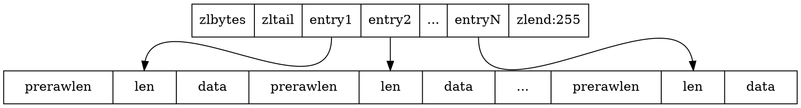

## 简介

ziplist 是一种特殊编码的双向链表，设计为非常节省内存。
它同时存储字符串和整数值，其中**整数被编码为实际整数而不是字符序列**。
它允许在列表的任何一侧以 O(1) 时间执行 push 和 pop 操作。
然而，由于每个操作都需要重新分配 ziplist 使用的内存，实际复杂度与 ziplist 使用的内存量相关。

搜索 $O(N)$

ziplist 的总体布局如下：

```
<zlbytes> <zltail> <zllen> <entry> <entry> ... <entry> <zlend>
```


```dot
digraph  {
    node [shape=plaintext, fontsize=18];
    rankdir = "TB"
       
    Sets [label="<f0> zlbytes | <f1> zltail | <f2> entry1 | <f3> entry2| <f4> ...| <f5> entryN | <f6> zlend:255", color=black, fillcolor=white, style=filled,shape=record, fontcolor=black, fontsize=14, width=6, fixedsize=true];

    entrys [label="<f0> prerawlen | <f1> len | <f2> data | <f3> prerawlen | <f4> len | <f5> data | <f6> ... | <7> prerawlen | <f8> len | <f9> data ", color=black, fillcolor=white, style=filled, shape=record, fontcolor=black, fontsize=14, width=12, fixedsize=true]; 
     
    Sets:f2 -> entrys:f1; 
    Sets:f3 -> entrys:f4; 
    Sets:f5 -> entrys:f8;          
}
```

[hash](/docs/CS/DB/Redis/struct/hash.md) 和 [zset](/docs/CS/DB/Redis/struct/zset.md) 默认使用 ziplist。

[list 使用 quicklist（基于 ziplist）](/docs/CS/DB/Redis/struct/list.md?id=quicklist)。

当哈希具有少量条目且最大条目不超过给定阈值时，使用节省内存的数据结构进行编码。
这些阈值可以使用以下指令配置。

```
# redis.conf
hash-max-ziplist-entries 512
hash-max-ziplist-value 64
```

```c
// object.c
robj *createZiplistObject(void) {
    unsigned char *zl = ziplistNew();
    robj *o = createObject(OBJ_LIST,zl);
    o->encoding = OBJ_ENCODING_ZIPLIST;
    return o;
}
```

ziplist 头部大小：两个 32 位整数用于总字节数和最后项目偏移量。一个 16 位整数用于项目数字段。

除条目外**11 字节**。

| 字段   | 描述 |
|---------|-------------------------------------------------------------------------------------|
| zlbytes | uint32_t |
| zltail  | uint32_t |
| zllen   | uint16_t, 当 len > 2^16 - 2 时，值 = 2^16 - 1，应遍历以获取实际长度 |
| entry   | |
| zlend   | uint8_t, 值 = 255 |

#### ziplistNew

ziplistNew 函数的逻辑很简单，就是创建一块连续的内存空间，大小为 ZIPLIST_HEADER_SIZE 和 ZIPLIST_END_SIZE 的总和，然后再把该连续空间的最后一个字节赋值为 ZIP_END，表示列表结束。

```c
// ziplist.c
unsigned char *ziplistNew(void) {
    unsigned int bytes = ZIPLIST_HEADER_SIZE+ZIPLIST_END_SIZE;
    unsigned char *zl = zmalloc(bytes);
    ZIPLIST_BYTES(zl) = intrev32ifbe(bytes);
    ZIPLIST_TAIL_OFFSET(zl) = intrev32ifbe(ZIPLIST_HEADER_SIZE);
    ZIPLIST_LENGTH(zl) = 0;
    zl[bytes-1] = ZIP_END;
    return zl;
}

#define ZIPLIST_HEADER_SIZE     (sizeof(uint32_t)*2+sizeof(uint16_t))
#define ZIPLIST_END_SIZE        (sizeof(uint8_t))
#define ZIP_END 255
```

zlentry 结构：

```
<prevlen><len><encoding>
```

逆序遍历时使用 prevlen 获取它用于前移获取 prev entry 的首地址，它会根据 prev entry 的字节数进行变长编码。

- prev entry < 254, prevlen 为 1byte
- prev entry >= 254, prevlen 为 5byte, 第一个 byte 设置为 254 作为标识，4byte 作为 32 位 int 值存储长度

> [!TIP]
>
> 255 用于 zlend

prevrawlen 1byte 或 5 bytes，有时会引发 [prevrawlen 连锁更新](/docs/CS/DB/Redis/struct/zset.md?id=cascadeUpdate)。

使用此函数接收 ziplist 条目的信息。
注意，这不是数据实际编码的方式，只是我们通过函数填充以便更轻松地操作的内容。

```c
typedef struct zlentry {
    unsigned int prevrawlensize; /* 用于编码前一条条目长度的字节数 */
    unsigned int prevrawlen;     /* 前一条条目的长度 */
    unsigned int lensize;        /* 用于编码此条目类型/长度的字节数。
                                    例如字符串有 1、2 或 5 字节的头部。
                                    整数始终使用单字节。*/
    unsigned int len;            /* 用于表示实际条目的字节数。
                                    对于字符串，这只是字符串长度；
                                    对于整数，根据数字范围，
                                    它为 1、2、3、4、8 或 0（对于 4 位立即数）。*/
    unsigned int headersize;     /* prevrawlensize + lensize */
    unsigned char encoding;      /* 根据条目编码设置为 ZIP_STR_* 或 ZIP_INT_*。
                                    但对于 4 位立即数整数，
                                    这可以假设一系列值，必须进行范围检查。*/
    unsigned char *p;            /* 指向条目最开始的指针，
                                    即指向 prev-entry-len 字段。*/
} zlentry;
```

```c
/* 调整 ziplist 大小 */
unsigned char *ziplistResize(unsigned char *zl, unsigned int len) {
    zl = zrealloc(zl,len);
    ZIPLIST_BYTES(zl) = intrev32ifbe(len);
    zl[len-1] = ZIP_END;
    return zl;
}

// endianconv.c
uint32_t intrev32(uint32_t v) {
    memrev32(&v);
    return v;
}

/* 将 *p 指向的 32 位无符号整数从小端切换为大端 */
void memrev32(void *p) {
    unsigned char *x = p, t;

    t = x[0];
    x[0] = x[3];
    x[3] = t;
    t = x[1];
    x[1] = x[2];
    x[2] = t;
}
```

相比 linkedlist 节省了 prev 和 next 的指针，根据 encoding 可以再继续优化 int 类型的存储，将 entry data 合并到 encoding 中。

但是 ziplist 的限制是无法保存大数据量，其查询时间复杂度为 `O(N)`。

### insert

1. 编码内容
2. 分配内存
3. 内存拷贝

```c
// ziplist.c
unsigned char *ziplistPush(unsigned char *zl, unsigned char *s, unsigned int slen, int where) {
    unsigned char *p;
    p = (where == ZIPLIST_HEAD) ? ZIPLIST_ENTRY_HEAD(zl) : ZIPLIST_ENTRY_END(zl);
    return __ziplistInsert(zl,p,s,slen);
}

/* 在 "p" 处插入项目 */
unsigned char *__ziplistInsert(unsigned char *zl, unsigned char *p, unsigned char *s, unsigned int slen) {
    // ... 插入逻辑 ...
}
```

### delete

1. 计算删除长度
2. 内存拷贝
3. 重新分配内存

```c
// ziplist

/* 从 ziplist 中删除由 *p 指向的单个条目
 * 同时原地更新 *p，以便在删除条目时能够遍历 ziplist */
unsigned char *ziplistDelete(unsigned char *zl, unsigned char **p) {
    // ... 删除逻辑 ...
}
```

### cascadeUpdate

当插入一个条目时，需要将下一个条目的 **prevlen 字段**设置为等于插入条目的长度。
可能发生这种情况：此长度无法用 1 字节编码，下一个条目需要增大一点以容纳 5 字节编码的 prevlen。
这可以是免费的，因为这只发生在已经插入条目时（这会导致 realloc 和 memmove）。
然而，编码 prevlen 可能需要该条目也增大。
当连续条目的大小接近 ZIP_BIG_PREVLEN 时，此效果可能在整个 ziplist 中级联，因此需要检查每个连续条目中 prevlen 是否可以编码。

注意，此效果也可能反向发生，即编码 prevlen 字段所需的字节数可以缩小。
此效果被故意忽略，因为它可能引起"摆动"效果，其中一串 prevlen 字段首先增大，然后在连续插入后又缩小。
**相反，允许该字段保持比所需更大，因为大的 prevlen 字段意味着 ziplist 无论如何都持有大条目。**

```c
// ziplist.c
/* 指针 "p" 指向第一个不需要更新的条目，
 * 即连续的字段可能需要更新。 */
unsigned char *__ziplistCascadeUpdate(unsigned char *zl, unsigned char *p) {
    // ... 级联更新逻辑 ...
}
```

## 调优

虽然 ziplist 通过紧凑的内存布局来保存数据，节省了内存空间，但是 ziplist 也面临着随之而来的两个不足：查找复杂度高和潜在的连锁更新风险。

要查找列表中间的元素时，ziplist 就得从列表头或列表尾遍历才行。而当 ziplist 保存的元素过多时，查找中间数据的复杂度就增加了。更糟糕的是，如果 ziplist 里面保存的是字符串，ziplist 在查找某个元素时，还需要逐一判断元素的每个字符，这样又进一步增加了复杂度。
也正因为如此，我们在使用 ziplist 保存 Hash 或 Sorted Set 数据时，都会在 redis.conf 文件中，通过 hash-max-ziplist-entries 和 zset-max-ziplist-entries 两个参数，来控制保存在 ziplist 中的元素个数。

除了查找复杂度高以外，ziplist 在插入元素时，如果内存空间不够了，ziplist 还需要重新分配一块连续的内存空间，而这还会进一步引发连锁更新的问题。
因为 ziplist 必须使用一块连续的内存空间来保存数据，所以当新插入一个元素时，ziplist 就需要计算其所需的空间大小，并申请相应的内存空间。

在 ziplist 中，每一个元素都会记录其前一项的长度，也就是 prevlen。然后，为了节省内存开销，ziplist 会使用不同的空间记录 prevlen，这个 prevlen 空间大小就是 prevlensize。

所谓的连锁更新，就是指当一个元素插入后，会引起当前位置元素新增 prevlensize 的空间。而当前位置元素的空间增加后，又会进一步引起该元素的后续元素，其 prevlensize 所需空间的增加。

## 链接

- [有序集合](/docs/CS/DB/Redis/struct/zset.md)
