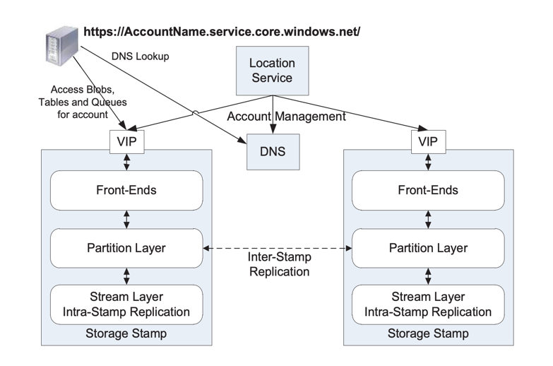
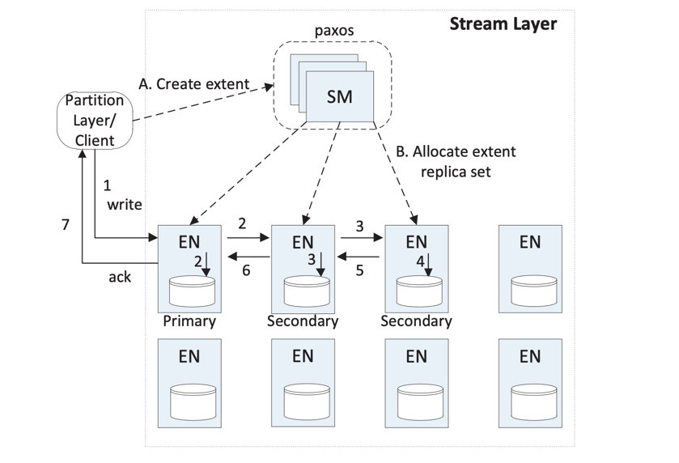
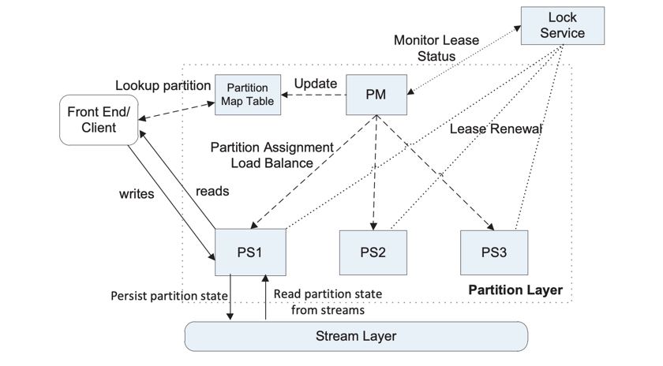

## Introduction

Windows Azure Storage (WAS) is a cloud storage system that provides customers the ability to store seemingly limitless amounts of data for any duration of time.
WAS customers have access to their data from anywhere at any time and only pay for what they use and store. 
In WAS, data is stored durably using both local and geographic replication to facilitate disaster recovery. 
Currently, WAS storage comes in the form of Blobs (files), Tables (structured storage), and Queues (message delivery). 

Some key design features resulting include:

- Strong Consistency
- Global and Scalable Namespace/Storage
- Disaster Recovery
- Multi-tenancy and Cost of Storage

## Architecture

The WAS production system consists of Storage Stamps and the Location Service.

- **Storage Stamps**
  A storage stamp is a cluster of N racks of storage nodes, where each rack is built out as a separate fault domain with redundant networking and power.
  Clusters typically range from 10 to 20 racks with 18 disk-heavy storage nodes per rack.
- **Location Service (LS)**  
  The location service manages all the storage stamps. It is also responsible for managing the account namespace across all stamps.
  The LS allocates accounts to storage stamps and manages them across the storage stamps for disaster recovery and load balancing.
  The location service itself is distributed across two geographic locations for its own disaster recovery.

### Storage Stamp

From bottom up there are three layers within a storage stamp:

- Stream Layer – 
  This layer stores the bits on disk and is in charge of distributing and replicating the data across many servers to keep data durable within a storage stamp. 
  The stream layer can be thought of as a distributed file system layer within a stamp.
  It understands files, called “streams”(which are ordered lists of large storage chunks called “extents”), how to store them, how to replicate them, etc., but it does not understand higher level object constructs or their semantics.
  The data is stored in the stream layer, but it is accessible from the partition layer.
- Partition Layer – 
  The partition layer is built for (a) managing and understanding higher level data abstractions (Blob, Table, Queue), (b) providing a scalable object namespace, 
  (c) providing transaction ordering and strong consistency for objects, (d) storing object data on top of the stream layer, and (e) caching object data to reduce disk I/O.
  This layer manages which partition server is serving what PartitionName ranges for Blobs, Tables, and Queues. 
  In addition, it provides automatic load balancing of PartitionNames across the partition servers to meet the traffic needs of the objects.
- Front-End (FE) layer – 
  The Front-End (FE) layer consists of a set of stateless servers that take incoming requests. 
  Upon receiving a request, an FE looks up the AccountName, authenticates and authorizes the request, then routes the request to a partition server in the partition layer (based on the PartitionName). 
  The system maintains a Partition Map that keeps track of the PartitionName ranges and which partition server is serving which PartitionNames. 
  The FE servers cache the Partition Map and use it to determine which partition server to forward each request to. 
  The FE servers also stream large objects directly from the stream layer and cache frequently accessed data for efficiency.

### Two Replication Engines

The two replication engines in our system and their separate responsibilities.
- Intra-Stamp Replication (stream layer) – 
  This system provides synchronous replication and is focused on making sure all the data written into a stamp is kept durable within that stamp. 
  It keeps enough replicas of the data across different nodes in different fault domains to keep data durable within the stamp in the face of disk, node, and rack failures.
  Intra-stamp replication is done completely by the stream layer and is on the critical path of the customer’s write requests. 
  Once a transaction has been replicated successfully with intra-stamp replication, success can be returned back to the customer.
- Inter-Stamp Replication (partition layer) – 
  This system provides asynchronous replication and is focused on replicating data across stamps. 
  Inter-stamp replication is done in the background and is off the critical path of the customer’s request. 
  This replication is at the object level, where either the whole object is replicated or recent delta changes are replicated for a given account.
  Inter-stamp replication is configured for an account by the location service and performed by the partition layer.

We separated replication into intra-stamp and inter-stamp at these two different layers for the following reasons. 

Intra-stamp replication provides durability against hardware failures, which occur frequently in large scale systems, whereas inter-stamp replication provides geo-redundancy against geo-disasters, which are rare. 
It is crucial to provide intra-stamp replication with low latency, since that is on the critical path of user requests; 
whereas the focus of inter-stamp replication is optimal use of network bandwidth between stamps while achieving an acceptable level of replication delay. 
They are different problems addressed by the two replication schemes.

Another reason for creating these two separate replication layers is the namespace each of these two layers has to maintain. 
Performing intra-stamp replication at the stream layer allows the amount of information that needs to be maintained to be scoped by the size of a single storage stamp. 
This focus allows all of the meta-state for intra-stamp replication to be cached in memory for performance, enabling WAS to provide fast replication with strong consistency by quickly committing transactions within a single stamp for customer requests. 
In contrast, the partition layer combined with the location service controls and understands the global object namespace across stamps, allowing it to efficiently replicate and maintain object state across data centers.

### Stream Layer
The stream layer provides an internal interface used only by the partition layer. It provides a file system like namespace and API, except that all writes are append-only. 
It allows clients (the partition layer) to open, close, delete, rename, read, append to, and concatenate these large files, which are called streams. 
A stream is an ordered list of extent pointers, and an extent is a sequence of append blocks.

The two main architecture components of the stream layer are the Stream Manager (SM) and Extent Node (EN):

The SM keeps track of the stream namespace, what extents are in each stream, and the extent allocation across the Extent Nodes (EN). 
The SM is a standard [Paxos](/docs/CS/Distributed/Paxos.md) cluster as used in prior storage systems, and is off the critical path of client requests.
The SM is responsible for (a) maintaining the stream namespace and state of all active streams and extents, (b) monitoring the health of the ENs, (c) creating and assigning extents to ENs, 
(d) performing the lazy re-replication of extent replicas that are lost due to hardware failures or unavailability, 
(e)garbage collecting extents that are no longer pointed to by any stream, and (f) scheduling the erasure coding of extent data according to stream policy.

The SM periodically polls (syncs) the state of the ENs and what extents they store. 
If the SM discovers that an extent is replicated on fewer than the expected number of ENs, a re-replication of the extent will lazily be created by the SM to regain the desired level of replication. 
For extent replica placement, the SM randomly chooses ENs across different fault domains, so that they are stored on nodes that will not have correlated failures due to power, network, or being on the same rack.

Each extent node maintains the storage for a set of extent replicas assigned to it by the SM. 
An EN has N disks attached, which it completely controls for storing extent replicas and their blocks. 
An EN knows nothing about streams, and only deals with extents and blocks. Internally on an EN server, every extent on disk is a file, which holds data blocks and their checksums, and an index which maps extent offsets to blocks and their file location.

Streams can only be appended to; existing data cannot be modified. The append operations are atomic: either the entire data block is appended, or nothing is. 
Multiple blocks can be appended at once, as a single atomic “multi-block append” operation. 
The minimum read size from a stream is a single block. 
The “multi-block append” operation allows us to write a large amount of sequential data in a single append and to later perform small reads. 
The contract used between the client(partition layer) and the stream layer is that the multi-block append will occur atomically, and if the client never hears back for a request (due to failure) the client should retry the request (or seal the extent).

The partition
layer deals with duplicate records in two ways.
For the metadata and commit log streams, all of the transactions written have a sequence
number and duplicate records will have the same sequence number. For the row data and blob data
streams, for duplicate writes, only the last write will be pointed to by the RangePartition data
structures, so the prior duplicate writes will have no references and will be garbage collected later.

### Partition Layer
The partition layer stores the different types of objects and understands what a transaction means for a given object type (Blob, Table, or Queue). 
The partition layer provides the (a) data model for the different types of objects stored, (b) logic and semantics to process the different types of objects, 
(c) massively scalable namespace for the objects, (d) load balancing to access objects across the available partition servers, and (e) transaction ordering and strong consistency for access to objects.

The partition layer provides an important internal data structure called an Object Table (OT). 
An OT is a massive table which can grow to several petabytes. 
Object Tables are dynamically broken up into RangePartitions (based on traffic load to the table) and spread across Partition Servers in a stamp. 
A RangePartition is a contiguous range of rows in an OT from a given low-key to a high-key. 
All RangePartitions for a given OT are non-overlapping, and every row is represented in some RangePartition.

The partition layer has three main architectural components: a Partition Manager (PM), Partition Servers (PS), and a Lock Service.

- **Partition Manager (PM)** – 
  Responsible for keeping track of and splitting the massive Object Tables into RangePartitions and assigning each RangePartition to a Partition Server to serve access to the objects.
- **Partition Server (PS)** – 
  A partition server is responsible for serving requests to a set of RangePartitions assigned to it by the PM.  
- **Lock Service** – 
  A Paxos Lock Service is used for leader election for the PM.
  

## References

1. [Windows Azure Storage: A Highly Available Cloud Storage Service with Strong Consistency](https://www.sigops.org/s/conferences/sosp/2011/current/2011-Cascais/11-calder-online.pdf)