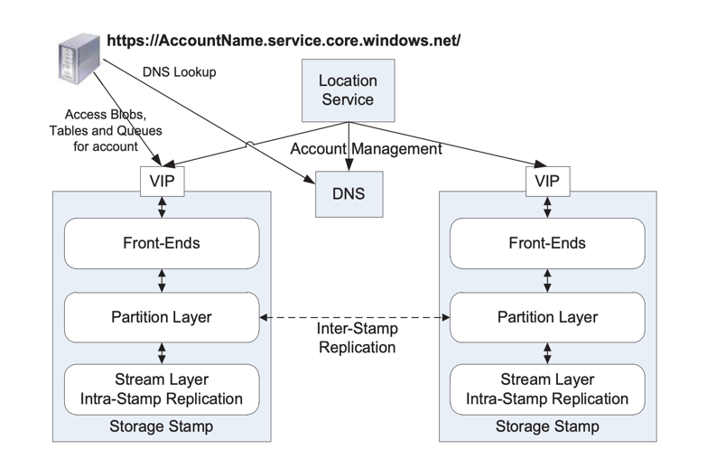
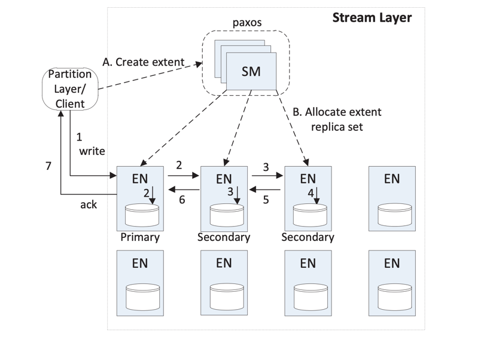
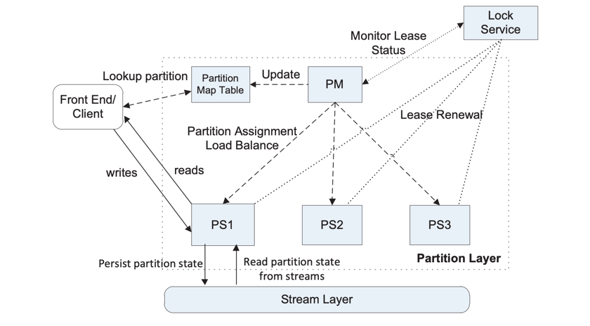

## Introduction

Windows Azure Storage (WAS) 是一个云存储系统，为客户提供存储看似无限量的数据任意时长的能力。
WAS 客户可以随时随地访问他们的数据，且只需按实际使用和存储量付费。
在 WAS 中，数据通过本地和地理复制实现持久性存储，以支持灾难恢复。
目前，WAS 存储以 Blob（文件）、Table（结构化存储）和 Queue（消息传递）的形式提供。

一些关键设计特性包括：

- 强一致性
- 全局可扩展的命名空间/存储
- 灾难恢复
- 多租户和存储成本

## Architecture

WAS 生产系统由 Storage Stamp 和 Location Service 组成。

- **Storage Stamp**
  Storage stamp 是一个由 N 机架存储节点组成的集群，每个机架作为独立的故障域构建，配备冗余的网络和电源。
  集群通常包含 10 到 20 个机架，每个机架有 18 个磁盘密集型存储节点。
- **Location Service (LS)**
  Location Service 管理所有 storage stamp。它还负责管理跨所有 stamp 的账户命名空间。
  LS 将账户分配到 storage stamp，并在 storage stamp 之间管理它们以实现灾难恢复和负载均衡。
  Location Service 本身分布在地理上的两个位置以实现其自身的灾难恢复。

### Storage Stamp

从下到上，storage stamp 内有三个层次：

- Stream Layer –
  该层将数据位存储在磁盘上，并负责跨多台服务器分发和复制数据，以保持数据在 storage stamp 内的持久性。
  Stream layer 可以看作是 stamp 内的分布式文件系统层。
  它理解文件，称为"stream"（即称为"extent"的大型存储块的排序列表），知道如何存储和复制它们等，但不理解更高级的对象构造或其语义。
  数据存储在 stream layer 中，但可以从 partition layer 访问。
- Partition Layer –
  Partition layer 用于：（a）管理和理解更高级的数据抽象（Blob、Table、Queue），（b）提供可扩展的对象命名空间，
  （c）为对象提供事务排序和强一致性，（d）在 stream layer 之上存储对象数据，以及（e）缓存对象数据以减少磁盘 I/O。
  该层管理哪个 partition server 负责哪些 Blob、Table 和 Queue 的 PartitionName 范围。
  此外，它还在 partition server 之间自动负载均衡 PartitionName，以满足对象的流量需求。
- Front-End (FE) layer –
  Front-End (FE) 层由一组无状态服务器组成，负责接收传入请求。
  收到请求后，FE 查找 AccountName，认证和授权请求，然后根据 PartitionName 将请求路由到 partition layer 中的 partition server。
  系统维护一个 Partition Map，追踪 PartitionName 范围以及哪个 partition server 正在服务哪些 PartitionName。
  FE 服务器缓存 Partition Map，并用它来确定将每个请求转发到哪个 partition server。
  FE 服务器还直接从 stream layer 流式传输大型对象，并缓存频繁访问的数据以提高效率。

### Two Replication Engines

系统中两个复制引擎及其各自的职责。

- Intra-Stamp Replication（stream layer）–
  该系统提供同步复制，专注于确保写入 stamp 的所有数据在该 stamp 内保持持久。
  它跨不同故障域的不同节点维护足够的数据副本，以在面对磁盘、节点和机架故障时保持 stamp 内的数据持久性。
  Intra-stamp 复制完全由 stream layer 完成，处于客户写入请求的关键路径上。
  一旦事务通过 intra-stamp 复制成功复制，即可向客户返回成功。
- Inter-Stamp Replication（partition layer）–
  该系统提供异步复制，专注于跨 stamp 复制数据。
  Inter-stamp 复制在后台完成，不处于客户请求的关键路径上。
  此复制在对象级别进行，可以复制整个对象，也可以复制给定账户的最近增量变更。
  Inter-stamp 复制由 location service 为账户配置，并由 partition layer 执行。

我们将复制分为 intra-stamp 和 inter-stamp 这两个不同层次，原因如下。

Intra-stamp 复制针对硬件故障提供持久性，这在大型系统中频繁发生，而 inter-stamp 复制针对地理灾难提供地理冗余，这种情况较为罕见。
Intra-stamp 复制必须提供低延迟，因为它处于用户请求的关键路径上；
而 inter-stamp 复制的重点是在实现可接受的复制延迟的同时，优化利用 stamp 之间的网络带宽。
这是两种复制方案解决的不同问题。

创建这两个独立复制层的另一个原因是这两层各自需要维护的命名空间。
在 stream layer 执行 intra-stamp 复制，使得需要维护的信息量被限制在单个 storage stamp 的规模内。
这种聚焦使得 intra-stamp 复制的所有元状态都可以缓存在内存中以提升性能，从而使 WAS 能够通过快速提交单个 stamp 内的事务，提供具有强一致性的快速复制。
相比之下，partition layer 与 location service 结合，控制和理解跨 stamp 的全局对象命名空间，使其能够高效地跨数据中心复制和维护对象状态。

### Stream Layer

Stream layer 提供仅供 partition layer 使用的内部接口。它提供类似文件系统的命名空间和 API，但所有写入都是追加式的。
它允许客户端（partition layer）打开、关闭、删除、重命名、读取、追加和连接这些称为 stream 的大型文件。
Stream 是一个 extent 指针的有序列表，而 extent 是一系列追加块。

Stream layer 的两个主要架构组件是 Stream Manager (SM) 和 Extent Node (EN)：

SM 维护 stream 命名空间、每个 stream 中的 extent，以及跨 Extent Node (EN) 的 extent 分配。
SM 是一个标准的 [Paxos](/docs/CS/Distributed/Consensus/Paxos.md) 集群，不在客户端请求的关键路径上。
SM 负责：（a）维护 stream 命名空间以及所有活跃 stream 和 extent 的状态，（b）监控 EN 的健康状况，（c）创建 extent 并将其分配给 EN，
（d）对因硬件故障或不可用而丢失的 extent 副本执行延迟的重新复制，
（e）垃圾回收不再被任何 stream 引用的 extent，以及（f）根据 stream 策略调度 extent 数据的纠删码编码。

SM 定期轮询（同步）EN 的状态及其存储的 extent。
如果 SM 发现某个 extent 的副本数低于预期数量，SM 将延迟创建该 extent 的重新复制，以恢复所需的复制级别。
对于 extent 副本放置，SM 跨不同故障域随机选择 EN，确保它们存储在不因电源、网络或同一机架而导致关联故障的节点上。

每个 extent node 维护由 SM 分配的、属于它的 extent 副本集合。
一个 EN 连接 N 个磁盘，它完全控制这些磁盘以存储 extent 副本及其块。
EN 不了解 stream，只处理 extent 和块。在 EN 服务器内部，磁盘上的每个 extent 都是一个文件，包含数据块及其校验和，以及一个将 extent 偏移量映射到块及其文件位置的索引。

Stream 只能追加，不能修改已有数据。追加操作是原子的：要么整个数据块被追加，要么什么都没有。
多个块可以通过单个原子的"多块追加"操作一次性追加。
从 stream 读取的最小单位是一个块。
"多块追加"操作使得我们能够以单个追加操作写入大量顺序数据，并在之后执行小规模读取。
客户端（partition layer）和 stream layer 之间的约定是，多块追加将原子执行，如果客户端未收到请求的响应（由于故障），客户端应重试请求（或 sealed extent）。

Partition layer 以两种方式处理重复记录。
对于元数据和提交日志 stream，所有写入的事务都有序列号，重复记录将具有相同的序列号。对于行数据和 blob 数据 stream，对于重复写入，只有最后一次写入会被 RangePartition 数据结构引用，因此之前的重复写入将没有引用，稍后将被垃圾回收。

### Partition Layer

Partition layer 存储不同类型的对象，并理解事务对特定对象类型（Blob、Table 或 Queue）的含义。
Partition layer 提供：（a）存储的不同类型对象的数据模型，（b）处理不同类型对象的逻辑和语义，
（c）对象的可大规模扩展命名空间，（d）跨可用 partition server 访问对象的负载均衡，以及（e）对象访问的事务排序和强一致性。

Partition layer 提供了一个重要的内部数据结构，称为 Object Table (OT)。
OT 是一个大型表，可以增长到数 PB。
Object Table 根据表的流量负载动态分割成 RangePartition，并分布在 stamp 内的 Partition Server 上。
RangePartition 是 OT 中从给定 low-key 到 high-key 的连续行范围。
给定 OT 的所有 RangePartition 是非重叠的，每一行都存在于某个 RangePartition 中。

Partition layer 有三个主要架构组件：Partition Manager (PM)、Partition Server (PS) 和 Lock Service。

- **Partition Manager (PM)** –
  负责追踪并将大型 Object Table 分割成 RangePartition，并将每个 RangePartition 分配给一个 Partition Server 来服务对象访问。
- **Partition Server (PS)** –
  Partition server 负责服务由 PM 分配给它的一组 RangePartition 的请求。
- **Lock Service** –
  一个 Paxos Lock Service，用于 PM 的 leader 选举。

## References

1. [Windows Azure Storage: A Highly Available Cloud Storage Service with Strong Consistency](https://www.sigops.org/s/conferences/sosp/2011/current/2011-Cascais/11-calder-online.pdf)
