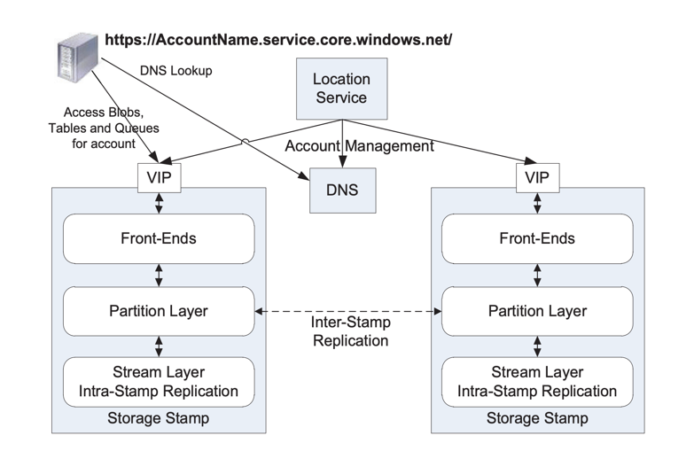
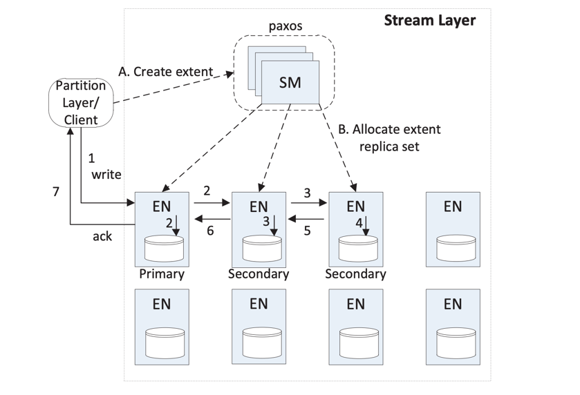
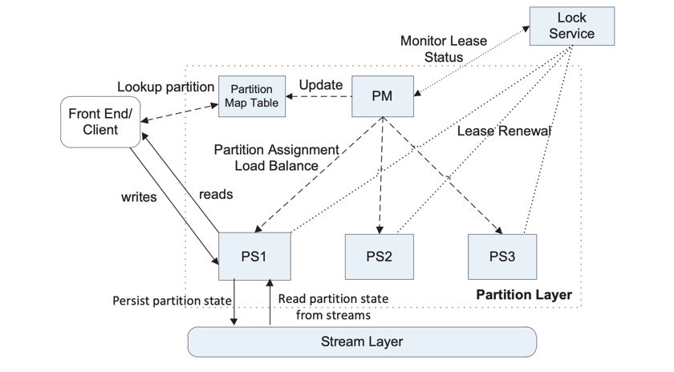

## Introduction

Windows Azure Storage（WAS，以下简称 Azure Storage）是一个云存储系统，让客户能够存储看似无限量的数据，且存储时长任意。WAS 客户可随时随地访问自己的数据，并且只为实际使用和存储的部分付费。在 WAS 中，数据通过本地复制与地理复制两种方式持久化存储，以便进行灾难恢复。目前，WAS 存储以三种形式提供：Blob（文件）、Table（结构化存储）与 Queue（消息投递）。

由此带来的一些关键设计特性包括：

- 强一致性（Strong Consistency）
- 全局可扩展的命名空间 / 存储（Global and Scalable Namespace/Storage）
- 灾难恢复（Disaster Recovery）
- 多租户与存储成本（Multi-tenancy and Cost of Storage）

## Architecture

WAS 生产系统由存储戳（Storage Stamp）与位置服务（Location Service）两部分构成。

- **存储戳（Storage Stamp）**
  一个存储戳是由 N 个机架的存储节点组成的集群，每个机架作为一个独立的故障域（fault domain）构建，具备冗余的网络与供电。集群通常包含 10 到 20 个机架，每个机架上约有 18 个磁盘密集型的存储节点。
- **位置服务（Location Service，LS）**
  位置服务管理所有的存储戳，并负责跨所有存储戳管理账户命名空间。LS 把账户分配到各个存储戳，并为了灾难恢复与负载均衡而在存储戳之间管理这些账户。位置服务自身也跨两个地理位置分布部署，以实现自身的灾难恢复。

### Storage Stamps

从下往上看，一个存储戳内部有三层：

- **流层（Stream Layer）** ——
  该层把数据位（bit）存储到磁盘上，并负责在大量服务器之间分发与复制数据，使数据在存储戳内保持持久。可以把流层理解为存储戳内部的分布式文件系统层。它理解“文件”（称为“流（stream）”，即有序的大块存储单元“区段（extent）”的列表）、如何存储与复制它们等，但它不理解更高层的对象构造及其语义。数据存放在流层，但可从分区层访问。
- **分区层（Partition Layer）** ——
  分区层的职责包括：(a) 管理与理解高层数据抽象（Blob、Table、Queue）；(b) 提供可扩展的对象命名空间；(c) 为对象提供事务定序与强一致性；(d) 在流层之上存储对象数据；(e) 缓存对象数据以减少磁盘 I/O。该层管理哪个分区服务器（partition server）正在为 Blob、Table、Queue 的哪些 PartitionName 区间提供服务，还会自动在分区服务器之间对 PartitionName 做负载均衡，以满足对象的流量需求。
- **前端层（Front-End，FE）** ——
  前端层由一组无状态服务器组成，负责接收外部请求。收到请求后，FE 会查询 AccountName、对请求做鉴权与授权，再依据 PartitionName 把请求路由到分区层中的某个分区服务器。系统维护一张分区映射表（Partition Map），记录 PartitionName 区间以及各区间由哪个分区服务器服务。FE 服务器缓存这张 Partition Map，并据此判断把每个请求转发给哪个分区服务器。FE 服务器还会直接从流层流式读取大对象，并缓存频繁访问的数据以提升效率。

### Two Replication Engines

系统中两个复制引擎及其各自独立的职责如下。

- **存储戳内复制（Intra-Stamp Replication，流层）** ——
  该机制提供同步复制，专注于确保写入某个存储戳的所有数据在该戳内部保持持久。它把数据在处于不同故障域的不同节点上保留足够数量的副本，从而在面对磁盘、节点与机架故障时，在存储戳内部保持数据持久。存储戳内复制完全由流层完成，并处于客户写请求的关键路径上。一旦一次事务通过存储戳内复制成功复制，即可向客户返回成功。
- **存储戳间复制（Inter-Stamp Replication，分区层）** ——
  该机制提供异步复制，专注于跨存储戳复制数据。存储戳间复制在后台完成，不处于客户请求的关键路径上。这种复制以对象为粒度，要么复制整个对象，要么复制某个账户近期发生变更的增量。存储戳间复制由位置服务为账户配置，并由分区层执行。

我们把复制拆成这两层（存储戳内与存储戳间），原因有下。

存储戳内复制用于抵御硬件故障——这在大规模系统中频繁发生；而存储戳间复制用于抵御地理灾难——这很罕见。由于存储戳内复制处于用户请求的关键路径上，低延迟至关重要；而存储戳间复制的关注点则是在达成可接受复制延迟的前提下，优化存储戳之间的网络带宽利用。二者是不同的问题，由两套复制方案分别解决。

建立这两套独立复制层的另一个原因，是它们各自需要维护的命名空间不同。在流层做存储戳内复制，使得需要维护的信息量被限定在单个存储戳的规模内。这种聚焦让存储戳内复制的全部元状态都能缓存在内存中以提升性能，使 WAS 能够通过在单个存储戳内快速提交事务，以强一致性提供高速复制来响应客户请求。相比之下，分区层与位置服务共同掌控并理解跨存储戳的全局对象命名空间，从而能高效地跨数据中心复制并维护对象状态。

### Flow Layer

流层提供一个仅供分区层使用的内部接口，它提供类似文件系统的命名空间与 API，区别在于所有写入都是追加写（append-only）。它允许客户端（即分区层）打开、关闭、删除、重命名、读取、追加以及拼接这些称为流（stream）的大文件。一个流是有序的区段（extent）指针列表，而区段是一串追加块（append block）的序列。

流层的两大架构组件是流管理器（SM，Stream Manager）与区段节点（EN，Extent Node）：

SM 跟踪流命名空间、每个流中包含哪些区段，以及区段在各 EN 之间的分配情况。SM 是一个标准的 [Paxos](/docs/CS/Distributed/Consensus/Paxos.md) 集群（与先前的存储系统用法一致），不处于客户请求的关键路径上。SM 的职责包括：(a) 维护流命名空间与所有活跃流及区段的状态；(b) 监控 EN 的健康状况；(c) 创建区段并将其分配给 EN；(d) 因硬件故障或不可用而对丢失的区段副本做惰性（lazy）重新复制；(e) 对不再被任何流指向的区段做垃圾回收；(f) 依据流策略调度区段数据的纠删码（erasure coding）。

SM 定期轮询（sync）EN 的状态，以及它们所存储的区段。如果 SM 发现某个区段的副本数少于期望值，就会由 SM 惰性创建该区段的重新复制，以恢复期望的复制级别。在放置区段副本时，SM 会跨不同故障域随机选择 EN，使它们落在不会因供电、网络或同机架而 correlated 失败的节点上。

每个 EN 维护由 SM 分配给它的一组区段副本的存储。一个 EN 挂载 N 块磁盘，完全由其掌控，用于存储区段副本及其数据块。EN 对“流”一无所知，只处理区段与块。在 EN 服务器内部，磁盘上的每个区段都是一个文件，其中包含数据块及其校验和，以及一个把区段偏移映射到块及其文件位置的索引。

流只能被追加，已有数据无法被修改。追加操作是原子的：要么整块数据被追加，要么什么都没发生。可以一次性追加多个块，作为一个原子的“多块追加（multi-block append）”操作。从流读取的最小单位是一个块。“多块追加”操作让我们能在一次追加中写入大量顺序数据，并在之后进行小块读取。分区层（客户端）与流层之间的约定是：多块追加将原子地发生；如果客户端因故障始终没有收到回复，它应当重试请求（或封口（seal）该区段）。

分区层用两种方式处理重复记录。对于元数据与提交日志（commit log）流，写入的所有事务都带有序列号，重复记录会有相同的序列号；对于行数据与 Blob 数据流，重复写入时，只有最后一次写入会被 RangePartition 的数据结构指向，因此此前的重复写入没有任何引用，后续会被垃圾回收。

### Partition Layer

分区层存储不同类型的对象，并理解对给定对象类型（Blob、Table 或 Queue）而言，一次事务意味着什么。分区层提供：(a) 所存储各类对象的数据模型；(b) 处理各类对象的逻辑与语义；(c) 大规模可扩展的对象命名空间；(d) 跨可用分区服务器访问对象的负载均衡；(e) 访问对象的事务定序与强一致性。

分区层提供一个重要的内部数据结构，称为对象表（OT，Object Table）。一个 OT 是可以增长到数 PB 的巨大表格。对象表会依据流量负载被动态地拆分成 RangePartition，并散布到一个存储戳内的多个分区服务器上。一个 RangePartition 是某个 OT 中从低键（low-key）到高键（high-key）的一段连续行区间。某个 OT 的所有 RangePartition 互不重叠，且每一行都落在某个 RangePartition 中。

分区层有三大架构组件：分区管理器（PM，Partition Manager）、分区服务器（PS，Partition Server）与锁服务（Lock Service）。

- **分区管理器（PM）** ——
  负责跟踪并拆分巨大的对象表为 RangePartition，并把每个 RangePartition 分配给一个分区服务器来服务对象访问。
- **分区服务器（PS）** ——
  负责服务 PM 分配给它的一组 RangePartition 的请求。
- **锁服务（Lock Service）** ——
  一个基于 Paxos 的锁服务，用于 PM 的领导者选举。

## Links

- [Architecture](/docs/CS/Distributed/Architecture.md)
- [Bigtable](/docs/CS/Distributed/Bigtable.md)
- [Borg](/docs/CS/Distributed/Borg.md)
- [Byzantine](/docs/CS/Distributed/Byzantine.md)
- [CAP](/docs/CS/Distributed/CAP.md)
- [Chubby](/docs/CS/Distributed/Chubby.md)

## References

1. [Windows Azure Storage: A Highly Available Cloud Storage Service with Strong Consistency](https://www.sigops.org/s/conferences/sosp/2011/current/2011-Cascais/11-calder-online.pdf)
