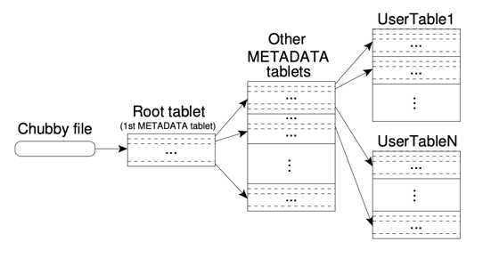

## Introduction

Bigtable is a distributed storage system for managing structured data that is designed to scale to a very large size: petabytes of data across thousands of commodity servers.
Bigtable has achieved several goals: wide applicability, scalability, high performance, and high availability.

In many ways, Bigtable resembles a database: it shares many implementation strategies with databases.
Parallel databases and main-memory databases have achieved scalability and high performance, but Bigtable provides a different interface than such systems. 
Bigtable does not support a full relational data model; instead, it provides clients with a simple data model that supports dynamic control over data layout and format, 
and allows clients to reason about the locality properties of the data represented in the underlying storage.
Data is indexed using row and column names that can be arbitrary strings. 
Bigtable also treats data as uninterpreted strings, although clients often serialize various forms of structured and semi-structured data into these strings. 
Clients can control the locality of their data through careful choices in their schemas. 
Finally, Bigtable schema parameters let clients dynamically control whether to serve data out of memory or from disk.

## Data Model

A Bigtable is a sparse, distributed, persistent multidimensional sorted map. 
The map is indexed by a row key, column key, and a timestamp; each value in the map is an uninterpreted array of bytes.

```
(row:string, column:string, time:int64) → string
```


## Architecture

Bigtable is built on several other pieces of Google infrastructure. 
Bigtable uses the distributed [Google File System](/docs/CS/Distributed/GFS.md) to store log and data files.
A Bigtable cluster typically operates in a shared pool of machines that run a wide variety of other distributed applications, and Bigtable processes often share the same machines with processes from other applications. 
Bigtable depends on a cluster management system for scheduling jobs, managing resources on shared machines, dealing with machine failures, and monitoring machine status.


The Google SSTable file format is used internally to store Bigtable data. 
An SSTable provides a persistent, ordered immutable map from keys to values, where both keys and values are arbitrary byte strings. 
Operations are provided to look up the value associated with a specified key, and to iterate over all key/value pairs in a specified key range. 
Internally, each SSTable contains a sequence of blocks (typically each block is 64KB in size, but this is configurable). 
A block index (stored at the end of the SSTable) is used to locate blocks; the index is loaded into memory when the SSTable is opened. 
A lookup can be performed with a single disk seek: we first find the appropriate block by performing a binary search in the in-memory index, and then reading the appropriate block from disk. 
Optionally, an SSTable can be completely mapped into memory, which allows us to perform lookups and scans without touching disk.


Bigtable relies on a highly-available and persistent
distributed lock service called [Chubby](/docs/CS/Distributed/Chubby.md).
Bigtable uses Chubby for a variety of tasks: to ensure that there is at most one active master at any time; to store the bootstrap location of Bigtable data; 
to discover tablet servers and finalize tablet server deaths; to store Bigtable schema information (the column family information for each table); and to store access control lists. 
**If Chubby becomes unavailable for an extended period of time, Bigtable becomes unavailable.**


The Bigtable implementation has three major components: a library that is linked into every client, one master server, and many tablet servers. 
Tablet servers can be dynamically added (or removed) from a cluster to accomodate changes in workloads.

The master is responsible for assigning tablets to tablet servers, detecting the addition and expiration of tablet servers, balancing tablet-server load, and garbage collection of files in GFS. 
In addition, it handles schema changes such as table and column family creations.

Each tablet server manages a set of tablets (typically we have somewhere between ten to a thousand tablets per tablet server). 
The tablet server handles read and write requests to the tablets that it has loaded, and also splits tablets that have grown too large.

As with many single-master distributed storage systems, client data does not move through the master: clients communicate directly with tablet servers for reads and writes. 
Because Bigtable clients do not rely on the master for tablet location information, most clients never communicate with the master. 
As a result, the master is lightly loaded in practice.

A Bigtable cluster stores a number of tables. Each table consists of a set of tablets, and each tablet contains all data associated with a row range. Initially, each table consists of just one tablet. 
As a table grows, it is automatically split into multiple tablets, each approximately 100-200 MB in size by default.

### Tablet

We use a three-level hierarchy analogous to that of a B+ tree to store tablet location information.



The first level is a file stored in Chubby that contains the location of the root tablet. 
The root tablet contains the location of all tablets in a special METADATA table.
Each METADATA tablet contains the location of a set of user tablets. 
The root tablet is just the first tablet in the METADATA table, but is treated specially—it is never split—to ensure that the tablet location hierarchy has no more than three levels.

The METADATA table stores the location of a tablet under a row key that is an encoding of the tablet’s table identifier and its end row. 
Each METADATA row stores approximately 1KB of data in memory. 
With a modest limit of 128 MB METADATA tablets, our three-level location scheme is sufficient to address $2^34$ tablets (or $2^61$ bytes in 128 MB tablets).

The client library caches tablet locations. 
If the client does not know the location of a tablet, or if it discovers that cached location information is incorrect, then it recursively moves up the tablet location hierarchy.
If the client’s cache is empty, the location algorithm requires three network round-trips, including one read from Chubby. 
If the client’s cache is stale, the location algorithm could take up to six round-trips, because stale cache entries are only discovered upon misses (assuming that METADATA tablets do not move very frequently).
Although tablet locations are stored in memory, so no GFS accesses are required, we further reduce this cost in the common case by having the client library prefetch tablet locations: 
it reads the metadata for more than one tablet whenever it reads the METADATA table.

We also store secondary information in the METADATA table, including a log of all events pertaining to each tablet (such as when a server begins serving it). 
This information is helpful for debugging and performance analysis.

#### Tablet Assignment

Each tablet is assigned to one tablet server at a time. 
The master keeps track of the set of live tablet servers, and the current assignment of tablets to tablet servers, including which tablets are unassigned. 
When a tablet is unassigned, and a tablet server with sufficient room for the tablet is available, the master assigns the tablet by sending a tablet load request to the tablet server.

Bigtable uses Chubby to keep track of tablet servers.
When a tablet server starts, it creates, and acquires an exclusive lock on, a uniquely-named file in a specific Chubby directory. 
The master monitors this directory(the servers directory) to discover tablet servers. 
A tablet server stops serving its tablets if it loses its exclusive lock: e.g., due to a network partition that caused the server to lose its Chubby session. 
(Chubby provides an efficient mechanism that allows a tablet server to check whether it still holds its lock without incurring network traffic.) 
A tablet server will attempt to reacquire an exclusive lock on its file as long as the file still exists. 
If the file no longer exists, then the tablet server will never be able to serve again, so it kills itself. 
Whenever a tablet server terminates (e.g., because the cluster management system is removing the tablet server’s machine from the cluster), it attempts to release its lock so that the master will reassign its tablets more quickly.


The set of existing tablets only changes when a table is created or deleted, two existing tablets are merged to form one larger tablet, or an existing tablet is split into two smaller tablets. 
The master is able to keep track of these changes because it initiates all but the last.


#### Tablet Serving

The persistent state of a tablet is stored in GFS. 
Updates are committed to a commit log that stores redo records. 
Of these updates, the recently committed ones are stored in memory in a sorted buffer called a memtable; the older updates are stored in a sequence of SSTables. 
To recover a tablet, a tablet server reads its metadata from the METADATA table. 
This metadata contains the list of SSTables that comprise a tablet and a set of a redo points, which are pointers into any commit logs that may contain data for the tablet. 
The server reads the indices of the SSTables into memory and reconstructs the memtable by applying all of the updates that have committed since the redo points.


If the master moves a tablet from one tablet server to another, the source tablet server first does a minor compaction on that tablet. 
This compaction reduces recovery time by reducing the amount of uncompacted state in the tablet server’s commit log. 
After finishing this compaction, the tablet server stops serving the tablet. 
Before it actually unloads the tablet, the tablet server does another (usually very fast) minor compaction to eliminate any remaining uncompacted state in the tablet server’s log that arrived while the first minor compaction was being performed. 
After this second minor compaction is complete, the tablet can be loaded on another tablet server without requiring any recovery of log entries.


## Compaction

As write operations execute, the size of the memtable increases. 
When the memtable size reaches a threshold, the memtable is frozen, a new memtable is created, and the frozen memtable is converted to an SSTable and written to GFS. 
This *minor compaction* process has two goals:it shrinks the memory usage of the tablet server, and it reduces the amount of data that has to be read from the commit log during recovery if this server dies. 
Incoming read and write operations can continue while compactions occur.

Every minor compaction creates a new SSTable. 
If this behavior continued unchecked, read operations might need to merge updates from an arbitrary number of SSTables. 
Instead, we bound the number of such files by periodically executing a *merging compaction* in the background. 
A merging compaction reads the contents of a few SSTables and the memtable, and writes out a new SSTable. 
The input SSTables and memtable can be discarded as soon as the compaction has finished.

A merging compaction that rewrites all SSTables into exactly one SSTable is called a *major compaction*. 
SSTables produced by non-major compactions can contain special deletion entries that suppress deleted data in older SSTables that are still live. 
A major compaction, on the other hand, produces an SSTable that contains no deletion information or deleted data. Bigtable cycles through all of its tablets and regularly applies major compactions to them. 
These major compactions allow Bigtable to reclaim resources used by deleted data, and also allow it to ensure that deleted data disappears from the system in a timely fashion, which is important for services that store sensitive data.

## Refinements

### Caching

To improve read performance, tablet servers use two levels of caching. 
The Scan Cache is a higher-level cache that caches the key-value pairs returned by the SSTable interface to the tablet server code. 
The Block Cache is a lower-level cache that caches SSTables blocks that were read from GFS. 
The Scan Cache is most useful for applications that tend to read the same data repeatedly. 
The Block Cache is useful for applications that tend to read data that is close to the data they recently read (e.g., sequential reads, or random reads of different columns in the same locality group within a hot row).


### Bloom filters

A Bloom filter allows us to ask whether an SSTable might contain any data for a specified row/column pair. 
For certain applications, a small amount of tablet server memory used for storing Bloom filters drastically reduces the number of disk seeks required for read operations. 
Our use of Bloom filters also implies that most lookups for non-existent rows or columns do not need to touch disk.

### Commit log

If we kept the commit log for each tablet in a separate log file, a very large number of files would be written concurrently in GFS. 
Depending on the underlying file system implementation on each GFS server, these writes could cause a large number of disk seeks to write to the different physical log files. 
In addition, having separate log files per tablet also reduces the effectiveness of the group commit optimization, since groups would tend to be smaller. 
To fix these issues, we append mutations to a single commit log per tablet server, co-mingling mutations for different tablets in the same physical log file.

Using one log provides significant performance benefits during normal operation, but it complicates recovery. 
When a tablet server dies, the tablets that it served will be moved to a large number of other tablet servers: each server typically loads a small number of the original server’s tablets. 
To recover the state for a tablet, the new tablet server needs to reapply the mutations for that tablet from the commit log written by the original tablet server. 
However, the mutations for these tablets were co-mingled in the same physical log file. 
One approach would be for each new tablet server to read this full commit log file and apply just the entries needed for the tablets it needs to recover. 
However, under such a scheme, if 100 machines were each assigned a single tablet from a failed tablet server, then the log file would be read 100 times (once by each server).

We avoid duplicating log reads by first sorting the commit log entries in order of the keys `<table, row name, log sequence number>`. 
In the sorted output, all mutations for a particular tablet are contiguous and can therefore be read efficiently with one disk seek followed by a sequential read. 
To parallelize the sorting, we partition the log file into 64 MB segments, and sort each segment in parallel on different tablet servers. 
This sorting process is coordinated by the master and is initiated when a tablet server indicates that it needs to recover mutations from some commit log file.

Writing commit logs to GFS sometimes causes performance hiccupsfor a variety of reasons (e.g., a GFS server machine involved in the write crashes, or the network paths traversed to reach the particular set of three GFS servers is suffering network congestion, or is heavily loaded). 
To protect mutations from GFS latency spikes, each tablet server actually has two log writing threads, each writing to its own log file; only one of these two threads is actively in use at a time. 
If writes to the active log file are performing poorly, the log file writing is switched to the other thread, and mutations that are in the commit log queue are written by the newly active log writing thread. 
Log entries contain sequence numbers to allow the recovery process to elide duplicated entries resulting from this log switching process.


## Links

- [Google](/docs/CS/Distributed/Google.md)
- [GFS](/docs/CS/Distributed/GFS.md)


## References

1. [Bigtable: A Distributed Storage System for Structured Data](https://read.seas.harvard.edu/~kohler/class/cs239-w08/chang06bigtable.pdf)