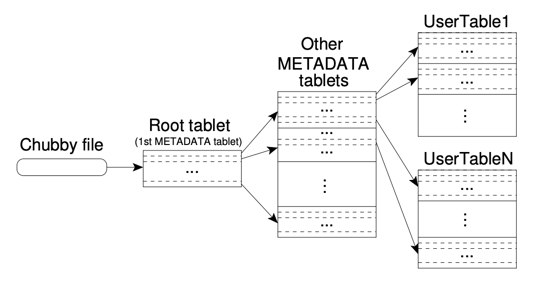

## Introduction

Bigtable 是一个用于管理结构化数据的分布式存储系统，设计用于扩展到非常大的规模：跨数千台廉价服务器的 PB 级数据。
Bigtable 实现了几个目标：广泛的适用性、可扩展性、高性能和高可用性。

在许多方面，Bigtable 类似于数据库：它与数据库共享许多实现策略。
并行数据库和主存数据库已经实现了可扩展性和高性能，但 Bigtable 提供了与这些系统不同的接口。
Bigtable 不支持完整的关系数据模型；相反，它为客户端提供了一个简单的数据模型，支持对数据布局和格式的动态控制，
并允许客户端推理底层存储中数据表示的位置属性。
数据使用行和列名称进行索引，这些名称可以是任意字符串。
Bigtable 还将数据视为未解释的字符串，尽管客户端经常将各种形式的结构化和半结构化数据序列化到这些字符串中。
客户端可以通过仔细选择模式来控制其数据的位置。
最后，Bigtable 模式参数允许客户端动态控制是从内存还是从磁盘提供数据。

## Data Model

Bigtable 是一个稀疏的、分布式的、持久的、多维有序映射。
该映射由行键、列键和时间戳索引；映射中的每个值都是一个未解释的字节数组。

```
(row:string, column:string, time:int64) → string
```

## Architecture

Bigtable 构建在 Google 的其他几个基础设施组件之上。
Bigtable 使用分布式 [Google File System](/docs/CS/Distributed/GFS.md) 来存储日志和数据文件。
Bigtable 集群通常运行在一个共享机器池中，该池运行各种其他分布式应用程序，Bigtable 进程通常与其他应用程序的进程共享同一台机器。
Bigtable 依赖集群管理系统来调度作业、管理共享机器上的资源、处理机器故障以及监控机器状态。

Google 的 SSTable 文件格式在内部用于存储 Bigtable 数据。
SSTable 提供了一个持久的、有序的不可变键值映射，其中键和值都是任意的字节字符串。
提供了查找与指定键关联的值以及在指定键范围内迭代所有键值对的操作。
在内部，每个 SSTable 包含一系列块（通常每个块大小为 64KB，但可配置）。
块索引（存储在 SSTable 末尾）用于定位块；索引在 SSTable 打开时加载到内存中。
查找可以通过一次磁盘寻道完成：我们首先通过在内存索引中执行二分查找来找到合适的块，然后从磁盘读取相应的块。
可选地，SSTable 可以完全映射到内存中，这允许我们在不接触磁盘的情况下执行查找和扫描。

Bigtable 依赖一个称为 [Chubby](/docs/CS/Distributed/Chubby.md) 的高可用持久分布式锁服务。
Bigtable 将 Chubby 用于多种任务：确保任何时候最多只有一个活跃的 master；存储 Bigtable 数据的引导位置；
发现 tablet server 并最终确定 tablet server 死亡；存储 Bigtable 模式信息（每个表的列族信息）；以及存储访问控制列表。
**如果 Chubby 长时间不可用，Bigtable 将变得不可用。**

**Bigtable 实现有三个主要组件：一个链接到每个客户端的库、一个 master 服务器和许多 tablet server。**
Tablet server 可以动态添加（或移除）到集群以适应工作负载的变化。

Master 负责将 tablet 分配给 tablet server，检测 tablet server 的添加和过期，平衡 tablet server 的负载，以及 GFS 中文件的垃圾回收。
此外，它还处理模式更改，如表和列族的创建。

每个 tablet server 管理一组 tablet（通常每个 tablet server 有十到一千个 tablet）。
Tablet server 处理其已加载的 tablet 的读写请求，并拆分已经变得过大的 tablet。

与许多单 master 分布式存储系统一样，客户端数据不经过 master：客户端直接与 tablet server 通信进行读写。
由于 Bigtable 客户端不依赖 master 获取 tablet 位置信息，大多数客户端从不与 master 通信。
因此，master 在实践中负载较轻。

Bigtable 集群存储多个表。每个表由一组 tablet 组成，每个 tablet 包含与一个行范围相关的所有数据。最初，每个表只包含一个 tablet。
随着表的增长，它会自动拆分为多个 tablet，默认情况下每个 tablet 大约 100-200 MB。

### Tablet

我们使用类似于 B+ 树的三层层次结构来存储 tablet 位置信息。



第一层是存储在 Chubby 中的一个文件，包含 root tablet 的位置。
Root tablet 包含特殊 METADATA 表中所有 tablet 的位置。
每个 METADATA tablet 包含一组用户 tablet 的位置。
Root tablet 只是 METADATA 表中的第一个 tablet，但被特殊处理——它永远不会被拆分——以确保 tablet 位置层次结构不超过三层。

METADATA 表在行键下存储 tablet 的位置，行键是对 tablet 的表标识符及其结束行的编码。
每个 METADATA 行在内存中存储约 1KB 的数据。
在 128 MB METADATA tablet 的适度限制下，我们的三层位置方案足以寻址 $2^34$ 个 tablet（或 128 MB tablet 下的 $2^61$ 字节）。

客户端库缓存 tablet 位置。
如果客户端不知道 tablet 的位置，或者发现缓存的位置信息不正确，它会递归地在 tablet 位置层次结构中向上查找。
如果客户端的缓存为空，位置算法需要三次网络往返，包括一次从 Chubby 读取。
如果客户端的缓存已过期，位置算法可能需要多达六次往返，因为过期的缓存条目只有在未命中时才会被发现（假设 METADATA tablet 不会频繁移动）。
虽然 tablet 位置存储在内存中，因此不需要 GFS 访问，但我们通过在常见情况下让客户端库预取 tablet 位置来进一步降低成本：
它在读取 METADATA 表时读取多个 tablet 的元数据。

我们还在 METADATA 表中存储辅助信息，包括与每个 tablet 相关的所有事件的日志（例如，服务器何时开始为其服务）。
此信息有助于调试和性能分析。

#### Tablet Assignment

每个 tablet 一次分配给一个 tablet server。
Master 维护活跃 tablet server 的集合，以及 tablet 到 tablet server 的当前分配，包括哪些 tablet 未分配。
当出现未分配的 tablet，并且有足够空间的 tablet server 可用时，master 通过向 tablet server 发送 tablet 加载请求来分配该 tablet。

Bigtable 使用 Chubby 来跟踪 tablet server。
当 tablet server 启动时，它在特定 Chubby 目录中创建并获取一个唯一命名文件上的排他锁。
Master 监控此目录（服务器目录）以发现 tablet server。
如果 tablet server 失去其排他锁（例如，由于网络分区导致服务器丢失其 Chubby 会话），它将停止服务其 tablet。
（Chubby 提供了一种高效机制，允许 tablet server 在不产生网络流量的情况下检查它是否仍然持有锁。）
只要文件仍然存在，tablet server 将尝试重新获取其文件上的排他锁。
如果文件不再存在，则 tablet server 将永远无法再服务，因此它会自行终止。
每当 tablet server 终止时（例如，因为集群管理系统正在从集群中移除 tablet server 的机器），它会尝试释放其锁，以便 master 更快地重新分配其 tablet。

现有 tablet 的集合仅在以下情况下发生变化：创建或删除表、两个现有 tablet 合并为一个更大的 tablet、或现有 tablet 拆分为两个更小的 tablet。
Master 能够跟踪这些更改，因为除了最后一种情况外，所有更改都由它发起。

#### Tablet Serving

Tablet 的持久状态存储在 GFS 中。
更新提交到存储重做记录的提交日志。
在这些更新中，最近提交的存储在内存中的排序缓冲区（称为 memtable）中；较旧的更新存储在一系列 SSTable 中。
为了恢复 tablet，tablet server 从 METADATA 表读取其元数据。
此元数据包含组成 tablet 的 SSTable 列表和一组重做点，这些是指向可能包含该 tablet 数据的任何提交日志的指针。
服务器将 SSTable 的索引读入内存，并通过应用自重做点以来已提交的所有更新来重建 memtable。

如果 master 将 tablet 从一个 tablet server 移动到另一个，源 tablet server 首先对该 tablet 执行 minor compaction。
此压缩通过减少 tablet server 提交日志中未压缩状态的数量来缩短恢复时间。
完成此压缩后，tablet server 停止服务该 tablet。
在实际卸载 tablet 之前，tablet server 执行另一次（通常非常快速的）minor compaction，以消除在第一次 minor compaction 期间到达的 tablet server 日志中任何剩余的未压缩状态。
在第二次 minor compaction 完成后，可以在另一个 tablet server 上加载该 tablet，而无需恢复任何日志条目。

## Compaction

随着写入操作的执行，memtable 的大小会增加。
当 memtable 大小达到阈值时，memtable 被冻结，创建新的 memtable，并将冻结的 memtable 转换为 SSTable 写入 GFS。
此 *minor compaction* 过程有两个目标：减少 tablet server 的内存使用，以及减少此服务器宕机时从提交日志读取的数据量。
压缩期间传入的读写操作可以继续。

每次 minor compaction 都会创建一个新的 SSTable。
如果这种行为不加检查地继续下去，读取操作可能需要合并来自任意数量 SSTable 的更新。
相反，我们通过定期在后台执行 *merging compaction* 来限制此类文件的数量。
Merging compaction 读取几个 SSTable 和 memtable 的内容，并写出一个新的 SSTable。
压缩完成后，输入的 SSTable 和 memtable 可以被丢弃。

将所有 SSTable 重写为恰好一个 SSTable 的 merging compaction 称为 *major compaction*。
非 major compaction 产生的 SSTable 可能包含特殊的删除条目，以抑制仍然活跃的旧 SSTable 中的已删除数据。
而 major compaction 产生的 SSTable 不包含删除信息或已删除的数据。Bigtable 循环遍历其所有 tablet，并定期对它们应用 major compaction。
这些 major compaction 使 Bigtable 能够回收已删除数据占用的资源，并确保已删除数据及时从系统中消失，这对于存储敏感数据的服务非常重要。

## Refinements

### Caching

为了提高读取性能，tablet server 使用两级缓存。
Scan Cache 是较高级别的缓存，缓存 SSTable 接口返回给 tablet server 代码的键值对。
Block Cache 是较低级别的缓存，缓存从 GFS 读取的 SSTable 块。
Scan Cache 对于倾向于重复读取相同数据的应用程序最有用。
Block Cache 对于倾向于读取接近最近读取数据的数据的应用程序很有用（例如，顺序读取，或热行内同一 locality group 中不同列的随机读取）。

### Bloom filters

Bloom filter 允许我们询问一个 SSTable 是否可能包含指定行/列对的任何数据。
对于某些应用程序，少量用于存储 Bloom filter 的 tablet server 内存可以大幅减少读取操作所需的磁盘寻道次数。
我们使用 Bloom filter 还意味着大多数对不存在的行或列的查找不需要访问磁盘。

### Commit log

如果我们为每个 tablet 将提交日志保存在单独的日志文件中，GFS 中将同时写入大量文件。
根据每个 GFS 服务器上底层文件系统实现的不同，这些写入可能会导致大量磁盘寻道，以写入不同的物理日志文件。
此外，每个 tablet 拥有单独的日志文件也会降低 group commit 优化的效果，因为 group 往往会更小。
为了解决这些问题，我们将变更追加到每个 tablet server 的单个提交日志中，将不同 tablet 的变更混合在同一个物理日志文件中。

使用一个日志在正常操作期间带来了显著的性能优势，但使恢复复杂化。
当 tablet server 宕机时，它服务的 tablet 将被移动到大量其他 tablet server：每个服务器通常加载原始服务器的一小部分 tablet。
为了恢复某个 tablet 的状态，新的 tablet server 需要从原始 tablet server 写入的提交日志中重新应用该 tablet 的变更。
然而，这些 tablet 的变更混合在同一个物理日志文件中。
一种方法是让每个新的 tablet server 读取完整的提交日志文件，并仅应用其需要恢复的 tablet 所需的条目。
然而，在这种方案下，如果 100 台机器每台都从宕机的 tablet server 分配到一个 tablet，那么日志文件将被读取 100 次（每台服务器一次）。

我们通过首先按键 `<table, row name, log sequence number>` 的顺序对提交日志条目进行排序来避免重复的日志读取。
在排序后的输出中，特定 tablet 的所有变更是连续的，因此可以通过一次磁盘寻道后跟顺序读取来高效读取。
为了并行化排序，我们将日志文件划分为 64 MB 的段，并在不同的 tablet server 上并行排序每个段。
此排序过程由 master 协调，并在 tablet server 指示需要从某个提交日志文件恢复变更时启动。

将提交日志写入 GFS 有时会因多种原因导致性能问题（例如，参与写入的 GFS 服务器机器崩溃，或者到达特定三台 GFS 服务器所经过的网络路径遇到网络拥塞或负载过高）。
为了保护变更免受 GFS 延迟尖峰的影响，每个 tablet server 实际上有两个日志写入线程，每个写入自己的日志文件；一次只有一个线程处于活跃使用状态。
如果活跃日志文件的写入性能不佳，日志文件写入会切换到另一个线程，提交日志队列中的变更由新活跃的日志写入线程写入。
日志条目包含序列号，以允许恢复过程消除由此日志切换过程导致的重复条目。

## Links

- [Google](/docs/CS/Distributed/Google.md)
- [GFS](/docs/CS/Distributed/GFS.md)

## References

1. [Bigtable: A Distributed Storage System for Structured Data](https://read.seas.harvard.edu/~kohler/class/cs239-w08/chang06bigtable.pdf)
