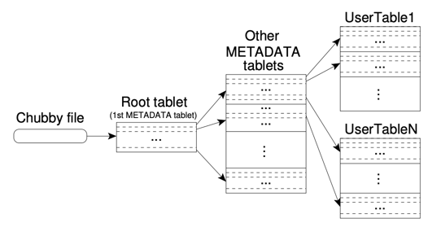

## Introduction

Bigtable 是一个用于管理结构化数据的分布式存储系统，其设计目标是扩展到非常大的规模：跨数千台商用服务器的 PB 级数据。Bigtable 实现了若干目标：广泛的适用性、可扩展性、高性能和高可用性。

在许多方面，Bigtable 类似于一个数据库：它与数据库共享许多实现策略。并行数据库和主存数据库已经实现了可扩展性和高性能，但 Bigtable 提供了与这类系统不同的接口。Bigtable 不支持完整的关系数据模型；相反，它为客户端提供了一个简单的数据模型，支持对数据布局和格式的动态控制，并允许客户端推断底层存储中所表示数据的局部性（locality）属性。数据使用可以是任意字符串的行名和列名进行索引。Bigtable 也将数据视为未经解释的字符串，尽管客户端常常将各种形式的结构化和半结构化数据序列化到这些字符串中。客户端可以通过在 schema 中谨慎选择来控制其数据的局部性。最后，Bigtable 的 schema 参数让客户端动态控制是从内存还是从磁盘提供数据。

## 数据模型

一个 Bigtable 是一个稀疏的、分布式的、持久化的多维有序映射。该映射由行键、列键和时间戳索引；映射中的每个值都是一个未经解释的字节数组。

```
(row:string, column:string, time:int64) → string
```


## 架构

Bigtable 构建在 Google 的其他若干基础设施之上。Bigtable 使用分布式 [Google File System](/docs/CS/Distributed/GFS.md) 来存储日志和数据文件。一个 Bigtable 集群通常运行在一个共享的机器池中，该机器池运行着各种各样的其他分布式应用，并且 Bigtable 进程经常与其他应用的进程共享同一台机器。Bigtable 依赖一个集群管理系统来进行作业调度、管理共享机器上的资源、处理机器故障以及监控机器状态。


Google 的 SSTable 文件格式在内部被用来存储 Bigtable 数据。一个 SSTable 提供了一个持久的、有序的、不可变的从键到值的映射，其中键和值都是任意的字节字符串。提供的操作包括查找与指定键关联的值，以及遍历指定键范围内的所有键值对。在内部，每个 SSTable 包含一个块序列（通常每个块大小为 64KB，但这是可配置的）。一个块索引（存储在 SSTable 末尾）用于定位块；该索引在 SSTable 打开时被加载到内存中。一次查找可以通过一次磁盘寻道完成：我们首先通过在内存索引中执行二分查找来找到合适的块，然后从磁盘读取相应的块。可选地，一个 SSTable 可以被完全映射到内存中，这允许我们无需触碰磁盘即可执行查找和扫描。


Bigtable 依赖一个被称为 [Chubby](/docs/CS/Distributed/Chubby.md) 的、高可用且持久的分布式锁服务。Bigtable 将 Chubby 用于多种任务：确保任意时刻至多只有一个活跃的 master；存储 Bigtable 数据的引导（bootstrap）位置；发现 tablet server 并最终确定 tablet server 的死亡；存储 Bigtable 的 schema 信息（每个表的列族（column family）信息）；以及存储访问控制列表。 **如果 Chubby 在较长时间内不可用，Bigtable 就变得不可用。**


**Bigtable 的实现有三个主要组件：链接到每个客户端的库、一个 master 服务器，以及许多 tablet server。** Tablet server 可以根据工作负载的变化动态地添加（或移除）。

Master 负责将 tablet 分配给 tablet server、检测 tablet server 的加入和过期、平衡 tablet server 的负载，以及 GFS 中文件的垃圾回收。此外，它还处理 schema 变更，例如表和列族的创建。

每个 tablet server 管理一组 tablet（通常每个 tablet server 有十到一千个 tablet）。Tablet server 处理对它已加载的 tablet 的读写请求，并且还会拆分（split）已变得过大的 tablet。

与许多单 master 分布式存储系统一样，客户端数据不经过 master：客户端直接与 tablet server 通信来进行读写。由于 Bigtable 客户端不依赖 master 来获取 tablet 位置信息，大多数客户端从不与 master 通信。结果，master 在实践中负载很轻。

一个 Bigtable 集群存储若干张表。每张表由一组 tablet 组成，每个 tablet 包含与一个行范围关联的所有数据。最初，每张表只由一个 tablet 组成。随着表增长，它会自动拆分为多个 tablet，默认每个大约 100-200 MB。

### Tablet

我们使用一个类似于 B+ 树的三级层级来存储 tablet 位置信息。



第一级是一个存储在 Chubby 中的文件，它包含 root tablet 的位置。Root tablet 包含特殊 METADATA 表中所有 tablet 的位置。每个 METADATA tablet 包含一组用户 tablet 的位置。Root tablet 只是 METADATA 表中的第一个 tablet，但被特殊对待——它从不被拆分——以确保 tablet 位置层级不超过三级。

METADATA 表在一个行键下存储一个 tablet 的位置，该行键是该 tablet 的表标识符和其结束行的编码。每个 METADATA 行在内存中存储大约 1KB 的数据。在 128 MB METADATA tablet 的适度限制下，我们的三级位置方案足以寻址 $2^34$ 个 tablet（或者在 128 MB tablet 下为 $2^61$ 字节）。

客户端库缓存 tablet 位置。如果客户端不知道某个 tablet 的位置，或者发现缓存的位置信息不正确，它就会递归地向上遍历 tablet 位置层级。如果客户端的缓存为空，定位算法需要三次网络往返，其中包括一次从 Chubby 的读取。如果客户端的缓存是陈旧的，定位算法最多可能需要六次往返，因为陈旧的缓存项只有在未命中时才会被发现（假设 METADATA tablet 不会非常频繁地移动）。尽管 tablet 位置存储在内存中，因此不需要 GFS 访问，我们通过在常见情况下让客户端库预取（prefetch）tablet 位置来进一步降低这一成本：每当它读取 METADATA 表时，它会读取多个 tablet 的元数据。

我们还在 METADATA 表中存储辅助信息，包括与每个 tablet 相关的所有事件的日志（例如，当一个 server 开始服务它时）。这些信息有助于调试和性能分析。

#### Tablet 分配

每个 tablet 一次只分配给一个 tablet server。Master 跟踪存活的 tablet server 集合，以及 tablet 到 tablet server 的当前分配，包括哪些 tablet 尚未分配。当一个 tablet 未被分配，并且有一个具有足够空间容纳该 tablet 的 tablet server 可用时，master 通过向该 tablet server 发送一个 tablet 加载请求来分配该 tablet。

Bigtable 使用 Chubby 来跟踪 tablet server。当一个 tablet server 启动时，它在一个特定的 Chubby 目录中创建并获得一个唯一命名的文件的独占锁。Master 监控这个目录（servers 目录）以发现 tablet server。当一个 tablet server 失去其独占锁时，它就停止服务其 tablet：例如，由于导致该 server 失去其 Chubby 会话的网络分区。（Chubby 提供了一种高效的机制，允许 tablet server 在不产生网络流量的情况下检查它是否仍然持有其锁。）只要该文件仍然存在，tablet server 就会尝试重新获取其文件上的独占锁。如果该文件不再存在，那么该 tablet server 将永远无法再次服务，因此它自杀。每当一个 tablet server 终止（例如，因为集群管理系统正在将该 tablet server 的机器从集群中移除），它都会尝试释放其锁，以便 master 更快地重新分配其 tablet。


现有 tablet 的集合只在以下情况下改变：表被创建或删除、两个现有 tablet 合并为一个更大的 tablet，或者一个现有 tablet 被拆分为两个更小的 tablet。Master 能够跟踪这些变化，因为它发起了除最后一种之外的所有变化。


#### Tablet 服务

一个 tablet 的持久化状态存储在 GFS 中。更新被提交到一个存储重做（redo）记录的提交日志（commit log）中。在这些更新中，最近提交的那些被存储在一个称为 memtable 的有序缓冲区中；较旧的更新被存储在一个 SSTable 序列中。为了恢复一个 tablet，tablet server 从 METADATA 表读取其元数据。该元数据包含构成该 tablet 的 SSTable 列表，以及一组重做点（redo point），这些重做点是指向任何可能包含该 tablet 数据的提交日志的指针。该 server 将 SSTable 的索引读入内存，并通过应用自重做点以来已提交的所有更新来重建 memtable。


如果 master 将一个 tablet 从一台 tablet server 移动到另一台，源 tablet server 首先对该 tablet 执行一次 minor compaction（次要压缩）。这次压缩通过减少 tablet server 提交日志中未压缩状态的数量来减少恢复时间。完成这次压缩后，tablet server 停止服务该 tablet。在它实际卸载该 tablet 之前，tablet server 会执行另一次（通常非常快的）minor compaction，以消除在第一次 minor compaction 执行期间到达的、tablet server 日志中任何剩余的未压缩状态。在这第二次 minor compaction 完成后，该 tablet 可以被加载到另一台 tablet server 上，而无需恢复任何日志条目。


## 合并

随着写操作的执行，memtable 的大小会增加。当 memtable 大小达到一个阈值时，memtable 被冻结，创建一个新的 memtable，并且冻结的 memtable 被转换为一个 SSTable 并写入 GFS。这个 *minor compaction*（次要压缩）过程有两个目标：它缩减了 tablet server 的内存使用量，并且减少了在该 server 死亡时恢复期间必须从提交日志读取的数据量。在读和写操作进行期间，压缩可以继续进行。

每次 minor compaction 都会创建一个新的 SSTable。如果这种行为不受控制地持续下去，读操作可能需要合并来自任意数量 SSTable 的更新。相反，我们通过定期在后台执行 *merging compaction*（合并压缩）来限制这类文件的数量。一次 merging compaction 读取若干 SSTable 和 memtable 的内容，并写出一个新的 SSTable。一旦压缩完成，输入的 SSTable 和 memtable 就可以被丢弃。

将所有的 SSTable 精确地重写为一个 SSTable 的 merging compaction 被称为 *major compaction*（主要压缩）。非主要压缩产生的 SSTable 可能包含特殊的删除条目，用于抑制在仍然存活的较旧 SSTable 中已被删除的数据。另一方面，major compaction 产生一个不包含删除信息或已删除数据的 SSTable。Bigtable 遍历其所有的 tablet，并定期对它们应用 major compaction。这些 major compaction 使 Bigtable 能够回收被已删除数据使用的资源，并且也使它能够确保已删除数据及时地从系统中消失，这对于存储敏感数据的服务来说很重要。

## 改进

### 缓存

为了提高读性能，tablet server 使用两级缓存。Scan Cache 是一个较高级别的缓存，它缓存从 SSTable 接口返回给 tablet server 代码的键值对。Block Cache 是一个较低级别的缓存，它缓存从 GFS 读取的 SSTable 块。Scan Cache 对于倾向于重复读取相同数据的应用最为有用。Block Cache 对于倾向于读取与其最近读取的数据相近的数据的应用很有用（例如，顺序读，或在同一局部性组（locality group）内的热行中不同列的随机读）。


### Bloom 过滤器

Bloom 过滤器允许我们询问一个 SSTable 是否可能包含某个指定行/列对的数据。对于某些应用，用于存储 Bloom 过滤器的一小部分 tablet server 内存极大地减少了读操作所需的磁盘寻道次数。我们对 Bloom 过滤器的使用还意味着，对不存在的行或列的大多数查找不需要触碰磁盘。

### 提交日志

如果我们把每个 tablet 的提交日志保存在一个单独的日志文件中，那么在 GFS 中将会并发地写入非常大量的文件。取决于每个 GFS server 上底层文件系统的实现，这些写可能导致大量的磁盘寻道以写入不同的物理日志文件。此外，每个 tablet 一个单独的日志文件也会降低 group commit（成组提交）优化的有效性，因为组往往会更小。为了解决这些问题，我们将变更追加到每个 tablet server 一个单一的提交日志中，将不同 tablet 的变更混合在同一个物理日志文件中。

使用单个日志在正常操作期间提供了显著的性能优势，但它使恢复变得复杂。当一个 tablet server 死亡时，它所服务的 tablet 将被移动到大量其他的 tablet server 上：每个 server 通常只加载原始 server 的一小部分 tablet。为了恢复一个 tablet 的状态，新的 tablet server 需要从其原始 tablet server 写入的提交日志中重放该 tablet 的变更。然而，这些 tablet 的变更混合在同一个物理日志文件中。一种方法是让每个新的 tablet server 读取这个完整的提交日志文件，并只应用它所需要恢复的那些 tablet 的条目。然而，在这样的方案下，如果 100 台机器每台都被分配了来自一个失效 tablet server 的一个 tablet，那么该日志文件将被读取 100 次（每台 server 一次）。

我们通过首先按照键 `<table, row name, log sequence number>` 的顺序对提交日志记录进行排序，来避免重复的日志读取。在排序后的输出中，特定 tablet 的所有变更都是连续的，因此可以通过一次磁盘寻道加一次顺序读取来高效地读取。为了并行化排序，我们将日志文件划分为 64 MB 的段，并在不同的 tablet server 上并行地对每个段进行排序。这个排序过程由 master 协调，并在一个 tablet server 表示它需要从某个提交日志文件恢复变更时启动。

将提交日志写入 GFS 有时会因为各种原因导致性能波动（例如，参与写入的 GFS server 机器崩溃，或者到达特定三个 GFS server 集合所经过的网络路径正在遭遇网络拥塞或负载过重）。为了保护变更免受 GFS 延迟峰值的影响，每个 tablet server 实际上有两个日志写入线程，每个写入自己的日志文件；在任何时刻只有其中一个线程处于活跃使用状态。如果对活跃日志文件的写入性能不佳，日志文件写入就切换到另一个线程，并且在提交日志队列中的变更由新活跃的日志写入线程写入。日志条目包含序列号，以允许恢复过程略过由这种日志切换过程产生的重复条目。


## Links

- [Google](/docs/CS/Distributed/Google.md)
- [GFS](/docs/CS/Distributed/GFS.md)


## References

1. [Bigtable: A Distributed Storage System for Structured Data](https://read.seas.harvard.edu/~kohler/class/cs239-w08/chang06bigtable.pdf)
