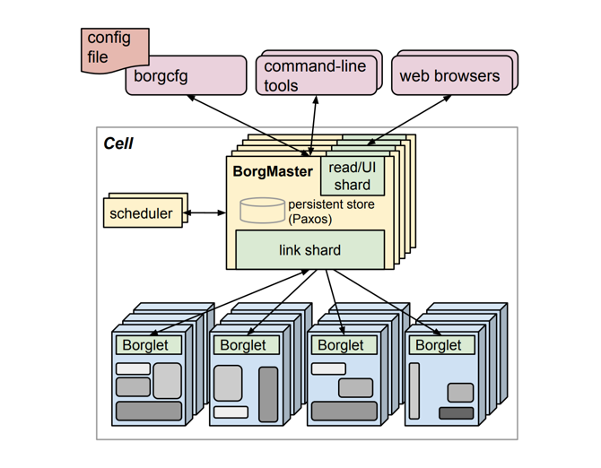

## Introduction

Google’s Borg system is a cluster manager that runs hundreds of thousands of jobs, from many thousands of different applications, across a number of clusters each with up to tens of thousands of machines.

Borg provides three main benefits: it

1. hides the details of resource management and failure handling so its users can focus on application development instead;
2. operates with very high reliability and availability, and supports applications that do the same; and
3. lets us run workloads across tens of thousands of machines effectively. Borg is not the first system to address these issues, but it’s one of the few operating at this scale, with this degree of resiliency and completeness

Borg’s users are Google developers and system administrators (site reliability engineers or SREs) that run Google’s applications and services.
Users submit their work to Borg in the form of jobs, each of which consists of one or more tasks that all run the same program (binary).
Each job runs in one Borg cell, a set of machines that are managed as a unit.

Borg cells run a heterogenous workload with two main parts.

- The first is long-running services that should “never” go down, and handle short-lived latency-sensitive requests (a few µs to a few hundred ms).
  Such services are used for end-user-facing products such as Gmail, Google Docs, and web search, and for internal infrastructure services (e.g., BigTable).
- The second is batch jobs that take from a few seconds to a few days to complete; these are much less sensitive to short-term performance fluctuations.

The workload mix varies across cells, which run different mixes of applications depending on their major tenants (e.g., some cells are quite batch-intensive),
and also varies over time: batch jobs come and go, and many end-user-facing service jobs see a diurnal usage pattern.
Borg is required to handle all these cases equally well.

## Architecture

A Borg cell consists of a set of machines, a logically centralized controller called the Borgmaster, and an agent process called the Borglet that runs on each machine in a cell.

Fig.1. Borg Architecture

### Borgmaster

Each cell’s Borgmaster consists of two processes: the main Borgmaster process and a separate scheduler.
The main Borgmaster process handles client RPCs that either mutate state (e.g., create job) or provide read-only access to data (e.g., lookup job).
It also manages state machines for all of the objects in the system (machines, tasks, allocs, etc.), communicates with the Borglets, and offers a web UI as a backup to Sigma.

The Borgmaster is logically a single process but is actually replicated five times.
Each replica maintains an inmemory copy of most of the state of the cell, and this state is also recorded in a highly-available, distributed, Paxos-based store on the replicas’ local disks.
A single elected master per cell serves both as the Paxos leader and the state mutator, handling all operations that change the cell’s state, such as submitting a job or terminating a task on a machine.
A master is elected (using Paxos) when the cell is brought up and whenever the elected master fails; it acquires a Chubby lock so other systems can find it.
Electing a master and failing-over to the new one typically takes about 10 s, but can take up to a minute in a big cell because some in-memory state has to be reconstructed.
When a replica recovers from an outage, it dynamically re-synchronizes its state from other Paxos replicas that are up-to-date.

The Borgmaster’s state at a point in time is called a checkpoint, and takes the form of a periodic snapshot plus a change log kept in the Paxos store.
Checkpoints have many uses, including restoring a Borgmaster’s state to an arbitrary point in the past (e.g., just before accepting a request that triggered a software defect in Borg so it can be debugged);
fixing it by hand in extremis; building a persistent log of events for future queries; and offline simulations.

### Scheduling

When a job is submitted, the Borgmaster records it persistently in the Paxos store and adds the job’s tasks to the pending queue.
This is scanned asynchronously by the scheduler, which assigns tasks to machines if there are sufficient available resources that meet the job’s constraints.(The scheduler primarily operates on tasks, not jobs.)
The scan proceeds from high to low priority, modulated by a round-robin scheme within a priority to ensure fairness across users and avoid head-of-line blocking behind a large job.
The scheduling algorithm has two parts: feasibility checking, to find machines on which the task could run, and scoring, which picks one of the feasible machines.

### Borglet

The Borglet is a local Borg agent that is present on every machine in a cell.
It starts and stops tasks; restarts them if they fail; manages local resources by manipulating OS kernel settings; rolls over debug logs; and reports the state of the machine to the Borgmaster and other monitoring systems.

## Lessons

**Cluster management is more than task management.**

**The master is the kernel of a distributed system**

## Links

- [Google](/docs/CS/Distributed/Google.md)
- [Cluster Scheduler](/docs/CS/Distributed/Cluster_Scheduler.md)
- [Kubernetes](/docs/CS/Container/K8s.md)

## References

1. [Large-scale cluster management at Google with Borg](https://pdos.csail.mit.edu/6.824/papers/borg.pdf)
2. [Borg, Omega, and Kubernetes](https://dl.acm.org/doi/pdf/10.1145/2890784)
3. [Operating system support for warehouse-scale computing](https://people.csail.mit.edu/malte/pub/dissertations/phd-final.pdf)