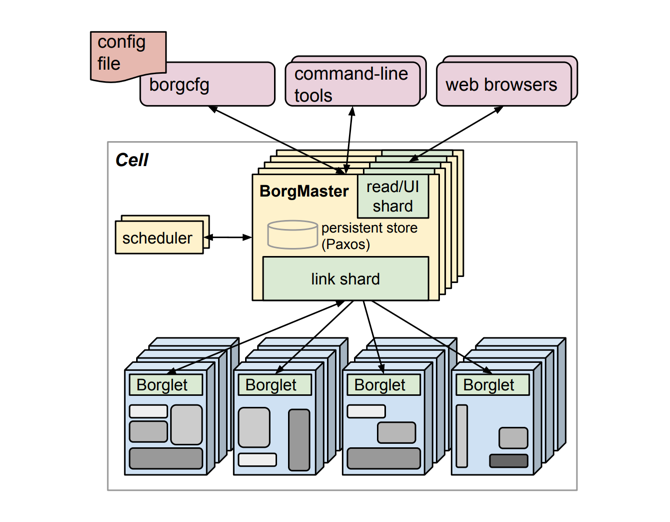

## Introduction

Google 的 Borg 系统是一个集群管理器，运行着来自数千个不同应用程序的数十万个任务，分布在多个集群中，每个集群拥有多达数万台机器。

Borg 提供了三个主要优势：

1. 隐藏了资源管理和故障处理的细节，使用户能够专注于应用程序开发；
2. 以非常高的可靠性和可用性运行，并支持应用程序实现同样的目标；
3. 让我们能够有效地在数万台机器上运行工作负载。

Borg 的用户是运行 Google 应用程序和服务的 Google 开发者和系统管理员（站点可靠性工程师或 SRE）。
用户以作业的形式向 Borg 提交工作，每个作业由一个或多个运行相同程序（二进制文件）的任务组成。
每个作业运行在一个 Borg cell 中，cell 是一组作为单元管理的机器。

Borg cell 运行异构工作负载，主要分为两类：

- 第一类是长期运行的服务，要求"永不"宕机，并处理对延迟敏感的短生命周期请求（几微秒到几百毫秒）。
  这类服务用于面向用户的产品，如 Gmail、Google Docs 和 Web 搜索，以及内部基础设施服务（如 BigTable）。
- 第二类是批处理作业，完成时间从几秒到几天不等；这类作业对短期性能波动的敏感度要低得多。

不同 cell 之间的工作负载混合情况各不相同，取决于其主要租户运行的应用程序组合，
并且随时间变化：批处理作业来来去去，许多面向用户的服务作业呈现昼夜使用模式。
Borg 需要同样出色地处理所有这些情况。

## Architecture

一个 Borg cell 由一组机器、一个逻辑上的集中控制器（称为 Borgmaster）以及一个在每个 cell 机器上运行的代理进程（称为 Borglet）组成。

Fig.1. Borg 架构

### Borgmaster

每个 cell 的 Borgmaster 由两个进程组成：主 Borgmaster 进程和一个独立的调度器。
主 Borgmaster 进程处理变更状态的客户端 RPC（如创建作业）或提供数据只读访问的 RPC（如查询作业）。
它还管理系统所有对象（机器、任务、alloc 等）的状态机，与 Borglet 通信，并提供 Web UI 作为 Sigma 的备份。

Borgmaster 在逻辑上是单进程，但实际上被复制了五份。
每个副本在内存中维护 cell 的大部分状态拷贝，并且该状态也记录在副本本地磁盘上基于 Paxos 的高可用分布式存储中。
每个 cell 选出的单个 master 同时担任 Paxos leader 和状态变更者，处理所有改变 cell 状态的操作，如提交作业或在机器上终止任务。
Master 在 cell 启动时以及当前选举出的 master 失败时被选举（通过 Paxos）；它获取一个 Chubby 锁以便其他系统能够找到它。
选举 master 和故障转移通常需要约 10 秒，但在大 cell 中可能需要一分钟，因为需要重建部分内存状态。
当副本从故障中恢复时，它会动态地从其他最新的 Paxos 副本重新同步状态。

Borgmaster 在某个时间点的状态称为 checkpoint，采用定期快照加上 Paxos 存储中的变更日志的形式。
Checkpoint 有多种用途，包括将 Borgmaster 的状态恢复到过去的任意时点（例如，刚好在接受导致 Borg 软件缺陷的请求之前，以便进行调试）；
在极端情况下手动修复；为未来查询构建持久事件日志；以及离线仿真。

### Scheduling

当一个作业被提交时，Borgmaster 将其持久化记录在 Paxos 存储中，并将该作业的任务添加到待处理队列中。
调度器异步扫描该队列，并在有足够可用资源满足作业约束时将任务分配给机器。（调度器主要操作单位是任务，而非作业。）
扫描按优先级从高到低进行，在优先级内使用轮询方案来确保用户间的公平性并避免大作业的头阻塞。
调度算法分为两部分：可行性检查，用于找到可以运行任务的机器；以及评分，从可行机器中选出一个。

### Borglet

Borglet 是每个 cell 机器上的本地 Borg 代理。
它负责启动和停止任务；在任务失败时重新启动；通过操作操作系统内核设置来管理本地资源；轮转调试日志；向 Borgmaster 和其他监控系统报告机器状态。

### Lessons

**集群管理不仅仅是任务管理。**

**Master 是分布式系统的内核。**

## Links

- [Google](/docs/CS/Distributed/Google.md)
- [Cluster Scheduler](/docs/CS/Distributed/Cluster_Scheduler.md)
- [Kubernetes](/docs/CS/Container/k8s/K8s.md)

## References

1. [Large-scale cluster management at Google with Borg](https://pdos.csail.mit.edu/6.824/papers/borg.pdf)
2. [Borg, Omega, and Kubernetes](https://dl.acm.org/doi/pdf/10.1145/2890784)
3. [Operating system support for warehouse-scale computing](https://people.csail.mit.edu/malte/pub/dissertations/phd-final.pdf)
4. [Borg: the Next Generation](https://dl.acm.org/doi/pdf/10.1145/3342195.3387517)
