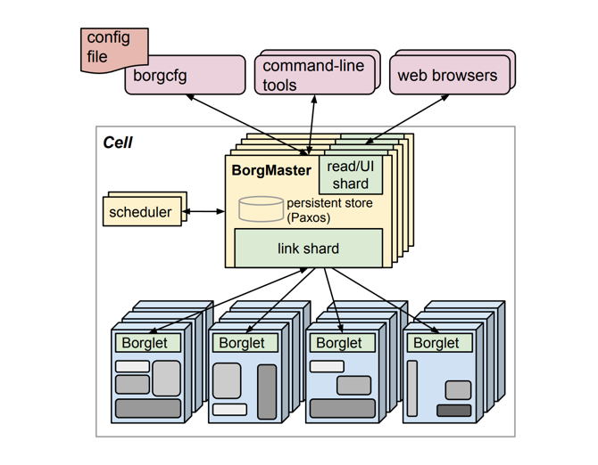

## Introduction

Google 的 Borg 系统是一个集群管理器（cluster manager），它运行着数十万个作业（job），这些作业来自许多不同的应用，横跨若干个每个最多可达数万台机器的集群。

Borg 提供三个主要好处：它

1. 隐藏了资源管理和故障处理的细节，使其用户能够转而专注于应用开发；
2. 以非常高的可靠性和可用性运行，并支持同样做到这一点的应用；以及
3. 让我们能够有效地在数万台机器上运行工作负载。Borg 并不是第一个解决这些问题的系统，但它是少数几个以这种规模、这种弹性和完整性运行的系统之一。

Borg 的用户是 Google 的开发者和系统管理员（站点可靠性工程师（SRE）），他们运行 Google 的应用和服务。用户以作业（job）的形式向 Borg 提交他们的工作，每个作业由一个或多个任务（task）组成，这些任务都运行相同的程序（二进制）。每个作业运行在一个 Borg cell 中，cell 是一组被作为整体管理的机器。

Borg cell 运行着具有两个主要部分的异构（heterogeneous）工作负载。

- 第一部分是长期运行的服务，它们应当"永远"不宕机，并处理短生命周期、对延迟敏感的请求（几微秒到几百毫秒）。此类服务被用于面向终端用户的产品，例如 Gmail、Google Docs 和 web 搜索，以及内部基础设施服务（例如 BigTable）。
- 第二部分是批处理（batch）作业，它们需要几秒到几天来完成；这些作业对短期性能波动的敏感度要低得多。

工作负载组合（workload mix）因 cell 而异，这些 cell 根据其主要租户（tenant）运行不同的应用组合（例如，某些 cell 是相当批处理密集的），并且也随时间变化：批处理作业来来去去，许多面向终端用户的服务作业呈现出昼夜（diurnal）使用模式。Borg 需要同样好地处理所有这些情况。

## Architecture

一个 Borg cell 由一组机器、一个逻辑上集中的控制器（称为 Borgmaster）以及一个在每个机器上运行的称为 Borglet 的代理进程组成。

Fig.1. Borg Architecture

### Borgmaster

每个 cell 的 Borgmaster 由两个进程组成：主 Borgmaster 进程和一个单独的调度器（scheduler）。主 Borgmaster 进程处理客户端 RPC，这些 RPC 要么变更状态（例如创建作业），要么提供对数据的只读访问（例如查找作业）。它还管理系统中所有对象（机器、任务、alloc 等）的状态机，与 Borglet 通信，并提供一个作为 Sigma 后备的 Web UI。

Borgmaster 在逻辑上是一个单进程，但实际上被复制了五次。每个副本维护着 cell 大部分状态的内存（in-memory）副本，并且该状态也被记录在一个高可用、分布式、基于 Paxos 的存储（store）中，位于副本的本地磁盘上。每个 cell 中一个被选出的 master 同时充当 Paxos leader 和状态变更者（state mutator），处理所有改变 cell 状态的操作，例如提交一个作业或终止一台机器上的一个任务。一个 master 在 cell 启动时被选出（使用 Paxos），并且在选出的 master 失败时再次选出；它获取一个 Chubby 锁以便其他系统能够找到它。选出一个 master 并故障转移（failover）到新的 master 通常花费大约 10 秒，但在一个大的 cell 中由于某些内存状态必须被重建，可能花费多达一分钟。当一个副本从停机（outage）中恢复时，它会从其他最新的 Paxos 副本动态重新同步（re-synchronize）其状态。

Borgmaster 在某一时刻的状态被称为一个检查点（checkpoint），其形式是一个周期性快照（snapshot）加上保存在 Paxos 存储中的变更日志（change log）。检查点有许多用途，包括将 Borgmaster 的状态恢复到过去的任意时间点（例如，恰好在接受了一个触发了 Borg 中软件缺陷的请求之前，以便调试）；在极端情况下手工修复它；为未来的查询构建一个持久的事件日志；以及离线仿真（simulation）。

### Scheduling

当一个作业被提交时，Borgmaster 将它持久化地记录在 Paxos 存储中，并将该作业的任务加入待处理（pending）队列。调度器异步地扫描该队列，如果有足够的可用资源满足作业的约束，就将任务分配给机器。（调度器主要操作的是任务，而不是作业。）扫描从高优先级向低优先级进行，并通过一个优先级内的轮转（round-robin）方案来调节，以确保跨用户的公平并避免在一个大作业后面发生队头阻塞（head-of-line blocking）。调度算法有两部分：可行性检查（feasibility checking），以找到任务可以运行于其上的机器，以及评分（scoring），它从可行的机器中挑选一台。

### Borglet

Borglet 是一个存在于 cell 中每台机器上的本地 Borg 代理。它启动和停止任务；在任务失败时重启它们；通过操纵 OS 内核设置来管理本地资源；滚动（roll over）调试日志；并向 Borgmaster 和其他监控系统报告机器的状态。

## Lessons Learned

**集群管理不仅仅是任务管理。**

**master 是分布式系统的内核（kernel）**

## Links

- [Google](/docs/CS/Distributed/Google.md)
- [Cluster Scheduler](/docs/CS/Distributed/Cluster_Scheduler.md)
- [Kubernetes](/docs/CS/Container/k8s/K8s.md)

## References

1. [Large-scale cluster management at Google with Borg](https://pdos.csail.mit.edu/6.824/papers/borg.pdf)
2. [Borg, Omega, and Kubernetes](https://dl.acm.org/doi/pdf/10.1145/2890784)
3. [Operating system support for warehouse-scale computing](https://people.csail.mit.edu/malte/pub/dissertations/phd-final.pdf)
4. [Borg: the Next Generation](https://dl.acm.org/doi/pdf/10.1145/3342195.3387517)
