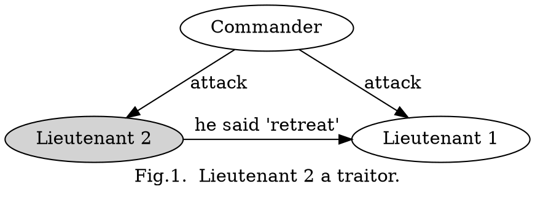
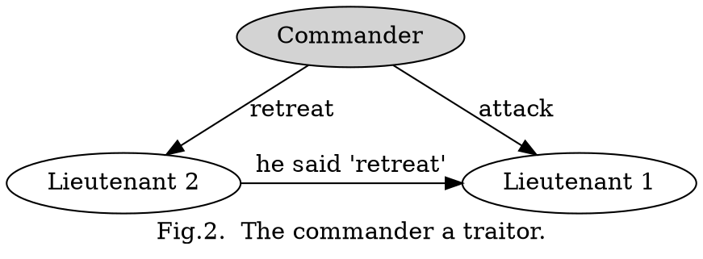
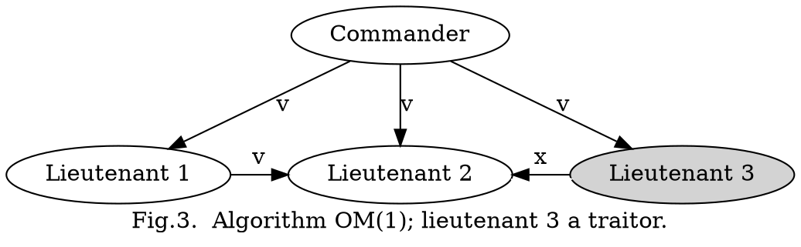
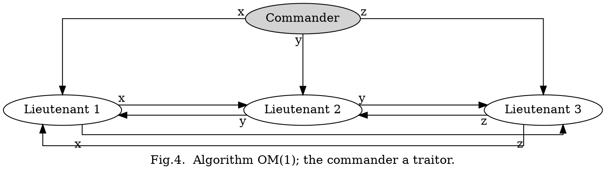
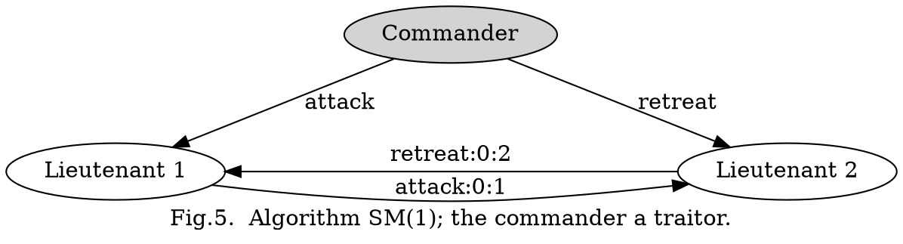

## Introduction

A reliable computer system must be able to cope with the failure of one or more of its components.
A failed component may exhibit a type of behavior that is often overlooked--namely, sending conflicting information to different parts of the system.
The problem of coping with this type of failure is expressed abstractly as the **Byzantine Generals Problem**.

The Byzantine Generals Problem seems deceptively simple.
Using only oral messages, this problem is solvable if and only if more than two-thirds of the generals are loyal; so a single traitor can confound two loyal generals.
In particular, with only three generals, no solution can work in the presence of a single traitor.
An oral message is one whose contents are completely under the control of the sender, so a traitorous sender can transmit any possible message.
Such a message corresponds to the type of message that computers normally send to one another.

## Problem

We imagine that several divisions of the Byzantine army are camped outside an enemy city, each division commanded by its own general.
The generals can communicate with one another only by messenger.
After observing the enemy, they must decide upon a common plan of action.
However, some of the generals may be traitors, trying to prevent the loyal generals from reaching agreement.

The generals must have an algorithm to guarantee that

- **A. All loyal generals decide upon the same plan of action.**

The loyal generals will all do what the algorithm says they should, but the traitors may do anything they wish.
The algorithm must guarantee condition A regardless of what the traitors do.
The loyal generals should not only reach agreement, but should agree upon a reasonable plan.
We therefore also want to insure that

- **B. A small number of traitors cannot cause the loyal generals to adopt a bad plan.**

We consider how the generals reach a decision.
Each general observes the enemy and communicates his observations to the others. Let v(i) be the information communicated by the ith general.
Each general uses some method for combining the values v (1) ..... v (n) into a single plan of action, where n is the number of generals.
Condition A is achieved by having all generals use the same method for combining the information, and Condition B is achieved by using a robust method.
For example, if the only decision to be made is whether to attack or retreat, then v(i) con be General i's opinion of which option is best, and the final decision can be based upon a majority vote among them.
A small number of traitors can affect the decision only if the loyal generals were almost equally divided between the two possibilities, in which case neither decision could be called bad.

For condition A to be satisfied, the following must be true:

1. For every i(whether or not the ith general is loyal), any two loyal generals use the same value of v(i).

We therefore have the following requirement for each i:

2. If the ith general is loyal, then the value that he sends must be used by every loyal general as the value of v (i).

Conditions 1 and 2 are both conditions on the single value sent by the ith general.
We can therefore restrict our consideration to the problem of how a single general sends his value to the others.
We phrase this in terms of a commanding general sending an order to his lieutenants, obtaining the following problem.

**Byzantine Generals Problem.**

A commanding general must send an order to his n - 1 lieutenant generals such that

- **IC1**. All loyal lieutenants obey the same order.
- **IC2**. If the commanding general is loyal, then every loyal lieutenant obeys the order he sends.

Conditions IC1 and IC2 are called the *interactive consistency* conditions.
Note that if the commander is loyal, then IC1 follows from IC2. However, the commander need not be loyal.

To solve our original problem, the ith general sends his value of v(i) by using a solution to the Byzantine Generals Problem to send the order "use v (i) as my value", with the other generals acting as the lieutenants.

## Impossibility Results

We now show that with oral messages no solution for three generals can handle a single traitor.
For simplicity, we consider the case in which the only possible decisions are "attack" or "retreat".

Let us first examine the scenario pictured in Figure 1 in which the commander is loyal and sends an "attack" order, but
Lieutenant 2 is a traitor and reports to Lieutenant 1 that he received a "retreat" order.
For IC2 to be satisfied, Lieutenant 1 must obey the order to attack.

Consider another scenario, in which the commander is a traitor and sends an "attack" order to Lieutenant 1 and a "retreat" order to Lieutenant 2.
Lieutenant 1 does not know who the traitor is, and he cannot tell what message the commander actually sent to Lieutenant 2.

Hence, the scenarios in these two pictures appear exactly the same to Lieutenant 1.
If the traitor lies consistently, then there is no way for Lieutenant 1 to distinguish between these two situations, so he must obey the "attack" order in both of them.
Hence, whenever Lieutenant 1 receives an "attack" order from the commander, he must obey it.
A similar argument shows that if Lieutenant 1 receives a "retreat" order from the commander then he must obey it even if Lieutenant 2 tells him that the commander said "attack".

Using this result, we can show that no solution with fewer than $3m + 1$ generals can cope with $m$ traitors.

## Oral Message

We first specify exactly what we mean by "oral messages".
Each general is supposed to execute some algorithm that involves sending messages to the other generals, and we assume that a loyal general correctly executes his algorithm.

The definition of an oral message is embodied in the following assumptions which we make for the generals' message system:

- **A1**. Every message that is sent is delivered correctly.
- **A2**. The receiver of a message knows who sent it.
- **A3**. The absence of a message can be detected.

Assumptions A1 and A2 prevent a traitor from interfering with the communication between two other generals, since by A1 he cannot interfere with the messages they do send, and by A2 he cannot confuse their intercourse by introducing spurious messages.
Assumption A3 will foil a traitor who tries to prevent a decision by simply not sending messages.

A traitorous commander may decide not to send any order.
Since the lieutenants must obey some order, they need some default order to obey in this case.
We let RETREAT be this default order.

We inductively define the ***Oral Message algorithms*** **OM(m)**, for all nonnegative integers m, by which a commander sends an order to n - 1 lieutenants.
We show that OM(m) solves the Byzantine Generals Problem for $3m + 1$ or more generals in the presence of at most m traitors.

The algorithm assumes a function majority with the property that if a *majority* of the values $v_i$ equal $v$, then majority ($v_1,..., v_{n-1}$) equals $v$. (Actually, it assumes a sequence of such functions--one for each n.)
There are two natural choices for the value of majority($v_1,..., v_{n-1}$):

1. The majority value among the $v_i$ if it exists, otherwise the value RETREAT;
2. The median of the $v_i$, assuming that they come from an ordered set.

Algorithm OM(0).

1. The commander sends his value to every lieutenant.
2. Each lieutenant uses the value he receives from the commander, or uses the value RETREAT if he receives no value.

Algorithm OM(m), m > O.

1. The commander sends his value to every lieutenant.
2. For each i, let $v_i$ be the value Lieutenant i receives from the commander, or else be RETREAT if he receives no value.
   Lieutenant i acts as the commander in Algorithm OM(m - 1) to send the value vi to each of the n - 2 other lieutenants.
3. For each i, and each j != i, let $v_j$ be the value Lieutenant i received from Lieutenant j in step(2) (using Algorithm OM(m - 1)), or else RETREAT if he received no such value.
   Lieutenant i uses the value majority ($v_1,..., v_{n-1}$).

To understand how this algorithm works, we consider the case m = 1, n = 4.

Figure 3 illustrates the messages received by Lieutenant 2 when the commander sends the value v and Lieutenant 3 is a traitor.
In the first step of OM(1), the commander sends v to all three lieutenants.
In the second step, Lieutenant 1 sends the value v to Lieutenant 2, using the trivial algorithm OM(0).
Also in the second step, the traitorous Lieutenant 3 sends Lieutenant 2 some other value x.
In step 3, Lieutenant 2 then has $v_1 = v_2 = v$ and $v_3 = x$, so he obtains the correct value v = majority(v, v, x).

Figure 4 shows the values received by the lieutenants if a traitorous commander sends three arbitrary values x, y, and z to the three lieutenants.
Each lieutenant obtains v~ = x, v2 = y, and v3 = z, so they all obtain the same value majority(x, y, z) in step (3), regardless of whether or not any of the three values x, y, and z are equal.

The recursive algorithm OM(m) invokes n - 1 separate executions of the algorithm OM(m - 1), each of which invokes n - 2 executions of OM(m - 2), etc.
This means that, for m > 1, a lieutenant sends many separate messages to each other lieutenant.
There must be some way to distinguish among these different messages.
The reader can verify that all ambiguity is removed if each lieutenant i prefixes the number i to the value vi that he sends in step (2).
As the recursion "unfolds," the algorithm OM(m - k) will be called (n - 1) ... (n - k) times to send a value prefixed by a sequence of k lieutenants' numbers.

## Sign Message

With unforgeable written messages, the problem is solvable for any number of generals and possible traitors.
The problem becomes easier to solve if we can restrict that ability. One way to do this is to allow the generals to send unforgeable signed messages.

More precisely, we add to A1-A3 the following assumption(**A4**):

- (a) A loyal general's signature cannot be forged, and any alteration of the contents of his signed messages can be detected.
- (b) Anyone can verify the authenticity of a general's signature.

Note that we make no assumptions about a traitorous general's signature.
In particular, we allow his signature to be forged by another traitor, thereby permitting collusion among the traitors.

Now that we have introduced signed messages, our previous argument that four generals are required to cope with one traitor no longer holds.
In fact, a three-general solution does exist.

Algorithm SM (rn).
Initially $V_i = \emptyset$.

1. The commander signs and sends his value to every lieutenant.
2. For each i:
   1. If Lieutenant i receives a message of the form $v:0$ from the commander and he has not yet received any order, then
      1. he lets $V_i$ equal $\{v\}$;
      2. he sends the message $v:0:i$ to every other lieutenant.
   2. If Lieutenant i receives a message of the form $v:0:j_1:...:j_k$ and v is not in the set $V_i$, then
      1. he adds v to $V_i$;
      2. if k < m, then he sends the message $v:0:j_1:...:j_k:i$ to every lieutenant other than $j_1:...:j_k$.
3. For each i: When Lieutenant i will receive no more messages, he obeys the order choice($V_i$).

Note that in step(2), Lieutenant i ignores any message containing an order v that is already in the set $V_i$.

Figure 5 illustrates Algorithm SM(1) for the case of three generals when the commander is a traitor.
The commander sends an "attack" order to one lieutenant and a "retreat" order to the other.
Both lieutenants receive the two orders in step(2), so after step (2) V1 -- V2 ffi {"attack", "retreat"}, and they both obey the order choice{ {"attack", "retreat"} ).
Observe that here, unlike the situation in Figure 2, the lieutenants know the commander is a traitor because his signature appears on two different orders, and A4 states that only he could have generated those signatures.

In Algorithm SM(m), a lieutenant signs his name to acknowledge his receipt of an order.
If he is the ruth lieutenant to add his signature to the order, then that signature is not relayed to anyone else by its recipient, so it is superfluous. (More precisely, assumption A2 makes it unnecessary.)
In particular, the lieutenants need not sign their messages in SM(1).

## Missing Communication Paths

## Summary

We have presented several solutions to the Byzantine Generals Problem.
These solutions are expensive in both the amount of time and the number of messages required.
Algorithms OM(m) and SM(m) both require message paths of length up to $m + 1$.
In other words, each lieutenant may have to wait for messages that originated at the commander and were then relayed via m other lieutenants.
For incompletely connected graphs, message paths of length $m + d$ are required, where d is the diameter of the subgraph of loyal generals.

Algorithms OM(m) and SM(m) involve sending up to (n - 1)(n - 2) ...(n - m - 1) messages.
The number of separate messages required can certainly be reduced by combining messages.
It may also be possible to reduce the amount of information transferred.
However, we expect that a large number of messages will still be required.

Achieving reliability in the face of arbitrary malfunctioning is a difficult problem, and its solution seems to be inherently expensive.
The only way to reduce the cost is to make assumptions about the type of failure that may occur.
For example, it is often assumed that a computer may fail to respond but will never respond incorrectly.
However, when extremely high reliability is required, such assumptions cannot be made, and the full expense of a Byzantine Generals solution is required.

## Links

- [Distributed Systems](/docs/CS/Distributed/Distributed_Systems.md)

## References

1. [The Byzantine Generals Problem](http://lamport.azurewebsites.net/pubs/byz.pdf)
2. [Practical Byzantine Fault Tolerance](https://www.scs.stanford.edu/nyu/03sp/sched/bfs.pdf)
3. [On Optimal Probabilistic Asynchronous Byzantine Agreement](https://people.csail.mit.edu/silvio/Selected%20Scientific%20Papers/Distributed%20Computation/An%20Optimal%20Probabilistic%20Algorithm%20for%20Byzantine%20Agreement.pdf)
4. [The Byzantine Generals Problem](https://www.drdobbs.com/cpp/the-byzantine-generals-problem/206904396)
5. [A Comparison of the Byzantine Agreement Problem and the Transaction Commit Problem](http://jimgray.azurewebsites.net/papers/tandemtr88.6_comparisonofbyzantineagreementandtwophasecommit.pdf)
