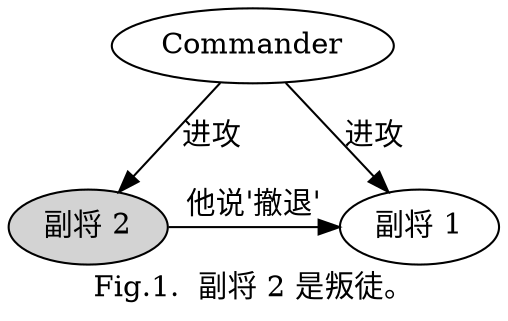
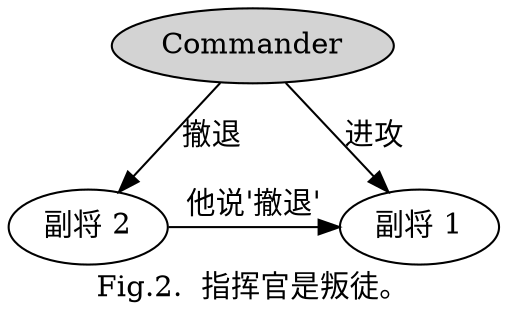
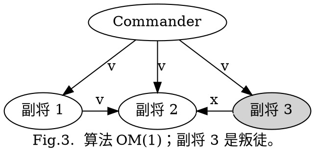
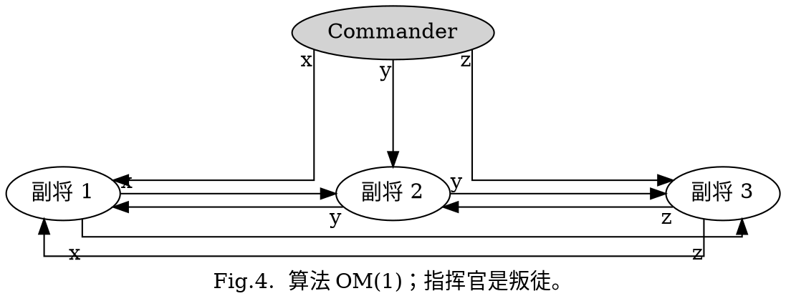
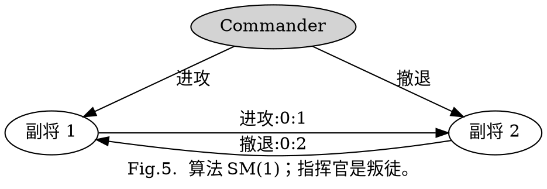

## Introduction

一个可靠的计算机系统必须能够应对一个或多个组件的故障。
故障组件可能表现出一种常被忽视的行为——即向系统的不同部分发送冲突信息。
应对这种故障的问题被抽象地表述为 **拜占庭将军问题**。

拜占庭将军问题看似简单。
仅使用口头消息，该问题有解当且仅当超过三分之二的将军是忠诚的；因此一个叛徒可以迷惑两个忠诚的将军。
特别地，只有三位将军时，在存在一个叛徒的情况下无法解决。
口头消息是指其内容完全由发送者控制的消息，因此叛徒发送者可以传输任何可能的消息。
这种消息对应于计算机通常相互发送的消息类型。

## Problem

假设拜占庭军队的几个师驻扎在敌城之外，每个师由自己的将军指挥。
将军们只能通过信使相互通信。
观察敌人后，他们必须商定一个共同的行动计划。
然而，有些将军可能是叛徒，试图阻止忠诚的将军达成一致。

将军们必须有一个算法来保证：

- **A. 所有忠诚的将军决定相同的行动计划。**

忠诚的将军将按照算法说的去做，但叛徒可以做任何他们想做的事。
无论叛徒做什么，算法都必须保证条件 A。
忠诚的将军不仅应达成一致，还应商定一个合理的计划。
因此，我们还希望确保：

- **B. 少数叛徒不能导致忠诚的将军采纳一个糟糕的计划。**

我们考虑将军们如何做决定。
每位将军观察敌人并将他的观察结果传达给其他人。令 v(i) 为第 i 位将军传达的信息。
每位将军使用某种方法将值 v(1).....v(n) 合并成一个单一的行动计划，其中 n 是将军的数量。
条件 A 通过让所有将军使用相同的方法合并信息来实现，条件 B 通过使用稳健的方法来实现。
例如，如果唯一要做的决定是进攻还是撤退，那么 v(i) 可以是将军 i 对哪个选项最好的意见，最终决定可以基于他们之间的多数投票。
少数叛徒只有在忠诚的将军几乎平均分为两种可能性时才能影响决定，在这种情况下，任何一个决定都不能被称为糟糕。

要满足条件 A，必须满足以下条件：

1. 对于每个 i（无论第 i 位将军是否忠诚），任意两位忠诚的将军使用相同的 v(i) 值。

因此，我们有以下对每个 i 的要求：

2. 如果第 i 位将军是忠诚的，那么他发送的值必须被每位忠诚的将军用作 v(i) 的值。

条件 1 和 2 都是关于第 i 位将军发送的单个值的条件。
因此，我们可以将问题限制在单个将军如何将其值发送给其他人。
我们将其表述为一位指挥将军向他的副将发送命令，得到以下问题。

**拜占庭将军问题。**

一位指挥将军必须向他的 n-1 位副将发送命令，使得：

- **IC1**。所有忠诚的副将遵守相同的命令。
- **IC2**。如果指挥将军是忠诚的，那么每位忠诚的副将遵守他发送的命令。

条件 IC1 和 IC2 被称为 *交互一致性* 条件。
注意，如果指挥官是忠诚的，那么 IC1 由 IC2 推导出来。然而，指挥官不一定是忠诚的。

为了解决我们最初的问题，第 i 位将军通过使用拜占庭将军问题的解决方案来发送命令"将 v(i) 作为我的值使用"，从而发送他的 v(i) 值，其他将军担任副将。

## Impossibility Results

我们现在展示，使用口头消息，对于三位将军，没有一个解决方案可以处理一个叛徒。
为简单起见，我们考虑唯一可能的决定是"进攻"或"撤退"的情况。

让我们首先检查图 1 所示的场景，其中指挥官是忠诚的并发送"进攻"命令，但
副将 2 是叛徒，他向副将 1 报告他收到了"撤退"命令。
为了满足 IC2，副将 1 必须遵守进攻的命令。

```dot
digraph {
    label="Fig.1.  副将 2 是叛徒。"
    Lieutenant1[label="副将 1"];
    Lieutenant2[label="副将 2"  style=filled];
    Commander -> Lieutenant1[label="进攻"];
    Commander -> Lieutenant2[label="进攻"];
    Lieutenant2 -> Lieutenant1[label="他说'撤退'"];
    {rank="same";Lieutenant1;Lieutenant2;}
}
```

考虑另一种场景，其中指挥官是叛徒，他向副将 1 发送"进攻"命令，向副将 2 发送"撤退"命令。
副将 1 不知道谁是叛徒，也无法判断指挥官实际向副将 2 发送了什么消息。

```dot
digraph {
    label="Fig.2.  指挥官是叛徒。"
    Commander[style=filled]
    Lieutenant1[label="副将 1"];
    Lieutenant2[label="副将 2"];
    Commander -> Lieutenant1[label="进攻"];
    Commander -> Lieutenant2[label="撤退"];
    Lieutenant2 -> Lieutenant1[label="他说'撤退'"];
    {rank="same";Lieutenant1;Lieutenant2;}
}
```

因此，这两张图中的场景对副将 1 来说看起来完全相同。
如果叛徒始终如一地撒谎，那么副将 1 无法区分这两种情况，因此他必须在两种情况下都服从"进攻"命令。
因此，每当副将 1 收到来自指挥官的"进攻"命令时，他必须服从。
类似的论证表明，如果副将 1 收到来自指挥官的"撤退"命令，那么即使副将 2 告诉他指挥官说了"进攻"，他也必须服从。

使用这个结果，我们可以证明没有少于 $3m + 1$ 位将军的解决方案可以应对 $m$ 个叛徒。

## Oral Message

我们首先精确说明我们所说的"口头消息"的含义。
每位将军应执行某种涉及向其他将军发送消息的算法，并且我们假设忠诚的将军正确执行其算法。

口头消息的定义体现在我们为将军的消息系统所做的以下假设中：

- **A1**。发送的每条消息都被正确传递。
- **A2**。消息的接收者知道谁发送了它。
- **A3**。可以检测到消息的缺失。

假设 A1 和 A2 防止叛徒干扰其他两位将军之间的通信，因为根据 A1，他无法干扰他们发送的消息，而且根据 A2，他无法通过引入虚假消息来混淆他们的交流。
假设 A3 将挫败试图通过不发送消息来阻止决定的叛徒。

叛徒指挥官可能决定不发送任何命令。
由于副将必须服从某个命令，他们需要在此情况下服从某个默认命令。
我们将 RETREAT 作为此默认命令。

我们归纳地定义 ***Oral Message 算法*** **OM(m)**，用于所有非负整数 m，通过该算法，指挥官向 n-1 位副将发送命令。
我们证明，在最多 m 个叛徒的情况下，OM(m) 为 $3m+1$ 或更多位将军解决了拜占庭将军问题。

该算法假设一个 majority 函数，其性质是，如果大多数值 $v_i$ 等于 $v$，则 majority($v_1,..., v_{n-1}$) 等于 $v$。（实际上，它假设这样一个函数序列——每个 n 对应一个。）
majority($v_1,..., v_{n-1}$) 的值有两个自然选择：

1. $v_i$ 中的多数值（如果存在），否则为 RETREAT；
2. $v_i$ 的中位数，假设它们来自一个有序集合。

算法 OM(0)。

1. 指挥官将他的值发送给每位副将。
2. 每位副将使用他从指挥官处收到的值，如果未收到值，则使用 RETREAT。

算法 OM(m)，m > 0。

1. 指挥官将他的值发送给每位副将。
2. 对于每个 i，令 $v_i$ 为副将 i 从指挥官处收到的值，如果未收到值，则为 RETREAT。
   副将 i 在算法 OM(m-1) 中担任指挥官，将值 vi 发送给其他 n-2 位副将。
3. 对于每个 i，以及每个 j != i，令 $v_j$ 为副将 i 在步骤 (2)（使用算法 OM(m-1)）中从副将 j 处收到的值，如果未收到这样的值，则为 RETREAT。
   副将 i 使用值 majority($v_1,..., v_{n-1}$)。

为了理解该算法的工作原理，我们考虑 m=1, n=4 的情况。

图 3 说明了当指挥官发送值 v 且副将 3 是叛徒时，副将 2 收到的消息。
在 OM(1) 的第一步中，指挥官将 v 发送给所有三位副将。
在第二步中，副将 1 使用简单算法 OM(0) 向副将 2 发送值 v。
同样在第二步中，叛徒副将 3 向副将 2 发送某个其他值 x。
在第三步中，副将 2 有 $v_1=v_2=v$ 且 $v_3=x$，因此他获得正确的值 v=majority(v, v, x)。

```dot
digraph {
    label="Fig.3.  算法 OM(1)；副将 3 是叛徒。"
    Lieutenant1[label="副将 1"];
    Lieutenant2[label="副将 2"];
    Lieutenant3[label="副将 3"  style=filled];
    Commander -> Lieutenant1[label="v"];
    Commander -> Lieutenant2[label="v"];
    Commander -> Lieutenant3[label="v"];
    {rank="same";Lieutenant1;Lieutenant2;Lieutenant3;}
    Lieutenant2 -> Lieutenant3[ color="white"];
    Lieutenant3 -> Lieutenant2[label="x"];
    Lieutenant1 -> Lieutenant2[label="v"];
}
```

图 4 显示了如果叛徒指挥官向三位副将发送三个任意值 x、y 和 z 时，副将收到的值。
每位副将在步骤 (3) 中获得 v1=x, v2=y 和 v3=z，因此他们都获得相同的值 majority(x, y, z)，无论三个值 x、y 和 z 是否相等。

```dot
digraph {
    label="Fig.4.  算法 OM(1)；指挥官是叛徒。"
    nodesep=2;
    ranksep=1;
    splines=ortho;
    Commander[style=filled]
    Lieutenant1[label="副将 1"];
    Lieutenant2[label="副将 2"];
    Lieutenant3[label="副将 3"];
    Commander -> Lieutenant1[taillabel="x"];
    Commander -> Lieutenant2[taillabel="y"];
    Commander -> Lieutenant3[taillabel="z"];
    {rank="same";Lieutenant1;Lieutenant2;Lieutenant3;}
    Lieutenant2 -> Lieutenant3[taillabel="y"];
    Lieutenant2 -> Lieutenant1[taillabel="y"];
    Lieutenant3 -> Lieutenant1[taillabel="\nz"];
    Lieutenant3 -> Lieutenant2[taillabel="z"];
    Lieutenant1 -> Lieutenant2[taillabel="x"];
    Lieutenant1 -> Lieutenant3[taillabel="\nx"];
}
```

递归算法 OM(m) 调用 n-1 个单独的 OM(m-1) 算法执行，每个又调用 n-2 个 OM(m-2) 执行，依此类推。
这意味着，对于 m>1，一位副将向其他每位副将发送许多单独的消息。
必须有某种方法来区分这些不同的消息。
读者可以验证，如果每位副将 i 在步骤 (2) 中发送的值 vi 前加上数字 i，则所有歧义都被消除。
随着递归的"展开"，算法 OM(m-k) 将被调用 (n-1)...(n-k) 次，以发送前面带有 k 个副将编号序列的值。

## Sign Message

使用不可伪造的书面消息，问题对于任意数量的将军和可能的叛徒都是可解的。
如果我们能够限制这种能力，问题就变得更容易解决。一种方法是允许将军发送不可伪造的签名消息。

更准确地说，我们对 A1-A3 添加以下假设 (**A4**)：

- (a) 忠诚将军的签名不能被伪造，并且其签名消息内容的任何更改都能被检测到。
- (b) 任何人都可以验证将军签名的真实性。

注意，我们对叛徒将军的签名不做任何假设。
特别地，我们允许他的签名被另一个叛徒伪造，从而允许叛徒之间串通。

既然我们引入了签名消息，我们之前关于需要四位将军来应对一个叛徒的论证不再成立。
事实上，三位将军的解决方案确实存在。

算法 SM(m)。
初始 $V_i = \emptyset$。

1. 指挥官签名并将他的值发送给每位副将。
2. 对于每个 i：
   1. 如果副将 i 收到来自指挥官的 $v:0$ 形式的消息，并且他尚未收到任何命令，则
      1. 他令 $V_i$ 等于 $\{v\}$；
      2. 他将消息 $v:0:i$ 发送给其他每位副将。
   2. 如果副将 i 收到 $v:0:j_1:...:j_k$ 形式的消息，且 v 不在集合 $V_i$ 中，则
      1. 他将 v 添加到 $V_i$；
      2. 如果 k < m，则他将消息 $v:0:j_1:...:j_k:i$ 发送给除 $j_1:...:j_k$ 之外的每位副将。
3. 对于每个 i：当副将 i 将不再收到消息时，他执行命令 choice($V_i$)。

注意，在步骤 (2) 中，副将 i 忽略任何包含已在集合 $V_i$ 中的命令 v 的消息。

```dot
digraph {
    nodesep=2;
    label="Fig.5.  算法 SM(1)；指挥官是叛徒。"
    Commander[style=filled]
    Lieutenant1[label="副将 1"];
    Lieutenant2[label="副将 2"];
    Commander -> Lieutenant1[label="进攻"];
    Commander -> Lieutenant2[label="撤退"];
    Lieutenant1 -> Lieutenant2[label="进攻:0:1"];
    Lieutenant2 -> Lieutenant1[label="撤退:0:2"];
    {rank="same";Lieutenant1;Lieutenant2;}
}
```

图 5 说明了在三位将军且指挥官是叛徒的情况下，算法 SM(1) 的执行过程。
指挥官向一位副将发送"进攻"命令，向另一位发送"撤退"命令。
两位副将在步骤 (2) 中都收到两个命令，因此在步骤 (2) 之后 V1 = V2 = {"attack", "retreat"}，并且他们都执行命令 choice({"attack", "retreat"})。
注意，与图 2 中的情况不同，此处副将知道指挥官是叛徒，因为他的签名出现在两个不同的命令上，而 A4 指出只有他才能生成这些签名。

在算法 SM(m) 中，副将签名以确认收到命令。
如果他是第 m 个在命令上添加签名的副将，则该签名不会被其接收者转发给其他人，因此它是多余的。（更准确地说，假设 A2 使其成为不必要的。）
特别地，副将在 SM(1) 中不需要签名其消息。

## Missing Communication Paths

## Summary

我们提出了拜占庭将军问题的几种解决方案。
这些解决方案在所需的时间和消息数量上都是昂贵的。
算法 OM(m) 和 SM(m) 都需要长度最多为 $m+1$ 的消息路径。
换句话说，每位副将可能需要等待最初由指挥官发出、然后经由 m 位其他副将转发的消息。
对于不完全连接的图，需要长度为 $m+d$ 的消息路径，其中 d 是忠诚将军子图的直径。

算法 OM(m) 和 SM(m) 涉及发送多达 (n-1)(n-2)...(n-m-1) 条消息。
通过合并消息，肯定可以减少所需的单独消息数量。
也可能减少传输的信息量。
然而，我们预计仍然需要大量消息。

在任意故障面前实现可靠性是一个困难的问题，其解决方案本质上似乎是昂贵的。
降低成本的唯一方法是对可能发生的故障类型做出假设。
例如，通常假设计算机可能无法响应，但永远不会错误地响应。
然而，当需要极高的可靠性时，不能做出这样的假设，并且需要拜占庭将军解决方案的全部代价。

## Links

- [Distributed Systems](/docs/CS/Distributed/Distributed)

## References

1. [The Byzantine Generals Problem](http://lamport.azurewebsites.net/pubs/byz.pdf)
2. [Practical Byzantine Fault Tolerance](https://www.scs.stanford.edu/nyu/03sp/sched/bfs.pdf)
3. [On Optimal Probabilistic Asynchronous Byzantine Agreement](https://people.csail.mit.edu/silvio/Selected%20Scientific%20Papers/Distributed%20Computation/An%20Optimal%20Probabilistic%20Algorithm%20for%20Byzantine%20Agreement.pdf)
4. [The Byzantine Generals Problem](https://www.drdobbs.com/cpp/the-byzantine-generals-problem/206904396)
5. [A Comparison of the Byzantine Agreement Problem and the Transaction Commit Problem](http://jimgray.azurewebsites.net/papers/tandemtr88.6_comparisonofbyzantineagreementandtwophasecommit.pdf)
