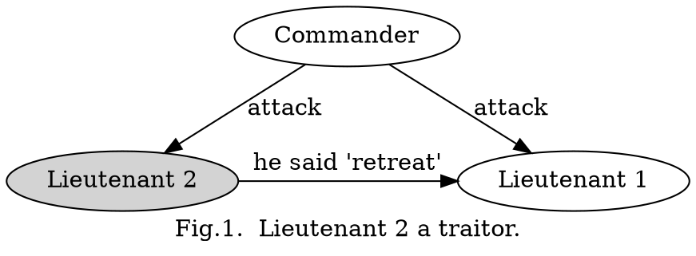
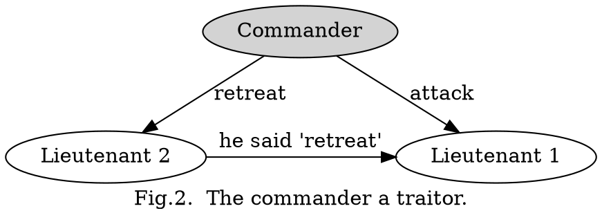
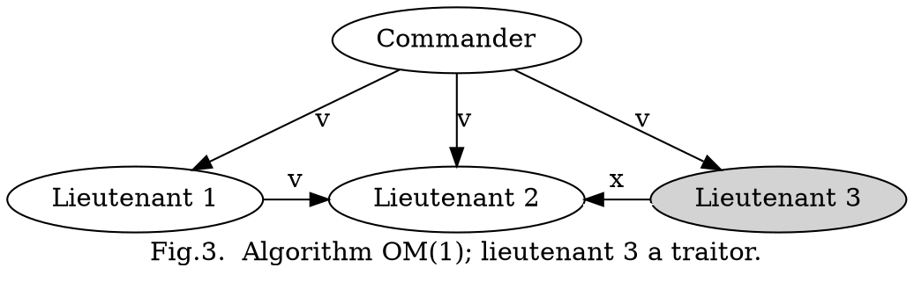
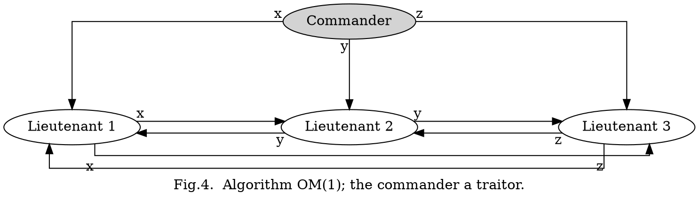
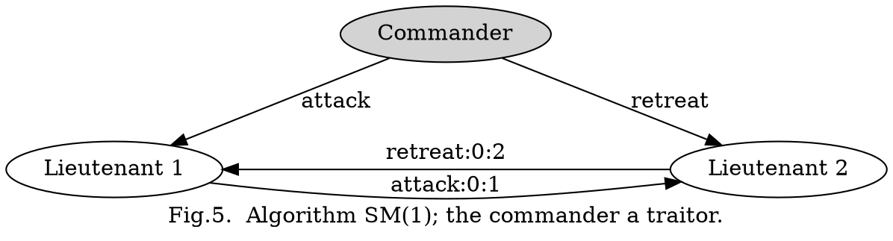

## Introduction

一个可靠的计算机系统必须能够应对其一个或多个组件的失效。
一个失效的组件可能表现出一种常被忽视的行为——即向系统的不同部分发送相互矛盾的信息。
应对这类失效的问题被抽象表达为**拜占庭将军问题（Byzantine Generals Problem）**。

拜占庭将军问题看似简单，实则不然。仅使用口头消息（oral messages）时，该问题有解当且仅当超过三分之二的将军是忠诚的；因此单个叛徒就能扰乱两名忠诚将军。特别地，在只有三名将军时，只要存在一名叛徒，任何方案都无法奏效。口头消息是指其内容完全由发送者控制的消息，因此叛徒发送者可以传输任何可能的消息。这类消息对应于计算机之间通常互相发送的消息类型。

## 问题（Problem）

设想拜占庭军队的若干支分队驻扎在一座敌城之外，每支分队由各自的将军指挥。将军之间只能通过信使通信。观察敌情后，他们必须就一个统一的行动计划达成一致。然而，部分将军可能是叛徒，试图阻止忠诚将军达成一致。

将军们必须有一个算法来保证：

- **A. 所有忠诚将军就同一行动计划做出决策。**

忠诚将军都会执行算法要求他们做的事，而叛徒可以为所欲为。无论叛徒怎么做，算法都必须保证条件 A。忠诚将军不仅应达成一致，还应就一个合理的计划达成一致。因此我们还希望确保：

- **B. 少量叛徒无法使忠诚将军采纳一个糟糕的计划。**

我们考虑将军们如何做出决策。每位将军观察敌情并将自己的观察传达给他人。令 v(i) 为第 i 位将军传达的信息。每位将军使用某种方法将数值 v(1).....v(n) 合成为单一行动计划，其中 n 为将军人数。条件 A 通过让所有将军使用相同的合成方法来实现，条件 B 通过使用稳健的方法来实现。例如，若唯一要做的决策是进攻还是撤退，则 v(i) 可以是将军 i 关于哪个选择更佳的意见，最终决策可基于他们之间的多数投票。只有当忠诚将军在两可之间几乎均分时，少量叛徒才能影响决策，而那种情况下两种决策都不能算糟糕。

为使条件 A 成立，必须满足：

1. 对每 i（无论第 i 位将军是否忠诚），任意两名忠诚将军使用相同的 v(i) 值。

由此，我们对每个 i 有如下要求：

2. 若第 i 位将军忠诚，则他发送的值必须被每位忠诚将军作为 v(i) 的值使用。

条件 1 与条件 2 都是关于第 i 位将军发送的单个值的约束。因此我们只需考虑一名将军如何将其值发送给其他人的问题。我们将其表述为一名司令将军向他的副官们发送命令，得到如下问题。

**拜占庭将军问题。**

一名司令将军必须向他的 n - 1 名副官发送一条命令，使得：

- **IC1**。所有忠诚副官服从同一条命令。
- **IC2**。若司令将军忠诚，则每位忠诚副官服从他发送的命令。

条件 IC1 与 IC2 被称为*交互一致性（interactive consistency）*条件。注意，若司令忠诚，则 IC1 由 IC2 推出。然而，司令未必忠诚。

为解决原问题，第 i 位将军借助拜占庭将军问题的解来发送命令“用 v(i) 作为我的取值”，其他将军则充当副官。

## 不可能性结果（Impossibility Results）

现在证明：在口头消息下，三名将军的方案无法应对一名叛徒。为简便，我们考虑唯一可能的决策是“进攻”或“撤退”的情况。

先考察图 1 所示场景：司令忠诚并发送“进攻”命令，但副官 2 是叛徒，向副官 1 谎称自己收到“撤退”命令。为满足 IC2，副官 1 必须服从进攻命令。

```dot
digraph {
    label="Fig.1.  Lieutenant 2 a traitor."
    Lieutenant1[label="Lieutenant 1"];
    Lieutenant2[label="Lieutenant 2"  style=filled];
    Commander -> Lieutenant1[label="attack"];
    Commander -> Lieutenant2[label="attack"];
    Lieutenant2 -> Lieutenant1[label="he said 'retreat'"];
    {rank="same";Lieutenant1;Lieutenant2;}
}
```

再考虑另一场景：司令是叛徒，向副官 1 发送“进攻”命令，向副官 2 发送“撤退”命令。副官 1 不知道谁是叛徒，也无法判断司令实际向副官 2 发送了什么消息。

```dot
digraph {
    label="Fig.2.  The commander a traitor."
    Commander[style=filled]
    Lieutenant1[label="Lieutenant 1"];
    Lieutenant2[label="Lieutenant 2"];
    Commander -> Lieutenant1[label="attack"];
    Commander -> Lieutenant2[label="retreat"];
    Lieutenant2 -> Lieutenant1[label="he said 'retreat'"];
    {rank="same";Lieutenant1;Lieutenant2;}
}
```

因此，这两幅图对副官 1 而言看起来完全相同。若叛徒始终如一地撒谎，副官 1 无法区分这两种情况，因此在两种情况下都必须服从“进攻”命令。于是，只要副官 1 从司令那里收到“进攻”命令，他就必须服从。类似论证表明，若副官 1 从司令收到“撤退”命令，即便副官 2 告诉他司令说了“进攻”，他也必须服从。

利用这一结论，可以证明少于 $3m + 1$ 名将军的方案无法应对 $m$ 名叛徒。

## 口头消息（Oral Message）

我们首先精确说明“口头消息”的含义。每位将军应执行某种涉及向其他将军发送消息的算法，并假设忠诚将军正确执行其算法。

口头消息的定义体现在我们对将军消息系统所做的如下假设中：

- **A1**。发送的每个消息都被正确投递。
- **A2**。消息的接收者知道发送者是谁。
- **A3**。消息的缺失可以被检测到。

假设 A1 与 A2 阻止叛徒干扰另外两名将军之间的通信，因为依据 A1 他无法干扰他们实际发送的消息，依据 A2 他无法通过伪造消息来混淆他们的交流。假设 A3 会挫败那些试图通过干脆不发消息来阻止决策的叛徒。

叛徒司令可能决定不发送任何命令。由于副官必须服从某条命令，他们需要在此情况下的默认命令。我们令 RETREAT（撤退）作为该默认命令。

我们归纳地定义***口头消息算法*** **OM(m)**（对所有非负整数 m），由司令借此向 n - 1 名副官发送命令。我们证明 OM(m) 在至多 m 名叛徒、且将军数不少于 $3m + 1$ 时，能解决拜占庭将军问题。

算法假设一个 majority 函数，满足：若 $v_i$ 中的*多数*等于 $v$，则 majority($v_1,..., v_{n-1}$) 等于 $v$。（实际上它假设这样一组函数——每个 n 对应一个。）majority($v_1,..., v_{n-1}$) 的取值有两种自然选择：

1. 若 $v_i$ 中存在多数取值，则取该多数值，否则取 RETREAT；
2. $v_i$ 的中位数，假设它们来自一个有序集合。

Algorithm OM(0).

1. 司令将他的取值发送给每位副官。
2. 每位副官使用从司令处收到的值；若未收到任何值，则使用 RETREAT。

Algorithm OM(m)，m > 0。

1. 司令将他的取值发送给每位副官。
2. 对每个 i，令 $v_i$ 为副官 i 从司令处收到的值，若未收到则取 RETREAT。副官 i 在算法 OM(m - 1) 中充当司令，将值 $v_i$ 发送给其余 n - 2 名副官。
3. 对每个 i 及每个 j ≠ i，令 $v_j$ 为副官 i 在步骤(2)（使用算法 OM(m - 1)）中从副官 j 收到的值，若未收到则取 RETREAT。副官 i 使用值 majority($v_1,..., v_{n-1}$)。

为理解算法如何工作，考虑 m = 1, n = 4 的情况。图 3 展示了当司令发送值 v、副官 3 是叛徒时，副官 2 收到的消息。在 OM(1) 的第一步，司令将 v 发送给全部三名副官。在第二步，副官 1 使用平凡算法 OM(0) 将值 v 发送给副官 2。同样在第二步，叛徒副官 3 向副官 2 发送了某个其他值 x。在第三步，副官 2 得到 $v_1 = v_2 = v$ 与 $v_3 = x$，因此得到正确值 v = majority(v, v, x)。

```dot
digraph {
    label="Fig.3.  Algorithm OM(1); lieutenant 3 a traitor."
  
    Lieutenant1[label="Lieutenant 1"];
    Lieutenant2[label="Lieutenant 2"];
    Lieutenant3[label="Lieutenant 3"  style=filled];
  
    Commander -> Lieutenant1[label="v"];
    Commander -> Lieutenant2[label="v"];
    Commander -> Lieutenant3[label="v"];
  
    {rank="same";Lieutenant1;Lieutenant2;Lieutenant3;}
  
    Lieutenant2 -> Lieutenant3[ color="white"];
    Lieutenant3 -> Lieutenant2[label="x"];
    Lieutenant1 -> Lieutenant2[label="v"];
}
```

图 4 展示了若叛徒司令向三名副官发送三个任意值 x、y、z 时，副官们收到的值。每位副官得到 $v_1 = x$、$v_2 = y$、$v_3 = z$，因此在步骤(3)中他们都得到相同值 majority(x, y, z)，无论 x、y、z 三者是否有相等者。

```dot
digraph {
    label="Fig.4.  Algorithm OM(1); the commander a traitor."
    nodesep=2;
    ranksep=1;
    splines=ortho;
  
    Commander[style=filled]
    Lieutenant1[label="Lieutenant 1"];
    Lieutenant2[label="Lieutenant 2"];
    Lieutenant3[label="Lieutenant 3"];
  
    Commander -> Lieutenant1[taillabel="x"];
    Commander -> Lieutenant2[taillabel="y"];
    Commander -> Lieutenant3[taillabel="z"];
  
    {rank="same";Lieutenant1;Lieutenant2;Lieutenant3;}
  
    Lieutenant2 -> Lieutenant3[taillabel="y"];
    Lieutenant2 -> Lieutenant1[taillabel="y"];
    Lieutenant3 -> Lieutenant1[taillabel="\nz"];
    Lieutenant3 -> Lieutenant2[taillabel="z"];
    Lieutenant1 -> Lieutenant2[taillabel="x"];
    Lieutenant1 -> Lieutenant3[taillabel="\nx"];
  
}
```

递归算法 OM(m) 会调用 n - 1 次独立的 OM(m - 1) 执行，而每次又调用 n - 2 次 OM(m - 2) 执行，依此类推。这意味着，当 m > 1 时，一名副官要向其他每位副官发送许多独立的消息。必须有某种方式区分这些不同的消息。读者可以验证：若每位副官 i 在步骤(2)发送的值 $v_i$ 前加上序号 i，则所有歧义都被消除。随着递归“展开”，算法 OM(m - k) 会被调用 (n - 1) ... (n - k) 次，以发送带有 k 名副官序号前缀的值。

## 签名消息（Sign Message）

借助不可伪造的书面消息，该问题对任意数量的将军与可能的叛徒都可解。若能限制这种能力，问题会更容易解决。一种方式是允许将军发送不可伪造的签名消息。

更准确地说，我们在 A1-A3 之外增加如下假设（**A4**）：

- (a) 忠诚将军的签名无法被伪造，且其签名消息内容的任何篡改都能被检测到。
- (b) 任何人都能验证将军签名的真实性。

注意，我们对叛徒将军的签名不做任何假设。特别地，我们允许其签名被另一名叛徒伪造，从而容许叛徒之间的串通。

既然引入了签名消息，先前“需要四名将军才能应对一名叛徒”的论证不再成立。事实上，确实存在三名将军的解。

Algorithm SM(m)。初始时 $V_i = \emptyset$。

1. 司令对取值签名并发送给每位副官。
2. 对每个 i：
   1. 若副官 i 从司令处收到形如 $v:0$ 的消息且尚未收到任何命令，则
      1. 令 $V_i = \{v\}$；
      2. 将消息 $v:0:i$ 发送给其他每位副官。
   2. 若副官 i 收到形如 $v:0:j_1:...:j_k$ 的消息且 v 不在集合 $V_i$ 中，则
      1. 将 v 加入 $V_i$；
      2. 若 k < m，则将消息 $v:0:j_1:...:j_k:i$ 发送给除 $j_1:...:j_k$ 外的每位副官。
3. 对每个 i：当副官 i 不会再收到更多消息时，他服从命令 choice($V_i$)。

注意，在步骤(2)中，副官 i 会忽略任何包含已在集合 $V_i$ 中的命令 v 的消息。

```dot
digraph {
    nodesep=2;
    label="Fig.5.  Algorithm SM(1); the commander a traitor."
    Commander[style=filled]
    Lieutenant1[label="Lieutenant 1"];
    Lieutenant2[label="Lieutenant 2"];
    Commander -> Lieutenant1[label="attack"];
    Commander -> Lieutenant2[label="retreat"];
    Lieutenant1 -> Lieutenant2[label="attack:0:1"];
    Lieutenant2 -> Lieutenant1[label="retreat:0:2"];
    {rank="same";Lieutenant1;Lieutenant2;}
}
```

图 5 展示了在司令是叛徒、共三名将军时算法 SM(1) 的情形。司令向一名副官发送“进攻”命令，向另一名发送“撤退”命令。两名副官在步骤(2)都收到了这两条命令，因此步骤(2)后 $V_1 = V_2 = \{\text{attack}, \text{retreat}\}$，他们都服从命令 choice($\{\text{attack}, \text{retreat}\}$)。注意，与图 2 不同，此处副官知道司令是叛徒，因为他的签名出现在两条不同的命令上，而 A4 表明只有他才能生成那些签名。

在算法 SM(m) 中，副官签名以确认收到命令。若他是最后一个在命令上添加签名的副官，则该签名不会被其接收者转发给任何人，故属多余。（更准确地说，假设 A2 使其不必要。）特别地，在 SM(1) 中副官无需对消息签名。

## 缺失的通信路径（Missing Communication Paths）

## 总结（Summary）

我们给出了拜占庭将军问题的若干解。这些解在所需时间与消息数量上都很昂贵。算法 OM(m) 与 SM(m) 都需要长度至多为 $m + 1$ 的消息路径。换言之，每名副官可能要等待源自司令、并经 m 名其他副官中转的消息。对于不完全连通的图，需要长度为 $m + d$ 的消息路径，其中 d 为忠诚将军子图的直径。

算法 OM(m) 与 SM(m) 涉及发送至多 (n - 1)(n - 2) ... (n - m - 1) 条消息。所需独立消息数当然可通过合并消息来减少。也可能减少传输的信息量。然而，我们预计仍需要大量消息。

在面对任意故障时实现可靠性是个难题，其解似乎 inherently 昂贵。降低成本的唯一途径是对可能发生的故障类型做出假设。例如，常假设计算机可能不响应，但绝不会错误地响应。然而，在要求极高可靠性时，这类假设不能成立，必须付出拜占庭将军解的完整代价。

## Links

- [Distributed Systems](/docs/CS/Distributed/Distributed.md)
- [PBFT](/docs/CS/Distributed/Consensus/PBFT.md) — 实用拜占庭容错协议
- [PoW](/docs/CS/Distributed/Consensus/PoW.md) — 开放网络中的拜占庭共识
- [Consensus](/docs/CS/Distributed/Consensus/Consensus.md)

## References

1. [The Byzantine Generals Problem](http://lamport.azurewebsites.net/pubs/byz.pdf)
2. [Practical Byzantine Fault Tolerance](https://www.scs.stanford.edu/nyu/03sp/sched/bfs.pdf)
3. [On Optimal Probabilistic Asynchronous Byzantine Agreement](https://people.csail.mit.edu/silvio/Selected%20Scientific%20Papers/Distributed%20Computation/An%20Optimal%20Probabilistic%20Algorithm%20for%20Byzantine%20Agreement.pdf)
4. [The Byzantine Generals Problem](https://www.drdobbs.com/cpp/the-byzantine-generals-problem/206904396)
5. [A Comparison of the Byzantine Agreement Problem and the Transaction Commit Problem](http://jimgray.azurewebsites.net/papers/tandemtr88.6_comparisonofbyzantineagreementandtwophasecommit.pdf)
