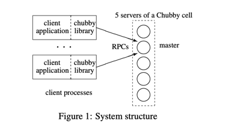

## Introduction

Chubby provide *coarse-grained* locking as well as reliable storage for a *loosely-coupled* distributed system.
Chubby provides an interface much like a distributed file system with advisory locks, but the design emphasis is on availability and reliability, as opposed to high performance.

Google File System uses a Chubby lock to appoint a GFS master server, and Bigtable uses Chubby in several ways: to elect a master, to allow the master to discover the servers it controls, and to permit clients to find the master.
In addition, both GFS and Bigtable use Chubby as a well-known and available location to store a small amount of meta-data; in effect they use Chubby as the root of their distributed data structures.

Asynchronous consensus is solved by the [Paxos](/docs/CS/Distributed/Paxos.md) protocol.

## Design

- Chose a lock service, as opposed to a library or service for consensus.
- Chose to **serve small-files** to permit elected primaries to advertise themselves and their parameters, rather than build and maintain a second service.
- A service advertising its primary via a Chubby file may have thousands of clients. Therefore, they must allow thousands of clients to observe this file, preferably without needing many servers.
- Clients and replicas of a replicated service may wish to know when the service’s primary changes. This suggests that an event notification mechanism would be useful to avoid polling.
- Even if clients need not poll files periodically, many will; this is a consequence of supporting many developers. Thus, caching of files is desirable.
- Developers are confused by non-intuitive caching semantics, so they prefer **consistent caching**.
- To avoid both financial loss and jail time, we provide security mechanisms, including **access control**.
- A choice that may surprise some readers is that they do not expect lock use to be fine-grained, in which they might be held only for a short duration (seconds or less); instead, they expect coarse-grained use.
  Coarse-grained locks impose far less load on the lock server.
  In particular, the lock-acquisition rate is usually only weakly related to the transaction rate of the client applications.

The *fine-grained* lock might be held only for a short duration (seconds or less).
The *coarse-grained* lock might be held for a considerable time, perhaps hours or days.

Coarse-grained locks impose far less load on the lock server.
In particular, the lock-acquisition rate is usually only weakly related to the transaction rate of the client applications.
Coarse-grained locks are acquired only rarely, so temporary lock server unavailability delays clients less.
On the other hand, the transfer of a lock from client to client may require costly recovery procedures, so one would not wish a fail-over of a lock server to cause locks to be lost.
Thus, it is good for coarsegrained locks to survive lock server failures, there is little concern about the overhead of doing so, and such locks allow many clients to be adequately served by a modest number of lock servers with somewhat lower availability.

Fine-grained locks lead to different conclusions.
Even brief unavailability of the lock server may cause many clients to stall.
Performance and the ability to add new servers at will are of great concern because the transaction rate at the lock service grows with the combined transaction rate of clients.
It can be advantageous to reduce the overhead of locking by not maintaining locks across lock server failure, and the time penalty for dropping locks every so often is not severe because locks are held for short periods.
(Clients must be prepared to lose locks during network partitions, so the loss of locks on lock server fail-over introduces no new recovery paths.)

## System structure

Chubby has two main components that communicate via RPC: a server, and a library that client applications link against; see Figure 1.
All communication between Chubby clients and the servers is mediated by the client library.

A Chubby cell consists of a small set of servers (typically five) known as replicas, placed so as to reduce the likelihood of correlated failure (for example, in different racks).
The replicas use a distributed consensus protocol to elect a master; the master must obtain votes from a majority of the replicas, plus promises that those replicas will not elect a different master for an interval of a few seconds known as the master lease.
The master lease is periodically renewed by the replicas provided the master continues to win a majority of the vote.

The replicas maintain copies of a simple database, but **only the master initiates reads and writes of this database**.
All other replicas simply copy updates from the master, sent using the consensus protocol.

Write requests are propagated via the consensus protocol to all replicas; such requests are acknowledged when the write has reached a majority of the replicas in the cell.
Read requests are satisfied by the master alone; this is safe provided the master lease has not expired, as no other master can possibly exist.

Clients find the master by sending master location requests to the replicas listed in the DNS.
Non-master replicas respond to such requests by returning the identity of the master

If a master fails, the other replicas run the election protocol when their master leases expire; a new master will typically be elected in a few seconds.

If a replica fails and does not recover for a few hours, a simple replacement system selects a fresh machine from a free pool and starts the lock server binary on it.
It then updates the DNS tables, replacing the IP address of the failed replica with that of the new one. The current master polls the DNS periodically and eventually notices the change.
It then updates the list of the cell’s members in the cell’s database; this list is kept consistent across all the members via the normal replication protocol.
In the meantime, the new replica obtains a recent copy of the database from a combination of backups stored on file servers and updates from active replicas.
Once the new replica has processed a request that the current master is waiting to commit, the replica is permitted to vote in the elections for new master.

Chubby exports a file system interface similar to, but simpler than that of UNIX.

Each Chubby file and directory can act as a reader-writer lock: either one client handle may hold the lock in exclusive (writer) mode, or any number of client handles may hold the lock in shared (reader) mode.
Like the mutexes known to most programmers, locks are *advisory*.

In Chubby, acquiring a lock in either mode requires write permission so that an unprivileged reader cannot prevent a writer from making progress.
Events are delivered after the corresponding action has taken place.
Thus, if a client is informed that file contents have changed, it is guaranteed to see the new data (or data that is yet more recent) if it subsequently reads the file.

## Events

Chubby clients may subscribe to a range of events when they create a handle.
These events are delivered to the client asynchronously via an up-call from the Chubby library

## Caching

To reduce read traffic, Chubby clients cache file data and node meta-data (including file absence) in a consistent, write-through cache held in memory.
The cache is maintained by a lease mechanism described below, and kept consistent by invalidations sent by the master, which keeps a list of what each client may be caching.
The protocol ensures that clients see either a consistent view of Chubby state, or an error.

- Since all requests go through the master, caching is done to alleviate this load.
- The caches at each client are right through and the caches at all clients are kept consistent.
- All caches are maintained only till the “lease period”.

When file data or meta-data is to be changed, the modification is blocked while the master sends invalidations for the data to every client that may have cached it; this mechanism sits on top of KeepAlive RPCs.

The caching protocol is simple: it invalidates cached data on a change, and never updates it.

Clients see a Chubby handle as a pointer to an opaque structure that supports various operations.
Handles are created only by Open(), and destroyed with Close().

## KeepAlive

A Chubby session is a relationship between a Chubby cell and a Chubby client; it exists for some interval of time, and is maintained by periodic handshakes called KeepAlives.
Unless a Chubby client informs the master otherwise, the client’s handles, locks, and cached data all remain valid provided its session remains valid.

A client requests a new session on first contacting the master of a Chubby cell.
It ends the session explicitly either when it terminates, or if the session has been idle(with no open handles and no calls for a minute).

Each session has an associated lease—an interval of time extending into the future during which the master guarantees not to terminate the session unilaterally.
The end of this interval is called the session lease timeout.
The master is free to advance this timeout further into the future, but may not move it backwards in time.

The master advances the lease timeout in three circumstances: on creation of the session, when a master fail-over occurs (see below), and when it responds to a KeepAlive RPC from the client.

As well as extending the client’s lease, the KeepAlive reply is used to transmit events and cache invalidations back to the client. The master allows a KeepAlive to return early when an event or invalidation is to be delivered.

TCP’s back off policies pay no attention to higher-level timeouts such as Chubby leases, so TCP-based KeepAlives led to many lost sessions at times of high network congestion.
We were forced to send KeepAlive RPCs via UDP rather than TCP; UDP has no congestion avoidance mechanisms, so we would prefer to use UDP only when high-level timebounds must be met.

## Failover

When a master fails or otherwise loses mastership, it discards its in-memory state about sessions, handles, and locks.
The authoritative timer for session leases runs at the master, so until a new master is elected the session lease timer is stopped; this is legal because it is equivalent to extending the client’s lease. 
If a master election occurs quickly, clients can contact the new master before their local (approximate) lease timers expire. 
If the election takes a long time, clients flush their caches and wait for the grace period while trying to find the new master.
Thus the grace period allows sessions to be maintained across fail-overs that exceed the normal lease timeout.

During this period, the client cannot be sure whether its lease has expired at the master. 
It does not tear down its session, but it blocks all application calls on its API to prevent the application from observing inconsistent data.
At the start of the grace period, the Chubby library sends a jeopardy event to the application to allow it to quiesce itself until it can be sure of the status of its session.

Once a client has contacted the new master, the client library and master co-operate to provide the illusion to the application that no failure has occurred.

## Backup

Because Chubby does not use path-based permissions, a single lookup in the database suffices for each file access.
Every few hours, the master of each Chubby cell writes a snapshot of its database to a GFS file server in a different building.
The use of a separate building ensures both that the backup will survive building damage, and that the backups introduce no cyclic dependencies in the system; a GFS cell in the same building potentially might rely on the Chubby cell for electing its master.

Backups provide both disaster recovery and a means for initializing the database of a newly replaced replica without placing load on replicas that are in service.

Chubby allows a collection of files to be mirrored from one cell to another.
Mirroring is fast because the files are small and the event mechanism informs the mirroring code immediately if a file is added, deleted, or modified.
Provided there are no network problems, changes are reflected in dozens of mirrors world-wide in well under a second.
If a mirror is unreachable, it remains unchanged until connectivity is restored.
Updated files are then identified by comparing their checksums.

Mirroring is used most commonly to copy configuration files to various computing clusters distributed around the world.

## Scaling

Two familiar mechanisms, proxies and partitioning, that they expect will allow Chubby to scale further.

## Links

- [Distributed Systems](/docs/CS/Distributed/Distributed_Systems.md)
- [Paxos](/docs/CS/Distributed/Paxos.md)

## References

1. [The Chubby lock service for loosely-coupled distributed systems](https://www.usenix.org/legacy/event/osdi06/tech/full_papers/burrows/burrows.pdf)
2. [Reiew of Paxos Made Simple and The Chubby Lock Service for Loosely-Coupled Distributed Systems](https://www.cs.colostate.edu/~cs670/CR7_AndyStone_PaxosChubby.pdf)
