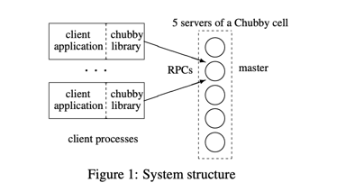

## Introduction

Chubby 为松耦合分布式系统提供粗粒度锁以及可靠的存储。
Chubby 的接口非常类似于带有 advisory lock 的分布式文件系统，但设计重点是可性和可靠性，而非高性能。

[Google File System](/docs/CS/Distributed/GFS.md) 使用 Chubby 锁来指定 GFS master 服务器，
Bigtable 以多种方式使用 Chubby：选举 master、让 master 发现其控制的服务器，以及允许客户端找到 master。
此外，GFS 和 Bigtable 都使用 Chubby 作为众所周知且可用的位置来存储少量元数据；
实际上，它们将 Chubby 用作其分布式数据结构的根。

异步共识由 [Paxos](/docs/CS/Distributed/Consensus/Paxos.md) 协议解决。

## Design

- 选择锁服务，而非基于共识的库或服务。
- 选择**提供小文件服务**，以允许被选出的主节点通告自身及其参数，而非构建和维护第二个服务。
- 一个通过 Chubby 文件通告其主节点的服务可能有数千个客户端。因此，它们必须允许数千个客户端观察此文件，最好不需要许多服务器。
- 复制服务的客户端和副本可能希望知道服务主节点何时发生变化。这表明事件通知机制对于避免轮询很有用。
- 即使客户端不需要定期轮询文件，许多客户端也会这样做；这是支持众多开发者的结果。因此，文件的缓存是可取的。
- 开发者对非直观的缓存语义感到困惑，因此他们更喜欢**一致性缓存**。
- 为了避免经济损失和法律责任，我们提供了安全机制，包括**访问控制**。
- 一个可能让一些读者感到惊讶的选择是，他们不期望锁的使用是细粒度的（即锁可能只持有很短的时间，几秒或更少）；相反，他们期望粗粒度的使用。
  粗粒度锁对锁服务器施加的负载要小得多。
  特别是，锁的获取速率通常仅与客户端应用程序的事务速率弱相关。

**细粒度锁**可能只持有很短的时间（几秒或更少）。
**粗粒度锁**可能持有相当长的时间，也许是几小时或几天。

粗粒度锁对锁服务器施加的负载要小得多。
特别是，锁的获取速率通常仅与客户端应用程序的事务速率弱相关。
粗粒度锁很少被获取，因此临时的锁服务器不可用对客户端的延迟影响较小。
另一方面，锁在客户端之间的转移可能需要昂贵的恢复过程，因此不希望锁服务器故障转移导致锁丢失。
因此，粗粒度锁最好能在锁服务器故障后继续存在，这样做开销的担忧很小，并且此类锁允许数量适中的锁服务器以较低的可用性为大量客户端提供充分服务。

细粒度锁会导致不同的结论。
即使锁服务器短暂不可用也可能导致许多客户端停滞。
性能和按需添加新服务器的能力非常重要，因为锁服务处的事务速率随客户端的总事务速率增长。
通过不在锁服务器故障后维护锁来减少锁的开销是有利的，并且由于锁持有时间短，偶尔丢失锁的时间惩罚并不严重。
（客户端必须做好在网络分区期间丢失锁的准备，因此锁服务器故障转移时丢失锁不会引入新的恢复路径。）

## System structure

Chubby 有两个通过 RPC 通信的主要组件：一个服务器，和一个客户端应用程序链接的库；参见图 1。
Chubby 客户端和服务器之间的所有通信都由客户端库中介。

一个 Chubby cell 由一小群服务器（通常是五台）组成，称为副本，其放置旨在减少相关性故障的可能性（例如，在不同的机架中）。
副本使用分布式共识协议选举 master，master 必须获得大多数副本的投票，加上这些副本的承诺：在称为 master lease 的几秒间隔内不会选举不同的 master。
只要 master 继续赢得多数投票，master lease 就会被副本定期续期。

副本维护一个简单数据库的副本，但**只有 master 发起对该数据库的读写**。
所有其他副本仅从 master 复制更新，更新通过共识协议发送。

写入请求通过共识协议传播到所有副本；当写入已达到 cell 中大多数副本时，这些请求被确认。
读取请求仅由 master 满足；只要 master lease 未过期，这就是安全的，因为不可能存在其他 master。

客户端通过向 DNS 中列出的副本发送 master 位置请求来找到 master。
非 master 副本通过返回 master 的身份来响应此类请求。

如果 master 失败，其他副本在其 master lease 过期时运行选举协议；新的 master 通常会在几秒内被选出。

如果副本失败且数小时未恢复，一个简单的替换系统从空闲池中选择一台新机器并在其上启动锁服务器二进制文件。
然后它更新 DNS 表，将故障副本的 IP 地址替换为新副本的 IP 地址。当前 master 定期轮询 DNS 并最终注意到更改。
然后它在 cell 的数据库中更新 cell 成员的列表；该列表通过正常的复制协议在所有成员间保持一致。
与此同时，新副本从存储在文件服务器上的备份和活跃副本的更新组合中获取数据库的最新副本。
一旦新副本处理了当前 master 正在等待提交的请求，该副本就被允许在选举新 master 时投票。

Chubby 导出的文件系统接口类似于 UNIX，但更简单。

每个 Chubby 文件和目录都可以充当读写锁：要么一个客户端句柄可以以独占（writer）模式持有锁，要么任意数量的客户端句柄可以以共享（reader）模式持有锁。
与大多数程序员熟悉的 mutex 一样，锁是 *advisory* 的。

在 Chubby 中，以任一模式获取锁都需要写权限，这样无特权的 reader 就无法阻止 writer 取得进展。
事件在相应操作发生后传递。
因此，如果客户端被告知文件内容已更改，则保证在随后读取文件时看到新数据（或更新的数据）。

## Events

Chubby 客户端在创建句柄时可以订阅一系列事件。
这些事件通过 Chubby 库的回调异步传递给客户端。

## Caching

为了减少读取流量，Chubby 客户端将文件数据和节点元数据（包括文件不存在信息）缓存在一致、写直达的内存缓存中。
缓存由下面描述的租约机制维护，并通过 master 发送的失效通知保持一致性，master 维护每个客户端可能正在缓存的内容列表。
该协议确保客户端看到 Chubby 状态的一致视图，或者看到错误。

- 由于所有请求都经过 master，因此通过缓存来减轻此负载。
- 每个客户端的缓存是写直达的，并且所有客户端的缓存保持一致。
- 所有缓存仅在"租约期"内维护。

当文件数据或元数据将要更改时，修改会被阻塞，同时 master 向可能缓存了该数据的每个客户端发送数据失效通知；此机制位于 KeepAlive RPC 之上。

缓存协议很简单：它在更改时使缓存数据失效，从不更新它。

客户端将 Chubby 句柄视为指向支持各种操作的不透明结构的指针。
句柄仅通过 Open() 创建，通过 Close() 销毁。

## KeepAlive

Chubby session 是 Chubby cell 和 Chubby 客户端之间的关系；它存在于一段时间间隔内，并通过称为 KeepAlive 的定期握手来维护。
除非 Chubby 客户端另有说明，否则只要其 session 有效，客户端的句柄、锁和缓存数据都保持有效。

客户端在首次联系 Chubby cell 的 master 时请求新 session。
它在终止时显式结束 session，或者在 session 空闲时（没有打开句柄且一分钟内没有调用）显式结束。

每个 session 都有一个关联的租约——一段延伸到未来的时间间隔，在此期间 master 保证不会单方面终止 session。
此间隔的结束称为 session lease timeout。
Master 可以将此超时自由地进一步推进到未来，但不能将其向后移动。

Master 在三种情况下推进租约超时：创建 session 时，master 故障转移时（见下文），以及响应来自客户端的 KeepAlive RPC 时。

除了延长客户端租约外，KeepAlive 回复还用于将事件和缓存失效信息传回客户端。当需要传递事件或失效信息时，master 允许 KeepAlive 提前返回。

TCP 的退避策略不考虑更高级别的超时（如 Chubby 租约），因此基于 TCP 的 KeepAlive 在网络高度拥塞时导致了许多 session 丢失。
我们被迫通过 UDP 而非 TCP 发送 KeepAlive RPC；UDP 没有拥塞避免机制，因此我们更倾向于仅在必须满足高级别时间界限时使用 UDP。

## Failover

当 master 失败或以其他方式失去 master 身份时，它会丢弃关于 session、句柄和锁的内存状态。
Session 租约的权威计时器在 master 上运行，因此在选出新 master 之前，session 租约计时器会停止；这是合法的，因为它等同于延长客户端租约。
如果 master 选举快速完成，客户端可以在其本地（近似）租约计时器过期之前联系新 master。
如果选举花费很长时间，客户端会刷新其缓存并在尝试找到新 master 的同时等待宽限期。
因此，宽限期允许 session 在超过正常租约超时的故障转移期间得以维持。

在此期间，客户端无法确定其租约是否已在 master 处过期。
它不会拆除其 session，但会阻塞其 API 上的所有应用程序调用，以防止应用程序观察到不一致的数据。
在宽限期开始时，Chubby 库向应用程序发送一个 jeopardy 事件，以允许其暂停，直到可以确定其 session 的状态。

一旦客户端联系到新 master，客户端库和 master 会协作，向应用程序提供未发生故障的假象。

## Backup

由于 Chubby 不使用基于路径的权限，因此每次文件访问在数据库中只需一次查找。
每隔几小时，每个 Chubby cell 的 master 将其数据库的快照写入不同建筑物中的 GFS 文件服务器。
使用独立的建筑物可确保备份在建筑物损坏时幸存，并且备份不会在系统中引入循环依赖；同一建筑物中的 GFS cell 可能依赖 Chubby cell 来选举其 master。

备份既提供了灾难恢复，也提供了初始化新替换副本数据库的方法，而无需对正在服役的副本施加负载。

Chubby 允许将文件集合从一个 cell 镜像到另一个 cell。
镜像速度很快，因为文件很小，并且事件机制会在文件被添加、删除或修改时立即通知镜像代码。
如果没有网络问题，更改会在远低于一秒的时间内反映到全球数十个镜像中。
如果镜像不可达，它将保持不变，直到连接恢复。
然后通过比较校验和来识别已更新的文件。

镜像最常用于将配置文件复制到分布在世界各地的各种计算集群。

## Scaling

两种熟悉的机制——代理和分区——预计将使 Chubby 能够进一步扩展。

## Links

- [Google](/docs/CS/Distributed/Google.md)
- [Paxos](/docs/CS/Distributed/Consensus/Paxos.md)
- [Zookeeper](/docs/CS/Framework/ZooKeeper/ZooKeeper.md)

## References

1. [The Chubby lock service for loosely-coupled distributed systems](https://www.usenix.org/legacy/event/osdi06/tech/full_papers/burrows/burrows.pdf)
2. [Reiew of Paxos Made Simple and The Chubby Lock Service for Loosely-Coupled Distributed Systems](https://www.cs.colostate.edu/~cs670/CR7_AndyStone_PaxosChubby.pdf)
