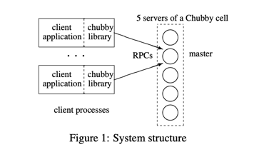

## Introduction

Chubby 为松耦合（loosely-coupled）分布式系统提供粗粒度（coarse-grained）的锁服务（lock service），以及可靠的存储。
Chubby 提供的接口与带咨询锁（advisory locks）的分布式文件系统非常相似，但设计重点是可用性与可靠性，而非高性能。

[GFS](/docs/CS/Distributed/GFS.md) 使用 Chubby 锁来指定一个 GFS 主服务器（master），而 Bigtable 以多种方式使用 Chubby：选举主节点、让主节点发现自己所管理的服务器，以及让客户端找到主节点。此外，GFS 和 Bigtable 都把 Chubby 当作一个众所周知的、可用的位置来存储少量元数据；实际上，它们把 Chubby 当作其分布式数据结构的一个根（root）。

异步共识（asynchronous consensus）由 [Paxos](/docs/CS/Distributed/Consensus/Paxos.md) 协议解决。

## Design

- 选择锁服务（lock service），而非用于共识的库或服务。
- 选择**服务小文件（serve small-files）**，以便被选出的主节点（primary）能够宣告自身及其参数，而无需构建和维护第二个服务。
- 一个通过其 Chubby 文件宣告主节点的服务可能有成千上万个客户端。因此，它们必须允许成千上万个客户端观察该文件，且最好不需要很多服务器。
- 一个复制服务的客户端与副本（replica）可能想知道该服务的主节点何时发生变化。这表明事件通知机制有助于避免轮询（polling）。
- 即使客户端无需周期性轮询文件，许多客户端仍会这样做；这是支持众多开发者的结果。因此，文件的缓存是可取的。
- 开发者会被不直观的缓存语义搞糊涂，因此他们偏好**一致性缓存（consistent caching）**。
- 为了避免财务损失和牢狱之灾，我们提供安全机制，包括**访问控制（access control）**。
- 一个可能令部分读者意外的选择是：他们并不期望锁的使用是细粒度（fine-grained）的（细粒度锁可能只被持有很短时间，如数秒或更短）；相反，他们期望粗粒度的使用。
  粗粒度锁给锁服务器带来的负载要小得多。
  具体而言，获取锁的速率通常只与客户端应用的事务速率弱相关。

细粒度（fine-grained）锁可能只被持有很短时间（数秒或更短）。
粗粒度（coarse-grained）锁可能被持有相当长的时间，或许是数小时或数天。

粗粒度锁给锁服务器带来的负载要小得多。
具体而言，获取锁的速率通常只与客户端应用的事务速率弱相关。
粗粒度锁极少被获取，因此锁服务器的临时不可用只会较少地延迟客户端。
另一方面，将锁从某个客户端转移到另一个客户端可能需要代价高昂的恢复流程，因此人们不会希望锁服务器的一次故障转移（fail-over）导致锁丢失。
因此，让粗粒度锁在锁服务器故障时存活是有益的，为此付出的开销几乎无需担忧，而且这种锁允许用数量不多的、可用性略低的锁服务器充分地服务大量客户端。

细粒度锁会得出不同的结论。
即便锁服务器短暂不可用，也可能导致许多客户端停滞。
由于锁服务处的事务速率随客户端合并的事务速率一同增长，性能以及随时新增服务器的能力至关重要。
不跨锁服务器故障维护锁，从而降低加锁开销，可能带来好处；而且由于锁被持有时间短，偶尔丢弃锁所受的时间惩罚并不严重。
（客户端必须准备好在网络分区期间丢失锁，因此锁服务器故障转移时丢失锁并不会引入新的恢复路径。）

## System Structure

Chubby 有两个通过 RPC 通信的主要组件：一个服务器，以及客户端应用链接的一个库；见图 1。
Chubby 客户端与服务器之间的所有通信都由客户端库中转。

一个 Chubby cell 由一小组成立的服务器（通常五个）组成，称为副本（replicas），其放置方式用于降低相关故障（correlated failure）的可能性（例如，放在不同的机架（rack）中）。
副本使用分布式共识协议来选举主节点（master）；主节点必须获得多数副本的投票，以及这些副本在接下来几秒（称为主租约（master lease）的区间）内不会选举另一个主节点的承诺。
只要主节点持续赢得多数投票，副本便会周期性地续约主租约。

副本维护着一个简单数据库的副本，但**只有主节点发起该数据库的读写**。
所有其他副本只是通过共识协议复制来自主节点的更新。

写请求通过共识协议传播到所有副本；当写操作到达 cell 内多数副本时，请求即被确认。
读请求仅由主节点满足；只要主租约未过期，这样做就是安全的，因为不可能存在另一个主节点。

客户端通过向 DNS 中列出的副本发送主节点定位请求来找到主节点。
非主副本收到此类请求时，会返回主节点的标识。

如果主节点故障，其他副本会在其主租约过期时运行选举协议；通常会在几秒内选出新的主节点。

如果某个副本故障并在数小时内未恢复，一个简单的替换系统会从空闲池中挑选一台新机器，并在其上启动锁服务器二进制程序。
随后它更新 DNS 表，用新副本的 IP 地址替换故障副本的 IP 地址。当前主节点周期性轮询 DNS，最终注意到这一变化。
接着它更新该 cell 数据库中的成员列表；该列表通过常规复制协议在所有成员间保持一致。同时，新副本从文件服务器上存储的备份以及来自活动副本的更新中获取数据库的最近副本。
一旦新副本处理完当前主节点正在等待提交的一个请求，该副本即可参与新主节点的选举投票。

Chubby 导出的文件系统接口与 UNIX 类似，但更简单。

每个 Chubby 文件和目录都可以充当一个读写锁：要么一个客户端句柄以独占（写者）模式持有锁，要么任意数量的客户端句柄以共享（读者）模式持有锁。
像大多数程序员所熟知的互斥量一样，锁是*咨询式（advisory）*的。

在 Chubby 中，以任一模式获取锁都需要写权限，这样未授权的读者就无法阻止写者取得进展。
事件在相应动作发生后才被投递。
因此，如果某个客户端被告知文件内容已改变，那么它随后读取该文件时，保证能看到新数据（或更新的数据）。

## Events

Chubby 客户端在创建句柄时可以订阅一系列事件。
这些事件通过来自 Chubby 库的上调（up-call）异步投递给客户端。

## Cache

为减少读流量，Chubby 客户端在内存中、一致性的直写（write-through）缓存里缓存文件数据与节点（node）元数据（包括文件缺失）。
该缓存由下述租约机制维护，并通过主节点发出的失效（invalidation）消息保持一致，主节点保存着每个客户端可能缓存内容的列表。
该协议保证客户端要么看到 Chubby 状态的一致视图，要么看到错误。

- 由于所有请求都经过主节点，缓存是为了缓解这一负载。
- 每个客户端的缓存都是直写（right through）的，且所有客户端的缓存保持一致。
- 所有缓存只在“租约期（lease period）”内维护。

当文件数据或元数据将要被修改时，在主节点向每个可能缓存了该数据的客户端发送失效消息期间，修改被阻塞；该机制建立在 KeepAlive RPC 之上。

缓存协议很简单：它在发生变化时使缓存数据失效，而从不更新它。

客户端将 Chubby 句柄视为一个指向不透明结构体的指针，该结构体支持各种操作。
句柄仅由 Open() 创建，并由 Close() 销毁。

## Keepalive

一个 Chubby 会话（session）是 Chubby cell 与 Chubby 客户端之间的关系；它存在于某个时间间隔内，并通过称为 KeepAlive 的周期性握手来维护。
除非 Chubby 客户端另有告知，只要其会话保持有效，客户端的句柄、锁与缓存数据就都保持有效。

客户端在首次联系某个 Chubby cell 的主节点时请求新会话。
当客户端终止时，或当会话空闲（没有打开的句柄且一分钟内没有调用）时，它会显式结束会话。

每个会话都有一个关联的租约（lease）——一段延伸到未来的时间间隔，在此期间主节点保证不会单方面终止会话。
该间隔的末端称为会话租约超时（session lease timeout）。
主节点可自由将该超时进一步向未来推进，但不能将其向后移动。

主节点在三种情况下推进租约超时：会话创建时、发生主节点故障转移时（见下文），以及响应客户端的 KeepAlive RPC 时。

除延长客户端的租约外，KeepAlive 回复还用于把事件与缓存失效信息回传给客户端。当有事件或失效消息要投递时，主节点会让 KeepAlive 提前返回。

TCP 的退避策略并不理会更高级别的超时（如 Chubby 租约），因此基于 TCP 的 KeepAlive 在网络高度拥塞时导致许多会话丢失。
我们被迫通过 UDP 而非 TCP 发送 KeepAlive RPC；UDP 没有拥塞避免机制，因此我们只希望在高层次时间界限必须满足时才使用 UDP。

## Failover

当主节点故障或以其他方式失去主身份时，它会丢弃其关于会话、句柄和锁的内存状态。
会话租约的权威计时器运行在主节点上，因此在选出新主节点之前，会话租约计时器是停止的；这是合法的，因为它等同于延长客户端的租约。
如果主节点选举很快完成，客户端就能在其本地（近似）租约计时器过期前联系上新主节点。
如果选举耗时很长，客户端会刷新其缓存，并在尝试寻找新主节点的同时等待宽限期（grace period）。
因此，宽限期允许跨超过正常租约超时的故障转移维持会话。

在此期间，客户端无法确定其在主节点处的租约是否已过期。
它不会拆除自己的会话，但会阻塞其 API 上的所有应用调用，以防应用观察到不一致的数据。
在宽限期开始时，Chubby 库向应用发送一个危险（jeopardy）事件，让应用能够静默下来，直到它能确定自己会话的状态。

一旦客户端联系上新主节点，客户端库与主节点便协同合作，向应用营造出未发生过故障的假象。

## Backup

由于 Chubby 不使用基于路径的权限，每次文件访问在数据库中只需一次查找。
每隔几小时，每个 Chubby cell 的主节点将其数据库快照写入位于另一栋建筑中的 GFS 文件服务器。
使用独立的建筑既确保备份能在建筑损坏时存活，也确保备份不会在系统中引入循环依赖；同一建筑中的 GFS cell 可能依赖该 Chubby cell 来选举其主节点。

备份既提供灾难恢复，也提供了一种在不给在役副本增加负载的情况下初始化新替换副本数据库的手段。

Chubby 允许将一组文件从一个 cell 镜像（mirror）到另一个 cell。
镜像很快，因为文件很小，且事件机制会在文件被添加、删除或修改时立即通知镜像代码。
只要没有网络问题，变更在不到一秒内就会反映到全球数十个镜像中。
如果某个镜像不可达，它将保持不变，直到连通性恢复。
随后通过比较校验和来识别更新过的文件。

镜像最常用于将配置文件复制到分布在世界各地的各个计算集群。

## Scaling

他们期望用两种熟悉的方法——代理（proxy）与分区（partitioning）——让 Chubby 进一步扩展。

## Links

- [Google](/docs/CS/Distributed/Google.md)
- [Paxos](/docs/CS/Distributed/Consensus/Paxos.md)
- [Zookeeper](/docs/CS/Framework/ZooKeeper/ZooKeeper.md)

## References

1. [The Chubby lock service for loosely-coupled distributed systems](https://www.usenix.org/legacy/event/osdi06/tech/full_papers/burrows/burrows.pdf)
2. [Reiew of Paxos Made Simple and The Chubby Lock Service for Loosely-Coupled Distributed Systems](https://www.cs.colostate.edu/~cs670/CR7_AndyStone_PaxosChubby.pdf)
