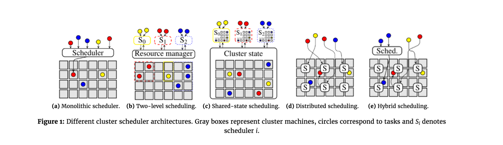
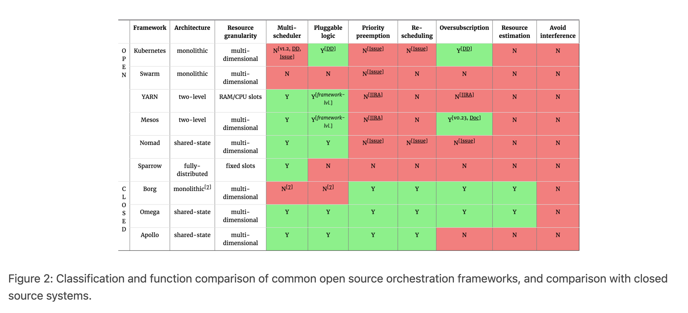

## Introduction

Cluster schedulers are an important component of modern infrastructure.
Their architecture has moved from monolithic designs to much more flexible, disaggregated and distributed designs.
Scheduling is an important topic because it directly affects the cost of operating a cluster: a poor scheduler results in low utilization, which costs money as expensive machines are left idle.
High utilization, however, is not sufficient on its own: antagonistic workloads interfere with other workloads unless the decisions are made carefully.

## Architectural Evolution

Figure 1 visualises the different approaches: a gray square corresponds to a machine, a coloured circle to a task, and a rounded rectangle with an "S" inside corresponds to a scheduler.
Arrows indicate placement decisions made by schedulers, and the three colours correspond to different workloads (e.g., web serving, batch analytics, and machine learning).

### Monolithic Scheduling

Many cluster schedulers – such as most high-performance computing (HPC) schedulers, the [Borg scheduler](), various early [Hadoop schedulers]() and the [Kubernetes scheduler]() – are **monolithic**.
A single scheduler process runs on one machine (e.g., the `JobTracker` in Hadoop v1, and `kube-scheduler` in Kubernetes) and assigns tasks to machines.
**All workloads are handled by the same scheduler, and all tasks run through the same scheduling logic**(see Figure 1a).
This is simple and uniform, and has led to increasingly sophisticated schedulers being developed.
As an example, see the [Paragon](http://dl.acm.org/citation.cfm?id=2451125) and [Quasar](http://dl.acm.org/citation.cfm?id=2541941) schedulers, which use a machine learning approach to avoid negative interference between workloads competing for resources.

Most clusters run different types of applications today (as opposed to, say, just [Hadoop MapReduce](/docs/CS/Java/Hadoop/MapReduce.md) jobs in the early days).
However, maintaining a single scheduler implementation that handles mixed (heterogeneous) workloads can be tricky, for several reasons:

1. It is quite reasonable to expect a scheduler to treat long-running service jobs and batch analytics jobs differently.
2. Since different applications have different needs, supporting them all keeps adding features to the scheduler, increasing the complexity of its logic and implementation.
3. The order in which the scheduler processes tasks becomes an issue: queueing effects (e.g., head-of-line blocking) and backlog can become an issue unless the scheduler is carefully designed.

Overall, this sounds like the makings of an engineering nightmare – and the never-ending lists of feature requests that scheduler maintainers receive attests to this.[1](http://www.firmament.io/blog/scheduler-architectures.html#fn1)

### Secondary Scheduling

Two-level scheduling architectures address this problem by separating the concerns of **resource allocation** and  **task placement** .
This allows the task placement logic to be tailored towards specific applications, but also maintains the ability to share the cluster between them.

The [Mesos](http://static.usenix.org/events/nsdi11/tech/full_papers/Hindman_new.pdf) cluster manager pioneered this approach, and [YARN](http://dl.acm.org/citation.cfm?id=2523633) supports a limited version of it.
In Mesos, resources are *offered* to application-level schedulers (which may pick and choose from them), while YARN allows the application-level schedulers to *request*resources (and receive allocations in  return).
Figure 1b shows the general idea: workload-specific schedulers (S0–S2) interact with a resource manager that carves out dynamic partitions of the cluster resources for each workload.
This is a very flexible approach that allows for custom, workload-specific scheduling policies.

Yet, the separation of concerns in two-level architectures comes with a drawback: the application-level schedulers lose omniscience, i.e., they cannot see *all* the possible placement options any more.
Instead, they merely see those options that correspond to resources offered (Mesos) or allocated (YARN) by the resource manager component.
This has several disadvantages:

1. Priority preemption(higher priority tasks kick out lower priority ones) becomes difficult to implement: in an offer-based model,
   the resources occupied by running tasks aren't visible to the upper-level schedulers; in a request-based model, the lower-level resource manager must understand the preemption policy (which may be application-dependent).
2. Schedulers are unable to consider interference from running workloads that may degrade resource quality (e.g., "noisy neighbours" that saturate I/O bandwidth), since they cannot see them.
3. Application-specific schedulers care about many different aspects of the underlying resources, but their only means of choosing resources is the offer/request interface with the resource manager.
   This interface can easily become quite complex.

### Shared-state Scheduling

Shared-state architectures address this by moving to a semi-distributed model, in which multiple replicas of cluster state are independently updated by application-level schedulers, as shown in Figure 1c.
After the change is applied locally, the scheduler issues an optimistically concurrent transaction to update the shared cluster state.
This transaction may fail, of course: another scheduler may have made a conflicting change in the meantime.

The most prominent examples of shared-state designs are [Omega](http://dl.acm.org/citation.cfm?id=2465386) at Google, and [Apollo](https://www.usenix.org/conference/osdi14/technical-sessions/presentation/boutin) at Microsoft, as well as the [Nomad](https://www.nomadproject.io/docs/internals/scheduling.html) container scheduler by Hashicorp.
All of these materialise the *shared cluster state* in a single location: the "cell state" in Omega, the "resource monitor" in Apollo, and the "plan queue" in Nomad.
Apollo differs from the other two as its shared-state is read-only, and the scheduling transactions are submitted directly to the cluster machines.
The machines themselves check for conflicts and accept or reject the changes. This allows Apollo to make progress even if the shared-state is temporarily unavailable.

A "logical" shared-state design can also be achieved without materialising the full cluster state anywhere.
In this approach (somewhat similar to what Apollo does), each machine maintains its own state and sends updates to different interested agents such as schedulers, machine health monitors, and resource monitoring systems.
Each machine's local view of its state now forms a "shard" of the global shared-state.

However, shared-state architectures have some drawbacks, too: they must work with stale information (unlike a centralized scheduler), and may experience degraded scheduler performance under high contention (although this can apply to other architectures as well).

### Fully-distributed Scheduling

Fully-distributed architectures take the disaggregation even further: they have no coordination between schedulers at all, and use many independent schedulers to service the incoming workload, as shown in Figure 1d.
Each of these schedulers works purely with its local, partial, and often out-of-date view of the cluster.
Jobs can typically be submitted to any scheduler, and each scheduler may place tasks anywhere in the cluster.
Unlike with two-level schedulers, there are no partitions that each scheduler is responsible for. Instead, the overall schedule and resource partitioning are emergent consequences of statistical multiplexing and randomness in workload and scheduler decisions – similar to shared-state schedulers, albeit without any central control at all.

The recent distributed scheduler movement probably started with the [Sparrow](http://dl.acm.org/citation.cfm?id=2522716) paper, although the underlying concept (power of multiple random choices) [first appeared in 1996](http://www.eecs.harvard.edu/~michaelm/postscripts/mythesis.pdf).
The key premise of Sparrow is a hypothesis that the tasks we run on clusters are becoming ever shorter in duration, supported by [an argument](http://dl.acm.org/citation.cfm?id=2490497) that fine-grained tasks have many benefits.
Consequently, the authors assume that tasks are becoming more numerous, meaning that a higher decision throughput must be supported by the scheduler.
Since a single scheduler may not be able to keep up with this throughput (assumed to be a million tasks per second!), Sparrow spreads the load across many schedulers.

This makes perfect sense: and the lack of central control can be conceptually appealing, and it suits some workloads very well – more on this in a future post.
For the moment, it suffices to note that since the distributed schedulers are uncoordinated, they apply significantly simpler logic than advanced monolithic, two-level, or shared-state schedulers.
For example:

1. Distributed schedulers are typically based on a simple "slot" concept that chops each machine into *n* uniform slots, and places up to *n* parallel tasks.
   This simplifies over the fact that tasks' resource requirements are not uniform.
2. They also use worker-side queues with simple service disciplines (e.g., FIFO in Sparrow), which restricts scheduling flexibility, as the scheduler can merely choose at which machine to enqueue a task.
3. Distributed schedulers have difficulty enforcing global invariants (e.g., fairness policies or strict priority precedence), since there is no central control.
4. Since they are designed for rapid decisions based on minimal knowledge, distributed schedulers cannot support or afford complex or application-specific scheduling policies.
   Avoiding interference between tasks, for example, becomes tricky.

### Hybrid Scheduling

Hybrid architectures are a recent (mostly academic) invention that seeks to address these drawbacks of fully distributed architectures by combining them with monolithic or shared-state designs.
The way this typically works – e.g., in [Tarcil](http://dl.acm.org/citation.cfm?id=2806779), [Mercury](https://www.usenix.org/conference/atc15/technical-session/presentation/karanasos), and [Hawk](https://www.usenix.org/conference/atc15/technical-session/presentation/delgado) – is that there really are two scheduling paths: a distributed one for part of the workload (e.g., very short tasks, or low-priority batch workloads), and a centralized one for the rest.
Figure 1e illustrates this design.
The behaviour of each constituent part of a hybrid scheduler  is identical to the part's architecture described above.

## Scheduler Comparison

Figure 2 shows an overview of a selection of open-source orchestration frameworks, their architecture and the features supported by their schedulers. 
At the bottom of the table, We also include closed-source systems at Google and Microsoft for reference. 
The resource granularity column indicates whether the scheduler assigns tasks to fixed-size slots, or whether it allocates resources in multiple dimensions (e.g., CPU, memory, disk I/O bandwidth, network bandwidth, etc.).

One key aspect that helps determine an appropriate scheduler architecture is whether your cluster runs a *heterogeneous* (i.e., mixed) workload. 
This is the case, for example, when combining production front-end services (e.g., load-balanced web servers and memcached) with batch data analytics (e.g., MapReduce or Spark). 
Such combinations make sense in order to improve utilization, but the different applications have different scheduling needs. 
In a mixed setting, a monolithic scheduler likely results in sub-optimal assignments, since the logic cannot be diversified on a per-application basis. 
A two-level or shared-state scheduler will likely offer benefits here.

Most user-facing service workloads run with resource allocations sized to serve peak demand expected of each container, but in practice they typically under-utilize their allocations substantially. 
**In this situation, being able to opportunistically over-subscribe the resources with lower-priority workloads (while maintaining QoS guarantees) is the key to an efficient cluster.**
Mesos is currently the only open-source system that ships support for such over-subscription, although Kubernetes has [a fairly mature proposal](http://kubernetes.io/v1.1/docs/proposals/resource-qos.html) for adding it. 

Finally, specific analytics and OLAP-style applications (for example, Dremel or SparkSQL queries) can benefit from fully-distributed schedulers. 
However, fully-distributed schedulers (like e.g., Sparrow) come with fairly restricted feature sets, and thus work best when the workload is homogeneous (i.e., all tasks run for roughly the same time), 
set-up times are low (i.e., tasks are scheduled to long-running workers, as e.g., with MapReduce application-level tasks in YARN), and task churn is very high (i.e., many scheduling decisions must be made in a short time). 
Distributed schedulers are substantially simpler than others, and do not support multiple resource dimensions, over-subscription, or re-scheduling.

## References

1. [The evolution of cluster scheduler architectures](https://www.codetd.com/en/article/14158427)
2. [Omega: flexible, scalable schedulers for large compute clusters](https://web.eecs.umich.edu/~mosharaf/Readings/Omega.pdf)
3. [Apollo: Scalable and Coordinated Scheduling for Cloud-Scale Computing](https://www.usenix.org/system/files/conference/osdi14/osdi14-paper-boutin_0.pdf)
4. [Firmament: Fast, Centralized Cluster Scheduling at Scale](https://www.usenix.org/system/files/conference/osdi16/osdi16-gog.pdf)
