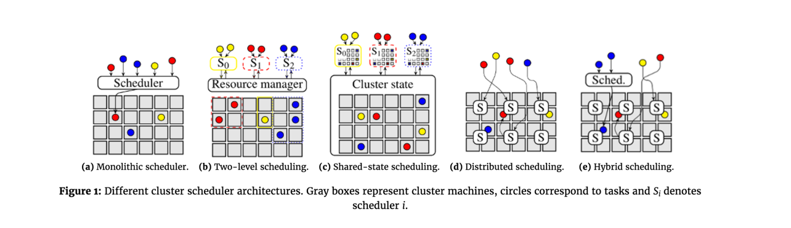
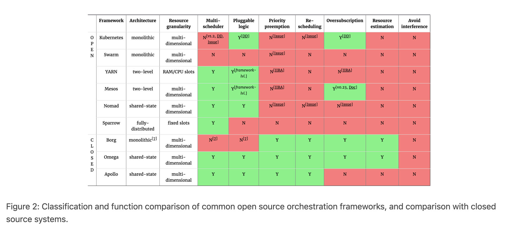
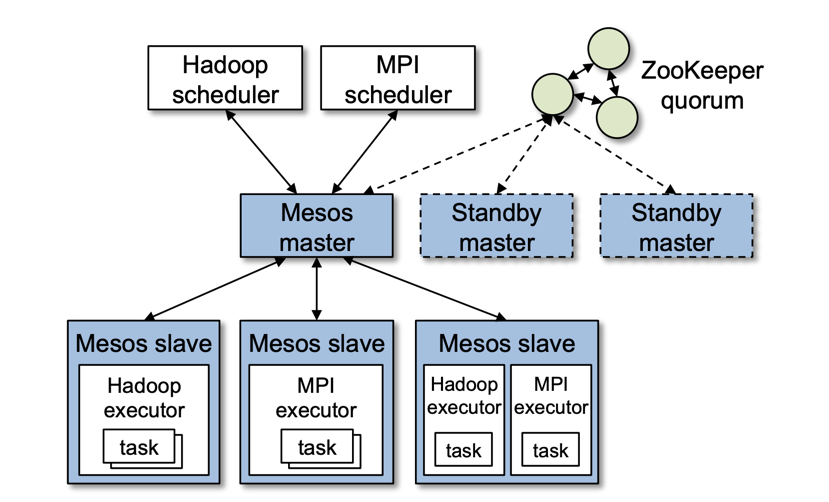
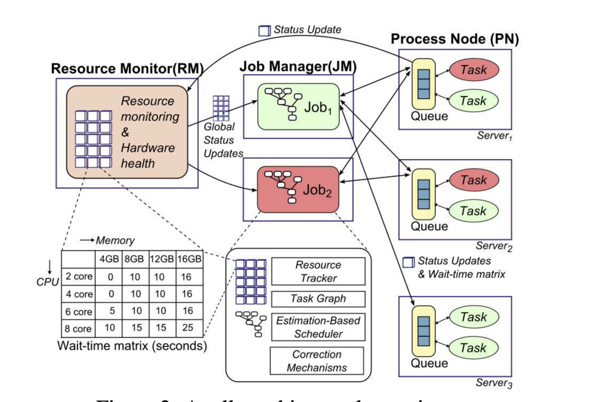
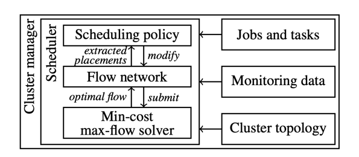

## Introduction

集群调度器（Cluster scheduler）是现代基础设施的重要组件。其架构已从单体（monolithic）设计演进到更灵活、更解耦（disaggregated）与分布式的设计。调度之所以重要，是因为它直接影响运营集群的成本：一个糟糕的调度器会导致利用率低下，让昂贵的机器闲置而白白花钱。然而，高利用率本身并不足够——敌对的工作负载会相互干扰，除非调度决策足够审慎。

## Architecture Evolution

图 1 可视化了几种不同的方案：灰色方块代表一台机器，彩色圆圈代表一个任务，内部带“S”的圆角矩形代表一个调度器。箭头表示调度器做出的放置决策，三种颜色对应不同的工作负载（例如 Web 服务、批处理分析、机器学习）。

### Monolithic Scheduling

许多集群调度器——例如大多数高性能计算（HPC）调度器、[Borg scheduler](/docs/CS/Distributed/Borg.md?id=scheduling)、早期的各种 [Hadoop 调度器]() 以及 [Kubernetes scheduler](/docs/CS/Container/k8s/K8s.md?id=scheduling)——都是**单体（monolithic）**的。一个单一的调度器进程运行在一台机器上（例如 Hadoop v1 的 `JobTracker` 与 Kubernetes 的 `kube-scheduler`），负责把任务分配到机器上。**所有工作负载都由同一个调度器处理，所有任务都经由同一套调度逻辑**（见图 1a）。这种方式简单且统一，也推动了越来越复杂的调度器不断出现。例如 [Paragon](http://dl.acm.org/citation.cfm?id=2451125) 与 [Quasar](http://dl.acm.org/citation.cfm?id=2541941) 调度器使用机器学习方法来避免竞争资源的工作负载之间的负面干扰。

如今大多数集群运行不同类型的应用（而不再像早期那样只跑 [Hadoop MapReduce](/docs/CS/Framework/Hadoop/MapReduce.md) 作业）。然而，维护一个能处理混合（异构）工作负载的单一调度器实现可能很棘手，原因有几条：

1. 期望调度器对长时间运行的服务作业与批处理分析作业区别对待，这很合理。
2. 由于不同应用有不同需求，为它们全部提供支持会不断往调度器里堆功能，增加其逻辑与实现的复杂度。
3. 调度器处理任务的顺序成了问题：除非精心设计的调度器，否则排队效应（例如队头阻塞，head-of-line blocking）与积压（backlog）都会成为问题。

总而言之，这听起来像是一场工程噩梦——而调度器维护者收到的那份永无止境的特性需求清单也印证了这一点。[1](http://www.firmament.io/blog/scheduler-architectures.html#fn1)

### Two-level Scheduling

两级（two-level）调度架构通过把**资源分配**与**任务放置**的关注点分离，来解决上述问题。这让任务放置逻辑可以针对特定应用定制，同时又能维持集群在它们之间的共享。

[Mesos](/docs/CS/Distributed/Cluster_Scheduler.md?id=mesos) 集群管理器开创了这种方式，[YARN](http://dl.acm.org/citation.cfm?id=2523633) 也支持其一个受限版本。在 Mesos 中，资源被*提供（offered）*给应用级调度器（后者可从中挑选）；而在 YARN 中，应用级调度器可*请求（request）*资源（并作为回报获得分配）。图 1b 展示了总体思路：针对特定工作负载的调度器（S0–S2）与一个资源管理器交互，由后者为每个工作负载切出集群资源的动态分区。这是一种非常灵活的方式，允许自定义的、针对工作负载的调度策略。

不过，两级架构中关注点的分离也带来一个缺点：应用级调度器失去了“全知（omniscience）”，即它们再也看不到*所有*可能的放置选项。相反，它们只能看到由资源管理器组件提供（Mesos）或分配（YARN）的资源所对应的那些选项。这有几个弊端：

1. 优先级抢占（priority preemption，高优先级任务踢掉低优先级任务）变得难以实现：在基于提供（offer）的模型中，运行中任务所占用的资源对上层调度器不可见；在基于请求（request）的模型中，底层资源管理器必须理解抢占策略（而这可能依赖于具体应用）。
2. 调度器无法考虑来自运行中工作负载、可能拉低资源质量的干扰（例如占满 I/O 带宽的“吵闹邻居，noisy neighbours”），因为它们看不到这些。
3. 应用专属的调度器关心底层资源的许多不同方面，但它们选择资源的唯一手段就是与资源管理器之间的提供/请求接口。这个接口很容易变得相当复杂。

### Shared-state Scheduling

共享状态（shared-state）架构通过转向一种半分布式模型来解决这一问题：多个集群状态的副本由各应用级调度器独立更新，如图 1c 所示。在本地应用变更后，调度器发起一个乐观并发（optimistically concurrent）事务来更新共享集群状态。当然，这个事务也可能失败：期间另一个调度器可能已做出了冲突的修改。

共享状态设计最著名的例子包括 Google 的 [Omega](http://dl.acm.org/citation.cfm?id=2465386)、微软的 [Apollo](https://www.usenix.org/conference/osdi14/technical-sessions/presentation/boutin)，以及 Hashicorp 的 [Nomad](https://www.nomadproject.io/docs/internals/scheduling.html) 容器调度器。它们都把*共享集群状态*物化（materialise）在同一个地方：Omega 的“cell 状态”、Apollo 的“resource monitor”、Nomad 的“plan queue”。Apollo 与另外两者不同，其共享状态是只读的，调度事务被直接提交到集群机器上。机器自身检查冲突并接受或拒绝变更，这使得即便共享状态暂时不可用，Apollo 仍能继续推进。

也可以不把完整集群状态物化到任何地方，而实现一种“逻辑”上的共享状态。在这种（与 Apollo 的做法有些相似）方式中，每台机器维护自己的状态，并把更新发送给不同的关注方，例如调度器、机器健康监控器与资源监控系统。每台机器对其状态的局部视图，就构成了全局共享状态的一个“分片（shard）”。

然而，共享状态架构也有缺点：它们必须使用陈旧（stale）信息（不像集中式调度器），并可能在高竞争下出现调度性能下降（尽管其它架构也可能如此）。

### Fully Distributed Scheduling

全分布式（fully-distributed）架构把解耦推得更远：调度器之间完全不做协调，而是用许多相互独立的调度器来服务进来的工作负载，如图 1d 所示。每个调度器纯粹基于自己对集群的局部、片面、且常常过时的视图工作。任务通常可提交给任意调度器，而每个调度器可把任务放置在集群的任何位置。与两级调度器不同，这里没有每个调度器各自负责的固定分区；相反，整体调度与资源分区是统计复用（statistical multiplexing）与 workload/scheduler 决策中随机性涌现（emergent）的结果——类似共享状态调度器，只是完全没有中心控制。

近期的分布式调度器运动大概始于 [Sparrow](http://dl.acm.org/citation.cfm?id=2522716) 论文，尽管其底层概念（多次随机选择的威力，power of multiple random choices）[最早出现于 1996 年](http://www.eecs.harvard.edu/~michaelm/postscripts/mythesis.pdf)。Sparrow 的关键前提是：集群上运行的任务正变得越来越短，这一假设得到 [一个论证](http://dl.acm.org/citation.cfm?id=2490497) 的支持——细粒度任务有许多好处。因此，作者假设任务正变得越来越多，意味着调度器必须支撑更高的决策吞吐。由于单一调度器可能无法跟上这种吞吐（假定高达每秒百万任务！），Sparrow 把负载分摊到许多调度器上。

这完全说得通：缺乏中心控制在概念上很有吸引力，并且非常契合某些工作负载——更多内容留待后续文章。就目前而言，只需注意：由于分布式调度器互不协调，它们应用的逻辑比先进的单体、两级或共享状态调度器都要简单得多。例如：

1. 分布式调度器通常基于简单的“槽位（slot）”概念，把每台机器切成 *n* 个均匀槽位，每个槽位最多放 *n* 个并行任务。这简化了“任务资源需求并不均匀”这一事实。
2. 它们还使用 worker 侧队列与简单的服务规则（例如 Sparrow 中的 FIFO），这限制了调度灵活性，因为调度器只能选择把任务入队到哪台机器。
3. 分布式调度器难以强制全局不变量（例如公平性策略或严格的优先级先后），因为没有中心控制。
4. 由于它们被设计成基于最少知识做快速决策，分布式调度器无法支持或负担复杂、应用专属的调度策略。例如，避免任务间干扰就变得棘手。

### Hybrid Scheduling

混合（hybrid）架构是近期（主要多见于学术界的）发明，试图把全分布式架构的缺点与单体或共享状态设计结合起来。其典型做法——例如 [Tarcil](http://dl.acm.org/citation.cfm?id=2806779)、[Mercury](https://www.usenix.org/conference/atc15/technical-session/presentation/karanasos) 与 [Hawk](https://www.usenix.org/conference/atc15/technical-session/presentation/delgado)——是真正存在两条调度路径：一条分布式路径服务于部分工作负载（例如极短任务，或低优先级批处理负载），另一条集中式路径服务于其余部分。图 1e 展示了这种设计。混合调度器各组成部分的行为，与上述对应架构中的行为完全一致。

## Scheduler Comparison

图 2 概览了若干开源编排框架，展示了它们的架构及其调度器所支持的特性。表格底部还列入了 Google 与微软的闭源系统以供参考。资源粒度（resource granularity）一列表明调度器是把任务分配到固定大小的槽位，还是在多个维度（例如 CPU、内存、磁盘 I/O 带宽、网络带宽等）上分配资源。

判断何种调度器架构合适的一个关键方面，是你的集群是否运行*异构*（即混合）工作负载。例如，把生产前端服务（如负载均衡的 Web 服务器与 memcached）与批处理数据分析（如 MapReduce 或 Spark）结合起来就是这种情况。这种组合对提升利用率很有意义，但不同应用有不同调度需求。在混合场景下，单体调度器很可能给出次优的分配，因为其逻辑无法按应用分别定制。两级或共享状态调度器则很可能在这里带来收益。

大多数面向用户的服务负载，其资源分配都是按每个容器预期的服务峰值来确定的，但实践中它们往往大幅利用不足。**在这种情况下，能够用低优先级工作负载机会式地超售（over-subscribe）资源（同时保持 QoS 保证），是高效集群的关键。** Mesos 目前是唯一一个原生支持这种超售的开源系统，尽管 Kubernetes 也有 [一个相当成熟的提案](http://kubernetes.io/v1.1/docs/proposals/resource-qos.html) 来加入它。

最后，特定的分析与 OLAP 类应用（例如 Dremel 或 SparkSQL 查询）能从全分布式调度器中获益。不过，全分布式调度器（如 Sparrow）特性集相当受限，因此最适合在同构（即所有任务运行时间大致相同）、建立时间短（即任务被调度到长时间运行的 worker 上，例如 YARN 中 MapReduce 的应用级任务）、且任务周转极高（即短时间内要做大量调度决策）的工作负载下工作。分布式调度器比其它调度器简单得多，且不支持多维资源、超售或重新调度。

## Mesos

Mesos 是一个轻量的资源共享层，通过给框架（framework）提供访问集群资源的通用接口，实现跨多样化集群计算框架的细粒度共享。

Mesos 引入了一种称为资源提供（resource offer）的分布式**两级调度机制**。Mesos 决定向每个框架提供多少资源，而框架则决定接受哪些资源、在上面运行哪些计算。

Mesos 由一个管理各集群节点上 *slave* 守护进程的 *master* 进程，以及在这些 slave 上运行 *task* 的*框架*组成。

master 通过*资源提供*实现跨框架的细粒度共享。每个资源提供是多个 slave 上空闲资源的列表。master 依据某种组织策略（如公平共享或优先级）决定向每个框架提供多少资源。为了支持多样化的框架间分配策略，Mesos 让组织可通过一个可插拔（pluggable）的分配模块自定义策略。

运行在 Mesos 上的每个框架由两个组件组成：一个向 master 注册以接收资源提供的 *scheduler*，以及一个在 slave 节点上启动以运行框架 *task* 的 *executor* 进程。master 决定向每个框架提供多少资源，而框架的 scheduler 选择使用哪些被提供的资源。当框架接受提供的资源时，它向 Mesos 传递一份它想在上面启动的任务的描述。

把控制权下推到框架有两个好处。

- 首先，它让框架能够以多样化方式解决集群中的各类问题（例如实现数据本地性、处理故障），并独立演进这些方案。
- 其次，它让 Mesos 保持简单，并最小化系统所需的变更频率，从而更容易保持 Mesos 的可扩展性与健壮性。

由于所有框架都依赖 Mesos master，让 master 具备容错能力至关重要。为此，我们把 master 设计成软状态（soft state），使得新 master 能完全从 slave 与框架 scheduler 持有的信息中重建内部状态。具体而言，master 唯一的 state 就是活跃 slave、活跃框架与运行中任务的列表。这些信息足以计算各框架的资源使用量并运行分配策略。我们使用 [ZooKeeper](/docs/CS/Framework/ZooKeeper/ZooKeeper.md) 以热备（hot-standby）配置运行多个 master 来做领导者选举。当活跃 master 故障时，slave 与 scheduler 连接到下一个被选出的 master 并重新填充其状态。

除处理 master 故障外，Mesos 还会向框架 scheduler 报告节点故障与 executor 崩溃。框架随后可按自身策略对这些故障做出反应。

最后，为应对 scheduler 故障，Mesos 允许一个框架注册多个 scheduler：当其中一个失败时，另一个会被 Mesos master 通知以接管。框架必须用自己的机制在多个 scheduler 之间共享状态。

我们识别出分布式模型的三个局限：

- **碎片（Fragmentation）。**
  由于装箱（bin packing）次优造成的空间浪费，其上限由最大任务尺寸与节点尺寸之比决定。
- **相互依赖的框架约束（Interdependent framework constraints）。**
  可能构造出这样的场景：由于框架间某些晦涩的相互依赖（例如两个框架的某些任务不能共置），只有对整个集群做一次全局分配才能表现良好。
- **框架复杂度（Framework complexity）。**
  使用资源提供可能让框架调度更复杂。Mesos 必须利用框架偏好来决定接受哪些提供。现有框架的许多调度策略是在线算法（online algorithm），因为框架无法预测任务时长，且必须能处理故障与掉队者（straggler）。

## Omega

## Apollo

- 为兼顾可扩展性与调度质量，Apollo 采用一种分布式、（松散）协调的调度框架，通过纳入同步的集群利用率信息，以乐观且协调的方式做出独立的调度决策。
- 为达成高质量的调度决策，Apollo 把每个任务调度到使任务完成时间最小的服务器上。其评估模型纳入多种因素，使调度器能做出加权决策，而非仅仅考虑数据本地性或服务器负载。计算的数据并行特性，让 Apollo 能在作业执行期间基于相似任务的观测运行时统计，持续精炼任务执行时间的估计。
- 为向各调度器提供集群信息，Apollo 引入一种轻量的、与硬件无关的负载通告机制。它与每台服务器上的本地任务队列相结合，提供所有服务器资源可用性的近未来视图，供调度器决策使用。
- 为应对大规模集群中不可避免的意外集群动态、次优估计与其它异常运行时行为，Apollo 通过一系列校正机制变得健壮——这些机制在运行时动态调节并纠正次优决策。我们提出了一种独特的延迟校正（deferred correction）机制，仅在独立调度器间的冲突影响显著时才去解决，并证明这种方式在实践中表现良好。
- 为在维持低作业延迟的同时驱动高集群利用率，Apollo 引入机会式调度（opportunistic scheduling），它有效地把任务分成两类：常规任务（regular task）与机会式任务（opportunistic task）。Apollo 为常规任务保证低延迟，同时用机会式任务填充常规任务留下的空闲以提升利用率。
- 为确保在把 Apollo 部署上线替换生产环境中既有调度器时，不发生服务中断或性能回退，我们把 Apollo 设计成支持分阶段（staged）上线到生产集群并在规模上验证。这些约束在研究界少有关注，但在实践中至关重要，我们也分享了达成这些严苛目标的经验。

下图给出了 Apollo 架构的概览。作业管理器（JM，Job Manager，也称 scheduler）被指派管理每个作业的生命周期。每个 JM 使用的全局集群负载信息，由 Apollo 框架中另外两个实体协作提供：每个集群一个的资源监控器（RM，Resource Monitor）与每台服务器一个的处理节点（PN，Process Node）。运行在每台服务器上的 PN 进程负责管理该服务器的本地资源并执行本地调度，而 RM 则持续从各 PN 聚合集群范围内的负载信息，为每个 JM 提供全局集群状态视图以做出明智的调度决策。

虽然 RM 被视为单一逻辑实体，但它实际上可以以不同机制、不同物理配置来实现，因为它本质上解决的是一个被充分研究过的问题：大规模、动态变化的分布式资源集合状态的监控。例如它可以用树形层次结构，或用带最终一致（eventually consistent）gossip 协议的目录服务。Apollo 的架构能容纳任何此类配置。我们用 [Paxos](/docs/CS/Distributed/Consensus/Paxos.md) 以主从（master-slave）配置实现了 RM。RM 从不处于性能关键路径上：即便 RM 暂时不可用（例如因机器故障导致瞬时的主从切换期间），Apollo 仍能以降级的质量继续做调度决策。此外，一旦任务被调度到某个 PN，JM 会通过频繁的状态更新直接从该 PN 获取最新负载信息。

为了更好地预测近期资源利用率并优化调度质量，每个 PN 维护一个指派给该服务器的任务本地队列，并以从队列推断出的等待时间矩阵（wait-time matrix）形式公布其未来资源可用性。因此，Apollo 采纳一种基于估计的方法来做任务调度决策。具体而言，Apollo 会综合考虑由 RM 聚合的等待时间矩阵，以及待调度任务自身的特征（如输入位置）。然而，集群动态在实践中带来诸多挑战：例如等待时间矩阵可能陈旧、估计可能次优、集群环境有时不可预测。因此 Apollo 引入了校正机制以增强健壮性，并在运行时动态调整调度决策。最后，为作业提供有保障的资源（例如为保证 SLA）与达成高集群利用率之间存在固有张力，因为集群负载与作业的资源需求都在持续波动。Apollo 通过机会式调度解决这一张力——它创建第二等的任务来利用空闲资源。

## Firmament

Firmament 通过使用多种 MCMF（最小费用最大流，min-cost max-flow）算法、增量式求解问题，以及针对问题的特定优化，实现了低延迟。

下图给出 Firmament 调度器架构的概览。

与 Quincy 类似，Firmament 把调度问题建模为在流网络（flow network）上的 min-cost max-flow（MCMF）优化。流网络是一个有向图，其结构由调度策略定义。响应事件与监控信息，流网络依据调度策略被修改，并交给 MCMF 求解器以找出最优（即最小费用）流。求解器完成后返回最优流，Firmament 从中提取隐含的任务放置。下文中，我们先解释流网络的基本结构，再讨论如何让求解器提速。

### Scheduling Policies

- 负载散布策略（Load-spreading policy）
- Quincy 策略（Quincy policy）
- 网络感知策略（Network-aware policy）

## Links

- [Architecture](/docs/CS/Distributed/Architecture.md)
- [Azure](/docs/CS/Distributed/Azure.md)
- [Bigtable](/docs/CS/Distributed/Bigtable.md)
- [Borg](/docs/CS/Distributed/Borg.md)
- [Byzantine](/docs/CS/Distributed/Byzantine.md)
- [CAP](/docs/CS/Distributed/CAP.md)

## References

1. [The evolution of cluster scheduler architectures](https://www.codetd.com/en/article/14158427)
2. [Omega: flexible, scalable schedulers for large compute clusters](https://web.eecs.umich.edu/~mosharaf/Readings/Omega.pdf)
3. [Apollo: Scalable and Coordinated Scheduling for Cloud-Scale Computing](https://www.usenix.org/system/files/conference/osdi14/osdi14-paper-boutin_0.pdf)
4. [Firmament: Fast, Centralized Cluster Scheduling at Scale](https://www.usenix.org/system/files/conference/osdi16/osdi16-gog.pdf)
5. [Mesos: A Platform for Fine-Grained Resource Sharing in the Data Center](http://static.usenix.org/events/nsdi11/tech/full_papers/Hindman_new.pdf)
