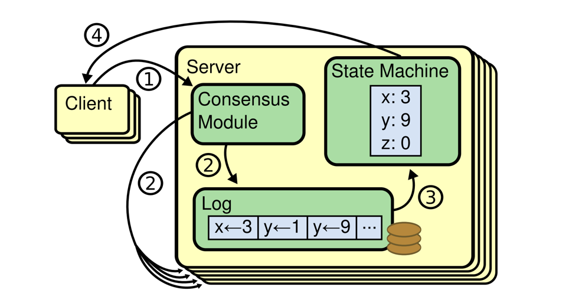

## Introduction

Consensus is a fundamental problem in fault-tolerant distributed systems.
Consensus is usually expressed in terms of agreement among a set of processes.
Consensus involves multiple servers agreeing on values. Once they reach a decision on a value, that decision is final.
Typical consensus algorithms make progress when any majority of their servers is available; for example, a cluster of 5 servers can continue to operate even if 2 servers fail.
If more servers fail, they stop making progress (but will never return an incorrect result).

Consensus typically arises in the context of replicated state machines, a general approach to building fault-tolerant systems.
Each server has a state machine and a log. The state machine is the component that we want to make fault-tolerant, such as a hash table.
It will appear to clients that they are interacting with a single, reliable state machine, even if a minority of the servers in the cluster fail.
Each state machine takes as input commands from its log. In our hash table example, the log would include commands like set x to 3.
A consensus algorithm is used to agree on the commands in the servers' logs.
The consensus algorithm must ensure that if any state machine applies set x to 3 as the nth command, no other state machine will ever apply a different nth command.
As a result, each state machine processes the same series of commands and thus produces the same series of results and arrives at the same series of states.

A fundamental problem in distributed computing and multi-agent systems is to achieve overall system reliability in the presence of a number of faulty processes.
This often requires coordinating processes to reach consensus, or agree on some data value that is needed during computation.
Example applications of consensus include agreeing on what transactions to commit to a database in which order, state machine replication, and atomic broadcasts.
Real-world applications often requiring consensus include cloud computing, clock synchronization, PageRank, opinion formation, smart power grids, state estimation, control of UAVs (and multiple robots/agents in general), load balancing, blockchain, and others.

There are a number of situations in which it is important for nodes to agree. For example:

- Leader election
  In a database with single-leader replication, all nodes need to agree on which node is the leader.
  The leadership position might become contested if some nodes can’t communicate with others due to a network fault.
  In this case, consensus is important to avoid a bad failover, resulting in a split brain situation in which two nodes both believe themselves to be the leader.
  If there were two leaders, they would both accept writes and their data would diverge, leading to inconsistency and data loss.
- Atomic commit
  In a database that supports transactions spanning several nodes or partitions, we have the problem that a transaction may fail on some nodes but succeed on others.
  If we want to maintain transaction atomicity, we have to get all nodes to agree on the outcome of the transaction: either they all abort/roll back (if anything goes wrong) or they all commit (if nothing goes wrong). This instance of consensus is known as the atomic commit problem.

Atomic commit is formalized slightly differently from consensus: an atomic transaction can commit only if all participants vote to commit, and must abort if any participant needs to abort.
Consensus is allowed to decide on any value that is proposed by one of the participants.
However, atomic commit and consensus are reducible to each other.
Nonblocking atomic commit is harder than consensus—see “Three-phase commit".

For example, some possible uses of consensus are:

- deciding whether or not to commit a transaction to a database
- synchronising clocks by agreeing on the current time
- agreeing to move to the next stage of a distributed algorithm (this is the famous replicated state machine approach)
- electing a leader node to coordinate some higher-level protocol

## Problem description

The consensus problem requires agreement among a number of processes (or agents) for a single data value.
Some of the processes (agents) may fail or be unreliable in other ways, so consensus protocols must be fault tolerant or resilient.
The processes must somehow put forth their candidate values, communicate with one another, and agree on a single consensus value.

The consensus problem is a fundamental problem in control of multi-agent systems.
One approach to generating consensus is for all processes (agents) to agree on a majority value.
In this context, a majority requires at least one more than half of available votes (where each process is given a vote).
However, one or more faulty processes may skew the resultant outcome such that consensus may not be reached or reached incorrectly.

Protocols that solve consensus problems are designed to deal with limited numbers of faulty processes.
These protocols must satisfy a number of requirements to be useful. For instance, a trivial protocol could have all processes output binary value 1.
This is not useful and thus the requirement is modified such that the output must somehow depend on the input. That is, the output value of a consensus protocol must be the input value of some process.
Another requirement is that a process may decide upon an output value only once and this decision is irrevocable. A process is called correct in an execution if it does not experience a failure.
A consensus protocol tolerating halting failures must satisfy the following properties.

- **Termination**
  Eventually, every correct process decides some value.
- **Validity**
  The value that has been decided must have proposed by some process.
- **Agreement**
  Every correct process must agree on the same value.

A protocol that can correctly guarantee consensus amongst n processes of which at most t fail is said to be t-resilient.

In evaluating the performance of consensus protocols two factors of interest are running time and message complexity.
Running time is given in Big O notation in the number of rounds of message exchange as a function of some input parameters (typically the number of processes and/or the size of the input domain).
Message complexity refers to the amount of message traffic that is generated by the protocol.
Other factors may include memory usage and the size of messages.

We characterize it in terms of three classes of agents:

- **Proposers** A proposer can propose a value.
- **Acceptors** The acceptors cooperate in some way to choose a single proposed value.
- **Learners** A learner can learn what value has been chosen.

In the traditional statement, each process is a proposer, an acceptor, and a learner.
However, in a distributed client/server system, we can also consider the clients to be the proposers and learners, and the servers to be the acceptors.

The consensus problem is characterized by the following three requirements, where N is the number of acceptors and F is the number of acceptors that must be allowed to fail without preventing progress.

- **Nontriviality** Only a value proposed by a proposer can be learned.
- **Safety** At most one value can be learned.
- **Liveness** If a proposer p, a learner l, and a set of N − F acceptors are non-faulty and can communicate with one another, and if p proposes a value, then l will eventually learn a value.

Nontriviality and safety must be maintained even if at most M of the acceptors are malicious, and even if proposers are malicious.
By definition, a learner is non-malicious, so the conditions apply only to non-malicious learners.
A malicious acceptor by definition has failed, so the N − F acceptors in the liveness condition do not include malicious ones.
Note that M is the maximum number of failures under which safety is preserved, while F is the maximum number of failures under which liveness is ensured.
These parameters are, in principle, independent. Hitherto, the only cases considered have been M = 0 (non-Byzantine) and M = F (Byzantine).
If malicious failures are expected to be rare but not ignorable, we may assume 0 < M < F.
If safety is more important than liveness, we might assume F < M .

The classic Fischer, Lynch, Paterson result(**FLP**) implies that no purely asynchronous algorithm can solve consensus.
However, we interpret “can communicate with one another” in the liveness requirement to include a synchrony requirement.
Thus, nontriviality and safety must be maintained in any case; liveness is required only if the system eventually behaves synchronously.
Dwork, Lynch, and Stockmeyer([Consensus in the Presence of Partial Synchrony](http://courses.csail.mit.edu/6.897/fall04/papers/Dwork/consensus-in-ps.pdf)) showed the existence of an algorithm satisfying these requirements.

Here are approximate lower-bound results for an asynchronous consensus algorithm. Their precise statements and proofs will appear later.

> **Approximate Theorem 1**
>
> If there are at least two proposers, or one malicious proposer, then N > 2F + M .

> **Approximate Theorem 2**
>
> If there are at least two proposers, or one malicious proposer, then there is at least a 2-message delay between the proposal of a value and the learning of that value.

> **Approximate Theorem 3**
>
> - If there are at least two proposers whose proposals can be learned with a 2-message delay despite the failure of Q acceptors, or there is one such possibly malicious proposer that is not an acceptor, then N > 2Q + F + 2M .
> - If there is a single possibly malicious proposer that is also an acceptor, and whose proposals can be learned with a 2-message delay despite the failure of Q acceptors, then N > max(2Q + F + 2M − 2, Q + F + 2M ).

These results are approximate because there are special cases in which the bounds do not hold.
For example, Approximate Theorem 1 does not hold in the case of three distinct processes: one process that is a proposer and an acceptor, one process that is an acceptor and a learner, and one process that is a proposer and a learner.
In this case, there is an asynchronous consensus algorithm with N = 2, F = 1, and M = 0.

The first theorem is fairly obvious when M = 0 and has been proved in several settings. For M = F, it was proved in the [original Byzantine agreement paper](https://lamport.azurewebsites.net/pubs/reaching.pdf).

## Models of computation

Varying models of computation may define a "consensus problem". Some models may deal with fully connected graphs, while others may deal with rings and trees.
In some models message authentication is allowed, whereas in others processes are completely anonymous. Shared memory models in which processes communicate by accessing objects in shared memory are also an important area of research.

### Communication channels with direct or transferable authentication

In most models of communication protocol participants communicate through authenticated channels.
This means that messages are not anonymous, and receivers know the source of every message they receive.
Some models assume a stronger, transferable form of authentication, where each message is signed by the sender, so that a receiver knows not just the immediate source of every message, but the participant that initially created the message.
This stronger type of authentication is achieved by digital signatures, and when this stronger form of authentication is available, protocols can tolerate a larger number of faults.

The two different authentication models are often called oral communication and written communication models.
In an oral communication model, the immediate source of information is known, whereas in stronger, written communication models, every step along the receiver learns not just the immediate source of the message, but the communication history of the message.

### Inputs and outputs of consensus

In the most traditional single-value consensus protocols such as Paxos, cooperating nodes agree on a single value such as an integer, which may be of variable size so as to encode useful metadata such as a transaction committed to a database.

A special case of the single-value consensus problem, called binary consensus, restricts the input, and hence the output domain, to a single binary digit {0,1}.
While not highly useful by themselves, binary consensus protocols are often useful as building blocks in more general consensus protocols, especially for asynchronous consensus.

In multi-valued consensus protocols such as Multi-Paxos and Raft, the goal is to agree on not just a single value but a series of values over time, forming a progressively-growing history.
While multi-valued consensus may be achieved naively by running multiple iterations of a single-valued consensus protocol in succession, many optimizations and other considerations such as reconfiguration support can make multi-valued consensus protocols more efficient in practice.

## Crash and Byzantine failures

There are two types of failures a process may undergo, a crash failure or a Byzantine failure.
A crash failure occurs when a process abruptly stops and does not resume.
Byzantine failures are failures in which absolutely no conditions are imposed.
For example, they may occur as a result of the malicious actions of an adversary.
A process that experiences a Byzantine failure may send contradictory or conflicting data to other processes, or it may sleep and then resume activity after a lengthy delay.
Of the two types of failures, Byzantine failures are far more disruptive.

Thus, a consensus protocol tolerating Byzantine failures must be resilient to every possible error that can occur.

A stronger version of consensus tolerating Byzantine failures is given by strengthening the Integrity constraint:

**Integrity**
If a correct process decides v, then v must have been proposed by some correct process.

### Asynchronous and synchronous systems

The consensus problem may be considered in the case of asynchronous or synchronous systems.
While real world communications are often inherently asynchronous, it is more practical and often easier to model synchronous systems, given that asynchronous systems naturally involve more issues than synchronous ones.

In synchronous systems, it is assumed that all communications proceed in rounds. In one round, a process may send all the messages it requires, while receiving all messages from other processes.
In this manner, no message from one round may influence any messages sent within the same round.

## FLP Impossibility

Paper [Impossibility of Distributed Consensuswith One Faulty Process](https://dl.acm.org/doi/pdf/10.1145/3149.214121) assumes that processing is entirely asynchronous; there’s no shared notion of time between the processes.
Algorithms in such systems cannot be based on timeouts, and there’s no way for a process to find out whether the other process has crashed or is simply running too slow.
Given these assumptions, there exists no protocol that can guarantee consensus in a bounded time.
No completely asynchronous consensus algorithm can tolerate the unannounced crash of even a single remote process.

If we do not consider an upper time bound for the process to complete the algorithm steps, process failures can’t be reliably detected, and there’s no deterministic algorithm to reach a consensus.
It means that we cannot always reach consensus in an asynchronous system in bounded time.
In practice, systems exhibit at least some degree of synchrony, and the solution to this problem requires a more refined model.

The FLP result is based on the asynchronous model, which is actually a class of models which exhibit certain properties of timing.
The main characteristic of asynchronous models is that there is no upper bound on the amount of time processors may take to receive, process and respond to an incoming message.
Therefore it is impossible to tell if a processor has failed, or is simply taking a long time to do its processing. The asynchronous model is a weak one, but not completely physically unrealistic.
We have all encountered web servers that seem to take an arbitrarily long time to serve us a page.
Now that mobile ad-hoc networks are becoming more and more pervasive, we see that devices in those networks may power down during processing to save battery, only to reappear later and continue as though nothing had happened.
This introduces an arbitrary delay which fits the asynchronous model.

It is not always possible to solve a consensus problem in an asynchronous model.
Moreover, designing an efficient synchronous algorithm is not always achievable, and for some tasks the practical solutions are more likely to be time-dependent [Efficiency of Synchronous Versus Asynchronous Distributed Systems](https://dl.acm.org/doi/pdf/10.1145/2402.322387).

- Failure Models
- Crash Faults
- Omission Faults

This model assumes that the process skips some of the algorithm steps, or is not able to execute them, or this execution is not visible to other participants, or it cannot send or receive messages to and from other participants.

Omission fault captures network partitions between the processes caused by faulty network links, switch failures, or network congestion.
Network partitions can be represented as omissions of messages between individual processes or process groups.
A crash can be simulated by completely omitting any messages to and from the process.

Arbitrary Faults

Avoid FLP:

- Fault Masking
- Failure Detectors
- Non-Determinism

In a fully asynchronous message-passing distributed system, in which at least one process may have a crash failure, it has been proven in the famous FLP impossibility result that a deterministic algorithm for achieving consensus is impossible.
This impossibility result derives from worst-case scheduling scenarios, which are unlikely to occur in practice except in adversarial situations such as an intelligent denial-of-service attacker in the network.
In most normal situations, process scheduling has a degree of natural randomness.

In an asynchronous model, some forms of failures can be handled by a synchronous consensus protocol.
For instance, the loss of a communication link may be modeled as a process which has suffered a Byzantine failure.

Randomized consensus algorithms can circumvent the FLP impossibility result by achieving both safety and liveness with overwhelming probability,
even under worst-case scheduling scenarios such as an intelligent denial-of-service attacker in the network.

### Failure Detectors

properties of failure detectors:

- Completeness
- Accuracy

Eventually Weakly Failure Detector

- Eventually Weakly Complete
- Eventually Weakly Accurate

## Permissioned versus permissionless consensus

Consensus algorithms traditionally assume that the set of participating nodes is fixed and given at the outset:
that is, that some prior (manual or automatic) configuration process has permissioned a particular known group of participants who can authenticate each other as members of the group.
In the absence of such a well-defined, closed group with authenticated members, a Sybil attack against an open consensus group can defeat even a Byzantine consensus algorithm,
simply by creating enough virtual participants to overwhelm the fault tolerance threshold.

A permissionless consensus protocol, in contrast, allows anyone in the network to join dynamically and participate without prior permission,
but instead imposes a different form of artificial cost or barrier to entry to mitigate the Sybil attack threat.
Bitcoin introduced the first permissionless consensus protocol using proof of work and a difficulty adjustment function, in which participants compete to solve cryptographic hash puzzles,
and probabilistically earn the right to commit blocks and earn associated rewards in proportion to their invested computational effort.
Motivated in part by the high energy cost of this approach, subsequent permissionless consensus protocols have proposed or adopted other alternative participation rules for Sybil attack protection,
such as proof of stake, proof of space, and proof of authority.

[On Optimal Probabilistic Asynchronous Byzantine Agreement]()

## Consensus Algorithms

### Replicated State Machines

Replicated state machines are typically implemented using a replicated log, as shown in Figure 1.
Each server stores a log containing a series of commands, which its state machine executes in order.
Each log contains the same commands in the same order, so each state machine processes the same sequence of commands.
Since the state machines are deterministic, each computes the same state and the same sequence of outputs.

Fig.1. Replicated state machine architecture.
The consensus algorithm manages a replicated log containing state machine commands from clients.
The state machines process identical sequences of commands from the logs, so they produce the same outputs.

Keeping the replicated log consistent is the job of the consensus algorithm.
The consensus module on a server receives commands from clients and adds them to its log.
It communicates with the consensus modules on other servers to ensure that every log eventually contains the same requests in the same order, even if some servers fail.
Once commands are properly replicated, each server’s state machine processes them in log order, and the outputs are returned to clients.
As a result, the servers appear to form a single, highly reliable state machine.

### 2PC

Consensus is easy if there are no faults.

As its name suggests, 2PC operates in two distinct phases.

- The first proposal phase involves proposing a value to every participant in the system and gathering responses.
- The second commit-or-abort phase communicates the result of the vote to the participants and tells them either to go ahead and decide or abort the protocol.

The process that proposes values is called the coordinator, and does not have to be specially elected - any node can act as the coordinator if they want to and therefore initiate a round of 2PC.

There is a fly in 2PC’s ointment. If nodes are allowed to fail - if even a single node can fail - then things get a good deal more complicated.

2PC is still a very popular consensus protocol, because it has a low message complexity (although in the failure case, if every node decides to be the recovery node the complexity can go to $O(n^2)$.
A client that talks to the co-ordinator can have a reply in 3 message delays’ time. This low latency is very appealing for some applications.

However, the fact the 2PC can block on co-ordinator failure is a significant problem that dramatically hurts availability.
If transactions can be rolled back at any time, then the protocol can recover as nodes time out, but if the protocol has to respect any commit decisions as permanent, the wrong failure can bring the whole thing to a juddering halt.

The fundamental difficulty with 2PC is that, once the decision to commit has been made by the co-ordinator and communicated to some replicas, the replicas go right ahead and act upon the commit statement without checking to see if every other replica got the message.
Then, if a replica that committed crashes along with the co-ordinator, the system has no way of telling what the result of the transaction was (since only the co-ordinator and the replica that got the message know for sure).
Since the transaction might already have been committed at the crashed replica, the protocol cannot pessimistically abort - as the transaction might have had side-effects that are impossible to undo.
Similarly, the protocol cannot optimistically force the transaction to commit, as the original vote might have been to abort.

[Notes on Data Base Operating Systems](http://jimgray.azurewebsites.net/papers/dbos.pdf)

[A brief history of Consensus, 2PC and Transaction Commit](https://betathoughts.blogspot.com/2007/06/brief-history-of-consensus-2pc-and.html)

### 3PC

This problem is - mostly - circumvented by the addition of an extra phase to 2PC, unsurprisingly giving us a three-phase commit protocol.
The idea is very simple. We break the second phase of 2PC - ‘commit’ - into two sub-phases. The first is the ‘prepare to commit’ phase.
The co-ordinator sends this message to all replicas when it has received unanimous ‘yes’ votes in the first phase.
On receipt of this messages, replicas get into a state where they are able to commit the transaction - by taking necessary locks and so forth - but crucially do not do any work that they cannot later undo.
They then reply to the co-ordinator telling it that the ‘prepare to commit’ message was received.

The purpose of this phase is to communicate the result of the vote to every replica so that the state of the protocol can be recovered no matter which replica dies.

The last phase of the protocol does almost exactly the same thing as the original ‘commit or abort’ phase in 2PC.
If the co-ordinator receives confirmation of the delivery of the ‘prepare to commit’ message from all replicas, it is then safe to go ahead with committing the transaction.
However, if delivery is not confirmed, the co-ordinator cannot guarantee that the protocol state will be recovered should it crash (if you are tolerating a fixed number ff of failures, the co-ordinator can go ahead once it has received f+1f+1 confirmations).
In this case, the co-ordinator will abort the transaction.

If the co-ordinator should crash at any point, a recovery node can take over the transaction and query the state from any remaining replicas.
If a replica that has committed the transaction has crashed, we know that every other replica has received a ‘prepare to commit’ message (otherwise the co-ordinator wouldn’t have moved to the commit phase),
and therefore the recovery node will be able to determine that the transaction was able to be committed, and safely shepherd the protocol to its conclusion.
If any replica reports to the recovery node that it has not received ‘prepare to commit’, the recovery node will know that the transaction has not been committed at any replica, and will therefore be able either to pessimistically abort or re-run the protocol from the beginning.

So does 3PC fix all our problems? Not quite, but it comes close.
In the case of a network partition, the wheels rather come off - imagine that all the replicas that received ‘prepare to commit’ are on one side of the partition, and those that did not are on the other.
Then both partitions will continue with recovery nodes that respectively commit or abort the transaction, and when the network merges the system will have an inconsistent state.
So 3PC has potentially unsafe runs, as does 2PC, but will always make progress and therefore satisfies its liveness properties.
The fact that 3PC will not block on single node failures makes it much more appealing for services where high availability is more important than low latencies.

3PC in fact only works well in a synchronous network with crash-stop failures.

[NonBlocking Commit Protocols](https://www.cs.cornell.edu/courses/cs614/2004sp/papers/Ske81.pdf)

### Paxos

[Paxos](/docs/CS/Distributed/Paxos.md) is a family of distributed algorithms used to reach consensus.

### Raft

[Raft](/docs/CS/Distributed/Raft.md) is a consensus algorithm that is designed to be easy to understand.

### ZAB

### PBFT

Standard consensus algorithms won’t do as they themselves are not Byzantine fault tolerant.

[Practical Byzantine Fault Tolerance and Proactive Recovery](https://www.microsoft.com/en-us/research/wp-content/uploads/2017/01/p398-castro-bft-tocs.pdf)

[A Comparison of the Byzantine Agreement Problem and the Transaction Commit Problem](http://jimgray.azurewebsites.net/papers/tandemtr88.6_comparisonofbyzantineagreementandtwophasecommit.pdf)

## Links

- [Distributed Systems](/docs/CS/Distributed/Distributed_Systems.md)

## References

1. [How to Build a Highly Available System Using Consensus](https://www.microsoft.com/en-us/research/uploads/prod/1996/10/Acrobat-58-Copy.pdf)
2. [Uniform consensus is harder than consensus](https://infoscience.epfl.ch/record/88273/files/CBS04.pdf?version=1)
3. [Impossibility of Distributed Consensus with One Faulty Process](https://groups.csail.mit.edu/tds/papers/Lynch/jacm85.pdf)
4. [Lower Bounds for Asynchronous Consensus](http://lamport.azurewebsites.net/pubs/lower-bound.pdf)
5. [Lower Bounds for Asynchronous Consensus](http://lamport.azurewebsites.net/pubs/bertinoro.pdf)
6. [Consensus on Transaction Commit](https://www.microsoft.com/en-us/research/uploads/prod/2004/01/twophase-revised.pdf)
7. [Consistency, Availability, and Convergence](https://apps.cs.utexas.edu/tech_reports/reports/tr/TR-2036.pdf)
8. [Vive La Difference: Paxos vs. Viewstamped Replication vs. Zab](https://arxiv.org/pdf/1309.5671.pdf)
9. [A Quorum-based Commit and Termination Protocol for Distributed Database Systems](https://hub.hku.hk/bitstream/10722/158032/1/Content.pdf)
10. [A Comprehensive Study on Failure Detectors of Distributed Systems](https://www.researchgate.net/publication/343168303_A_Comprehensive_Study_on_Failure_Detectors_of_Distributed_Systems)
11. [A Quorum-Based Commit Protocol]()
12. [Reconfiguring a state machine](http://lamport.azurewebsites.net/pubs/reconfiguration-tutorial.pdf)
