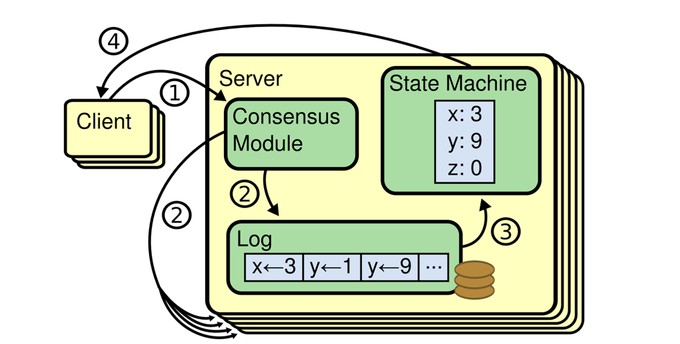

## Introduction

共识是容错分布式系统中的一个基本问题。
共识通常表述为一组进程之间的协议。
共识涉及多个服务器对值达成一致。一旦它们对某个值做出决定，该决定就是最终的。
典型的共识算法在任何多数服务器可用时都能取得进展；例如，一个由 5 台服务器组成的集群即使在 2 台服务器故障时也能继续运行。
如果更多服务器故障，它们会停止取得进展（但永远不会返回错误结果）。

共识通常出现在复制状态机的上下文中，这是一种构建容错系统的通用方法。
每台服务器都有一个状态机和一个日志。状态机是我们要使其容错的组件，例如哈希表。
对客户端来说，它们仿佛在与一个单一、可靠的状态机交互，即使集群中的少数服务器发生故障。
每个状态机从其日志中获取命令作为输入。在我们的哈希表示例中，日志将包含类似 set x to 3 的命令。
共识算法用于就服务器日志中的命令达成一致。
共识算法必须确保，如果任何状态机将 set x to 3 作为第 n 条命令应用，则没有其他状态机会应用不同的第 n 条命令。
因此，每个状态机处理相同的命令序列，从而产生相同的结果序列并达到相同的状态序列。

分布式计算和多智能体系统中的一个基本问题是在存在多个故障进程的情况下实现整体系统可靠性。
这通常需要协调进程以达成共识，或就计算所需的某个数据值达成一致。
共识的示例应用包括就事务以何种顺序提交到数据库达成一致、状态机复制和原子广播。
通常需要共识的实际应用包括云计算、时钟同步、PageRank、意见形成、智能电网、状态估计、无人机（以及一般的多机器人/智能体）控制、负载均衡、区块链等。

在许多情况下，节点之间达成一致非常重要。
例如：

- **领导者选举**
  在单领导者复制的数据库中，所有节点需要就哪个节点是领导者达成一致。
  如果某些节点因网络故障而无法与其他节点通信，领导地位可能会受到争议。
  在这种情况下，共识对于避免错误的故障转移很重要，错误的故障转移会导致脑裂情况，即两个节点都自认为是领导者。
  如果有两个领导者，它们都会接受写入，它们的数据会发散，导致不一致和数据丢失。
- **原子提交**
  在支持跨多个节点或分区的事务的数据库中，存在一个问题：事务可能在某些节点上失败但在其他节点上成功。
  如果我们想维护事务原子性，必须让所有节点就事务的结果达成一致：要么全部中止/回滚（如果出错），要么全部提交（如果没有出错）。这个共识实例称为原子提交问题。

原子提交的正式定义与共识略有不同：原子事务只有在所有参与者投票提交时才能提交，如果有任何参与者需要中止则必须中止。
共识可以决定由某个参与者提出的任何值。
然而，原子提交和共识可以相互归约。
非阻塞原子提交比共识更难，请参见"三阶段提交"。

例如，共识的一些可能用途包括：

- 决定是否将事务提交到数据库
- 通过就当前时间达成一致来同步时钟
- 同意进入分布式算法的下一阶段（这就是著名的复制状态机方法）
- 选举领导者节点以协调某些更高级别的协议

## 问题描述

共识问题要求多个进程（或智能体）对单个数据值达成一致。
某些进程（智能体）可能以其他方式发生故障或不可靠，因此共识协议必须具有容错性或弹性。
进程必须以某种方式提出它们的候选值，相互通信，并就单个共识值达成一致。

共识问题是多智能体系统控制中的一个基本问题。
生成共识的一种方法是让所有进程（智能体）就多数值达成一致。
在此上下文中，多数要求至少比可用票数的一半多一（其中每个进程获得一票）。
然而，一个或多个故障进程可能会扭曲最终结果，导致无法达成共识或错误地达成共识。

解决共识问题的协议旨在处理有限数量的故障进程。
这些协议必须满足一些要求才能有用。例如，一个简单的协议可以让所有进程输出二进制值 1。
这没有用，因此要求被修改为输出必须以某种方式依赖于输入。即共识协议的输出值必须是某个进程的输入值。
另一个要求是进程只能决定一次输出值，并且此决定是不可撤销的。在某个执行中，如果没有发生故障，则该进程被称为正确的。
容忍停故障的共识协议必须满足以下属性。

- **终止性**
  最终，每个正确的进程都会决定某个值。
- **有效性**
  已决定的值必须是由某个进程提出的。
- **一致性**
  每个正确的进程必须就相同的值达成一致。

能够正确保证在最多 t 个故障的情况下 n 个进程达成共识的协议称为 t-弹性协议。

在评估共识协议的性能时，两个感兴趣的因素是运行时间和消息复杂度。
运行时间以大 O 表示法表示，以消息交换轮数为单位，作为某些输入参数（通常是进程数和/或输入域的大小）的函数。
消息复杂度指协议生成的消息流量。
其他因素可能包括内存使用和消息大小。

我们根据三类智能体对其进行描述：

- **提议者** 提议者可以提出一个值。
- **接受者** 接受者以某种方式协作选择一个提出的值。
- **学习者** 学习者可以了解已选择的值。

在传统表述中，每个进程同时是提议者、接受者和学习者。
然而，在分布式客户端/服务器系统中，我们也可以将客户端视为提议者和学习者，将服务器视为接受者。

共识问题由以下三个需求描述，其中 N 是接受者数量，F 是允许在不阻碍进展的情况下故障的接受者数量。

- **非平凡性** 只有提议者提出的值才能被学习。
- **安全性** 最多只能学习一个值。
- **活性** 如果提议者 p、学习者 l 和一组 N − F 个接受者无故障且可以相互通信，且 p 提出一个值，则 l 最终会学习一个值。

即使最多 M 个接受者是恶意的，且即使提议者是恶意的，也必须维护非平凡性和安全性。
根据定义，学习者是非恶意的，因此条件仅适用于非恶意学习者。
恶意接受者按定义为故障，因此活性条件中的 N − F 个接受者不包括恶意接受者。
注意，M 是维护安全性的最大故障数，而 F 是确保活性的最大故障数。
这些参数原则上是独立的。迄今为止，仅考虑了 M = 0（非拜占庭）和 M = F（拜占庭）的情况。
如果恶意故障预计很少但不可忽略，我们可以假设 0 < M < F。
如果安全性比活性更重要，我们可以假设 F < M。

经典的 Fischer、Lynch、Paterson 结果（**FLP**）表明，没有纯粹的异步算法可以解决共识问题。
然而，我们将活性要求中的"可以相互通信"解释为包括同步要求。
因此，在任何情况下都必须维护非平凡性和安全性；只有当系统最终表现同步时，才需要活性。
Dwork、Lynch 和 Stockmeyer 证明了存在满足这些要求的算法。

以下是异步共识算法的近似下界结果。

> **近似定理 1**
>
> 如果至少有两个提议者，或一个恶意提议者，则 N > 2F + M。

> **近似定理 2**
>
> 如果至少有两个提议者，或一个恶意提议者，则从提出值到学习该值之间至少存在 2 消息延迟。

> **近似定理 3**
>
> - 如果至少有两个提议者，其提议可以在尽管 Q 个接受者故障的情况下以 2 消息延迟被学习，或者有一个可能恶意且不是接受者的提议者，则 N > 2Q + F + 2M。
> - 如果有一个可能恶意且也是接受者的提议者，其提议可以在尽管 Q 个接受者故障的情况下以 2 消息延迟被学习，则 N > max(2Q + F + 2M − 2, Q + F + 2M)。

这些结果是近似的，因为存在边界不成立的特殊情况。
例如，近似定理 1 在三个不同进程的情况下不成立：一个进程是提议者和接受者，一个进程是接受者和学习者，一个进程是提议者和学习者。
在这种情况下，存在一个 N = 2、F = 1、M = 0 的异步共识算法。

当 M = 0 时，第一个定理相当明显，并且已在多种环境中得到证明。
对于 M = F，它已在原始的拜占庭协议论文中得到证明。

## 计算模型

不同的计算模型可能定义不同的"共识问题"。有些模型可能处理完全连接的图，而其他模型可能处理环和树。
在某些模型中允许消息认证，而在其他模型中进程是完全匿名的。进程通过访问共享内存中的对象进行通信的共享内存模型也是一个重要的研究领域。

### 具有直接或可转移认证的通信信道

在大多数通信协议模型中，参与者通过认证信道进行通信。
这意味着消息不是匿名的，接收者知道他们收到的每条消息的来源。
一些模型假设更强的、可转移的认证形式，其中每条消息由发送者签名，因此接收者不仅知道每条消息的直接来源，还知道最初创建该消息的参与者。
这种更强的认证类型通过数字签名实现，当这种更强的认证形式可用时，协议可以容忍更多的故障。

这两种不同的认证模型通常称为口头通信模型和书面通信模型。
在口头通信模型中，信息的直接来源是已知的，而在更强的书面通信模型中，接收者不仅知道消息的直接来源，还知道消息的通信历史。

### 共识的输入和输出

在最传统的单值共识协议（如 Paxos）中，协作节点就单个值（如整数）达成一致，该值可能具有可变大小，以便编码有用的元数据（如提交给数据库的事务）。

单值共识问题的一个特例称为二元共识，它将输入以及输出域限制为单个二进制数字 {0,1}。
虽然二元共识本身不是非常有用，但它通常用作更通用共识协议的构建块，特别是对于异步共识。

在多值共识协议（如 Multi-Paxos 和 Raft）中，目标不仅是在单个值上达成一致，而是在一系列值上随时间达成一致，形成逐步增长的历史。
虽然多值共识可以通过连续运行多次单值共识协议来简单实现，但许多优化和其他考虑（如重配置支持）可以使多值共识协议在实践中更高效。

## 崩溃故障与拜占庭故障

进程可能经历两种类型的故障：崩溃故障或拜占庭故障。
崩溃故障发生在进程突然停止且不再恢复时。
拜占庭故障是对进程行为没有任何限制的故障。
例如，它们可能由对手的恶意行为导致。
经历拜占庭故障的进程可能向其他进程发送矛盾或冲突的数据，或者可能休眠并在长时间延迟后恢复活动。
在这两种故障类型中，拜占庭故障更具破坏性。

因此，容忍拜占庭故障的共识协议必须能够抵御可能发生的每一种错误。

容忍拜占庭故障的更强版本通过加强完整性约束来给出：

**完整性**
如果正确的进程决定 v，则 v 必须是由某个正确的进程提出的。

### 异步系统和同步系统

共识问题可以在异步或同步系统的情况下考虑。
虽然现实世界的通信通常是异步的，但建模同步系统更实用且通常更容易，因为异步系统自然比同步系统涉及更多问题。

在同步系统中，假设所有通信按轮次进行。
在一轮中，进程可以发送它需要的所有消息，同时接收来自其他进程的所有消息。
这样，没有消息可以从一轮中影响同一轮内发送的任何消息。

## FLP 不可能性

假设处理完全是异步的；进程之间没有共享的时间概念。
此类系统中的算法不能基于超时，并且进程无法判断其他进程是崩溃了还是只是运行太慢。
鉴于这些假设，不存在可以在有界时间内保证共识的协议。
没有完全异步的共识算法能够容忍甚至单个远程进程的未宣布崩溃。

如果我们不考虑进程完成算法步骤的上限时间，则无法可靠地检测进程故障，并且没有确定性算法可以达成共识。
这意味着我们无法在异步系统中总是在有界时间内达成共识。
在实践中，系统至少表现出一定程度的同步性，并且解决此问题需要更精细的模型。

FLP 结果基于异步模型，这实际上是一类表现出某些定时属性的模型。
异步模型的主要特征是处理器接收、处理和响应传入消息所需的时间没有上限。
因此，无法判断处理器是发生了故障，还是只是需要很长时间来处理。
异步模型是一个弱模型，但并非完全物理上不现实。
我们都遇到过似乎需要任意长时间来提供网页的 Web 服务器。
随着移动自组织网络变得越来越普及，我们看到这些网络中的设备可能为了节省电量在处理过程中断电，然后稍后重新出现并继续运行，就像什么都没发生过一样。
这引入了适合异步模型的任意延迟。

在异步模型中解决共识问题并不总是可能的。
此外，设计高效的同步算法并不总是可以实现的，并且对于某些任务，实际解决方案更可能是依赖于时间的。

- 故障模型
- 崩溃故障
- 遗漏故障

此模型假设进程跳过了某些算法步骤，或无法执行这些步骤，或此执行对其他参与者不可见，或者无法向其他参与者发送或接收消息。

遗漏故障捕获了由故障网络链路、交换机故障或网络拥塞引起的进程间网络分区。
网络分区可以表示为单个进程或进程组之间消息的遗漏。
崩溃可以通过完全省略进出进程的任何消息来模拟。

任意故障

避免 FLP：

- 故障屏蔽
- 故障检测器
- 非确定性

在一个完全异步的消息传递分布式系统中，其中至少有一个进程可能发生崩溃故障，著名的 FLP 不可能性结果已经证明，实现共识的确定性算法是不可能的。
这个不可能性结果源于最坏情况的调度场景，这些场景在实践中不太可能发生，除非在网络中的智能拒绝服务攻击者等对抗性情况下。
在大多数正常情况下，进程调度具有一定程度的自然随机性。

在异步模型中，某些形式的故障可以由同步共识协议处理。
例如，通信链路的损失可以建模为经历拜占庭故障的进程。

随机化共识算法可以通过以压倒性概率同时实现安全性和活性来规避 FLP 不可能性结果，即使在最坏情况的调度场景下也是如此。

### 故障检测器

故障检测器的属性：

- 完全性
- 准确性

最终弱故障检测器

- 最终弱完全性
- 最终弱准确性

## 许可型与无许可型共识

传统共识算法假设参与节点集合是固定的且预先给定的：
即某些先前（手动或自动）配置过程已许可了一组特定的已知参与者，它们可以相互认证为组成员。
在没有这种定义明确、具有认证成员的封闭组的情况下，对开放共识组的 Sybil 攻击甚至可以击败拜占庭共识算法，
只需创建足够多的虚拟参与者来压倒容错阈值。

相比之下，无许可共识协议允许网络中的任何人动态加入并参与，无需事先许可，
而是强制采用不同形式的人造成本或进入壁垒来减轻 Sybil 攻击威胁。
Bitcoin 引入了第一个使用工作量证明和难度调整函数的无许可共识协议，其中参与者竞争解决加密哈希谜题，
并概率性地获得提交区块的权利，并根据其投入的计算工作量获得相应奖励。
部分由于这种方法的高能源成本，后续的无许可共识协议提出或采用了其他替代参与规则来防范 Sybil 攻击，
例如权益证明、空间证明和权威证明。

## 共识算法

### 复制状态机

复制状态机通常使用复制日志实现，如图 1 所示。
每台服务器存储一个包含一系列命令的日志，其状态机按顺序执行这些命令。
每个日志包含相同的命令且顺序相同，因此每个状态机处理相同的命令序列。
由于状态机是确定性的，每个状态机会计算出相同的状态和相同的输出序列。

Fig.1. 复制状态机架构。
共识算法管理一个包含来自客户端的状态机命令的复制日志。
状态机处理来自日志的相同命令序列，因此它们产生相同的输出。

保持复制日志一致是共识算法的工作。
服务器上的共识模块从客户端接收命令并将其添加到日志中。
它与其他服务器上的共识模块通信，以确保每个日志最终包含相同的请求且顺序相同，即使某些服务器发生故障。
一旦命令被正确复制，每台服务器的状态机按日志顺序处理它们，并将输出返回给客户端。
因此，这些服务器看起来构成一个单一的、高度可靠的状态机。

### 2PC

如果没有故障，共识是容易的。

顾名思义，2PC 在两个不同的阶段运行。

- 第一个提议阶段涉及向系统中的每个参与者提出一个值并收集响应。
- 第二个提交或中止阶段将投票结果传达给参与者，并告诉它们要么继续决定，要么中止协议。

提出值的过程称为协调者，不需要特殊选举——任何节点都可以充当协调者，因此可以发起一轮 2PC。

2PC 存在一个缺陷。如果允许节点发生故障——即使只有一个节点发生故障——事情就会变得复杂得多。

2PC 仍然是一个非常流行的共识协议，因为它具有较低的消息复杂度（尽管在故障情况下，如果每个节点都决定成为恢复节点，复杂度可能达到 O(n^2)）。
与协调者通信的客户端可以在 3 个消息延迟的时间内得到回复。这种低延迟对一些应用非常有吸引力。

然而，2PC 可能因协调者故障而阻塞，这是一个严重影响可用性的重大问题。
如果事务可以随时回滚，则协议可以在节点超时时恢复，但如果协议必须将任何提交决定视为永久的，错误的故障可能导致整个系统戛然而止。

2PC 的根本困难在于，一旦协调者做出提交决定并通知到某些副本，这些副本立即执行提交操作，而不检查其他所有副本是否都收到了消息。
然后，如果已提交的副本与协调者一起崩溃，系统无法得知事务的结果是什么（因为只有协调者和收到消息的副本确切知道）。
由于事务可能已在崩溃的副本上提交，协议无法悲观地中止，因为事务可能已经产生了不可撤销的副作用。
类似地，协议无法乐观地强制事务提交，因为原始投票可能是中止。

### 3PC

这个问题——大部分——通过向 2PC 添加一个额外阶段来规避，这毫不意外地给我们带来了三阶段提交协议。
这个想法非常简单。我们将 2PC 的第二阶段"提交"拆分为两个子阶段。第一个是"准备提交"阶段。
当协调者在第一阶段收到全体一致的"是"投票时，它向所有副本发送此消息。
收到此消息后，副本进入一个能够提交事务的状态——通过获取必要的锁等——但关键是，不做任何之后无法撤销的工作。
然后它们回复协调者，告知已收到"准备提交"消息。

此阶段的目的是将投票结果传达给每个副本，以便无论哪个副本发生故障，协议状态都可以恢复。

协议的最后一个阶段几乎与 2PC 中原始的"提交或中止"阶段完全相同。
如果协调者从所有副本收到"准备提交"消息的送达确认，那么继续进行事务提交是安全的。
然而，如果送达未确认，协调者无法保证如果它崩溃，协议状态可以恢复（如果你容忍固定数量 f 的故障，协调者可以在收到 f+1 个确认后继续）。
在这种情况下，协调者将中止事务。

如果协调者在任何时候崩溃，恢复节点可以接管事务并从任何剩余的副本查询状态。
如果已提交事务的副本已崩溃，我们知道所有其他副本都已收到"准备提交"消息（否则协调者不会进入提交阶段），
因此恢复节点将能够确定事务可以提交，并安全地将协议引导至完成。
如果任何副本向恢复节点报告尚未收到"准备提交"，恢复节点将知道事务尚未在任何副本上提交，因此将能够悲观地中止或从头重新运行协议。

那么 3PC 解决了我们所有的问题吗？不完全，但它已经很接近了。
在网络分区的情况下，问题出现了——想象一下所有收到"准备提交"的副本位于分区的一侧，而没有收到的位于另一侧。
然后两个分区将继续运行，各自有恢复节点分别提交或中止事务，当网络合并时，系统将处于不一致状态。
因此，3PC 与 2PC 一样可能存在不安全的运行，但它总能取得进展，因此满足其活性属性。
3PC 不会因单节点故障而阻塞，这使得它对于高可用性比低延迟更重要的服务更有吸引力。

3PC 实际上仅在具有崩溃停止故障的同步网络中才能良好工作。

## XA

### 可调一致性模型 - Quorum NWR

Dynamo DB / Cassandra

Quorum NWR 定义：
- N：副本数
- W：写仲裁大小为 W。写操作要被视为成功，必须从 W 个副本收到确认
- R：读仲裁大小为 R。读操作要被视为成功，必须从 R 个副本收到确认

如果 W+R > N，可以保证强一致性，因为至少有一个重叠节点拥有最新数据以确保一致性

典型设置：
- 如果 R = 1 且 W = N，系统针对快速读取优化
- 如果 R = N 且 W = 1，系统针对快速写入优化
- 如果 W + R > N，保证强一致性（通常 N = 3，W = R = 2）

### Paxos

[Paxos](/docs/CS/Distributed/Consensus/Paxos.md) 是一族用于达成共识的分布式算法。

### Raft

[Raft](/docs/CS/Distributed/Consensus/Raft.md) 是一种设计为易于理解的共识算法。

### ZAB

### PBFT

标准的共识算法无法胜任，因为它们本身不具备拜占庭容错能力。

## 区块链

共识算法还有一个很重要的领域，就是比较火的区块链，比如工作量证明（POW）、权益证明（POS）和委托权益证明（DPOS）、置信度证明（PoB）等等，都是共识算法
大家熟知的zk、etcd这种之所以叫"传统分布式"，就是相对于区块链这种"新型分布式系统"而言的，都是多节点共同工作，只是区块链有几点特殊：
1. 区块链需要解决的是拜占庭将军问题，paxos之类的一致性算法无法对抗欺诈节点
2. 区块链中不存在中央控制方，没有一个节点可以控制或协调账本数据的生成
3. 区块链中的共识算法如果达不到一致性，则任何人都可以硬分叉，另建一个社区、一条链
4. 分布式系统的性能理论上可以无限提升，但区块链是以相对的低效率来换取公正，主流的公有链每秒只能处理几笔到几十笔交易

区块链共识算法

PoW，Proof of Work
不足：
- 速度慢。
- 耗能巨大，对环境不好。
- 易受"规模经济"（economies of scale）的影响。
使用者：Bitcoin、Ethereum、Litecoin、Dogecoin等。
类型：有竞争共识（Competitive consensus）
https://bitcoin.org/bitcoin.pdf

PoS，Proof of Stake）
优点：
- 节能。
- 攻击者代价更大。
- 不易受"规模经济"的影响。
不足：
- "无利害关系"（Nothing at stake）攻击问题。
使用者：Ethereum（即将推出）、Peercoin、Nxt。
类型：有竞争共识。

延迟工作量证明（dPoW，Delayed Proof-of-Work）
优点：
- 节能。
- 安全性增加。
- 可以通过非直接提供 Bitcoin（或是其它任何安全链），添加价值到其它区块链，无需付出 Bitcoin（或是其它任何安全链）交易的代价。
不足：
* 只有使用 PoW 或 PoS 的区块链，才能采用这种共识算法。

* 在"公证员激活"（Notaries Active）模式下，必须校准不同节点（公证员或正常节点）的哈希率，否则哈希率间的差异会爆炸

## Links

- [Distributed Systems](/docs/CS/Distributed/Distributed.md)

## References

1. [How to Build a Highly Available System Using Consensus](https://www.microsoft.com/en-us/research/uploads/prod/1996/10/Acrobat-58-Copy.pdf)
2. [Uniform consensus is harder than consensus](https://infoscience.epfl.ch/record/88273/files/CBS04.pdf?version=1)
3. [Impossibility of Distributed Consensus with One Faulty Process](https://groups.csail.mit.edu/tds/papers/Lynch/jacm85.pdf)
4. [Lower Bounds for Asynchronous Consensus](http://lamport.azurewebsites.net/pubs/lower-bound.pdf)
5. [Lower Bounds for Asynchronous Consensus](http://lamport.azurewebsites.net/pubs/bertinoro.pdf)
6. [Consensus on Transaction Commit](https://www.microsoft.com/en-us/research/uploads/prod/2004/01/twophase-revised.pdf)
7. [Consistency, Availability, and Convergence](https://apps.cs.utexas.edu/tech_reports/reports/tr/TR-2036.pdf)
8. [Vive La Difference: Paxos vs. Viewstamped Replication vs. Zab](https://arxiv.org/pdf/1309.5671.pdf)
9. [A Quorum-based Commit and Termination Protocol for Distributed Database Systems](https://hub.hku.hk/bitstream/10722/158032/1/Content.pdf)
10. [A Comprehensive Study on Failure Detectors of Distributed Systems](https://www.researchgate.net/publication/343168303_A_Comprehensive_Study_on_Failure_Detectors_of_Distributed_Systems)
11. [A Quorum-Based Commit Protocol]()
12. [Reconfiguring a state machine](http://lamport.azurewebsites.net/pubs/reconfiguration-tutorial.pdf)
13. [Notes on Data Base Operating Systems](http://jimgray.azurewebsites.net/papers/dbos.pdf)
14. [A brief history of Consensus, 2PC and Transaction Commit](https://betathoughts.blogspot.com/2007/06/brief-history-of-consensus-2pc-and.html)
15. [Practical Byzantine Fault Tolerance and Proactive Recovery](https://www.microsoft.com/en-us/research/wp-content/uploads/2017/01/p398-castro-bft-tocs.pdf)
16. [A Comparison of the Byzantine Agreement Problem and the Transaction Commit Problem](http://jimgray.azurewebsites.net/papers/tandemtr88.6_comparisonofbyzantineagreementandtwophasecommit.pdf)
17. [NonBlocking Commit Protocols](https://www.cs.cornell.edu/courses/cs614/2004sp/papers/Ske81.pdf)
18. [On Optimal Probabilistic Asynchronous Byzantine Agreement](https://www.researchgate.net/publication/220725355_On_Optimal_Probabilistic_Asynchronous_Byzantine_Agreement)
19. [The Problem of Distributed Consensus: A Survey](https://arxiv.org/pdf/2106.13591.pdf)
20. [A Survey of Distributed Consensus Protocols for Blockchain Networks](https://arxiv.org/pdf/1904.04098.pdf)
21. [Consensus in the Presence of Partial Synchrony](https://dl.acm.org/doi/pdf/10.1145/42282.42283)
22. [ConsensusPedia: An Encyclopedia of 30+ Consensus Algorithms](https://hackernoon.com/consensuspedia-an-encyclopedia-of-29-consensus-algorithms-e9c4b4b7d08f)
