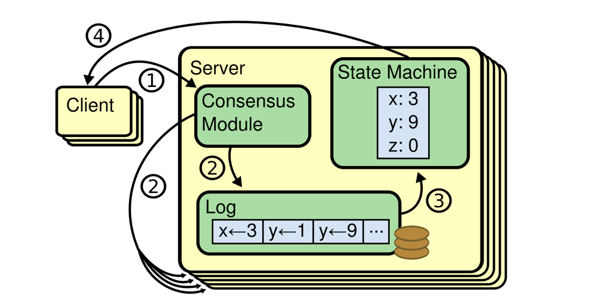

## Introduction

共识（Consensus）是容错分布式系统的根本问题：一组进程必须对某个数据值达成一致，且一旦做出决定便不可更改。典型的共识算法在「多数派存活」时即可推进——例如 5 节点集群可容忍 2 个节点失效；若失效超过半数则停止推进（但绝不会返回错误结果）。

最常见的落地形态是 **replicated state machine（复制状态机）**：每个节点持有一台状态机与一份日志，状态机就是要保护的组件（如一个哈希表）。对客户端而言，哪怕少数节点失效，他们看到的仍是一台单一的、可靠的状态机。每个状态机按日志中的命令顺序执行（例如 `set x to 3`）；共识算法负责让所有节点的日志就「第 n 条命令是什么」达成一致——若某状态机把 `set x to 3` 作为第 n 条命令执行，其它状态机绝不能执行不同的第 n 条命令。于是所有状态机处理相同的命令序列，得到相同的状态与结果。

在分布式计算与多智能体系统中，核心目标是在存在故障进程时保证整体可靠性，这往往要求进程间协调以达成共识。典型应用包括：决定事务以什么顺序提交、状态机复制、原子广播等。现实中对共识有强需求的场景涵盖云计算、时钟同步、PageRank、电网调度、无人机/多机器人协同、负载均衡、区块链等。

需要达成一致的典型情形有两类：

- **Leader election（选主）**：在单主复制的数据库里，所有节点必须对「谁是 leader」达成一致。若因网络故障部分节点失联导致选主争议，共识能避免错误的故障转移引发「双主」脑裂——两个节点都自认 leader 并各自接受写入，数据就此分歧甚至丢失。
- **Atomic commit（原子提交）**：跨多节点/分区的事务可能在某些节点成功、另一些失败。要维持事务原子性，必须让所有节点对结果达成一致：要么全部提交（无误时），要么全部中止（出错时），这被称为 atomic commit problem。

原子提交与共识形式化略有不同：原子事务只有在所有参与者都投票提交时才能提交，而共识允许决定为「任一参与者提出的值」。二者可相互归约，但非阻塞原子提交比共识更难（见 Three-phase commit）。共识的常见用途还包括：决定是否提交事务、通过对当前时间达成一致来同步时钟、推进分布式算法的下一阶段（即著名的复制状态机方法）、选举 leader 来协调上层协议。

## Problem description

共识问题要求一组进程（或智能体）就单个数据值达成一致。部分进程可能失效或以其它方式不可靠，因此共识协议必须能容错。进程必须提出候选值、相互通信、并就单一共识值达成一致。

这是多智能体系统控制中的根本问题。一种朴素的生成共识方法是让所有进程对「多数派值」达成一致；这里的多数要求超过可用票数的一半（每个进程一票）。但一个或多个故障进程可能扭曲结果，使共识无法达成或达成错误结果。

解决共识问题的协议被设计为容忍有限数量的故障进程，并须满足若干性质：平凡协议（让所有进程都输出 1）没有意义，因此要求输出必须「取决于输入」——共识协议的输出值必须是某个进程提出过的值；同时，一个进程一旦决定某个输出值便不可撤销。在执行中未经历失效的进程称为 **correct（正确）** 进程。容忍停机故障的共识协议须满足：

- **Termination（终止性）**：最终，每个正确进程都会决定某个值。
- **Validity（有效性）**：被决定的值，必须是某个进程提出过的值。
- **Agreement（一致性）**：每个正确进程都必须决定相同的值。

能正确保证 n 个进程中至多 t 个失效仍可达成共识的协议，称为 **t-resilient**。评估共识协议性能的两个核心维度是**运行时间**与**消息复杂度**：运行时间以消息交换轮数的大 O 表示（通常是进程数与输入域规模的函数），消息复杂度指协议产生的消息流量；其它因素还包括内存占用与消息大小。

从角色视角，共识可刻画为三类智能体：

- **Proposers（提议者）**：提出候选值。
- **Acceptors（接受者）**：协作从众多提案中选出一个。
- **Learners（学习者）**：得知最终被选中的值。

传统陈述里每个进程身兼三者；但在客户端/服务器模型中，客户端可视为提议者与学习者，服务器则是接受者。

更形式化的刻画用两个参数：N 为接受者总数，F 为「允许失效而不阻断进展」的接受者数。共识问题的三条要求：

- **Nontriviality（平凡性约束）**：只有提议者提出的值才能被学习。
- **Safety（安全性）**：至多一个值能被学习。
- **Liveness（活性）**：若提议者 p、学习者 l 与一组 N−F 个接受者都未失效且可相互通信，且 p 提出某值，则 l 最终会学到某个值。

Nontriviality 与 Safety 即便在至多 M 个接受者作恶、乃至提议者作恶时也须保持（Learner 默认非恶意）。M 是「安全性得以保留」所允许的最大失效数，F 是「活性得以保证」所允许的最大失效数，二者原则上独立：迄今只研究过 M=0（非拜占庭）与 M=F（拜占庭）两种情形；若作恶罕见却不可忽略，可取 0<M<F；若安全比活性更重要，可取 F<M。

经典 **Fischer–Lynch–Paterson（FLP）** 结果表明：纯异步算法无法解决共识。我们把活性条件里的「可相互通信」理解为隐含了同步假设，因此 nontriviality 与 safety 始终成立，活性仅在系统最终表现出同步时才需要。Dwork、Lynch、Stockmeyer 证明了一类满足这些要求的算法存在（partial synchrony 模型）。

> **近似定理 1**：若至少有两个提议者，或存在一个恶意提议者，则 N > 2F + M。
> **近似定理 2**：若至少有两个提议者，或存在一个恶意提议者，则从提案到被学习至少有 2 条消息延迟。
> **近似定理 3**：若至少有两个提议者的提案可在 Q 个接受者失效下以 2 消息延迟被学习，或存在一个既可能恶意又非接受者的提议者，则 N > 2Q + F + 2M；若单一可能恶意提议者同时是接受者，则 N > max(2Q + F + 2M − 2, Q + F + 2M)。

上述下界存在特例不成立：例如三个不同进程（一个兼提议者与接受者、一个兼接受者与学习者、一个兼提议者与学习者）的情形下，存在 N=2, F=1, M=0 的异步共识算法。M=F 的情形在原始拜占庭协议论文中给出证明。

## Models of computation

不同的计算模型会定义不同的「共识问题」：有的假设全连接图，有的假设环或树；有的允许消息认证，有的进程完全匿名；还有基于共享内存的模型（进程通过访问共享对象通信），同样是一个重要研究方向。

### Communication channels with direct or transferable authentication

多数通信协议模型假设节点通过**认证信道**通信——消息非匿名，接收者知道每条消息的来源。更强的「可传递认证」假设每条消息都被发送者签名，使接收者不仅能确认直接来源，还能追溯消息的完整通信历史。后者通过数字签名实现，当它可用时，协议能容忍更多故障。这两种认证模型常被称为 **oral communication（口头）** 与 **written communication（书面）** 模型。

### Inputs and outputs of consensus

最传统的单值共识（如 Paxos）中，协作节点就一个值（如可编码交易提交信息的整数）达成一致。其特例 **binary consensus（二值共识）** 把输入/输出域限制为单比特 {0,1}，本身用处有限，却常作为更通用共识协议的构造块（尤其异步共识）。**多值共识**（如 Multi-Paxos、Raft）的目标则不只是单个值，而是随时间达成一系列值，形成不断增长的日志；虽可朴素地反复运行单值共识实现，但重配置等优化使多值共识在实践中更高效。

## Crash and Byzantine failures

进程可能遭遇两类故障：crash failure（崩溃故障）与 Byzantine failure（拜占庭故障）。崩溃故障指进程突然停止且不再恢复；拜占庭故障则不加任何限制——可能源于敌手的恶意行为，经历拜占庭故障的进程可能向不同进程发送矛盾或冲突的数据，也可能休眠很久再恢复。二者之中，拜占庭故障的破坏性远甚。

因此，容忍拜占庭故障的共识协议必须对任何可能发生的错误都具备韧性。在拜占庭情形下，可通过强化 Integrity 约束来定义更强的共识：

**Integrity（完整性）**：若正确进程决定 v，则 v 必定由某个正确进程提出。

### Asynchronous and synchronous systems

共识问题可在异步或同步系统中考察。现实通信往往本质上是异步的，但同步系统更易建模——异步系统天然牵涉更多问题。同步系统假设通信按「轮（round）」进行：一轮内进程可发出所需全部消息，并接收来自其它进程的全部消息，从而同一轮的消息不会影响到本轮内发出的任何消息。

## FLP Impossibility

FLP 基于完全异步假设：进程间没有共享的时间概念，算法不能依赖超时，也无法区分一个进程是已崩溃还是仅仅运行过慢。在此假设下，不存在能在有界时间内保证达成共识的协议——哪怕仅一个远程进程的崩溃（不事先通知），也没有完全异步的确定性共识算法能容忍。

若不给进程完成算法步骤设定上界，就无法可靠检测进程失效，也就不存在达成一致的确定性算法——即异步系统中我们无法总在有界时间内达成确定性共识。实践中系统至少表现出一定程度的同步，绕过该问题的方案需要更精细的模型。

FLP 结论建立在异步模型上（异步模型是一族具备特定时序性质的模型），其主特征是：进程接收、处理并响应消息的耗时没有上界，因而无法判断一个处理器是已失效还是仅仅处理得很慢。异步模型虽弱，却并非完全脱离物理现实——我们都遇到过响应极慢的 Web 服务器，移动自组织网络中设备也会为省电而休眠、稍后又如无事发生般恢复，这些任意延迟都契合异步模型。

异步模型下共识问题并非总能解；设计高效的同步算法也非总能成，某些任务更实际的方案仍是时间依赖的。

- **Failure Models（故障模型）**
  - **Crash Faults（崩溃故障）**：进程突然停止且不再恢复。
  - **Omission Faults（遗漏故障）**：进程跳过某些算法步骤、或步骤执行对其它参与者不可见、或无法与参与者收发消息。它刻画了由故障链路、交换机失效或网络拥塞造成的网络分区——分区可表示为进程或进程组之间的消息遗漏；崩溃也可用「完全遗漏该进程的所有消息」来模拟。
  - **Arbitrary Faults（任意故障）**：即拜占庭故障，进程可发送任意矛盾数据。

- **Avoid FLP（绕过 FLP 的手段）**
  - **Fault Masking（故障掩蔽）**：用冗余掩盖故障影响。
  - **Failure Detectors（故障检测器）**：引入能「怀疑」进程失效的组件（见下）。
  - **Non-Determinism（非确定性）**：用随机化把最坏情况概率压到可忽略。随机化共识算法即便在最坏调度（如智能 DoS 攻击者）下，也能以压倒性概率同时满足安全与活性。

在完全异步的消息传递系统中，只要至少有一个进程可能发生崩溃故障，著名的 FLP 不可能性结果便证明：确定性共识算法不可能存在。该结论源于最坏情况调度场景，实践中除非遇到智能 DoS 攻击这类对抗情形，否则很少出现。多数正常情形下，进程调度天然带有一定程度的随机性。

在异步模型中，某些故障形式可由同步共识协议处理——例如通信链路丢失可建模为进程遭受了一次拜占庭故障。

### Failure Detectors

故障检测器用于在不完全异步系统中「检测」进程失效，其性质分为：
- **Completeness（完备性）**：最终每个失效进程都会被至少一处怀疑。
- **Accuracy（精确性）**：最终不错误地怀疑正确进程（强精确性），或仅在最终永久怀疑失效进程（弱精确性）。

**Eventually Weakly Failure Detector（最终弱故障检测器）** 满足：
- **Eventually Weakly Complete**：最终每个失效进程都会被持续怀疑。
- **Eventually Weakly Accurate**：最终存在一个正确进程，不被任何其它进程怀疑。

Chandra–Toueg 证明：一个最终弱故障检测器足以在异步模型中绕过 FLP，实现共识——它把「谁怀疑谁」的不确定性从算法核心剥离到检测器组件中。

## Permissioned versus permissionless consensus

传统共识算法假设参与节点集合在启动时就固定且已知——即存在某个预先的（手动或自动）配置过程，把一组特定的、彼此能相互认证的已知节点"授权"为群组成员。若缺失这样界定清晰、成员可认证的封闭群体，针对开放共识群体的 Sybil 攻击就能击溃哪怕拜占庭容错的共识算法：攻击者只需制造足够多的虚拟参与者，便足以淹没容错阈值。

与之相对，**无许可共识（permissionless consensus）** 协议允许网络中任意节点无需事先授权即可动态加入并参与，但它改用另一种"人为成本 / 进入壁垒"来缓解 Sybil 攻击威胁。比特币首次提出了无许可共识协议：它用工作量证明（PoW）配合难度调整函数，让参与者竞争求解密码学哈希谜题，并依其投入的计算量概率性地赢得出块权与相应奖励。受这种方案高昂能源成本的部分驱动，后续的无许可共识协议提出或采纳了其它替代性的参与规则来抵抗 Sybil 攻击，例如权益证明（PoS）、空间证明（proof of space）与权威证明（proof of authority）。

## Consensus Algorithms

### Replicated State Machines

复制状态机通常用**复制日志（replicated log）**实现，如图 1 所示。每台服务器保存一份包含命令序列的日志，其状态机按序执行这些命令。由于每份日志都包含相同顺序的相同命令，每个状态机处理的命令序列也就相同；状态机又是确定性的，因此各自计算出相同的状态与相同的输出序列。

图 1. 复制状态机架构。共识算法管理一份由客户端命令组成的复制日志，状态机从日志中处理完全一致的命令序列，从而得到相同的输出。

让复制日志保持一致，正是共识算法的职责。服务器上的共识模块从客户端接收命令并追加进自己的日志，再与其它服务器的共识模块通信，确保每份日志最终都包含相同顺序的相同请求——哪怕部分服务器失效。一旦命令被正确复制，每台服务器的状态机便按日志顺序处理它们，输出返回给客户端。于是这些服务器对外呈现出一台单一的、高度可靠的状态机。

### 2PC

若系统内没有任何故障，达成共识是轻而易举的。

顾名思义，两阶段提交（2PC）分两个截然不同的阶段运作：

- **第一阶段（提议 / Proposal）**：向系统中每个参与者提议一个值，并收集响应。
- **第二阶段（提交或中止 / Commit-or-abort）**：把投票结果告知所有参与者，指示它们要么继续决定提交，要么中止协议。

发起提议的进程称为**协调者（coordinator）**，无需特别选举——任何节点只要愿意都可以充当协调者并发起一轮 2PC。

但 2PC 并非毫无瑕疵。一旦允许节点失效（哪怕仅仅是单个节点可能失效），事情就会复杂得多。

2PC 仍是一种极其流行的共识协议，因为它的消息复杂度很低（尽管在失效场景下，若每个节点都自荐为恢复节点，复杂度可能退化到 $O(n^2)$）。与协调者通信的客户端最快可在 3 次消息延迟内得到回复，这种低延迟对某些应用极具吸引力。

然而，2PC 在协调者失效时会阻塞——这一事实严重损害了可用性。如果事务随时可回滚，那么协议还能随节点超时恢复；但若协议必须把某些提交决定视为永久性的，一次不恰当的失效就会让整个流程戛然而止。

2PC 的根本困难在于：一旦协调者做出了提交决定并告知了部分副本，这些副本就会立刻执行该提交语句，而不会先确认其它副本是否也都收到了消息。此后，若某个已提交的副本与协调者一同崩溃，系统便无从判断该事务的最终结果（因为只有协调者和收到消息的那个副本确切知道）。由于事务可能已经在崩溃副本上提交，协议不能悲观地中止——因为事务或许已经产生了无法撤销的副作用；同理，协议也不能乐观地强制提交，因为原始投票本可能是中止。

### 3PC

这个问题——在很大程度上——通过给 2PC 增加一个额外阶段得以规避，于是顺理成章地得到了三阶段提交（3PC）。思路很简单：把 2PC 的第二阶段「提交（commit）」拆成两个子阶段。第一个是「预提交（prepare to commit）」阶段。
协调者在第一阶段收到全体一致的「yes」投票后，向所有副本发出这条消息。副本收到后进入一种「可以提交事务」的状态（例如获取必要的锁），但关键在于：不做任何之后无法撤销的工作。随后它们回复协调者，告知「预提交」消息已收到。

这个阶段的目的，是把投票结果传达给每个副本，使得无论哪个副本崩溃，协议状态都能被恢复。

协议的最后一个阶段，与原 2PC 的「提交或中止」阶段几乎完全相同。若协调者从所有副本处收到「预提交」消息已送达的确认，便可放心推进事务提交；但若确认未收齐，协调者无法保证自己崩溃后协议状态能被恢复（若容忍固定数量的 f 个失效，协调者只要收到 f+1 个确认即可推进），此时协调者会中止事务。

若协调者在任意时刻崩溃，恢复节点（recovery node）可接管该事务并向其余副本查询状态。若某个已提交事务的副本崩溃了，我们知道其它每个副本都收到过「预提交」消息（否则协调者不会进入提交阶段），于是恢复节点能判定该事务本可提交，并把它安全地引导至结束。若任何副本向恢复节点报告自己未收到「预提交」，恢复节点便知道没有任何副本提交过该事务，从而可以悲观地中止、或从头重跑协议。

那么 3PC 是否解决了我们所有的问题？不完全，但已十分接近。在网络分区的情况下，情况会急转直下——设想所有收到「预提交」的副本都在分区的一侧，而未收到的在另一侧。那么两侧都会以各自的恢复节点继续推进，分别提交或中止事务；待网络重新合并时，系统便处于不一致状态。因此 3PC 与 2PC 一样存在潜在的不安全执行路径，但它总能取得进展，从而满足活性性质。3PC 不会在单节点失效时阻塞，这对高可用比低延迟更重要的服务而言极具吸引力。

事实上，3PC 仅在崩溃-停止（crash-stop）故障的同步网络中才能良好工作。

### XA

XA 是 X/Open 定义的分布式事务处理（DTP）规范，把两阶段提交抽象成**应用程序 / 事务管理器（TM）/ 资源管理器（RM）**之间的标准化接口（以 `xa_` 系列 C 函数与 `ax_` 回调为契约）。主流数据库（Oracle、MySQL InnoDB、PostgreSQL 的两阶段提交扩展）与事务中间件都实现了 XA，所以 2PC 的工程落地通常就是"跑一套 XA 驱动"。它与下面要讲的 Quorum NWR 是两套不同的思路：XA 走强一致的两阶段提交，Quorum NWR 走可调一致性的读写 quorum。

### Tunable consistency model - Quorum NWR

典型系统：DynamoDB / Cassandra。

定义：
- **N**：副本总数。
- **W**：写 quorum 的大小。一次写操作需被 W 个副本确认才算成功。
- **R**：读 quorum 的大小。一次读操作需被 R 个副本确认才算成功。

若 W+R > N，则能保证强一致——因为读写 quorum 必有至少一个重叠节点持有最新数据。

典型配置：
- R = 1 且 W = N：优化为快速读。
- R = N 且 W = 1：优化为快速写。
- W+R > N：保证强一致（通常 N = 3，W = R = 2）。

### Paxos

[Paxos](/docs/CS/Distributed/Consensus/Paxos.md) 是一族用于达成共识的分布式算法（详见该笔记）。

### Raft

[Raft](/docs/CS/Distributed/Consensus/Raft.md) 是一种以「易理解」为设计目标的共识算法（详见该笔记）。

### ZAB

ZAB（ZooKeeper Atomic Broadcast）是 ZooKeeper 专用的崩溃容错原子广播协议，可视为 Paxos 的一个工程变种：同样依赖一个稳定 leader 把事务提案以全局单调递增的 `zxid` 顺序广播给 follower，并保证新当选的 leader 一定持有已提交的最高水位。与 Raft 把"日志复制 + 选举 + 安全"打包成单一干净模型不同，ZAB 显式区分了**消息广播（正常态）**与**恢复模式（崩溃后选主 + 数据同步）**两个阶段。本库已有独立笔记 [ZAB](/docs/CS/Framework/ZooKeeper/Zab.md) 深入展开其阶段划分与实现细节。

### PBFT

标准共识算法（如 Paxos、Raft）自身并不具备拜占庭容错能力，无法直接对抗作恶节点——这正是 [PBFT](/docs/CS/Distributed/Consensus/PBFT.md) 的用武之地：在作恶节点不超过 1/3 时仍能达成一致。

## blockchain

共识算法还有一个很重要的领域，就是比较火的区块链，比如工作量证明（POW）、权益证明（POS）和委托权益证明（DPOS）、置信度证明（PoB）等等，都是共识算法
大家熟知的zk、etcd这种之所以叫“传统分布式”，就是相对于区块链这种”新型分布式系统“而言的，都是多节点共同工作，只是区块链有几点特殊：
1. 区块链需要解决的是拜占庭将军问题，paxos之类的一致性算法无法对抗欺诈节点
2. 区块链中不存在中央控制方，没有一个节点可以控制或协调账本数据的生成
3. 区块链中的共识算法如果达不到一致性，则任何人都可以硬分叉，另建一个社区、一条链
4. 分布式系统的性能理论上可以无限提升，但区块链是以相对的低效率来换取公正，主流的公有链每秒只能处理几笔到几十笔交易

区块链共识算法

PoW，Proof of Work
不足：
- 速度慢。
- 耗能巨大，对环境不好。
- 易受“规模经济”（economies of scale）的影响。
使用者：Bitcoin、Ethereum、Litecoin、Dogecoin等。
类型：有竞争共识（Competitive consensus）
https://bitcoin.org/bitcoin.pdf

PoS（Proof of Stake，权益证明）——详见本库独立笔记 [PoS](/docs/CS/Distributed/Consensus/PoS.md)
优点：
- 节能。
- 攻击者代价更大。
- 不易受“规模经济”的影响。
不足：
- “无利害关系“(Nothing at stake)”攻击问题。
使用者：Ethereum（即将推出）、Peercoin、Nxt。
类型：有竞争共识。

延迟工作量证明（dPoW，Delayed Proof-of-Work）——详见本库独立笔记 [dPoW](/docs/CS/Distributed/Consensus/dPoW.md)
优点：
- 节能。
- 安全性增加。
- 可以通过非直接提供 Bitcoin（或是其它任何安全链），添加价值到其它区块链，无需付出 Bitcoin（或是其它任何安全链）交易的代价。
不足：
* 只有使用 PoW 或 PoS 的区块链，才能采用这种共识算法。

* 在“公证员激活”（Notaries Active）模式下，必须校准不同节点（公证员或正常节点）的哈希率，否则哈希率间的差异会爆炸

## Links

- [Distributed Systems](/docs/CS/Distributed/Distributed.md)
- [Paxos](/docs/CS/Distributed/Consensus/Paxos.md)
- [Raft](/docs/CS/Distributed/Consensus/Raft.md)
- [PBFT](/docs/CS/Distributed/Consensus/PBFT.md) — 拜占庭容错状态机复制
- [PoW](/docs/CS/Distributed/Consensus/PoW.md) — 无许可网络的工作量证明
- [PoS](/docs/CS/Distributed/Consensus/PoS.md) — 无许可网络的权益证明
- [dPoW](/docs/CS/Distributed/Consensus/dPoW.md) — 借 Bitcoin/Litecoin 算力的延迟工作量证明安全机制
- [Byzantine Generals](/docs/CS/Distributed/Byzantine.md)
- [Blockchain](/docs/CS/Blockchain/Blockchain.md) — 共识算法在无许可链上的应用

## References

1. [How to Build a Highly Available System Using Consensus](https://www.microsoft.com/en-us/research/uploads/prod/1996/10/Acrobat-58-Copy.pdf)
2. [Uniform consensus is harder than consensus](https://infoscience.epfl.ch/record/88273/files/CBS04.pdf?version=1)
3. [Impossibility of Distributed Consensus with One Faulty Process](https://groups.csail.mit.edu/tds/papers/Lynch/jacm85.pdf)
4. [Lower Bounds for Asynchronous Consensus](http://lamport.azurewebsites.net/pubs/lower-bound.pdf)
5. [Lower Bounds for Asynchronous Consensus](http://lamport.azurewebsites.net/pubs/bertinoro.pdf)
6. [Consensus on Transaction Commit](https://www.microsoft.com/en-us/research/uploads/prod/2004/01/twophase-revised.pdf)
7. [Consistency, Availability, and Convergence](https://apps.cs.utexas.edu/tech_reports/reports/tr/TR-2036.pdf)
8. [Vive La Difference: Paxos vs. Viewstamped Replication vs. Zab](https://arxiv.org/pdf/1309.5671.pdf)
9. [A Quorum-based Commit and Termination Protocol for Distributed Database Systems](https://hub.hku.hk/bitstream/10722/158032/1/Content.pdf)
10. [A Comprehensive Study on Failure Detectors of Distributed Systems](https://www.researchgate.net/publication/343168303_A_Comprehensive_Study_on_Failure_Detectors_of_Distributed_Systems)
11. [Reconfiguring a state machine](http://lamport.azurewebsites.net/pubs/reconfiguration-tutorial.pdf)
12. [Notes on Data Base Operating Systems](http://jimgray.azurewebsites.net/papers/dbos.pdf)
13. [A brief history of Consensus, 2PC and Transaction Commit](https://betathoughts.blogspot.com/2007/06/brief-history-of-consensus-2pc-and.html)
14. [Practical Byzantine Fault Tolerance and Proactive Recovery](https://www.microsoft.com/en-us/research/wp-content/uploads/2017/01/p398-castro-bft-tocs.pdf)
15. [A Comparison of the Byzantine Agreement Problem and the Transaction Commit Problem](http://jimgray.azurewebsites.net/papers/tandemtr88.6_comparisonofbyzantineagreementandtwophasecommit.pdf)
16. [NonBlocking Commit Protocols](https://www.cs.cornell.edu/courses/cs614/2004sp/papers/Ske81.pdf)
17. [On Optimal Probabilistic Asynchronous Byzantine Agreement](https://www.researchgate.net/publication/220725355_On_Optimal_Probabilistic_Asynchronous_Byzantine_Agreement)
18. [The Problem of Distributed Consensus: A Survey](https://arxiv.org/pdf/2106.13591.pdf)
19. [A Survey of Distributed Consensus Protocols for Blockchain Networks](https://arxiv.org/pdf/1904.04098.pdf)
20. [Consensus in the Presence of Partial Synchrony](https://dl.acm.org/doi/pdf/10.1145/42282.42283)
21. [ConsensusPedia: An Encyclopedia of 30+ Consensus Algorithms](https://hackernoon.com/consensuspedia-an-encyclopedia-of-29-consensus-algorithms-e9c4b4b7d08f)
