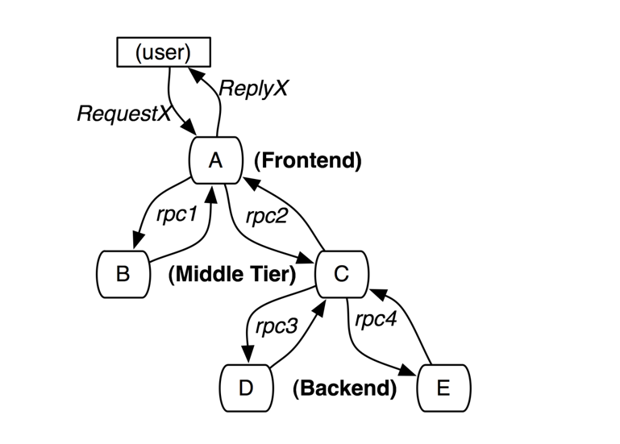
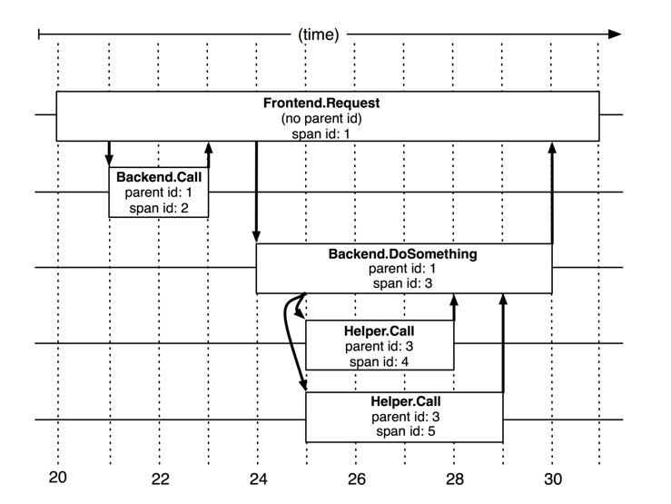

## Introduction

Dapper, Google’s production distributed systems tracing infrastructure, and describe how our design goals of low overhead, application-level transparency, and ubiquitous deployment on a very large scale system were met.

Web-search users are sensitive to delays, which can be caused by poor performance in any sub-system.
An engineer looking only at the overall latency may know there is a problem, but may not be able to guess which service is at fault, nor why it is behaving poorly.

- First, the engineer may not be aware precisely which services are in use; new services and pieces may be added and modified from week to week, both to add user-visible features and to improve other aspects such as performance or security.
- Second, the engineer will not be an expert on the internals of every service; each one is built and maintained by a different team.
- Third, services and machines may be shared simultaneously by many different clients, so a performance artifact may be due to the behavior of another application.
  For example, front-ends may handle many different request types, or a storage system such as [Bigtable](/docs/CS/Distributed/Bigtable.md) may be most efficient when shared across multiple applications.

Three concrete design goals result from these requirements:

- **Low overhead**: the tracing system should have negligible performance impact on running services.
  In some highly optimized services even small monitoring overheads are easily noticeable, and might compel the deployment teams to turn the tracing system off.
- **Application-level transparency**: programmers should not need to be aware of the tracing system.
  A tracing infrastructure that relies on active collaboration from application-level developers in order to function becomes extremely fragile, and is often broken due to instrumentation bugs or omissions, therefore violating the ubiquity requirement.
  This is especially important in a fast-paced development environment such as ours.
- **Scalability**: it needs to handle the size of Google’s services and clusters for at least the next few years.

An additional design goal is for tracing data to be available for analysis quickly after it is generated: ideally within a minute.
Although a trace analysis system operating on hours-old data is still quite valuable, the availability of fresh information enables faster reaction to production anomalies.

## Tracing

A tracing infrastructure for distributed services needs to record information about all the work done in a system on behalf of a given initiator.
For example, Figure 1 shows a service with 5 servers: a front-end (A), two middle-tiers (B and C) and two backends (D and E).
When a user request (the initiator in this case) arrives at the front end, it sends two RPCs to servers B and C.
B can respond right away, but C requires work from backends D and E before it can reply to A, which in turn responds to the originating request.
A simple yet useful distributed trace for this request would be a collection of message identifiers and timestamped events for every message sent and received at each server.

Fig.1. The path taken through a simple serving system on behalf of user request X. The letter-labeled nodes represent processes in a distributed system.

Formally, we model Dapper traces using trees, spans, and annotations.

### Trace trees and spans

In a Dapper trace tree, the tree nodes are basic units of work which we refer to as spans.
The edges indicate a casual relationship between a span and its parent span.
Independent of its place in a larger trace tree, though, a span is also a simple log of timestamped records which encode the span’s start and end time, any RPC timing data, and zero or more application-specific annotations.

Dapper records a human-readable *span name* for each span, as well as a *span id* and *parent id* in order to reconstruct the causal relationships between the individual spans in a single distributed trace.
Spans created without a parent id are known as *root spans*.
All spans associated with a specific trace also share a common *trace id*.
All of these ids are probabilistically unique 64-bit integers.
In a typical Dapper trace we expect to find a single span for each RPC, and each additional tier of infrastructure adds an additional level of depth to the trace tree.

Fig.2. The causal and temporal relationships between five spans in a Dapper trace tree.

### Annotations

## Trace Collection

The Dapper trace logging and collection pipeline is a three-stage process.
First, span data is written to local log files.
It is then pulled from all production hosts by Dapper daemons and collection infrastructure and finally written to a cell in one of several regional Dapper Bigtable repositories.
A trace is laid out as a single Bigtable row, with each column corresponding to a span.
Bigtable’s support for sparse table layouts is useful here since individual traces can have an arbitrary number of spans.
The median latency for trace data collection – that is, the time it takes data to propagate from instrumented application binaries to the central repository – is less than 15 seconds.

Dapper also provides an API to simplify access to the trace data in our repository.
Developers at Google use this API to build both general-purpose and applicationspecific analysis tools.

### Security

## Transparent

Dapper is able to follow distributed control paths with near-zero intervention from application developers by relying almost entirely on instrumentation of a few common libraries:

- When a thread handles a traced control path, Dapper attaches a trace context to thread-local storage.
  A trace context is a small and easily copyable container of span attributes such as trace and span ids.
- When computation is deferred or made asynchronous, most Google developers use a common control flow library to construct callbacks and schedule them in a thread pool or other executor.
  Dapper ensures that all such callbacks store the trace context of their creator, and this trace context is associated with the appropriate thread when the callback is invoked.
  In this way, the Dapper ids used for trace reconstruction are able to follow asynchronous control paths transparently.
- Nearly all of Google’s inter-process communication is built around a single RPC framework with bindings in both C++ and Java.
  We have instrumented that framework to define spans around all RPCs.
  The span and trace ids are transmitted from client to server for traced RPCs. For RPC-based systems like those in wide use at Google, this is an essential instrumentation point.
  We plan to instrument nonRPC communication frameworks as they evolve and find a user base.

## Sampling

### Adaptive Sampling

## Links

- [Google](/docs/CS/Distributed/Google.md)

## References

1. [Dapper, a Large-Scale Distributed Systems Tracing Infrastructure](https://www.researchgate.net/publication/239595848_Dapper_a_Large-Scale_Distributed_Systems_Tracing_Infrastructure)
