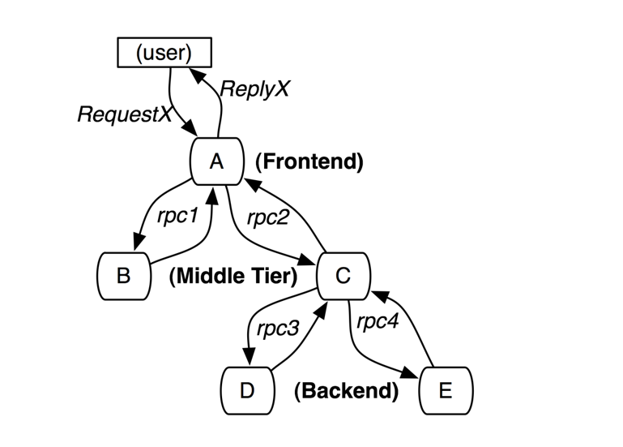
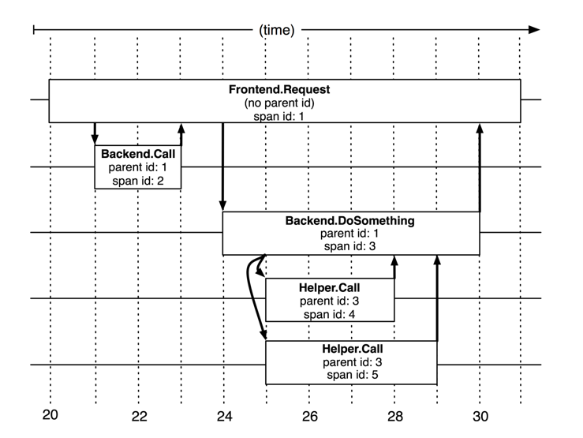

## Introduction

Dapper 是 Google 生产环境中的分布式系统追踪基础设施，满足了低开销、应用层透明以及在大规模系统中普遍部署的设计目标。

Web 搜索用户对延迟非常敏感，任何子系统的性能问题都可能导致延迟。
如果工程师只关注整体延迟，可能知道存在问题，但无法判断是哪个服务出错，也无法知道其表现不佳的原因。

- 首先，工程师可能不清楚具体使用了哪些服务；新服务和组件会不断添加和修改，既有用户可见的功能改进，也有性能或安全性方面的优化。
- 其次，工程师不可能成为每个服务内部机制的专家；每个服务都由不同的团队构建和维护。
- 第三，服务和机器可能同时被许多不同的客户端共享，因此性能问题可能是由其他应用程序的行为导致的。
  例如，前端可能处理多种不同类型的请求，或者像 [Bigtable](/docs/CS/Distributed/Bigtable.md) 这样的存储系统在跨多个应用共享时效率最高。

这些需求引出了三个具体的设计目标：

- **低开销**：追踪系统对运行中的服务应具有可忽略的性能影响。
  在一些高度优化的服务中，即便是很小的监控开销也会被注意到，可能迫使部署团队关闭追踪系统。
- **应用层透明**：程序员不需要感知追踪系统的存在。
  依赖应用层开发者主动协作才能运行的追踪基础设施会变得极其脆弱，常因埋点错误或遗漏而中断，从而违背普遍部署的要求。
  这在我们快速迭代的开发环境中尤为重要。
- **可扩展性**：需要能够在未来几年内处理 Google 服务和集群的规模。

另一个设计目标是追踪数据在生成后能够尽快用于分析：理想情况下在一分钟内。
虽然基于数小时前的数据进行分析仍然有价值，但获取实时信息能够更快地响应生产环境中的异常。

## Tracing

分布式服务的追踪基础设施需要记录系统中为某个特定发起者执行的所有工作信息。
例如，图 1 展示了一个包含 5 个服务器的服务：一个前端（A）、两个中间层（B 和 C）以及两个后端（D 和 E）。
当用户请求（此场景中的发起者）到达前端时，它会向服务器 B 和 C 发送两个 RPC。
B 可以立即响应，但 C 需要后端 D 和 E 完成工作后才能回复 A，A 再响应原始请求。
对于此请求，一个简单而有用的分布式追踪就是收集每个服务器上发送和接收的每条消息的消息标识符和时间戳事件。

Fig.1. 代表用户请求 X 经过的简单服务系统路径。字母标记的节点代表分布式系统中的进程。

形式上，我们使用树、span 和注解来建模 Dapper 追踪。

### Trace trees and spans

在 Dapper 追踪树中，树节点是基本工作单元，我们称之为 span。
边表示 span 与其父 span 之间的因果关系。
不过，独立于其在更大追踪树中的位置，span 也是一个简单的时间戳记录日志，包含 span 的开始和结束时间、RPC 时序数据以及零个或多个应用特定注解。

Dapper 为每个 span 记录一个人类可读的 **span 名称**，以及一个 **span id** 和 **parent id**，以便在单个分布式追踪中重建各个 span 之间的因果关系。
没有父 id 创建的 span 称为 **根 span**。
与特定追踪相关的所有 span 共享一个共同的 **trace id**。
所有这些 id 都是概率唯一的 64 位整数。
在典型的 Dapper 追踪中，每个 RPC 对应一个 span，每增加一层基础设施，追踪树就增加一层深度。

Fig.2. Dapper 追踪树中五个 span 之间的因果关系和时间关系。

### Annotations

## Trace Collection

Dapper 的追踪日志记录和收集流水线分为三个阶段。
首先，span 数据被写入本地日志文件。
然后，由 Dapper 守护进程和收集基础设施从所有生产主机拉取数据，最后写入某个区域 Dapper Bigtable 仓库中的一个单元。
一个追踪被布局为单个 Bigtable 行，每一列对应一个 span。
Bigtable 对稀疏表布局的支持在此非常有用，因为单个追踪可以有任意数量的 span。
追踪数据收集的中位延迟——即数据从埋点应用二进制文件传播到中央仓库的时间——低于 15 秒。

Dapper 还提供了 API 以简化对仓库中追踪数据的访问。
Google 的开发者使用此 API 构建通用和特定于应用的分析工具。

### Security

## Transparent

Dapper 能够以接近零的应用开发者干预来追踪分布式控制路径，这几乎完全依赖于对几个公共库的埋点：

- 当线程处理被追踪的控制路径时，Dapper 将追踪上下文附加到线程局部存储中。
  追踪上下文是一个小巧且易于复制的容器，包含 trace 和 span id 等 span 属性。
- 当计算被延迟或异步执行时，大多数 Google 开发者使用一个公共的控制流库来构造回调并将其调度到线程池或其他执行器中。
  Dapper 确保所有这些回调都存储其创建者的追踪上下文，并且在回调被调用时，该追踪上下文与相应的线程关联。
  通过这种方式，用于追踪重建的 Dapper id 能够透明地跟随异步控制路径。
- 几乎所有 Google 的进程间通信都围绕一个单一的 RPC 框架构建，该框架支持 C++ 和 Java 绑定。
  我们对该框架进行了埋点，以在所有 RPC 上定义 span。
  Span 和 trace id 在追踪的 RPC 中从客户端传输到服务器。
  对于像 Google 广泛使用的基于 RPC 的系统，这是一个关键的埋点位置。
  我们计划在非 RPC 通信框架发展和积累用户群时对其进行埋点。

## Sampling

### Adaptive Sampling

## Links

- [Google](/docs/CS/Distributed/Google.md)

## References

1. [Dapper, a Large-Scale Distributed Systems Tracing Infrastructure](https://www.researchgate.net/publication/239595848_Dapper_a_Large-Scale_Distributed_Systems_Tracing_Infrastructure)
