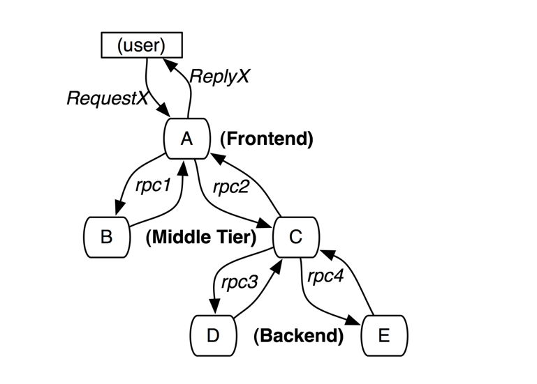
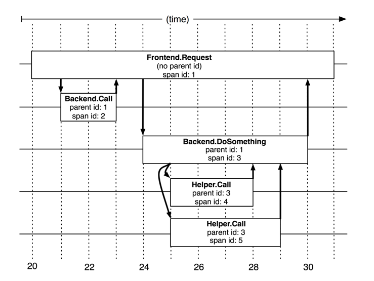

## Introduction

Dapper 是 Google 的生产级分布式系统追踪（tracing）基础设施；本文描述我们如何在低开销、应用层透明（application-level transparency），以及在超大规模系统上普遍部署等设计目标得以实现。

Web 搜索用户对延迟很敏感，而延迟可能由任何子系统的不良性能引起。
仅关注整体延迟的工程师可能知道存在问题，却无法猜测是哪个服务出了故障，也无法解释它为何表现不佳。

- 第一，工程师可能并不确切知道正在使用哪些服务；新服务和组件可能每周都被添加和修改，既用于增加用户可见的功能，也用于改进性能或安全等其他方面。
- 第二，工程师不会是每项服务内部机制的专家；每一项都由不同团队构建和维护。
- 第三，服务和机器可能同时被许多不同客户端共享，因此性能异常可能由另一个应用的行为导致。
  例如，前端可能处理多种不同的请求类型，或者像 [Bigtable](/docs/CS/Distributed/Bigtable.md) 这样的存储系统在跨多个应用共享时可能最为高效。

这些需求产生了三个具体的设计目标：

- **低开销（Low overhead）**：追踪系统对运行中的服务应当只有可忽略的性能影响。
  在某些高度优化的服务中，即便很小的监控开销也很容易被注意到，并可能迫使部署团队关闭追踪系统。
- **应用层透明（Application-level transparency）**：程序员无需知晓追踪系统的存在。
  一个依赖应用层开发者主动配合才能运作的追踪基础设施会变得极为脆弱，并常常因埋点（instrumentation）缺陷或遗漏而失效，从而违背普遍部署的要求。
  在我们这样快节奏的开发环境中，这一点尤为重要。
- **可扩展性（Scalability）**：它需要处理 Google 服务与集群的规模，至少满足未来几年。

一个额外的设计目标是：追踪数据在生成后能很快用于分析，理想情况下在一分钟之内。
尽管运行在数小时前数据上的追踪分析系统仍然很有价值，但新鲜信息的可用性使得对生产异常的响应更快。

## 追踪

面向分布式服务的追踪基础设施需要记录系统中代表给定发起者（initiator）所完成的所有工作的信息。
例如，图 1 展示了一个包含 5 台服务器的服务：一个前端（A）、两个中间层（B 和 C）以及两个后端（D 和 E）。
当用户请求（此处即发起者）到达前端时，它向服务器 B 和 C 发送两个 RPC。
B 可以立即响应，但 C 需要来自后端 D 和 E 的工作才能回复 A，而 A 再回复原始请求。
针对该请求的一个简单而有用的分布式追踪，将是每个服务器收发每条消息的消息标识符与带时间戳事件的集合。

Fig.1. The path taken through a simple serving system on behalf of user request X. The letter-labeled nodes represent processes in a distributed system.

形式上，我们用树（trees）、跨度（spans）和注解（annotations）为 Dapper 追踪建模。

### 追踪树与跨度

在 Dapper 追踪树中，树节点是我们称为跨度（span）的基本工作单元。
边表示跨度与其父跨度之间的因果关系（casual relationship）。
不过，独立于它在更大追踪树中的位置，一个跨度也是一个简单的带时间戳记录日志，它编码了跨度的起止时间、任意 RPC 时序数据，以及零个或多个应用特定的注解（annotation）。

Dapper 为每个跨度记录一个可读的*跨度名（span name）*，以及*跨度 id（span id）*和*父 id（parent id）*，以重建单次分布式追踪中各个跨度之间的因果关系。
没有父 id 的跨度称为*根跨度（root span）*。
与特定追踪关联的所有跨度还共享一个公共的*追踪 id（trace id）*。
所有这些 id 都是概率意义上唯一的 64 位整数。
在一个典型的 Dapper 追踪中，我们期望为每个 RPC 找到一个跨度，而每多一层基础设施就会给追踪树增加一级深度。

Fig.2. The causal and temporal relationships between five spans in a Dapper trace tree.

### 注解

## 追踪收集

Dapper 的追踪日志与收集流水线是一个三阶段过程。
首先，跨度数据被写入本地日志文件。
随后它被 Dapper 守护进程和收集基础设施从所有生产主机拉取，最终写入若干区域 Dapper Bigtable 仓库中某个 cell 的 Bigtable。
一条追踪被布局为单个 Bigtable 行，每一列对应一个跨度。
Bigtable 对稀疏表布局的支持在这里很有用，因为单个追踪可以有任意数量的跨度。
追踪数据收集的中位延迟——即数据从被埋点的应用二进制程序传播到中央仓库所花的时间——小于 15 秒。

Dapper 还提供一个 API 以简化对仓库中追踪数据的访问。
Google 的开发者用这个 API 构建通用和特定于应用的分析工具。

### 安全性

## 透明

Dapper 能够近乎零干预地跟随分布式控制路径，这几乎完全依赖于对少数几个通用库的埋点（instrumentation）：

- 当某个线程处理一条被追踪的控制路径时，Dapper 将一个追踪上下文（trace context）附加到线程本地存储（thread-local storage）。
  追踪上下文是一个小巧且易于复制的容器，保存跨度属性（如 trace 和 span id）。
- 当计算被推迟或以异步方式进行时，大多数 Google 开发者使用一个通用控制流库来构造回调，并将其调度到线程池或其他执行器（executor）中。
  Dapper 确保所有此类回调都保存其创建者的追踪上下文，并且该追踪上下文在回调被调用时与相应线程关联。
  这样，用于追踪重建的 Dapper id 就能透明地跟随异步控制路径。
- 几乎 Google 所有的进程间通信都围绕一个单一的 RPC 框架构建，该框架有 C++ 和 Java 两种绑定。
  我们已对该框架做埋点，以在所有 RPC 周围定义跨度。
  对于被追踪的 RPC，跨度 id 与追踪 id 从客户端传送到服务器。对于像 Google 中广泛使用的这类基于 RPC 的系统，这是一个必要的埋点位置。
  我们计划在相关非 RPC 通信框架演进并获得用户基础时对其做埋点。

## 采样

### 自适应采样

## Links

- [Google](/docs/CS/Distributed/Google.md)

## References

1. [Dapper, a Large-Scale Distributed Systems Tracing Infrastructure](https://www.researchgate.net/publication/239595848_Dapper_a_Large-Scale_Distributed_Systems_Tracing_Infrastructure)
