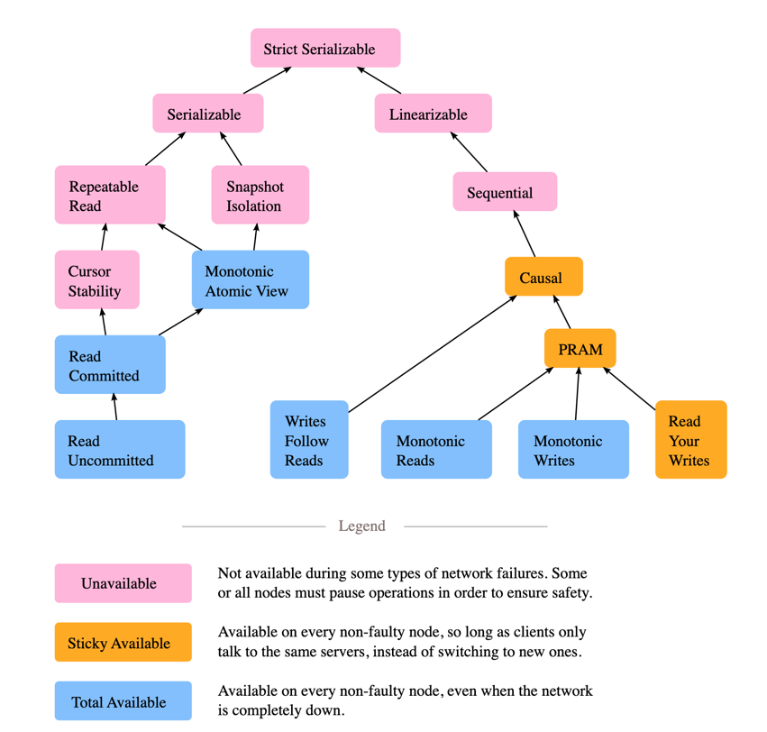
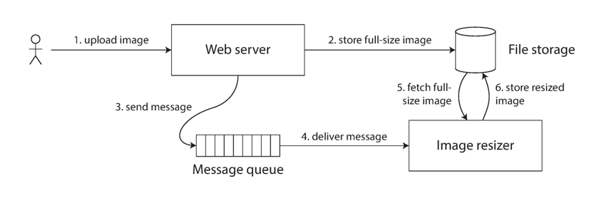
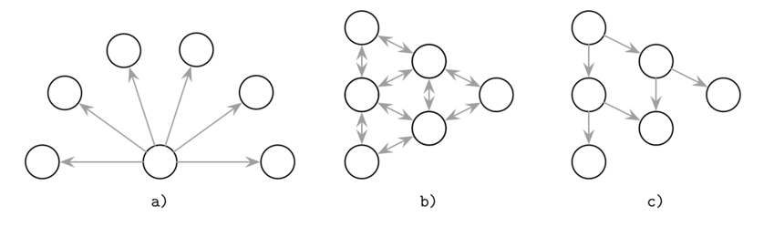

## Introduction

分布式系统解决了什么问题

- 分布式系统解决了单机性能瓶颈导致的成本问题
- 提高可用性的要求
- 解决了用户量和数据量爆炸性地增大导致的成本问题
- 分布式系统解决了大规模软件系统的迭代效率和成本的问题

所谓分布式系统，是指其组件分布在联网的计算机上，彼此仅通过**传递消息**来通信和协调行动。
这一定义引出了分布式系统几个尤为重要的特征：组件的并发性、缺乏全局时钟，以及组件的独立失效。

构建分布式系统所面临的挑战来自：组件的异构性、开放性（允许组件被添加或替换）、安全性、可扩展性（在负载或用户数增长时仍能良好工作）、故障处理、组件并发、透明性，以及提供服务质量。

要真正做到可靠，一个分布式系统必须具备以下特征：

- 容错（Fault-Tolerant）：能在组件失效后恢复，且不执行错误的动作。
- 高可用（Highly Available）：能够恢复运行，即使部分组件已失效，也能继续提供服务。
- 可恢复（Recoverable）：失效组件在故障原因被修复后，能够自我重启并重新加入系统。
- 一致性（Consistent）：系统能够在并发与失效并存的情况下，协调多个组件的行动。这正是分布式系统之所以能表现得像非分布式系统的根基。
- 可扩展（Scalable）：即使系统的某个方面被放大，它仍能正确运行。例如，我们可以增大其所运行网络的规模，但这会提高网络中断的频率，并使"不可扩展"的系统退化；同样，增加用户数、服务器数或整体负载，在可扩展系统中不应产生显著影响。
- 可预期性能（Predictable Performance）：能够适时地提供期望的响应能力。
- 安全（Secure）：系统对数据与服务的访问进行鉴权。

## Trouble with Distributed Systems

分布式系统中可能发生的失效类型包括：

- 停机失效（Halting failures）：某个组件直接停止。除了靠超时检测，没有别的办法：它要么不再发送"我还活着"（心跳）消息，要么不再响应请求。
- 失效-停止（Fail-stop）：带有某种通知其他组件的停机失效。一个网络文件服务器在即将下线时告知其客户端，这就是 fail-stop。
- 遗漏失效（Omission failures）：主要由于缓冲空间不足，导致消息未被发送或接收，消息被丢弃，且对发送方和接收方都没有通知。路由器过载时就可能发生。
- 网络失效（Network failures）：一条网络链路断开。
- 网络分区失效（Network partition failure）：网络分裂成两个或多个互不相交的子网，子网内部可以收发消息，但子网之间消息丢失。这往往由网络失效引起。
- 时序失效（Timing failures）：系统某个时间相关属性被违反。例如，用来协调进程的、不同计算机上的时钟未同步；或一条消息的延迟超过了阈值周期等。
- 拜占庭失效（Byzantine failures）：涵盖多种错误行为，包括数据损坏或丢失、由恶意程序引起的失效等。

我们的目标是设计出具备上述特征（容错、高可用、可恢复等）的分布式系统，这意味着我们必须为失效而设计。

### Failures and Partial Outages

在分布式系统中，即便系统的其他部分工作正常，也很可能有某些部分以某种不可预测的方式坏掉了。这就是所谓的*局部失效*（partial failure）。
难点在于，局部失效是*非确定性的*：当你试图做任何涉及多个节点和网络的事情时，它有时成功，有时又会不可预测地失败。
正如我们将看到的，你甚至可能不知道某件事到底成功没有——因为消息跨越网络所需的时长本身也是非确定性的！

正是这种非确定性与局部失效的可能性，让分布式系统难以驾驭。

如果我们想让分布式系统工作，就必须接受局部失效的可能性，并把容错机制构建进软件之中。
换句话说，**我们需要用不可靠的组件构建出一个可靠的系统**。

### Unreliable Networks

每个初次构建分布式系统的人，都会默认以下八个假设。

[分布式计算的 8 个谬误](https://arnon.me/wp-content/uploads/Files/fallacies.pdf) 如下：

1. **网络是可靠的。**
   我们可以**自动重试**。消息队列就很擅长这点。但这会给系统设计带来很大影响——你从请求/响应模型转向了"发完就忘"（fire and forget）。
2. **延迟为零。**
   你的应用应当对网络有感知，也就是明确区分本地调用与远程调用。一种可能的办法是把数据移近客户端。
3. **带宽是无限的。**
   第二个谬误（延迟非零）与第三个谬误（带宽无限）之间存在张力。
   你应当传输更多数据以减少网络往返次数，又应当传输更少数据以降低带宽占用。你需要在两股力量间取得平衡，找到合适的传输量。
   所以，只传输你可能真正需要的数据。
4. **网络是安全的。**
   分布式系统中有大量组件与链路，每一个都是恶意用户可能的攻击目标。
   业务需要权衡遭受攻击的风险与概率，以及实施防护机制的成本。
5. **拓扑不会变化。**
   如今，随着云与容器的兴起，这个谬误很难被忽视。你要做的第一件事，就是抽象出网络的物理结构。
6. **只有一个管理员。**
   可能出错的地方很多：配置是一例，系统升级是另一例。
   要绕过这个谬误，你需要让你的系统易于管理。DevOps、日志与监控都能帮上忙。
7. **传输成本为零。**
   你应当留意传输成本，以及你的应用做了多少序列化与反序列化。这并非说你要去优化，除非确有需要。
8. **网络是同构的。**
   你需要确保系统的组件能够彼此对话。使用私有协议会损害应用的可互操作性。

分布式系统中关于"达成一致"最著名的描述之一，是一个广为人知的思想实验——*两将军问题*（Two Generals' Problem）。
这个思想实验表明：在链路失效且通信是异步的情况下，要让两方达成一致是不可能的。

两将军问题已被证明不可解。

### Unreliable Clocks

#### Monotonic Clocks and Calendar Clocks

现代计算机至少有两种不同的时钟：*日历时钟*（time-of-day clock，也叫墙上时钟）和*单调时钟*（monotonic clock）。

日历时钟做你直觉上期望时钟做的事：它按照某种日历返回当前的日期与时间（即墙上时间）。
例如，Linux 上的 `clock_gettime(CLOCK_REALTIME)` 与 Java 中的 `System.currentTimeMillis()` 返回的是自纪元（1970 年 1 月 1 日 UTC 午夜，按格里高利历，不计入闰秒）以来的秒数（或毫秒）。有些系统使用其它日期作为参考点。

日历时钟通常用 NTP 同步，这意味着（理想情况下）一台机器上的时间戳与另一台机器上的时间戳含义相同。
不过，日历时钟也有各种怪异之处，下一节会描述。尤其值得注意的是，如果本地时钟领先 NTP 服务器太多，它可能被强制回拨，看起来像是跳回了之前某个时间点。
这些回拨，加上它们常常忽略闰秒，使得日历时钟不适合用来测量经过的时间。历史上，日历时钟的分辨率也很粗——例如在老版 Windows 上以 10ms 的步长向前跳。在较新的系统上，这已不太成问题。

单调时钟适合用来测量一段时长（时间间隔），例如超时或服务响应时间：Linux 上的 `clock_gettime(CLOCK_MONOTONIC)` 与 Java 中的 `System.nanoTime()` 就是单调时钟的例子。
其名称来源于"它们保证始终向前"（而日历时钟可能跳回过去）。

你可以在某个时间点读取单调时钟的值，做点事情，之后再在稍后某个时间点再次读取。两次值的差，就是两次检查之间经过的时间。
不过，时钟的绝对值毫无意义：它可能是计算机启动以来的纳秒数，或者某个同样任意的值。特别地，比较两台不同计算机的单调时钟值是没有意义的，因为它们不代表同一回事。
<br>
在多 CPU 插槽的服务器上，每个 CPU 可能各有一个定时器，彼此未必同步。
操作系统会补偿这种差异，并尽量向应用线程呈现一个单调的时钟视图，即便这些线程被调度到了不同的 CPU 上。
不过，对"单调性"这一保证，最好还是半信半疑。

如果 NTP 检测到计算机的本地石英钟比 NTP 服务器快或慢，它会调整单调时钟向前走的速率（这称为对时钟*slewing*，即放慢/加速）。
默认情况下，NTP 允许时钟速率在 ±0.05% 范围内调整，但 NTP 不能让单调时钟向前或向后跳变。
单调时钟的分辨率通常相当好：在大多数系统上它们能以微秒甚至更细的粒度测量时间间隔。
在分布式系统中，用单调时钟测量经过的时间（例如超时）通常没问题，因为它不假设不同节点时钟之间的任何同步，也不对测量的微小误差敏感。

单调时钟不需要同步，但日历时钟需要按照 NTP 服务器或其它外部时间源来设置才有用。
遗憾的是，我们让时钟报出正确时间的方法，远没有你希望的那么可靠或精确——硬件时钟和 NTP 都是善变的家伙。

#### Confidence Intervals

你也许能以微秒甚至纳秒的分辨率读取一台机器的日历时钟。
但即使你能得到如此精细的测量值，也不意味着这个值的真实精度就达到那个级别。
事实上，它很可能没有达到——如前所述，即使你每分钟都与局域网内的 NTP 服务器同步，一个不精确的石英钟的漂移也很容易达到数毫秒。
若使用公网上的 NTP 服务器，最佳精度大概在几十毫秒量级，而在网络拥塞时误差很容易飙到 100ms 以上。

因此，把一次时钟读数看作"一个时间点"是没有意义的——它更像一个时间范围，处在一个置信区间内：
例如，一个系统可能有 95% 的把握认为"现在"是在某分钟的第 10.3 到 10.5 秒之间，但它无法知道得更精确。
如果我们只知道时间 ±100ms，那么时间戳里的微秒位本质上是无意义的。

不确定性边界可以根据你的时间源来计算。
如果你直接在计算机上挂了 GPS 接收器或原子（铯）钟，制造商会给出预期的误差范围。
如果你从服务器获取时间，不确定性则基于：你上次与该服务器同步以来的预期石英漂移，加上 NTP 服务器自身的不确定性，再加上到服务器的网络往返时间（一阶近似，且假设你信任该服务器）。
遗憾的是，大多数系统并不暴露这种不确定性：例如你调用 `clock_gettime()` 时，返回值并不告诉你这个时间戳的预期误差，所以你无从知道它的置信区间是 5 毫秒还是 5 年。

一个有趣的例外是 Google 在 [Spanner](/docs/CS/Distributed/Spanner.md) 中的 TrueTime API，它显式地报告本地时钟的置信区间。
当你向它询问当前时间，你会得到两个值：`[earliest, latest]`，分别是可能的最早与最晚时间戳。
基于其不确定性计算，时钟知道真实当前时间就落在这个区间内的某处。
区间的宽度，除其它因素外，取决于自本地石英钟上一次与更精确时钟源同步以来过去了多久。

### Knowledge, Truth, and Lies

#### Byzantine Problem

[拜占庭问题](/docs/CS/Distributed/Byzantine.md)

## System Model and Reality

人们设计了许多算法来解决分布式系统的问题。
为了让这些算法有用，它们需要容忍我们前面讨论过的各种分布式系统失效。

算法应当以一种不过度依赖其运行所在软硬件配置细节的方式编写。
这反过来要求我们以某种方式形式化地描述系统中预期会发生的失效种类。
我们通过定义一个*系统模型*（system model）来做到这一点——它是一种抽象，描述了一个算法可以做出哪些假设。

就时序假设而言，有三种常用的系统模型：

- *同步模型*<br>
  同步模型假设有界的网络延迟、有界的进程暂停，以及有界的时钟误差。
  这并不意味着时钟完全同步或网络延迟为零，只是说你知道网络延迟、暂停和时钟漂移永远不会超过某个固定的上界。
  同步模型对大多数实际系统而言并不现实，因为无界延迟和暂停确实会发生。
- *半同步模型*（Partially synchronous model）<br>
  半同步意味着系统大部分时间表现得像同步系统，但偶尔会超出网络延迟、进程暂停和时钟漂移的界限。
  这是对许多系统都成立的现实模型：大多数时候，网络和进程都相当"乖"——否则我们根本没法干活——但我们必须考虑到，任何时序假设都可能偶尔被打破。
  一旦发生，网络延迟、暂停和时钟误差可能变得任意大。
- *异步模型*<br>
  在这个模型中，算法不允许做任何时序假设——事实上它连时钟都没有（因此不能使用超时）。
  有些算法可以面向异步模型设计，但它非常受限。

此外，除了时序问题，我们还得考虑节点失效。最常见的三种节点失效模型是：

- 崩溃-停止（Crash-stop）失效
  在崩溃-停止模型中，算法可以假设一个节点只会以唯一一种方式失效，即崩溃。
  这意味着节点可能在任何时刻突然停止响应，此后该节点永远消失——它不会再回来。
- 崩溃-恢复（Crash-recovery）失效
  我们假设节点可能在任何时刻崩溃，并可能在某个未知时间后重新开始响应。
  在崩溃-恢复模型中，假设节点拥有稳定存储（即非易失磁盘存储），它能跨崩溃保留；而内存状态则假设会丢失。
- 拜占庭（任意）失效
  节点可以做任何事，包括试图欺骗其它节点。

对真实系统建模时，带崩溃-恢复失效的半同步模型通常是最有用的模型。

### Correctness of the Algorithm

为了定义"一个算法是正确的"意味着什么，我们可以描述它的性质。
我们可以写下对分布式算法想要的性质，来定义正确性的含义。
例如，如果我们在为某个锁生成栅栏令牌（fencing token），我们可能要求算法具备以下性质：

- 唯一性（Uniqueness）
  两笔获取栅栏令牌的请求不会返回相同的值。
- 单调序列（Monotonic sequence）
  如果请求 x 返回令牌 tx、请求 y 返回令牌 ty，且 x 在 y 开始前就已完成，那么 tx < ty。
- 可用性（Availability）
  一个请求了栅栏令牌且未崩溃的节点，最终会收到响应。

一个算法在某个系统模型下是正确的，当且仅当它在我们假定该模型可能发生的所有情形下，始终满足其性质。但这如何成立呢？
如果所有节点都崩溃，或者所有网络延迟突然变成无限长，那么没有任何算法能做成任何事。

#### Safety and Liveness

为了澄清状况，值得区分两类不同的性质：*安全性*（safety）和*活性*（liveness）。
在上述例子中，*唯一性*和*单调序列*是安全性性质，而*可用性*是活性性质。
两者的区别是什么？一个标志是：活性性质的定义中常常包含"最终"（eventually）这个词。（*最终一致性*就是一种活性性质。）

安全性常被非正式地定义为"坏事不会发生"，活性被定义为"好事最终会发生"。
不过，最好不要过度解读这些非正式定义，因为"好"与"坏"的含义是主观的。
安全性与活性的真正定义是精确且数学化的：

- 如果一个安全性性质被违反，我们可以指着某个特定的时间点点明它在那一刻被打破（例如，如果唯一性被违反，我们可以指出那次返回了重复栅栏令牌的特定操作）。
  安全性被破坏之后，破坏无法撤销——损害已经造成。
- 活性性质则相反：它在某个时间点可能并不成立（例如，一个节点可能已经发出了请求但尚未收到响应），但总存在它在未来被满足的希望（即收到响应）。

区分安全性与活性性质的一个好处，是它帮助我们应对困难的系统模型。
对分布式算法，通常要求安全性性质在所有可能的系统模型情形下始终成立。
也就是说，即使所有节点都崩溃、或整个网络失效，算法也必须保证不返回错误结果（即安全性性质依然满足）。

然而，对活性性质，我们被允许附加前提条件：例如我们可以说，仅当多数节点没有崩溃、且网络最终从中断中恢复时，一个请求才需要收到响应。
半同步模型的定义本身就要求系统最终回到同步状态——也就是说，任何网络中断只持续有限时长，随后被修复。

## Consistency and Consensus

构建容错系统的最佳方式，是找到一些带有有用保证的、通用目的的抽象，实现它们一次，然后让应用依赖这些保证。这与我们在[事务](/docs/CS/SE/Transaction.md)上采用的方法相同：
通过使用事务，应用可以假装没有崩溃（原子性）、假装没有别人在并发访问数据库（隔离性）、并假装存储设备绝对可靠（持久性）。
尽管崩溃、竞态条件和磁盘失效确实会发生，事务抽象把这些麻烦隐藏了起来，应用无需担心。

我们现在沿着同样的思路继续，去寻找能让应用忽略部分分布式系统问题的抽象。
例如，分布式系统最重要的抽象之一便是*共识*（consensus）：即让所有节点就某件事达成一致。

分布式一致性模型与[事务隔离级别](/docs/CS/SE/Transaction.md?id=isolation-levels)的层次结构有一定相似性。
但尽管有重叠，它们基本是独立的两件事：事务隔离主要关乎如何避免并发执行事务带来的竞态条件，而分布式一致性主要关乎如何在延迟与失效面前协调副本的状态。

### Consistency Models

当多个客户端同时、或在很短的间隔内读取或修改数据的不同副本时，会发生什么？
这个问题没有唯一正确的答案，因为这些语义随应用而不同，但它们在一致性模型的语境下已被充分研究。

一个历史（history）是一组操作及其并发结构的集合。
一个一致性模型就是一组历史的集合。
一致性模型描述了：尽管存在数据的多个副本与并发访问，客户端对可能返回的值可以有哪些预期。

*一致性模型*提供不同的语义与保证。
你可以把一致性模型理解为参与者之间的一份契约：每个副本必须做些什么来满足所需语义，以及用户在发起读写操作时可以期待什么。

来自 [Jepsen Consistency Models](https://jepsen.io/consistency)：

<div style="text-align: center;">



</div>

<p style="text-align: center;">
Fig.1. Consistency Models
</p>

#### Linearizability

线性一致性（Linearizability）是最强的单对象一致性模型之一，它意味着每个操作看起来都以某种顺序原子地发生，且该顺序与这些操作的**真实时间顺序**一致：例如，若操作 A 在操作 B 开始之前完成，那么 B 在逻辑上应在 A 之后生效。

当真实时间约束不重要、但你仍希望每个进程观察到相同的全序时，可以看[顺序一致性](/docs/CS/Distributed/Distributed.md?id=sequential-consistency)。

并发操作被表示为满足可见性性质的、可能的顺序历史之一。线性一致性中存在一定的非确定性，因为事件的排序方式可能不止一种。

如果两个操作重叠，它们可以以任意顺序生效。
在写操作完成之后的所有读操作，都能观察到该写操作的效应。
一旦某个读操作返回了特定值，它之后的所有读都必须返回至少与该值一样新的返回值。

> Herlihy & Wing 在他们 1990 年的论文 [Linearizability: A Correctness Condition for Concurrent Objects](http://cs.brown.edu/~mph/HerlihyW90/p463-herlihy.pdf) 中提出了线性一致性。

在全局历史中，并发事件发生顺序有一定灵活性，但不能被任意重排。
操作结果不能在操作开始之前生效（那需要一个能预测未来操作的神谕）；同时，结果又必须在完成之前生效，否则我们无法定义一个线性化点（linearization point）。

线性一致性既尊重进程本地的顺序，也尊重相对其它进程的并行操作顺序，并由此定义了事件的全序。

这个顺序必须是一致的，也就是说，对共享值的每次读取都应返回在本次读取之前写入该共享变量的最新值，或某个与本次读取重叠的写操作的值。
对共享变量的线性化写访问也隐含了互斥：在两个并发写之间，只有一个能先发生。

尽管操作是并发且有重叠的，它们的效应以"看起来是顺序的"这样一种方式变得可见。没有任何操作是瞬时发生的，但它们仍表现为原子的。

考虑如下历史：

```
Process 1:      Process 2:     Process 3:
write(x, 1)     write(x, 2)    read(x)
read(x)
read(x)
```

在图 11-2 中，我们有三个进程，其中两个对寄存器 x 执行写操作，其初值为 ∅。
读操作可以按如下几种方式观察到这些写：

- a) 第一个读操作可以返回 1、2 或 ∅（初值，即两次写都尚未发生的状态），因为两次写都还在进行中。
  第一次读可以被排在两次写之前、第一次与第二次写之间，或两次写之后。
- b) 第二个读操作只能返回 1 或 2，因为第一次写已经完成，但第二次写尚未返回。
- c) 第三次读只能返回 2，因为第二次写被排在第一次写之后。

##### 线性化点

线性一致性最重要的特性之一是可见性：一旦操作完成，所有人必须都能看到它，系统不能"时光倒流"、撤销它或对某些参与者使其不可见。
换句话说，线性化禁止陈旧读（stale read），并要求读取是单调的。

这一一致性模型最好用原子（即不可打断、不可分割）操作来解释。
操作不必是瞬时的（也不可能有瞬时操作），但它们的效应必须在某个时间点变得可见，营造出"它们是瞬时的"这一错觉。
这个时刻就称为线性化点。

过了写操作的线性化点之后（换言之，当该值对其他进程可见时），每个进程必须看到该操作写入的值，或某个更晚的值（如果还有其它写操作排在它之后）。
一个可见值应当保持稳定，直到下一个值在其之后变得可见，寄存器不应在这两个近期状态之间来回切换。

> [!NOTE]
>
> 如今大多数编程语言都提供原子原语，支持原子写和比较并交换（CAS）操作。
> 与 CAS 不同，原子写操作不关心寄存器当前的值——CAS 只有在先前值未变时，才从一个值迁到下一个值。
> 用 CAS 读取-修改-再写回，比简单地检查并设置值更复杂，因为可能存在 ABA 问题：
> 如果 CAS 期望寄存器中存在值 A，那么即使值 B 被设置、随后又被另外两个并发写操作切回 A，CAS 也会写入成功。
> 换言之，仅凭"值 A 存在"这一事实，并不能保证自上次读取以来该值没有被修改过。

线性化点充当了一个截止线，在其之后操作效应变得可见。
我们可以通过用锁保护临界区、原子读/写、或读-改-写原语来实现它。

图 11-3 表明，线性一致性假设了严格的时间界限、且时钟是真实时间，因此操作效应必须在 t1（操作请求发出时）与 t2（进程收到响应时）之间变得可见。

在一个最终一致的数据库中，如果你在同一时刻向两个不同的副本问同一个问题，可能会得到两个不同的答案。这很令人困惑。
如果数据库能营造出"只有一份副本"（即只有一份数据拷贝）的错觉，岂不是简单得多？
那样每个客户端都会对数据有相同的视图，你也不必担心复制延迟。

这就是*线性一致性*（也称*原子一致性*、*强一致性*、*即时一致性*或*外部一致性*）背后的思想。
其基本思想是：让系统表现得像是只有一份数据拷贝，且对它的所有操作都是原子的。
有了这一保证，即便现实中可能存在多个副本，应用也无需担心它们。

在线性一致性的系统中，一旦某个客户端成功完成一次写，所有从数据库读取的客户端都必须能看到刚写入的值。
维持"只有一份数据拷贝"这一错觉，意味着要保证读到的值是最近、最新的，而不是来自陈旧的缓存或副本。
换句话说，线性一致性是一种"新鲜度保证"（recency guarantee）。

[Linearizability: A Correctness Condition for Concurrent Objects](https://cs.brown.edu/~mph/HerlihyW90/p463-herlihy.pdf)

Viotti 与 Vukolić 用三项集合论约束重述了这个定义：

- SingleOrder（存在某个操作的全序）
- RealTime（与真实时间界限一致）
- RVal（服从关联对象数据类型的单线程法则）

线性一致性是最强的单对象一致性模型之一，意味着每个操作看起来都以某种顺序原子地发生，且该顺序与这些操作的真实时间顺序一致：例如，若操作 A 在操作 B 开始之前完成，那么 B 在逻辑上应在 A 之后生效。

[Testing for Linearizability](http://www.cs.ox.ac.uk/people/gavin.lowe/LinearizabiltyTesting/paper.pdf)

[Faster linearizability checking via P-compositionality](https://arxiv.org/pdf/1504.00204.pdf)

##### 线性一致性与可串行性

线性一致性很容易与[可串行性](/docs/CS/SE/Transaction.md?id=serializability)混淆，因为两个词看起来都像是"可以被排成顺序"的意思。
然而，它们是两种相当不同的保证，区分它们很重要：

- 可串行性（Serializability）是事务的一种隔离性质，每个事务可以读写多个对象（行、文档、记录）。
  它保证事务的行为与"按某种串行顺序执行"（每个事务在下一个开始之前完整运行）时相同。
  该串行顺序与实际运行事务的顺序不同是可以接受的。
- 线性一致性是对寄存器（单个对象）读写的新鲜度保证。
  它不把操作组合成事务，因此它本身不能防止写偏斜（write skew）之类的问题，除非你采取额外措施（如物化冲突）。

一个数据库可能同时提供可串行性与线性一致性，这种组合称为严格可串行性（strict serializability）或强单副本可串行性（strong-1SR，strong one-copy serializability）。
基于两阶段锁或实际串行执行的可串行性实现，通常也是线性一致的。
然而，可串行化快照隔离（serializable snapshot isolation）并不是线性一致的：按其设计，它从一致的快照中读取，以避免读者与写者之间的锁竞争。
一致快照的整个意义就在于它不包含比快照更新的写，因此从快照读出的内容不是线性一致的。

##### 依赖线性一致性

##### 锁与领导者选举

使用单领导者复制的系统，需要确保确实只有一个领导者，而不是多个（脑裂）。
选举领导者的一种方式是使用锁：每个启动的节点都尝试获取锁，成功者成为领导者。
无论这把锁如何实现，它必须是线性一致的：所有节点必须就"哪个节点拥有这把锁"达成一致，否则它毫无用处。
像 Apache ZooKeeper 与 etcd 这样的协调服务，常被用来实现分布式锁与领导者选举。
它们使用共识算法以容错的方式实现线性化操作。

实现锁与领导者选举仍有许多微妙细节，Apache Curator 这类库通过在 ZooKeeper 之上提供更高层的"配方"来帮忙。
不过，一个线性化的存储服务是这些协调任务的基础。

> **严格来说，ZooKeeper 和 etcd 提供线性化写，但读可能是陈旧的，因为默认情况下读可以由任意一个副本提供服务。**
> 你可以可选地请求一次线性化读：etcd 称之为 quorum 读（法定人数读），在 ZooKeeper 中你需要在读之前调用 `sync()`。

分布式锁在一些分布式数据库中也用于更细的粒度，例如 Oracle Real Application Clusters（RAC）。
RAC 在每页磁盘上使用一把锁，多个节点共享访问同一个磁盘存储系统。
由于这些线性化锁处在事务执行的关键路径上，RAC 部署通常会有一条专用的集群互联网络用于数据库节点间通信。

##### 约束与唯一性保证

唯一性约束在数据库中很常见：例如，用户名或邮箱地址必须唯一标识一个用户；在文件存储服务中，不能有两个文件拥有相同的路径和文件名。
如果你想在数据写入时就强制这一约束（即如果两个人试图并发创建同名用户或文件，其中一人会收到错误），你需要线性一致性。

这种情况其实和锁很像：当用户为你的服务注册时，你可以把他们想象成"获取"了所选用户名的"锁"。
这个操作也非常像原子的比较并交换（CAS）：在用户名未被占用的情况下，把用户名设置为认领它的用户的 ID。
如果你要确保每个银行账户余额不为负、不会超卖仓库库存、或不会有两个人并发预订同一航班座位或剧院座位，也会出现类似问题。
这些约束都要求存在一个单一的、最新的值（账户余额、库存水平、座位占用情况），且所有节点都对其达成一致。

在实际应用中，有时可以宽松地对待这类约束（例如航班超售时，你可以把客户改签到另一趟航班并提供补偿）。
这种情况下，可能并不需要线性一致性。

然而，像关系型数据库中常见的那种硬性唯一性约束，需要线性一致性。
其它类型的约束，如外键约束或属性约束，可以在不需要线性一致性的情况下实现。

##### 跨信道时序依赖

例如，假设有一个网站，用户可以上传照片，后台进程把照片缩小为低分辨率以便更快下载（缩略图）。
该系统的架构与数据流如图 9-5 所示。
图像缩放器需要被显式地指示去执行一次缩放任务，而这个指示由 Web 服务器通过消息队列发送给缩放器。
Web 服务器不会把整张照片放到队列里，因为大多数消息代理都是为小消息设计的，而一张照片可能有好几 MB。
相反，照片先被写入一个文件存储服务，一旦写入完成，发给缩放器的指示才被放入队列。

<div style="text-align: center;">



</div>

<p style="text-align: center;">
Fig.4. Web 服务器与图像缩放器既通过文件存储、也通过消息队列通信，从而打开了竞态条件的大门。
</p>

如果文件存储服务是线性一致的，那么这个系统应该能正常工作。
如果它不是线性一致的，就存在竞态条件风险：消息队列（图 4 中的第 3、4 步）可能比存储服务内部的复制更快。
这种情况下，当缩放器去取图像（第 5 步）时，它可能看到图像的旧版本，或根本什么都没看到。
如果它处理的是图像的旧版本，文件存储中的全尺寸与缩放后图像就会永久不一致。
这个问题的根源在于 Web 服务器与缩放器之间存在两种不同的通信信道：文件存储与消息队列。
如果没有线性一致性的新鲜度保证，这两条信道之间就可能发生竞态。

线性一致性并非避免这一竞态的唯一方式，但它最容易理解。
如果你能控制额外的通信信道（如消息队列的情况，但 Alice 和 Bob 的情况就不是），你可以使用类似于我们在"[Reading Your Own Writes](/docs/CS/Distributed/Replica.md?id=read-after-write)"中讨论的替代方案，代价是额外的复杂度。

##### 实现线性化系统

我们来想想如何实现提供线性化语义的系统。
由于线性一致性本质上意味着"表现得像只有一份数据拷贝、且对它的所有操作都是原子的"，最简单的答案就是真的只用一份数据拷贝。
然而，这种方式无法容忍失效：如果持有这份拷贝的节点失效，数据就会丢失，或至少在该节点重新上线前无法访问。

让系统具备容错能力的最常见方式是使用[复制](/docs/CS/Distributed/Replica.md)。
让我们重新审视各种复制方法，比较它们能否被做成线性一致的：

- 单领导者复制（可能线性一致）
  在单领导者复制系统中，领导者持有用于写的主拷贝，跟随者在其它节点上维护备份拷贝。
  如果你从领导者、或从同步更新的跟随者处读取，它们有可能满足线性一致性。
  对单领导者数据库做分区（分片），使得每个分区有独立的领导者，并不影响线性一致性，因为它只是单对象的保证。
  跨分区事务则是另一回事。
  不过，并非每个单领导者数据库实际上都是线性一致的——可能由于设计（例如它使用了快照隔离）或并发 bug 而并非如此。
  用领导者做读，依赖"你确切知道谁是领导者"这一假设。
  一个节点很可能以为自己是领导者，而实际上并不是——如果这个产生妄想的领导者继续服务请求，它很可能会违反线性一致性。
  在异步复制下，故障切换甚至可能会丢失已提交的写，这同时违反了持久性与线性一致性。
- 共识算法（线性一致）
  一些共识算法与单领导者复制有相似之处。
  然而，共识协议包含防止脑裂与陈旧副本的机制。
  得益于这些细节，共识算法可以安全地实现线性化存储。
  ZooKeeper 与 etcd 就是这样工作的。
- 多领导者复制（非线性一致）
  多领导者复制的系统通常不是线性一致的，因为它们在多个节点上并发处理写，并异步地复制到其它节点。
  正因如此，它们会产生需要解决的冲突写。
  这类冲突正是"不存在单一数据拷贝"这一事实的副产品。
- 无领导者复制（大概率非直线性一致）
  对无领导者复制的系统，人们有时会声称通过要求法定读与法定写（w + r > n）就能获得"强一致性"。
  取决于法定人数的确切配置，以及你如何定义强一致性，这并不尽然。
  基于日历时钟的"最后写获胜"（last write wins）冲突解决方式几乎肯定不是线性一致的，因为时钟时间戳无法保证与真实事件顺序一致（由于时钟偏移）。
  Sloppy quorum 也会毁掉任何线性一致的可能。
  即便使用严格法定人数，非线性一致的行为仍可能出现，下一节会演示。

直觉上，在 Dynamo 风格的模型中，严格的法定读与法定写似乎应该是线性一致的。
然而，当存在可变的网络延迟时，竞态条件是可能出现的。

最稳妥的假设是：带有 Dynamo 风格复制的无领导者系统并不提供线性一致性。

##### 线性一致性的代价

考虑两个数据中心之间发生网络中断时会发生什么。
我们假设每个数据中心内部的网络正常、客户端也能到达数据中心，但数据中心之间无法连接。
对于多领导者数据库，每个数据中心可以继续正常运行：因为一个数据中心的写会异步复制到另一个，这些写只是被排队，待网络恢复后再交换。

另一方面，如果使用单领导者复制，那么领导者必然位于其中一个数据中心。
任何写和任何线性化读都必须发往领导者——因此，对任何连到跟随者数据中心的客户端而言，这些读写请求必须跨网络同步地发往领导者数据中心。
如果数据中心之间的网络在单领导者配置下中断，连到跟随者数据中心的客户端无法联系领导者，因此它们无法对数据库做任何写，也无法做任何线性化读。
它们仍可以从跟随者处读取，但那些读可能是陈旧的（非线性的）。
如果应用要求线性化读写，网络中断会导致无法联系领导者的数据中心中的应用不可用。

如果客户端能直接连到领导者数据中心，这就不是问题，因为应用在那个数据中心继续正常工作。
但只能到达跟随者数据中心的客户端会经历中断，直到网络链路修复。

这个问题不仅是单领导者与多领导者的后果：任何线性化数据库，无论怎么实现，都有这个问题。
这个问题也不局限于多数据中心部署，而是可能发生在任何不可靠网络上，即便在单个数据中心内部也是如此。
<br>
权衡如下：

- 如果你的应用要求线性一致性，且某些副本因网络问题而与其它副本断开，那么这些副本在断开期间无法处理请求：
  它们要么等待网络问题修复，要么返回错误（无论哪种，它们都变得不可用）。
- 如果你的应用不要求线性一致性，那么它可以被写成每个副本都能独立处理请求的形式，即便它与其它副本断开（例如多领导者）。
  在这种情况下，面对网络问题时应用仍可保持可用，但它的行为不是线性一致的。

因此，不要求线性一致性的应用对网络问题更有容忍度。
这一洞见广为人知地被称为 [CAP 定理](/docs/CS/Distributed/CAP.md)。

如今许多系统避免实现线性一致性。连 CPU 在默认情况下访问主存时也不提供线性一致性。
这是因为同步指令昂贵、缓慢，并涉及跨节点的 CPU 流量和缓存失效。
然而，用底层原语实现线性一致性是可能的。

在并发编程中，你可以用比较并交换（CAS）操作来引入线性一致性。
许多算法先准备好结果，再用 CAS 交换指针并发布它们。
例如，我们可以通过创建一个链表节点、然后原子地把它追加到列表尾部，来实现一个并发队列。

在分布式系统中，线性一致性需要协调与排序。
它可以用共识来实现：客户端通过消息与一个复制存储交互，共识模块负责确保被应用的操作在集群内一致且相同。
每次写操作会在其调用与完成事件之间的某个时刻、恰好一次地表现为瞬时生效。

有趣的是，传统意义上的线性一致性被视为一种局部性质，并意味着独立实现与验证的组件的组合性。
组合线性化的历史会产生一个同样线性化的历史。
换句话说，一个所有对象都线性化的系统，也是线性化的。
这是一个非常有用的性质，但我们要记住它的作用范围限于单个对象，而且即便对两个独立对象的操作各自是线性化的，涉及两个对象的操作仍须依赖额外的同步手段。

[Highly Available Transactions: Virtues and Limitations](http://www.vldb.org/pvldb/vol7/p181-bailis.pdf)

[Consistency in Non-Transactional Distributed Storage Systems](https://arxiv.org/pdf/1512.00168.pdf)

#### Sequential Consistency

非正式地说，顺序一致性意味着操作看起来以某种全序发生，且该顺序与每个单独进程上的操作顺序一致。

在顺序一致性的系统中，一个进程可能远领先或远落后于其它进程。例如，它们可能读取任意陈旧的状态。
然而，一旦进程 A 观察到了来自进程 B 的某个操作，它就再也不能观察到 B *之前*的状态了。
这一点，加上全序性质，使得顺序一致性对程序员而言是一个出奇强的模型。

Leslie Lamport 在他 1979 年的论文 [How to Make a Multiprocessor Computer That Correctly Executes Multiprocess Programs](https://www.microsoft.com/en-us/research/uploads/prod/2016/12/How-to-Make-a-Multiprocessor-Computer-That-Correctly-Executes-Multiprocess-Programs.pdf) 中定义了顺序一致性。
他用"顺序一致"（sequentially consistent）来表达……

> ……任何执行的结果，都与"所有处理器的操作以某种顺序执行"的结果相同，且每个处理器各自的操作按程序指定的顺序出现在该序列中。

顺序一致性关心的是 CPU 内部执行指令的顺序，而不关心 CPU 之间的相对顺序

Viotti 与 Vukolić 把顺序一致性分解为三个性质：

- SingleOrder（存在某个操作的全序）
- PRAM
- RVal（顺序必须与数据类型的语义一致）

实现线性一致性可能过于昂贵，但我们可以放宽模型，同时仍提供相当强的一致性保证。
顺序一致性允许把操作排序成"仿佛以某种顺序串行执行"，同时要求每个单独进程的操作按该进程执行的相同顺序执行。

进程可以以与它们自身历史一致的顺序观察其它参与者执行的操作，但从全局视角看，这个视图可以是任意陈旧的。
进程之间的执行顺序未定义，因为不存在共享的时间概念。

顺序一致性最初是在并发的语境中提出的，被描述为正确执行多处理器程序的一种方式。
最初的描述要求对同一个存储单元的内存请求按队列（FIFO、到达顺序）排序，不对独立存储单元的重叠写施加全局顺序，并允许读从存储单元取值、或在队列非空时从队列取最新值。
这个例子有助于理解顺序一致性的语义。
操作可以以不同方式排序（取决于到达顺序，或者甚至在两个写同时到达时任意排序），但所有进程都以相同顺序观察这些操作。

每个进程可以按自身程序指定的顺序发出读和写请求，这非常直观。
任何非并发的单线程程序都以这种方式执行步骤：一个接一个。
来自同一进程的所有写操作以该进程提交的顺序出现。
来自不同源的写操作可以被任意排序，但从读者视角看，这个顺序是一致的。

> [!NOTE]
>
> 顺序一致性常与线性一致性混淆，因为两者语义相似。顺序一致性与线性一致性一样，要求操作被全局排序，但线性一致性要求每个进程的本地顺序与全局顺序一致。换句话说，线性一致性尊重真实时间操作顺序。在顺序一致性下，顺序只对同源写生效。另一个重要区别是组合性：我们可以组合线性化历史并仍期望结果线性化，而顺序一致的调度是不可组合的。

陈旧读可以由副本发散来解释：即便写以相同顺序传播到不同副本，它们到达的时间也可能不同。

与线性一致性的主要区别在于缺少全局强制的时间界限。
在线性一致性下，一个操作必须在其墙上时钟时间界限内生效。
到写操作 W₁ 完成时，它的结果必须被应用，且每个读者都应能看到至少与 W₁ 所写一样新的值。
类似地，在读操作 R₁ 返回之后，发生在它之后的任何读都必须返回 R₁ 所见的值或更新的值（当然，这必须遵循同样的规则）。

顺序一致性放宽了这一要求：一个操作的结果可以在其完成之后才变得可见，只要顺序从各处理器的视角看是一致的。
同源写不能"跳过"彼此：它们的程序顺序（相对于自己执行的进程）必须被保留。
另一个限制是：操作出现的顺序对所有读者必须一致。

与线性一致性类似，现代 CPU 默认不保证顺序一致性，而且由于处理器可以重排指令，我们应当使用内存屏障（memory barrier，也叫 fence）来确保写以顺序对并发运行的线程可见。

#### Causal Consistency

[Causal memory: definitions, implementation, and programming](https://www.cs.tau.ac.il/~orilahav/seminar18/causal.pdf)

因果一致性刻画了这样的观念：有因果关系的操作在所有进程上必须以相同顺序出现——尽管进程就无因果关系的操作的顺序可能意见不一。

如果你需要完全的可用性，就得放弃因果（以及读己之写），但仍能获得写跟随读、单调读与单调写。

NFS

Network File System

尽管拥有全局操作顺序常常是不必要的，但有时必须在某些操作之间建立顺序。在因果一致性模型下，
所有进程必须以相同顺序看到有因果关系的操作。没有因果关系的并发写，可以被不同处理器以不同顺序观察到。

首先，我们来看看为什么需要因果性，以及没有因果关系的写如何传播。
在图 11-6 中，进程 P1 和 P2 做了无因果排序的写。
这些操作的结果可能在不同的时间、以乱序传播到读者。
进程 P3 会先看到值 1 再看到 2，而 P4 会先看到 2，再看到 1。

除了被写入的值，我们现在还必须指定一个逻辑时钟值，用来在这些操作之间建立因果顺序。
P1 以写操作 `write(x, ∅, 1) → t1` 开始，它从初值 ∅ 出发。
P2 执行另一个写操作 `write(x, t1, 2)`，并指明它在逻辑上排在 t1 之后，要求操作只能按逻辑时钟建立的顺序传播。

这就在这些操作之间建立了一个因果顺序。
即使后一个写比前一个传播得更快，在它的所有依赖都抵达之前，它也不会变得可见，事件顺序会依据它们的逻辑时间戳重建。
换言之，happened-before 关系被逻辑地建立起来，无需使用物理时钟，且所有进程都同意这个顺序。

图 11-8 展示了进程 P1 和 P2 进行有因果关系的写，它们按逻辑顺序传播到 P3 和 P4。
这避免了图 11-6 所示的情形；你可以比较两幅图中 P3 和 P4 的历史。

你可以这样理解：就像在某个在线论坛上的交流——你在网上发了点东西，有人看到你的帖子并回复，第三个人看到这个回复并继续这个对话串。
对话串确实可能发散：你可以选择回复其中某条对话并继续事件链，但有些对话串可能只有几条消息是共同的，因此可能不存在所有消息的单一历史。

在因果一致的系统中，我们为应用获得了会话保证（session guarantees），确保即便应用是对不同的、可能不一致的服务器执行读写请求，它对数据库的视图也与自身的行为一致。
这些保证是：单调读、单调写、读己之写、写跟随读。
你可以在这些[会话模型](/docs/CS/Distributed/Distributed.md?id=session-models)上找到更多信息。

因果一致性可以用逻辑时钟实现，并在每条消息中附带上下文元数据，总结哪些操作在逻辑上先于当前操作。
当从服务器收到更新时，它包含上下文的最新版本。任何操作只有在其所有前置操作都已被应用时才能被处理。
上下文不匹配的消息会在服务器上被缓冲，因为现在交付它们为时过早。

实现因果一致性的两个常被人引用、频繁出现的项目是 COPS（Clusters of Order-Preserving Servers）与 Eiger。

这两个项目都通过一个库（实现为用户连接的、前置的服务器）来实现因果性，并跟踪依赖以保证一致性。
COPS 通过键版本来跟踪依赖，而 Eiger 则通过建立操作顺序（Eiger 中的操作可以依赖于在其它节点上执行的操作；例如多分区事务的情形）。
两个项目都不像最终一致存储那样暴露乱序操作。
相反，它们检测并处理冲突：在 COPS 中，这通过检查键顺序并使用应用特定的函数来完成；而 Eiger 实现的是最后写获胜（last-write-wins）规则。

#### Eventual Consistency

[Eventually Consistent - Revisited](https://www.allthingsdistributed.com/2008/12/eventually_consistent.html)

在"[复制延迟](/docs/CS/SE/Transaction.md)"中，我们看过复制数据库中发生的一些时序问题。
如果你在同一时刻看两个数据库节点，很可能在两个节点上看到不同的数据，因为写请求在不同时间到达不同节点。
无论数据库使用哪种复制方法（单领导者、多领导者，还是无领导者复制），这些不一致都会发生。

大多数复制数据库至少提供最终一致性（eventual consistency），这意味着如果你停止写入数据库、并等待一段未指定的时长，那么最终所有读请求都会返回相同的值。
换句话说，不一致是暂时的，它最终会自行消解（假设网络中的任何故障也最终被修复）。
最终一致性更好的名字也许是*收敛性*（convergence），因为我们期望所有副本最终收敛到相同的值。

然而，这是一个非常弱的保证——它没说任何关于副本何时会收敛的事。
在收敛之前，读可能返回任何值或什么都不返回。
例如，如果你写入一个值然后立刻再读它，不能保证你会看到刚写入的值，因为读可能被路由到另一个副本。

无论是在多处理器编程还是分布式系统中，同步都是昂贵的。
正如我们在"一致性模型"中讨论的，我们可以放宽一致性保证，使用允许节点间存在某种发散的模型。
例如，顺序一致性允许读以不同速度传播。

在最终一致性下，更新通过系统异步传播。
形式上，它表述为：如果对数据项没有额外的更新，最终所有访问都会返回最新写入的值。
在冲突的情况下，"最新值"的含义可能改变，因为来自发散副本的值会用某种冲突解决策略（如最后写获胜或使用向量时钟）来协调。

"最终"（eventually）是一个描述值传播的很有趣的词，因为它没有指定一个硬性时间界限。
如果投递服务只提供一个"最终"保证，听起来就不可靠。
然而，在实践中这工作得很好，如今许多数据库都被描述为最终一致。

#### Client-centric Consistency

以客户端为中心的一致性为单一客户端提供一致性保证，保证该客户端对数据存储的访问的一致性，但是它不为不同客户端的并发访问提供任何一致性保证

以客户端为中心的一致性包含了四种子模型：

- 单调读一致性（Monotonic-read Consistency）：如果一个进程读取数据项 x 的值，那么该进程对于 x 后续的所有读操作要么读取到第一次读取的值要么读取到更新的值。即保证客户端不会读取到旧值。
- 单调写一致性（Monotonic-write Consistency）：一个进程对数据项 x 的写操作必须在该进程对 x 执行任何后续写操作之前完成。即保证客户端的写操作是串行的。
- 读写一致性（Read-your-writes Consistency）：一个进程对数据项 x 执行一次写操作的结果总是会被该进程对 x 执行的后续读操作看见。即保证客户端能读到自己最新写入的值。
- 写读一致性（Writes-follow-reads Consistency）：同一个进程对数据项 x 执行的读操作之后的写操作，保证发生在与 x 读取值相同或比之更新的值上。即保证客户端对一个数据项的写操作是基于该客户端最新读取的值

#### Strong Eventual Consistency and CRDT

我们已经讨论过几种强一致性模型，如线性一致性与可串行性，以及一种弱一致性的形式：最终一致性。
两者之间一个可能的中间地带，兼取两者的一些好处，就是强最终一致性（strong eventual consistency）。
在这个模型下，更新被允许晚到或乱序传播到服务器，但当所有更新最终传播到目标节点后，它们之间的冲突可以被解决，并合并成相同的有效状态。

在某些条件下，我们可以放宽一致性要求，允许操作保留附加状态，使得发散的状态在执行后可以被协调（即合并）。
这种方法最著名的例子之一，就是在 Redis 等中实现的无冲突复制数据类型（Conflict-Free Replicated Data Types，CRDT）。

CRDT 是专门的数据结构，它排除了冲突的存在，并允许对这些数据类型的操作以任意顺序应用而不改变结果。
这一性质在分布式系统中极为有用。
例如，在一个使用无冲突复制计数器的多节点系统中，我们可以在每个节点上独立地递增计数器值，即便它们因网络分区无法相互通信。
一旦通信恢复，来自所有节点的结果可以被协调，且在分区期间应用的任何操作都不会丢失。

这使得 CRDT 在最终一致的系统中很有用，因为这类系统中的副本状态被允许暂时发散。
副本可以在本地执行操作，而无需事先与其它节点同步，操作最终会传播到所有其它副本，可能乱序。
CRDT 让我们能从本地个体状态或操作序列重建完整的系统状态。

CRDT 最简单的例子是基于操作的交换复制数据类型（CmRDT）。
要让 CmRDT 工作，我们需要被允许的操作满足：

- 无副作用（Side-effect free）<br>
  它们的应用不改变系统状态。
- 可交换（Commutative）<br>
  参数顺序无关紧要：x • y = y • x。换言之，x 与 y 合并、还是 y 与 x 合并，都没关系。
- 因果有序（Causally ordered）<br>
  它们的成功投递依赖于前置条件，该条件确保系统已达到操作可被应用到的状态。

例如，我们可以实现一个只增计数器（grow-only counter）。
每个服务器可以持有一个状态向量，包含来自所有其它参与者的最后已知计数器更新，初始化为零。
每个服务器只允许修改向量中它自己的值。当更新被传播时，函数 `merge(state1, state2)` 把两个服务器的状态合并。

### Session Models

会话模型（Session models，也叫以客户端为中心的一致性模型）有助于从客户端视角理解分布式系统的状态：每个客户端在发起读写操作时如何观察系统的状态。

如果我们之前讨论的其它一致性模型关注的是解释并发客户端存在时的操作排序，那么以客户端为中心的一致性关注的则是单个客户端如何与系统交互。
我们仍假设每个客户端的操作是顺序的：它必须完成一个操作，才能开始执行下一个。
如果客户端在操作完成前崩溃或失去与服务器的连接，我们对未完成操作的状态不做任何假设。

在分布式系统中，客户端常常可以连到任意可用副本，而如果针对一个副本的最近写结果尚未传播到另一个副本，
客户端可能就无法观察到它所做的状态变更。

一个合理的预期是：客户端发出的每个写对它自身都是可见的。
这一假设在读己之写（read-own-writes）一致性模型下成立，它要求：在同一或另一个副本上、发生在该写之后的每个读操作，都必须观察到更新后的值。
例如，紧跟在 `write(x, V)` 之后执行的 `read(x)` 会返回值 V。

单调读（monotonic reads）模型限制了值的可见性，它规定：如果 `read(x)` 已经观察到了值 V，后续的读必须观察到至少与 V 一样新、或更新的值。

单调写（monotonic writes）模型假设：来自同一客户端的值按该客户端执行它们的顺序出现。
如果根据客户端会话顺序，`write(x, V2)` 在 `write(x, V1)` 之后做出，那么它们效应的可见顺序也必须相同（即先 V1，后 V2）地对所有其它进程可见。
没有这个假设，旧数据可能被"复活"，导致数据丢失。

写跟随读（Writes-follow-reads，有时称为会话因果性 session causality）确保写被排在读操作的后面，这些读返回了 V1。
例如，如果 `write(x, V2)` 排在返回了 V1 的 `read(x)` 之后，那么 `write(x, V2)` 会被排在 `write(x, V1)` 之后。

> [!WARNING]
>
> 会话模型不对由不同进程（客户端）或不同逻辑会话所做的操作做任何假设。
> 这些模型描述的是从单个进程视角的操作排序。
> 然而，同样的保证必须对系统中的每个进程都成立。
> 换言之，如果 P1 能读己之写，那么 P2 也应该能读己之写。

把单调读、单调写与读己之写组合起来，就得到流水线 RAM（PRAM）一致性，也称 FIFO 一致性。
PRAM 保证：来自一个进程的写操作会按该进程执行它们的顺序传播。
与顺序一致性不同，来自不同进程的写可以以不同顺序被观察到。

以客户端为中心的一致性模型所描述的性质是令人向往的，并且在大多数情况下被分布式系统开发者用来验证他们的系统、简化系统的使用。

## Time

[时钟与时间](/docs/CS/Distributed/Time.md)

## Consensus

[共识](/docs/CS/Distributed/Consensus/Consensus.md) 是容错分布式系统中的一个基本问题。
共识涉及多台服务器就某个值达成一致。一旦它们就某个值做出决定，该决定便是最终的。
典型的共识算法在多数服务器可用时就能取得进展；例如，一个 5 节点的集群即使有 2 个节点失效也能继续运行。
如果失效的服务器更多，它们就停止取得进展（但永远不会返回错误的结果）。

一个分布式算法有两个性质：

- 安全性（safety）性质说：坏事永远不会发生。
  它是顺序程序部分正确性的推广。
  例如，"绝不返回不一致的值"是一个安全性性质，正如"绝不同时选出两个领导者"也是。
- 活性（liveness）性质说：好事最终会发生。
  它是终止性的推广。
  例如，"系统最终会对每个 API 调用返回结果"是一个活性性质，正如"保证对磁盘的写总是最终完成"也是。

## Failure

### Failure Modes

### Failure Detection

像 dead、failed、crashed 这样的词，通常用来描述一个已完全停止执行其步骤的进程。
像 unresponsive、faulty、slow 这样的词，用来描述可疑进程，它们实际上可能已经死了。

失效可能发生在链路层（进程之间的消息丢失或投递缓慢），也可能发生在进程层（进程崩溃或运行缓慢），而缓慢并不总是能与失效区分开来。
这意味着总要在"错误地怀疑存活进程已死（产生假阳性）"与"推迟把无响应进程标记为死、给它疑点利益并期望它最终会响应（产生假阴性）"之间做权衡。

故障检测器（failure detector）是一个本地子系统，负责识别失效或不可达的进程，将它们从算法中排除，并在保持安全性的同时保证活性。

活性与安全性是描述算法解决特定问题的能力及其输出正确性的性质。
更形式化地说，活性是一种保证特定预期事件必然发生的性质。例如，如果某个进程已失效，故障检测器必须检测到那个失效。
安全性保证非预期事件不会发生。
例如，如果一个故障检测器把一个进程标记为死，那么这个进程实际上必须是真的死了。
从实践角度看，排除失效进程有助于避免不必要的功，并防止错误传播与级联失效，但在排除潜在可疑的存活进程时会降低可用性。

[Proving the Correctness of Multiprocess Programs](http://www.cis.umassd.edu/~hxu/courses/cis481/references/Lamport-1977.pdf)

[Group membership failure detection: a simple protocol and its probabilistic analysis](https://iopscience.iop.org/article/10.1088/0967-1846/6/3/301/pdf)

[Unreliable failure detectors for reliable distributed systems](https://dl.acm.org/doi/pdf/10.1145/226643.226647)

[Survey on Scalable Failure Detectors](http://www.scs.stanford.edu/14au-cs244b/labs/projects/song.pdf)

故障检测算法应当展现出若干本质性质。

- 首先，每个非失效成员最终都应当注意到进程失效，算法应当能够取得进展并最终达到最终结果。
  这一性质称为*完整性*（completeness）。
- 我们可以通过其效率来判断算法的质量：故障检测器多快能识别出进程失效。
- 另一种方式是看算法的准确性（accuracy）：进程失效是否被精确检测到。
  换言之，如果算法错误地指控一个存活进程已失效，或无法检测已存在的失效，那它就不准确。

我们可以把效率与准确性之间的关系看作一个可调参数：更高效的算法可能不那么精确，而更精确的算法通常效率较低。
已被证明，不可能构建一个既准确又高效的故障检测器。
与此同时，故障检测器被允许产生假阳性（即错误地指控存活进程已失效，或反之）。

故障检测器是许多共识与原子广播算法的基本前提和组成部分。

许多分布式系统通过心跳来实现故障检测器。
这种方法因其简单性与强完整性而相当流行。
我们这里讨论的算法假设不存在拜占庭失效：进程不会故意就自身或邻居的状态撒谎。

我们将讨论几种故障检测算法，各自使用不同的方法：有些专注于通过直接通信检测失效，有些使用广播或 gossip 来传播信息，还有些选择用静默（即没有通信）作为传播手段。
我们现在知道，我们可以使用心跳或 ping、硬性截止时间，或连续刻度。每种方法各有其优点：简单、准确或精确。

#### Heartbeat and Ping

我们可以通过触发以下两种周期性进程之一来查询远程进程的状态：

- 我们可以触发一个 ping，向远程进程发送消息，期望在一个指定时间段内收到响应，以此来检查它们是否还活着。
- 我们可以触发一个心跳（heartbeat），当进程主动通过向对端发送消息来通知它们自己仍在运行时。

这里我们以 ping 为例，但同样的问题也可以用心跳解决，得到类似结果。
每个进程维护一个其它进程的列表（存活、死亡和可疑），并用每个进程的最后的响应时间来更新它。
如果一个进程在较长时间内没有响应 ping 消息，它就被标记为可疑。

许多故障检测算法都基于心跳与超时。
例如，构建分布式系统的流行框架 Akka，就有一个截止时间故障检测器的实现，它使用心跳，并在进程未能在固定时间间隔内登记时报告进程失效。

这种方法有几个潜在缺点：其精度依赖于对 ping 频率与超时的仔细选择，并且它不能从其它进程的视角捕捉进程的可见性。

##### 无超时故障检测器

有些算法避免依赖超时来检测失效。
例如，Heartbeat 是一个无超时的故障检测器，它是一种只计数心跳、并让应用基于心跳计数器向量中的数据来检测进程失效的算法。
由于这个算法是无超时的，它运行在异步系统假设之下。

##### 外包心跳

另一种方法被可扩展弱一致感染式进程组成员协议（SWIM，Scalable Weakly Consistent Infection-style Process Group Membership Protocol）所使用，它利用外包心跳（outsourced heartbeats），通过来自邻居视角的、关于进程存活性的信息来提高可靠性。
这种方法不要求进程知晓网络中所有其它进程，只要求知晓一部分相连的 peer。

#### φ-Accrual Failure Detector

φ-累积（phi-accrual）故障检测器不把节点失效当作一个二值问题（进程只能处于 up 或 down 两种状态之一），而是使用连续刻度，捕捉被监控进程崩溃的概率。
它的工作方式是维护一个滑动窗口，收集来自对端进程最近若干次心跳的到达时间。
这些信息被用来近似下一次心跳的到达时间，把这个近似值与实际到达时间比较，并计算出怀疑级别 φ：在当前网络条件下，故障检测器对"该失效"有多确定。

该算法通过收集并采样到达时间，创建一个视图，用来对节点健康做可靠判断。
它用这些样本计算 φ 的值：如果这个值达到阈值，节点就被标记为 down。
这个故障检测器通过调整节点可被标记为可疑的刻度，来动态适应变化的网络条件。

从架构角度看，一个 φ-累积故障检测器可以被看作三个子系统的组合：

- 监控（Monitoring）
  通过 ping、心跳或请求-响应采样收集存活性信息。
- 解释（Interpretation）
  就是否应把进程标记为可疑做出决策。
- 行动（Action）
  每当进程被标记为可疑时执行的一个回调。

#### Gossip and Failure Detection

另一种避免依赖单节点视图来做决策的方式，是 gossip 风格的故障检测服务，它使用 gossip（见 [Gossip](?id=gossip)）来收集并分发相邻进程的状态。

每个成员维护一个其它成员的列表、它们的心跳计数器，以及时间戳（指明心跳计数器上一次被递增的时间）。
每个成员周期性地递增自己的心跳计数器，并把列表分发给一个随机邻居。
收到消息后，相邻节点把自己的列表与收到的合并，更新其它邻居的心跳计数器。

节点也周期性地检查状态列表与心跳计数器。如果任何节点在足够长的时间内没有更新其计数器，它就被认为失效了。
这个超时周期应当仔细选择，以最小化假阳性的概率。
成员之间必须通信的频率（换言之，最坏情况下的带宽）是有上限的，并且最多只能随系统中进程数量线性增长。

这样，我们既能检测到崩溃的节点，也能检测到任何其它集群成员都不可达的节点。这个决策是可靠的，因为集群的视图是来自多个节点的聚合。
如果两台主机之间有链路失效，心跳仍可以通过其它进程传播。
使用 gossip 来传播系统状态会增加系统中的消息数量，但让信息能更可靠地扩散。

这类 gossip 风格的成员管理有成熟的工程实现，例如 **Serf**（HashiCorp）：它基于改进的 SWIM 协议，无中心服务器，以最终一致的方式维护集群成员视图，并额外提供事件广播与查询机制；与之相对，**Consul** 用一组强一致服务器管理成员与服务发现，两者代表了"gossip 最终一致"与"强一致协调"两种取向（见 [Consensus](/docs/CS/Distributed/Consensus/Consensus.md)）。

#### Reverse Failure Detection Problem Statement

由于传播关于失效的信息并不总是可行，而通过通知每个成员来传播它可能很昂贵，一种被称为 FUSE（失败通知服务）的方法，专注于可靠且廉价的失效传播，它甚至在出现网络分区时也能工作。

为了检测进程失效，这种方法把所有活动进程排成组。
如果其中一组变得不可用，所有参与者都会检测到该失效。
换言之，每当检测到一个单进程失效，它就被转换并作为组失效传播。这允许在任意模式的断开、分区与节点失效存在时检测失效。

组内的进程周期性地向其它成员发送 ping 消息，询问它们是否还活着。
如果某个成员因为崩溃、网络分区或链路失效而无法响应这条消息，发起 ping 的成员自己也会随即停止响应 ping 消息。

所有失效都从失效源传播到系统中所有其它参与者。参与者逐渐停止响应 ping，从单节点失效转换成组失效。

在这里，我们用"通信的缺失"作为传播手段。使用这种方法的一个优点是：每个成员都保证能得知组失效并做出恰当反应。
一个缺点是：把单个进程与其它进程分离的链路失效，也可能被转换成组失效，但这在某些用例下可被视为优点。
应用可以使用它们自己对"被传播失效"的定义来应对这种场景。

## Leader Election

同步可能相当昂贵：如果每个算法步骤都要联系其它每个参与者，我们就会招致显著的通信开销。
在大型、地理分布的网络中尤其如此。
为了减少同步开销和达成决策所需的消息往返次数，一些算法依赖领导者（有时叫协调者，coordinator）进程的存在，它负责执行或协调分布式算法的各个步骤。

### High Availability Paradigm

在需要故障切换的系统中，高可靠与高可用通常通过三类范式实现（主从复制的对比见 [Replica](/docs/CS/Distributed/Replica.md)）：

- **Master/Slave（主从）**：最简单，主节点承载写、从节点冗余；但主宕机需人工介入切换，无法自动 failover。
- **基于 ZooKeeper / etcd**：借助外部强一致协调服务做领导者选举与状态共享，可实现自动故障切换；代价是引入高运维成本的组件（ZooKeeper 本身难运维）。
- **基于 Raft**：节点自协调完成选举与日志复制，去除对外部协调服务的依赖（见 [Consensus](/docs/CS/Distributed/Consensus/Consensus.md)）；代价是实现复杂度高。实践中常以库的形式吸收算法细节，例如 **DLedger**（轻量级 Java 库）将 Raft 的算法部分全部抽象，业务只需关注状态机。

一般而言，分布式系统中的进程是均等的，任何进程都可以接管领导角色。
进程会长时间担任领导，但这并非永久性角色。通常，进程一直担任领导者，直到它崩溃。
崩溃之后，任何其它进程都可以开始一轮新的选举，如果当选就承担领导者的工作。

选举算法的活性保证：大多数时候都会有一个领导者，且选举最终会完成（即系统不应无限期地停留在选举状态）。

理想情况下，我们也希望假设安全性，并保证任意时刻至多有一个领导者，并彻底消除脑裂（split brain，两个服务同一目的的领导者被选出却彼此不知情）的可能性。
然而在实践中，许多领导者选举算法违反了这一约定。

领导者进程可以用来，例如，在广播中实现消息的全序。
领导者收集并持有全局状态，接收消息，并在进程间分发它们。
它也可以用来在失效后、初始化时或重要状态变化发生时，协调系统的重组。

选举在系统初始化、首次选出领导者时触发，或者当先前的领导者崩溃或无法通信时触发。
选举必须是确定性的：必须恰好有一个领导者从进程中产生。这个决策需要对所有参与者都有效。

尽管从理论视角看，领导者选举与分布式锁（即对共享资源的独占所有权）可能看起来相似，但它们略有不同。
如果一个进程持有锁来执行临界区，其它进程具体是谁正持有锁并不重要，只要活性性质得到满足（即锁最终会被释放，让其它人能获取它）。
相反，被选中的进程有一些特殊性质，且必须被所有其它参与者知晓，因此新选出的领导者必须告知它的 peer 自己的角色。

如果一个分布式锁算法对任何进程或进程组有某种偏好，它最终会让非偏好的进程饿死在共享资源之外，这与活性性质相矛盾。
相反，领导者可以一直担任角色直到它停止或崩溃，且长寿命的领导者是更受偏好的。

系统中有一个稳定的领导者，有助于避免远程参与者之间的状态同步，减少交换的消息数量，并用单个进程驱动执行，而不是要求点对点协调。
具有领导概念的系统的潜在问题之一是：领导者可能成为瓶颈。
为了克服这一点，许多系统把数据划分成互不相交的独立副本集。
不是拥有一个系统级的单一领导者，而是每个副本集都有自己的领导者。
使用这种方法的一个系统是 [Spanner](/docs/CS/Distributed/Spanner.md)。

因为每个领导者进程最终都会失效，失效必须被检测、报告并做出反应：系统必须选出另一个领导者来替换失效的那个。

有些算法，如 [ZAB](/docs/CS/Framework/ZooKeeper/Zab.md)、[Multi-Paxos](/docs/CS/Distributed/Consensus/Paxos.md) 或 [Raft](/docs/CS/Distributed/Consensus/Raft.md)，使用临时领导者来减少参与者之间达成协议所需的消息数量。
然而，这些算法使用它们各自算法特定的手段来做领导者选举、故障检测，以及解决竞争领导者进程之间的冲突。

### Bully Algorithm

领导者选举算法之一，被称为霸道算法（bully algorithm），使用进程排名来识别新领导者。
每个进程被分配一个唯一的排名。在选举期间，排名最高的进程成为领导者。

这个算法以其简单性而闻名。它被称为霸道，是因为排名最高的节点"霸凌"其它节点接受它。
它也被称为君主式领导者选举（monarchial leader election）：排名最高的兄弟在前一个消亡后成为君主。

这个算法一个明显的问题在于：在网络分区存在时，它违反了安全性保证（即任意时刻至多选出一个领导者）。
很容易被卷入这样的情形：节点被分裂成两个或多个独立运作的子集，每个子集都选出自己的领导者。这种情况被称为脑裂。

这个算法的另一个问题是：它对高排名节点有强烈偏好，如果它们不稳定，就会成为一个问题，并可能导致永久的重新选举状态。
一个不稳定的高排名节点把自己提议为领导者，不久后失效，赢得重选，再次失效，整个过程不断重复。
这个问题可以通过分发主机质量指标，并在选举时把它们纳入考虑来解决。

### Next-in-line Failover

霸道算法有许多变体，改进了它的各种性质。例如，我们可以使用多个"下一顺位"（next-in-line）候选进程作为故障切换，来缩短重新选举的时间。

每个选出的领导者提供一个故障切换节点列表。
当某个进程检测到领导者失效时，它通过向失效领导者所提供的列表中排名最高的候选发送消息，来启动一轮新的选举。
如果其中某个候选是存活的，它无需走完完整的选举轮次就成为新领导者。

如果检测到领导者失效的进程本身就是列表中排名最高的进程，它可以立刻通知其它进程新领导者。

### Candidate/Regular Node Optimization

另一种算法试图通过把节点分成两个子集——候选（candidate）与普通（ordinary）——来降低对消息数量的要求，其中只有一个候选节点最终能成为领导者。

普通进程通过联系候选节点来发起选举，收集它们的响应，挑选排名最高的存活候选作为新领导者，然后将其余节点通知选举结果。

为了解决多场同时选举的问题，算法建议使用一个决胜变量 δ，一个进程特定的、在节点间差异显著的延迟，它允许其中一个节点在其它节点之前发起选举。
决胜时间通常大于消息往返时间。优先级更高的节点拥有更低的 δ，反之亦然。

### Invitation Algorithm

邀请算法（invitation algorithm）允许进程"邀请"其它进程加入自己的组，而不是试图在排名上压过它们。
按定义，这个算法允许多个领导者，因为每个组都有自己的领导者。

每个进程作为新组的领导者启动，唯一成员就是它自己。
组领导者联系不属于自己组的 peer，邀请它们加入。
如果被联系的进程本身也是领导者，两个组被合并。否则，被联系的进程以一个组领导者 ID 响应，让两个组领导者建立联系，并以更少的步骤合并组。

由于组被合并，究竟是哪个提出合并的进程成为新领导者、还是另一个成为新领导者，并不重要。
为了使合并组所需的消息数最小，较大组的领导者可以成为新组的领导者。
这样，只有较小组的进程需要被通知领导者的变更。

与讨论过的其它算法类似，这个算法允许进程在多个组中安顿下来，并拥有多个领导者。
邀请算法允许创建进程组并把它们合并，而无需从头触发一次新选举，从而减少完成选举所需的消息数量。

### Ring Algorithm

在环算法 [CHANG79] 中，系统中的所有节点形成一个环，并知晓环的拓扑（即它们在环中的前驱与后继）。
当进程检测到领导者失效时，它启动新的选举。选举消息绕环转发：每个进程联系它的后继（环中离它最近的下一个节点）。
如果这个节点不可用，该进程跳过不可达节点，并尝试联系环中它之后的节点，直到最终有一个响应。

节点联系它们的兄弟，绕环而行，收集存活节点集合，在把集合传给下一个节点之前把自己加入其中，
这类似于"无超时故障检测器"中描述的故障检测算法，节点在把标识符追加到路径之后再传给下一个节点。

## Message Passing

[RPC（远程调用）](/docs/CS/Distributed/RPC/RPC.md)

### Atomic Broadcast

[Total Order Broadcast and Multicast Algorithms: Taxonomy and Survey](http://citeseerx.ist.psu.edu/viewdoc/download?doi=10.1.1.3.4709&rep=rep1&type=pdf)

[Epidemic Algorithms for Replicated Database Maintenance](http://bitsavers.informatik.uni-stuttgart.de/pdf/xerox/parc/techReports/CSL-89-1_Epidemic_Algorithms_for_Replicated_Database_Maintenance.pdf)

[Gossip Algorithms: Design, Analysis and Applications](http://citeseerx.ist.psu.edu/viewdoc/download?doi=10.1.1.85.6176&rep=rep1&type=pdf)

[Lightweight Causal and Atomic Group Multicast](https://www.cs.cornell.edu/courses/cs614/2003sp/papers/BSS91.pdf)

[Understanding the Limitations of Causally and Totally Ordered Communication](https://www.cs.rice.edu/~alc/comp520/papers/Cheriton_Skeen.pdf)

[A Response to Cheriton and Skeen's Criticism of Causal and Totally Ordered Communication](https://www.cs.princeton.edu/courses/archive/fall07/cos518/papers/catocs-limits-response.pdf)

## Anti-entropy and Propagation

为了在整个系统中可靠地传播数据记录，我们需要传播节点可用且能到达其它节点，但即便如此，吞吐量也受限于单台机器。

快速可靠的传播，对数据记录可能不太适用，但对集群级元数据（如成员信息——节点的加入与离开、节点状态、失效、模式变更等）则更重要。
包含这类信息的消息通常 infrequent 且小，但必须尽可能快且可靠地传播。

这类更新通常可以用三大类方法之一传播到集群所有节点；图 12-1 描绘了这些通信模式的示意图：

- a) 从一个进程向所有其它进程的广播通知。
- b) 周期性的点对点信息交换。peer 两两连接并交换消息。
- c) 协作广播（cooperative broadcast），消息接收者变成广播者，帮助更快、更可靠地扩散信息。

<div style="text-align: center;">



</div>

<p style="text-align: center;">
Fig5. 广播 (a)、反熵 (b) 与 gossip (c)
</p>

把消息广播给所有其它进程是最直接的方法，在集群节点数较少时工作良好，但在大集群中会因其节点数而变得昂贵，并因对单进程的过度依赖而不可靠。
个别进程可能并不总是知晓网络中所有其它进程的存在。
此外，广播进程与它的每个接收者都同时在线的时间段必须有所重叠，这在某些情况下很难实现。

为了放宽这些约束，我们可以假设某些更新可能传播失败。
协调者会尽力把消息投递给所有可用参与者，然后反熵机制会在发生任何失效时把节点重新同步。
这样，投递消息的责任由系统中所有节点共同承担，并分成两个步骤：主投递与周期性同步。

熵（entropy）是表示系统无序程度的一个属性。在分布式系统中，熵代表节点间状态发散的程度。
由于这一属性不受欢迎、且应保持在最小，有许多技术来帮助应对熵。

反熵通常被用来在主投递机制失效时把节点带回最新状态。
即使协调者在某个时刻失效，系统也能继续正确运行，因为其它节点会继续扩散信息。
换言之，反熵被用来降低最终一致系统中的收敛时间界限。

为了保持节点同步，反熵触发一个后台或前台进程，比较并协调缺失或冲突的记录。
后台反熵进程使用辅助结构（如 Merkle 树和更新日志）来识别发散。
前台反熵进程搭载读或写请求：hinted handoff、read repairs 等。

如果在复制系统中副本发散，为了恢复一致性并把它们重新同步，我们必须通过比较副本状态两两找出并修复缺失记录。
对大数据集而言，这可能非常昂贵：我们必须在两个节点上都读取整个数据集，并通知副本那些尚未传播的、更新的状态变更。
为了降低成本，我们可以考虑副本如何变得过时、以及数据被访问的模式。

### Gossip

Gossip 的传播目标可归纳为两类基本模式，实践中常结合使用：

- **Anti-Entropy（反熵）**：周期性地与其他节点交换并比对状态，主动消除节点间的状态分歧（见上文 Anti-Entropy 一节）。不依赖"是否有新消息"，保证最终一致，代价是即使无更新也会产生比对流量。
- **Rumor Mongering（谣言传播）**：仅在有新更新（hot / infective 信息）时才主动传播，沿用 `infective → susceptible → removed` 的感染模型（见 [Gossip Mechanics](?id=gossip-mechanics)）。无更新时静默、扩散更快、开销更低，但无法自行纠正历史分歧，因此通常与 anti-entropy 配合，由后者兜底收敛。

为了把其它节点卷入进来、并以广播的覆盖范围与反熵的可靠性来传播更新，我们可以使用 gossip 协议。

Gossip 协议是基于概率的通信过程，其灵感来自谣言在人类社会中如何传播、或疾病在人群中如何扩散。
谣言与传染病提供了相当形象的方式来描述这些协议如何工作：谣言在人群仍对它感兴趣时传播；疾病在人群中没有更多易感成员之前持续扩散。

Gossip 协议的主要目标，是用协作式传播把信息从一个进程扩散到集群的其余部分。
正如病毒通过从一个人传给另一个人来在人群中扩散、并在每一步可能扩大范围，信息通过系统被中继，让更多进程卷入其中。

一个持有需要扩散的记录、且尚未扩散完的进程，被称为感染态（infective）。任何尚未收到该更新的进程则是易感态（susceptible）。
在一段活跃传播之后仍不愿传播新状态的感染态进程，被称为移除态（removed）。
所有进程都从易感态开始。
每当某个数据记录的更新抵达，收到它的进程转移到感染态，并开始向其它随机相邻进程扩散该更新，感染它们。
一旦感染态进程确信更新已被传播，它们就转移到移除态。

为了避免显式协调、维护全局接收者列表、并要求单个协调者向系统中每个其它参与者广播消息，这类算法用"失去兴趣函数"（loss of interest function）来建模完整性。
然后，协议的效率由"它能多快感染尽可能多的节点"、同时把冗余消息造成的开销保持在最小来决定。

Gossip 可用于同质去中心化系统中的异步消息投递，这类系统中节点可能没有长期成员关系，或未被组织成任何拓扑。
由于 gossip 协议通常不需要显式协调，它们在具有灵活成员关系（节点频繁加入与离开）或网状网络中很有用。

Gossip 协议非常健壮，有助于在分布式系统固有的失效面前实现高可靠性。
由于消息以随机方式被中继，即便它们之间的某些通信组件失效，消息仍能通过不同的路径送达。
可以说，系统能适应失效。

#### Gossip Mechanics

进程周期性地随机选取 f 个 peer（其中 f 是一个可配置参数，称为 fanout，扇出）并与它们交换当前"热门"信息。
每当进程从 peer 处学到一条新信息，它会尝试进一步把它传出去。
由于 peer 是概率性选取的，总会存在一定重叠，消息会被重复投递，并可能继续 circulat 一段时间。
消息冗余（message redundancy）是一个捕捉重复投递所产生开销的指标。冗余是一个重要性质，且对 gossip 的工作方式至关重要。

系统达到收敛所需的时间称为延迟（latency）。
达到收敛（停止 gossip 过程）与把所有 peer 都投递到消息之间略有差异，因为可能存在一个短时段，期间所有 peer 都已被告知，但 gossip 仍在继续。
扇出与延迟取决于系统规模：在更大的系统中，我们要么必须增大扇出来保持延迟稳定，要么容忍更高的延迟。

随着时间推移，当节点注意到自己一遍又一遍地收到相同信息时，消息将开始失去重要性，节点最终必须停止中继它。
兴趣丧失（interest loss）可以用概率方式计算（每一步为每个进程计算传播停止的概率），或使用阈值（计数收到的重复数，当该数过高时停止传播）。
两种方法都必须把集群规模与扇出纳入考虑。
计数重复数来衡量收敛，可以改善延迟并降低冗余。

就一致性而言，gossip 协议提供收敛一致性（convergent consistency）：节点对发生在更久之前的事件拥有相同视图的概率更高。

#### Overlay Network

尽管 gossip 协议重要且有用，它们通常只被用于一组狭窄的问题。
非流行病（nonepidemic）方法能以非概率的确定性、更少的冗余、且通常在更优的方式下分发消息。
Gossip 算法常因其可扩展性、以及能在 log N 轮消息内（N 为集群规模）分发消息而受到称赞，但也要注意 gossip 轮次期间生成的冗余消息数量。
为了实现可靠性，基于 gossip 的协议会产生一些重复的消息投递。

随机选取节点极大地提升了系统健壮性：如果存在网络分区，只要存在间接连接两个进程的链路，消息最终会被送达。
这种方法的明显缺点是它不是消息最优的：为了保证健壮性，我们必须在 peer 之间维护冗余连接并发送冗余消息。

两种方法之间的一个中间地带，是在 gossip 系统中构建一个临时的固定拓扑。
这可以通过创建 peer 的覆盖网络（overlay network）来实现：节点可以对自己的 peer 采样，并基于邻近度（通常用延迟衡量）选择最佳联系点。

系统中的节点可以形成生成树（spanning trees）：有向的、无环的图，带有不同的边，覆盖整个网络。有了这样的图，消息可以在固定步数内分发。

图 12-4 展示了一个生成树的例子：

- a) 我们在不使用所有边的情况下，实现了点之间的全连通。
- b) 只要一条链路断开，我们就可能失去与整个子树的连通性。

这种方法的一个潜在缺点是：可能导致形成互有强烈偏好的、互连的 peer "孤岛"。

为了在保持低消息数的同时允许连通性丢失时的快速恢复，我们可以混合两种方法——在系统处于稳定状态时用固定拓扑与基于树的广播，并在故障切换与系统恢复时回落到 gossip。

#### Hybrid Gossip

Push/lazy-push 多播树（Plumtrees）在流行病式与基于树的广播原语之间做了权衡。
Plumtrees 通过创建节点的生成树覆盖，以最小开销主动分发消息来工作。
在正常条件下，节点只把完整消息发送给 peer 采样服务提供的那一小部分 peer。

每个节点把完整消息发送给那一小部分节点，对其余节点则只惰性转发消息 ID。
如果节点收到了一个从未见过的消息标识符，它可以向 peer 查询以获取它。这个惰性推送（lazy-push）步骤保证了高可靠性，并提供了一种快速修复广播树的方式。
在故障情况下，协议通过惰性推送步骤回落到 gossip 方法，广播消息并修复覆盖网络。

## Chain Replication

[Chain Replication for Supporting High Throughput and Availability](https://www.cs.cornell.edu/home/rvr/papers/OSDI04.pdf)

[Object Storage on CRAQ: High-throughput chain replication for read-mostly workloads](https://www.usenix.org/legacy/event/usenix09/tech/full_papers/terrace/terrace.pdf)

[Chain Replication in Theory and in Practice](http://diyhpl.us/~bryan/papers2/distributed/distributed-systems/chain-replication-in-theory-and-in-practice.2010.pdf)

### Snapshot

一个分布式系统由有限个进程的集合与有限个信道的集合组成。

[Distributed Snapshots - Determining Global States of a Distributed System](https://www.microsoft.com/en-us/research/uploads/prod/2016/12/Determining-Global-States-of-a-Distributed-System.pdf)

## System Index

[Google Cluster](/docs/CS/Distributed/Google.md)

[Dynamo](/docs/CS/Distributed/Dynamo.md)

[F1](https://courses.cs.washington.edu/courses/cse550/21au/papers/CSE550.F1.pdf)

[MillWheel: Fault-Tolerant Stream Processing at Internet Scale]()

[Dryad]

[Ceph]

[RAMCloud]

[HyperDex: A Distributed, Searchable Key-Value Store](https://www.cs.cornell.edu/people/egs/papers/hyperdex-sigcomm.pdf)

[PNUTS: Yahoo!'s Hosted Data Serving Platform](https://people.mpi-sws.org/~druschel/courses/ds/papers/cooper-pnuts.pdf)

[Azure Data Lake Store: A Hyperscale Distributed File Service for Big Data Analytics]()

[Amazon Aurora: Design Considerations for High Throughput Cloud-Native Relational Databases]()

[Wormhole: Reliable Pub-Sub to Support Geo-replicated Internet Services](https://www.usenix.org/system/files/conference/nsdi15/nsdi15-paper-sharma.pdf)

[All Aboard the Databus! LinkedIn's Scalable Consistent Change Data Capture Platform](https://engineering.linkedin.com/research/2012/all-aboard-the-databus-linkedlns-scalable-consistent-change-data-capture-platform)

[Cloud Design Patterns](https://docs.microsoft.com/en-us/azure/architecture/patterns/)

[Concurrency Control in Distributed Database Systems](https://people.eecs.berkeley.edu/~brewer/cs262/concurrency-distributed-databases.pdf)

## Computation

Big Data

归一化数据集

组合算子 map shuffle

数据执行流水线 DAG

[Spark](/docs/CS/Framework/Spark/Spark.md)

engine
- Planner
- optimizer
- Executor

分布式计算框架

- Hadoop
- Spark
- Flink

## Metadata Storage

etcd
zookeeper

## Engineering Implementation

对于分布式计算（无状态）的情况，系统内部的协调需要做哪些工作

1. 服务注册与发现 AP/CP
2. 实例请求 路由负载均衡够（轮询、权重、Hash、一致性 Hash，FAIR 等各种策略的适用场景）
3. 配置管理
4. 分布式协同 分布式锁
5. 重试 幂等 事务保障
6. 故障处理 限流 降级 熔断, 快速扩容
7. 监控告警 故障恢复 分布式追踪 混沌工程

分布式存储(有状态)

## Links

- [Consensus（共识算法族）](/docs/CS/Distributed/Consensus/README.md)
- [RPC（远程调用）](/docs/CS/Distributed/RPC/README.md)
- [Tracing（可观测性）](/docs/CS/Distributed/Tracing/README.md)
- [Byzantine Generals](/docs/CS/Distributed/Byzantine.md)
- [Replica](/docs/CS/Distributed/Replica.md)
- [CAP](/docs/CS/Distributed/CAP.md)

## References

1. [Solution of a Problem in Concurrent Programming Control](https://dl.acm.org/doi/pdf/10.1145/365559.365617)
2. [A New Solution of Dijkstra's Concurrent Programming Problem](https://www.microsoft.com/en-us/research/uploads/prod/2016/12/A-New-Solution-of-Dijkstras-Concurrent-Programming-Problem.pdf)
3. [Self-stabilizing Systems in Spite of Distributed Control](https://courses.csail.mit.edu/6.852/05/papers/p643-Dijkstra.pdf)
4. [why do cWhy Do Computers Stop and What Can be Done About It](https://pages.cs.wisc.edu/~remzi/Classes/739/Fall2018/Papers/gray85-easy.pdf)
5. [Distributed Systems Concepts and Design Fifth Edition](https://www.cdk5.net/wp/)
6. [Introduction to Distributed Systems](https://pages.cs.wisc.edu/~zuyu/files/dist_systems.pdf)
7. [Mixu has a delightful book on distributed systems with incredible detail.](http://book.mixu.net/distsys/)
8. [The Fallacies of Distributed Computing is a classic text on mistaken assumptions we make designing distributed systems.](http://www.rgoarchitects.com/Files/fallacies.pdf)
9. [Christopher Meiklejohn has a list of key papers in distributed systems.](http://christophermeiklejohn.com/distributed/systems/2013/07/12/readings-in-distributed-systems.html)
10. [Dan Creswell has a lovely reading list.](https://dancres.github.io/Pages/)
11. [Notes on Distributed Systems for Young Bloods](https://www.somethingsimilar.com/2013/01/14/notes-on-distributed-systems-for-young-bloods/)
12. [An Overview of Clock Synchronization](https://groups.csail.mit.edu/tds/papers/Lynch/lncs90-asilomar.pdf)
13. [A Brief Tour of FLP Impossibility](https://www.the-paper-trail.org/post/2008-08-13-a-brief-tour-of-flp-impossibility/)
14. [Solved Problems, Unsolved Problems and Non-Problems in Concurrency](https://lamport.azurewebsites.net/pubs/solved-and-unsolved.pdf)
15. [On Self-stabilizing Systems](https://www.microsoft.com/en-us/research/uploads/prod/2016/12/On-Self-stabilizing-Systems.pdf)
16. [Reaching Agreement in the Presence of Faults](https://lamport.azurewebsites.net/pubs/reaching.pdf)
17. [The 5 Minute Rule for Trading Memory for Disc Accesses and the 5 Byte Rule for Trading Memory for CPU Time](https://dsf.berkeley.edu/cs286/papers/fiveminute-tr1986.pdf)
18. [A Note on Distributed Computing](https://doc.akka.io/docs/misc/smli_tr-94-29.pdf)
19. [Gossip Algorithms](https://devavrat.mit.edu/wp-content/uploads/2017/08/Gossip-Algorithms.pdf)
20. [CONSENSUS: BRIDGING THEORY AND PRACTICE](https://ongardie.net/var/blurbs/pubs/dissertation.pdf)
21. [Nezha: Deployable and High-Performance Consensus Using Synchronized Clocks](https://arxiv.org/pdf/2206.03285v1)
