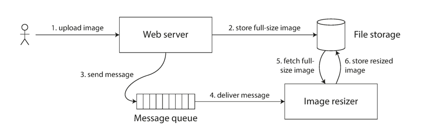

## Introduction

A distributed system is one in which components located at networked computers communicate and coordinate their actions only by passing messages.
This definition leads to the following especially significant characteristics of distributed systems: concurrency of components, lack of a global clock and independent failures of components.

The challenges arising from the construction of distributed systems are the heterogeneity of their components, openness (which allows components to be added or replaced),
security, scalability(the ability to work well when the load or the number of users increases), failure handling, concurrency of components, transparency and providing quality of service.

To be truly reliable, a distributed system must have the following characteristics:

- Fault-Tolerant: It can recover from component failures without performing incorrect actions.
- Highly Available: It can restore operations, permitting it to resume providing services even when some components have failed.
- Recoverable: Failed components can restart themselves and rejoin the system, after the cause of failure has been repaired.
- Consistent: The system can coordinate actions by multiple components often in the presence of concurrency and failure. This underlies the ability of a distributed system to act like a non-distributed system.
- Scalable: It can operate correctly even as some aspect of the system is scaled to a larger size. For example, we might increase the size of the network on which the system is running.
  This increases the frequency of network outages and could degrade a "non-scalable" system.
  Similarly, we might increase the number of users or servers, or overall load on the system. In a scalable system, this should not have a significant effect.
- Predictable Performance: The ability to provide desired responsiveness in a timely manner.
- Secure: The system authenticates access to data and services.

## The Trouble with Distributed Systems

The types of failures that can occur in a distributed system:

- Halting failures: A component simply stops. There is no way to detect the failure except by timeout: it either stops sending "I'm alive" (heartbeat) messages or fails to respond to requests.
  Your computer freezing is a halting failure.
- Fail-stop: A halting failure with some kind of notification to other components. A network file server telling its clients it is about to go down is a fail-stop.
- Omission failures: Failure to send/receive messages primarily due to lack of buffering space, which causes a message to be discarded with no notification to either the sender or receiver.
  This can happen when routers become overloaded.
- Network failures: A network link breaks.
- Network partition failure: A network fragments into two or more disjoint subnetworks within which messages can be sent, but between which messages are lost. This can occur due to a network failure.
- Timing failures: A temporal property of the system is violated.
  For example, clocks on different computers which are used to coordinate processes are not synchronized; when a message is delayed longer than a threshold period, etc.
- Byzantine failures: This captures several types of faulty behaviors including data corruption or loss, failures caused by malicious programs, etc.

Our goal is to design a distributed system with the characteristics listed above (faulttolerant, highly available, recoverable, etc.), which means we must design for failure.

### Faults and Partial Failures

### Unreliable Networks

Everyone, when they first build a distributed system, makes the following eight assumptions.

[The 8 Fallacies of Distributed Computing](https://arnon.me/wp-content/uploads/Files/fallacies.pdf) are as follows:

1. **The network is reliable.**
   Well, we could **automatically retry**. Queuing systems are very good at this. But this change will have a big impact on the design of your system. You are moving from a request/response model to fire and forget.
2. **Latency is zero.**
   Your application should be network aware. This means you should clearly separate local calls from remote calls. A possible solution is to move the data closer to the clients.
3. **Bandwidth is infinite.**
   There is a tension between the second fallacy – latency is not 0 and the third fallacy – bandwidth is infinite.
   You should transfer more data to minimize the number of network round trips.
   You should transfer less data to minimize bandwidth usage. You need to balance these two forces and find the right amount of data to send over the wire.
   So transfer only the data that you might need.
4. **The network is secure.**
   here are a lot of components and links in a distributed system and each one of them is a possible target for malicious users.
   The business needs to balance the risk and probability of an attack with the cost of implementing prevention mechanisms.
5. **Topology doesn't change.**
   Nowadays, with cloud and containers on the rise, it’s hard to ignore this fallacy. The first thing you need to do is to abstract the physical structure of the network.
6. **There is one administrator.**
   There are many thing that could go wrong. One example is configuration. Another thing that could go wrong are system upgrades.
   To work around this fallacy, you need to make your system easy to manage. DevOps, logging and monitoring can help.
7. **Transport cost is zero.**
   You should be mindful of the transport cost and how much serialization and deserialization your app is doing. This doesn’t mean that you should optimize, unless there is a need for it.
8. **The network is homogeneous.**
   You need to ensure that the system’s components can talk with each other. Using proprietary protocols will damage your app’s interoperability.

One of the most prominent descriptions of an agreement in a distributed system is a thought experiment widely known as the *Two Generals’ Problem*.
This thought experiment shows that it is impossible to achieve an agreement between two parties if communication is asynchronous in the presence of link failures.

The Two Generals Problem is provably unsolvable.

### Unreliable Clocks

#### Monotonic Versus Time-of-Day Clocks

Modern computers have at least two different kinds of clocks: a *time-of-day clock* and a *monotonic clock*.

A time-of-day clock does what you intuitively expect of a clock: it returns the current date and time according to some calendar (also known as wall-clock time).
For example, `clock_gettime(CLOCK_REALTIME)` on Linux and `System.currentTimeMillis()` in Java return the number of seconds (or milliseconds) since the epoch: midnight UTC on January 1, 1970, according to the Gregorian calendar, not counting leap seconds.
Some systems use other dates as their reference point.

Time-of-day clocks are usually synchronized with NTP, which means that a timestamp from one machine (ideally) means the same as a timestamp on another machine.
However, time-of-day clocks also have various oddities, as described in the next section.
In particular, if the local clock is too far ahead of the NTP server, it may be forcibly reset and appear to jump back to a previous point in time.
These jumps, as well as the fact that they often ignore leap seconds, make time-of-day clocks unsuitable for measuring elapsed time.
Time-of-day clocks have also historically had quite a coarse-grained resolution, e.g., moving forward in steps of 10 ms on older Windows systems.
On recent systems, this is less of a problem.

A monotonic clock is suitable for measuring a duration (time interval), such as a timeout or a service’s response time: `clock_gettime(CLOCK_MONOTONIC)` on Linux and `System.nanoTime()` in Java are monotonic clocks, for example.
The name comes from the fact that they are guaranteed to always move forward (whereas a time-ofday clock may jump back in time).

You can check the value of the monotonic clock at one point in time, do something, and then check the clock again at a later time. The difference between the two values tells you how much time elapsed between the two checks.
However, the absolute value of the clock is meaningless: it might be the number of nanoseconds since the computer was started, or something similarly arbitrary.
In particular, it makes no sense to compare monotonic clock values from two different computers, because they don’t mean the same thing.
 
On a server with multiple CPU sockets, there may be a separate timer per CPU, which is not necessarily synchronized with other CPUs.
Operating systems compensate for any discrepancy and try to present a monotonic view of the clock to application threads, even as they are scheduled across different CPUs.
However, it is wise to take this guarantee of monotonicity with a pinch of salt.

NTP may adjust the frequency at which the monotonic clock moves forward (this is known as *slewing* the clock) if it detects that the computer’s local quartz is moving faster or slower than the NTP server.
By default, NTP allows the clock rate to be speeded up or slowed down by up to 0.05%, but NTP cannot cause the monotonic clock to jump forward or backward.
The resolution of monotonic clocks is usually quite good: on most systems they can measure time intervals in microseconds or less.
In a distributed system, using a monotonic clock for measuring elapsed time (e.g., timeouts) is usually fine, because it doesn’t assume any synchronization between different nodes’ clocks and is not sensitive to slight inaccuracies of measurement.

Monotonic clocks don’t need synchronization, but time-of-day clocks need to be set according to an NTP server or other external time source in order to be useful.
Unfortunately, our methods for getting a clock to tell the correct time aren’t nearly as reliable or accurate as you might hope—hardware clocks and NTP can be fickle beasts.

#### Confidence interval

You may be able to read a machine’s time-of-day clock with microsecond or even nanosecond resolution.
But even if you can get such a fine-grained measurement, that doesn’t mean the value is actually accurate to such precision.
In fact, it most likely is not—as mentioned previously, the drift in an imprecise quartz clock can easily be several milliseconds, even if you synchronize with an NTP server on the local network every minute.
With an NTP server on the public internet, the best possible accuracy is probably to the tens of milliseconds, and the error may easily spike to over 100 ms when there is network congestion.

Thus, it doesn’t make sense to think of a clock reading as a point in time—it is more like a range of times, within a confidence interval:
for example, a system may be 95% confident that the time now is between 10.3 and 10.5 seconds past the minute, but it doesn’t know any more precisely than that.
If we only know the time +/– 100 ms, the microsecond digits in the timestamp are essentially meaningless.

The uncertainty bound can be calculated based on your time source.
If you have a GPS receiver or atomic (caesium) clock directly attached to your computer, the expected error range is reported by the manufacturer.
If you’re getting the time from a server, the uncertainty is based on the expected quartz drift since your last sync with the server, plus the NTP server’s uncertainty, plus the network round-trip time to the server (to a first approximation, and assuming you trust the server).
Unfortunately, most systems don’t expose this uncertainty: for example, when you call clock_gettime(), the return value doesn’t tell you the expected error of the timestamp, so you don’t know if its confidence interval is five milliseconds or five years.

An interesting exception is Google’s TrueTime API in [Spanner](/docs/CS/Distributed/Spanner.md), which explicitly reports the confidence interval on the local clock.
When you ask it for the current time, you get back two values: [earliest, latest], which are the earliest possible and the latest possible timestamp.
Based on its uncertainty calculations, the clock knows that the actual current time is somewhere within that interval.
The width of the interval depends, among other things, on how long it has been since the local quartz clock was last synchronized with a more accurate clock source.

### Knowledge, Truth, and Lies

#### Byzantine Problem

[Byzantine Problem](/docs/CS/Distributed/Byzantine.md)

### System Model and Reality

Many algorithms have been designed to solve distributed systems problems.
In order to be useful, these algorithms need to tolerate the various faults of distributed systems that we discussed.

Algorithms need to be written in a way that does not depend too heavily on the details of the hardware and software configuration on which they are run.
This in turn requires that we somehow formalize the kinds of faults that we expect to happen in a system.
We do this by defining a system model, which is an abstraction that describes what things an algorithm may assume.

With regard to timing assumptions, three system models are in common use:

- Synchronous model
  The synchronous model assumes bounded network delay, bounded process pauses, and bounded clock error.
  This does not imply exactly synchronized clocks or zero network delay; it just means you know that network delay, pauses, and clock drift will never exceed some fixed upper bound.
  The synchronous model is not a realistic model of most practical systems, because unbounded delays and pauses do occur.
- Partially synchronous model
  Partial synchrony means that a system behaves like a synchronous system most of the time, but it sometimes exceeds the bounds for network delay, process pauses, and clock drift.
  This is a realistic model of many systems: most of the time, networks and processes are quite well behaved—otherwise we would never be able to get anything done—but we have to reckon with the fact that any timing assumptions may be shattered occasionally.
  When this happens, network delay, pauses, and clock error may become arbitrarily large.
- Asynchronous model
  In this model, an algorithm is not allowed to make any timing assumptions—in fact, it does not even have a clock (so it cannot use timeouts).
  Some algorithms can be designed for the asynchronous model, but it is very restrictive.

Moreover, besides timing issues, we have to consider node failures.
The three most common system models for nodes are:

- Crash-stop faults
  In the crash-stop model, an algorithm may assume that a node can fail in only one way, namely by crashing.
  This means that the node may suddenly stop responding at any moment, and thereafter that node is gone forever—it never comes back.
- Crash-recovery faults
  We assume that nodes may crash at any moment, and perhaps start responding again after some unknown time.
  In the crash-recovery model, nodes are assumed to have stable storage (i.e., nonvolatile disk storage) that is preserved across crashes, while the in-memory state is assumed to be lost.
- Byzantine (arbitrary) faults
  Nodes may do absolutely anything, including trying to trick and deceive other nodes.

For modeling real systems, the partially synchronous model with crash-recovery faults is generally the most useful model.

### Correctness of an algorithm

To define what it means for an algorithm to be correct, we can describe its properties.
We can write down the properties we want of a distributed algorithm to define what it means to be correct.
For example, if we are generating fencing tokens for a lock, we may require the algorithm to have the following properties:

- Uniqueness
  No two requests for a fencing token return the same value.
- Monotonic sequence
  If request x returned token tx, and request y returned token ty, and x completed before y began, then tx < ty.
- Availability
  A node that requests a fencing token and does not crash eventually receives a response.

An algorithm is correct in some system model if it always satisfies its properties in all situations that we assume may occur in that system model. But how does this make sense?
If all nodes crash, or all network delays suddenly become infinitely long, then no algorithm will be able to get anything done.

#### Safety and liveness

To clarify the situation, it is worth distinguishing between two different kinds of properties: *safety* and *liveness* properties.
In the example just given, *uniqueness* and *monotonic sequence* are safety properties, but *availability* is a liveness property.
What distinguishes the two kinds of properties? A giveaway is that liveness properties often include the word “eventually” in their definition. (*eventual consistency* is a liveness property.)

Safety is often informally defined as nothing bad happens, and liveness as something good eventually happens.
However, it’s best to not read too much into those informal definitions, because the meaning of good and bad is subjective.
The actual definitions of safety and liveness are precise and mathematical:

- If a safety property is violated, we can point at a particular point in time at which it was broken (for example, if the uniqueness property was violated, we can identify the particular operation in which a duplicate fencing token was returned).
  After a safety property has been violated, the violation cannot be undone—the damage is already done.
- A liveness property works the other way round: it may not hold at some point in time (for example, a node may have sent a request but not yet received a response), but there is always hope that it may be satisfied in the future (namely by receiving a response).

An advantage of distinguishing between safety and liveness properties is that it helps us deal with difficult system models.
For distributed algorithms, it is common to require that safety properties always hold, in all possible situations of a system model.
That is, even if all nodes crash, or the entire network fails, the algorithm must nevertheless ensure that it does not return a wrong result (i.e., that the safety properties remain satisfied).

However, with liveness properties we are allowed to make caveats: for example, we could say that a request needs to receive a response only if a majority of nodes have not crashed, and only if the network eventually recovers from an outage.
The definition of the partially synchronous model requires that eventually the system returns to a synchronous state—that is, any period of network interruption lasts only for a finite duration and is then repaired.

## Consistency and Consensus

The best way of building fault-tolerant systems is to find some general-purpose
abstractions with useful guarantees, implement them once, and then let applications
rely on those guarantees. This is the same approach as we used with [transactions](/docs/CS/Transaction.md): by using a transaction, the application can pretend that there are no crashes (atomicity), that nobody else is concurrently accessing the database (isolation), and that storage devices are perfectly reliable (durability).
Even though crashes, race conditions, and disk failures do occur, the transaction abstraction hides those problems so that the application doesn’t need to worry about them.

We will now continue along the same lines, and seek abstractions that can allow an application to ignore some of the problems with distributed systems. 
For example, one of the most important abstractions for distributed systems is *consensus*: that is, getting all of the nodes to agree on something.

There is some similarity between distributed consistency models and the hierarchy of [transaction isolation levels](/docs/CS/Transaction.md?id=Isolation-Levels).
But while there is some overlap, they are mostly independent concerns: transaction isolation is primarily about avoiding race conditions due to concurrently executing transactions,
whereas distributed consistency is mostly about coordinating the state of replicas in the face of delays and faults.

### Consistency models

 What happens if multiple clients read or modify different copies of data simultaneously or within a short period. 
 There’s no single right answer to that question, since these semantics are different depending on the application, but they are well studied in the context of consistency models.

*Consistency models* provide different semantics and guarantees. 
You can think of a consistency model as a contract between the participants: what each replica has to do to satisfy the required semantics, and what users can expect when issuing read and write operations.

Consistency models describe what expectations clients might have in terms of possible returned values despite the existence of multiple copies of data and concurrent accesses to it.

A consistency model is a set of histories.

> link [Jepsen Consistency Models](https://jepsen.io/consistency)

#### Strict Consistency

*Strict consistency* is the equivalent of complete replication transparency: any write by any process is instantly available for the subsequent reads by any process. 
It involves the concept of a global clock and, if there was a write(x, 1) at instant t1, any read(x) will return a newly written value 1 at any instant t2 > t1.

Unfortunately, this is just a theoretical model, and it’s impossible to implement, as the laws of physics and the way distributed systems work set limits on how fast things may happen.

#### Linearizability

*Linearizability* is the strongest single-object, single-operation consistency model.
Under this model, effects of the write become visible to all readers exactly once at some point in time between its start and end, and no client can observe state transitions or side effects of partial (i.e., unfinished, still in-flight) or incomplete (i.e., interrupted before completion) write operations.

[Highly Available Transactions: Virtues and Limitations](http://www.vldb.org/pvldb/vol7/p181-bailis.pdf)

[Consistency in Non-Transactional Distributed Storage Systems](https://arxiv.org/pdf/1512.00168.pdf)

### Eventual Consistency

[Eventually Consistent - Revisited](https://www.allthingsdistributed.com/2008/12/eventually_consistent.html)

In “[Replication Lag](/docs/CS/Transaction.md?id=Replication-Lag)” we looked at some timing issues that occur in a replicated database.
If you look at two database nodes at the same moment in time, you’re likely to see different data on the two nodes, because write requests arrive on different nodes at different times.
These inconsistencies occur no matter what replication method the database uses (single-leader, multi-leader, or leaderless replication).

Most replicated databases provide at least eventual consistency, which means that if you stop writing to the database and wait for some unspecified length of time, then eventually all read requests will return the same value.
In other words, the inconsistency is temporary, and it eventually resolves itself (assuming that any faults in the network are also eventually repaired).
A better name for eventual consistency may be convergence, as we expect all replicas to eventually converge to the same value.

However, this is a very weak guarantee—it doesn’t say anything about when the replicas will converge.
Until the time of convergence, reads could return anything or nothing.
For example, if you write a value and then immediately read it again, there is no guarantee that you will see the value you just wrote, because the read may be routed to a different replica.

### Linearizability

In an eventually consistent database, if you ask two different replicas the same question at the same time, you may get two different answers. That’s confusing.
Wouldn’t it be a lot simpler if the database could give the illusion that there is only one replica (i.e., only one copy of the data)?
Then every client would have the same view of the data, and you wouldn’t have to worry about replication lag.

This is the idea behind *linearizability* (also known as *atomic consistency*, *strong consistency*, *immediate consistency*, or *external consistency*).
The basic idea is to make a system appear as if there were only one copy of the data, and all operations on it are atomic.
With this guarantee, even though there may be multiple replicas in reality, the application does not need to worry about them.

In a linearizable system, as soon as one client successfully completes a write, all clients reading from the database must be able to see the value just written.
Maintaining the illusion of a single copy of the data means guaranteeing that the value read is the most recent, up-to-date value, and doesn’t come from a stale cache or replica.
In other words, linearizability is a recency guarantee.

[Linearizability: A Correctness Condition for Concurrent Objects](https://cs.brown.edu/~mph/HerlihyW90/p463-herlihy.pdf)

Viotti and Vukolić rephrase this definition in terms of three set-theoretic constraints on histories:

- SingleOrder (there exists some total order of operations)
- RealTime (consistent with the real time bound)
- RVal (obeying the single-threaded laws of the associated object’s datatype)

[How to Make a Multiprocessor Computer That Correctly Executes Multiprocess Progranms](https://www.microsoft.com/en-us/research/uploads/prod/2016/12/How-to-Make-a-Multiprocessor-Computer-That-Correctly-Executes-Multiprocess-Programs.pdf)

Linearizability is one of the strongest single-object consistency models, and implies that every operation appears to take place atomically, in some order, consistent with the real-time ordering of those operations: e.g.,
if operation A completes before operation B begins, then B should logically take effect after A.

[Testing for Linearizability](http://www.cs.ox.ac.uk/people/gavin.lowe/LinearizabiltyTesting/paper.pdf)

[Faster linearizability checking via P-compositionality](https://arxiv.org/pdf/1504.00204.pdf)

#### Linearizability Versus Serializability

Linearizability is easily confused with [serializability](/docs/CS/Transaction.md?id=Serializability), as both words seem to mean something like “can be arranged in a sequential order.”
However, they are two quite different guarantees, and it is important to distinguish between them:

- Serializability is an isolation property of transactions, where every transaction may read and write multiple objects (rows, documents, records).
  It guarantees that transactions behave the same as if they had executed in some serial order (each transaction running to completion before the next transaction starts).
  It is okay for that serial order to be different from the order in which transactions were actually run.
- Linearizability is a recency guarantee on reads and writes of a register (an individual object).
  It doesn’t group operations together into transactions, so it does not prevent problems such as write skew, unless you take additional measures such as materializing conflicts.

A database may provide both serializability and linearizability, and this combination is known as strict serializability or strong one-copy serializability (strong-1SR).
Implementations of serializability based on two-phase locking or actual serial execution are typically linearizable.
However, serializable snapshot isolation is not linearizable: by design, it makes reads from a consistent snapshot, to avoid lock contention between readers and writers.
The whole point of a consistent snapshot is that it does not include writes that are more recent than the snapshot, and thus reads from the snapshot are not linearizable.

#### Relying on Linearizability

##### Locking and leader election

A system that uses single-leader replication needs to ensure that there is indeed only one leader, not several (split brain).
One way of electing a leader is to use a lock: every node that starts up tries to acquire the lock, and the one that succeeds becomes the leader.
No matter how this lock is implemented, it must be linearizable: all nodes must agree which node owns the lock; otherwise it is useless.
Coordination services like Apache ZooKeeper and etcd are often used to implement distributed locks and leader election. 
They use consensus algorithms to implement linearizable operations in a fault-tolerant way.

There are still many subtle details to implementing locks and leader election correctly, and libraries like Apache Curator help by providing higher-level recipes on top of ZooKeeper.
However, a linearizable storage service is the basic foundation for these coordination tasks.

> **Strictly speaking, ZooKeeper and etcd provide linearizable writes, but reads may be stale, since by default they can be served by any one of the replicas.**
> You can optionally request a linearizable read: etcd calls this a quorum read, and in ZooKeeper you need to call sync() before the read.

Distributed locking is also used at a much more granular level in some distributed databases, such as Oracle Real Application Clusters (RAC). 
RAC uses a lock per disk page, with multiple nodes sharing access to the same disk storage system. 
Since these linearizable locks are on the critical path of transaction execution, RAC deployments usually have a dedicated cluster interconnect network for communication between database nodes.

##### Constraints and uniqueness guarantees

Uniqueness constraints are common in databases: for example, a username or email address must uniquely identify one user, and in a file storage service there cannot be two files with the same path and filename. 
If you want to enforce this constraint as the data is written (such that if two people try to concurrently create a user or a file with the same name, one of them will be returned an error), you need linearizability.

This situation is actually similar to a lock: when a user registers for your service, you can think of them acquiring a “lock” on their chosen username. 
The operation is also very similar to an atomic compare-and-set, setting the username to the ID of the user who claimed it, provided that the username is not already taken.
Similar issues arise if you want to ensure that a bank account balance never goes negative, or that you don’t sell more items than you have in stock in the warehouse, or that two people don’t concurrently book the same seat on a flight or in a theater. 
These constraints all require there to be a single up-to-date value (the account balance, the stock level, the seat occupancy) that all nodes agree on.

In real applications, it is sometimes acceptable to treat such constraints loosely (for example, if a flight is overbooked, you can move customers to a different flight and offer them compensation for the inconvenience). 
In such cases, linearizability may not be needed.

However, a hard uniqueness constraint, such as the one you typically find in relational databases, requires linearizability.
Other kinds of constraints, such as foreign key or attribute constraints, can be implemented without requiring linearizability.

##### Cross-channel timing dependencies

For example, say you have a website where users can upload a photo, and a background process resizes the photos to lower resolution for faster download (thumbnails). 
The architecture and dataflow of this system is illustrated in Figure 9-5.
The image resizer needs to be explicitly instructed to perform a resizing job, and this instruction is sent from the web server to the resizer via a message queue.
The web server doesn’t place the entire photo on the queue, since most message brokers are designed for small messages, and a photo may be several megabytes in size.
Instead, the photo is first written to a file storage service, and once the write is complete, the instruction to the resizer is placed on the queue.

Fig.4. The web server and image resizer communicate both through file storage and a message queue, opening the potential for race conditions.

If the file storage service is linearizable, then this system should work fine. 
If it is not linearizable, there is the risk of a race condition: the message queue (steps 3 and 4 in Figure 4) might be faster than the internal replication inside the storage service. 
In this case, when the resizer fetches the image (step 5), it might see an old version of the image, or nothing at all. 
If it processes an old version of the image, the full-size and resized images in the file storage become permanently inconsistent.
This problem arises because there are two different communication channels between the web server and the resizer: the file storage and the message queue. 
Without the recency guarantee of linearizability, race conditions between these two channels are possible. 

Linearizability is not the only way of avoiding this race condition, but it’s the simplest to understand.
If you control the additional communication channel (like in the case of the message queue, but not in the case of Alice and Bob), 
you can use alternative approaches similar to what we discussed in “[Reading Your Own Writes](/docs/CS/Distributed/Replica.md?id=Read-after-write)”, at the cost of additional complexity

#### Implementing Linearizable Systems

Let’s think about how we might implement a system that offers linearizable semantics.
Since linearizability essentially means “behave as though there is only a single copy of the data, and all operations on it are atomic,” the simplest answer would be to really only use a single copy of the data.
However, that approach would not be able to tolerate faults: if the node holding that one copy failed, the data would be lost, or at least inaccessible until the node was brought up again.

The most common approach to making a system fault-tolerant is to use [replication](/docs/CS/Distributed/Replica.md).
Let’s revisit the replication methods, and compare whether they can be made linearizable:
- Single-leader replication (potentially linearizable)
  In a system with single-leader replication, the leader has the primary copy of the data that is used for writes, and the followers maintain backup copies of the data on other nodes. 
  If you make reads from the leader, or from synchronously updated followers, they have the potential to be linearizable.
  Partitioning (sharding) a single-leader database, so that there is a separate leader per partition, does not affect linearizability, since it is only a single-object guarantee. 
  Cross-partition transactions are a different matter (see “Distributed Transactions and Consensus”).
  However, not every single-leader database is actually linearizable, either by design (e.g., because it uses snapshot isolation) or due to concurrency bugs.
  Using the leader for reads relies on the assumption that you know for sure who the leader is.
  It is quite possible for a node to think that it is the leader, when in fact it is not—and if the delusional leader continues to serve requests, it is likely to violate linearizability.
  With asynchronous replication, failover may even lose committed writes, which violates both durability and linearizability.
- Consensus algorithms (linearizable)
  Some consensus algorithms bear a resemblance to single-leader replication.
  However, consensus protocols contain measures to prevent split brain and stale replicas. 
  Thanks to these details, consensus algorithms can implement linearizable storage safely.
  This is how ZooKeeper and etcd work, for example.
- Multi-leader replication (not linearizable)
  Systems with multi-leader replication are generally not linearizable, because they concurrently process writes on multiple nodes and asynchronously replicate them to other nodes.
  For this reason, they can produce conflicting writes that require resolution. 
  Such conflicts are an artifact of the lack of a single copy of the data.
- Leaderless replication (probably not linearizable)
  For systems with leaderless replication, people sometimes claim that you can obtain “strong consistency” by requiring quorum reads and writes (w + r > n).
  Depending on the exact configuration of the quorums, and depending on how you define strong consistency, this is not quite true.
  “Last write wins” conflict resolution methods based on time-of-day clocks are almost certainly nonlinearizable, because clock timestamps cannot be guaranteed to be consistent with actual event ordering due to clock skew. 
  Sloppy quorums also ruin any chance of linearizability. 
  Even with strict quorums, nonlinearizable behavior is possible, as demonstrated in the next section

Intuitively, it seems as though strict quorum reads and writes should be linearizable in a Dynamo-style model. 
However, when we have variable network delays, it is possible to have race conditions.

It is safest to assume that a leaderless system with Dynamo-style replication does not provide linearizability.

#### The Cost of Linearizability

Consider what happens if there is a network interruption between the two datacenters.
Let’s assume that the network within each datacenter is working, and clients can reach the datacenters, but the datacenters cannot connect to each other.
With a multi-leader database, each datacenter can continue operating normally: since writes from one datacenter are asynchronously replicated to the other, the writes are simply queued up and exchanged when network connectivity is restored.

On the other hand, if single-leader replication is used, then the leader must be in one of the datacenters.
Any writes and any linearizable reads must be sent to the leader—thus, for any clients connected to a follower datacenter, those read and write requests must be sent synchronously over the network to the leader datacenter.
If the network between datacenters is interrupted in a single-leader setup, clients connected to follower datacenters cannot contact the leader, so they cannot make any writes to the database, nor any linearizable reads. 
They can still make reads from the follower, but they might be stale (nonlinearizable). 
If the application requires linearizable reads and writes, the network interruption causes the application to become unavailable in the datacenters that cannot contact the leader.

If clients can connect directly to the leader datacenter, this is not a problem, since the application continues to work normally there. 
But clients that can only reach a follower datacenter will experience an outage until the network link is repaired.

This issue is not just a consequence of single-leader and multi-leader replication: any linearizable database has this problem, no matter how it is implemented. 
The issue also isn’t specific to multi-datacenter deployments, but can occur on any unreliable network, even within one datacenter. 
 
The trade-off is as follows:
- If your application requires linearizability, and some replicas are disconnected from the other replicas due to a network problem, then some replicas cannot process requests while they are disconnected:
  they must either wait until the network problem is fixed, or return an error (either way, they become unavailable).
- If your application does not require linearizability, then it can be written in a way that each replica can process requests independently, even if it is disconnected from other replicas (e.g., multi-leader).
  In this case, the application can remain available in the face of a network problem, but its behavior is not linearizable.

Thus, applications that don’t require linearizability can be more tolerant of network problems. 
This insight is popularly known as the [CAP theorem](/docs/CS/Distributed/CAP.md).

### Sequential Consistency

Viotti and Vukolić decompose sequential consistency into three properties:

- SingleOrder (there exists some total order of operations)
- PRAM
- RVal (the order must be consistent with the semantics of the datatype)

### Causal consistency

[Causal memory: definitions, implementation, and programming](https://www.cs.tau.ac.il/~orilahav/seminar18/causal.pdf)

Causal consistency captures the notion that causally-related operations should appear in the same order on all processes—though processes may disagree about the order of causally independent operations.

If you need total availability, you’ll have to give up causal (and read-your-writes), but can still obtain writes follow reads, monotonic reads, and monotonic writes.

NFS

Network File System

## Time

[Time Clock](/docs/CS/Distributed/Time.md)

## Consensus

[Consensus](/docs/CS/Distributed/Consensus.md) is a fundamental problem in fault-tolerant distributed systems.
Consensus involves multiple servers agreeing on values. Once they reach a decision on a value, that decision is final.
Typical consensus algorithms make progress when any majority of their servers is available; for example, a cluster of 5 servers can continue to operate even if 2 servers fail.
If more servers fail, they stop making progress (but will never return an incorrect result).

A distributed algorithm has two properties:

- safety properties say that nothing bad will ever happen.
  It is the generalization of partial correctness for sequential programs.
  For example, the property of never returning an inconsistent value is a safety property, as is never electing two leaders at the same time.
- liveness properties say that something good will eventually happen.
  It is the generalization of termination.
  For example, saying that a system will eventually return a result to every API call is a liveness property, as is guaranteeing that a write to disk always eventually completes.

## Failure

### Failure Modes

### Failure Detection

Terms such as dead, failed, and crashed are usually used to describe a process that has stopped executing its steps completely.
Terms such as unresponsive, faulty, and slow are used to describe suspected processes, which may actually be dead.

Failures may occur on the link level (messages between processes are lost or delivered slowly), or on the process level (the process crashes or is running slowly), and slowness may not always be distinguishable from failure.
This means there’s always a trade-off between wrongly suspecting alive processes as dead (producing false-positives), and delaying marking an unresponsive process as dead, giving it the benefit of doubt and expecting it to respond eventually (producing false-negatives).

A failure detector is a local subsystem responsible for identifying failed or unreachable processes to exclude them from the algorithm and guarantee liveness while preserving safety.

Liveness and safety are the properties that describe an algorithm’s ability to solve a specific problem and the correctness of its output.
More formally, liveness is a property that guarantees that a specific intended event must occur. For example, if one of the processes has failed, a failure detector must detect that failure.
Safety guarantees that unintended events will not occur.
For example, if a failure detector has marked a process as dead, this process had to be, in fact, dead.
From a practical perspective, excluding failed processes helps to avoid unnecessary work and prevents error propagation and cascading failures, while reducing availability when excluding potentially suspected alive processes.

[Proving the Correctness of Multiprocess Programs](http://www.cis.umassd.edu/~hxu/courses/cis481/references/Lamport-1977.pdf)

[Group membership failure detection: a simple protocol and its probabilistic analysis](https://iopscience.iop.org/article/10.1088/0967-1846/6/3/301/pdf)

[Unreliable failure detectors for reliable distributed systems](https://dl.acm.org/doi/pdf/10.1145/226643.226647)

[Survey on Scalable Failure Detectors](http://www.scs.stanford.edu/14au-cs244b/labs/projects/song.pdf)

Failure-detection algorithms should exhibit several essential properties.

- First of all, every nonfaulty member should eventually notice the process failure, and the algorithm should be able to make progress and eventually reach its final result.
  This property is called *completeness*.
- We can judge the quality of the algorithm by its efficiency: how fast the failure detector can identify process failures.
- Another way to do this is to look at the accuracy of the algorithm: whether or not the process failure was precisely detected.
  In other words, an algorithm is not accurate if it falsely accuses a live process of being failed or is not able to detect the existing failures.

We can think of the relationship between efficiency and accuracy as a tunable parameter: a more efficient algorithm might be less precise, and a more accurate algorithm is usually less efficient.
It is provably impossible to build a failure detector that is both accurate and efficient.
At the same time, failure detectors are allowed to produce false-positives (i.e., falsely identify live processes as failed and vice versa).

Failure detectors are an essential prerequisite and an integral part of many consensus and atomic broadcast algorithms.

Many distributed systems implement failure detectors by using heartbeats.
This approach is quite popular because of its simplicity and strong completeness.
Algorithms we discuss here assume the absence of Byzantine failures: processes do not attempt to intentionally lie about their state or states of their neighbors.

We will cover several algorithms for failure detection, each using a different approach: some focus on detecting failures by direct communication,
some use broadcast or gossip for spreading the information around, and some opt out by using quiescence (in other words, absence of communication) as a means of propagation.
We now know that we can use heartbeats or pings, hard deadlines, or continuous scales. Each one of these approaches has its own upsides: simplicity, accuracy, or precision.

### Heartbeats and Pings

We can query the state of remote processes by triggering one of two periodic processes:

- We can trigger a ping, which sends messages to remote processes, checking if they are still alive by expecting a response within a specified time period.
- We can trigger a heartbeat when the process is actively notifying its peers that it’s still running by sending messages to them.

We’ll use pings as an example here, but the same problem can be solved using heartbeats, producing similar results.
Each process maintains a list of other processes (alive, dead, and suspected ones) and updates it with the last response time for each process.
If a process fails to respond to a ping message for a longer time, it is marked as suspected.

Many failure-detection algorithms are based on heartbeats and timeouts.
For example, Akka, a popular framework for building distributed systems, has an implementation of a deadline failure detector, which uses heartbeats and reports a process failure if it has failed to register within a fixed time interval.

This approach has several potential downsides: its precision relies on the careful selection of ping frequency and timeout, and it does not capture process visibility from the perspective of other processes (see “Outsourced Heartbeats”).

#### Timeout-Free Failure Detector

Some algorithms avoid relying on timeouts for detecting failures.
For example, Heartbeat, a timeout-free failure detector, is an algorithm that only counts heartbeats and allows the application to detect process failures based on the data in the heartbeat counter vectors.
Since this algorithm is timeout-free, it operates under asynchronous system assumptions.”

#### Outsourced Heartbeats

An alternative approach, used by the Scalable Weakly Consistent Infection-style Process Group Membership Protocol (SWIM) is to use outsourced heartbeats to improve reliability using information about the process liveness from the perspective of its neighbors.
This approach does not require processes to be aware of all other processes in the network, only a subset of connected peers.”

### Phi-Accural Failure Detector

Instead of treating node failure as a binary problem, where the process can be only in two states: up or down, a phi-accrual (φ-accrual) failure detector has a continuous scale, capturing the probability of the monitored process’s crash.
It works by maintaining a sliding window, collecting arrival times of the most recent heartbeats from the peer processes.
This information is used to approximate arrival time of the next heartbeat, compare this approximation with the actual arrival time, and compute the suspicion level φ: how certain the failure detector is about the failure, given the current network conditions.

The algorithm works by collecting and sampling arrival times, creating a view that can be used to make a reliable judgment about node health.
It uses these samples to compute the value of φ: if this value reaches a threshold, the node is marked as down.
This failure detector dynamically adapts to changing network conditions by adjusting the scale on which the node can be marked as a suspect.

From the architecture perspective, a phi-accrual failure detector can be viewed as a combination of three subsystems:

- Monitoring
  Collecting liveness information through pings, heartbeats, or request-response sampling.
- Interpretation
  Making a decision on whether or not the process should be marked as suspected.
- Action
  A callback executed whenever the process is marked as suspected.

### Gossip and Failure Detection

Another approach that avoids relying on a single-node view to make a decision is a gossip-style failure detection service, which uses gossip (see “Gossip Dissemination”) to collect and distribute states of neighboring processes.

Each member maintains a list of other members, their heartbeat counters, and timestamps, specifying when the heartbeat counter was incremented for the last time.
Periodically, each member increments its heartbeat counter and distributes its list to a random neighbor.
Upon the message receipt, the neighboring node merges the list with its own, updating heartbeat counters for the other neighbors.

Nodes also periodically check the list of states and heartbeat counters. If any node did not update its counter for long enough, it is considered failed.
This timeout period should be chosen carefully to minimize the probability of false-positives.
How often members have to communicate with each other (in other words, worst-case bandwidth) is capped, and can grow at most linearly with a number of processes in the system.

This way, we can detect crashed nodes, as well as the nodes that are unreachable by any other cluster member. This decision is reliable, since the view of the cluster is an aggregate from multiple nodes.
If there’s a link failure between the two hosts, heartbeats can still propagate through other processes.
Using gossip for propagating system states increases the number of messages in the system, but allows information to spread more reliably.

### Reversing Failure Detection Problem Statement

Since propagating the information about failures is not always possible, and propagating it by notifying every member might be expensive, one of the approaches,
called FUSE (failure notification service) [DUNAGAN04], focuses on reliable and cheap failure propagation that works even in cases of network partitions.

To detect process failures, this approach arranges all active processes in groups. If one of the groups becomes unavailable, all participants detect the failure.
In other words, every time a single process failure is detected, it is converted and propagated as a group failure. This allows detecting failures in the presence of any pattern of disconnects, partitions, and node failures.

Processes in the group periodically send ping messages to other members, querying whether they’re still alive.
If one of the members cannot respond to this message because of a crash, network partition, or link failure, the member that has initiated this ping will, in turn, stop responding to ping messages itself.

All failures are propagated through the system from the source of failure to all other participants. Participants gradually stop responding to pings, converting from the individual node failure to the group failure.

Here, we use the absence of communication as a means of propagation. An advantage of using this approach is that every member is guaranteed to learn about group failure and adequately react to it.
One of the downsides is that a link failure separating a single process from other ones can be converted to the group failure as well, but this can be seen as an advantage, depending on the use case.
Applications can use their own definitions of propagated failures to account for this scenario.

## Leader Election

Synchronization can be quite costly: if each algorithm step involves contacting each other participant, we can end up with a significant communication overhead.
This is particularly true in large and geographically distributed networks.
To reduce synchronization overhead and the number of message round-trips required to reach a decision, some algorithms rely on the existence of the leader (sometimes called coordinator) process, responsible for executing or coordinating steps of a distributed algorithm.

Generally, processes in distributed systems are uniform, and any process can take over the leadership role.
Processes assume leadership for long periods of time, but this is not a permanent role. Usually, the process remains a leader until it crashes.
After the crash, any other process can start a new election round, assume leadership, if it gets elected, and continue the failed leader’s work.

The liveness of the election algorithm guarantees that most of the time there will be a leader, and the election will eventually complete (i.e., the system should not be in the election state indefinitely).

Ideally, we’d like to assume safety, too, and guarantee there may be at most one leader at a time, and completely eliminate the possibility of a split brain situation (when two leaders serving the same purpose are elected but unaware of each other).
However, in practice, many leader election algorithms violate this agreement.

Leader processes can be used, for example, to achieve a total order of messages in a broadcast.
The leader collects and holds the global state, receives messages, and disseminates them among the processes.
It can also be used to coordinate system reorganization after the failure, during initialization, or when important state changes happen.

Election is triggered when the system initializes, and the leader is elected for the first time, or when the previous leader crashes or fails to communicate.
Election has to be deterministic: exactly one leader has to emerge from the process. This decision needs to be effective for all participants.

Even though leader election and distributed locking (i.e., exclusive ownership over a shared resource) might look alike from a theoretical perspective, they are slightly different.
If one process holds a lock for executing a critical section, it is unimportant for other processes to know who exactly is holding a lock right now, as long as the liveness property is satisfied (i.e., the lock will be eventually released, allowing others to acquire it).
In contrast, the elected process has some special properties and has to be known to all other participants, so the newly elected leader has to notify its peers about its role.

If a distributed locking algorithm has any sort of preference toward some process or group of processes, it will eventually starve nonpreferred processes from the shared resource, which contradicts the liveness property.
In contrast, the leader can remain in its role until it stops or crashes, and long-lived leaders are preferred.

Having a stable leader in the system helps to avoid state synchronization between remote participants, reduce the number of exchanged messages, and drive execution from a single process instead of requiring peer-to-peer coordination.
One of the potential problems in systems with a notion of leadership is that the leader can become a bottleneck.
To overcome that, many systems partition data in non-intersecting independent replica sets (see “Database Partitioning”). Instead of having a single system-wide leader, each replica set has its own leader.
One of the systems that uses this approach is [Spanner]().

Because every leader process will eventually fail, failure has to be detected, reported, and reacted upon: a system has to elect another leader to replace the failed one.

Some algorithms, such as [ZAB](), [Multi-Paxos](), or [Raft](), use temporary leaders to reduce the number of messages required to reach an agreement between the participants.
However, these algorithms use their own algorithm-specific means for leader election, failure detection, and resolving conflicts between the competing leader processes.

### Bully Algorithm

One of the leader election algorithms, known as the bully algorithm, uses process ranks to identify the new leader.
Each process gets a unique rank assigned to it. During the election, the process with the highest rank becomes a leader.

This algorithm is known for its simplicity. The algorithm is named bully because the highest-ranked node “bullies” other nodes into accepting it.
It is also known as monarchial leader election: the highest-ranked sibling becomes a monarch after the previous one ceases to exist.

One of the apparent problems with this algorithm is that it violates the safety guarantee (that at most one leader can be elected at a time) in the presence of network partitions.
It is quite easy to end up in the situation where nodes get split into two or more independently functioning subsets, and each subset elects its leader. This situation is called split brain.

Another problem with this algorithm is a strong preference toward high-ranked nodes, which becomes an issue if they are unstable and can lead to a permanent state of reelection.
An unstable high-ranked node proposes itself as a leader, fails shortly thereafter, wins reelection, fails again, and the whole process repeats.
This problem can be solved by distributing host quality metrics and taking them into consideration during the election.

### Next-In-Line Failover

There are many versions of the bully algorithm that improve its various properties. For example, we can use multiple next-in-line alternative processes as a failover to shorten reelections.

Each elected leader provides a list of failover nodes.
When one of the processes detects a leader failure, it starts a new election round by sending a message to the highest-ranked alternative from the list provided by the failed leader.
If one of the proposed alternatives is up, it becomes a new leader without having to go through the complete election round.

If the process that has detected the leader failure is itself the highest ranked process from the list, it can notify the processes about the new leader right away.

### Candidate/Ordinary Optimization

Another algorithm attempts to lower requirements on the number of messages by splitting the nodes into two subsets, candidate and ordinary, where only one of the candidate nodes can eventually become a leader.

The ordinary process initiates election by contacting candidate nodes, collecting responses from them, picking the highest-ranked alive candidate as a new leader, and then notifying the rest of the nodes about the election results.

To solve the problem with multiple simultaneous elections, the algorithm proposes to use a tiebreaker variable δ, a process-specific delay, varying significantly between the nodes, that allows one of the nodes to initiate the election before the other ones.
The tiebreaker time is generally greater than the message round-trip time. Nodes with higher priorities have a lower δ, and vice versa.

### Invitation Algorithm

An invitation algorithm allows processes to “invite” other processes to join their groups instead of trying to outrank them.
This algorithm allows multiple leaders by definition, since each group has its own leader.

Each process starts as a leader of a new group, where the only member is the process itself.
Group leaders contact peers that do not belong to their groups, inviting them to join.
If the peer process is a leader itself, two groups are merged. Otherwise, the contacted process responds with a group leader ID, allowing two group leaders to establish contact and merge groups in fewer steps.

Since groups are merged, it doesn’t matter whether the process that suggested the group merge becomes a new leader or the other one does.
To keep the number of messages required to merge groups to a minimum, a leader of a larger group can become a leader for a new group.
This way only the processes from the smaller group have to be notified about the change of leader.

Similar to the other discussed algorithms, this algorithm allows processes to settle in multiple groups and have multiple leaders.
The invitation algorithm allows creating process groups and merging them without having to trigger a new election from scratch, reducing the number of messages required to finish the election.

### Ring Algorithm

In the ring algorithm [CHANG79], all nodes in the system form a ring and are aware of the ring topology (i.e., their predecessors and successors in the ring).
When the process detects the leader failure, it starts the new election. The election message is forwarded across the ring: each process contacts its successor (the next node closest to it in the ring).
If this node is unavailable, the process skips the unreachable node and attempts to contact the nodes after it in the ring, until eventually one of them responds.

Nodes contact their siblings, following around the ring and collecting the live node set, adding themselves to the set before passing it over to the next node,
similar to the failure-detection algorithm described in “Timeout-Free Failure Detector”, where nodes append their identifiers to the path before passing it to the next node.

## Messaging

[RPC](/docs/CS/Distributed/RPC/RPC.md)

### Atomic Broadcast

[Total Order Broadcast and Multicast Algorithms: Taxonomy and Survey](http://citeseerx.ist.psu.edu/viewdoc/download?doi=10.1.1.3.4709&rep=rep1&type=pdf)

[Epidemic Algorithms for Replicated Database Maintenance](http://bitsavers.informatik.uni-stuttgart.de/pdf/xerox/parc/techReports/CSL-89-1_Epidemic_Algorithms_for_Replicated_Database_Maintenance.pdf)

[Gossip Algorithms: Design, Analysis and Applications](http://citeseerx.ist.psu.edu/viewdoc/download?doi=10.1.1.85.6176&rep=rep1&type=pdf)

[Lightweight Causal and Atomic Group Multicast](https://www.cs.cornell.edu/courses/cs614/2003sp/papers/BSS91.pdf)

[Understanding the Limitations of Causally and Totally Ordered Communication](https://www.cs.rice.edu/~alc/comp520/papers/Cheriton_Skeen.pdf)

[A Response to Cheriton and Skeen’s Criticism of Causal and Totally Ordered Communication](https://www.cs.princeton.edu/courses/archive/fall07/cos518/papers/catocs-limits-response.pdf)

## Chain Replication

[Chain Replication for Supporting High Throughput and Availability](https://www.cs.cornell.edu/home/rvr/papers/OSDI04.pdf)

[Object Storage on CRAQ: High-throughput chain replication for read-mostly workloads](https://www.usenix.org/legacy/event/usenix09/tech/full_papers/terrace/terrace.pdf)

[Chain Replication in Theory and in Practice](http://diyhpl.us/~bryan/papers2/distributed/distributed-systems/chain-replication-in-theory-and-in-practice.2010.pdf)

### snapshot

A distributed system consists of a finite set of processes and a finite set of channels.

[Distributed Snapshots - Determining Global States of a Distributed System](https://www.microsoft.com/en-us/research/uploads/prod/2016/12/Determining-Global-States-of-a-Distributed-System.pdf)

## Frames

[Google Cluster](/docs/CS/Distributed/Google.md)

[Dynamo](/docs/CS/Distributed/Dynamo.md)

[Spark](/docs/CS/Distributed/Spark.md)

[F1](https://courses.cs.washington.edu/courses/cse550/21au/papers/CSE550.F1.pdf)

[MillWheel: Fault-Tolerant Stream Processing at Internet Scale]()

[Dryad]

[Cassandra]

[Ceph]

[RAMCloud]

[HyperDex: A Distributed, Searchable Key-Value Store](https://www.cs.cornell.edu/people/egs/papers/hyperdex-sigcomm.pdf)

[PNUTS: Yahoo!’s Hosted Data Serving Platform](https://people.mpi-sws.org/~druschel/courses/ds/papers/cooper-pnuts.pdf)

[Azure Data Lake Store: A Hyperscale Distributed File Service for Big Data Analytics]

[Amazon Aurora: Design Considerations for High Throughput Cloud-Native Relational Databases]

[Wormhole: Reliable Pub-Sub to Support Geo-replicated Internet Services](https://www.usenix.org/system/files/conference/nsdi15/nsdi15-paper-sharma.pdf)

[All Aboard the Databus! LinkedIn's Scalable Consistent Change Data Capture Platform](https://engineering.linkedin.com/research/2012/all-aboard-the-databus-linkedlns-scalable-consistent-change-data-capture-platform)

[Cloud Design Patterns](https://docs.microsoft.com/en-us/azure/architecture/patterns/)

[Concurrency Control in Distributed Database Systems](https://people.eecs.berkeley.edu/~brewer/cs262/concurrency-distributed-databases.pdf)

## Links

- [Operating Systems](/docs/CS/OS/OS.md)
- [Encoding](/docs/CS/Encoding.md)

## References

1. [Solution of a Problem in Concurrent Programming Control](https://dl.acm.org/doi/pdf/10.1145/365559.365617)
2. [A New Solution of Dijkstra's Concurrent Programming Problem](https://www.microsoft.com/en-us/research/uploads/prod/2016/12/A-New-Solution-of-Dijkstras-Concurrent-Programming-Problem.pdf)
3. [Self-stabilizing Systems in Spite of Distributed Control](https://courses.csail.mit.edu/6.852/05/papers/p643-Dijkstra.pdf)
4. [why do cWhy Do Computers Stop and What Can be Done About It](https://pages.cs.wisc.edu/~remzi/Classes/739/Fall2018/Papers/gray85-easy.pdf)
5. [Distributed Systems Concepts and Design Fifth Edition](https://www.cdk5.net/wp/)
6. [Introduction to Distributed Systems](https://pages.cs.wisc.edu/~zuyu/files/dist_systems.pdf)
7. [Mixu has a delightful book on distributed systems with incredible detail.](http://book.mixu.net/distsys/)
8. [The Fallacies of Distributed Computing is a classic text on mistaken assumptions we make designing distributed systems.](http://www.rgoarchitects.com/Files/fallacies.pdf)
9. [Christopher Meiklejohn has a list of key papers in distributed systems.](http://christophermeiklejohn.com/distributed/systems/2013/07/12/readings-in-distributed-systems.html)
10. [Dan Creswell has a lovely reading list.](https://dancres.github.io/Pages/)
11. [Notes on Distributed Systems for Young Bloods](https://www.somethingsimilar.com/2013/01/14/notes-on-distributed-systems-for-young-bloods/)
12. [An Overview of Clock Synchronization](https://groups.csail.mit.edu/tds/papers/Lynch/lncs90-asilomar.pdf)
13. [A Brief Tour of FLP Impossibility](https://www.the-paper-trail.org/post/2008-08-13-a-brief-tour-of-flp-impossibility/)
14. [Solved Problems, Unsolved Problems and Non-Problems in Concurrency](https://lamport.azurewebsites.net/pubs/solved-and-unsolved.pdf)
15. [On Self-stabilizing Systems](https://www.microsoft.com/en-us/research/uploads/prod/2016/12/On-Self-stabilizing-Systems.pdf)
16. [Reaching Agreement in the Presence of Faults](https://lamport.azurewebsites.net/pubs/reaching.pdf)
17. [The 5 Minute Rule for Trading Memory for Disc Accesses and the 5 Byte Rule for Trading Memory for CPU Time](https://dsf.berkeley.edu/cs286/papers/fiveminute-tr1986.pdf)
18. [A Note on Distributed Computing](https://doc.akka.io/docs/misc/smli_tr-94-29.pdf)
