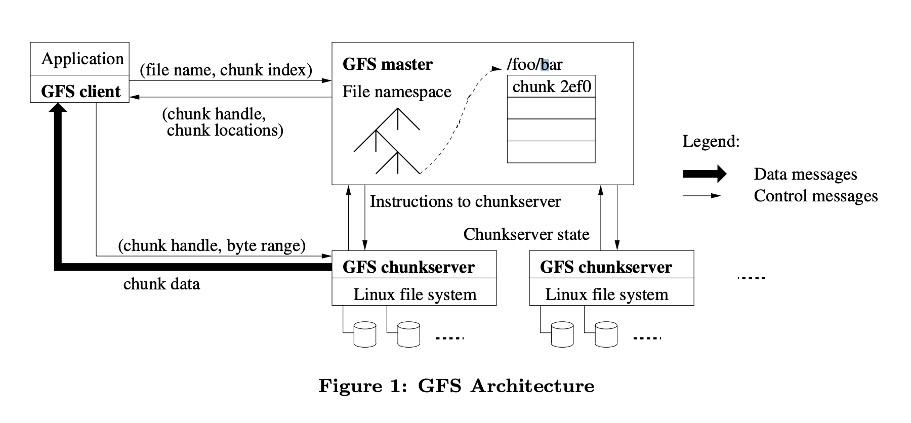
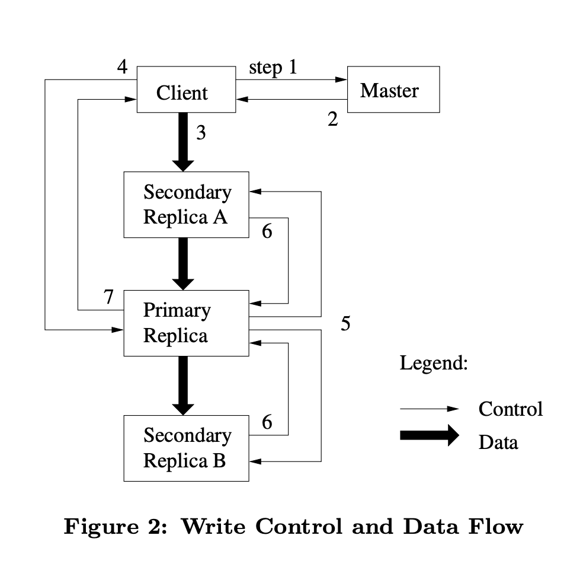

## Introduction

The Google File System is a scalable distributed file system for large distributed data-intensive applications.
It provides fault tolerance while running on inexpensive commodity hardware, and it delivers high aggregate performance to a large number of clients.

## Design

### Assumptions

We now lay out our assumptions in below details.

- Component failures are the norm rather than the exception. The system is built from many inexpensive commodity components that often fail.
  It must constantly monitor itself and detect, tolerate, and recover promptly from component failures on a routine basis.
- The system stores a modest number of large files.
  We expect a few million files, each typically 100 MB or larger in size.
  Multi-GB files are the common case and should be managed efficiently.
  Small files must be supported, but we need not optimize for them.
- Most files are mutated by appending new data rather than overwriting existing data. Random writes within a file are practically non-existent.
  The workloads have many large, sequential writes that append data to files. Once written, files are seldom modified again.
- Once written, the files are only read, and often only sequentially. A variety of data share these characteristics.
  The workloads primarily consist of two kinds of reads:large streaming reads and small random reads.
  Small writes at arbitrary positions in a file are supported but do not have to be efficient.
- The system must efficiently implement well-defined semantics for multiple clients that concurrently append to the same file.
  Our files are often used as producerconsumer queues or for many-way merging.
  Hundreds of producers, running one per machine, will concurrently append to a file. Atomicity with minimal synchronization overhead is essential.
  The file may be read later, or a consumer may be reading through the file simultaneously.
- High sustained bandwidth is more important than low latency.
  Most of our target applications place a premium on processing data in bulkat a high rate, while few have stringent response time requirements for an individual read or write.

### Interface

GFS provides a familiar file system interface, though it does not implement a standard API such as POSIX.
Files are organized hierarchically in directories and identified by pathnames.
We support the usual operations to *create*, *delete*, *open*, *close*, *read*, and *write* files.

Moreover, GFS has *snapshot* and *record append* operations.
Snapshot creates a copy of a file or a directory tree at low cost.
Record append allows multiple clients to append data to the same file concurrently while guaranteeing the atomicity of each individual client’s append.
It is useful for implementing multi-way merge results and producerconsumer queues that many clients can simultaneously append to without additional locking.

## Architecture

A GFS cluster consists of a single *master* and multiple *chunkservers* and is accessed by multiple *clients*, as shown in Figure 1.
Each of these is typically a commodity Linux machine running a user-level server process.

Files are divided into fixed-size *chunks*.
Each chunk is identified by an immutable and globally unique 64 bit chunk handle assigned by the master at the time of chunkcreation.
Chunkservers store chunks on local disks as Linux files and read or write chunkdata specified by a *chunk handle* and byte range.
For reliability, each chunk is replicated on multiple chunkservers.
By default, we store three replicas, though users can designate different replication levels for different regions of the file namespace.

The master maintains all file system metadata.
This includes the namespace, access control information, the mapping from files to chunks, and the current locations of chunks.
It also controls system-wide activities such as chunklease management, garbage collection of orphaned chunks, and chunkmigration between chunkservers.
The master periodically communicates with each chunkserver in *HeartBeat* messages to give it instructions and collect its state.

GFS client code linked into each application implements the file system API and communicates with the master and chunkservers to read or write data on behalf of the application.
Clients interact with the master for metadata operations, but all data-bearing communication goes directly to the chunkservers.
GFS client do not provide the POSIX API and therefore need not hook into the Linux vnode layer.

### Single Master

Having a single master vastly simplifies our design and enables the master to make sophisticated chunk placement and replication decisions using global knowledge.
However, we must minimize its involvement in reads and writes so that it does not become a bottleneck.
Clients never read and write file data through the master. Instead, a client asks the master which chunkservers it should contact.
It caches this information for a limited time and interacts with the chunkservers directly for many subsequent operations.

Let us explain the interactions for a simple read with reference to Figure 1.

First, using the fixed chunksize, the client translates the file name and byte offset specified by the application into a chunkindex within the file.
Then, it sends the master a request containing the file name and chunk index.
The master replies with the corresponding chunk handle and locations of the replicas.
The client caches this information using the file name and chunkindex as the key.

The client then sends a request to one of the replicas, most likely the closest one.
The request specifies the chunk handle and a byte range within that chunk.
Further reads of the same chunkrequire no more client-master interaction until the cached information expires or the file is reopened.
In fact, the client typically asks for multiple chunks in the same request and the master can also include the information for chunks immediately following those requested.
This extra information sidesteps several future client-master interactions at practically no extra cost.

Problems started to occur once the size of the underlying storage increased.
Going from a few hundred terabytes up to petabytes, and then up to tens of petabytes.

That really required a proportionate increase in the amount of metadata the master had to maintain.
Also, operations such as scanning the metadata to look for recoveries all scaled linearly with the volume of data. 
So the amount of work required of the master grew substantially. The amount of storage needed to retain all that information grew as well.

In addition, this proved to be a bottleneck for the clients, even though the clients issue few metadata operations themselves.
When you have thousands of clients all talking to the master at the same time, given that the master is capable of doing only a few thousand operations a second, the average client isn’t able to command all that many operations per second.

### Chunk Size

Chunksize is one of the key design parameters. 64 MB is much larger than typical file system blocksizes.
Each chunk replica is stored as a plain Linux file on a chunkserver and is extended only as needed.
Lazy space allocation avoids wasting space due to internal fragmentation, perhaps the greatest objection against such a large chunk size.

- First, it reduces clients’ need to interact with the master because reads and writes on the same chunkrequire only one initial request to the master for chunklocation information.
- Second, since on a large chunk, a client is more likely to perform many operations on a given chunk, it can reduce network overhead by keeping a persistent TCP connection to the chunkserver over an extended period of time.
- Third, it reduces the size of the metadata stored on the master. This allows us to keep the metadata in memory。

On the other hand, a large chunksize, even with lazy space allocation, has its disadvantages.

- A small file consists of a small number of chunks, perhaps just one.
- The chunkservers storing those chunks may become hot spots if many clients are accessing the same file.
  In practice, hot spots have not been a major issue because our applications mostly read large multi-chunkfiles sequentially.
  We fixed this problem by storing such executables with a higher replication factor and by making the batchqueue system stagger application start times.
  A potential long-term solution is to allow clients to read data from other clients in such situations.

### Metadata

The master stores three major types of metadata:

- the file and chunknamespaces
- the mapping from files to chunks
- the locations of each chunk’s replicas

All metadata is kept in the master’s memory.

- The first two types (namespaces and file-to-chunkmapping) are also kept persistent by logging mutations to an *operation log* stored on the master’s local diskand replicated on remote machines.
  Using a log allows us to update the master state simply, reliably, and without risking inconsistencies in the event of a master crash.
- The master does not store chunklocation information persistently. Instead, it asks each chunkserver about its chunks at master startup and whenever a chunkserver joins the cluster.
  It simply polls chunkservers for that information at startup.
  The master can keep itself up-to-date thereafter because it controls all chunkplacement and monitors chunkserver status with regular HeartBeat messages.
  This eliminated the problem of keeping the master and chunkservers in sync as chunkservers join and leave the cluster, change names, fail, restart, and so on.

Since metadata is stored in memory, master operations are fast.
Furthermore, it is easy and efficient for the master to periodically scan through its entire state in the background.
This periodic scanning is used to implement chunkgarbage collection, re-replication in the presence of chunkserver failures, and chunkmigration to balance load and diskspace usage across chunkservers.

The master maintains less than 64 bytes of metadata for each 64 MB chunk.
Most chunks are full because most files contain many chunks, only the last of which may be partially filled. Similarly, the file namespace data typically requires less then 64 bytes per file because it stores file names compactly using prefix compression.

#### Operation Log

The operation log contains a historical record of critical metadata changes.
It is central to GFS. Not only is it the only persistent record of metadata, but it also serves as a logical time line that defines the order of concurrent operations。

Since the operation log is critical, we must store it reliably and not make changes visible to clients until metadata changes are made persistent.
Otherwise, we effectively lose the whole file system or recent client operations even if the chunks themselves survive.
Therefore, we replicate it on multiple remote machines and respond to a client operation only after flushing the corresponding log record to disk both locally and remotely.
The master batches several log records together before flushing thereby reducing the impact of flushing and replication on overall system throughput.

The master recovers its file system state by replaying the operation log.
To minimize startup time, we must keep the log small.
The master checkpoints its state whenever the log grows beyond a certain size so that it can recover by loading the latest checkpoint from local disk and replaying only the limited number of log records after that.
The checkpoint is in a compact **B-tree** like form that can be directly mapped into memory and used for namespace lookup without extra parsing.
This further speeds up recovery and improves availability.

Because building a checkpoint can take a while, the master’s internal state is structured in such a way that a new checkpoint can be created without delaying incoming mutations.
*The master switches to a new log file and creates the new checkpoint in a separate thread.*
The new checkpoint includes all mutations before the switch. It can be created in a minute or so for a cluster with a few million files.
When completed, it is written to disk both locally and remotely.
Recovery needs only the latest complete checkpoint and subsequent log files.
Older checkpoints and log files can be freely deleted, though we keep a few around to guard against catastrophes.
A failure during checkpointing does not affect correctness because the recovery code detects and skips incomplete checkpoints.

## Consistency Model

GFS has a relaxed consistency model that supports our highly distributed applications well but remains relatively simple and efficient to implement.

### Guarantees by GFS

**File namespace mutations (e.g., file creation) are atomic.**
They are handled exclusively by the master: namespace locking guarantees atomicity and correctness; the master’s operation log defines a global total order of these operations.
The state of a file region after a data mutation depends on the type of mutation, whether it succeeds or fails, and whether there are concurrent mutations.

<table>
    <thead>
        <tr>
            <th></th>
            <th>Write</th>
            <th>Record Append</th>
        </tr>
    </thead>
    <tbody>
        <tr>
            <td>Serial success</td>
            <td>defined </td>
            <td rowspan=2>defined nterspersed with inconsistent </td>
        </tr>
        <tr>
            <td>Concurrent success</td>
            <td>consistent successes but undefined</td>
        </tr>
        <tr>
            <td>Failure</td>
            <td colspan=2>inconsistent</td>
        </tr>
    </tbody>
</table>

A file region is consistent if all clients will always see the same data, regardless of which replicas they read from.
A region is defined after a file data mutation if it is consistent and clients will see what the mutation writes in its entirety.
When a mutation succeeds without interference from concurrent writers, the affected region is defined (and by implication consistent): all clients will always see what the mutation has written.
Concurrent successful mutations leave the region undefined but consistent: all clients see the same data, but it may not reflect what any one mutation has written.
Typically, it consists of mingled fragments from multiple mutations.
A failed mutation makes the region inconsistent (hence also undefined): different clients may see different data at different times.
We describe below how our applications can distinguish defined regions from undefined regions.
The applications do not need to further distinguish between different kinds of undefined regions.

Data mutations may be writes or record appends.
A write causes data to be written at an application-specified file offset.
A record append causes data (the “record”) to be appended atomically at least once even in the presence of concurrent mutations, but at an offset of GFS’s choosing.
(In contrast, a “regular” append is merely a write at an offset that the client believes to be the current end of file.)
The offset is returned to the client and marks the beginning of a defined region that contains the record.
In addition, GFS may insert padding or record duplicates in between.
They occupy regions considered to be inconsistent and are typically dwarfed by the amount of user data.
After a sequence of successful mutations, the mutated file region is guaranteed to be defined and contain the data written by the last mutation.
GFS achieves this by (a) applying mutations to a chunkin the same order on all its replicas, and (b) using chunkversion numbers to detect any replica that has become stale because it has missed mutations while its chunkserver was down.
Stale replicas will never be involved in a mutation or given to clients asking the master for chunk locations. They are garbage collected at the earliest opportunity.

Since clients cache chunk locations, they may read from a stale replica before that information is refreshed.
This window is limited by the cache entry’s timeout and the next open of the file, which purges from the cache all chunk information for that file.
Moreover, as most of our files are append-only, a stale replica usually returns a premature end of chunk rather than outdated data.
When a reader retries and contacts the master, it will immediately get current chunk locations.
Long after a successful mutation, component failures can of course still corrupt or destroy data.
GFS identifies failed chunkservers by regular handshakes between master and all chunkservers and detects data corruption by checksumming.
Once a problem surfaces, the data is restored from valid replicas as soon as possible.
A chunk is lost irreversibly only if all its replicas are lost before GFS can react, typically within minutes.
Even in this case, it becomes unavailable, not corrupted: applications receive clear errors rather than corrupt data.

### Implications for Applications

GFS applications can accommodate the relaxed consistency model with a few simple techniques already needed for other purposes: **relying on appends rather than overwrites, checkpointing, and writing self-validating, self-identifying records**.

Practically all our applications mutate files by appending rather than overwriting.
In one typical use, a writer generates a file from beginning to end. It atomically renames the file to a permanent name after writing all the data, or periodically checkpoints how much has been successfully written.
Checkpoints may also include application-level checksums.
Readers verify and process only the file region up to the last checkpoint, which is known to be in the defined state. Regardless of consistency and concurrency issues, this approach has served us well.
Appending is far more efficient and more resilient to application failures than random writes.
Checkpointing allows writers to restart incrementally and keeps readers from processing successfully written file data that is still incomplete from the application’s perspective.

In the other typical use, many writers concurrently append to a file for merged results or as a producer-consumer queue.
Record append’s *append-at-least-once* semantics preserves each writer’s output. Readers deal with the occasional padding and duplicates as follows.
Each record prepared by the writer contains extra information like checksums so that its validity can be verified.
A reader can identify and discard extra padding and record fragments using the checksums.
If it cannot tolerate the occasional duplicates (e.g., if they would trigger non-idempotent operations), it can filter them out using unique identifiers in the records,
which are often needed anyway to name corresponding application entities such as web documents.

These functionalities for record I/O (except duplicate removal) are in library code shared by our applications and applicable to other file interface implementations at Google.
With that, the same sequence of records, plus rare duplicates, is always delivered to the record reader.

## System Interactions

We designed the system to minimize the master’s involvement in all operations. With that background, we now describe how the client, master, and chunkservers interact to
implement data mutations, atomic record append, and snapshot.

### Leases and Mutation Order

A mutation is an operation that changes the contents or metadata of a chunksuch as a write or an append operation.
Each mutation is performed at all the chunk’s replicas.
We use leases to maintain a consistent mutation order across replicas.
The master grants a chunklease to one of the replicas, which we call the primary.
The primary picks a serial order for all mutations to the chunk.
All replicas follow this order when applying mutations.
Thus, the global mutation order is defined first by the lease grant order chosen by the master, and within a lease by the serial numbers assigned by the primary.

The lease mechanism is designed to minimize management overhead at the master.
A lease has an initial timeout of 60 seconds.
However, as long as the chunkis being mutated, the primary can request and typically receive extensions from the master indefinitely.
These extension requests and grants are piggybacked on the HeartBeat messages regularly exchanged between the master and all chunkservers.
The master may sometimes try to revoke a lease before it expires (e.g., when the master wants to disable mutations on a file that is being renamed).
Even if the master loses communication with a primary, it can safely grant a new lease to another replica after the old lease expires.
In Figure 2, we illustrate this process by following the control flow of a write through these numbered steps.

1. The client asks the master which chunkserver holds the current lease for the chunkand the locations of the other replicas.
   If no one has a lease, the master grants one to a replica it chooses (not shown).
2. The master replies with the identity of the primary and the locations of the other (secondary) replicas.
   The client caches this data for future mutations.
   It needs to contact the master again only when the primary becomes unreachable or replies that it no longer holds a lease.
3. The client pushes the data to all the replicas. A client can do so in any order.
   Each chunkserver will store the data in an internal LRU buffer cache until the data is used or aged out.
   By decoupling the data flow from the control flow, we can improve performance by scheduling the expensive data flow based on the networktopology regardless of which chunkserver is the primary.
4. Once all the replicas have acknowledged receiving the data, the client sends a write request to the primary.
   The request identifies the data pushed earlier to all of the replicas.
   The primary assigns consecutive serial numbers to all the mutations it receives, possibly from multiple clients, which provides the necessary serialization.
   It applies the mutation to its own local state in serial number order.
5. The primary forwards the write request to all secondary replicas. Each secondary replica applies mutations in the same serial number order assigned by the primary.
6. The secondaries all reply to the primary indicating that they have completed the operation.
7. The primary replies to the client. Any errors encountered at any of the replicas are reported to the client.
   In case of errors, the write may have succeeded at the primary and an arbitrary subset of the secondary replicas. (If it had failed at the primary, it would not have been assigned a serial number and forwarded.)
   The client request is considered to have failed, and the modified region is left in an inconsistent state.
   Our client code handles such errors by retrying the failed mutation.
   It will make a few attempts at steps (3)through (7) before falling backto a retry from the beginning of the write.

If a write by the application is large or straddles a chunk boundary, GFS client code breaks it down into multiple write operations.
They all follow the control flow described above but may be interleaved with and overwritten by concurrent operations from other clients.
Therefore, the shared file region may end up containing fragments from different clients, although the replicas will be identical because the individual operations are completed successfully in the same order on all replicas.

### Data Flow

We decouple the flow of data from the flow of control to use the networkefficiently.
While control flows from the client to the primary and then to all secondaries, data is pushed linearly along a carefully picked chain of chunkservers in a pipelined fashion.

- To fully utilize each machine’s networkbandwidth, the data is pushed linearly along a chain of chunkservers rather than distributed in some other topology (e.g., tree).
- To avoid network bottlenecks and high-latency links (e.g., inter-switch links are often both) as much as possible, each machine forwards the data to the “closest” machine in the networktopology that has not received it.
  *Our networktopology is simple enough that “distances” can be accurately estimated from IP addresses.*
- Finally, we minimize latency by pipelining the data transfer over TCP connections.
  Once a chunkserver receives some data, it starts forwarding immediately.
  Pipelining is especially helpful to us because we use a switched networkwith full-duplex links.
  Sending the data immediately does not reduce the receive rate.

### Atomic Record Appends

GFS provides an atomic append operation called record append.
In a traditional write, the client specifies the offset at which data is to be written.
Concurrent writes to the same region are not serializable: the region may end up containing data fragments from multiple clients.
In a record append, however, the client specifies only the data.
GFS appends it to the file at least once atomically (i.e., as one continuous sequence of bytes) at an offset of GFS’s choosing and returns that offset to the client.
This is similar to writing to a file opened in O APPEND mode in Unix without the race conditions when multiple writers do so concurrently.
Record append is heavily used by our distributed applications in which many clients on different machines append to the same file concurrently.
Clients would need additional complicated and expensive synchronization, for example through a distributed lockmanager, if they do so with traditional writes.
In our workloads, such files often serve as multiple-producer/single-consumer queues or contain merged results from many different clients.
Record append is a kind of mutation and follows the control flow with only a little extra logic at the primary.
The client pushes the data to all replicas of the last chunkof the file Then, it sends its request to the primary.
The primary checks to see if appending the record to the current chunkwould cause the chunkto exceed the maximum size (64 MB).
If so, it pads the chunkto the maximum size, tells secondaries to do the same, and replies to the client indicating that the operation should be retried on the next chunk.
(Record append is restricted to be at most one-fourth of the maximum chunksize to keep worstcase fragmentation at an acceptable level.)
If the record fits within the maximum size, which is the common case, the primary appends the data to its replica,
tells the secondaries to write the data at the exact offset where it has, and finally replies success to the client.

If a record append fails at any replica, the client retries the operation.
As a result, replicas of the same chunkmay contain different data possibly including duplicates of the same record in whole or in part.
GFS does not guarantee that all replicas are bytewise identical.
It only guarantees that the data is written at least once as an atomic unit.
This property follows readily from the simple observation that for the operation to report success, the data must have been written at the same offset on all replicas of some chunk.
Furthermore, after this, all replicas are at least as long as the end of record and therefore any future record will be assigned a higher offset or a different chunkeven if a different replica later becomes the primary.
In terms of our consistency guarantees, the regions in which successful record append operations have written their data are defined (hence consistent), whereas intervening regions are inconsistent (hence undefined).

### Snapshot

The snapshot operation makes a copy of a file or a directory tree (the “source”) almost instantaneously, while minimizing any interruptions of ongoing mutations.
Our users use it to quickly create branch copies of huge data sets (and often copies of those copies, recursively),
or to checkpoint the current state before experimenting with changes that can later be committed or rolled backeasily.
Like AFS, we use standard copy-on-write techniques to implement snapshots.
When the master receives a snapshot request, it first revokes any outstanding leases on the chunks in the files it is about to snapshot.
This ensures that any subsequent writes to these chunks will require an interaction with the master to find the lease holder.
This will give the master an opportunity to create a new copy of the chunk first.

After the leases have been revoked or have expired, the master logs the operation to disk.
It then applies this log record to its in-memory state by duplicating the metadata for the source file or directory tree. The newly created snapshot files point to the same chunks as the source files.
The first time a client wants to write to a chunkC after the snapshot operation, it sends a request to the master to find the current lease holder.
The master notices that the reference count for chunkC is greater than one. It defers replying to the client request and instead picks a new chunk handle C’.
It then asks each chunkserver that has a current replica of C to create a new chunkcalled C’.
By creating the new chunkon the same chunkservers as the original, we ensure that the data can be copied locally,
not over the network(our disks are about three times as fast as our 100 Mb Ethernet links).
From this point, request handling is no different from that for any chunk: the master grants one of the replicas a lease on the new chunkC’ and replies to the client,
which can write the chunknormally, not knowing that it has just been created from an existing chunk.

## Master Operation

The master executes all namespace operations.
In addition, it manages chunk replicas throughout the system:
it makes placement decisions, creates new chunks and hence replicas, and coordinates various system-wide activities to keep chunks fully replicated,
to balance load across all the chunkservers, and to reclaim unused storage. We now discuss each of these topics.

### Namespace Management and Locking

Many master operations can take a long time: for example, a snapshot operation has to revoke chunkserver leases on all chunks covered by the snapshot. We do not want to delay other master operations while they are running.
Therefore, we allow multiple operations to be active and use locks over regions of the namespace to ensure proper serialization.
Unlike many traditional file systems, GFS does not have a per-directory data structure that lists all the files in that directory.
Nor does it support aliases for the same file or directory (i.e, hard or symbolic links in Unix terms).

GFS logically represents its namespace as a lookup table mapping full pathnames to metadata.
With prefix compression, this table can be efficiently represented in memory.
Each node in the namespace tree (either an absolute file name or an absolute directory name) has an associated read-write lock.

### Chunk Replicas

A GFS cluster is highly distributed at more levels than one.
**The chunk replica placement policy serves two purposes: maximize data reliability and availability, and maximize network bandwidth utilization.**

For both, it is not enough to spread replicas across machines, which only guards against diskor machine failures and fully utilizes each machine’s networkbandwidth.
We must also spread chunk replicas across racks.
This ensures that some replicas of a chunk will survive and remain available even if an entire rackis damaged or offline (for example,
due to failure of a shared resource like a network switch or power circuit).
It also means that traffic, especially reads, for a chunkcan exploit the aggregate bandwidth of multiple racks.
On the other hand, write traffic has to flow through multiple racks, a tradeoff we make willingly.

**Chunk replicas are created for three reasons: chunk creation, re-replication, and rebalancing.**

When the master creates a chunk, it chooses where to place the initially empty replicas. It considers several factors.

1. We want to place new replicas on chunkservers with below-average diskspace utilization. Over time this will equalize disk utilization across chunkservers.
2. We want to limit the number of “recent” creations on each chunkserver.
   Although creation itself is cheap, it reliably predicts imminent heavy write traffic because chunks are created when demanded by writes,
   and in our append-once-read-many workload they typically become practically read-only once they have been completely written.
3. As discussed above, we want to spread replicas of a chunk across racks.

The master re-replicates a chunkas soon as the number of available replicas falls below a user-specified goal.
This could happen for various reasons: a chunkserver becomes unavailable, it reports that its replica may be corrupted, one of its disks is disabled because of errors, or the replication goal is increased.
Each chunkthat needs to be re-replicated is prioritized based on several factors. One is how far it is from its replication goal.

- For example, we give higher priority to a chunk that has lost two replicas than to a chunkthat has lost only one.
- In addition, we prefer to first re-replicate chunks for live files as opposed to chunks that belong to recently deleted files.
- Finally, to minimize the impact of failures on running applications, we boost the priority of any chunkthat is blocking client progress.

The master picks the highest priority chunk and “clones” it by instructing some chunkserver to copy the chunk data directly from an existing valid replica.
The new replica is placed with goals similar to those for creation: equalizing diskspace utilization, limiting active clone operations on any single chunkserver, and spreading replicas across racks.
To keep cloning traffic from overwhelming client traffic, the master limits the numbers of active clone operations both for the cluster and for each chunkserver.
Additionally, each chunkserver limits the amount of bandwidth it spends on each clone operation by throttling its read requests to the source chunkserver.

Finally, the master *rebalances replicas* periodically: it examines the current replica distribution and moves replicas for better diskspace and load balancing.
Also through this process, the master gradually fills up a new chunkserver rather than instantly swamps it with new chunks and the heavy write traffic that comes with them.
The placement criteria for the new replica are similar to those discussed above.
In addition, the master must also choose which existing replica to remove.
In general, it prefers to remove those on chunkservers with below-average free space so as to equalize diskspace usage.

## Garbage Collection

After a file is deleted, GFS does not immediately reclaim the available physical storage.
It does so only lazily during regular garbage collection at both the file and chunklevels.
We find that this approach makes the system much simpler and more reliable.

### Mechanism

When a file is deleted by the application, the master logs the deletion immediately just like other changes.
However instead of reclaiming resources immediately, the file is just renamed to a hidden name that includes the deletion timestamp.
During the master’s regular scan of the file system namespace, it removes any such hidden files if they have existed for more than three days (the interval is configurable).
Until then, the file can still be read under the new, special name and can be undeleted by renaming it backto normal.
When the hidden file is removed from the namespace, its inmemory metadata is erased. This effectively severs its links to all its chunks.

In a similar regular scan of the chunk namespace, the master identifies orphaned chunks (i.e., those not reachable from any file) and erases the metadata for those chunks.
In a HeartBeat message regularly exchanged with the master, each chunkserver reports a subset of the chunks it has,
and the master replies with the identity of all chunks that are no longer present in the master’s metadata.
The chunkserver is free to delete its replicas of such chunks.

### Discussion

Although distributed garbage collection is a hard problem that demands complicated solutions in the context of programming languages,
it is quite simple in our case. We can easily identify all references to chunks: they are in the fileto-chunkmappings maintained exclusively by the master.
We can also easily identify all the chunk replicas: they are Linux files under designated directories on each chunkserver.
Any such replica not known to the master is “garbage.”

The garbage collection approach to storage reclamation offers several advantages over eager deletion.

- First, it is simple and reliable in a large-scale distributed system where component failures are common. Chunkcreation may succeed on some chunkservers but not others, leaving replicas that the master does not know exist.
  Replica deletion messages may be lost, and the master has to remember to resend them across failures, both its own and the chunkserver’s.
  Garbage collection provides a uniform and dependable way to clean up any replicas not known to be useful.
- Second, it merges storage reclamation into the regular background activities of the master, such as the regular scans of namespaces and handshakes with chunkservers.
  Thus, it is done in batches and the cost is amortized.
  Moreover, it is done only when the master is relatively free.
  The master can respond more promptly to client requests that demand timely attention.
- Third, the delay in reclaiming storage provides a safety net against accidental, irreversible deletion.

In our experience, the main disadvantage is that the delay sometimes hinders user effort to fine tune usage when storage is tight.
Applications that repeatedly create and delete temporary files may not be able to reuse the storage right away.
We address these issues by expediting storage reclamation if a deleted file is explicitly deleted again.
We also allow users to apply different replication and reclamation policies to different parts of the namespace.
For example, users can specify that all the chunks in the files within some directory tree are to be stored without replication,
and any deleted files are immediately and irrevocably removed from the file system state.

### Stale Replica Detection

chunk replicas may become stale if a chunkserver fails and misses mutations to the chunkwhile it is down.
For each chunk, the master maintains a chunk version number to distinguish between up-to-date and stale replicas.

Whenever the master grants a new lease on a chunk, it increases the chunkversion number and informs the up-todate replicas.
The master and these replicas all record the new version number in their persistent state.
This occurs before any client is notified and therefore before it can start writing to the chunk.
If another replica is currently unavailable, its chunkversion number will not be advanced.
The master will detect that this chunkserver has a stale replica when the chunkserver restarts and reports its set of chunks and their associated version numbers.
If the master sees a version number greater than the one in its records, the master assumes that it failed when granting the lease and so takes the higher version to be up-to-date.

The master removes stale replicas in its regular garbage collection.
Before that, it effectively considers a stale replica not to exist at all when it replies to client requests for chunk information.
As another safeguard, the master includes the chunkversion number when it informs clients which chunkserver holds a lease on a chunk or when it instructs a chunkserver to read the chunk from another chunkserver in a cloning operation.
The client or the chunkserver verifies the version number when it performs the operation so that it is always accessing up-to-date data.

## Fault Tolerance and Diagnosis

One of our greatest challenges in designing the system is dealing with frequent component failures.
The quality and quantity of components together make these problems more the norm than the exception: we cannot completely trust the machines, nor can we completely trust the disks.
Component failures can result in an unavailable system or, worse, corrupted data.

### High Availability

Among hundreds of servers in a GFS cluster, some are bound to be unavailable at any given time.
We keep the overall system highly available with two simple yet effective strategies: *fast recovery* and *replication*.

#### Fast Recovery

Both the master and the chunkserver are designed to restore their state and start in seconds no matter how they terminated.
In fact, we do not distinguish between normal and abnormal termination; servers are routinely shut down just by killing the process.
Clients and other servers experience a minor hiccup as they time out on their outstanding requests, reconnect to the restarted server, and retry.

#### Chunk Replication

As discussed earlier, each chunkis replicated on multiple chunkservers on different racks. Users can specify different replication levels for different parts of the file namespace.
The default is three. The master clones existing replicas as needed to keep each chunk fully replicated as chunkservers go offline or detect corrupted replicas through checksum verification.
Although replication has served us well, we are exploring other forms of cross-server redundancy such as parity or erasure codes for our increasing readonly storage requirements.
We expect that it is challenging but manageable to implement these more complicated redundancy schemes in our very loosely coupled system because our traffic is dominated by appends and reads rather than small random writes.

#### Master Replication

The master state is replicated for reliability. Its operation log and checkpoints are replicated on multiple machines.
A mutation to the state is considered committed only after its log record has been flushed to disklocally and on all master replicas.
For simplicity, one master process remains in charge of all mutations as well as background activities such as garbage collection that change the system internally.
When it fails, it can restart almost instantly.
If its machine or diskfails, monitoring infrastructure outside GFS starts a new master process elsewhere with the replicated operation log.
Clients use only the canonical name of the master (e.g. gfs-test), which is a DNS alias that can be changed if the master is relocated to another machine.

Moreover, “shadow” masters provide read-only access to the file system even when the primary master is down.
They are shadows, not mirrors, in that they may lag the primary slightly, typically fractions of a second.
They enhance read availability for files that are not being actively mutated or applications that do not mind getting slightly stale results.
In fact, since file content is read from chunkservers, applications do not observe stale file content.
What could be stale within short windows is file metadata, like directory contents or access control information.
To keep itself informed, a shadow master reads a replica of the growing operation log and applies the same sequence of changes to its data structures exactly as the primary does.
Like the primary, it polls chunkservers at startup (and infrequently thereafter) to locate chunk replicas and exchanges frequent handshake messages with them to monitor their status.
It depends on the primary master only for replica location updates resulting from the primary’s decisions to create and delete replicas.

### Data Integrity

Each chunkserver uses checksumming to detect corruption of stored data.
Given that a GFS cluster often has thousands of disks on hundreds of machines, it regularly experiences diskfailures that cause data corruption or loss on both the read and write paths.
We can recover from corruption using other chunk replicas, but it would be impractical to detect corruption by comparing replicas across chunkservers.
Moreover, divergent replicas may be legal: the semantics of GFS mutations, in particular atomic record append as discussed earlier, does not guarantee identical replicas.
Therefore, each chunkserver must independently verify the integrity of its own copy by maintaining checksums.

A chunkis broken up into 64 KB blocks. Each has a corresponding 32 bit checksum.
Like other metadata, checksums are kept in memory and stored persistently with logging, separate from user data.
For reads, the chunkserver verifies the checksum of data blocks that overlap the read range before returning any data to the requester, whether a client or another chunkserver.
Therefore chunkservers will not propagate corruptions to other machines.
If a blockdoes not match the recorded checksum, the chunkserver returns an error to the requestor and reports the mismatch to the master.
In response, the requestor will read from other replicas, while the master will clone the chunkfrom another replica.
After a valid new replica is in place, the master instructs the chunkserver that reported the mismatch to delete its replica.

Checksumming has little effect on read performance for several reasons.
Since most of our reads span at least a few blocks, we need to read and checksum only a relatively small amount of extra data for verification.
GFS client code further reduces this overhead by trying to align reads at checksum block boundaries.
Moreover, checksum lookups and comparison on the chunkserver are done without any I/O, and checksum calculation can often be overlapped with I/Os.

Checksum computation is heavily optimized for writes that append to the end of a chunk(as opposed to writes that overwrite existing data) because they are dominant in our workloads.
We just incrementally update the checksum for the last partial checksum block, and compute new checksums for any brand new checksum blocks filled by the append.
Even if the last partial checksum block is already corrupted and we fail to detect it now, the new checksum value will not match the stored data,
and the corruption will be detected as usual when the blockis next read.
In contrast, if a write overwrites an existing range of the chunk, we must read and verify the first and last blocks of the range being overwritten, then perform the write, and finally compute and record the new checksums.
If we do not verify the first and last blocks before overwriting them partially, the new checksums may hide corruption that exists in the regions not being overwritten.

During idle periods, chunkservers can scan and verify the contents of inactive chunks.
This allows us to detect corruption in chunks that are rarely read.
Once the corruption is detected, the master can create a new uncorrupted replica and delete the corrupted replica.
This prevents an inactive but corrupted chunkreplica from fooling the master into thinking that it has enough valid replicas of a chunk.

### Diagnostic Tools

Extensive and detailed diagnostic logging has helped immeasurably in problem isolation, debugging, and performance analysis, while incurring only a minimal cost.
Without logs, it is hard to understand transient, non-repeatable interactions between machines.
GFS servers generate diagnostic logs that record many significant events (such as chunkservers going up and down) and all RPC requests and replies.

These diagnostic logs can be freely deleted without affecting the correctness of the system.
However, we try to keep these logs around as far as space permits.

The RPC logs include the exact requests and responses sent on the wire, except for the file data being read or written.
By matching requests with replies and collating RPC records on different machines, we can reconstruct the entire interaction history to diagnose a problem.
The logs also serve as traces for load testing and performance analysis.
**The performance impact of logging is minimal (and far outweighed by the benefits) because these logs are written sequentially and asynchronously.**
The most recent events are also kept in memory and available for continuous online monitoring.

## Links

- [BigData](/docs/CS/Java/BigData/BigData.md)

## References

1. [The Google File System](https://pdos.csail.mit.edu/6.824/papers/gfs.pdf)
2. [Web Search for a Planet: The Google Cluster Architecture](http://www.carfield.com.hk/document/networking/google_cluster.pdf?)
3. [The anatomy of a large-scale hypertextual Web search engine](https://snap.stanford.edu/class/cs224w-readings/Brin98Anatomy.pdf)
4. [GFS: Evolution on Fast-forward](https://web.eecs.umich.edu/~mosharaf/Readings/GFS-ACMQueue-2012.pdf)
