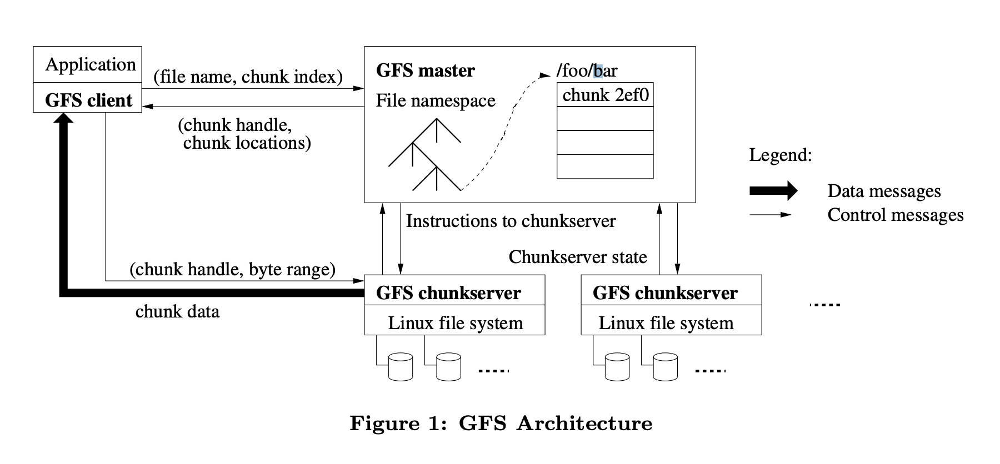
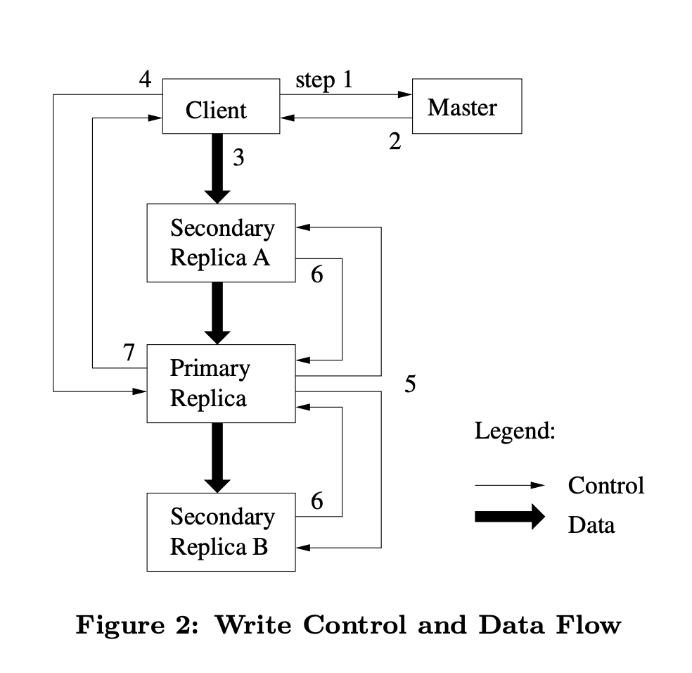

## Introduction

Google File System 是一个可扩展的分布式文件系统，用于大型分布式数据密集型应用程序。
它运行在廉价的通用硬件上提供容错能力，并为大量客户端提供高聚合性能。

## Design

### Assumptions

我们详细列出以下假设。

- 组件故障是常态而非异常。系统由许多经常故障的廉价通用组件构建。
  它必须持续监控自身，并定期检测、容忍和快速从组件故障中恢复。
- 系统存储适量的大文件。
  我们预计有数百万个文件，每个文件通常为 100 MB 或更大。
  多 GB 文件是常见情况，应高效管理。
  必须支持小文件，但我们不需要针对它们进行优化。
- 大多数文件通过追加新数据而非覆盖现有数据进行变更。文件内的随机写入实际上不存在。
  工作负载包含许多大型顺序写入，用于追加数据到文件。一旦写入，文件很少被再次修改。
- 写入后，文件只被读取，且通常是顺序读取。各种数据共享这些特性。
  工作负载主要包括两种读取：大型流式读取和小型随机读取。
  支持在文件任意位置的小型写入，但不必高效。
- 系统必须为并发追加到同一文件的多个客户端高效实现明确定义的语义。
  我们的文件通常用作生产者-消费者队列或多路合并。
  数百个生产者，每台机器一个，将并发追加到同一个文件。具有最小同步开销的原子性是必不可少的。
  文件可能在之后被读取，或消费者可能同时正在读取文件。
- 高持续带宽比低延迟更重要。
  我们的大多数目标应用重视以高速率批量处理数据，很少有应用对单个读取或写入有严格的响应时间要求。

### Interface

GFS 提供了熟悉的文件系统接口，尽管它没有实现标准 API（如 POSIX）。
文件按目录层次组织，并由路径名标识。
我们支持常见的操作来 *create*、*delete*、*open*、*close*、*read* 和 *write* 文件。

此外，GFS 具有 *snapshot* 和 *record append* 操作。
Snapshot 以低成本创建文件或目录树的副本。
Record append 允许多个客户端并发地向同一文件追加数据，同时保证每个客户端追加的原子性。
它对于实现多路合并结果和生产者-消费者队列非常有用，许多客户端可以在无需额外锁定的情况下同时追加。

## Architecture

一个 GFS 集群由单个 *master* 和多个 *chunkserver* 组成，并由多个 *client* 访问，如图 1 所示。
每个通常是在商用 Linux 机器上运行的用户级服务器进程。

Fig.1. GFS 架构

文件被分割成固定大小的 *chunk*。
每个 chunk 由 master 在 chunk 创建时分配的一个不可变的全局唯一 64 位 chunk handle 标识。
Chunkserver 将 chunk 作为 Linux 文件存储在本地磁盘上，并通过指定的 *chunk handle* 和字节范围读取或写入 chunk 数据。
为了可靠性，每个 chunk 在多个 chunkserver 上复制。
默认情况下，我们存储三个副本，尽管用户可以为文件命名空间的不同区域指定不同的复制级别。

Master 维护所有文件系统元数据。
这包括命名空间、访问控制信息、文件到 chunk 的映射以及 chunk 的当前位置。
它还控制系统范围的活动，如 chunk lease 管理、孤立 chunk 的垃圾回收以及 chunkserver 之间的 chunk 迁移。
Master 通过 *HeartBeat* 消息定期与每个 chunkserver 通信，以向其发出指令并收集其状态。

链接到每个应用程序的 GFS 客户端代码实现了文件系统 API，并代表应用程序与 master 和 chunkserver 通信以读取或写入数据。
客户端与 master 交互以进行元数据操作，但所有数据承载通信都直接发送到 chunkserver。
GFS 客户端不提供 POSIX API，因此不需要挂接到 Linux vnode 层。

### Single Master

拥有单个 master 大大简化了我们的设计，并使 master 能够利用全局知识做出复杂的 chunk 放置和复制决策。
然而，我们必须最小化其在读写中的参与，以免成为瓶颈。
客户端从不通过 master 读写文件数据。相反，客户端询问 master 它应该联系哪些 chunkserver。
它在有限的时间内缓存此信息，并直接与 chunkserver 交互以进行许多后续操作。

让我们参照图 1 解释简单读取的交互过程。

首先，使用固定的 chunk 大小，客户端将应用程序指定的文件名和字节偏移转换为文件中的 chunk 索引。
然后，它向 master 发送一个包含文件名和 chunk 索引的请求。
Master 回复相应的 chunk handle 和副本的位置。
客户端使用文件名和 chunk 索引作为键来缓存此信息。

然后，客户端向其中一个副本发送请求，通常是最接近的那个。
请求指定 chunk handle 和该 chunk 内的字节范围。
对同一 chunk 的进一步读取不需要更多的客户端-master 交互，直到缓存信息过期或文件重新打开。
实际上，客户端通常在同一请求中询问多个 chunk，并且 master 还可以包括紧接着所请求 chunk 之后的信息。
这些额外信息以几乎为零的额外成本避免了几次未来的客户端-master 交互。

当底层存储规模增长时，问题开始出现。
从几百 TB 到 PB 级别，再到几十 PB。

这确实需要 master 维护的元数据量成比例增长。
此外，扫描元数据以查找恢复等操作的规模都随数据量线性增长。
因此，master 所需的工作量大幅增长。保留所有这些信息所需的存储量也在增长。

此外，这被证明是客户端的瓶颈，即使客户端自身发出的元数据操作很少。
当你有数千个客户端同时与 master 通信时，鉴于 master 每秒只能执行几千个操作，平均每个客户端无法每秒执行太多操作。

### Chunk Size

Chunk 大小是关键设计参数之一。64 MB 远大于典型的文件系统块大小。
每个 chunk 副本作为普通的 Linux 文件存储在 chunkserver 上，仅在需要时扩展。
惰性空间分配避免了因内部碎片而浪费空间，这可能是反对如此大 chunk 大小的最主要理由。

- 首先，它减少了客户端与 master 交互的需要，因为对同一 chunk 的读写只需要一次向 master 请求 chunk 位置信息的初始交互。
- 其次，由于在大的 chunk 上，客户端更可能对给定 chunk 执行许多操作，它可以通过在较长时间段内保持到 chunkserver 的持久 TCP 连接来减少网络开销。
- 第三，它减少了 master 上存储的元数据大小。这使我们能够将元数据保存在内存中。

另一方面，大的 chunk 大小，即使有惰性空间分配，也有其缺点。

- 小文件由少量 chunk 组成，可能只有一个。
- 如果许多客户端正在访问同一个文件，存储这些 chunk 的 chunkserver 可能成为热点。
  在实践中，热点并不是主要问题，因为我们的应用程序主要顺序读取大型多 chunk 文件。
  我们通过以更高的复制因子存储此类可执行文件，并让批处理队列系统错开应用程序启动时间来解决此问题。
  一个潜在的长期解决方案是允许客户端在这种情况下列其他客户端读取数据。

### Metadata

Master 存储三种主要类型的元数据：

- 文件和 chunk 命名空间
- 文件到 chunk 的映射
- 每个 chunk 副本的位置

所有元数据都保存在 master 的内存中。

- 前两种类型（命名空间和文件到 chunk 的映射）也通过将变更记录到存储在 master 本地磁盘上并在远程机器上复制的 *操作日志* 来持久保存。
  使用日志使我们能够简单、可靠地更新 master 状态，而不会在 master 崩溃时冒不一致的风险。
- Master 不持久存储 chunk 位置信息。相反，它在 master 启动时以及每当 chunkserver 加入集群时询问每个 chunkserver 关于其 chunk 的信息。
  它只是在启动时轮询 chunkserver 以获取该信息。
  此后，Master 可以通过控制所有 chunk 放置以及通过定期的 HeartBeat 消息监控 chunkserver 状态来保持其信息最新。
  这消除了当 chunkserver 加入和离开集群、更改名称、失败、重新启动等时，使 master 和 chunkserver 保持同步的问题。

由于元数据存储在内存中，master 操作速度很快。
此外，master 在后台定期扫描其整个状态是容易且高效的。
这种定期扫描用于实现 chunk 垃圾回收、在 chunkserver 故障时重新复制以及跨 chunkserver 平衡负载和磁盘空间使用的 chunk 迁移。

Master 为每个 64 MB chunk 维护不到 64 字节的元数据。
大多数 chunk 是满的，因为大多数文件包含许多 chunk，只有最后一个可能是部分填充的。类似地，文件命名空间数据通常每个文件需要不到 64 字节，因为它使用前缀压缩紧凑地存储文件名。

#### Operation Log

操作日志包含关键元数据更改的历史记录。
它对 GFS 至关重要。它不仅是元数据的唯一持久记录，而且还充当逻辑时间线，定义并发操作的顺序。

由于操作日志至关重要，我们必须可靠地存储它，并且在元数据更改持久化之前不使更改对客户端可见。
否则，即使 chunk 本身幸存，我们也会有效地丢失整个文件系统或最近的客户端操作。
因此，我们在多个远程机器上复制它，并且仅在本地和远程刷新相应的日志记录后才响应客户端操作。
Master 在刷新前将多个日志记录批处理在一起，从而减少刷新和复制对整体系统吞吐量的影响。

Master 通过重放操作日志来恢复其文件系统状态。
为了最小化启动时间，我们必须保持日志较小。
当日志增长超过一定大小时，Master 对其状态设置检查点，以便它可以通过从本地磁盘加载最新的检查点并仅重放之后的有限数量的日志记录来恢复。
检查点采用紧凑的 **B-tree** 类似形式，可以直接映射到内存中并用于命名空间查找，无需额外解析。
这进一步加快了恢复速度并提高了可用性。

由于构建检查点可能需要一段时间，master 的内部状态结构使得可以在不延迟传入变更的情况下创建新的检查点。
*Master 切换到新的日志文件，并在单独的线程中创建新的检查点。*
新的检查点包括切换前的所有变更。对于具有数百万个文件的集群，它可以在大约一分钟内创建完成。
完成后，它被写入本地和远程磁盘。
恢复只需要最新的完整检查点和后续的日志文件。
更早的检查点和日志文件可以自由删除，尽管我们会保留一些以防止灾难。
检查点期间的失败不影响正确性，因为恢复代码会检测并跳过不完整的检查点。

## Consistency Model

GFS 具有宽松的一致性模型，这很好地支持了我们的高度分布式应用程序，同时保持相对简单和高效。

### Guarantees by GFS

**文件命名空间变更（如文件创建）是原子的。**
它们完全由 master 处理：命名空间锁定保证了原子性和正确性；master 的操作日志定义了这些操作的全局总序。
数据变更后文件区域的状态取决于变更的类型、成功或失败以及是否存在并发变更。

- 如果所有客户端无论从哪个副本读取都将始终看到相同的数据，则文件区域是 *consistent* 的。
- 如果文件数据变更后的区域是 consistent 的，并且客户端将看到变更写入的全部内容，则该区域是 *defined* 的。

当变更在没有并发写入者干扰的情况下成功时，受影响的区域是 defined（因此也是 consistent）：所有客户端将始终看到变更写入的内容。
并发成功的变更使区域 undefined 但 consistent：所有客户端看到相同的数据，但它可能不反映任何单个变更写入的内容。
通常，它由来自多个变更的混合片段组成。
失败的变更使区域 inconsistent（因此也是 undefined）：不同的客户端在不同时间可能看到不同的数据。

<table>
    <thead>
        <tr>
            <th></th>
            <th>Write</th>
            <th>Record Append</th>
        </tr>
    </thead>
    <tbody>
        <tr>
            <td>Serial success</td>
            <td>defined </td>
            <td rowspan=2>defined interspersed with inconsistent </td>
        </tr>
        <tr>
            <td>Concurrent success</td>
            <td>consistent successes but undefined</td>
        </tr>
        <tr>
            <td>Failure</td>
            <td colspan=2>inconsistent</td>
        </tr>
    </tbody>
</table>

数据变更可以是 writes 或 record appends。

- Write 导致数据写入应用程序指定的文件偏移量。
- Record append 导致数据（"record"）被原子地至少追加一次，即使在存在并发变更的情况下，但偏移量由 GFS 选择。
  （相比之下，"常规"追加只是在客户端认为是文件当前末尾的偏移量处的写入。）
  偏移量返回给客户端，并标记包含该记录的 defined 区域的开始。

此外，GFS 可能会在中间插入填充或重复的记录。
它们占据被认为 inconsistent 的区域，并且通常远小于用户数据量。

在一系列成功的变更之后，变更的文件区域保证是 defined 的，并包含最后一次变更写入的数据。
GFS 通过在其所有副本上以相同顺序对 chunk 应用变更，并使用 chunk 版本号来检测因 chunkserver 宕机而错过变更而过时的副本来实现这一点。
过时的副本永远不会参与变更，也不会在客户端向 master 询问 chunk 位置时被提供给客户端。它们会在最早的机会被垃圾回收。

由于客户端缓存 chunk 位置，它们可能在信息刷新之前从过时的副本读取。
这个窗口受到缓存条目超时和文件下次打开的限制，后者会从缓存中清除该文件的所有 chunk 信息。
此外，由于我们的大多数文件是仅追加的，过时的副本通常返回 chunk 的过早结束而非过时数据。
当读取器重试并联系 master 时，它将立即获得当前的 chunk 位置。

在成功变更很久之后，组件故障当然仍可能破坏或销毁数据。
GFS 通过 master 和所有 chunkserver 之间的定期握手来识别故障的 chunkserver，并通过校验和检测数据损坏。
一旦问题出现，数据会尽快从有效副本中恢复。
只有当所有副本在 GFS 能够做出反应之前丢失时，chunk 才会不可逆转地丢失，这通常发生在几分钟内。
即使在这种情况下，它变得不可用，而非损坏：应用程序收到明确的错误而非损坏的数据。

### Implications for Applications

GFS 应用程序可以通过一些已经因其他原因需要的简单技术来适应宽松的一致性模型：**依赖追加而非覆盖、检查点，以及编写自验证、自标识的记录**。

几乎所有我们的应用程序都通过追加而非覆盖来变更文件。
在一个典型用法中，写入者从头到尾生成一个文件。它在写入所有数据后将文件原子地重命名为永久名称，或定期检查点已成功写入的数据量。
检查点还可能包括应用程序级别的校验和。
读取者验证并仅处理直到最后一个检查点的文件区域，该区域已知处于 defined 状态。无论一致性和并发问题如何，这种方法对我们来说一直很有效。
追加比随机写入高效得多，也更能抵抗应用程序失败。
检查点允许写入者增量重新启动，并防止读取者处理从应用程序角度来看仍然不完整的已成功写入的文件数据。

在另一个典型用法中，许多写入者并发追加到同一个文件以获取合并结果或作为生产者-消费者队列。
Record append 的 *至少追加一次* 语义保留了每个写入者的输出。读取者按如下方式处理偶尔的填充和重复。
每个由写入者准备的记录包含额外信息（如校验和），以便可以验证其有效性。
读取者可以使用校验和来识别并丢弃额外的填充和记录片段。
如果它不能容忍偶尔的重复（例如，如果它们会触发非幂等操作），它可以使用记录中的唯一标识符来过滤掉它们，这些标识符通常无论如何都需要用来命名相应的应用程序实体，如 Web 文档。

这些用于记录 I/O 的功能（重复删除除外）位于我们的应用程序共享的库代码中，也适用于 Google 的其他文件接口实现。
这样，相同的记录序列（加上罕见的重复）总是被传递给记录读取器。

## System Interactions

我们设计系统以最小化 master 在所有操作中的参与。在此背景下，我们现在描述客户端、master 和 chunkserver 如何交互以实现数据变更、原子记录追加和快照。

### Leases and Mutation Order

变更是更改 chunk 内容或元数据的操作，如写入或追加操作。
每个变更在 chunk 的所有副本上执行。
我们使用 lease 来维护副本间一致的变更顺序。
Master 将 chunk lease 授予一个副本，我们称之为 primary。
Primary 为该 chunk 的所有变更选择一个串行顺序。
所有副本在应用变更时遵循此顺序。
因此，全局变更顺序首先由 master 选择的 lease 授予顺序定义，在 lease 内由 primary 分配的序列号定义。

Lease 机制旨在最小化 master 的管理开销。
Lease 的初始超时为 60 秒。
然而，只要 chunk 正在被变更，primary 可以请求并通常从 master 无限期地获得延期。
这些延期请求和授予附带在 master 和所有 chunkserver 之间定期交换的 HeartBeat 消息上。
Master 有时可能尝试在 lease 到期前撤销它（例如，当 master 想要禁用正在重命名的文件上的变更时）。
即使 master 与 primary 失去通信，它也可以在旧 lease 到期后安全地将新 lease 授予另一个副本。
在图 2 中，我们通过遵循写入的控制流经过这些编号步骤来说明此过程。

1. 客户端询问 master 哪个 chunkserver 持有该 chunk 的当前 lease，以及其他副本的位置。
   如果没有人持有 lease，master 将 lease 授予它选择的副本（未显示）。
2. Master 回复 primary 的身份和其他（secondary）副本的位置。
   客户端缓存此数据以供将来变更使用。
   只有在 primary 变得不可达或回复说它不再持有 lease 时，它才需要再次联系 master。
3. 客户端将数据推送到所有副本。客户端可以以任意顺序进行。
   每个 chunkserver 将数据存储在内部 LRU 缓冲区缓存中，直到数据被使用或老化出缓存。
   通过将数据流与控制流分离，我们可以根据网络拓扑调度昂贵的数据流，而不管哪个 chunkserver 是 primary，从而提高性能。
4. 一旦所有副本确认收到数据，客户端向 primary 发送写入请求。
   该请求标识先前推送到所有副本的数据。
   Primary 为它接收到的所有变更分配连续的序列号，可能来自多个客户端，这提供了必要的序列化。
   它按序列号顺序将变更应用到其本地状态。
5. Primary 将写入请求转发给所有 secondary 副本。每个 secondary 副本按照 primary 分配的相同序列号顺序应用变更。
6. 所有 secondary 回复 primary 表示它们已完成操作。
7. Primary 回复客户端。任何副本遇到的任何错误都会报告给客户端。
   如果发生错误，写入可能在 primary 和 secondary 副本的任意子集上成功。（如果它在 primary 上失败，则不会分配序列号并被转发。）
   客户端请求被认为是失败的，修改后的区域处于不一致状态。
   我们的客户端代码通过重试失败的变更来处理此类错误。
   它将在步骤 (3) 到 (7) 中进行几次尝试，然后回退到从写入开始处重试。

如果应用程序的写入很大或跨越 chunk 边界，GFS 客户端代码将其分解为多个写入操作。
它们都遵循上述控制流，但可能与其他客户端的并发操作交错和覆盖。
因此，共享文件区域可能最终包含来自不同客户端的片段，尽管副本将是相同的，因为单个操作在所有副本上以相同顺序成功完成。

Fig.2. GFS 写入流程

### Data Flow

我们将数据流与控制流分离，以高效利用网络。
控制流从客户端到 primary，然后到所有 secondary，而数据沿精心挑选的 chunkserver 链以管道方式线性推送。

- 为了充分利用每台机器的网络带宽，数据沿 chunkserver 链线性推送，而不是以其他拓扑（如树）分布。
- 为了尽可能避免网络瓶颈和高延迟链路（如交换机间链路通常既是瓶颈又是高延迟），每台机器将数据转发到网络拓扑中尚未接收数据的"最近"机器。
  *我们的网络拓扑足够简单，以至于"距离"可以从 IP 地址准确估算。*
- 最后，我们通过 TCP 连接上的管道数据传输来最小化延迟。
  一旦 chunkserver 收到一些数据，它立即开始转发。
  管道化对我们特别有帮助，因为我们使用全双工链路的交换网络。
  立即发送数据不会降低接收速率。

### Atomic Record Appends

GFS 提供称为 record append 的原子追加操作。
在传统写入中，客户端指定数据要写入的偏移量。
对同一区域的并发写入不可序列化：该区域可能最终包含来自多个客户端的数据片段。
然而，在 record append 中，客户端只指定数据。
GFS 以至少一次原子方式（即，作为一个连续的字节序列）将其追加到文件，偏移量由 GFS 选择，并将该偏移量返回给客户端。
这类似于在 Unix 中以 O_APPEND 模式写入文件，而没有多个写入者并发执行时的竞态条件。
Record append 被我们的分布式应用程序广泛使用，其中不同机器上的许多客户端并发地追加到同一个文件。
如果使用传统写入，客户端将需要额外复杂且昂贵的同步，例如通过分布式锁管理器。
在我们的工作负载中，此类文件通常用作多生产者/单消费者队列或包含来自许多不同客户端的合并结果。
Record append 是一种变更，遵循控制流，只需在 primary 处添加一点额外逻辑。
客户端将数据推送到文件最后一个 chunk 的所有副本。然后，它将请求发送给 primary。
Primary 检查将记录追加到当前 chunk 是否会导致 chunk 超过最大大小（64 MB）。
如果是，它将 chunk 填充到最大大小，告诉 secondary 也这样做，并回复客户端指示应在下一个 chunk 上重试操作。
（Record append 限制在最大 chunk 大小的四分之一以内，以将最坏情况的碎片控制在可接受的水平。）
如果记录适合最大大小（这是常见情况），primary 将数据追加到其副本，
告诉 secondary 在其确切偏移量处写入数据，最后回复客户端成功。

如果 record append 在任何副本上失败，客户端重试操作。
因此，同一 chunk 的副本可能包含不同的数据，可能包括全部或部分相同记录的重复。
GFS 不保证所有副本在字节级别相同。
它只保证数据至少作为原子单元写入一次。
这个属性很容易从简单的观察得出：对于报告成功的操作，数据必须在某个 chunk 的所有副本上的相同偏移量处被写入。
此外，在此之后，所有副本至少与记录末尾一样长，因此任何未来的记录将被分配更高的偏移量或不同的 chunk，即使不同的副本后来成为 primary。
就我们的 consistency 保证而言，成功的 record append 操作写入数据的区域是 defined（因此 consistent），而中间的区域是 inconsistent（因此 undefined）。

### Snapshot

Snapshot 操作几乎瞬时地复制文件或目录树（"源"），同时最小化对正在进行的变更的中断。
我们的用户使用它来快速创建大数据集的分支副本（以及通常是这些副本的递归副本），
或者在尝试稍后可以提交或轻松回滚的更改之前对当前状态进行检查点。
与 AFS 一样，我们使用标准的写时复制技术来实现快照。
当 master 收到快照请求时，它首先撤销要快照的文件中 chunk 上的任何未到期 lease。
这确保对这些 chunk 的任何后续写入都需要与 master 交互以找到 lease 持有者。
这将给 master 一个机会首先创建 chunk 的新副本。

在 lease 被撤销或过期后，master 将操作记录到磁盘。
然后，它通过复制源文件或目录树的元数据将此日志记录应用到其内存状态。新创建的快照文件指向与源文件相同的 chunk。
快照操作后客户端首次想要写入 chunkC 时，它向 master 发送请求以找到当前的 lease 持有者。
Master 注意到 chunkC 的引用计数大于 1。它推迟回复客户端请求，而是选择一个新的 chunk handle C'。
然后它要求具有 chunkC 当前副本的每个 chunkserver 创建一个名为 C' 的新 chunk。
通过在与原始 chunk 相同的 chunkserver 上创建新 chunk，我们确保数据可以在本地复制，
而不是通过网络（我们的磁盘速度大约是 100 Mb 以太网链路的三倍）。
从这一点开始，请求处理与任何 chunk 没有区别：master 将新 chunk C' 的一个副本的 lease 授予其中一个副本，并回复客户端，
客户端可以正常写入 chunk，不知道它刚刚从现有 chunk 创建。

## Master Operation

Master 执行所有命名空间操作。
此外，它管理系统中的 chunk 副本：
它做出放置决策，创建新的 chunk 和副本，并协调各种系统范围的活动以保持 chunk 完全复制、
平衡所有 chunkserver 之间的负载，以及回收未使用的存储。我们现在讨论每个主题。

### Namespace Management and Locking

许多 master 操作可能需要很长时间：例如，快照操作必须撤销快照覆盖的所有 chunk 上的 chunkserver lease。我们不希望在这些操作运行时延迟其他 master 操作。
因此，我们允许多个操作同时活跃，并使用命名空间区域上的锁来确保正确的序列化。
与许多传统文件系统不同，GFS 没有列出该目录中所有文件的按目录数据结构。
它也不支持同一文件或目录的别名（即 Unix 术语中的硬链接或符号链接）。

GFS 逻辑上将其命名空间表示为将完整路径名映射到元数据的查找表。
通过前缀压缩，该表可以在内存中高效表示。
命名空间树中的每个节点（绝对文件名或绝对目录名）都有一个关联的读写锁。

### Chunk Replicas

GFS 集群在多个层面上高度分布。
**Chunk 副本放置策略服务于两个目的：最大化数据可靠性和可用性，以及最大化网络带宽利用率。**

为了实现这两点，仅仅跨机器分布副本是不够的，这只能防止磁盘或机器故障并充分利用每台机器的网络带宽。
我们还必须跨机架分布 chunk 副本。
这确保了即使整个机架损坏或离线，某些 chunk 副本也能幸存并可访问（例如，
由于共享资源如网络交换机或电源电路故障）。
这也意味着对 chunk 的流量，尤其是读取，可以利用多个机架的聚合带宽。
另一方面，写入流量必须流经多个机架，这是我们愿意做出的权衡。

**创建 chunk 副本有三个原因：chunk 创建、重新复制和重新平衡。**

当 master 创建 chunk 时，它选择放置初始空副本的位置。它考虑几个因素。

1. 我们希望将新副本放置在磁盘空间利用率低于平均水平的 chunkserver 上。随着时间的推移，这将均衡各 chunkserver 的磁盘利用率。
2. 我们希望限制每个 chunkserver 上"最近"创建的数量。
   尽管创建本身成本很低，但它可靠地预示着即将到来的大量写入流量，因为 chunk 是在写入需求时创建的，
   并且在我们的追加一次读取多次的工作负载中，它们通常在完全写入后变成实际上的只读。
3. 如上所述，我们希望跨机架分布 chunk 副本。

Master 在可用副本数低于用户指定的目标时立即重新复制 chunk。
这可能由于各种原因发生：chunkserver 不可用、报告其副本可能已损坏、其一个磁盘因错误而被禁用，或复制目标增加。
每个需要重新复制的 chunk 根据几个因素确定优先级。其中之一是与其复制目标的距离。

- 例如，我们给予丢失了两个副本的 chunk 比仅丢失了一个副本的 chunk 更高的优先级。
- 此外，我们更倾向于优先重新复制属于活跃文件的 chunk，而不是属于最近删除的文件的 chunk。
- 最后，为了最小化故障对正在运行的应用程序的影响，我们提升任何阻止客户端进度的 chunk 的优先级。

Master 选择最高优先级的 chunk 并通过指示某个 chunkserver 直接从现有的有效副本复制 chunk 数据来"克隆"它。
新副本的放置目标类似于创建时的目标：均衡磁盘空间利用率、限制单个 chunkserver 上的活跃克隆操作数量，以及跨机架分布副本。
为了防止克隆流量压倒客户端流量，master 限制了集群级别和每个 chunkserver 级别的活跃克隆操作数量。
此外，每个 chunkserver 通过限制其对源 chunkserver 的读取请求来限制它在每个克隆操作上花费的带宽量。

最后，master 定期**重新平衡副本**：它检查当前的副本分布，并移动副本以实现更好的磁盘空间和负载均衡。
同样通过这个过程，master 逐步填满新的 chunkserver，而不是立即用新 chunk 及其带来的大量写入流量淹没它。
新副本的放置标准类似于上述讨论的标准。
此外，master 还必须选择要移除的现有副本。
通常，它更倾向于移除磁盘空间低于平均水平的 chunkserver 上的副本，以均衡磁盘空间使用。

## Garbage Collection

删除文件后，GFS 不会立即回收可用的物理存储。
它仅在文件和 chunk 级别的定期垃圾回收期间惰性地回收。
我们发现这种方法使系统更简单、更可靠。

### Mechanism

当应用程序删除文件时，master 像其他更改一样立即记录删除。
然而，它不会立即回收资源，而是将文件重命名为一个包含删除时间戳的隐藏名称。
在 master 定期扫描文件系统命名空间期间，它会删除任何存在时间超过三天（该间隔可配置）的此类隐藏文件。
在此之前，该文件仍然可以使用新的特殊名称读取，并且可以通过重命名回正常名称来取消删除。
当隐藏文件从命名空间中移除时，其内存中的元数据被擦除。这有效地切断了它与所有 chunk 的链接。

在类似的 chunk 命名空间定期扫描中，master 识别孤立的 chunk（即从任何文件都不可达的 chunk），并擦除这些 chunk 的元数据。
在定期与 master 交换的 HeartBeat 消息中，每个 chunkserver 报告它拥有的 chunk 的子集，
master 回复 master 元数据中不再存在的所有 chunk 的标识。
Chunkserver 可以自由删除此类 chunk 的副本。

### Discussion

尽管分布式垃圾回收在编程语言上下文中是一个需要复杂解决方案的难题，
但在我们的案例中却很简单。我们可以轻松识别对 chunk 的所有引用：它们完全由 master 维护的文件到 chunk 的映射。
我们也可以轻松识别所有 chunk 副本：它们是每个 chunkserver 上指定目录下的 Linux 文件。
任何 master 不知情的此类副本都是"垃圾"。

与立即删除相比，垃圾回收方法在存储回收方面具有几个优势。

- 首先，在组件故障常见的大规模分布式系统中，它简单可靠。Chunk 创建可能在某些 chunkserver 上成功但在其他服务器上失败，从而留下 master 不知道其存在的副本。
  副本删除消息可能丢失，并且 master 必须记住在故障（包括其自身和 chunkserver 的故障）后重新发送它们。
  垃圾回收提供了一种统一且可靠的方法来清理任何未知有用的副本。
- 其次，它将存储回收合并到 master 的常规后台活动中，例如命名空间的定期扫描和与 chunkserver 的握手。
  因此，它以批处理方式完成，成本被分摊。
  此外，它仅在 master 相对空闲时进行。
  Master 可以更迅速地响应需要及时关注的客户端请求。
- 第三，回收存储的延迟为防止意外、不可逆的删除提供了一个安全网。

根据我们的经验，主要缺点是延迟有时会阻碍用户努力在存储紧张时进行微调。
反复创建和删除临时文件的应用程序可能无法立即重用存储。
我们通过在被删除的文件被显式再次删除时加速存储回收来解决这些问题。
我们还允许用户对命名空间的不同部分应用不同的复制和回收策略。
例如，用户可以指定某个目录树中的文件的所有 chunk 都无需复制存储，
并且任何删除的文件都会立即且不可撤销地从文件系统状态中移除。

### Stale Replica Detection

如果 chunkserver 宕机并错过了 chunk 在其宕机期间的变更，chunk 副本可能会变得过时。
对于每个 chunk，master 维护一个 chunk 版本号以区分最新和过时的副本。

每当 master 授予新的 chunk lease 时，它会增加 chunk 版本号并通知最新的副本。
Master 和这些副本都在其持久状态中记录新的版本号。
这发生在任何客户端被通知之前，因此也发生在它可以开始写入该 chunk 之前。
如果另一个副本当前不可用，其 chunk 版本号将不会更新。
当 chunkserver 重新启动并报告其 chunk 集合及其关联的版本号时，master 将检测到该 chunkserver 有过时的副本。
如果 master 看到的版本号大于其记录中的版本号，则 master 假设它在授予 lease 时失败，因此将更高的版本视为最新版本。

Master 在其常规垃圾回收中移除过时的副本。
在此之前，当它回复客户端的 chunk 信息请求时，它有效地将过时副本视为不存在。
作为另一项安全措施，master 在通知客户端哪个 chunkserver 持有 chunk lease 或在指示 chunkserver 在克隆操作中从另一个 chunkserver 读取 chunk 时，包含 chunk 版本号。
客户端或 chunkserver 在执行操作时验证版本号，以确保始终访问最新数据。

## Fault Tolerance and Diagnosis

我们设计系统时面临的最大挑战之一是处理频繁的组件故障。
组件的质量和数量共同使这些问题成为常态而非异常：我们不能完全信任机器，也不能完全信任磁盘。
组件故障可能导致系统不可用，或更糟的是数据损坏。

### High Availability

在 GFS 集群的数百台服务器中，某些服务器在任何给定时间都必然不可用。
我们通过两种简单而有效的策略保持整个系统的高可用性：*快速恢复* 和 *复制*。

#### Fast Recovery

无论是 master 还是 chunkserver，都被设计为无论以何种方式终止，都能在几秒内恢复其状态并启动。
实际上，我们不区分正常和异常终止；服务器通常只是通过终止进程来关闭。
客户端和其他服务器会经历短暂的中断，因为它们在未完成的请求上超时，重新连接到重新启动的服务器，并重试。

#### Chunk Replication

如前所述，每个 chunk 在位于不同机架的多个 chunkserver 上复制。用户可以为文件命名空间的不同部分指定不同的复制级别。
默认是三个。Master 根据需要克隆现有的副本，以保持每个 chunk 完全复制，当 chunkserver 离线或通过校验和验证检测到损坏的副本时。
尽管复制对我们来说效果很好，但我们正在探索其他形式的跨服务器冗余，如奇偶校验或纠删码，以满足我们日益增长的只读存储需求。
我们期望在我们的高度松耦合系统中实现这些更复杂的冗余方案具有挑战性但是可管理的，因为我们的流量主要由追加和读取而非小型随机写入主导。

#### Master Replication

Master 状态被复制以实现可靠性。其操作日志和检查点在多台机器上复制。
状态的变更仅在日志记录已在本地和所有 master 副本上刷新后才被认为已提交。
为简单起见，一个 master 进程负责所有变更以及改变系统内部状态的后台活动，如垃圾回收。
当它失败时，它可以几乎立即重新启动。
如果其机器或磁盘故障，GFS 外部的监控基础设施使用复制的操作日志在其他地方启动新的 master 进程。
客户端仅使用 master 的规范名称（如 gfs-test），这是一个 DNS 别名，如果 master 被迁移到另一台机器，可以更改。

此外，"shadow" master 即使在主 master 宕机时也提供对文件系统的只读访问。
它们是影子，而非镜像，因为它们可能略微落后于 primary，通常不到一秒。
它们增强了未被积极变更的文件或不在意获取略微陈旧结果的应用程序的读取可用性。
实际上，由于文件内容从 chunkserver 读取，应用程序不会观察到过时的文件内容。
可能在短时间内过时的是文件元数据，如目录内容或访问控制信息。
Shadow master 通过读取不断增长的操作日志的副本，并像 primary 一样将其数据结构应用相同的更改序列来保持信息更新。
与 primary 一样，它在启动时（以及之后不频繁地）轮询 chunkserver 以定位 chunk 副本，并与它们交换频繁的握手消息以监控其状态。
它仅依赖 primary master 获取因 primary 创建和删除副本的决策而导致的副本位置更新。

### Data Integrity

每个 chunkserver 使用校验和来检测存储数据的损坏。
考虑到 GFS 集群通常有数百台机器上的数千个磁盘，它经常经历导致读写路径上的数据损坏或丢失的磁盘故障。
我们可以使用其他 chunk 副本从损坏中恢复，但通过比较跨 chunkserver 的副本来检测损坏是不切实际的。
此外，发散的副本可能是合法的：GFS 变更的语义，特别是前面讨论的原子记录追加，不保证副本完全相同。
因此，每个 chunkserver 必须通过维护校验和独立验证其自身副本的完整性。

一个 chunk 被分割成 64 KB 的块。每块都有一个对应的 32 位校验和。
与其他元数据一样，校验和保存在内存中，并通过日志持久化存储，与用户数据分开。
对于读取，chunkserver 在将任何数据返回给请求者（无论是客户端还是其他 chunkserver）之前，验证与读取范围重叠的数据块的校验和。
因此，chunkserver 不会将损坏传播到其他机器。
如果块与记录的校验和不匹配，chunkserver 向请求者返回错误，并向 master 报告不匹配。
作为响应，请求者将从其他副本读取，而 master 将从另一个副本克隆该 chunk。
在新的有效副本就位后，master 指示报告不匹配的 chunkserver 删除其副本。

校验和对读取性能影响很小，原因有几个。
由于我们的大多数读取至少跨越几个块，我们只需要读取并验证相对少量的额外数据。
GFS 客户端代码通过尝试在校验和块边界对齐读取来进一步减少此开销。
此外，在 chunkserver 上的校验和查找和比较无需任何 I/O 即可完成，并且校验和计算通常可以与 I/O 重叠。

校验和计算针对追加到 chunk 末尾的写入（而非覆盖现有数据的写入）进行了高度优化，因为这是我们的工作负载中的主要情况。
我们只需增量更新最后一个部分校验和块的校验和，并为追加填写的任何全新校验和块计算新的校验和。
即使最后一个部分校验和块已经损坏而我们未能立即检测到，新的校验和值也将与存储的数据不匹配，
当下次读取该块时，将像往常一样检测到损坏。
相比之下，如果写入覆盖了 chunk 的现有范围，我们必须读取和验证正在被覆盖的范围的第一个和最后一个块，然后执行写入，最后计算并记录新的校验和。
如果在部分覆盖之前不验证第一个和最后一个块，新的校验和可能隐藏未覆盖区域中存在的损坏。

在空闲期间，chunkserver 可以扫描和验证非活跃 chunk 的内容。
这使我们能够检测到很少被读取的 chunk 中的损坏。
一旦检测到损坏，master 可以创建一个新的未损坏副本并删除损坏的副本。
这可以防止非活跃但已损坏的 chunk 副本欺骗 master，使其以为它拥有足够的有效 chunk 副本。

### Diagnostic Tools

广泛而详细的诊断日志在问题隔离、调试和性能分析方面提供了不可估量的帮助，而成本却很低。
没有日志，很难理解机器之间短暂的、不可重现的交互。
GFS 服务器生成诊断日志，记录许多重要事件（如 chunkserver 上下线）以及所有 RPC 请求和回复。

这些诊断日志可以自由删除，而不影响系统的正确性。
然而，只要空间允许，我们都会尽量保留这些日志。

RPC 日志包括线上发送的确切请求和响应，但正在读取或写入的文件数据除外。
通过匹配请求与回复，并整理不同机器上的 RPC 记录，我们可以重建整个交互历史以诊断问题。
日志还用作负载测试和性能分析的追踪。
**日志记录的性能影响很小（且远小于其带来的好处），因为这些日志是按顺序异步写入的。**
最近的事件也保存在内存中，并可用于持续在线监控。

## Links

- [Google](/docs/CS/Distributed/Google.md)
- [HDFS](/docs/CS/Distributed/HDFS.md)

## References

1. [The Google File System](https://pdos.csail.mit.edu/6.824/papers/gfs.pdf)
2. [The anatomy of a large-scale hypertextual Web search engine](https://snap.stanford.edu/class/cs224w-readings/Brin98Anatomy.pdf)
3. [GFS: Evolution on Fast-forward](https://web.eecs.umich.edu/~mosharaf/Readings/GFS-ACMQueue-2012.pdf)
4. [译文: The Google File System](https://github.com/Robinpig/Books/blob/main/Distributed/GFS.md)
5. [GFS: Evolution on Fast-Forward](https://www.cse.unsw.edu.au/~cs9243/20t3/papers/gfs-case-study.pdf)
