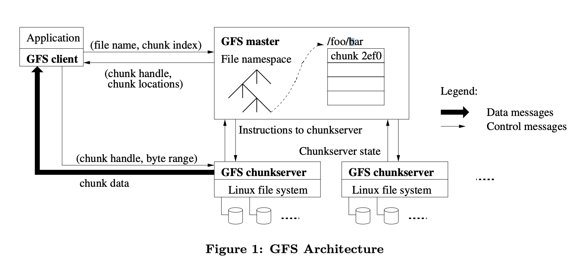
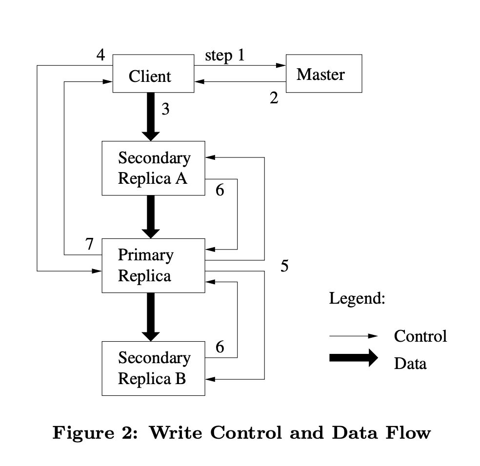

## Introduction

GFS 是一个可扩展的分布式文件系统，面向大型分布式数据密集型应用。它在廉价的商用硬件上运行的同时提供容错能力，并为大量客户端提供很高的聚合性能。

## 设计

### 假设

下面我们详细列出我们的假设。

- 组件故障是常态而非例外。系统由许多廉价商用组件构成，这些组件经常发生故障。系统必须持续监控自身，并例行地检测、容忍并从组件故障中快速恢复。
- 系统存储数量适中的大文件。我们预期有数百万个文件，每个通常 100 MB 或更大。多 GB 的文件很常见，并且应当被高效管理。小文件也必须被支持，但我们不必为它们做优化。
- 大多数文件通过追加新数据而非覆盖已有数据的方式被修改。文件内的随机写入几乎不存在。负载中存在大量对文件进行追加数据的大块顺序写。一旦写入，文件很少被再次修改。
- 写入之后，文件只被读取，并且常常只按序读取。多种数据具有这些特征。负载主要包括两类读：大的流式读和小的随机读。文件中任意位置的少量写是被支持的，但不必高效。
- 系统必须为多个并发向同一文件追加数据的客户端高效地实现良定义的语义。我们的文件常被用作生产者-消费者队列或用于多路合并。运行在每台机器上的一个客户端（共数百个）会并发地向一个文件追加数据。以最小的同步开销保证原子性是关键。文件可能在稍后被读取，或者一个消费者可能正在同时读取该文件。
- 高持续带宽比低延迟更重要。我们大多数的目标应用看重以高速度批量处理数据，只有少数对单次读写的响应时间有严格要求。

### 接口

GFS 提供了一套熟悉的文件系统接口，尽管它并没有实现像 POSIX 这样的标准 API。文件以目录层级组织，并通过路径名标识。我们支持常见的操作来 *create*（创建）、*delete*（删除）、*open*（打开）、*close*（关闭）、*read*（读）和 *write*（写）文件。

此外，GFS 还有 *snapshot*（快照）和 *record append*（记录追加）操作。Snapshot 以低成本创建一个文件或目录树的副本。Record append 允许多个客户端并发地向同一文件追加数据，同时保证每个客户端各自追加的原子性。它对于实现多路合并结果以及许多客户端无需额外加锁就能并发追加的生产者-消费者队列非常有用。

## 架构

一个 GFS 集群由一个 *master* 和多个 *chunkserver* 组成，并被多个 *client* 访问，如图 1 所示。其中每一个通常都是运行着用户级服务进程的商用 Linux 机器。

Fig.1. GFS Architecture

文件被划分为固定大小的 *chunk*。每个 chunk 由一个不可变且全局唯一的 64 位 chunk handle（chunk 句柄）标识，该句柄由 master 在 chunk 创建时分配。Chunkserver 将 chunk 作为 Linux 文件存储在本地磁盘上，并依据 chunk handle 和字节范围来读取或写入 chunk 数据。为了可靠性，每个 chunk 在多个 chunkserver 上复制。默认情况下，我们存储三个副本，不过用户可以针对文件命名空间的不同区域指定不同的复制级别。

Master 维护所有的文件系统元数据。这包括命名空间、访问控制信息、从文件到 chunk 的映射，以及 chunk 的当前位置。它还控制系统范围的活动，例如 chunk 租约管理、孤立 chunk 的垃圾回收，以及 chunkserver 之间的 chunk 迁移。Master 通过 HeartBeat 消息周期性地与每个 chunkserver 通信，以下达指令并收集其状态。

链接到每个应用中的 GFS 客户端代码实现了文件系统 API，并与 master 和 chunkserver 通信，代表应用读写数据。客户端就元数据操作与 master 交互，但所有承载数据的通信都直接发往 chunkserver。GFS 客户端不提供 POSIX API，因此无需挂接到 Linux 的 vnode 层。

### 单一 Master

采用单一 master 极大地简化了我们的设计，并使 master 能够利用全局知识做出精细的 chunk 放置和复制决策。然而，我们必须最小化它在读写中的参与度，以免它成为瓶颈。客户端从不通过 master 读写文件数据。相反，客户端询问 master 它应当联系哪些 chunkserver。客户端将该信息缓存有限的一段时间，并在随后的许多操作中直接与 chunkserver 交互。

下面我们结合图 1 来解释一次简单读取的交互过程。

首先，客户端利用固定的 chunk 大小，将应用指定的文件名和字节偏移量转换为文件内的一个 chunk 索引。然后，它向 master 发送一个包含文件名和 chunk 索引的请求。Master 回复相应的 chunk handle 和各个副本的位置。客户端以文件名和 chunk 索引作为键来缓存这些信息。

接着客户端向其中一个副本（很可能是最近的那个）发送请求。该请求指定了 chunk handle 和该 chunk 内的一个字节范围。在缓存的信息过期或文件被重新打开之前，对同一 chunk 的进一步读取不再需要客户端与 master 的交互。实际上，客户端通常在同一个请求中请求多个 chunk，而 master 也可以附带返回紧随其后的那些 chunk 的信息。这一额外信息几乎不花额外代价就规避了若干次未来的客户端-master 交互。

一旦底层存储规模增大，问题开始出现。从几百 TB 增长到 PB，再到几十个 PB。

这确实要求 master 必须维护的元数据量成比例地增加。此外，像扫描元数据以寻找需要恢复的对象这类操作，其开销与数据量呈线性增长。因此 master 需要做的工作量大幅增加，而保存所有这些信息的存储需求也随之增长。

此外，即便客户端自身发出的元数据操作很少，这对客户端也成了瓶颈。当你有数千个客户端同时与 master 通信时，鉴于 master 每秒只能处理几千次操作，平均每个客户端能够占用的每秒操作数就很有限了。

### Chunk 大小

Chunk 大小是关键的设计参数之一。64 MB 比典型的文件系统块大小大得多。每个 chunk 副本作为普通的 Linux 文件存储在 chunkserver 上，并且只在需要时才扩展。惰性空间分配避免了因内部碎片而浪费空间，而这大概是针对这种大 chunk 大小最大的反对意见。

- 首先，它减少了客户端与 master 交互的需求，因为对同一 chunk 的读写只需要一次向 master 请求 chunk 位置信息的初始请求。
- 其次，由于在一个大 chunk 上，客户端更可能对给定 chunk 执行多次操作，因此它可以通过在较长时间内与 chunkserver 保持一个持久的 TCP 连接来减少网络开销。
- 第三，它减小了 master 上存储的元数据大小。这使我们可以将元数据保存在内存中。

另一方面，即便采用惰性空间分配，大的 chunk 大小也有其缺点。

- 一个小文件由少量 chunk 组成，可能只有一个。如果许多客户端访问同一个文件，存储这些 chunk 的 chunkserver 可能成为热点。在实践中，热点并不是主要问题，因为我们的应用大多按顺序读取大的多 chunk 文件。我们通过以更高的复制系数来存储此类可执行文件，并让批处理队列系统错开应用的启动时间来解决这个问题。一个潜在的长期解决方案是允许客户端在这种情况下从其他客户端读取数据。

### 元数据

Master 存储三种主要类型的元数据：

- 文件和 chunk 的命名空间
- 从文件到 chunk 的映射
- 每个 chunk 各副本的位置

所有元数据都保存在 master 的内存中。

- 前两种类型（命名空间和文件到 chunk 的映射）还通过把变更记录到 operation log（操作日志）中来持久化保存，该日志存储在 master 的本地磁盘上，并复制到远程机器上。使用日志使我们能够简单、可靠地更新 master 状态，并且在 master 崩溃时不会有不一致的风险。
- Master 不持久化存储 chunk 位置信息。相反，它在 master 启动时以及每当一个 chunkserver 加入集群时，向每个 chunkserver 询问其 chunk。它只是在启动时轮询 chunkserver 以获取这些信息。此后 master 可以保持自身最新，因为它控制着所有的 chunk 放置，并通过常规的 HeartBeat 消息监控 chunkserver 状态。这消除了在 chunkserver 加入、离开集群、改名、失效、重启等情况下保持 master 与 chunkserver 同步的问题。

由于元数据存储在内存中，master 的操作很快。此外，master 在后台周期性地扫描其完整状态既简单又高效。这种周期扫描被用于实现 chunk 垃圾回收、在 chunkserver 故障时进行再复制，以及为平衡 chunkserver 间的负载和磁盘空间使用而进行的 chunk 迁移。

Master 为每个 64 MB 的 chunk 维护少于 64 字节的元数据。大多数 chunk 是满的，因为大多数文件包含许多 chunk，只有最后一个可能未被填满。类似地，文件命名空间数据通常每个文件需要少于 64 字节，因为它使用前缀压缩紧凑地存储文件名。

#### 操作日志

操作日志包含关键元数据变更的历史记录。它对 GFS 至关重要。它不仅是对元数据的唯一持久记录，还充当定义并发操作顺序的逻辑时间线。

由于操作日志至关重要，我们必须可靠地存储它，并且在元数据变更被持久化之前，不能让客户端看到这些变更。否则，即便 chunk 本身幸存，我们实际上也会丢失整个文件系统或客户端最近的操作。因此，我们在多台远程机器上复制它，并且只有在相应的日志记录已被刷新到本地和远程磁盘之后，才对客户端的操作作出响应。Master 在刷新前将若干日志记录一起批处理，从而减少对整体系统吞吐量的刷新与复制影响。

Master 通过重放操作日志来恢复其文件系统状态。为了最小化启动时间，我们必须让日志保持很小。当日志增长到超过一定大小时，master 会对它的状态做检查点，这样它就可以通过从本地磁盘加载最新的检查点并仅重放其后的有限数量的日志记录来恢复。检查点采用紧凑的类似于 **B-tree** 的形式，可以直接映射到内存中并用于命名空间查找，而无需额外的解析。这进一步加快了恢复速度并提高了可用性。

由于构建检查点可能要花一段时间，master 的内部状态被组织成这样一种方式：可以在不延迟传入变更的情况下创建新的检查点。*Master 切换到新的日志文件，并在一个单独的线程中创建新的检查点。* 新检查点包含了切换之前的所有变更。对于拥有几百万个文件的集群，它可以在一分钟左右创建完成。完成后，它被写入本地和远程磁盘。恢复只需要最新的完整检查点和后续的日志文件。较旧的检查点和日志文件可以自由删除，不过我们会保留几个以防灾难。检查点过程中的一次失败不会影响正确性，因为恢复代码会检测并跳过不完整的检查点。

## 一致性模型

GFS 拥有一条较为宽松的一致性模型，它很好地支持我们高度分布式的应用，同时仍然相对简单且易于实现。

### GFS 提供的保证

**文件命名空间的变更（例如文件创建）是原子的。** 它们由 master 专门处理：命名空间加锁保证了原子性和正确性；master 的操作日志定义了这些操作的全局全序。一次数据变更后文件区域的状态取决于变更的类型、成功与否，以及是否存在并发变更。

- 如果所有客户端无论读取哪个副本都将总是看到相同的数据，则一个文件区域是 *一致的*。
- 如果一个文件数据变更后该区域是一致的，并且客户端将看到该变更完整写入的内容，则该区域是 *已定义的*。

当一次变更成功且没有来自并发写入者的干扰时，受影响的区域是已定义的（并因此是一致的）：所有客户端将总是看到该变更所写入的内容。并发的成功变更使该区域处于未定义但一致的状态：所有客户端看到相同的数据，但这可能不反映任何一个变更所写入的内容。通常，它由来自多个变更的混杂片段组成。一次失败的变更使该区域不一致（因而也未定义）：不同的客户端可能在不同时间看到不同的数据。

<table>
    <thead>
        <tr>
            <th></th>
            <th>写入</th>
            <th>记录追加</th>
        </tr>
    </thead>
    <tbody>
        <tr>
            <td>串行成功</td>
            <td>已定义</td>
            <td rowspan=2>已定义，但夹杂不一致</td>
        </tr>
        <tr>
            <td>并发成功</td>
            <td>一致但未定义</td>
        </tr>
        <tr>
            <td>失败</td>
            <td colspan=2>不一致</td>
        </tr>
    </tbody>
</table>

数据变更可以是写或记录追加。

- 写导致数据被写入到应用指定的文件偏移量处。
- 记录追加导致数据（"记录"）被原子地至少追加一次，即便存在并发变更，但追加偏移量由 GFS 自行选择。（相比之下，"常规"追加仅仅是在客户端认为的当前文件末尾处的写入。）该偏移量被返回给客户端，并标记了包含该记录的已定义区域的起点。

此外，GFS 可能会在中间插入填充或记录副本。它们占据被认为不一致的区域，并且通常远小于用户数据量。

在一系列成功的变更之后，被变更的文件区域保证是已定义的，并包含最后一次变更所写入的数据。GFS 通过对 chunk 的所有副本以相同顺序应用变更，并使用 chunk 版本号来检测任何由于 chunkserver 宕机而错过变更的陈旧副本，从而实现这一点。陈旧的副本永远不会参与变更，也不会被提供给向 master 请求 chunk 位置的客户端。它们会被尽早地垃圾回收。

由于客户端缓存了 chunk 位置，在信息被刷新之前，它们可能从一个陈旧副本读取。这个窗口受缓存项的超时和文件的下一次打开所限制，后者会从缓存中清除该文件的所有 chunk 信息。此外，由于我们的大多数文件是仅追加的，陈旧副本通常返回一个过早的 chunk 末尾，而不是过期的数据。当读取者重试并联系 master 时，它会立即获得当前的 chunk 位置。

在成功变更之后很久，组件故障当然仍可能损坏或破坏数据。GFS 通过 master 与所有 chunkserver 之间的定期握手来识别失效的 chunkserver，并通过校验和来检测数据损坏。一旦问题浮现，数据会尽快从有效副本中恢复。一个 chunk 只有在 GFS 能够作出反应之前其所有副本都丢失时才会被不可逆转地丢失，这通常发生在几分钟之内。即便在这种情形下，它也是变为不可用，而非损坏：应用收到清晰的错误而不是损坏的数据。

### 对应用的影响

GFS 应用可以通过一些出于其他目的本就需要的简单技术来适应这种宽松的一致性模型：**依赖追加而非覆盖、做检查点，以及写入自验证、自标识的记录**。

实际上我们所有的应用都通过追加而非覆盖来修改文件。在一个典型用法中，一个写入者从头到尾生成一个文件。在写完所有数据后，它会以原子方式将文件重命名为一个永久名字，或者周期性地检查点记录已成功写入了多少。检查点也可以包含应用级的校验和。读取者只验证并处理到最后一个检查点为止的文件区域，该区域已知处于已定义状态。无论一致性和并发问题如何，这种方式都很好地服务了我们。追加比随机写更高效，并且对应用故障更具弹性。检查点允许写入者增量地重启，并防止读取者处理从应用视角看仍不完整的已成功写入的文件数据。

在另一个典型用法中，许多写入者并发地向一个文件追加以实现合并结果，或作为生产者-消费者队列。Record append 的 *至少追加一次* 语义保留了每个写入者的输出。读取者按如下方式处理偶发的填充和副本。写入者准备的每条记录都包含像校验和这样的额外信息，以便其有效性可以被验证。读取者可以使用校验和识别并丢弃多余的填充和记录片段。如果它不能容忍偶发的副本（例如，如果它们会触发非幂等操作），它可以使用记录中的唯一标识符来过滤掉它们，而这些标识符往往本来就是命名相应应用实体（例如 web 文档）所必需的。

这些用于记录 I/O 的功能（副本移除除外）位于我们的应用共享的库代码中，并且适用于 Google 的其他文件接口实现。这样一来，相同的记录序列加上罕见的副本，总是被投递给记录读取者。

## 系统交互

我们设计系统以最小化 master 在所有操作中的参与度。有了上述背景，我们现在描述客户端、master 和 chunkserver 如何交互来实现数据变更、原子记录追加和快照。

### 租约与变更顺序

变更是改变一个 chunk 的内容或元数据的操作，例如一次写或追加操作。每个变更都在该 chunk 的所有副本上执行。我们使用租约来维护跨副本的一致变更顺序。Master 将一个 chunk 租约授予其中一个副本，我们称之为 primary。Primary 为该 chunk 的所有变更选择一个串行顺序。所有副本在应用变更时都遵循这个顺序。因此，全局变更顺序首先由 master 选择的租约授予顺序定义，在租约内由 primary 分配的序列号定义。

租约机制被设计用来最小化 master 的管理开销。一个租约有 60 秒的初始超时。然而，只要该 chunk 正在被变更，primary 就可以（并且通常会）无限期地从 master 请求延期。这些延期请求和授予被搭载在 master 和所有 chunkserver 之间定期交换的 HeartBeat 消息上。Master 有时可能试图在租约到期之前撤销它（例如，当 master 想要在正在被重命名的文件上禁用变更时）。即使 master 与某个 primary 失去了通信，它也可以在旧租约到期后安全地将新租约授予另一个副本。在图 2 中，我们通过跟踪一次写的控制流（按这些编号步骤）来说明这个过程。

1. 客户端询问 master 哪个 chunkserver 持有该 chunk 的当前租约，以及其他副本的位置。如果没有人持有租约，master 就将它选择的一个副本授予租约（图中未显示）。
2. Master 回复 primary 的身份以及其他（secondary）副本的位置。客户端缓存这些数据用于未来的变更。它只需要在 primary 变得不可达，或回复说它不再持有租约时，才再次联系 master。
3. 客户端将数据推送给所有副本。客户端可以以任意顺序进行。每个 chunkserver 会将数据存储在内部的 LRU 缓冲缓存中，直到数据被使用或老化出去。通过解耦数据流与控制流，我们可以基于网络拓扑来调度昂贵的数据流，而不管哪个 chunkserver 是 primary，从而提高性能。
4. 一旦所有副本都已确认收到数据，客户端就向 primary 发送一个写请求。该请求标识了之前推送到所有副本的数据。Primary 为它收到的所有变更（可能来自多个客户端）分配连续的序列号，从而提供必要的串行化。它按序列号顺序将变更应用到自己的本地状态。
5. Primary 将写请求转发给所有 secondary 副本。每个 secondary 副本按照 primary 分配的相同序列号顺序应用变更。
6. Secondary 全部向 primary 回复，表明它们已完成操作。
7. Primary 向客户端回复。在各个副本处遇到的任何错误都会被报告给客户端。在出错的情况下，写可能在 primary 和一个任意子集的 secondary 副本上成功了。（如果它在 primary 处失败，就不会被分配序列号并被转发。）客户端请求被认为已经失败，被修改的区域处于不一致状态。我们的客户端代码通过重试失败的变更来处理此类错误。它会先尝试步骤 (3) 到 (7) 几次，然后回退到从写的最开始重试。

如果应用的一次写很大或跨越一个 chunk 边界，GFS 客户端代码会将它分解为多个写操作。它们都遵循上述控制流，但可能与其他客户端的并发操作交错并被其覆盖。因此，共享的文件区域最终可能包含来自不同客户端的片段，尽管由于各个操作在所有副本上以相同顺序成功完成，副本将是完全相同的。

Fig.2. GFS Write Flow

### 数据流

我们将数据的流动与控制的流动解耦，以高效地利用网络。控制流从客户端流向 primary，再流向所有 secondary，而数据则沿着一条精心挑选的 chunkserver 链以流水线方式线性推送。

- 为了充分利用每台机器的网络带宽，数据沿着一条 chunkserver 链线性推送，而不是以某种其他拓扑（例如树）分发。
- 为了尽可能避免网络瓶颈和高延迟链路（例如，交换机间链路通常两者兼具），每台机器将数据转发给网络中尚未收到它的"最近"的机器。*我们的网络拓扑足够简单，使得"距离"可以从 IP 地址准确估计。*
- 最后，我们通过 TCP 连接上的流水线传输来最小化延迟。一旦一个 chunkserver 收到一些数据，它就立即开始转发。流水线对我们尤其有帮助，因为我们使用了带有全双工链路的交换网络。立即发送数据并不会降低接收速率。

### 原子记录追加

GFS 提供了一种称为 record append 的原子追加操作。在传统写中，客户端指定数据要被写入的偏移量。对同一区域的并发写不可串行化：该区域最终可能包含来自多个客户端的数据片段。然而在 record append 中，客户端只指定数据。GFS 以 GFS 自行选择的偏移量，将数据作为至少一个连续的字节序列原子地追加到文件中，并将该偏移量返回给客户端。这类似于在 Unix 中以 O_APPEND 模式打开文件写入，但不会有多个写入者并发这样做时的竞态条件。Record append 被我们的分布式应用大量使用，其中不同机器上的许多客户端并发地向同一文件追加。如果它们使用传统写，客户端将需要额外复杂且昂贵的同步，例如通过分布式锁管理器。在我们的负载中，此类文件通常充当多生产者/单消费者队列，或包含来自许多不同客户端的合并结果。Record append 是一种变更，并遵循控制流，只在 primary 处多了少许额外逻辑。客户端将数据推送到文件最后一个 chunk 的所有副本，然后向 primary 发送其请求。Primary 检查将记录追加到当前 chunk 是否会导致该 chunk 超过最大大小（64 MB）。如果是，它将 chunk 填充到最大大小，告诉 secondary 也这样做，并回复客户端表明应该在下一个 chunk 上重试该操作。（Record append 被限制为最多为最大 chunk 大小的四分之一，以使最坏情况下的碎片保持在可接受的水平。）如果记录能放入最大大小（这是常见情况），primary 将数据追加到它的副本，告诉 secondary 在它写入的精确偏移量处写入数据，最后向客户端回复成功。

如果某次 record append 在任何副本上失败，客户端会重试该操作。结果，同一 chunk 的副本可能包含不同的数据，可能包含同一记录的完整或部分副本。GFS 不保证所有副本逐字节相同。它只保证数据作为原子单元被至少写入一次。这个性质很容易从以下简单观察得出：要使操作报告成功，数据必须已在同一 chunk 的所有副本上的相同偏移量处写入。此外，在此之后，所有副本至少与记录末尾一样长，因此任何未来的记录都将被分配更高的偏移量或不同的 chunk，即使不同的副本后来成为 primary。就我们的一致性保证而言，成功执行 record append 操作并已写入其数据的区域是已定义的（因而一致），而中间的区域是不一致的（因而未定义）。

### 快照

Snapshot 操作几乎瞬间创建一个文件或目录树（"源"）的副本，同时最小化对任何进行中变更的打断。我们的用户使用它来快速创建海量数据集的分支副本（并且经常递归地创建那些副本的副本），或者在用可轻松提交或回滚的变更做实验之前检查点当前状态。像 AFS 一样，我们使用标准的写时复制技术来实现快照。当 master 收到一个快照请求时，它首先撤销它即将快照的文件中各 chunk 上的任何未决租约。这确保了对这些 chunk 的任何后续写入都需要与 master 交互以找到租约持有者。这将给 master 一个机会先创建 chunk 的一个新副本。

在租约被撤销或过期之后，master 将操作记录到磁盘。然后它通过将源文件或目录树的元数据复制一份来将该日志记录应用到内存中的状态。新创建的快照文件指向与源文件相同的 chunk。在快照操作之后，当某个客户端第一次想要写入 chunk C 时，它向 master 发送请求以找到当前的租约持有者。Master 注意到 chunk C 的引用计数大于一。它推迟回复客户端请求，而是挑选一个新的 chunk 句柄 C'。然后它要求每个拥有 C 的当前副本的 chunkserver 创建一个名为 C' 的新 chunk。通过在与原始 chunk 相同的 chunkserver 上创建新 chunk，我们确保数据可以在本地复制，而不是通过网络（我们的磁盘大约比 100 Mb 以太网链路快三倍）。从这一点起，请求处理与任何 chunk 没有区别：master 将新 chunk C' 上的一个副本授予租约，并回复客户端，客户端可以正常地写入该 chunk，而不知道它刚从一个已有的 chunk 创建而来。

## Master 操作

Master 执行所有的命名空间操作。此外，它管理系统中的 chunk 副本：它做出放置决策，创建新的 chunk 以及随之而来的副本，并协调各种系统范围的活动以保持 chunk 完全复制，平衡所有 chunkserver 间的负载，以及回收未使用的存储。我们现在讨论这些主题中的每一个。

### 命名空间管理与锁

许多 master 操作可能耗时很长：例如，快照操作必须撤销快照所覆盖的所有 chunk 上的 chunkserver 租约。我们不想在它们运行时延迟其他 master 操作。因此，我们允许多个操作处于活动状态，并在命名空间的各个区域上使用锁来确保适当的串行化。与许多传统文件系统不同，GFS 没有一个按目录的数据结构来列出该目录中的所有文件。它也不支持对同一文件或目录的别名（即 Unix 术语中的硬链接或符号链接）。

GFS 在逻辑上将其命名空间表示为一个将完整路径名映射到元数据的查找表。通过前缀压缩，该表可以在内存中高效地表示。命名空间树中的每个节点（绝对文件名或绝对目录名）都有一个相关联的读写锁。

### Chunk 副本

一个 GFS 集群在多个层面上高度分布。**Chunk 副本放置策略服务于两个目的：最大化数据可靠性和可用性，以及最大化网络带宽利用率。**

对于这两者，仅将副本分散在机器之间是不足的，那只防范磁盘或机器故障并充分利用每台机器的网络带宽。我们还必须将 chunk 副本分散在机架之间。这确保了一个 chunk 的某些副本即使在整机架损坏或离线时（例如，由于像网络交换机或电源电路这样的共享资源故障）也能幸存并保持可用。这还意味着一个 chunk 的流量（尤其是读）可以利用多个机架的聚合带宽。另一方面，写流量必须流经多个机架，这是我们心甘情愿做出的权衡。

**Chunk 副本因三个原因被创建：chunk 创建、再复制和再平衡。**

当 master 创建一个 chunk 时，它选择将最初为空的副本放在哪里。它考虑几个因素。

1. 我们希望将新副本放在磁盘空间利用率低于平均水平的 chunkserver 上。随着时间的推移，这将均衡 chunkserver 间的磁盘利用率。
2. 我们希望限制每个 chunkserver 上"近期"创建的数量。尽管创建本身很廉价，但它可靠地预示着即将到来的繁重写流量，因为 chunk 是在写的需求下被创建的，并且在我们的"一次追加、多次读取"负载中，它们一旦被完全写入通常就变成实际上只读的。
3. 如上所述，我们希望将 chunk 的副本分散在机架之间。

一旦可用副本的数量低于用户指定的目标，master 就会对该 chunk 进行再复制。这可能由于各种原因而发生：一个 chunkserver 变得不可用；它报告其副本可能已损坏；它的一个磁盘因错误被禁用；或者复制目标被提高。每个需要再复制的 chunk 基于若干因素被确定优先级。其中一个因素是它离其复制目标有多远。

- 例如，我们给予丢失了两个副本的 chunk 比只丢失了一个副本的 chunk 更高的优先级。
- 此外，我们优先对活跃文件的 chunk 进行再复制，而不是属于最近被删除文件的 chunk。
- 最后，为了最小化故障对运行中应用的影响，我们提升任何正阻塞客户端进度的 chunk 的优先级。

Master 挑选优先级最高的 chunk，并通过指示某个 chunkserver 直接从已有的有效副本复制 chunk 数据来"克隆"它。新副本的放置目标与创建时类似：均衡磁盘空间利用率、限制在任一单个 chunkserver 上的活跃克隆操作数量，以及将副本分散在机架之间。为了防止克隆流量淹没客户端流量，master 限制集群和每个 chunkserver 上活跃克隆操作的数量。此外，每个 chunkserver 通过对其到源 chunkserver 的读请求进行节流来限制它在每个克隆操作上花费的带宽。

最后，master 周期性地 *再平衡副本*：它检查当前的副本分布，并移动副本以获得更好的磁盘空间和负载均衡。同样通过这个过程，master 逐渐填满一个新的 chunkserver，而不是立即用新的 chunk 及其带来的繁重写流量淹没它。新副本的放置标准与上述类似。此外，master 还必须选择删除哪个已有的副本。通常，它倾向于删除那些位于低于平均空闲空间的 chunkserver 上的副本，以均衡磁盘空间使用。

## 垃圾回收

文件被删除后，GFS 不会立即回收可用的物理存储。它只在文件和 chunk 级别定期的垃圾回收中惰性地进行。我们发现这种方法使系统简单得多，也可靠得多。

### 机制

当应用删除一个文件时，master 像其他变更一样立即记录删除操作。但是，它并不立即回收资源，而是将文件重命名为一个包含删除时间戳的隐藏名字。在 master 对文件系统命名空间的定期扫描中，如果此类隐藏文件已存在超过三天（该间隔可配置），它就会移除它们。在此之前，文件仍可以在新的特殊名字下被读取，并且可以通过重命名回正常名字来取消删除。当隐藏文件从命名空间中被移除时，它的内存中元数据被擦除。这实际上切断了它与所有 chunk 的链接。

在对 chunk 命名空间的类似定期扫描中，master 识别孤立的 chunk（即那些从任何文件都不可达的 chunk），并擦除这些 chunk 的元数据。在定期与 master 交换的 HeartBeat 消息中，每个 chunkserver 报告它所拥有的一部分 chunk，而 master 回复所有在 master 元数据中不再存在的 chunk 的标识。Chunkserver 可以自由地删除此类 chunk 的副本。

### 讨论

尽管分布式垃圾回收是一个难题，在编程语言语境下需要复杂的解决方案，但在我们这里它相当简单。我们可以轻松识别对 chunk 的所有引用：它们位于 master 独家维护的文件到 chunk 映射中。我们也可以轻松识别所有的 chunk 副本：它们是每个 chunkserver 上指定目录下的 Linux 文件。任何此类 master 不知道的副本都是"垃圾"。

与激进删除相比，垃圾回收的存储回收方法有几个优点。

- 首先，在组件故障常见的大规模分布式系统中，它简单且可靠。Chunk 创建在某些 chunkserver 上可能成功而在其他上失败，留下 master 不知道其存在的副本。副本删除消息可能丢失，master 必须记住在故障（它自身的和 chunkserver 的）中重新发送它们。垃圾回收提供了一种统一且可靠的方式来清理任何不被认为有用的副本。
- 其次，它将存储回收合并到 master 的常规后台活动中，例如命名空间的定期扫描和与 chunkserver 的握手。因此，它是批量完成的，成本被分摊。此外，它只在 master 相对空闲时才进行。Master 可以更迅速地响应需要及时关注的客户端请求。
- 第三，回收存储的延迟为意外、不可逆的删除提供了一张安全网。

根据我们的经验，主要的缺点是延迟有时会妨碍用户在存储紧张时精调使用率的努力。反复创建并删除临时文件的应用可能无法立即重用存储。我们通过如果一个已删除文件被显式再次删除就加快其存储回收来解决这些问题。我们还允许用户对命名空间的不同部分应用不同的复制和回收策略。例如，用户可以指定某个目录树中文件的所有 chunk 都不复制地存储，并且任何被删除的文件都立即且不可撤销地从文件系统状态中移除。

### 陈旧副本检测

如果一个 chunkserver 失效并在宕机期间错过了对 chunk 的变更，chunk 副本可能变得陈旧。对于每个 chunk，master 维护一个 chunk 版本号来区分最新和陈旧的副本。

每当 master 授予一个 chunk 新租约时，它都会增加 chunk 版本号，并通知最新的副本。Master 和这些副本都将新版本号记录到它们的持久化状态中。这发生在任何客户端被通知之前，因此也发生在它开始向 chunk 写入之前。如果另一个副本当前不可用，它的 chunk 版本号将不会被推进。当该 chunkserver 重启并报告其 chunk 集合及其关联的版本号时，master 将检测到这个 chunkserver 有一个陈旧副本。如果 master 看到比其记录中更大的版本号，master 就假定它在授予租约时失败了，因此将更高的版本视为最新。

Master 在其常规的垃圾回收中移除陈旧副本。在此之前，当它回复客户端关于 chunk 信息的请求时，它实际上将陈旧副本视为根本不存在。作为另一重保障，当 master 告知客户端哪个 chunkserver 持有 chunk 租约，或指示一个 chunkserver 在克隆操作中从另一个 chunkserver 读取 chunk 时，它会包含 chunk 版本号。客户端或 chunkserver 在执行操作时验证版本号，从而始终访问最新的数据。

## 容错与诊断

我们在设计系统时的巨大挑战之一是处理频繁的组件故障。组件的质量和数量共同使这些问题更像是常态而非例外：我们既不能完信任器，也不能完全信任磁盘。组件故障可能导致系统不可用，或者更糟，损坏数据。

### 高可用

在 GFS 集群的成百上千台服务器中，有些在任何给定时刻必定不可用。我们通过两个简单而有效的策略来保持系统的高可用：*快速恢复* 和 *复制*。

#### 快速恢复

Master 和 chunkserver 都被设计为无论以何种方式终止，都能在数秒内恢复状态并启动。事实上，我们不区分正常和异常终止；服务器通常只是通过杀掉进程来例行关闭。客户端和其他服务器在它们对未决请求超时时经历一个小的波动，重新连接到重启的服务器并重试。

#### Chunk 复制

如前所述，每个 chunk 在位于不同机架上的多个 chunkserver 上复制。用户可以为文件命名空间的不同部分指定不同的复制级别。默认是三个。Master 根据需要克隆已有副本，以在 chunkserver 离线或通过校验和验证检测到损坏副本时保持每个 chunk 完全复制。尽管复制很好地服务了我们，但我们正在探索其他形式的跨服务器冗余，例如用于我们不断增长的只读存储需求的奇偶校验或纠删码。我们预计在我们这种松散耦合的系统中实现这些更复杂的冗余方案具有挑战但可控，因为我们的流量以追加和读取为主，而不是小的随机写。

#### Master 复制

Master 状态被复制以保证可靠性。它的操作日志和检查点被复制到多台机器上。只有当其日志记录已被刷新到本地和所有 master 副本的磁盘后，对状态的一次变更才被视为已提交。为简单起见，一个 master 进程仍负责所有变更以及像垃圾回收这样在内部改变系统的后台活动。当它失败时，它可以几乎瞬间重启。如果它的机器或磁盘失败，GFS 外部的监控基础设施会在别处用复制的操作日志启动一个新的 master 进程。客户端只使用 master 的规范名（例如 gfs-test），它是一个 DNS 别名，如果 master 被迁移到另一台机器，可以更改它。

此外，"影子" master 在主 master 宕机时提供对文件系统的只读访问。它们是影子而非镜像，因为它们可能略微滞后于主 master，通常是零点几秒。它们增强了对那些未被活跃变更的文件或不介意获取略陈旧结果的应用的读取可用性。事实上，由于文件内容是从 chunkserver 读取的，应用不会观察到陈旧的文件内容。在短窗口内可能陈旧的是文件元数据，如目录内容或访问控制信息。为了使自己保持知情，影子 master 读取不断增长的操作日志的一个副本，并将与主 master 完全相同的变更序列应用到它的数据结构上。像主 master 一样，它在启动时（以及此后不频繁地）轮询 chunkserver 以定位 chunk 副本，并与它们交换频繁的握手消息以监控其状态。它只在因主 master 创建和删除副本的决策而导致的副本位置更新上依赖于主 master。

### 数据完整性

每个 chunkserver 使用校验和来检测所存储数据的损坏。鉴于一个 GFS 集群通常在数百台机器上有数千个磁盘，它经常经历磁盘故障，导致在读和写路径上的数据损坏或丢失。我们可以使用其他 chunk 副本从损坏中恢复，但通过跨 chunkserver 比较副本来检测损坏是不切实际的。此外，分歧的副本可能是合法的：GFS 变更的语义，特别是如前所述的原子记录追加，并不保证相同的副本。因此，每个 chunkserver 必须通过维护校验和独立验证其自身副本的完整性。

一个 chunk 被拆分成 64 KB 的块。每个块有一个对应的 32 位校验和。像其他元数据一样，校验和保存在内存中，并通过日志记录持久化存储，与用户数据分开。对于读，chunkserver 在向请求者（无论是客户端还是另一个 chunkserver）返回任何数据之前，验证与读范围重叠的数据块的校验和。因此 chunkserver 不会将损坏传播到其他机器。如果一个块与记录的校验和不匹配，chunkserver 向请求者返回一个错误，并向 master 报告该不匹配。作为响应，请求者将从其他副本读取，而 master 将从另一个副本克隆该 chunk。在新的有效副本就位后，master 指示报告不匹配的 chunkserver 删除它的副本。

校验和对读性能的影响很小，原因有几个。由于我们的大多数读跨越至少几个块，我们只需读取并校验相对较少的额外数据用于验证。GFS 客户端代码通过尝试将读对齐到校验和块边界进一步减少了这个开销。此外，chunkserver 上的校验和查找和比较是在没有任何 I/O 的情况下完成的，并且校验和计算通常可以与 I/O 重叠。

校验和计算针对追加到 chunk 末尾的写（而不是覆盖已有数据的写）进行了大量优化，因为它们在我们的负载中占主导。我们只需增量地更新最后一个部分校验和块，并为追加填满的任何全新校验和块计算新的校验和。即使最后一个部分校验和块已经损坏而我们现在未能检测到，新的校验和值也将与存储的数据不匹配，并且当下次读取该块时，损坏会像往常一样被检测到。相比之下，如果一次写覆盖了 chunk 的一个已有范围，我们必须读取并验证被覆盖范围的第一和最后一个块，然后执行写，最后计算并记录新的校验和。如果我们在部分覆盖它们之前不验证第一和最后一个块，新的校验和可能会隐藏存在于未被覆盖区域中的损坏。

在空闲期，chunkserver 可以扫描并验证不活跃 chunk 的内容。这使我们能够检测很少被读取的 chunk 中的损坏。一旦检测到损坏，master 可以创建一个新的未损坏副本并删除损坏的副本。这防止了一个不活跃但已损坏的 chunk 副本欺骗 master 以为它拥有足够的有效副本。

### 诊断工具

广泛而详细的诊断日志在问题隔离、调试和性能分析方面提供了极大的帮助，同时只带来最小的成本。没有日志，很难理解机器之间短暂的、不可重复的交互。GFS 服务器生成诊断日志，记录许多重要事件（例如 chunkserver 的上下线）以及所有的 RPC 请求和回复。

这些诊断日志可以自由删除，而不影响系统的正确性。然而，我们尽量在空间允许的范围内保留这些日志。

RPC 日志包含线上发送的确切请求和响应，除了正在被读或写的数据本身。通过将请求与回复匹配，并整理不同机器上的 RPC 记录，我们可以重建整个交互历史以诊断问题。这些日志也作为负载测试和性能分析的迹。**日志的性能影响是最小的（并且远远被其收益所超越），因为这些日志是顺序且异步地写入的。** 最近的事件也保存在内存中，可用于持续的在线监控。

## Links

- [Google](/docs/CS/Distributed/Google.md)
- [HDFS](/docs/CS/Framework/Hadoop/HDFS.md)

## References

1. [The Google File System](https://pdos.csail.mit.edu/6.824/papers/gfs.pdf)
2. [The anatomy of a large-scale hypertextual Web search engine](https://snap.stanford.edu/class/cs224w-readings/Brin98Anatomy.pdf)
3. [GFS: Evolution on Fast-forward](https://web.eecs.umich.edu/~mosharaf/Readings/GFS-ACMQueue-2012.pdf)
4. [译文: The Google File System](https://github.com/Robinpig/Books/blob/main/Distributed/GFS.md)
5. [GFS: Evolution on Fast-Forward](https://www.cse.unsw.edu.au/~cs9243/20t3/papers/gfs-case-study.pdf)
