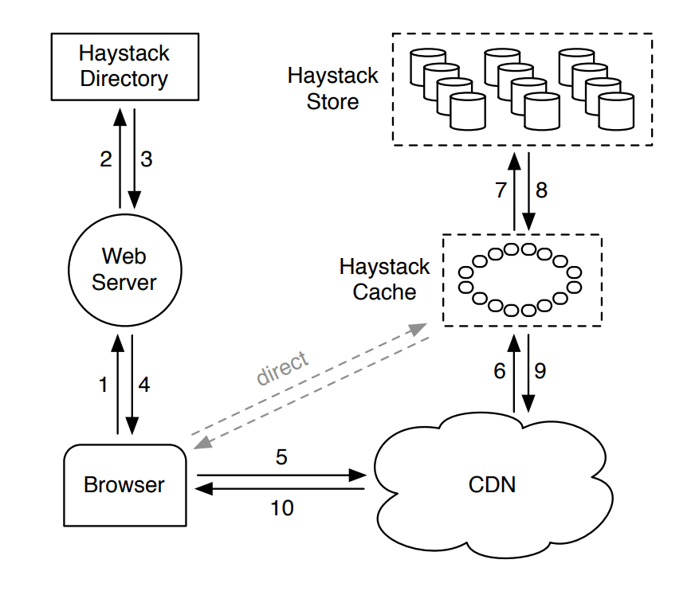
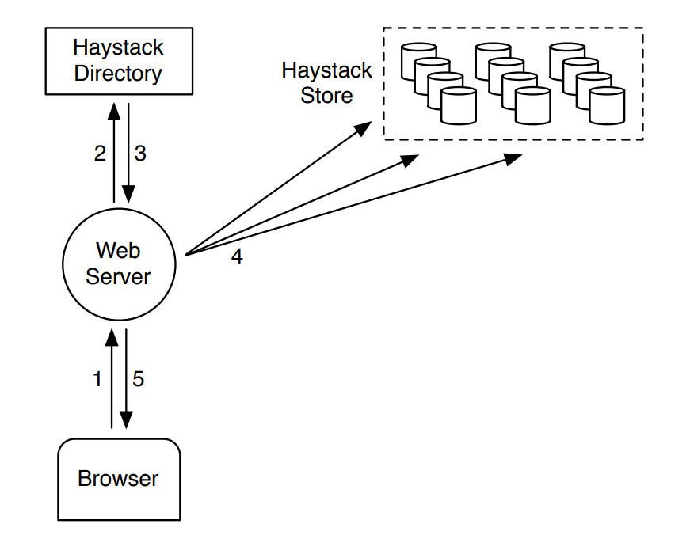

## Introduction

## Architecture

The Haystack architecture consists of 3 core components: the Haystack Store, Haystack Directory, and Haystack Cache.
The Store encapsulates the persistent storage system for photos and is the
only component that manages the filesystem metadata
for photos. We organize the Store’s capacity by physical volumes.
The Directory maintains the logical to physical mapping
along with other application metadata, such as the logical volume where each photo resides and the logical
volumes with free space. The Cache functions as our internal CDN, which shelters the Store from requests for
the most popular photos and provides insulation if upstream CDN nodes fail and need to refetch content.

Below figure illustrates how the Store, Directory, and
Cache components fit into the canonical interactions between a user’s browser, web server, CDN, and storage
system. In the Haystack architecture the browser can be
directed to either the CDN or the Cache. Note that while
the Cache is essentially a CDN, to avoid confusion we
use ‘CDN’ to refer to external systems and ‘Cache’ to
refer to our internal one that caches photos. Having an
internal caching infrastructure gives us the ability to reduce our dependence on external CDNs.

When a user visits a page the web server uses the Directory to construct a URL for each photo. The URL
contains several pieces of information, each piece corresponding to the sequence of steps from when a user’s
browser contacts the CDN (or Cache) to ultimately retrieving a photo from a machine in the Store.

The CDN can lookup the photo
internally using only the last part of the URL: the logical
volume and the photo id. If the CDN cannot locate the
photo then it strips the CDN address from the URL and
contacts the Cache. The Cache does a similar lookup to
find the photo and, on a miss, strips the Cache address
from the URL and requests the photo from the specified
Store machine. Photo requests that go directly to the
Cache have a similar workflow except that the URL is
missing the CDN specific information.

Below figure illustrates the upload path in Haystack.
When a user uploads a photo she first sends the data to a
web server. Next, that server requests a write-enabled
logical volume from the Directory. Finally, the web
server assigns a unique id to the photo and uploads it
to each of the physical volumes mapped to the assigned logical volume.

###  Haystack Directory
    
The Directory serves four main functions. 
- First, it provides a mapping from logical volumes to physical volumes. Web servers use this mapping when uploading photos and also when constructing the image URLs for a page request. 
- Second, the Directory load balances writes across logical volumes and reads across physical volumes. 
- Third, the Directory determines whether a photo request should be handled by the CDN or by the Cache. This functionality lets us adjust our dependence on CDNs. 
- Fourth, the Directory identifies those logical volumes that are read-only either because of operational reasons or because those volumes have reached their storage capacity. We mark volumes as read-only at the granularity of machines for operational ease.

### Haystack Cache

The Cache receives HTTP requests for photos from CDNs and also directly from users’ browsers. 
We organize the Cache as a distributed hash table and use a photo’s id as the key to locate cached data. 
If the Cache cannot immediately respond to the request, then the Cache fetches the photo from the Store machine identified in the URL and replies to either the CDN or the user’s browser as appropriate.

It caches a photo only if two conditions are met: (a) the request comes directly from a user and not the CDN and (b) the photo is fetched from a writeenabled Store machine. 

The justification for the first condition is that our experience with the NFS-based design showed post-CDN caching is ineffective as it is unlikely that a request that misses in the CDN would hit in our internal cache. 
The reasoning for the second is indirect.

### Haystack Store

The interface to Store machines is intentionally basic.
Reads make very specific and well-contained requests asking for a photo with a given id, for a certain logical volume, and from a particular physical Store machine.
The machine returns the photo if it is found. Otherwise, the machine returns an error.
Each Store machine manages multiple physical volumes. 

### Index File

Store machines use an important optimization—the index file—when rebooting. 
While in theory a machine can reconstruct its in-memory mappings by reading all of its physical volumes, doing so is time-consuming as the amount of data (terabytes worth) has to all be read from disk. 
Index files allow a Store machine to build its in-memory mappings quickly, shortening restart time.

Store machines maintain an index file for each of their volumes. 
The index file is a checkpoint of the inmemory data structures used to locate needles efficiently on disk. 
An index file’s layout is similar to a volume file’s, containing a superblock followed by a sequence of index records corresponding to each needle in the superblock. 
These records must appear in the same order as the corresponding needles appear in the volume file.

## Optimizations

### Compaction

Compaction is an online operation that reclaims the space used by deleted and duplicate needles (needles with the same key and alternate key). 
A Store machine compacts a volume file by copying needles into a new file while skipping any duplicate or deleted entries. During compaction, deletes go to both files. 
Once this procedure reaches the end of the file, it blocks any further modifications to the volume and atomically swaps the files and in-memory structures.
We use compaction to free up space from deleted photos. 
The pattern for deletes is similar to photo views: young photos are a lot more likely to be deleted.

### Saving more memory

As described, a Store machine maintains an in-memory data structure that includes flags, but our current system only uses the flags field to mark a needle as deleted. 
We eliminate the need for an in-memory representation of flags by setting the offset to be 0 for deleted photos. 
In addition, Store machines do not keep track of cookie values in main memory and instead check the supplied cookie after reading a needle from disk. 
Store machines reduce their main memory footprints by 20% through these two techniques.

### Batch upload

Since disks are generally better at performing large sequential writes instead of small random writes, we batch uploads together when possible. 
Fortunately, many users upload entire albums to Facebook instead of single pictures, providing an obvious opportunity to batch the photos in an album together. 

## References

1. [Finding a needle in Haystack: Facebook’s photo storage](https://www.usenix.org/legacy/event/osdi10/tech/full_papers/Beaver.pdf)
2. [Finding a Needle in a Haystack: An Image Processing Approach](https://evoq-eval.siam.org/Portals/0/Publications/SIURO/Vol6/Finding_a_Needle_in_a_Haystack.pdf?ver=2018-04-06-151851-393)
3. [Finding a Needle in a Haystack – Meaning, Origin and Usage](https://english-grammar-lessons.com/finding-a-needle-in-a-haystack-meaning/)