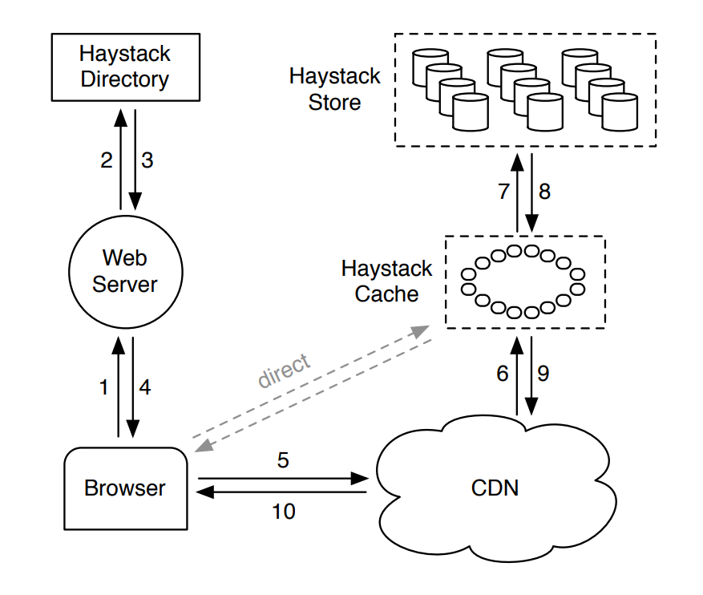
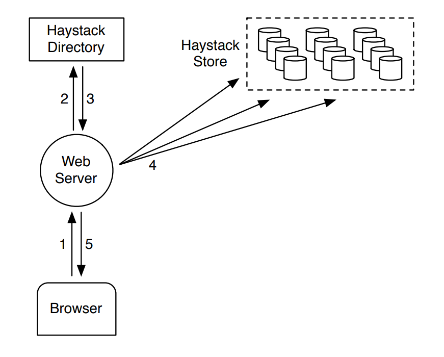

## Introduction

## Architecture

Haystack 架构包含三个核心组件：Haystack Store、Haystack Directory 和 Haystack Cache。
Store 封装了照片的持久化存储系统，是唯一管理照片文件系统元数据的组件。
我们通过 **physical volume** 来组织 Store 的容量。
Directory 维护逻辑到物理的映射以及其他应用程序元数据，例如每张照片所在的 logical volume 以及有空闲空间的 logical volume。
Cache 充当内部 CDN，保护 Store 免受最热门照片请求的影响，并在上游 CDN 节点故障需要重新获取内容时提供隔离。

下图说明了 Store、Directory 和 Cache 组件如何融入用户浏览器、Web 服务器、CDN 和存储系统之间的标准交互流程。
在 Haystack 架构中，浏览器可以被定向到 CDN 或 Cache。
注意，虽然 Cache 本质上是一个 CDN，但为避免混淆，我们使用 'CDN' 指代外部系统，使用 'Cache' 指代我们内部用于缓存照片的系统。
拥有内部缓存基础设施使我们能够减少对外部 CDN 的依赖。

当用户访问页面时，Web 服务器使用 Directory 为每张照片构建一个 URL。
该 URL 包含多个信息片段，每个片段对应从用户浏览器联系 CDN（或 Cache）到最终从 Store 机器检索照片的步骤序列。

CDN 仅使用 URL 的最后一部分（logical volume 和 photo id）即可在内部查找照片。
如果 CDN 无法找到照片，它会剥离 URL 中的 CDN 地址并联系 Cache。
Cache 执行类似的查找来找到照片，如果未命中，则剥离 URL 中的 Cache 地址并从指定的 Store 机器请求照片。
直接发送到 Cache 的照片请求具有类似的工作流程，只是 URL 缺少 CDN 特定的信息。

下图说明了 Haystack 中的上传路径。
当用户上传照片时，她首先将数据发送到 Web 服务器。
接着，该服务器向 Directory 请求一个可写入的 logical volume。
最后，Web 服务器为照片分配一个唯一 id，并将其上传到映射到该 logical volume 的每个 physical volume。

### Haystack Directory

Directory 提供四个主要功能。

- 首先，它提供从 logical volume 到 physical volume 的映射。Web 服务器在上传照片以及为页面请求构建图片 URL 时使用此映射。
- 其次，Directory 在 logical volume 之间进行写入负载均衡，并在 physical volume 之间进行读取负载均衡。
- 第三，Directory 确定照片请求应由 CDN 还是 Cache 处理。此功能让我们能够调整对 CDN 的依赖程度。
- 第四，Directory 识别那些由于操作原因或已达到存储容量而变为只读的 logical volume。为便于操作，我们以机器为粒度将 volume 标记为只读。

### Haystack Cache

Cache 接收来自 CDN 以及直接来自用户浏览器的 HTTP 照片请求。
我们将 Cache 组织为分布式哈希表，使用照片的 id 作为键来定位缓存数据。
如果 Cache 无法立即响应请求，则 Cache 从 URL 中指定的 Store 机器获取照片，并相应地向 CDN 或用户浏览器回复。

仅当满足两个条件时才缓存照片：（a）请求直接来自用户而非 CDN，并且（b）照片是从可写入的 Store 机器获取的。

第一个条件的理由是，我们基于 NFS 的设计经验表明，CDN 之后的缓存效果不佳，因为在 CDN 中未命中的请求不太可能击中我们的内部缓存。
第二个条件的理由则是间接的。

### Haystack Store

Store 机器的接口有意设计得简单。
读取操作发出非常具体且受限的请求，要求提供具有给定 id、属于某个 logical volume 且来自特定物理 Store 机器的照片。
如果找到则返回照片，否则返回错误。
每个 Store 机器管理多个 physical volume。

### Index File

Store 机器在重启时使用一个重要的优化手段——index file。
虽然理论上机器可以通过读取其所有 physical volume 来重建内存中的映射，但这非常耗时，因为需要从磁盘读取大量数据（TB 级别）。
Index file 允许 Store 机器快速构建内存映射，缩短重启时间。

Store 机器为其每个 volume 维护一个 index file。
Index file 是用于在磁盘上高效定位 needle 的内存数据结构的检查点。
Index file 的布局类似于 volume file，包含一个 superblock，后跟一系列与 superblock 中每个 needle 对应的 index record。
这些 record 必须按照对应 needle 在 volume file 中出现的相同顺序排列。

## Optimizations

### Compaction

Compaction 是一种在线操作，回收已删除和重复 needle（具有相同 key 和 alternate key 的 needle）占用的空间。
Store 机器通过将 needle 复制到新文件并跳过任何重复或已删除条目来压缩 volume file。在压缩期间，删除操作同时作用于两个文件。
一旦此过程到达文件末尾，它会阻止对 volume 的任何进一步修改，并原子地交换文件和内存结构。
我们使用 compaction 来释放已删除照片的空间。
删除模式类似于照片查看模式：新照片被删除的可能性更大。

### Saving more memory

如前所述，Store 机器维护包含标志位的内存数据结构，但我们当前系统仅使用标志位字段将 needle 标记为已删除。
我们通过将已删除照片的偏移量设置为 0 来消除内存中表示标志位的需要。
此外，Store 机器不在主内存中跟踪 cookie 值，而是在从磁盘读取 needle 后检查提供的 cookie。
通过这两种技术，Store 机器将其主内存占用减少了 20%。

### Batch upload

由于磁盘通常擅长执行大型顺序写入而非小型随机写入，我们尽可能批量上传。
幸运的是，许多用户将整个相册而非单张照片上传到 Facebook，这为将相册中的照片批处理在一起提供了明显的机会。

## References

1. [Finding a needle in Haystack: Facebook's photo storage](https://www.usenix.org/legacy/event/osdi10/tech/full_papers/Beaver.pdf)
2. [Finding a Needle in a Haystack: An Image Processing Approach](https://evoq-eval.siam.org/Portals/0/Publications/SIURO/Vol6/Finding_a_Needle_in_a_Haystack.pdf?ver=2018-04-06-151851-393)
3. [Finding a Needle in a Haystack – Meaning, Origin and Usage](https://english-grammar-lessons.com/finding-a-needle-in-a-haystack-meaning/)
