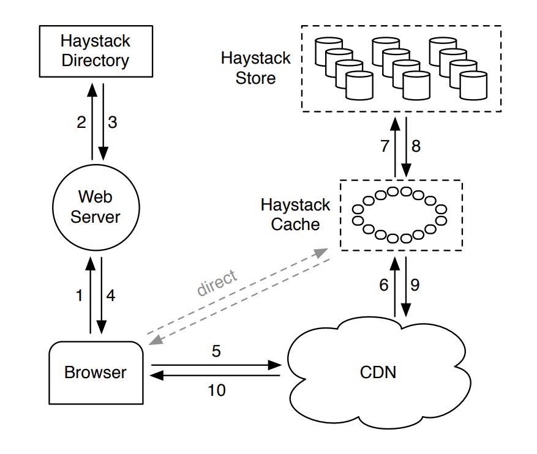
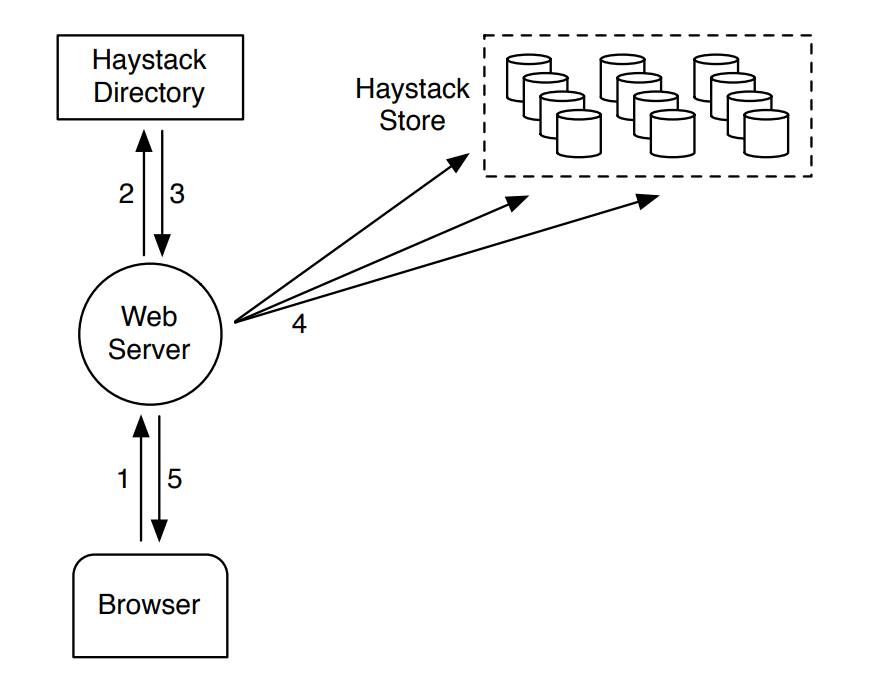

## Introduction

## Architecture

Haystack 架构由 3 个核心组件组成：Haystack Store、Haystack Directory 和 Haystack Cache。
Store 封装了照片的持久化存储系统，并且是唯一管理照片文件系统元数据的组件。
我们按*物理卷（physical volumes）*组织 Store 的容量。
Directory 维护逻辑到物理的映射，以及其他应用元数据，例如每张照片所在的逻辑卷，以及有空闲空间的逻辑卷。
Cache 充当我们的内部 CDN，它使 Store 免于处理最热门照片的请求，并在上游 CDN 节点故障需要重新获取内容时提供隔离（insulation）。

下图展示了 Store、Directory 和 Cache 组件如何融入用户浏览器、Web 服务器、CDN 与存储系统之间的典型交互。
在 Haystack 架构中，浏览器可被定向到 CDN 或 Cache。
注意，虽然 Cache 本质上是一个 CDN，但为避免混淆，我们用“CDN”指外部系统，用“Cache”指我们内部缓存照片的那个。
拥有内部缓存基础设施使我们能够减少对外部 CDN 的依赖。

当用户访问一个页面时，Web 服务器使用 Directory 为每张照片构造一个 URL。
该 URL 包含若干信息片段，每片对应从用户浏览器联系 CDN（或 Cache）到最终从 Store 中某台机器取回照片的一系列步骤。

CDN 可以仅使用 URL 的最后部分——逻辑卷与照片 id——在内部查找照片。
如果 CDN 无法定位照片，它就从 URL 中去掉 CDN 地址并联系 Cache。
Cache 做类似的查找以寻找照片，未命中时则从 URL 去掉 Cache 地址，并向指定的 Store 机器请求照片。
直接发往 Cache 的照片请求工作流程类似，只是 URL 缺少 CDN 特定的信息。

下图展示了 Haystack 中的上传路径。
当用户上传照片时，她首先把数据发给一个 Web 服务器。
接着，该服务器向 Directory 请求一个可写（write-enabled）的逻辑卷。
最后，Web 服务器为照片分配一个唯一 id，并将其上传到映射到所分配逻辑卷的每个物理卷。

### Haystack Directory

Directory 承担四个主要功能。

- 第一，它提供从逻辑卷到物理卷的映射。Web 服务器在上传照片以及为页面请求构造图像 URL 时使用该映射。
- 第二，Directory 在逻辑卷间均衡写负载，在物理卷间均衡读负载。
- 第三，Directory 决定一个照片请求应由 CDN 还是由 Cache 处理。这一功能让我们能调整对 CDN 的依赖。
- 第四，Directory 识别那些只读的逻辑卷，原因可能是运维需要，也可能是这些卷已达存储容量。为运维方便，我们以机器粒度将卷标记为只读。

### Haystack Cache

Cache 接收来自 CDN 以及直接来自用户浏览器的 HTTP 照片请求。
我们把 Cache 组织为一个分布式哈希表（distributed hash table），并用照片 id 作为键来定位缓存数据。
如果 Cache 无法立即响应请求，则它从 URL 标识的 Store 机器获取照片，并视情况回复 CDN 或用户浏览器。

只有在两个条件都满足时它才缓存照片：(a) 请求直接来自用户而非 CDN；(b) 照片来自一台可写（write-enabled）的 Store 机器。

第一个条件的理由是：我们在基于 NFS 的设计中的经验表明，CDN 之后的缓存无效，因为 CDN 未命中的请求不太可能命中我们的内部缓存。
第二个条件的理由则是间接的。

### Haystack Store

Store 机器的接口刻意保持简单。
读请求提出非常具体且自包含的请求：要求给定 id、特定逻辑卷、来自特定物理 Store 机器的照片。
如果找到，机器返回照片；否则返回错误。
每台 Store 机器管理多个物理卷。

### Index Files

Store 机器在重启时使用一个重要的优化——索引文件（index file）。
虽然理论上一台机器可以通过读取其所有物理卷来重建内存映射，但这样做很耗时，因为必须将所有数据（数 TB 量级）从磁盘读出。
索引文件让 Store 机器能够快速构建其内存映射，缩短重启时间。

Store 机器为它的每个卷维护一个索引文件。
索引文件是用于在磁盘上高效定位 needle 的内存数据结构的检查点。
索引文件的布局类似于卷文件：包含一个超级块（superblock），后跟与超级块中每个 needle 对应的索引记录序列。
这些记录的出现顺序必须与对应 needle 在卷文件中的出现顺序相同。

## Optimization

### Compression

Compaction 是一种在线操作，回收被删除和重复 needle（具有相同键和备用键的 needle）占用的空间。
Store 机器通过将 needle 复制到新文件、同时跳过任何重复或已删除条目的方式来压缩卷文件。压缩期间，删除操作同时写入两个文件。
一旦该过程到达文件末尾，它阻止对该卷的任何进一步修改，并原子地交换文件与内存结构。
我们用 Compaction 释放被删除照片占用的空间。
删除的模式与照片浏览类似：较新的照片更可能被删除。

### Saving More Memory

如前所述，Store 机器维护一个包含标志位（flags）的内存数据结构，但我们当前的系统只用 flags 字段将 needle 标记为已删除。
我们把已删除照片的偏移量（offset）设为 0，从而无需内存中表示 flags。
此外，Store 机器不在主内存中跟踪 cookie 值，而是在从磁盘读取一个 needle 后检查所提供的 cookie。
Store 机器通过这两项技术将其主内存占用减少了 20%。

### Batch Upload

由于磁盘通常更擅长大顺序写而非小随机写，我们在可能时批量上传。
幸运的是，许多用户向 Facebook 上传整个相册而非单张照片，这提供了将相册中照片批量处理的明显机会。

## Links

- [Architecture](/docs/CS/Distributed/Architecture.md)
- [Azure](/docs/CS/Distributed/Azure.md)
- [Bigtable](/docs/CS/Distributed/Bigtable.md)
- [Borg](/docs/CS/Distributed/Borg.md)
- [Byzantine](/docs/CS/Distributed/Byzantine.md)
- [CAP](/docs/CS/Distributed/CAP.md)

## References

1. [Finding a needle in Haystack: Facebook’s photo storage](https://www.usenix.org/legacy/event/osdi10/tech/full_papers/Beaver.pdf)
2. [Finding a Needle in a Haystack: An Image Processing Approach](https://evoq-eval.siam.org/Portals/0/Publications/SIURO/Vol6/Finding_a_Needle_in_a_Haystack.pdf?ver=2018-04-06-151851-393)
3. [Finding a Needle in a Haystack – Meaning, Origin and Usage](https://english-grammar-lessons.com/finding-a-needle-in-a-haystack-meaning/)
