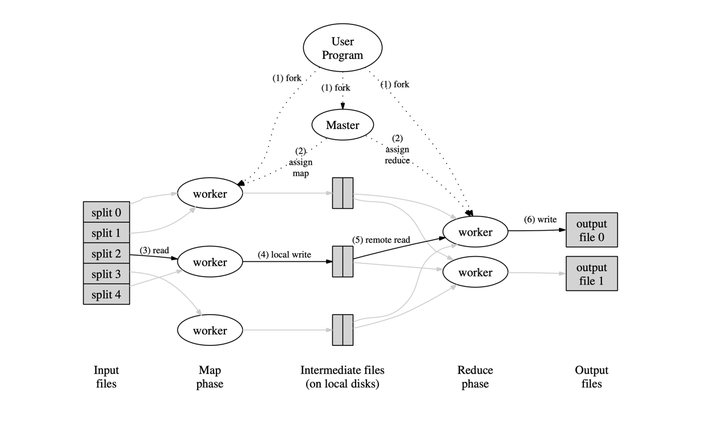

## Introduction

MapReduce 是一种编程模型及其相关实现，用于处理和生成大规模数据集。
用户指定一个 *map* 函数，用于处理键值对以生成一组中间键值对，以及一个 *reduce* 函数，用于合并与同一中间键关联的所有中间值。

以这种函数式风格编写的程序会自动并行化，并在大型商用机器集群上执行。
运行时系统负责处理输入数据的分区、跨机器调度程序执行、处理机器故障以及管理所需的机器间通信等细节。
这使得没有任何并行和分布式系统经验的程序员也能轻松利用大型分布式系统的资源。

阿里的 ODPS 就是基于 MapReduce 底层技术架构进行封装实现。

## Programming Model

计算接受一组输入键值对，并产生一组输出键值对。
MapReduce 库的用户将计算表达为两个函数：*Map* 和 *Reduce*。

*Map*，由用户编写，接受一个输入对并产生一组中间键值对。
MapReduce 库将与同一中间键 I 关联的所有中间值分组，并将它们传递给 *Reduce* 函数。

*Reduce* 函数，也由用户编写，接受一个中间键 I 和该键的一组值。
它将这些值合并起来，形成可能更小的一组值。
通常每次 Reduce 调用只产生零个或一个输出值。
中间值通过迭代器提供给用户的 reduce 函数。
这使我们能够处理大到无法放入内存的值列表。

从概念上讲，用户提供的 map 和 reduce 函数具有关联的类型：

```
    map (k1,v1) → list(k2,v2)
    reduce (k2,list(v2)) → list(v2)
```

即，输入键值对来自与输出键值对不同域。
此外，中间键值对与输出键值对来自相同域。

以下是几个可以轻松表达为 MapReduce 计算的有趣程序示例。

- 分布式 Grep
- URL 访问频率计数
- 反向 Web 链接图
- 每个主机的词向量
- 倒排索引
- 分布式排序

## Dataflow

Map 调用通过自动将输入数据分割成 M 个分片分布到多台机器上。
输入分片可以由不同的机器并行处理。
Reduce 调用通过使用分区函数（如 *hash(key)* mod R）将中间键空间分割成 R 个片段来分布。
分区数 (R) 和分区函数由用户指定。

下图显示了 MapReduce 操作在我们的实现中的总体流程。
当用户程序调用 MapReduce 函数时，发生以下操作序列（图 1 中的编号标签对应于下面列表中的编号）：

1. 用户程序中的 MapReduce 库首先将输入文件分割成 M 个片段，通常每个片段 16-64 MB（可由用户通过可选参数控制）。
   然后它在集群的机器上启动程序的多个副本。
2. 程序的其中一个副本是特殊的——master。其余的是由 master 分配工作的 worker。
   有 M 个 map 任务和 R 个 reduce 任务需要分配。Master 挑选空闲的 worker 并为每个分配一个 map 任务或 reduce 任务。
3. 被分配 map 任务的 worker 读取相应输入分片的内容。
   它从输入数据中解析出键值对，并将每对传递给用户定义的 Map 函数。Map 函数产生的中间键值对缓存在内存中。
4. 定期地，缓存的对被写入本地磁盘，并由分区函数分割成 R 个区域。
   这些缓存对在本地磁盘上的位置被传回 master，master 负责将这些位置转发给 reduce worker。
5. 当 reduce worker 被 master 通知这些位置时，它使用远程过程调用从 map worker 的本地磁盘读取缓存的数据。
   当 reduce worker 读取完所有中间数据后，它按中间键进行排序，使得相同键的所有出现都分组在一起。
   排序是必要的，因为通常许多不同的键映射到同一个 reduce 任务。
   如果中间数据量太大而无法放入内存，则使用外部排序。
6. Reduce worker 遍历排序后的中间数据，对于遇到的每个唯一中间键，它将键和相应的中间值集合传递给用户的 Reduce 函数。
   Reduce 函数的输出被追加到此 reduce 分区的最终输出文件中。
7. 当所有 map 任务和 reduce 任务都完成后，master 唤醒用户程序。
   此时，用户程序中的 MapReduce 调用返回到用户代码。

成功完成后，mapreduce 执行的输出在 R 个输出文件中可用（每个 reduce 任务一个，文件名由用户指定）。
通常，用户不需要将这 R 个输出文件合并为一个文件——他们经常将这些文件作为输入传递给另一个 MapReduce 调用，或者由另一个能够处理分区为多个文件的输入的分布式应用程序使用。



### Master Data Structures

Master 维护几种数据结构。对于每个 map 任务和 reduce 任务，它存储状态（idle、in-progress 或 completed）和 worker 机器的标识（对于非空闲任务）。

Master 是中间文件区域位置从 map 任务传播到 reduce 任务的通道。
因此，对于每个已完成的 map 任务，master 存储该 map 任务产生的 R 个中间文件区域的位置和大小。
这些位置和大小信息在 map 任务完成时增量接收。
这些信息被增量地推送给有进行中的 reduce 任务的 worker。

#### State Information

Master 运行一个内部 HTTP 服务器，并导出一组供人查看的状态页面。
状态页面显示计算的进度，例如完成了多少任务、正在进行多少任务、输入的字节数、中间数据的字节数、输出的字节数、处理速率等。
页面还包含指向每个任务生成的标准错误和标准输出文件的链接。
用户可以使用这些数据来预测计算将花费多长时间，以及是否应向计算添加更多资源。
这些页面还可用于找出计算何时比预期慢得多。

此外，顶层状态页面显示哪些 worker 失败了，以及它们失败时正在处理哪些 map 和 reduce 任务。
此信息在尝试诊断用户代码中的错误时很有用。

#### Counter

MapReduce 库提供了一个 counter 工具来统计各种事件的发生次数。
例如，用户代码可能想要统计处理的总单词数或索引的德语文档数等。

要使用此工具，用户代码创建一个命名的 counter 对象，然后在 Map 和/或 Reduce 函数中适当地递增计数器。
例如：

```
Counter* uppercase;
uppercase = GetCounter("uppercase");

map(String name, String contents):
    for each word w in contents:
    if (IsCapitalized(w)):
        uppercase->Increment();
    EmitIntermediate(w, "1");
```

来自各个 worker 机器的 counter 值会定期传播到 master（附带在 ping 响应上）。
Master 汇总来自成功 map 和 reduce 任务的 counter 值，并在 MapReduce 操作完成时将其返回给用户代码。
当前的 counter 值也显示在 master 状态页面上，以便人类可以观察实时计算的进度。
在汇总 counter 值时，master 会消除同一 map 或 reduce 任务的重复执行的影响，以避免双重计数。
（重复执行可能来自我们使用备份任务以及由于故障而重新执行的任务。）

一些 counter 值由 MapReduce 库自动维护，例如处理的输入键值对数量和产生的输出键值对数量。

用户发现 counter 工具对于对 MapReduce 操作的行为进行 sanity check 很有用。
例如，在某些 MapReduce 操作中，用户代码可能希望确保产生的输出对数量恰好等于处理的输入对数量，
或者处理的德语文档比例在可容忍的范围内。

### Task Granularity

我们将 map 阶段细分为 M 个片段，将 reduce 阶段细分为 R 个片段。
理想情况下，M 和 R 应该远大于 worker 机器的数量。
让每个 worker 执行许多不同的任务可以改善动态负载均衡，并在 worker 失败时加快恢复速度：它已完成的许多 map 任务可以分布在所有其他 worker 机器上。

在我们的实现中，M 和 R 的大小有实际限制，因为 master 必须做出 O(M + R) 个调度决策，并在内存中维护 O(M * R) 的状态，如上所述。
（然而，内存使用的常数因子很小：O(M * R) 部分的状态包含每个 map 任务/reduce 任务对大约一字节的数据。）

此外，R 通常受到用户的约束，因为每个 reduce 任务的输出最终位于单独的输出文件中。
在实践中，我们倾向于选择 M，使得每个单独任务大约有 16 MB 到 64 MB 的输入数据（以便上述 locality 优化最有效），并且我们将 R 设为我们预期使用的 worker 机器数量的小倍数。
我们经常以 M=200,000 和 R=5,000 执行 MapReduce 计算，使用 2,000 个 worker 机器。

然而，在某些情况下，使用键的其他函数来分区数据很有用。
例如，有时输出键是 URL，我们希望同一主机的所有条目最终位于同一个输出文件中。
为了支持这样的情况，MapReduce 库的用户可以提供特殊的分区函数。
例如，使用 "hash(Hostname(urlkey)) mod R" 作为分区函数会导致来自同一主机的所有 URL 最终位于同一个输出文件中。

### Ordering Guarantees

我们保证在给定的分区内，中间键值对按键的递增顺序处理。
这个顺序保证使得易于为每个分区生成排序的输出文件，当输出文件格式需要支持基于键的高效随机访问查找，或者输出的用户发现数据已排序更方便时，这很有用。

### Combiner Function

在某些情况下，每个 map 任务产生的中间键存在大量重复，并且用户指定的 Reduce 函数是可交换和可结合的。
一个很好的例子是词频统计。由于词频往往遵循 Zipf 分布，每个 map 任务将产生数百或数千条 `<the, 1>` 形式的记录。
所有这些计数将通过网络发送到单个 reduce 任务，然后由 Reduce 函数相加得到一个个数字。
我们允许用户指定一个可选的 Combiner 函数，它在此数据通过网络发送之前执行部分合并。

Combiner 函数在每个执行 map 任务的机器上执行。
通常使用相同的代码来实现 combiner 和 reduce 函数。
Reduce 函数和 combiner 函数之间的唯一区别是 MapReduce 库如何处理函数的输出。
Reduce 函数的输出写入最终输出文件。
Combiner 函数的输出写入将发送到 reduce 任务的中间文件。
部分合并显著加速了某些类型的 MapReduce 操作。

### Input and Output Types

MapReduce 库支持以几种不同格式读取输入数据。
例如，"text"模式输入将每行视为一个键值对：键是文件中的偏移量，值是行的内容。
另一种常见的支持格式存储按键排序的键值对序列。
每种输入类型实现都知道如何将自身分割成有意义的作用于单独 map 任务的范围。
用户可以通过提供简单 reader 接口的实现来添加对新输入类型的支持，尽管大多数用户只使用少量预定义的输入类型中的一种。
Reader 不一定需要提供从文件读取的数据。
例如，可以轻松定义一个从数据库或内存映射的数据结构中读取记录的 reader。
类似地，我们支持一组用于以不同格式生成数据的输出类型，并且用户代码可以轻松添加对新输出类型的支持。

### Side-effects

在某些情况下，MapReduce 的用户发现从其 map 和/或 reduce 运算符生成辅助文件作为额外输出很方便。
我们依赖应用程序编写者使此类副作用具有原子性和幂等性。
通常应用程序写入临时文件，并在完全生成后原子地重命名该文件。
我们不提供对由单个任务生成的多个输出文件的原子两阶段提交的支持。
因此，产生具有跨文件一致性要求的多个输出文件的任务应该是确定性的。
这个限制在实践中从未成为问题。

### Locality

网络带宽是我们计算环境中相对稀缺的资源。
我们通过利用输入数据（由 [GFS](/docs/CS/Distributed/GFS.md) 管理）存储在组成集群的机器的本地磁盘上这一事实来节省网络带宽。
MapReduce master 考虑输入文件的位置信息，并尝试在包含相应输入数据副本的机器上调度 map 任务。
如果做不到，它会尝试在靠近该任务输入数据副本的位置调度 map 任务（例如，在与包含数据的机器位于同一网络交换机上的 worker 机器上）。
当在集群中相当大比例的 worker 上运行大型 MapReduce 操作时，大多数输入数据在本地读取，不消耗网络带宽。

### Backup Tasks

延长 MapReduce 操作总时间的常见原因之一是"落伍者"：一台机器花费异常长的时间来完成计算中最后几个 map 或 reduce 任务之一。
落伍者可能由多种原因引起。例如，磁盘有问题的机器可能频繁出现可纠正的错误，将其读取性能从 30 MB/s 降低到 1 MB/s。
集群调度系统可能在该机器上调度了其他任务，导致其由于 CPU、内存、本地磁盘或网络带宽的竞争而更慢地执行 MapReduce 代码。
我们最近遇到的一个问题是机器初始化代码中的一个错误导致处理器缓存被禁用；受影响的机器上的计算速度下降超过一百倍。

我们有一个通用机制来缓解落伍者问题。
当 MapReduce 操作接近完成时，master 调度剩余进行中任务的备份执行。
只要主执行或备份执行完成，任务就被标记为已完成。
我们已经调整了这个机制，使其通常将操作使用的计算资源增加不超过几个百分点。
我们发现这显著减少了完成大型 MapReduce 操作的时间。
例如，当备份任务机制被禁用时，排序程序完成所需的时间增加了 44%。

### Skipping Bad Records

有时用户代码中存在错误，导致 Map 或 Reduce 函数在某些记录上确定性崩溃。
这样的错误阻止 MapReduce 操作完成。
通常的做法是修复错误，但有时这是不可行的；也许错误在第三方库中，其源代码不可用。
此外，有时忽略几条记录是可以接受的，例如在对大数据集进行统计分析时。
我们提供了一种可选的执行模式，其中 MapReduce 库检测哪些记录导致确定性崩溃，并跳过这些记录以继续前进。
每个 worker 进程安装一个信号处理器，用于捕获段错误和总线错误。
在调用用户 Map 或 Reduce 操作之前，MapReduce 库将参数的序列号存储在全局变量中。
如果用户代码产生信号，信号处理器向 MapReduce master 发送一个包含序列号的"最后喘息"UDP 数据包。
当 master 在特定记录上看到超过一次失败时，它指示在发出相应 Map 或 Reduce 任务的下一次重新执行时应跳过该记录。

## Fault Tolerance

### Worker Failure

Master 定期 ping 每个 worker。
如果在特定时间内未收到来自某个 worker 的响应，master 将该 worker 标记为失败。
该 worker 完成的任何 map 任务被重置回初始 idle 状态，因此变得有资格在其他 worker 上调度。
类似地，失败 worker 上任何进行中的 map 任务或 reduce 任务也被重置为 idle 并有资格重新调度。

已完成的 map 任务在失败时被重新执行，因为它们的输出存储在失败机器的本地磁盘上，因此不可访问。
已完成的 reduce 任务不需要重新执行，因为它们的输出存储在全局文件系统中。

当 map 任务首先由 worker A 执行，然后由 worker B 执行（因为 A 失败）时，所有执行 reduce 任务的 worker 都会收到重新执行的通知。
任何尚未从 worker A 读取数据的 reduce 任务将从 worker B 读取数据。
MapReduce 能够应对大规模 worker 故障。
例如，在一次 MapReduce 操作期间，运行中集群上的网络维护导致每组 80 台机器同时变得不可达数分钟。
MapReduce master 只是重新执行了不可达 worker 机器完成的工作，并继续前进，最终完成了 MapReduce 操作。

### Master Failure

使 master 定期写入上述 master 数据结构的检查点很容易。
如果 master 任务死亡，可以从最后一个检查点状态启动一个新的副本。
然而，鉴于只有一个 master，其失败的可能性不大；因此我们当前的实现在 master 失败时中止 MapReduce 计算。
客户端可以检查此条件并在需要时重试 MapReduce 操作。

绝大多数 map 和 reduce 运算符是确定性的，并且我们的语义在这种情况下等同于顺序执行，这一事实使程序员很容易推理其程序的行为。

### Local Execution

调试 Map 或 Reduce 函数中的问题可能很棘手，因为实际计算发生在分布式系统中，通常在数千台机器上，工作分配决策由 master 动态做出。
为了便于调试、性能分析和小规模测试，我们开发了 MapReduce 库的替代实现，该实现在本地机器上顺序执行 MapReduce 操作的所有工作。
为用户提供了控制，以便计算可以限制在特定的 map 任务。
用户使用特殊标志调用其程序，然后可以轻松使用他们觉得有用的任何调试或测试工具（如 gdb）。

## Summary

我们从这项工作中学到了几件事。

- 首先，限制编程模型使得并行化和分布计算以及使此类计算容错变得容易。
- 其次，网络带宽是一种稀缺资源。
  因此，我们系统中的许多优化旨在减少通过网络发送的数据量：locality 优化允许我们从本地磁盘读取数据，将中间数据的单个副本写入本地磁盘节省了网络带宽。
- 第三，冗余执行可用于减少慢速机器的影响，并处理机器故障和数据丢失。

## Links

- [Google](/docs/CS/Distributed/Google.md)
- [GFS](/docs/CS/Distributed/GFS.md)

## References

1. [MapReduce: Simplified Data Processing on Large Clusters](https://pdos.csail.mit.edu/6.824/papers/mapreduce.pdf)
2. [MapReduce: A major step backwards](https://dsf.berkeley.edu/cs286/papers/backwards-vertica2008.pdf)
3. [MapReduce: A Flexible Data Processing Tool](https://www.cs.princeton.edu/courses/archive/spr11/cos448/web/docs/week10_reading2.pdf)
4. [MapReduce and Parallel DBMSs-Friends or Foes](https://webpages.charlotte.edu/sakella/courses/cloud/papers/StonebrakerACMJan2010.pdf)
5. [A Comparision of Approaches to Large-Scale Data Analysis](https://www3.nd.edu/~dthain/courses/cse40771/spring2010/benchmarks-sigmod09.pdf)
