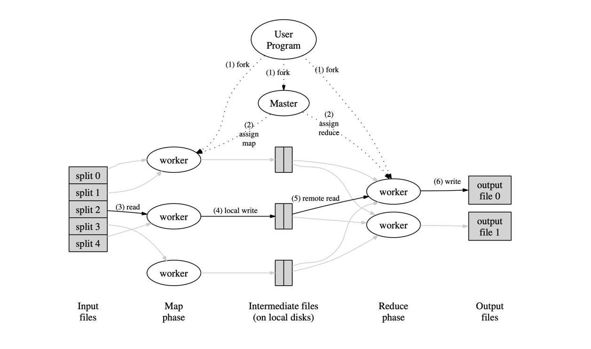

## Introduction

MapReduce 是一个编程模型以及与之相关的实现，用于处理并生成大数据集。用户指定一个 *map* 函数来处理一个键/值对以生成一组中间键/值对，以及一个 *reduce* 函数，用来合并（merge）与同一个中间键关联的所有中间值。

以这种函数式风格编写的程序会自动地被并行化并在一个由商用机器组成的大集群上执行。运行时系统负责输入数据的划分、程序在机器集合上的执行调度、机器故障的处理，以及所需的机器间通信的管理。这使得没有任何并行和分布式系统经验的程序员也能轻松地利用大型分布式系统的资源。

阿里的ODPS就是基于MapReduce底层技术架构进行封装实现

## 编程模型

该计算接受一组输入键/值对，并产生一组输出键/值对。MapReduce 库的用户将该计算表达为两个函数：*Map* 和 *Reduce*。

*Map* 由用户编写，接受一个输入对并生成一组中间键/值对。MapReduce 库将所有与同一个中间键 I 关联的中间值分组在一起，并将它们传递给 *Reduce* 函数。

*Reduce* 函数同样由用户编写，接受一个中间键 I 以及该键对应的一组值。它将这些值合并在一起，形成一个可能更小的值集合。通常每次 Reduce 调用只产生零个或一个输出值。中间值通过一个迭代器（iterator）提供给用户的 reduce 函数。这使我们能够处理那些大到无法装入内存的值列表。

概念上，用户提供的 map 和 reduce 函数具有相关的类型：

```
    map (k1,v1) → list(k2,v2)
    reduce (k2,list(v2)) → list(v2)
```

也就是说，输入的键和值取自与输出的键和值不同的域（domain）。此外，中间键和值取自与输出键和值相同的域。

这里有几个可以轻易表达为 MapReduce 计算的有趣程序的简单示例。

- 分布式 Grep
- URL 访问频率统计
- 反向 Web 链接图
- 每个主机的词向量
- 倒排索引
- 分布式排序

## 数据流

Map 调用通过将输入数据自动划分为 M 个分片（split）而分布到多台机器上。这些输入分片可以由不同的机器并行处理。Reduce 调用通过使用一个划分函数（例如 *hash(key)* mod R）将中间键空间划分为 R 块来分布。分块的数量（R）和划分函数由用户指定。

下图展示了我们实现中一次 MapReduce 操作的整体流程。当用户程序调用 MapReduce 函数时，发生以下动作序列（图 1 中的编号标签对应于下面列表中的编号）：

1. 用户程序中的 MapReduce 库首先将输入文件拆分为 M 个分片，每个分片通常 16 到 64 兆字节（MB）（可通过一个可选参数由用户控制）。然后它在一个机器集群上启动该程序的许多副本。
2. 这些程序副本中有一个是特殊的——master。其余的是被 master 分配工作的 worker。有 M 个 map 任务和 R 个 reduce 任务需要分配。Master 挑选空闲的 worker，并为每个分配一个 map 任务或一个 reduce 任务。
3. 被分配了一个 map 任务的 worker 读取相应输入分片的内容。它从输入数据中解析出键/值对，并将每一对传递给用户定义的 Map 函数。Map 函数产生的中间键/值对被缓冲在内存中。
4. 周期性地，这些被缓冲的对被写入本地磁盘，并由划分函数划分为 R 个区域。这些被缓冲的对在本地磁盘上的位置被回传给 master，master 负责将这些位置转发给 reduce worker。
5. 当一个 reduce worker 被 master 通知这些位置后，它使用远程过程调用（RPC）从 map worker 的本地磁盘读取被缓冲的数据。当一个 reduce worker 读完了所有中间数据后，它按中间键对数据进行排序，使得同一个键的所有出现都聚集在一起。排序是必要的，因为通常许多不同的键会映射到同一个 reduce 任务。如果中间数据量太大而无法装入内存，则使用外部排序（external sort）。
6. Reduce worker 遍历排序后的中间数据，对于遇到的每个唯一中间键，它将键和相应的一组中间值传递给用户的 Reduce 函数。Reduce 函数的输出被追加到这个 reduce 分区的最后一个输出文件中。
7. 当所有的 map 任务和 reduce 任务都完成时，master 唤醒用户程序。此时，用户程序中的 MapReduce 调用返回到用户代码。

成功完成后，mapreduce 执行的输出在 R 个输出文件中可用（每个 reduce 任务一个，文件名由用户指定）。通常，用户不需要将这些 R 个输出文件合并为一个文件——它们常常被作为另一个 MapReduce 调用的输入，或者被另一个能够处理划分为多个文件的输入的分布式应用使用。



### Master 数据结构

Master 维护若干数据结构。对于每个 map 任务和 reduce 任务，它存储其状态（空闲、进行中或已完成），以及（对于非空闲任务）worker 机器的身份。

Master 是中间文件区域的位置从 map 任务传播到 reduce 任务的管道。因此，对于每个已完成的 map 任务，master 存储该 map 任务产生的 R 个中间文件区域的位置和大小。这些位置和大小信息的更新随着 map 任务完成而收到。这些信息被增量地推送给拥有进行中 reduce 任务的 worker。

#### 状态信息

Master 运行一个内部 HTTP 服务器，并导出一组供人查看的状态页面。这些状态页面显示计算的进度，例如已完成多少个任务、正在进行多少个、输入字节数、中间数据字节数、输出字节数、处理速率等。这些页面还包含指向每个任务生成的标准错误（standard error）和标准输出（standard output）文件的链接。用户可以使用这些数据来预测计算将花费多长时间，以及是否应该向计算添加更多资源。这些页面也可以用来判断计算何时比预期慢得多。

此外，顶层状态页面显示哪些 worker 已经失败，以及它们在失败时正在处理哪些 map 和 reduce 任务。这些信息在试图诊断用户代码中的 bug 时很有用。

#### 计数器

MapReduce 库提供了一个计数器（counter）设施来统计各种事件的发生次数。例如，用户代码可能想要统计处理过的单词总数，或已索引的德文文档的数量等。

要使用这个设施，用户代码创建一个具名的计数器对象，然后在 Map 和/或 Reduce 函数中适当地递增该计数器。例如：

```
Counter* uppercase;
uppercase = GetCounter("uppercase");

map(String name, String contents):
    for each word w in contents:
    if (IsCapitalized(w)):
        uppercase->Increment();
    EmitIntermediate(w, "1");
```

来自各个 worker 机器的计数器值被周期性地传播到 master（搭载在 ping 响应上）。Master 聚合来自成功 map 和 reduce 任务的计数器值，并在 MapReduce 操作完成时将它们返回给用户代码。当前的计数器值也显示在 master 状态页面上，以便人可以观察运行中的计算进度。在聚合计数器值时，master 消除同一 map 或 reduce 任务的重复执行的影响，以避免重复计数。（重复执行可能源于我们对备用任务（backup task）的使用，以及由于故障而对任务进行的重新执行。）

一些计数器值由 MapReduce 库自动维护，例如处理过的输入键/值对的数量和产生的输出键/值对的数量。

用户发现计数器设施对于健全性检查（sanity checking）MapReduce 操作的行为很有用。例如，在某些 MapReduce 操作中，用户代码可能想要确保产生的输出对的数量恰好等于处理的输入对的数量，或者处理的德文文档的比例在已处理文档总数的某个可容忍比例之内。

### 任务粒度

我们将 map 阶段细分为 M 块，将 reduce 阶段细分为 R 块。理想情况下，M 和 R 应该远大于 worker 机器的数量。让每个 worker 执行许多不同的任务改善了动态负载均衡，并且当某个 worker 失败时也加快了恢复速度：它已完成的许多 map 任务可以被分散到所有其他 worker 机器上。

在我们的实现中，M 和 R 可以有多大是受到实际限制的，因为 master 必须做出 O(M + R) 个调度决策，并且如上所述在内存中保持 O(M * R) 的状态。（不过内存使用的常数因子很小：状态的 O(M * R) 部分由每个 map 任务/reduce 任务对大约一个字节的数据组成。）

此外，R 常常受到用户限制，因为每个 reduce 任务的输出最终在一个单独的输出文件中。在实践中，我们倾向于选择 M，使得每个单独的任务大约 16 MB 到 64 MB 的输入数据（以便上面描述的局部性优化最为有效），并让 R 为我们预期使用的 worker 机器数量的一个小的倍数。我们经常使用 M = 200,000 和 R = 5,000，使用 2,000 台 worker 机器来执行 MapReduce 计算。

然而，在某些情况下，按键的某个其他函数来划分数据是有用的。例如，有时输出键是 URL，我们希望单个主机的所有条目最终都在同一个输出文件中。为了支持这样的情况，MapReduce 库的用户可以提供一个特殊的划分函数。例如，使用 "hash(Hostname(urlkey)) mod R" 作为划分函数会使来自同一主机的所有 URL 最终都在同一个输出文件中。

### 顺序保证

我们保证在给定分区内，中间键/值对按键递增的顺序被处理。这个顺序保证使得为每个分区生成一个已排序的输出文件变得容易，这在输出文件格式需要支持按键的高效随机访问查找，或者输出的用户发现数据被排序很方便时很有用。

### Combiner 函数

在某些情况下，每个 map 任务产生的中间键存在显著的重复，并且用户指定的 Reduce 函数是可交换（commutative）和结合（associative）的。单词计数示例（第 2.1 节）就是一个很好的例子。由于词频往往遵循 Zipf 分布，每个 map 任务将产生数百或数千条 <the, 1> 形式的记录。所有这些计数都将被通过网络发送到一个单独的 reduce 任务，然后由 Reduce 函数加在一起产生一个数字。我们允许用户指定一个可选的 Combiner 函数，在将数据通过网络发送之前对它进行部分合并。

Combiner 函数在执行 map 任务的每台机器上执行。通常相同的代码被用来实现 combiner 和 reduce 函数。Reduce 函数和 combiner 函数之间的唯一区别在于 MapReduce 库如何处理该函数的输出。Reduce 函数的输出被写入最终的输出文件。Combiner 函数的输出被写入一个将被发送到 reduce 任务的中间文件。部分合并显著加快了某些类别的 MapReduce 操作。

### 输入与输出类型

MapReduce 库提供对以若干不同格式读取输入数据的支持。例如，"text" 模式输入将每一行视为一个键/值对：键是文件中的偏移量，值是该行的内容。另一种常见的受支持格式存储按键排序的一串键/值对。每个输入类型的实现都知道如何将自己拆分为有意义的区间，以作为单独的 map 任务处理（例如，text 模式的区间拆分确保区间拆分只发生在行边界处）。用户可以通过提供一个简单 reader 接口的实现来增加对新输入类型的支持，尽管大多数用户只是使用少量预定义的输入类型之一。一个 reader 不一定需要提供从文件读取的数据。例如，很容易定义一个从数据库读取记录，或从内存中映射的数据结构读取的 reader。以类似的方式，我们支持一组输出类型以不同格式产生数据，并且用户代码很容易添加对新输出类型的支持。

### 副作用

在某些情况下，MapReduce 的用户发现方便地产生辅助文件作为他们的 map 和/或 reduce 算子的额外输出。我们依赖应用编写者使这类副作用（side-effect）具有原子性和幂等性（idempotent）。通常应用写入一个临时文件，并在它完全生成后原子地重命名该文件。我们不提供对单个任务产生的多个输出文件的原子两阶段提交（two-phase commit）的支持。因此，产生具有跨文件一致性要求的多个输出文件的任务应当是确定性的。这一限制在实践中从未成为问题。

### 局部性

网络带宽是我们的计算环境中相对稀缺的资源。我们通过利用输入数据（由 [GFS](/docs/CS/Distributed/GFS.md) 管理）存储在构成我们集群的机器的本地磁盘上这一事实来节省网络带宽。MapReduce 的 master 将输入文件的位置信息考虑在内，并尝试在包含相应输入数据副本的机器上调度一个 map 任务。如果做不到，它会尝试在一个接近该任务输入数据副本的机器上调度一个 map 任务（例如，在与包含数据的机器位于同一网络交换机上的 worker 机器上）。当在一个集群的很大一部分 worker 上运行大型 MapReduce 操作时，大多数输入数据都是本地读取的，不消耗网络带宽。

### 备用任务

延长一次 MapReduce 操作总耗时的常见原因之一是"掉队者（straggler）"：一台机器花费异常长的时间来完成计算中的最后几个 map 或 reduce 任务之一。掉队者可能出于各种各样的原因出现。例如，一台有坏磁盘的机器可能经历频繁的可纠正错误，使其读性能从 30 MB/s 降到 1 MB/s。集群调度系统可能在该机器上调度了其他任务，导致它由于争用 CPU、内存、本地磁盘或网络带宽而更慢地执行 MapReduce 代码。我们最近遇到的一个问题是一段机器初始化代码中的 bug，它导致处理器缓存被禁用：受影响机器上的计算速度降低了超过一百倍。我们有一个通用的机制来缓解掉队者问题。当一次 MapReduce 操作接近完成时，master 调度剩余进行中任务的备用执行（backup executions）。当主执行或备用执行中的任意一个完成时，该任务就被标记为已完成。我们已经调优了这个机制，使得它通常使该操作使用的计算资源增加不超过百分之几。我们发现这显著减少了完成大型 MapReduce 操作的时间。作为一个例子，第 5.3 节描述的排序程序在禁用备用任务机制时需要多花 44% 的时间才能完成。

### 跳过坏记录

有时用户代码中存在 bug，导致 Map 或 Reduce 函数在某些记录上确定性地崩溃。此类 bug 会阻止一次 MapReduce 操作完成。通常的做法是修复 bug，但有时这不可行；也许 bug 存在于一个源代码不可用的第三方库中。此外，有时忽略几条记录是可以接受的，例如在对大数据集进行统计分析时。我们提供了一种可选的执行模式，其中 MapReduce 库检测哪些记录导致确定性崩溃，并跳过这些记录以取得进展。每个 worker 进程安装一个信号处理程序（signal handler），用于捕获段错误（segmentation violation）和总线错误（bus error）。在调用用户的 Map 或 Reduce 操作之前，MapReduce 库将参数的序列号存储在一个全局变量中。如果用户代码产生一个信号，信号处理程序向 MapReduce 的 master 发送一个包含该序列号的"最后喘息（last gasp）"UDP 数据包。当 master 在某个特定记录上看到多于一次失败时，它指示在下次重新执行相应的 Map 或 Reduce 任务时应该跳过该记录。

## 容错

### Worker 失效

Master 周期性地 ping（ping）每个 worker。如果在一段时间内没有收到来自某个 worker 的响应，master 就将该 worker 标记为失效。该 worker 完成的任何 map 任务都被重置回其初始的空闲状态，从而有资格被调度到其他 worker 上。类似地，在某个失效 worker 上正在进行中的任何 map 任务或 reduce 任务也被重置为空闲，并有资格被重新调度。

已完成的 map 任务在失效时被重新执行，因为它们的输出存储在失效机器的本地磁盘（local disk）上，因此无法访问。已完成的 reduce 任务不需要重新执行，因为它们的输出存储在全局文件系统中。

当一个 map 任务先由 worker A 执行，后来（因为 A 失效）由 worker B 执行时，所有执行 reduce 任务的 worker 都会被通知这次重新执行。任何尚未从 worker A 读取数据的 reduce 任务将从 worker B 读取数据。MapReduce 对大规模的 worker 失效具有弹性。例如，在一次 MapReduce 操作期间，对一个运行中的集群的网络维护导致每组 80 台机器一次不可达达几分钟。MapReduce 的 master 简单地重新执行了那些不可达 worker 机器所做的工作，并继续取得进展，最终完成了该 MapReduce 操作。

### Master 失效

很容易让 master 写出上述 master 数据结构的周期性检查点（checkpoint）。如果 master 任务死亡，可以从最后一个检查点状态启动一个新副本。然而，鉴于只有一个 master，它的失效不太可能；因此，我们当前的实现在 master 失败时中止（abort）该 MapReduce 计算。客户端可以检查这种情况，并在需要时重试该 MapReduce 操作。

我们绝大多数的 map 和 reduce 算子都是确定性的（deterministic），并且在这种情况下我们的语义等价于顺序执行这一事实，使得程序员非常容易推理他们程序的行为。

### 本地执行

在 Map 或 Reduce 函数中调试问题可能很棘手，因为实际的计算发生在一个分布式系统中，通常在几千台机器上，并且工作分配决策由 master 动态做出。为了帮助调试、性能分析和小规模测试，我们开发了 MapReduce 库的一个替代实现，它在本地机器上顺序执行一次 MapReduce 操作的所有工作。向用户提供了一些控制，以便将计算限制到特定的 map 任务。用户用一个特殊标志调用他们的程序，然后可以轻松地使用他们认为有用的任何调试或测试工具（例如 gdb）。

## 总结

我们从这项工作中学到了几件事。

- 首先，限制编程模型使得并行化和分布计算以及使此类计算容错变得容易。
- 其次，网络带宽是一种稀缺资源。因此，我们系统中的许多优化都以减少跨网络发送的数据量为目标：局部性优化使我们能够从本地磁盘读取数据，而将中间数据的单一副本写入本地磁盘节省了网络带宽。
- 第三，冗余执行（redundant execution）可以用来减少慢机器的影响，并处理机器故障和数据丢失。


## Links

- [Google](/docs/CS/Distributed/Google.md)
- [GFS](/docs/CS/Distributed/GFS.md)

## References

1. [MapReduce: Simplified Data Processing on Large Clusters](https://pdos.csail.mit.edu/6.824/papers/mapreduce.pdf)
2. [MapReduce: A major step backwards](https://dsf.berkeley.edu/cs286/papers/backwards-vertica2008.pdf)
3. [MapReduce: A Flexible Data Processing Tool](https://www.cs.princeton.edu/courses/archive/spr11/cos448/web/docs/week10_reading2.pdf)
4. [MapReduce and Parallel DBMSs-Friends or Foes](https://webpages.charlotte.edu/sakella/courses/cloud/papers/StonebrakerACMJan2010.pdf)
5. [A Comparision of Approaches to Large-Scale Data Analysis](https://www3.nd.edu/~dthain/courses/cse40771/spring2010/benchmarks-sigmod09.pdf)
